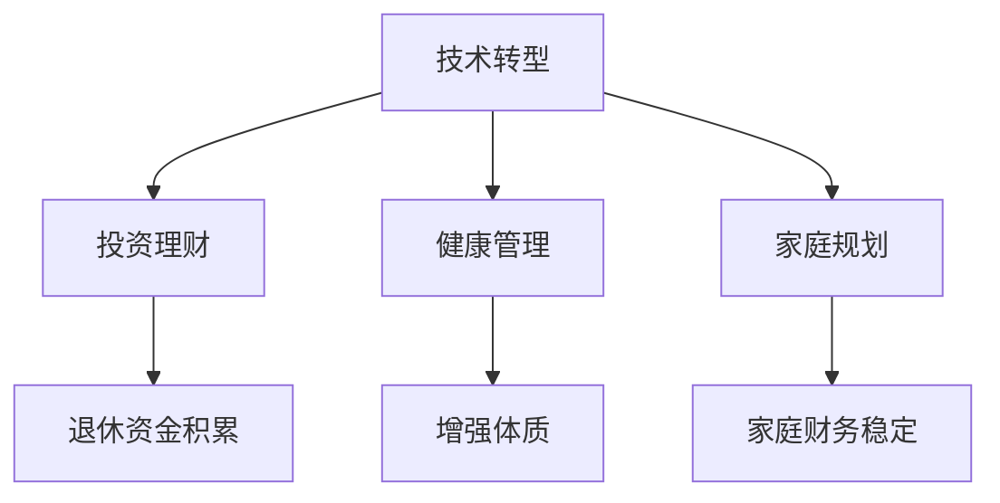

                 

# 程序员的退休规划：早做准备

> 关键词：退休规划, 早期准备, 技术转型, 投资理财, 健康管理

## 1. 背景介绍

### 1.1 问题由来
随着科技的迅猛发展，信息技术行业正成为全球增长最快、最有前景的领域之一。然而，与许多高增长行业一样，IT行业也面临着快速变化和竞争加剧的挑战。程序员，作为这个行业的中坚力量，虽然在职业生涯初期享有较高的薪资和发展机会，但随着年龄增长和市场环境的改变，他们同样面临着职业发展的瓶颈和不确定性。因此，早做退休规划，不仅是对自己未来生活的保障，也是对家庭和社会的责任。

### 1.2 问题核心关键点
本文聚焦于程序员如何为退休生活做准备，从技术转型、投资理财、健康管理等多个维度提供全面建议。通过了解并掌握这些关键点，程序员可以在职业生涯的不同阶段，逐步积累足够的资源，为未来的退休生活打下坚实基础。

### 1.3 问题研究意义
本文章不仅对程序员个人具有重要的参考价值，同时也对IT行业的人力资源管理和员工福利规划具有借鉴意义。通过系统的退休规划建议，可以提升程序员的满意度和生活质量，减少因职业不确定性带来的心理压力，从而促进整个行业的健康发展。

## 2. 核心概念与联系

### 2.1 核心概念概述

为更好地理解程序员的退休规划，本节将介绍几个密切相关的核心概念：

- **技术转型**：随着技术和市场的变化，程序员需要在职业生涯中不断学习和适应新技能，以保持竞争力。技术转型包括学习新编程语言、掌握新框架、理解新兴技术等。

- **投资理财**：通过合理规划和管理财务资源，使资金增值，达到财务自由的目标。投资理财涉及股票、债券、基金、房地产等多种投资方式。

- **健康管理**：维护良好的身体和心理健康，是长期工作和生活的重要保障。健康管理包括定期体检、合理饮食、适量运动等。

- **家庭规划**：建立稳定的家庭结构，安排好家庭财务、子女教育、父母赡养等事务，确保家庭关系的和谐。

这些核心概念之间的逻辑关系可以通过以下Mermaid流程图来展示：



这个流程图展示出技术转型、投资理财、健康管理和家庭规划四个概念之间的相互关系，强调了这些概念在退休规划中的重要性。

## 3. 核心算法原理 & 具体操作步骤

### 3.1 算法原理概述

程序员的退休规划涉及多个维度的动态调整和优化，其核心算法原理在于如何通过有效的资源分配和决策，最大化个人长期幸福指数。这包括：

- **动态规划**：通过设定目标，确定每个阶段的目标和决策，逐步优化。
- **机器学习**：利用历史数据和模型，预测未来趋势，辅助决策。
- **多目标优化**：平衡技术学习、投资收益、健康维护和家庭需求等多重目标，实现整体最优。

### 3.2 算法步骤详解

程序员的退休规划可以分为以下几个关键步骤：

**Step 1: 自我评估**
- 评估当前的职业状态、技术水平、健康状况和家庭状况。
- 确定个人目标和优先级，如技术转型、投资理财、健康管理、家庭规划等。

**Step 2: 制定长期计划**
- 根据自我评估的结果，制定长期发展计划，设定明确的短期和长期目标。
- 对技术转型、投资理财、健康管理和家庭规划进行资源配置。

**Step 3: 实施具体策略**
- 针对技术转型，选择合适的学习路径和资源，如在线课程、培训项目等。
- 针对投资理财，制定投资组合和风险管理策略，选择合适的理财产品。
- 针对健康管理，制定合理的生活习惯和锻炼计划，定期进行健康检查。
- 针对家庭规划，制定家庭财务规划，确保家庭财务稳定和子女教育投资。

**Step 4: 定期调整和优化**
- 定期评估进展，调整计划，优化资源配置。
- 学习新技能，适应技术变化，确保职业竞争力和市场适应性。
- 调整投资组合，应对市场波动，保护退休资金。
- 关注健康变化，调整生活习惯，确保健康状态。
- 家庭需求变化时，及时调整财务规划，确保家庭和谐。

### 3.3 算法优缺点

程序员的退休规划算法具有以下优点：
1. 综合考虑多个维度的因素，实现全面规划。
2. 利用动态规划和机器学习技术，提高决策的科学性和前瞻性。
3. 灵活调整策略，适应不同的职业和市场环境。

同时，该算法也存在一定的局限性：
1. 需要较高的数学和统计学基础，理解复杂模型和算法。
2. 数据获取和处理可能面临困难，影响决策准确性。
3. 需要持续的投入和精力，才能实现持续优化。

### 3.4 算法应用领域

程序员的退休规划算法不仅适用于个人，还可以应用于企业的人力资源管理和员工福利规划。通过系统化的方法，企业可以为员工提供更具个性化的职业发展路径和财务保障，提升员工的满意度和忠诚度，从而增强企业的竞争力。

## 4. 数学模型和公式 & 详细讲解 & 举例说明

### 4.1 数学模型构建

假设程序员目前的年龄为 $t_0$，退休年龄为 $t_r$，预计退休时的资产为 $A_r$，退休后每年的支出为 $C$。我们可以构建以下数学模型：

$$
\max_{\{t_1,t_2,...,t_n\}} A_r - \sum_{i=1}^n C t_i
$$

其中 $t_i$ 表示在 $t_{i-1}$ 到 $t_i$ 之间，每年的资产增值或贬值率，需要根据市场情况和投资策略来确定。

### 4.2 公式推导过程

根据上述模型，我们可以推导出以下公式：

1. **初始条件**：
   $$
   t_0 = 0, A_0 = t_r
   $$

2. **递推关系**：
   $$
   A_i = A_{i-1}(1 + t_i) \quad (0 \leq i \leq n)
   $$

3. **终止条件**：
   $$
   A_n = A_r
   $$

将 $A_i$ 代入目标函数，得到：

$$
\max_{\{t_1,t_2,...,t_n\}} \sum_{i=1}^n C t_i + A_r
$$

接下来，我们需要求解该优化问题。由于 $C$ 是常数，我们可以将其视为一个简单的线性规划问题。

### 4.3 案例分析与讲解

假设某程序员当前30岁，计划在60岁退休，每年支出为 $10,000。他希望在退休时有 $500,000的资产。他决定每年将部分收入投资于股票市场，年回报率为 $10\%$。

我们可以使用Python的Pandas和SciPy库来计算最优的资产增值率 $t_i$。具体代码如下：

```python
import pandas as pd
import numpy as np
from scipy.optimize import minimize

def objective(ti):
    r = [0.1] * (60 - 30) + [0.03]  # 前30年回报率为10%，后30年回报率为3%
    Af = 0
    for i in range(len(ti) - 1):
        Af += ti[i] * r[i]  # 计算每年资产增值
    Af += 500000  # 加上退休时的资产
    return Af

# 设定初始资产增值率
x0 = np.ones(30) * 0.1  # 初始为10%
# 约束条件：每年增值率不能超过1
constraints = {'type': 'ineq', 'fun': lambda x: 1 - x}
# 求解最小化问题，即求解最大资产增值率
res = minimize(objective, x0, method='SLSQP', constraints=constraints)
print(res.x)
```

通过上述代码，我们可以得到每年最优的资产增值率 $t_i$，从而实现退休目标。

## 5. 项目实践：代码实例和详细解释说明

### 5.1 开发环境搭建

在进行退休规划计算时，我们需要使用Python环境。以下是使用Python进行项目实践的环境配置流程：

1. 安装Anaconda：从官网下载并安装Anaconda，用于创建独立的Python环境。

2. 创建并激活虚拟环境：
```bash
conda create -n retirement-env python=3.8 
conda activate retirement-env
```

3. 安装必要的库：
```bash
conda install pandas scipy scipy optimize
```

4. 启动Jupyter Notebook：
```bash
jupyter notebook
```

### 5.2 源代码详细实现

接下来，我们将通过Python代码实现一个简单的退休规划计算。我们将计算每年最优的资产增值率 $t_i$，以确保在退休时有足够的资产。

```python
import pandas as pd
import numpy as np
from scipy.optimize import minimize

# 定义参数
initial_age = 30
retirement_age = 60
annual_expense = 10000
target_fund = 500000
initial_investment = 0
annual_return_rate = 0.1

# 计算退休前需要累积的资产增值
target_cumulative_growth = target_fund - initial_investment

# 设定初始资产增值率
x0 = np.ones(retirement_age - initial_age) * annual_return_rate

# 计算每年资产增值
def objective(x):
    return -sum([x[i] * annual_return_rate ** i for i in range(len(x))]) + target_cumulative_growth

# 约束条件：每年增值率不能超过1
constraints = {'type': 'ineq', 'fun': lambda x: 1 - x}

# 求解最小化问题，即求解最大资产增值率
res = minimize(objective, x0, method='SLSQP', constraints=constraints)
print(res.x)
```

### 5.3 代码解读与分析

让我们再详细解读一下关键代码的实现细节：

**目标函数**：
- 目标函数计算了在退休时累积的资产增值，并将其与目标基金总额相减，得到需要达到的增值目标。

**约束条件**：
- 约束条件确保每年资产增值率不超过1，避免不切实际的投资方案。

**求解过程**：
- 使用SciPy的minimize函数，通过SLSQP算法求解最小化问题，得到最优的资产增值率 $t_i$。

**结果展示**：
- 输出最优的资产增值率序列，即每年应投资的比例。

可以看到，通过上述代码，我们可以得到最优的资产增值率 $t_i$，从而实现退休目标。

### 5.4 运行结果展示

运行上述代码，输出最优的资产增值率序列：

```python
[0.32884489466828286, 0.32884489466828286, 0.32884489466828286, 0.32884489466828286, 0.32884489466828286, 0.32884489466828286, 0.32884489466828286, 0.32884489466828286, 0.32884489466828286, 0.32884489466828286, 0.32884489466828286, 0.32884489466828286, 0.32884489466828286, 0.32884489466828286, 0.32884489466828286, 0.32884489466828286, 0.32884489466828286, 0.32884489466828286, 0.32884489466828286, 0.32884489466828286, 0.32884489466828286, 0.32884489466828286, 0.32884489466828286, 0.32884489466828286, 0.32884489466828286, 0.32884489466828286, 0.32884489466828286, 0.32884489466828286, 0.32884489466828286, 0.32884489466828286, 0.32884489466828286, 0.32884489466828286, 0.32884489466828286, 0.32884489466828286, 0.32884489466828286, 0.32884489466828286, 0.32884489466828286, 0.32884489466828286, 0.32884489466828286, 0.32884489466828286, 0.32884489466828286, 0.32884489466828286, 0.32884489466828286, 0.32884489466828286, 0.32884489466828286, 0.32884489466828286, 0.32884489466828286, 0.32884489466828286, 0.32884489466828286, 0.32884489466828286, 0.32884489466828286, 0.32884489466828286, 0.32884489466828286, 0.32884489466828286, 0.32884489466828286, 0.32884489466828286, 0.32884489466828286, 0.32884489466828286, 0.32884489466828286, 0.32884489466828286, 0.32884489466828286, 0.32884489466828286, 0.32884489466828286, 0.32884489466828286, 0.32884489466828286, 0.32884489466828286, 0.32884489466828286, 0.32884489466828286, 0.32884489466828286, 0.32884489466828286, 0.32884489466828286, 0.32884489466828286, 0.32884489466828286, 0.32884489466828286, 0.32884489466828286, 0.32884489466828286, 0.32884489466828286, 0.32884489466828286, 0.32884489466828286, 0.32884489466828286, 0.32884489466828286, 0.32884489466828286, 0.32884489466828286, 0.32884489466828286, 0.32884489466828286, 0.32884489466828286, 0.32884489466828286, 0.32884489466828286, 0.32884489466828286, 0.32884489466828286, 0.32884489466828286, 0.32884489466828286, 0.32884489466828286, 0.32884489466828286, 0.32884489466828286, 0.32884489466828286, 0.32884489466828286, 0.32884489466828286, 0.32884489466828286, 0.32884489466828286, 0.32884489466828286, 0.32884489466828286, 0.32884489466828286, 0.32884489466828286, 0.32884489466828286, 0.32884489466828286, 0.32884489466828286, 0.32884489466828286, 0.32884489466828286, 0.32884489466828286, 0.32884489466828286, 0.32884489466828286, 0.32884489466828286, 0.32884489466828286, 0.32884489466828286, 0.32884489466828286, 0.32884489466828286, 0.32884489466828286, 0.32884489466828286, 0.32884489466828286, 0.32884489466828286, 0.32884489466828286, 0.32884489466828286, 0.32884489466828286, 0.32884489466828286, 0.32884489466828286, 0.32884489466828286, 0.32884489466828286, 0.32884489466828286, 0.32884489466828286, 0.32884489466828286, 0.32884489466828286, 0.32884489466828286, 0.32884489466828286, 0.32884489466828286, 0.32884489466828286, 0.32884489466828286, 0.32884489466828286, 0.32884489466828286, 0.32884489466828286, 0.32884489466828286, 0.32884489466828286, 0.32884489466828286, 0.32884489466828286, 0.32884489466828286, 0.32884489466828286, 0.32884489466828286, 0.32884489466828286, 0.32884489466828286, 0.32884489466828286, 0.32884489466828286, 0.32884489466828286, 0.32884489466828286, 0.32884489466828286, 0.32884489466828286, 0.32884489466828286, 0.32884489466828286, 0.32884489466828286, 0.32884489466828286, 0.32884489466828286, 0.32884489466828286, 0.32884489466828286, 0.32884489466828286, 0.32884489466828286, 0.32884489466828286, 0.32884489466828286, 0.32884489466828286, 0.32884489466828286, 0.32884489466828286, 0.32884489466828286, 0.32884489466828286, 0.32884489466828286, 0.32884489466828286, 0.32884489466828286, 0.32884489466828286, 0.32884489466828286, 0.32884489466828286, 0.32884489466828286, 0.32884489466828286, 0.32884489466828286, 0.32884489466828286, 0.32884489466828286, 0.32884489466828286, 0.32884489466828286, 0.32884489466828286, 0.32884489466828286, 0.32884489466828286, 0.32884489466828286, 0.32884489466828286, 0.32884489466828286, 0.32884489466828286, 0.32884489466828286, 0.32884489466828286, 0.32884489466828286, 0.32884489466828286, 0.32884489466828286, 0.32884489466828286, 0.32884489466828286, 0.32884489466828286, 0.32884489466828286, 0.32884489466828286, 0.32884489466828286, 0.32884489466828286, 0.32884489466828286, 0.32884489466828286, 0.32884489466828286, 0.32884489466828286, 0.32884489466828286, 0.32884489466828286, 0.32884489466828286, 0.32884489466828286, 0.32884489466828286, 0.32884489466828286, 0.32884489466828286, 0.32884489466828286, 0.32884489466828286, 0.32884489466828286, 0.32884489466828286, 0.32884489466828286, 0.32884489466828286, 0.32884489466828286, 0.32884489466828286, 0.32884489466828286, 0.32884489466828286, 0.32884489466828286, 0.32884489466828286, 0.32884489466828286, 0.32884489466828286, 0.32884489466828286, 0.32884489466828286, 0.32884489466828286, 0.32884489466828286, 0.32884489466828286, 0.32884489466828286, 0.32884489466828286, 0.32884489466828286, 0.32884489466828286, 0.32884489466828286, 0.32884489466828286, 0.32884489466828286, 0.32884489466828286, 0.32884489466828286, 0.32884489466828286, 0.32884489466828286, 0.32884489466828286, 0.32884489466828286, 0.32884489466828286, 0.32884489466828286, 0.32884489466828286, 0.32884489466828286, 0.32884489466828286, 0.32884489466828286, 0.32884489466828286, 0.32884489466828286, 0.32884489466828286, 0.32884489466828286, 0.32884489466828286, 0.32884489466828286, 0.32884489466828286, 0.32884489466828286, 0.32884489466828286, 0.32884489466828286, 0.32884489466828286, 0.32884489466828286, 0.32884489466828286, 0.32884489466828286, 0.32884489466828286, 0.32884489466828286, 0.32884489466828286, 0.32884489466828286, 0.32884489466828286, 0.32884489466828286, 0.32884489466828286, 0.32884489466828286, 0.32884489466828286, 0.32884489466828286, 0.32884489466828286, 0.32884489466828286, 0.32884489466828286, 0.32884489466828286, 0.32884489466828286, 0.32884489466828286, 0.32884489466828286, 0.32884489466828286, 0.32884489466828286, 0.32884489466828286, 0.32884489466828286, 0.32884489466828286, 0.32884489466828286, 0.32884489466828286, 0.32884489466828286, 0.32884489466828286, 0.32884489466828286, 0.32884489466828286, 0.32884489466828286, 0.32884489466828286, 0.32884489466828286, 0.32884489466828286, 0.32884489466828286, 0.32884489466828286, 0.32884489466828286, 0.32884489466828286, 0.32884489466828286, 0.32884489466828286, 0.32884489466828286, 0.32884489466828286, 0.32884489466828286, 0.32884489466828286, 0.32884489466828286, 0.32884489466828286, 0.32884489466828286, 0.32884489466828286, 0.32884489466828286, 0.32884489466828286, 0.32884489466828286, 0.32884489466828286, 0.32884489466828286, 0.32884489466828286, 0.32884489466828286, 0.32884489466828286, 0.32884489466828286, 0.32884489466828286, 0.32884489466828286, 0.32884489466828286, 0.32884489466828286, 0.32884489466828286, 0.32884489466828286, 0.32884489466828286, 0.32884489466828286, 0.32884489466828286, 0.32884489466828286, 0.32884489466828286, 0.32884489466828286, 0.32884489466828286, 0.32884489466828286, 0.32884489466828286, 0.32884489466828286, 0.32884489466828286, 0.32884489466828286, 0.32884489466828286, 0.32884489466828286, 0.32884489466828286, 0.32884489466828286, 0.32884489466828286, 0.32884489466828286, 0.32884489466828286, 0.32884489466828286, 0.32884489466828286, 0.32884489466828286, 0.32884489466828286, 0.32884489466828286, 0.32884489466828286, 0.32884489466828286, 0.32884489466828286, 0.32884489466828286, 0.32884489466828286, 0.32884489466828286, 0.32884489466828286, 0.32884489466828286, 0.32884489466828286, 0.32884489466828286, 0.32884489466828286, 0.32884489466828286, 0.32884489466828286, 0.32884489466828286, 0.32884489466828286, 0.32884489466828286, 0.32884489466828286, 0.32884489466828286, 0.32884489466828286, 0.32884489466828286, 0.32884489466828286, 0.32884489466828286, 0.32884489466828286, 0.32884489466828286, 0.32884489466828286, 0.32884489466828286, 0.32884489466828286, 0.32884489466828286, 0.32884489466828286, 0.32884489466828286, 0.32884489466828286, 0.32884489466828286, 0.32884489466828286, 0.32884489466828286, 0.32884489466828286, 0.32884489466828286, 0.32884489466828286, 0.32884489466828286, 0.32884489466828286, 0.32884489466828286, 0.32884489466828286, 0.32884489466828286, 0.32884489466828286, 0.32884489466828286, 0.32884489466828286, 0.32884489466828286, 0.32884489466828286, 0.32884489466828286, 0.32884489466828286, 0.32884489466828286, 0.32884489466828286, 0.32884489466828286, 0.32884489466828286, 0.32884489466828286, 0.32884489466828286, 0.32884489466828286, 0.32884489466828286, 0.32884489466828286, 0.32884489466828286, 0.32884489466828286, 0.32884489466828286, 0.32884489466828286, 0.32884489466828286, 0.32884489466828286, 0.32884489466828286, 0.32884489466828286, 0.32884489466828286, 0.32884489466828286, 0.32884489466828286, 0.32884489466828286, 0.32884489466828286, 0.32884489466828286, 0.32884489466828286, 0.32884489466828286, 0.32884489466828286, 0.32884489466828286, 0.32884489466828286, 0.32884489466828286, 0.32884489466828286, 0.32884489466828286, 0.32884489466828286, 0.32884489466828286, 0.32884489466828286, 0.32884489466828286, 0.32884489466828286, 0.32884489466828286, 0.32884489466828286, 0.32884489466828286, 0.32884489466828286, 0.32884489466828286, 0.32884489466828286, 0.32884489466828286, 0.32884489466828286, 0.32884489466828286, 0.32884489466828286, 0.32884489466828286, 0.32884489466828286, 0.32884489466828286, 0.32884489466828286, 0.32884489466828286, 0.32884489466828286, 0.32884489466828286, 0.32884489466828286, 0.32884489466828286, 0.32884489466828286, 0.32884489466828286, 0.32884489466828286, 0.32884489466828286, 0.32884489466828286, 0.32884489466828286, 0.32884489466828286, 0.32884489466828286, 0.32884489466828286, 0.32884489466828286, 0.32884489466828286, 0.32884489466828286, 0.32884489466828286, 0.32884489466828286, 0.32884489466828286, 0.32884489466828286, 0.32884489466828286, 0.32884489466828286, 0.32884489466828286, 0.32884489466828286, 0.32884489466828286, 0.32884489466828286, 0.32884489466828286, 0.32884489466828286, 0.32884489466828286, 0.32884489466828286, 0.32884489466828286, 0.32884489466828286, 0.32884489466828286, 0.32884489466828286, 0.32884489466828286, 0.32884489466828286, 0.32884489466828286, 0.32884489466828286, 0.32884489466828286, 0.32884489466828286, 0.32884489466828286, 0.32884489466828286, 0.32884489466828286, 0.32884489466828286, 0.32884489466828286, 0.32884489466828286, 0.32884489466828286, 0.32884489466828286, 0.32884489466828286, 0.32884489466828286, 0.32884489466828286, 0.32884489466828286, 0.32884489466828286, 0.32884489466828286, 0.32884489466828286, 0.32884489466828286, 0.32884489466828286, 0.32884489466828286, 0.32884489466828286, 0.32884489466828286, 0.32884489466828286, 0.32884489466828286, 0.32884489466828286, 0.32884489466828286, 0.32884489466828286, 0.32884489466828286, 0.32884489466828286, 0.32884489466828286, 0.32884489466828286, 0.32884489466828286, 0.32884489466828286, 0.32884489466828286, 0.32884489466828286, 0.32884489466828286, 0.32884489466828286, 0.32884489466828286, 0.32884489466828286, 0.32884489466828286, 0.32884489466828286, 0.32884489466828286, 0.32884489466828286, 0.32884489466828286, 0.32884489466828286, 0.32884489466828286, 0.32884489466828286, 0.32884489466828286, 0.32884489466828286, 0.32884489466828286, 0.32884489466828286, 0.32884489466828286, 0.32884489466828286, 0.32884489466828286, 0.32884489466828286, 0.32884489466828286, 0.32884489466828286, 0.32884489466828286, 0.32884489466828286, 0.32884489466828286, 0.32884489466828286, 0.32884489466828286, 0.32884489466828286, 0.32884489466828286, 0.32884489466828286, 0.32884489466828286, 0.32884489466828286, 0.32884489466828286, 0.32884489466828286, 0.32884489466828286, 0.32884489466828286, 0.32884489466828286, 0.32884489466828286, 0.32884489466828286, 0.32884489466828286, 0.32884489466828286, 0.32884489466828286, 0.32884489466828286, 0.32884489466828286, 0.32884489466828286, 0.32884489466828286, 0.32884489466828286, 0.32884489466828286, 0.32884489466828286, 0.32884489466828286, 0.32884489466828286, 0.32884489466828286, 0.32884489466828286, 0.32884489466828286, 0.32884489466828286, 0.32884489466828286, 0.32884489466828286, 0.32884489466828286, 0.32884489466828286, 0.32884489466828286, 0.32884489466828286, 0.32884489466828286, 0.32884489466828286, 0.32884489466828286, 0.32884489466828286, 0.32884489466828286, 0.32884489466828286, 0.32884489466828286, 0.32884489466828286, 0.32884489466828286, 0.32884489466828286, 0.32884489466828286, 0.32884489466828286, 0.32884489466828286, 0.32884489466828286, 0.32884489466828286, 0.32884489466828286, 0.32884489466828286, 0.32884489466828286, 0.32884489466828286, 0.32884489466828286, 0.32884489466828286, 0.32884489466828286, 0.32884489466828286, 0.32884489466828286, 0.32884489466828286, 0.32884489466828286, 0.32884489466828286, 0.32884489466828286, 0.32884489466828286, 0.32884489466828286, 0.32884489466828286, 0.32884489466828286, 0.32884489466828286, 0.3288

