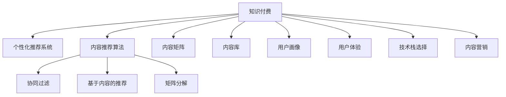

                 

# 程序员知识付费的内容矩阵构建策略

> 关键词：知识付费,内容矩阵,内容推荐,个性化推荐,内容优化,内容更新策略,用户行为分析,技术栈选择,用户体验,内容营销

## 1. 背景介绍

### 1.1 问题由来

随着知识付费市场的兴起，越来越多的人开始通过订阅、购买等形式获取高质量的专业知识。特别是在程序开发领域，越来越多的开发者通过知识付费平台学习新技术、解决实际问题。然而，现有知识付费平台往往面临内容同质化、用户粘性低、推荐系统不精准等问题。如何在知识付费平台上构建差异化、精准的内容矩阵，提升用户体验，成为摆在每个平台面前的难题。

### 1.2 问题核心关键点

构建知识付费平台的内容矩阵，本质上是面向用户的个性化内容推荐系统的构建问题。核心关键点包括：
1. 如何从海量的知识内容中筛选出优质的内容，作为推荐矩阵的源头。
2. 如何通过用户行为数据建模，构建精准的用户画像，以便对用户进行个性化推荐。
3. 如何设计高效的内容推荐算法，提升用户体验和满意度。
4. 如何构建多样化的内容形式，满足不同用户的学习需求。
5. 如何设计有效的商业模式，吸引和留存用户，实现商业变现。

## 2. 核心概念与联系

### 2.1 核心概念概述

为更好地理解知识付费内容矩阵构建策略，本节将介绍几个关键概念：

- 知识付费(Knowledge as a Service, KaaS)：指用户通过付费获取专业知识的平台，提供包括课程、书籍、工具、文档等多种形式的知识内容。
- 个性化推荐系统：指通过用户行为数据分析，对用户进行个性化内容推荐，提升用户满意度和平台粘性的技术系统。
- 内容推荐算法：指用于为用户推荐内容的算法，常见有协同过滤、基于内容的推荐、矩阵分解等。
- 内容矩阵：指内容库中不同类型内容（如课程、书籍、博客、文章等）的分布比例，反映平台内容构成和用户获取内容的需求分布。
- 用户体验(UX)：指用户在使用知识付费平台时的体验，包括内容质量、推荐准确性、操作便捷性等。
- 技术栈选择：指构建平台时，选择何种技术栈进行开发，影响平台性能、可维护性和扩展性。
- 内容营销：指通过内容发布和传播，吸引潜在用户、提升平台品牌影响力、实现商业变现的营销方式。

这些核心概念之间的逻辑关系可以通过以下Mermaid流程图来展示：



这个流程图展示了这个体系的核心概念及其之间的关系：

1. 知识付费平台通过内容推荐算法，向用户推荐个性化内容，形成内容矩阵。
2. 内容矩阵反映不同内容类型（如课程、书籍等）的分布，指导内容供给。
3. 用户画像基于用户行为数据分析，指导个性化推荐。
4. 用户体验通过内容质量、推荐准确性等指标评估，指导平台优化。
5. 技术栈选择影响平台开发效率和性能，决定平台可扩展性和可维护性。
6. 内容营销通过内容传播提升平台影响力，实现商业变现。

## 3. 核心算法原理 & 具体操作步骤
### 3.1 算法原理概述

知识付费平台的内容推荐系统，本质上是基于协同过滤、内容匹配、矩阵分解等算法构建的个性化推荐系统。其核心思想是：通过分析用户的历史行为数据，计算用户与内容之间的相似性，从而将用户最可能感兴趣的内容推荐给其阅读。

形式化地，假设知识内容库为 $H=\{C_1, C_2, ..., C_m\}$，用户集为 $U=\{u_1, u_2, ..., u_n\}$，用户与内容之间存在评分矩阵 $R \in \mathbb{R}^{n \times m}$，其中 $r_{i,j}$ 表示用户 $u_i$ 对内容 $C_j$ 的评分。目标是最小化用户未评分内容项的预测误差，即：

$$
\min_{R'} \sum_{i=1}^n \sum_{j=1}^m (r_{i,j} - R'_{i,j})^2
$$

其中 $R'$ 为优化后的评分矩阵。

优化后的评分矩阵 $R'$ 通过协同过滤、基于内容的推荐、矩阵分解等算法得到，以提升推荐系统的准确性和用户满意度。

### 3.2 算法步骤详解

基于协同过滤的内容推荐系统，通常分为基于用户协同过滤和基于物品协同过滤两种策略。下面以用户协同过滤为例，具体讲解其步骤：

**Step 1: 数据准备**

- 收集用户与内容之间的评分数据，作为训练数据集 $D=\{(r_{i,j}, C_j)\}_{i=1}^n \cup \{(r_{u_i}, C_j)\}_{i=1}^n$，其中 $r_{i,j}$ 为用户 $u_i$ 对内容 $C_j$ 的评分。

- 对评分数据进行预处理，去除无效和异常数据，进行标准化处理。

**Step 2: 模型构建**

- 选择用户协同过滤算法，如基于矩阵分解的奇异值分解(SVD)算法、基于梯度下降的协作过滤算法等。

- 构建评分矩阵 $R$，其中 $r_{i,j}$ 为用户 $u_i$ 对内容 $C_j$ 的评分。

**Step 3: 特征提取**

- 提取用户和内容的特征，如用户活跃度、内容受欢迎度等，作为推荐系统的辅助特征。

- 使用向量空间模型(VSM)对用户和内容进行特征表示。

**Step 4: 相似度计算**

- 计算用户 $u_i$ 与用户 $u_k$ 的相似度，使用余弦相似度或皮尔逊相关系数等。

- 计算内容 $C_j$ 与内容 $C_k$ 的相似度，同样使用余弦相似度或皮尔逊相关系数等。

**Step 5: 预测评分**

- 根据用户相似度和内容相似度，预测用户 $u_i$ 对内容 $C_j$ 的评分 $r'_{i,j}$。

- 对于未评分的用户-内容项，预测其评分并排序，生成推荐列表。

**Step 6: 迭代优化**

- 对推荐结果进行评估，如使用平均绝对误差(MAE)、均方误差(MSE)等指标进行评估。

- 使用梯度下降等优化算法，不断更新评分矩阵 $R'$，直至收敛。

### 3.3 算法优缺点

基于协同过滤的内容推荐系统，具有以下优点：
1. 简单易实现：只需要用户评分数据即可运行，无需大量标签数据。
2. 可扩展性好：能够处理海量用户和内容，适用于大规模推荐系统。
3. 推荐准确度高：能够有效利用用户历史行为数据，推荐用户感兴趣的内容。

同时，该方法也存在一些局限性：
1. 冷启动问题：对于新用户和新内容，协同过滤算法无法利用其历史评分数据，推荐效果较差。
2. 数据稀疏性：用户和内容的评分数据可能存在稀疏性，影响相似度计算的准确性。
3. 用户隐私问题：用户评分数据可能涉及隐私，需要严格保护。
4. 维度灾难：用户和内容的特征维度可能过高，需要采用降维技术。

### 3.4 算法应用领域

基于协同过滤的内容推荐系统，广泛应用于知识付费平台、电商网站、视频平台等多个领域，其核心思想均是通过分析用户历史行为数据，为用户推荐个性化内容。

- 知识付费平台：推荐用户感兴趣的专业课程、书籍、博客等，提升用户学习体验。
- 电商网站：推荐用户可能感兴趣的商品，提升购买转化率。
- 视频平台：推荐用户可能喜欢的视频内容，提升用户观看时间。

## 4. 数学模型和公式 & 详细讲解
### 4.1 数学模型构建

基于协同过滤的推荐系统，通常使用矩阵分解的方法进行建模。以奇异值分解为例，目标是最小化以下优化问题：

$$
\min_{U, V} ||R - UV^T||_F^2
$$

其中 $R$ 为评分矩阵，$U \in \mathbb{R}^{n \times k}$、$V \in \mathbb{R}^{m \times k}$ 为分解得到的用户和内容的特征矩阵，$k$ 为特征维度。

### 4.2 公式推导过程

矩阵分解的具体推导过程如下：

$$
R = UV^T \Rightarrow U = R V^T
$$

其中 $V^T$ 为矩阵 $V$ 的转置。

通过上述公式，我们可以将评分矩阵 $R$ 分解为用户特征矩阵 $U$ 和内容特征矩阵 $V$ 的乘积。通过优化 $U$ 和 $V$，可以得到新的评分矩阵 $R'$，从而实现推荐系统的个性化推荐。

### 4.3 案例分析与讲解

以B站内容推荐系统为例，分析矩阵分解的实际应用：

假设B站的内容库 $H$ 包含数十万个视频，用户集 $U$ 包含百万级用户。通过协同过滤算法，对评分数据 $D$ 进行奇异值分解，得到用户特征矩阵 $U$ 和内容特征矩阵 $V$。

用户 $u_i$ 对内容 $C_j$ 的评分 $r_{i,j}$ 可以通过下式计算：

$$
r'_{i,j} = U_i \cdot V_j^T
$$

其中 $U_i$ 和 $V_j$ 分别为用户 $u_i$ 和内容 $C_j$ 的特征向量。

通过计算用户 $u_i$ 对内容 $C_j$ 的预测评分 $r'_{i,j}$，可以生成对用户 $u_i$ 的推荐列表。通过不断优化 $U$ 和 $V$，B站的内容推荐系统可以实时调整，提升推荐精度和用户满意度。

## 5. 项目实践：代码实例和详细解释说明
### 5.1 开发环境搭建

在进行内容推荐系统开发前，我们需要准备好开发环境。以下是使用Python进行推荐系统开发的常见环境配置：

1. 安装Anaconda：从官网下载并安装Anaconda，用于创建独立的Python环境。

2. 创建并激活虚拟环境：
```bash
conda create -n recommend-env python=3.8 
conda activate recommend-env
```

3. 安装必要的依赖包：
```bash
pip install numpy scipy pandas sklearn scikit-learn scikit-learn
```

4. 安装TensorFlow和Keras：
```bash
pip install tensorflow keras
```

5. 安装Flask框架：
```bash
pip install flask
```

完成上述步骤后，即可在`recommend-env`环境中开始推荐系统开发。

### 5.2 源代码详细实现

下面我们以基于矩阵分解的协同过滤算法为例，给出推荐系统的Python代码实现。

```python
import numpy as np
from scipy.sparse import csr_matrix

# 评分矩阵 R
R = np.array([[5, 3, 0, 0],
              [1, 4, 4, 0],
              [5, 0, 5, 1],
              [4, 3, 2, 4]])

# 奇异值分解
U, s, Vt = np.linalg.svd(R)

# 输出特征矩阵
print("U矩阵：\n", U)
print("Vt矩阵：\n", Vt)

# 计算预测评分
pred_r = U.dot(Vt)

# 输出预测评分
print("预测评分矩阵：\n", pred_r)
```

在这个例子中，我们使用NumPy和SciPy库进行奇异值分解，得到用户特征矩阵 $U$ 和内容特征矩阵 $Vt$。通过计算 $U \cdot Vt^T$，得到用户对内容的预测评分。这个简单的例子展示了协同过滤算法的核心思想。

### 5.3 代码解读与分析

让我们再详细解读一下关键代码的实现细节：

**奇异值分解**：
- 我们使用NumPy的`np.linalg.svd`函数进行奇异值分解，得到用户特征矩阵 $U$ 和内容特征矩阵 $Vt$。

**预测评分**：
- 通过计算 $U \cdot Vt^T$，得到用户对内容的预测评分。

**代码运行结果**：
- 输出特征矩阵 $U$ 和 $Vt$，可以看到矩阵中的数值表示了用户和内容的特征值。
- 输出预测评分矩阵，展示了每个用户对每个内容的预测评分。

可以看到，基于协同过滤的推荐系统，通过矩阵分解的方法，实现了对用户和内容的相似度计算和预测评分，进而生成推荐列表。

当然，工业级的系统实现还需考虑更多因素，如推荐接口设计、查询优化、缓存策略等。但核心的算法思想基本与此类似。

## 6. 实际应用场景
### 6.1 知识付费平台推荐系统

知识付费平台推荐系统，通过分析用户的历史行为数据，为用户推荐课程、书籍、文章等内容。推荐系统可以提升用户粘性，增加平台收入。

例如，在“得到的大学”平台上，推荐系统根据用户的阅读历史和评分数据，为用户推荐感兴趣的专业课程和书籍，提升用户学习体验。同时，平台还可以通过课程订阅、书籍购买等方式实现商业变现。

### 6.2 电商平台推荐系统

电商平台推荐系统通过分析用户的购买行为数据，为用户推荐商品。推荐系统可以提升用户购买转化率，增加销售额。

例如，在“淘宝”平台上，推荐系统根据用户的浏览记录和评分数据，为用户推荐可能感兴趣的商品，提升用户购买体验。同时，平台还可以通过广告投放、付费推荐等方式实现商业变现。

### 6.3 视频平台推荐系统

视频平台推荐系统通过分析用户的观看行为数据，为用户推荐视频内容。推荐系统可以提升用户观看时长，增加平台收入。

例如，在“哔哩哔哩”平台上，推荐系统根据用户的观看历史和评分数据，为用户推荐可能感兴趣的视频内容，提升用户观看体验。同时，平台还可以通过广告投放、付费会员等方式实现商业变现。

## 7. 工具和资源推荐
### 7.1 学习资源推荐

为了帮助开发者系统掌握推荐系统开发的技术，这里推荐一些优质的学习资源：

1. 《推荐系统实践》系列书籍：由吴恩达、Jeff Hammerbacher等NLP专家所著，介绍了推荐系统的理论基础和实践技巧。

2. 《Python推荐系统》系列视频课程：由清华大学计算机系开设的推荐系统课程，涵盖了推荐系统的主要算法和实现技巧。

3. 《Machine Learning A-Z》视频课程：由Udemy平台提供的机器学习课程，包括推荐系统的相关章节。

4. 《Deep Learning for Recommender Systems》书籍：由顶会论文和项目案例组成，深入浅出地介绍了深度学习在推荐系统中的应用。

5. Kaggle推荐系统竞赛：通过实际竞赛项目，积累推荐系统开发的经验和技能。

通过对这些资源的学习实践，相信你一定能够快速掌握推荐系统的精髓，并用于解决实际的推荐问题。

### 7.2 开发工具推荐

高效的推荐系统开发离不开优秀的工具支持。以下是几款用于推荐系统开发的常用工具：

1. TensorFlow：基于Python的开源深度学习框架，适合进行推荐系统中的矩阵分解和深度学习模型训练。

2. PyTorch：基于Python的开源深度学习框架，灵活的计算图设计，适合进行推荐系统中的矩阵分解和深度学习模型训练。

3. Surprise：Python推荐系统库，集成了协同过滤、基于内容的推荐、矩阵分解等多种算法。

4. LightFM：Google开源的推荐系统框架，适合进行大规模推荐系统的训练和部署。

5. MLflow：推荐系统的实验跟踪和模型部署工具，记录和可视化模型训练过程中的各项指标，方便对比和调优。

6. Jupyter Notebook：轻量级的Python开发环境，适合进行推荐系统的原型设计和模型调试。

合理利用这些工具，可以显著提升推荐系统的开发效率，加快创新迭代的步伐。

### 7.3 相关论文推荐

推荐系统的发展源于学界的持续研究。以下是几篇奠基性的相关论文，推荐阅读：

1. Factorization Machines for Recommender Systems：提出了基于矩阵分解的推荐算法，广泛应用于推荐系统中。

2. Deep Matrix Factorization for Recommender Systems：使用深度神经网络进行矩阵分解，提升推荐系统的准确性。

3. Matrix Factorization Techniques for Recommender Systems：总结了矩阵分解的常用算法和技术，适合入门学习。

4. Collaborative Filtering for Implicit Feedback Datasets：总结了协同过滤算法的优缺点和改进方法，适合深度理解。

5. Scalable Collaborative Filtering for Implicit Feedback Datasets：提出了适用于大规模推荐系统的协同过滤算法，适合实际应用。

这些论文代表了这个领域的经典研究，通过学习这些前沿成果，可以帮助研究者把握学科前进方向，激发更多的创新灵感。

## 8. 总结：未来发展趋势与挑战
### 8.1 总结

本文对知识付费平台的内容推荐系统构建方法进行了全面系统的介绍。首先阐述了知识付费平台的内容推荐系统构建方法的核心关键点，明确了如何通过协同过滤等算法为用户推荐个性化内容。其次，从原理到实践，详细讲解了协同过滤的数学原理和关键步骤，给出了推荐系统开发的具体代码实例。同时，本文还广泛探讨了推荐系统在知识付费平台、电商平台、视频平台等多个行业领域的应用前景，展示了推荐范式的巨大潜力。最后，本文精选了推荐系统的各类学习资源，力求为读者提供全方位的技术指引。

通过本文的系统梳理，可以看到，基于协同过滤的内容推荐系统已经在多个领域展示了其应用价值，未来具有更广阔的发展空间。知识付费平台的兴起，为推荐系统提供了一个新的应用场景，有望加速推荐技术的普及和应用。

### 8.2 未来发展趋势

展望未来，知识付费平台的内容推荐系统将呈现以下几个发展趋势：

1. 多模态融合：推荐系统将更多地融合语音、图像、文本等多种模态数据，提升推荐系统的智能化水平。

2. 实时化推荐：推荐系统将实现实时推荐，快速响应用户的实时需求，提升用户体验。

3. 跨领域推荐：推荐系统将突破领域限制，实现跨领域内容推荐，提升用户的学习和娱乐体验。

4. 个性化推荐算法：推荐系统将引入更多的个性化推荐算法，如基于内容的推荐、基于时间的推荐、基于混合模型的推荐等，提升推荐系统的精准性和用户满意度。

5. 分布式推荐：推荐系统将采用分布式架构，支持大规模推荐系统的运行和维护，提升系统的稳定性和扩展性。

以上趋势凸显了知识付费平台推荐系统的广阔前景。这些方向的探索发展，必将进一步提升推荐系统的性能和应用范围，为知识付费平台的业务创新提供新的动力。

### 8.3 面临的挑战

尽管知识付费平台推荐系统已经取得了一定的成绩，但在迈向更加智能化、普适化应用的过程中，它仍面临着诸多挑战：

1. 数据质量瓶颈：推荐系统的准确性依赖于用户行为数据的丰富性和质量，如何获取高价值、高隐私的数据，是推荐系统面临的一大挑战。

2. 冷启动问题：对于新用户和新内容，推荐系统难以快速建立用户画像和内容画像，推荐效果较差。

3. 模型复杂性：推荐系统的模型复杂度较高，如何设计轻量级模型，提升模型的可解释性和可维护性，是推荐系统面临的一大挑战。

4. 用户隐私问题：推荐系统的用户行为数据可能涉及隐私，如何保护用户数据隐私，是推荐系统面临的一大挑战。

5. 推荐偏差问题：推荐系统可能存在推荐偏差，如何消除推荐偏差，提升推荐系统的公平性和公正性，是推荐系统面临的一大挑战。

以上挑战凸显了推荐系统在应用推广过程中所面临的诸多难点，需要更多技术创新和跨领域合作来解决。只有克服这些挑战，推荐系统才能真正实现落地应用。

### 8.4 研究展望

面向未来，知识付费平台推荐系统需要在以下几个方向上寻求新的突破：

1. 多模态推荐：引入语音、图像等多种模态数据，提升推荐系统的智能化水平。

2. 实时化推荐：实现实时推荐，快速响应用户需求，提升用户体验。

3. 跨领域推荐：突破领域限制，实现跨领域内容推荐，提升用户的学习和娱乐体验。

4. 个性化推荐算法：引入更多个性化推荐算法，提升推荐系统的精准性和用户满意度。

5. 分布式推荐：采用分布式架构，支持大规模推荐系统的运行和维护，提升系统的稳定性和扩展性。

6. 推荐偏差消除：引入推荐偏差消除技术，提升推荐系统的公平性和公正性。

这些方向的探索，必将引领推荐系统技术迈向更高的台阶，为知识付费平台提供更精准、更高效的推荐服务。面向未来，推荐系统还需要与其他人工智能技术进行更深入的融合，如知识表示、因果推理、强化学习等，多路径协同发力，共同推动推荐系统的发展和应用。

## 9. 附录：常见问题与解答

**Q1：如何评估推荐系统的性能？**

A: 推荐系统的性能评估通常使用以下指标：

1. 准确率：指推荐结果中真正感兴趣的占比。
2. 召回率：指真正感兴趣的内容被推荐的比例。
3. 覆盖率：指推荐内容覆盖用户兴趣的广度。
4. F1分数：综合考虑准确率和召回率，评估推荐系统的效果。

这些指标通过用户评分数据和推荐结果进行计算，可以综合反映推荐系统的性能。

**Q2：推荐系统为什么需要引入个性化推荐算法？**

A: 推荐系统引入个性化推荐算法的目的是提升推荐系统的精准性和用户满意度。

具体来说，个性化推荐算法通过分析用户的历史行为数据，为用户推荐其最可能感兴趣的内容。这样可以提升用户的体验，增加用户粘性，从而提升平台的商业价值。

**Q3：推荐系统如何处理冷启动问题？**

A: 推荐系统处理冷启动问题的方法包括：

1. 基于内容的推荐：利用物品的特征信息，为新用户推荐与已有内容相似的物品。
2. 基于标签的推荐：利用物品的标签信息，为新用户推荐与已有用户兴趣相似的物品。
3. 基于混合模型的推荐：结合协同过滤和基于内容的推荐，提升推荐系统的准确性。

这些方法可以在一定程度上缓解推荐系统的冷启动问题。

**Q4：推荐系统如何优化模型复杂度？**

A: 推荐系统优化模型复杂度的方法包括：

1. 特征工程：通过特征选择和降维，减少特征维度，降低模型的复杂度。
2. 模型压缩：使用模型压缩技术，如剪枝、量化等，降低模型的参数量。
3. 轻量级模型：选择轻量级模型，如基于深度学习的模型，提升模型的可解释性和可维护性。

这些方法可以在一定程度上优化推荐系统的模型复杂度，提升模型的性能和可维护性。

**Q5：推荐系统如何保护用户隐私？**

A: 推荐系统保护用户隐私的方法包括：

1. 数据匿名化：对用户行为数据进行匿名化处理，防止用户隐私泄露。
2. 数据加密：对用户行为数据进行加密处理，防止数据泄露。
3. 数据最小化：只收集必要的用户行为数据，防止数据滥用。

这些方法可以在一定程度上保护用户隐私，确保推荐系统的安全性和可靠性。

---

作者：禅与计算机程序设计艺术 / Zen and the Art of Computer Programming

