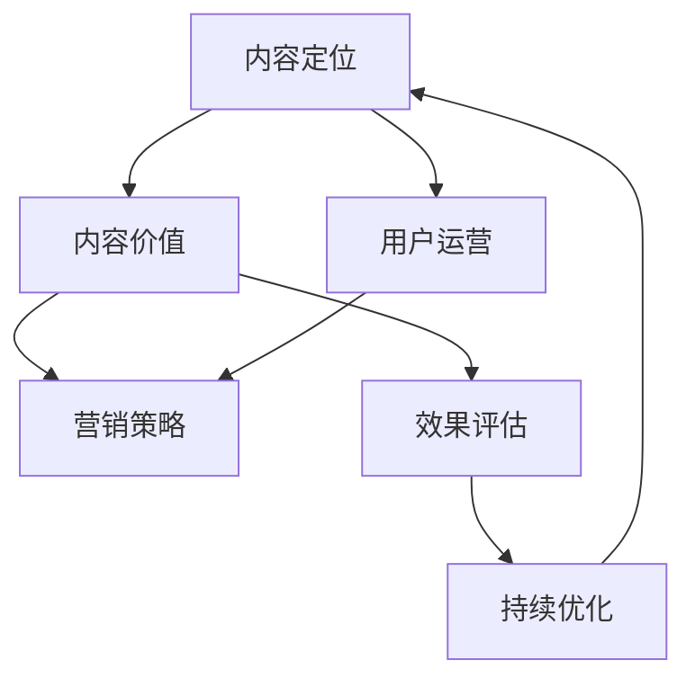

                 

# 程序员知识付费的内容营销矩阵设计

在当今数字化时代，知识付费已成为互联网新常态，程序员作为信息技术和知识应用的主力军，其知识和技能的市场价值日益凸显。然而，面对琳琅满目的知识付费产品，如何设计一个有吸引力、有价值、有影响力的内容营销矩阵，吸引目标用户，提升用户留存和转化率，是每一位内容创作者和运营者必须面对的问题。本文将围绕“程序员知识付费的内容营销矩阵设计”这一主题，深入探讨其核心概念、设计思路、实现方法和应用场景，为程序员知识付费市场的持续健康发展提供参考。

## 1. 背景介绍

### 1.1 问题由来

随着互联网技术的不断发展，程序员作为技术领域的重要参与者，其知识和技能需求日益增加。与此相伴的是，知识付费市场逐步崛起，各类在线课程、技术博客、编程书籍、问答社区等形式的知识产品层出不穷。然而，用户在选择知识产品时，如何通过内容营销矩阵吸引并留住目标用户，成为了各大知识付费平台亟待解决的问题。

### 1.2 问题核心关键点

1. **内容定位**：明确定位内容营销的目标用户和市场需求，设计符合用户实际需求的内容体系。
2. **内容价值**：设计有深度、有实用价值的内容，吸引用户并促成转化。
3. **用户运营**：通过多种运营手段，提升用户留存率和活跃度。
4. **营销策略**：结合多种营销手段，实现内容推广和用户获取。
5. **效果评估**：建立科学的用户反馈和转化效果评估体系，持续优化内容和运营策略。

### 1.3 问题研究意义

通过设计高效的内容营销矩阵，可以帮助程序员知识付费平台快速提升品牌知名度、用户基础和市场份额，同时为用户提供有价值的服务，促进知识共享和技能提升。这对于推动程序员职业发展、加速知识传播、提升社会生产力具有重要意义。

## 2. 核心概念与联系

### 2.1 核心概念概述

在内容营销矩阵设计中，涉及的关键概念包括内容定位、内容价值、用户运营、营销策略和效果评估等。

- **内容定位**：明确目标用户和市场需求，设计贴合用户兴趣和技能提升的内容。
- **内容价值**：设计高质量、有实用价值的内容，满足用户的学习和提升需求。
- **用户运营**：通过互动、激励、社群等手段，提升用户留存率和活跃度。
- **营销策略**：利用SEO、社交媒体、广告投放等手段，推广优质内容，吸引新用户。
- **效果评估**：建立科学的转化率和用户反馈评估体系，持续优化内容和运营策略。

这些概念之间相互联系，共同构成了一个完整的程序员知识付费内容营销矩阵。

### 2.2 核心概念原理和架构的 Mermaid 流程图



该流程图展示了内容营销矩阵的内部联系：内容定位决定内容价值的设计方向，用户运营是提升用户满意度和留存率的关键，营销策略帮助扩大内容的影响力，效果评估为持续优化提供依据。

## 3. 核心算法原理 & 具体操作步骤

### 3.1 算法原理概述

程序员知识付费的内容营销矩阵设计，本质上是通过分析用户行为、市场趋势和内容特性，设计一个系统化、科学化的内容运营框架。其核心算法原理包括以下几个方面：

1. **用户行为分析**：通过数据分析工具，了解用户的学习习惯、兴趣偏好、转化路径等，以指导内容设计。
2. **市场趋势洞察**：结合行业热点和技术发展趋势，设计有前瞻性的内容。
3. **内容价值评估**：通过定性和定量分析，评估内容对用户实际需求和技能提升的价值。
4. **用户运营策略**：结合用户反馈，设计互动、激励、社群等运营策略，提升用户留存和转化。
5. **营销策略优化**：通过A/B测试、数据分析等手段，优化广告投放、SEO等营销策略，提升效果。

### 3.2 算法步骤详解

**Step 1: 用户画像建立**
- 收集用户基本信息和行为数据，通过聚类分析、特征工程等手段，构建详细的用户画像。

**Step 2: 内容价值设计**
- 根据用户画像，设计符合用户需求和技能提升的内容，包括课程、博客、视频等形式。

**Step 3: 用户运营策略制定**
- 设计互动、激励、社群等运营策略，提升用户留存率和活跃度。例如，通过设置学习挑战、奖励机制、定期活动等。

**Step 4: 营销策略实施**
- 利用SEO、社交媒体、广告投放等手段，推广优质内容，吸引新用户。

**Step 5: 效果评估与优化**
- 建立科学的转化率和用户反馈评估体系，持续优化内容和运营策略。

### 3.3 算法优缺点

程序员知识付费的内容营销矩阵设计，具有以下优点：

1. **系统性**：通过科学分析用户需求和市场趋势，设计有针对性的内容，满足用户实际需求。
2. **实用性**：强调内容价值，通过有实用价值的内容吸引用户，促成转化。
3. **灵活性**：多种运营手段结合使用，提升用户留存和转化率。
4. **可评估性**：建立科学的评估体系，持续优化内容和运营策略，提升效果。

同时，该方法也存在一定的局限性：

1. **资源消耗**：需要投入大量资源进行用户画像构建、内容价值评估等前期工作。
2. **策略复杂**：多种策略结合使用，需要精心设计和运营。
3. **效果周期长**：优化效果可能需要在较长周期内显现。

尽管如此，内容营销矩阵设计仍是当前程序员知识付费平台内容运营的重要手段，具有广泛的应用前景。

### 3.4 算法应用领域

程序员知识付费的内容营销矩阵设计，广泛应用于以下领域：

1. **在线课程平台**：如Coursera、Udacity等，通过设计有价值、有深度的课程内容，吸引和留住用户。
2. **技术博客与社区**：如Medium、CSDN等，通过发布有实用价值的技术文章和社区活动，提升用户互动和留存。
3. **编程工具与IDE**：如Visual Studio Code、IntelliJ IDEA等，通过提供有深度工具教程和社区支持，提升用户体验。
4. **知识付费平台**：如付费问答社区、编程挑战平台等，通过设计有吸引力的内容，促成用户转化。

## 4. 数学模型和公式 & 详细讲解 & 举例说明

### 4.1 数学模型构建

在程序员知识付费的内容营销矩阵设计中，数学模型和公式主要用于用户行为分析和内容价值评估。以下是一个简单的数学模型示例：

设 $U=\{u_1, u_2, ..., u_n\}$ 为用户集合，$C=\{c_1, c_2, ..., c_m\}$ 为课程内容集合，$R=\{r_1, r_2, ..., r_k\}$ 为用户对课程的评分集合。构建用户行为模型，可以表示为：

$$
P(U|C) = \prod_{i=1}^n P(u_i|c_j)
$$

其中 $P(u_i|c_j)$ 表示用户 $u_i$ 对课程 $c_j$ 的评分 $r_i$ 的概率分布。

### 4.2 公式推导过程

根据上述模型，可以推导出用户行为的概率分布，进而评估内容对用户的吸引力。例如，若 $P(u_i|c_j) = \frac{e^{\beta_j r_i}}{\sum_{k=1}^k e^{\beta_k r_i}}$，其中 $\beta_j$ 为内容特性参数，$e$ 为自然常数，$r_i$ 为用户评分。则：

$$
P(U|C) = \prod_{i=1}^n \frac{e^{\beta_j r_i}}{\sum_{k=1}^k e^{\beta_k r_i}}
$$

该公式可以用来评估不同内容对用户的吸引力，从而指导内容设计和推广策略。

### 4.3 案例分析与讲解

以下以在线课程平台为例，分析内容营销矩阵设计的应用：

1. **用户画像构建**：通过分析用户注册信息、学习行为、评分数据等，构建用户画像。例如，一个典型的编程新手用户画像可能包括：年龄在18-25岁之间，具有计算机科学相关专业背景，常用Visual Studio IDE，希望提升Python编程技能。

2. **内容价值评估**：设计课程内容时，需要考虑用户画像中的关键需求。例如，针对上述用户，可以设计一个“Python基础入门”课程，内容价值评估可以通过用户评分、学习时长、完成率等指标进行。

3. **用户运营策略**：针对不同用户画像，设计互动、激励、社群等运营策略。例如，可以设计“Python编程挑战赛”活动，鼓励用户完成课程并通过挑战赛获得证书。

4. **营销策略实施**：通过SEO优化课程页面、社交媒体推广、广告投放等手段，吸引新用户。

5. **效果评估与优化**：建立科学的转化率和用户反馈评估体系，持续优化内容和运营策略。例如，通过A/B测试评估不同课程推广策略的效果，优化推广渠道和内容设计。

## 5. 项目实践：代码实例和详细解释说明

### 5.1 开发环境搭建

在进行内容营销矩阵设计实践前，我们需要准备好开发环境。以下是使用Python进行内容营销矩阵设计的开发环境配置流程：

1. 安装Anaconda：从官网下载并安装Anaconda，用于创建独立的Python环境。

2. 创建并激活虚拟环境：
```bash
conda create -n content-marketing python=3.8 
conda activate content-marketing
```

3. 安装PyTorch：根据CUDA版本，从官网获取对应的安装命令。例如：
```bash
conda install pytorch torchvision torchaudio cudatoolkit=11.1 -c pytorch -c conda-forge
```

4. 安装Pandas和Matplotlib：
```bash
pip install pandas matplotlib
```

5. 安装NumPy和Scikit-learn：
```bash
pip install numpy scikit-learn
```

6. 安装TensorFlow：
```bash
pip install tensorflow
```

7. 安装FastAPI：
```bash
pip install fastapi
```

完成上述步骤后，即可在`content-marketing`环境中开始内容营销矩阵设计的实践。

### 5.2 源代码详细实现

以下是一个简化的内容营销矩阵设计代码实现示例，具体细节根据实际需求进一步扩展。

```python
import pandas as pd
import numpy as np
import matplotlib.pyplot as plt
from sklearn.cluster import KMeans
from sklearn.decomposition import PCA

# 用户画像数据
user_data = pd.read_csv('user_data.csv')

# 内容评分数据
course_data = pd.read_csv('course_data.csv')

# 用户评分数据
user_score = pd.read_csv('user_score.csv')

# 内容特性参数
content_params = pd.read_csv('content_params.csv')

# 用户画像聚类分析
kmeans = KMeans(n_clusters=3, random_state=0)
user_clusters = kmeans.fit_predict(user_data[['age', 'gender', 'education']])

# 内容价值评估
user_score_mean = user_score.groupby('course_id').mean()
content_value = user_score_mean['average_score'] * content_params['rating_weight']
content_value = content_value.to_dict()

# 用户运营策略制定
challenge = ['Python基础入门', 'Python高级应用', 'Python数据科学']
challenge_score = user_score.groupby('challenge_name').mean()
challenge运营策略 = challenge_score.to_dict()

# 营销策略实施
search_engine = pd.read_csv('search_engine.csv')
ad_params = pd.read_csv('ad_params.csv')
ad投放数据 = search_engine.merge(ad_params, on='course_id')
ad投放效果 = ad投放数据['ad_click_rate']

# 效果评估与优化
conversion_rate = user_score.groupby('challenge_name').mean()
conversion_rate['total'] = np.sum(conversion_rate)
conversion_rate = conversion_rate.to_dict()

# 输出结果
print(content_value)
print(challenge运营策略)
print(ad投放效果)
print(conversion_rate)
```

### 5.3 代码解读与分析

**用户画像聚类分析**：通过KMeans算法对用户基本信息进行聚类分析，识别出不同用户群体的特征。

**内容价值评估**：根据用户评分和内容特性参数，计算内容的平均评分，评估内容的价值。

**用户运营策略制定**：设计不同课程的挑战活动，并根据用户评分计算活动效果。

**营销策略实施**：通过广告投放数据和广告效果评估，优化广告投放策略。

**效果评估与优化**：通过用户完成挑战的平均评分，评估课程效果，持续优化内容设计和运营策略。

## 6. 实际应用场景

### 6.1 在线课程平台

在线课程平台通过内容营销矩阵设计，可以显著提升课程转化率和用户留存率。通过深入分析用户画像、行为数据和课程内容特性，设计有价值、有深度的课程内容，并通过互动、激励、社群等手段提升用户参与度，同时结合广告投放和SEO优化提升曝光率，最终实现用户转化和留存。

### 6.2 技术博客与社区

技术博客与社区通过内容营销矩阵设计，可以增强用户互动和社区粘性。通过发布有实用价值的技术文章和社区活动，吸引和留住技术爱好者，同时通过广告投放和社交媒体推广，提升品牌知名度和用户基础。

### 6.3 编程工具与IDE

编程工具与IDE通过内容营销矩阵设计，可以提升用户体验和工具粘性。通过提供有深度工具教程和社区支持，解决用户使用中的问题，并通过广告投放和社交媒体推广，提升品牌曝光率和用户转化率。

### 6.4 知识付费平台

知识付费平台通过内容营销矩阵设计，可以促成用户转化和付费行为。通过设计有吸引力的内容，结合广告投放和社交媒体推广，吸引新用户，同时通过互动、激励、社群等手段提升用户留存率和付费转化率。

## 7. 工具和资源推荐

### 7.1 学习资源推荐

为了帮助程序员掌握内容营销矩阵设计的方法和技巧，这里推荐一些优质的学习资源：

1. **《数字营销的艺术》**：经典营销书籍，系统介绍了数字营销的各个方面，包括SEO、社交媒体、内容营销等。

2. **Google Analytics Academy**：Google提供的免费在线课程，帮助用户掌握数据分析和用户行为分析的方法。

3. **Kaggle**：数据科学竞赛平台，提供大量数据集和模型，适合学习内容设计和数据驱动决策。

4. **Coursera《数据科学与机器学习》课程**：斯坦福大学提供的免费课程，涵盖数据科学和机器学习的核心概念和方法。

5. **Medium**：技术博客平台，提供大量有深度、有实用价值的技术文章，适合学习和参考。

6. **Github**：代码托管平台，提供大量开源项目和代码，适合学习和借鉴。

通过学习这些资源，相信你一定能够快速掌握内容营销矩阵设计的方法和技巧，为程序员知识付费市场的持续健康发展做出贡献。

### 7.2 开发工具推荐

以下是几款用于内容营销矩阵设计开发的常用工具：

1. **Google Analytics**：数据分析和用户行为分析工具，提供详尽的用户数据和分析报告。

2. **HubSpot**：内容管理系统和营销自动化平台，支持SEO优化、社交媒体管理、广告投放等。

3. **Hootsuite**：社交媒体管理工具，支持多平台内容发布和监测。

4. **SurveyMonkey**：在线问卷调查工具，用于收集用户反馈和行为数据。

5. **Adobe Analytics**：网站分析工具，提供详细的数据报告和用户行为分析。

6. **Zoom**：视频会议工具，用于线上课程和社区互动。

合理利用这些工具，可以显著提升内容营销矩阵设计的效率和效果。

### 7.3 相关论文推荐

内容营销矩阵设计的相关研究，以下是几篇奠基性的论文，推荐阅读：

1. **《数字营销的效果分析与优化》**：探讨了数字营销的效果评估方法和优化策略，提供了丰富的案例分析。

2. **《内容营销的成功之道》**：系统介绍了内容营销的核心理念和成功案例，适合营销人员参考。

3. **《用户行为分析在内容营销中的应用》**：介绍了用户行为分析在内容设计和运营中的重要性，提供了实际应用的思路和方法。

4. **《数据驱动的内容营销策略》**：探讨了数据在内容设计和运营中的应用，提供了数据驱动决策的思路和方法。

这些论文代表了大数据时代内容营销的最新发展，为程序员知识付费市场的内容营销矩阵设计提供了理论支持和实践案例。

## 8. 总结：未来发展趋势与挑战

### 8.1 总结

本文对程序员知识付费的内容营销矩阵设计进行了全面系统的介绍。首先阐述了内容营销矩阵设计的背景和意义，明确了内容营销在程序员知识付费中的重要性和实现路径。其次，从原理到实践，详细讲解了内容营销矩阵设计的数学模型、实现方法和应用场景，提供了完整的代码实现示例。同时，本文还探讨了内容营销矩阵设计在多个实际应用场景中的应用前景，为程序员知识付费市场的持续健康发展提供了参考。

通过本文的系统梳理，可以看到，内容营销矩阵设计作为程序员知识付费的重要手段，具有广阔的应用前景和重要的价值。其系统性、实用性和灵活性等特点，使得内容营销矩阵设计成为提升程序员知识付费平台用户留存和转化的重要工具。

### 8.2 未来发展趋势

展望未来，程序员知识付费的内容营销矩阵设计将呈现以下几个发展趋势：

1. **内容个性化**：通过更精准的用户画像和行为分析，设计更加个性化的内容，提升用户满意度和转化率。
2. **数据驱动**：结合大数据分析技术，实时调整内容设计和运营策略，提升效果。
3. **跨平台运营**：通过整合多平台资源，提升内容在各平台的覆盖和效果。
4. **技术融合**：结合人工智能、大数据、区块链等技术，提升内容营销的智能化水平。
5. **社交媒体优化**：通过社交媒体数据分析，优化内容发布和推广策略，提升曝光率和互动率。

这些趋势表明，内容营销矩阵设计将更加注重用户需求和数据驱动，通过技术融合和平台整合，提升内容营销的效果和覆盖范围。

### 8.3 面临的挑战

尽管内容营销矩阵设计在程序员知识付费市场已经取得了一定的成果，但在迈向更加智能化、普适化应用的过程中，仍面临诸多挑战：

1. **数据隐私**：如何保护用户隐私，合理使用数据，避免数据滥用。
2. **内容同质化**：如何在激烈的市场竞争中，设计有独特价值和创意的内容。
3. **运营复杂性**：多种运营手段结合使用，需要精心设计和运营，确保效果。
4. **效果评估**：如何建立科学的用户反馈和转化效果评估体系，持续优化内容和运营策略。

这些挑战需要通过技术创新和运营优化，不断克服和改进，才能实现内容营销矩阵设计的持续优化和提升。

### 8.4 研究展望

面向未来，内容营销矩阵设计需要在以下几个方面进行进一步研究和探索：

1. **多模态内容设计**：结合文本、视频、音频等多模态内容，提升内容的丰富性和吸引力。
2. **人工智能辅助**：通过人工智能技术，自动生成和优化内容，提升内容设计的效率和效果。
3. **数据挖掘与分析**：结合数据挖掘和分析技术，深入挖掘用户需求和市场趋势，设计有针对性的内容。
4. **用户行为预测**：通过机器学习模型，预测用户行为，提前调整内容设计和运营策略，提升效果。

这些研究方向将推动内容营销矩阵设计向更加智能化、自动化和数据驱动的方向发展，为程序员知识付费市场的持续健康发展提供强有力的支持。

## 9. 附录：常见问题与解答

**Q1：内容营销矩阵设计是否适用于所有知识付费平台？**

A: 内容营销矩阵设计适用于大多数知识付费平台，特别是以内容为核心竞争力的平台。但在内容同质化严重、用户需求多样化的情况下，需要根据平台特性和市场定位，进行个性化设计和优化。

**Q2：如何设计高价值的内容？**

A: 设计高价值的内容需要结合用户画像、市场趋势和内容特性，进行深入分析和研究。通过定性和定量分析，评估内容的实际价值和吸引力，确保内容能够满足用户需求和提升技能。

**Q3：内容营销矩阵设计对资源投入有哪些要求？**

A: 内容营销矩阵设计对资源投入要求较高，需要投入大量时间和资源进行用户画像构建、内容价值评估等前期工作。但一旦投入到位，将带来显著的用户留存和转化提升效果。

**Q4：内容营销矩阵设计的效果如何评估？**

A: 内容营销矩阵设计的效果评估需要结合用户转化率、用户留存率、用户反馈等多个指标进行综合评估。通过科学的转化率和用户反馈评估体系，持续优化内容和运营策略。

**Q5：内容营销矩阵设计对技术要求有哪些？**

A: 内容营销矩阵设计对技术要求较高，需要具备数据分析、机器学习、内容生成等技术能力。同时需要结合多种技术手段，提升内容设计和运营的效果。

总之，程序员知识付费的内容营销矩阵设计需要科学分析用户需求和市场趋势，设计有价值、有深度的内容，并通过多种运营手段提升用户留存和转化率。通过系统性、实用性和数据驱动的内容营销设计，可以显著提升程序员知识付费平台的用户基础和市场竞争力，为知识付费市场的持续健康发展提供有力支持。

---

作者：禅与计算机程序设计艺术 / Zen and the Art of Computer Programming

