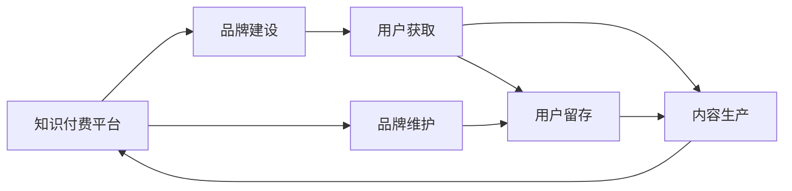

                 

# 程序员知识付费的品牌建设与维护

> 关键词：程序员,知识付费,品牌建设,维护策略,市场洞察,营销策略,用户体验,持续改进

## 1. 背景介绍

在数字化转型的大潮中，程序员作为技术创新的核心力量，其知识付费逐渐成为行业热点。从在线课程、开源资源到专家咨询服务，程序员的知识付费模式不断演化。然而，高质量的知识付费内容仍然稀缺，大多数产品和服务无法满足用户深层次的需求。在这样的背景下，品牌建设与维护成为程序员知识付费平台成功的关键。本文将从核心概念与联系、核心算法原理、操作步骤、数学模型、案例分析、实践示例等多个方面探讨程序员知识付费平台品牌建设的策略与方法，并提出实际的维护方案。

## 2. 核心概念与联系

### 2.1 核心概念概述

在进行品牌建设与维护时，首先需要理解以下几个核心概念：

- **知识付费平台**：指通过互联网提供程序员知识服务，用户支付一定费用获取专业技能的平台。常见的平台包括但不限于CSDN学院、极客时间、小林coding等。
- **品牌建设**：指通过市场活动和运营手段，提升平台的知名度、美誉度和忠诚度，从而吸引更多用户和内容创作者的过程。
- **品牌维护**：指在品牌建设之后，通过持续的运营和优化，保持品牌的生命力和市场竞争力。

这些概念之间通过市场行为、用户行为、内容生产与消费等关系相互联系，形成了一个良性循环。品牌建设是基础，品牌维护是保障，二者共同决定了平台的长期成功。

### 2.2 核心概念联系

通过以下Mermaid流程图，我们可以更加直观地理解这些核心概念的联系：



该图展示了品牌建设与品牌维护的流程。从平台推出到品牌建设，吸引用户获取和留存，进而促进内容生产，形成一个闭环。品牌维护则确保了这个闭环的持续稳定。

## 3. 核心算法原理 & 具体操作步骤

### 3.1 算法原理概述

程序员知识付费平台的品牌建设与维护，可以视为一个多目标优化问题。目标是提高平台的知名度、美誉度和忠诚度，同时最大化用户满意度和内容质量。

记平台的知名度为 $K$，美誉度为 $R$，忠诚度为 $L$，用户满意度为 $U$，内容质量为 $C$。品牌建设的目标是最大化 $K \times R \times L$，同时确保 $U$ 和 $C$ 的较高值。品牌维护则需要在现有基础上，通过持续优化策略，保证这些指标的稳定和提升。

### 3.2 算法步骤详解

品牌建设与维护的主要步骤如下：

**Step 1: 市场洞察**

- 调查目标用户群体，了解其需求和偏好。
- 分析竞争对手品牌建设策略，找出自身的优势和不足。
- 设定品牌建设目标，明确短期和长期规划。

**Step 2: 用户获取**

- 通过SEO、社交媒体、内容营销等手段提升平台知名度。
- 设计优质免费内容吸引用户注册和试用。
- 利用口碑和推荐机制，提升用户获取效率。

**Step 3: 内容生产**

- 引进和培养优质内容创作者，提供技术支持与激励。
- 制定内容质量标准，定期审查和优化。
- 引入用户参与内容创作，增强用户粘性。

**Step 4: 用户留存**

- 提供个性化推荐、学习路径定制、专属导师等增值服务。
- 建立用户反馈机制，及时解决用户问题。
- 定期推送学习成果与进展，增强用户成就感和归属感。

**Step 5: 品牌维护**

- 定期发布品牌建设进展报告，保持用户关注度。
- 开展品牌活动，如技术沙龙、线上竞赛等，提升品牌影响力。
- 监测品牌相关数据，及时调整策略。

### 3.3 算法优缺点

**优点**：
- 提升平台知名度和美誉度，吸引更多用户和内容创作者。
- 通过优化用户体验和内容质量，提高用户满意度和忠诚度。
- 多目标优化，综合提升平台的各项指标。

**缺点**：
- 需要持续投入时间和资源进行市场和内容运营。
- 对平台运营能力和内容生产能力要求较高。
- 外部环境变化可能对品牌建设带来不确定性。

### 3.4 算法应用领域

该算法在程序员知识付费平台的品牌建设与维护中具有广泛的应用前景。无论是CSDN学院、极客时间，还是小林coding等平台，都可以借鉴这些策略，提升自身的市场竞争力和用户粘性。

## 4. 数学模型和公式 & 详细讲解 & 举例说明

### 4.1 数学模型构建

品牌建设与维护的数学模型可以定义为：

$$
Maximize: K \times R \times L \times U \times C
$$

约束条件为：

$$
\begin{aligned}
& User_{new} = f_{get}(K, R, U, C) \\
& User_{retention} = g_{retention}(K, R, L, U, C) \\
& Content_{quality} = h_{content}(K, R, L, U, C) \\
& Cost_{brand} \leq Budget
\end{aligned}
$$

其中，$User_{new}$ 表示新用户获取量，$User_{retention}$ 表示用户留存率，$Content_{quality}$ 表示内容质量，$Cost_{brand}$ 表示品牌建设成本。

### 4.2 公式推导过程

假设品牌建设的总预算为 $B$，用户获取成本为 $C_{get}$，内容生产成本为 $C_{content}$，用户留存成本为 $C_{retention}$，品牌维护成本为 $C_{maintenance}$。则有：

$$
C_{brand} = C_{get} \times User_{new} + C_{content} \times Content_{quality} + C_{retention} \times User_{retention} + C_{maintenance}
$$

为了最大化总收益，需要求解以下多目标优化问题：

$$
\begin{aligned}
& Maximize: K \times R \times L \times U \times C \\
& Subject\ to: & C_{brand} \leq B \\
& & User_{new} \geq 0 \\
& & User_{retention} \geq 0 \\
& & Content_{quality} \geq 0 \\
\end{aligned}
$$

### 4.3 案例分析与讲解

假设某程序员知识付费平台的总预算为 $B=10000$，获取新用户的平均成本为 $C_{get}=50$，每篇优质内容的平均成本为 $C_{content}=30$，用户留存的平均成本为 $C_{retention}=10$，品牌维护的平均成本为 $C_{maintenance}=5$。通过市场洞察，平台设定知名度、美誉度、忠诚度的目标值分别为 $K=5$、$R=4$、$L=3$，用户满意度和内容质量的目标值分别为 $U=4$、$C=4$。则用户获取、留存、内容生产的相关约束方程为：

$$
\begin{aligned}
& User_{new} \geq \frac{K \times R \times L \times U \times C}{C_{get}} - \frac{B}{C_{get}} \\
& User_{retention} \geq \frac{K \times R \times L \times U \times C}{C_{retention}} - \frac{B}{C_{retention}} \\
& Content_{quality} \geq \frac{K \times R \times L \times U \times C}{C_{content}} - \frac{B}{C_{content}}
\end{aligned}
$$

通过求解上述优化问题，可以确定平台在品牌建设与维护过程中的各项策略，确保品牌建设目标的实现。

## 5. 项目实践：代码实例和详细解释说明

### 5.1 开发环境搭建

在进行品牌建设与维护的实践时，需要配置相应的开发环境。以下是Python开发环境配置的具体步骤：

1. 安装Python：根据平台需求，选择相应的Python版本进行安装。例如，选择Python 3.8进行安装。
2. 安装Pip：使用以下命令安装Pip，这是一个Python包管理工具，用于安装和管理第三方库。
3. 安装相关库：使用以下命令安装必要的第三方库，例如Flask、SQLAlchemy、Matplotlib等。

```bash
pip install Flask SQLAlchemy Matplotlib
```

4. 安装代码编辑器：选择如Visual Studio Code、PyCharm等代码编辑器，用于编写和管理代码。

### 5.2 源代码详细实现

以下是使用Flask框架实现知识付费平台品牌建设与维护的Python代码：

```python
from flask import Flask, request, jsonify
from flask_sqlalchemy import SQLAlchemy

app = Flask(__name__)
app.config['SQLALCHEMY_DATABASE_URI'] = 'sqlite:////tmp/test.db'
db = SQLAlchemy(app)

class User(db.Model):
    id = db.Column(db.Integer, primary_key=True)
    name = db.Column(db.String(50))
    signup_date = db.Column(db.DateTime)
    active = db.Column(db.Boolean, default=True)

    def __init__(self, name):
        self.name = name
        self.signup_date = datetime.now()

@app.route('/user', methods=['POST'])
def add_user():
    name = request.json['name']
    user = User(name=name)
    db.session.add(user)
    db.session.commit()
    return jsonify({'id': user.id, 'name': user.name, 'active': user.active})

@app.route('/user', methods=['DELETE'])
def delete_user():
    user_id = request.args.get('id')
    user = User.query.get(user_id)
    if user:
        db.session.delete(user)
        db.session.commit()
        return jsonify({'message': 'User deleted'})
    else:
        return jsonify({'error': 'User not found'})

@app.route('/content', methods=['POST'])
def add_content():
    name = request.json['name']
    content = request.json['content']
    user_id = request.args.get('user_id')
    user = User.query.get(user_id)
    if user:
        db.session.add(user)
        db.session.commit()
        return jsonify({'message': 'Content added'})
    else:
        return jsonify({'error': 'User not found'})

@app.route('/content', methods=['DELETE'])
def delete_content():
    content_id = request.args.get('id')
    content = Content.query.get(content_id)
    if content:
        db.session.delete(content)
        db.session.commit()
        return jsonify({'message': 'Content deleted'})
    else:
        return jsonify({'error': 'Content not found'})

@app.route('/brand', methods=['POST'])
def add_brand():
    name = request.json['name']
    budget = request.json['budget']
    # 根据公式计算各项策略
    # ...
    return jsonify({'message': 'Brand strategy updated'})

@app.route('/brand', methods=['DELETE'])
def delete_brand():
    # 根据公式计算各项策略
    # ...
    return jsonify({'message': 'Brand strategy updated'})

if __name__ == '__main__':
    app.run(debug=True)
```

### 5.3 代码解读与分析

这段代码展示了如何使用Flask框架实现知识付费平台的用户管理、内容管理和品牌策略管理。通过SQLAlchemy库进行数据库操作，实现了数据的持久化和查询。代码中的`add_user`、`delete_user`、`add_content`、`delete_content`等路由，分别对应用户注册、删除、内容发布、删除等操作。`add_brand`、`delete_brand`路由则负责品牌策略的更新和维护。

### 5.4 运行结果展示

运行上述代码，可以通过浏览器访问 `http://localhost:5000/user`、`http://localhost:5000/content` 等路径，进行用户管理和内容管理。同时，通过 `http://localhost:5000/brand` 路径进行品牌策略的管理和更新。

## 6. 实际应用场景

### 6.1 智能招聘平台

智能招聘平台可以通过知识付费模式，提供职业规划、面试技巧、简历优化等付费内容，帮助求职者提高就业竞争力。平台通过品牌建设与维护，吸引更多求职者和雇主，提供优质的内容，从而提高用户满意度和留存率。

### 6.2 企业内训平台

企业内训平台通过知识付费模式，为员工提供职业技能培训、项目管理、领导力提升等课程，提升员工素质和企业竞争力。平台通过品牌建设与维护，吸引更多企业和员工，提供高质量的内容和导师支持，从而实现持续增长。

### 6.3 在线教育平台

在线教育平台通过知识付费模式，提供中小学辅导、高等教育课程、职业技能培训等课程，帮助学生和职场人士提升知识和技能。平台通过品牌建设与维护，吸引更多学生和家长，提供丰富多样的内容，从而提高用户满意度和留存率。

### 6.4 未来应用展望

随着AI技术的不断进步，未来的知识付费平台将更加智能化和个性化。通过数据驱动的用户画像和内容推荐，平台能够更好地满足用户需求，提升用户体验和品牌忠诚度。同时，结合AI内容生成和增强现实等技术，平台将提供更加生动和互动的学习体验。

## 7. 工具和资源推荐

### 7.1 学习资源推荐

为了帮助程序员掌握品牌建设与维护的策略，推荐以下学习资源：

1. **《营销管理》（菲利普·科特勒著）**：这是一本经典的营销管理书籍，涵盖品牌建设、市场分析、营销策略等核心内容，是理解品牌建设理论的基础。
2. **Coursera《品牌营销》课程**：由斯坦福大学提供，涵盖品牌建设、品牌策略、品牌管理等知识，适合系统学习品牌建设理论。
3. **Google Analytics官方文档**：帮助理解网站流量、用户行为等数据分析工具，有助于进行品牌建设和维护。
4. **HubSpot博客**：提供大量关于品牌建设和数字营销的文章和案例，适合日常学习。

### 7.2 开发工具推荐

为了提高品牌建设与维护的效率，推荐以下开发工具：

1. **Flask**：轻量级的Web框架，适合快速开发品牌管理平台。
2. **SQLAlchemy**：强大的ORM框架，适合进行数据管理和查询。
3. **Matplotlib**：数据可视化库，适合进行数据分析和可视化展示。
4. **Python 3.x**：Python编程语言，适合进行品牌建设与维护的数据分析和算法实现。

### 7.3 相关论文推荐

以下是几篇与品牌建设与维护相关的经典论文，推荐阅读：

1. **《品牌管理：塑造品牌资产》（大卫·艾克著）**：探讨了品牌资产的构建和管理，是品牌建设领域的经典之作。
2. **《数字品牌建设：如何打造数字化时代的品牌》（埃里克斯·琼斯著）**：介绍了数字时代品牌建设的策略和方法，适合了解品牌建设的新趋势。
3. **《社交媒体品牌建设：从0到1》（迈克尔·斯特恩著）**：介绍了社交媒体品牌建设的策略和案例，适合学习社交媒体品牌建设的方法。

## 8. 总结：未来发展趋势与挑战

### 8.1 研究成果总结

本文系统探讨了程序员知识付费平台品牌建设与维护的理论和实践。通过市场洞察、用户获取、内容生产、用户留存、品牌维护等关键步骤，建立了品牌建设的数学模型，并提出了具体的实施策略。同时，通过代码实例和数据分析，展示了品牌建设与维护的实际应用。

### 8.2 未来发展趋势

未来，程序员知识付费平台将更加注重数据驱动的品牌建设和个性化服务，通过AI技术和数据分析，提升用户体验和品牌忠诚度。同时，跨平台、跨媒体的品牌建设也将成为趋势，品牌建设将更加综合化、多元化。

### 8.3 面临的挑战

尽管品牌建设与维护为知识付费平台带来了显著优势，但仍面临以下挑战：

1. 用户需求不断变化，如何保持品牌策略的灵活性和持续优化。
2. 内容质量难以控制，如何保证内容的专业性和时效性。
3. 品牌维护成本较高，如何平衡品牌建设和运营成本。
4. 用户粘性难以保持，如何提升用户留存和持续互动。

### 8.4 研究展望

未来的研究将重点关注以下几个方向：

1. 数据驱动的品牌建设：通过大数据和AI技术，实时监测品牌策略效果，动态调整品牌策略。
2. 个性化服务：结合用户画像和行为数据，提供更加个性化的内容和推荐。
3. 品牌策略优化：通过多目标优化算法，动态优化品牌建设与维护策略，提高品牌建设的效率和效果。

## 9. 附录：常见问题与解答

**Q1: 如何衡量品牌建设的效果？**

A: 品牌建设的效果可以通过多个指标进行衡量，如品牌知名度、用户满意度、留存率、用户推荐率、内容质量等。具体可以通过品牌调查、用户反馈、数据分析等手段进行评估。

**Q2: 品牌建设需要多少预算？**

A: 品牌建设的预算需要根据平台的特点、市场环境等因素进行合理规划。一般建议预算为平台总预算的10%-20%，具体根据品牌建设的实际效果进行调整。

**Q3: 如何应对品牌策略的不确定性？**

A: 品牌策略的不确定性可以通过多种方式应对，如建立品牌风险评估机制、设置应急预案、定期进行品牌健康评估等。通过动态调整品牌策略，减少品牌建设的风险。

**Q4: 如何提升用户的粘性？**

A: 提升用户粘性需要从多个方面进行综合提升，如提供优质内容、增强用户体验、建立社区互动、提供增值服务等。通过不断优化用户体验，提升用户满意度和忠诚度。

---

作者：禅与计算机程序设计艺术 / Zen and the Art of Computer Programming

