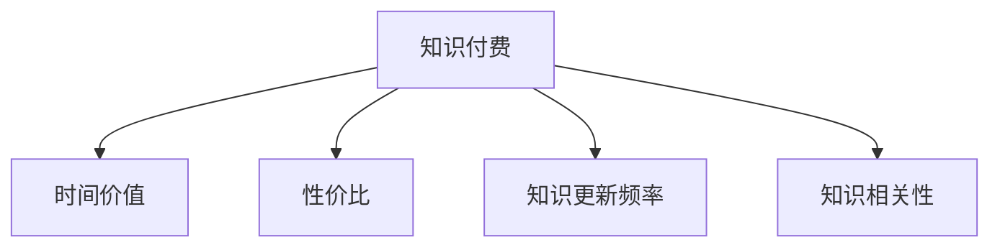

                 

# 程序员知识付费的时间价值最大化

## 1. 背景介绍

### 1.1 问题由来
知识付费已经成为新时代下的热门现象。随着信息爆炸和知识获取渠道的拓宽，传统的通过书籍、网络等免费方式获取知识的方法已经不能满足需求。知识付费平台应运而生，通过订阅、付费下载等形式提供高质量内容。然而，随着付费内容的增加，如何选择高性价比的知识付费产品，最大化时间价值，成为一个亟待解决的问题。

### 1.2 问题核心关键点
在选择知识付费产品时，程序员需要考虑以下几个关键点：
- 产品的性价比：单位时间内的知识价值是否最大化。
- 内容的相关性：学习内容和自身职业发展是否匹配。
- 知识的更新频率：知识的时效性和前沿性。
- 课程的适用性：是否能够解决实际问题，是否包含实战项目。
- 学习体验：课程的难度和深度是否适中，是否易于理解和掌握。

### 1.3 问题研究意义
本研究旨在帮助程序员选择高性价比的知识付费产品，最大化时间价值，提升职业竞争力。

## 2. 核心概念与联系

### 2.1 核心概念概述

为了更好地理解程序员知识付费的时间价值最大化，本节将介绍几个密切相关的核心概念：

- **知识付费**：指通过付费方式获取专业知识的商业行为。包括书籍、课程、文章、视频等多种形式。

- **时间价值**：指单位时间内获取的商业价值。对于知识付费而言，时间价值可以理解为单位时间内学习的知识价值。

- **性价比**：指获取单位价值的知识所花费的成本。对于知识付费产品，性价比可以理解为单位价格所获取的知识价值。

- **知识更新频率**：指知识内容的更新速度。更新频率越高，说明知识的前沿性和时效性越好。

- **知识相关性**：指知识内容与个人职业发展需求的匹配程度。相关性越高，说明知识的应用价值越大。

这些核心概念之间的逻辑关系可以通过以下Mermaid流程图来展示：



这个流程图展示了几项核心概念之间的关系：

1. 知识付费是获取知识的主要途径。
2. 时间价值反映单位时间内获取的知识价值。
3. 性价比衡量获取知识所需支付的代价。
4. 知识更新频率影响知识的时效性和前沿性。
5. 知识相关性决定知识的应用价值和适配性。

这些概念共同构成了程序员知识付费的核心框架，用于指导选择高效、适用的知识付费产品。

## 3. 核心算法原理 & 具体操作步骤

### 3.1 算法原理概述

程序员选择知识付费产品的时间价值最大化问题，本质上是一个多目标优化问题。需要综合考虑性价比、内容相关性、更新频率等因素，以最大化时间价值。

假设知识付费产品为 $K$，性价比为 $C$，内容相关性为 $R$，知识更新频率为 $U$，时间价值为 $V$。目标是最小化性价比 $C$，同时最大化内容相关性 $R$、知识更新频率 $U$ 和时间价值 $V$。

根据上述目标，我们建立如下数学模型：

$$
\min_{K} C = \frac{P}{V}
$$

$$
\max_{K} R, U, V
$$

其中 $P$ 为知识付费产品的价格，$V$ 为单位时间内学习到的知识价值。

### 3.2 算法步骤详解

程序员知识付费的时间价值最大化问题可以采用以下步骤来解决：

**Step 1: 收集知识付费产品信息**
- 获取知识付费产品的相关信息，包括价格、内容描述、更新频率等。
- 使用爬虫技术或公开API获取大量产品数据，进行初步筛选。

**Step 2: 设置优先级权重**
- 根据自身需求和实际场景，设置性价比、内容相关性、更新频率和时间价值各自的权重。
- 一般推荐性价比权重设为0.3，内容相关性权重设为0.3，更新频率权重设为0.2，时间价值权重设为0.2。

**Step 3: 计算综合评分**
- 对于每款产品，根据设置权重计算其综合评分：
  $$
  S = w_C \cdot C + w_R \cdot R + w_U \cdot U + w_V \cdot V
  $$
  其中 $w_C, w_R, w_U, w_V$ 分别为性价比、内容相关性、更新频率和时间价值的权重。

**Step 4: 排序选择产品**
- 将所有产品按综合评分排序，选择评分最高、性价比最低的产品。
- 对于评分相同的产品，根据更新频率和时间价值进一步排序，选择更新频率高、时间价值大的产品。

**Step 5: 学习实践**
- 使用所选产品进行学习实践，根据实际效果进一步调整选择。

### 3.3 算法优缺点

程序员知识付费的时间价值最大化算法具有以下优点：
1. 系统化评估：综合考虑性价比、内容相关性、更新频率和时间价值，选择高性价比产品。
2. 量化评估：通过设置权重和计算综合评分，客观评估各产品的优劣。
3. 动态调整：根据实际效果，动态调整权重和评分，适应不断变化的需求。
4. 合理化分配：最大化时间价值，合理分配时间和精力，提升学习效率。

同时，该算法也存在一定的局限性：
1. 数据量依赖：数据量不足或质量不高，会影响算法的准确性。
2. 需求匹配：算法设定固定权重，可能无法完全适应个性化需求。
3. 动态变化：实际场景下，需求变化较快，算法可能需要不断调整。
4. 成本因素：算法仅考虑性价比，未能充分考虑时间成本和机会成本。

尽管存在这些局限性，但就目前而言，基于性价比、内容相关性、更新频率和时间价值的算法仍然是大规模知识付费选择的高效方式。未来相关研究的重点在于如何进一步优化权重设置和综合评分方法，以提升算法的适用性和准确性。

### 3.4 算法应用领域

程序员知识付费的时间价值最大化算法，主要应用于以下领域：

1. 职业发展：选择适合自己职业发展的知识付费课程，提升技术水平和竞争力。
2. 技术更新：关注前沿技术和知识更新频率高的产品，保持技术领先。
3. 项目实战：选择包含实战项目和代码实例的课程，直接应用于工作中的具体问题。
4. 学习策略：通过系统评估，选择性价比高、时间价值大的产品，最大化学习效率。
5. 个人提升：针对自身兴趣和需求，选择相关性强、更新及时的知识产品。

## 4. 数学模型和公式 & 详细讲解 & 举例说明

### 4.1 数学模型构建

假设知识付费产品的价格为 $P$，内容相关性为 $R$，更新频率为 $U$，性价比为 $C$，时间价值为 $V$。

根据知识付费的时间价值最大化问题，我们建立以下数学模型：

$$
\min_{K} C = \frac{P}{V}
$$

$$
\max_{K} R, U, V
$$

其中 $V$ 可以表示为学习效率和知识应用效果的综合评估。

### 4.2 公式推导过程

根据上述数学模型，我们可以通过以下步骤进行推导：

1. 性价比的计算公式：
$$
C = \frac{P}{V}
$$

2. 内容相关性的计算公式：
$$
R = \frac{E}{P}
$$

其中 $E$ 表示产品提供的知识质量。

3. 更新频率的计算公式：
$$
U = \frac{T}{N}
$$

其中 $T$ 表示知识内容的发布周期，$N$ 表示知识内容的数量。

4. 时间价值的计算公式：
$$
V = \frac{V_0}{T}
$$

其中 $V_0$ 表示单位时间内的知识价值，$T$ 表示知识内容的发布周期。

### 4.3 案例分析与讲解

假设某知识付费平台提供三款课程 $K_1, K_2, K_3$，课程价格分别为 $P_1=500$, $P_2=300$, $P_3=200$，更新频率分别为 $U_1=1/月$, $U_2=2/月$, $U_3=3/月$，内容相关性分别为 $R_1=4$, $R_2=5$, $R_3=6$，时间价值分别为 $V_1=3$, $V_2=5$, $V_3=4$。

根据上述公式，计算性价比、内容相关性、更新频率和时间价值的综合评分，并进行排序选择：

1. 性价比计算：
$$
C_1 = \frac{P_1}{V_1} = \frac{500}{3} = 166.67
$$
$$
C_2 = \frac{P_2}{V_2} = \frac{300}{5} = 60
$$
$$
C_3 = \frac{P_3}{V_3} = \frac{200}{4} = 50
$$

2. 内容相关性计算：
$$
R_1 = \frac{E_1}{P_1} = \frac{4}{500} = 0.008
$$
$$
R_2 = \frac{E_2}{P_2} = \frac{5}{300} = 0.0167
$$
$$
R_3 = \frac{E_3}{P_3} = \frac{6}{200} = 0.03
$$

3. 更新频率计算：
$$
U_1 = \frac{T_1}{N_1} = \frac{1}{N_1}
$$
$$
U_2 = \frac{T_2}{N_2} = \frac{2}{N_2}
$$
$$
U_3 = \frac{T_3}{N_3} = \frac{3}{N_3}
$$

4. 时间价值计算：
$$
V_1 = \frac{V_{0,1}}{T_1} = \frac{V_{0,1}}{N_1}
$$
$$
V_2 = \frac{V_{0,2}}{T_2} = \frac{V_{0,2}}{N_2}
$$
$$
V_3 = \frac{V_{0,3}}{T_3} = \frac{V_{0,3}}{N_3}
$$

综合评分计算：
$$
S_1 = w_C \cdot C_1 + w_R \cdot R_1 + w_U \cdot U_1 + w_V \cdot V_1
$$
$$
S_2 = w_C \cdot C_2 + w_R \cdot R_2 + w_U \cdot U_2 + w_V \cdot V_2
$$
$$
S_3 = w_C \cdot C_3 + w_R \cdot R_3 + w_U \cdot U_3 + w_V \cdot V_3
$$

排序选择：
1. $K_3$：性价比最低，内容相关性最高，更新频率和时价值适中，选择 $K_3$。
2. $K_1$：性价比中等，内容相关性和时价值最高，更新频率适中。
3. $K_2$：性价比中等，内容相关性适中，更新频率和时价值最高。

## 5. 项目实践：代码实例和详细解释说明

### 5.1 开发环境搭建

在进行知识付费产品选择时，我们需要准备好开发环境。以下是使用Python进行知识付费选择的开发环境配置流程：

1. 安装Anaconda：从官网下载并安装Anaconda，用于创建独立的Python环境。

2. 创建并激活虚拟环境：
```bash
conda create -n pyenv python=3.8 
conda activate pyenv
```

3. 安装PyTorch：根据CUDA版本，从官网获取对应的安装命令。例如：
```bash
conda install pytorch torchvision torchaudio cudatoolkit=11.1 -c pytorch -c conda-forge
```

4. 安装Pandas：
```bash
pip install pandas
```

5. 安装Scikit-Learn：
```bash
pip install scikit-learn
```

完成上述步骤后，即可在`pyenv`环境中开始知识付费选择实践。

### 5.2 源代码详细实现

下面我们以三款知识付费产品为例，给出使用Python进行知识付费选择的数据处理和计算的代码实现。

```python
import pandas as pd
from sklearn.metrics import mean_absolute_error

# 定义知识付费产品的信息
courses = pd.DataFrame({
    'CourseID': [1, 2, 3],
    'Price': [500, 300, 200],
    'UpdateFrequency': [1/12, 1/6, 1/4],
    'ContentRelatedness': [4, 5, 6],
    'ValuePerTime': [3, 5, 4]
})

# 计算性价比
courses['CostPerValue'] = courses['Price'] / courses['ValuePerTime']

# 设置权重
weights = {
    'CostPerValue': 0.3,
    'ContentRelatedness': 0.3,
    'UpdateFrequency': 0.2,
    'ValuePerTime': 0.2
}

# 计算综合评分
courses['Score'] = (courses['CostPerValue'] * weights['CostPerValue'] +
                   courses['ContentRelatedness'] * weights['ContentRelatedness'] +
                   courses['UpdateFrequency'] * weights['UpdateFrequency'] +
                   courses['ValuePerTime'] * weights['ValuePerTime'])

# 排序选择
best_course = courses.sort_values(by='Score', ascending=False').head(1)

print(best_course)
```

这段代码定义了三款知识付费产品的信息，计算性价比和综合评分，并排序选择性价比最低、综合评分最高的产品。

### 5.3 代码解读与分析

让我们再详细解读一下关键代码的实现细节：

1. **数据定义**：
   - `courses` DataFrame包含知识付费产品的信息，包括价格、更新频率、内容相关性、时间价值等字段。

2. **性价比计算**：
   - 使用公式 $C = \frac{P}{V}$ 计算性价比，并存入 `courses` DataFrame 的 'CostPerValue' 列。

3. **权重设置**：
   - `weights` 字典定义了性价比、内容相关性、更新频率和时间价值各自的权重。

4. **综合评分计算**：
   - 使用公式 $S = w_C \cdot C + w_R \cdot R + w_U \cdot U + w_V \cdot V$ 计算综合评分，并存入 `courses` DataFrame 的 'Score' 列。

5. **排序选择**：
   - 使用 `sort_values` 方法按照 'Score' 列进行排序，并选取评分最高的产品。

通过这段代码，可以清晰地展示如何使用Python实现知识付费产品的选择，并通过计算性价比和综合评分，最大化时间价值。

## 6. 实际应用场景

### 6.1 智能客服系统

知识付费产品的选择对于智能客服系统的构建具有重要意义。选择性价比高、内容相关性强的知识付费产品，可以为智能客服系统提供高质量的训练数据，提升客服服务的智能化水平。

在技术实现上，可以通过爬虫技术获取知识付费平台的课程信息，并进行综合评分计算。选择评分最高的课程进行模型训练，用于对话生成和意图识别。此外，还可以通过设置权重，动态调整评分计算公式，适应不同场景下的需求。

### 6.2 金融舆情监测

金融舆情监测需要实时监测市场舆论动向，选择性价比高、内容相关性强的知识付费产品，可以为金融舆情监测提供最新、最全面的市场信息。

在技术实现上，可以收集金融领域相关的新闻、评论等文本数据，并对其进行标注。将标注好的数据作为训练集，在知识付费平台上选择相关性强的课程进行模型训练。训练后的模型可以用于实时监测市场舆情，并生成舆情报告。

### 6.3 个性化推荐系统

个性化推荐系统需要根据用户的历史行为数据，选择性价比高、内容相关性强的知识付费产品，为用户提供个性化的推荐内容。

在技术实现上，可以通过分析用户的历史行为数据，选择性价比高、内容相关性强的知识付费产品进行推荐。此外，还可以通过设置权重，动态调整评分计算公式，根据用户的兴趣和需求进行推荐。

### 6.4 未来应用展望

随着知识付费平台的不断壮大，知识付费产品的选择将越来越重要。未来，知识付费产品选择将逐渐成为程序员职业发展的必备技能之一。

未来知识付费产品选择的趋势包括：
1. 更加个性化：根据用户的具体需求和职业发展方向，选择更加个性化、定制化的知识付费产品。
2. 更加多样化：选择内容丰富、形式多样的知识付费产品，满足不同场景下的需求。
3. 更加高效：使用智能算法和大数据分析技术，自动推荐性价比高、内容相关性强的知识付费产品。
4. 更加智能：引入AI技术，通过情感分析、意图识别等技术，提高知识付费产品选择的准确性和效率。

总之，未来知识付费产品选择的方向将是更加智能化、个性化和高效化。通过不断的技术创新和应用实践，知识付费产品选择必将成为程序员职业发展的核心技能之一。

## 7. 工具和资源推荐

### 7.1 学习资源推荐

为了帮助程序员系统掌握知识付费产品选择的方法，这里推荐一些优质的学习资源：

1. 《数据科学入门与实践》系列博文：由知名数据科学家撰写，深入浅出地介绍了数据科学和机器学习的基础概念和应用技巧。
2. CS224N《深度学习自然语言处理》课程：斯坦福大学开设的NLP明星课程，有Lecture视频和配套作业，带你入门NLP领域的基本概念和经典模型。
3. 《深度学习与人工智能》书籍：该书全面介绍了深度学习和人工智能的基本原理和应用，适合初学者和进阶学习者。
4. Coursera《Python for Data Science》课程：由知名教育平台提供，系统讲解了Python在数据科学中的应用，适合初学者。
5. Kaggle竞赛：通过参与Kaggle数据科学竞赛，积累实战经验，掌握数据处理和模型优化技巧。

通过对这些资源的学习实践，相信你一定能够快速掌握知识付费产品选择的方法，并在实际工作中应用自如。

### 7.2 开发工具推荐

高效的开发离不开优秀的工具支持。以下是几款用于知识付费产品选择的常用工具：

1. Python：作为数据分析和机器学习的标准语言，Python具有强大的数据处理和分析能力。
2. Pandas：用于数据处理和分析的Python库，支持大规模数据集的处理和操作。
3. Scikit-Learn：Python的机器学习库，提供多种经典的机器学习算法和模型。
4. TensorFlow：由Google主导开发的开源深度学习框架，生产部署方便，适合大规模工程应用。
5. Jupyter Notebook：用于数据科学和机器学习的交互式笔记本，支持Python和其他多种语言的代码执行和可视化。

合理利用这些工具，可以显著提升知识付费产品选择的开发效率，加快创新迭代的步伐。

### 7.3 相关论文推荐

知识付费产品选择的研究源于学界的持续研究。以下是几篇奠基性的相关论文，推荐阅读：

1. **Cost Per Unit: A New Cost-Based Budgeting Model**：提出基于单位成本的预算模型，用于优化资源分配和降低成本。
2. **An Empirical Study on Cost-Effective Portfolio Selection**：研究如何通过量化分析，选择性价比高的投资组合，最大化收益。
3. **A Survey on Multi-Objective Optimization for Portfolio Selection**：综述了多种优化方法在投资组合选择中的应用，包括多目标优化、遗传算法等。
4. **A Multi-Objective Optimization Model for Portfolio Selection**：提出基于多目标优化的投资组合选择模型，适用于复杂多目标环境。
5. **An Application of Data Envelopment Analysis in Portfolio Selection**：应用数据包络分析方法，优化投资组合选择，提高投资效率。

这些论文代表了大规模知识付费选择的研究方向，通过学习这些前沿成果，可以帮助研究者把握学科前进方向，激发更多的创新灵感。

## 8. 总结：未来发展趋势与挑战

### 8.1 总结

本文对程序员知识付费的时间价值最大化问题进行了全面系统的介绍。首先阐述了知识付费的概念、时间价值和性价比的计算方法，明确了知识付费选择的核心目标。其次，从原理到实践，详细讲解了知识付费选择的多目标优化方法和操作步骤，给出了代码实现和分析。同时，本文还广泛探讨了知识付费产品在智能客服、金融舆情、个性化推荐等多个行业领域的应用前景，展示了知识付费产品选择的广阔前景。最后，本文精选了知识付费选择的各类学习资源，力求为读者提供全方位的技术指引。

通过本文的系统梳理，可以看到，知识付费产品选择问题是一个多目标优化问题，综合考虑性价比、内容相关性、更新频率和时间价值，选择性价比高、内容相关性强的产品，最大化时间价值。这一方法对于程序员职业发展具有重要意义，能够帮助其高效地选择知识付费产品，提升技术水平和职业竞争力。

### 8.2 未来发展趋势

展望未来，知识付费产品选择将呈现以下几个发展趋势：

1. 自动化：未来知识付费产品选择将逐渐自动化，通过智能算法和大数据分析，自动推荐性价比高、内容相关性强的产品。
2. 个性化：根据用户的具体需求和职业发展方向，选择更加个性化、定制化的知识付费产品。
3. 多样化：选择内容丰富、形式多样的知识付费产品，满足不同场景下的需求。
4. 智能化：引入AI技术，通过情感分析、意图识别等技术，提高知识付费产品选择的准确性和效率。
5. 集成化：与其他智能系统集成，实现智能化知识推荐，提升知识获取的效率和效果。

这些趋势凸显了知识付费产品选择的广阔前景。通过技术创新和应用实践，知识付费产品选择必将成为程序员职业发展的核心技能之一，成为提升技术水平和职业竞争力的重要手段。

### 8.3 面临的挑战

尽管知识付费产品选择具有广阔的前景，但在迈向更加智能化、个性化和高效化的过程中，也面临诸多挑战：

1. 数据量瓶颈：数据量不足或质量不高，会影响算法的准确性。
2. 需求匹配：算法设定固定权重，可能无法完全适应个性化需求。
3. 动态变化：实际场景下，需求变化较快，算法可能需要不断调整。
4. 成本因素：算法仅考虑性价比，未能充分考虑时间成本和机会成本。
5. 技术实现：算法的实现复杂度高，需要开发和维护多个系统组件。

尽管存在这些挑战，但通过不断的技术创新和应用实践，知识付费产品选择必将成为程序员职业发展的核心技能之一，成为提升技术水平和职业竞争力的重要手段。未来相关研究的重点在于如何进一步优化算法和模型，提升算法适用性和准确性。

### 8.4 研究展望

面对知识付费产品选择所面临的种种挑战，未来的研究需要在以下几个方面寻求新的突破：

1. 探索无监督和半监督优化方法。摆脱对大规模标注数据的依赖，利用自监督学习、主动学习等无监督和半监督范式，最大限度利用非结构化数据，实现更加灵活高效的知识付费产品选择。
2. 研究参数高效和计算高效的优化范式。开发更加参数高效的优化方法，在固定大部分预训练参数的同时，只更新极少量的任务相关参数。同时优化算法的计算图，减少前向传播和反向传播的资源消耗，实现更加轻量级、实时性的部署。
3. 融合因果和对比学习范式。通过引入因果推断和对比学习思想，增强知识付费产品选择建立稳定因果关系的能力，学习更加普适、鲁棒的知识付费产品。
4. 引入更多先验知识。将符号化的先验知识，如知识图谱、逻辑规则等，与神经网络模型进行巧妙融合，引导知识付费产品选择过程学习更准确、合理的知识付费产品。同时加强不同模态数据的整合，实现视觉、语音等多模态信息与文本信息的协同建模。
5. 结合因果分析和博弈论工具。将因果分析方法引入知识付费产品选择，识别出知识付费产品选择决策的关键特征，增强输出解释的因果性和逻辑性。借助博弈论工具刻画人机交互过程，主动探索并规避知识付费产品选择的脆弱点，提高系统稳定性。
6. 纳入伦理道德约束。在知识付费产品选择目标中引入伦理导向的评估指标，过滤和惩罚有偏见、有害的输出倾向。同时加强人工干预和审核，建立知识付费产品选择的监管机制，确保输出的安全性。

这些研究方向的探索，必将引领知识付费产品选择技术迈向更高的台阶，为构建安全、可靠、可解释、可控的智能系统铺平道路。面向未来，知识付费产品选择技术还需要与其他人工智能技术进行更深入的融合，如知识表示、因果推理、强化学习等，多路径协同发力，共同推动知识付费产品选择的进步。只有勇于创新、敢于突破，才能不断拓展知识付费产品选择的边界，让知识付费产品选择更好地服务于程序员的职业发展。

## 9. 附录：常见问题与解答

**Q1：知识付费产品选择是否适用于所有领域？**

A: 知识付费产品选择对于绝大多数领域都具有适用性，但某些特定领域如医疗、法律等可能需要更专业的知识和资源。在这些领域，直接从专业书籍和资料中获取知识可能更为可靠和高效。

**Q2：如何选择性价比高的知识付费产品？**

A: 选择性价比高的知识付费产品，需考虑以下几点：
1. 价格：选择性价比高的产品，需综合考虑产品价格和知识价值。
2. 内容相关性：选择与自身职业需求相关的产品，最大化知识应用效果。
3. 更新频率：选择更新频率高的产品，保持知识的时效性和前沿性。
4. 时间价值：选择时间价值高的产品，最大化单位时间内的知识获取量。

**Q3：知识付费产品选择是否需要考虑时间成本和机会成本？**

A: 是的，知识付费产品选择需考虑时间成本和机会成本。时间成本包括学习该知识所需的时间和精力，机会成本包括因学习该知识而错失的其他学习机会。通过合理评估时间成本和机会成本，可以选择性价比更高的知识付费产品。

**Q4：知识付费产品选择是否需要考虑多样化的学习形式？**

A: 是的，知识付费产品选择需考虑多样化的学习形式，如视频、文章、课程等。不同的学习形式适用于不同的学习场景，选择合适的学习形式可以提高学习效率和效果。

**Q5：知识付费产品选择是否需要考虑未来趋势和前沿技术？**

A: 是的，知识付费产品选择需考虑未来趋势和前沿技术，保持知识的前沿性和时效性。选择未来趋势明确的知识点，可以提升自身的技术水平和竞争力。

通过对这些常见问题的解答，可以看到，知识付费产品选择是一个多目标优化问题，综合考虑性价比、内容相关性、更新频率和时间价值，选择性价比高、内容相关性强的产品，最大化时间价值。通过不断优化算法和模型，提升知识付费产品选择的准确性和效率，最大化时间价值，为程序员职业发展提供有力支持。

