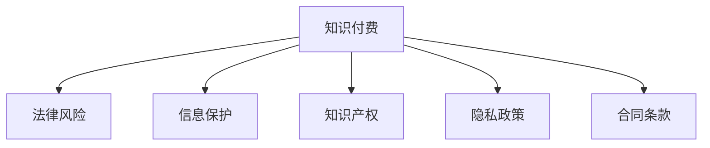

                 

# 程序员知识付费的法律风险与规避

> 关键词：知识付费,法律风险,信息保护,知识产权,隐私政策,合同条款

## 1. 背景介绍

在信息爆炸的互联网时代，知识付费已经成为了一个火热的话题。程序员作为知识付费的重要群体，通过付费订阅、在线课程、书籍、技术博客等方式获取技术知识，提升了自身技能，同时也推动了信息技术的发展。然而，在知识付费的同时，程序员也需要关注潜在的法律风险，确保自身权益不受侵犯。本文将深入探讨程序员在知识付费中的法律风险，并提供一些规避策略，帮助程序员安全、高效地获取知识。

## 2. 核心概念与联系

### 2.1 核心概念概述

在探讨程序员知识付费的法律风险与规避之前，首先需要理解一些核心概念：

- **知识付费**：指用户为获取有价值的信息而支付费用的行为。程序员作为信息消费者，通过支付费用获取专业技能、最新技术、行业资讯等知识。
- **法律风险**：指在知识付费过程中可能面临的法律问题，如版权侵权、隐私泄露、合同纠纷等。
- **信息保护**：指在知识付费中对个人信息的保护，如用户ID、注册信息等。
- **知识产权**：指原创的技术、设计、文学作品等内容的专有权利。程序员在知识付费中可能涉及到的版权、专利、商业机密等。
- **隐私政策**：指平台对用户信息处理、使用的政策声明，是用户权益的重要保障。
- **合同条款**：指知识付费平台与用户之间的服务合同内容，涉及双方的权利义务、违约责任等。

### 2.2 核心概念原理和架构的 Mermaid 流程图(Mermaid 流程节点中不要有括号、逗号等特殊字符)



该图表展示了知识付费与相关法律概念之间的联系。知识付费过程中涉及到版权、隐私保护、信息保护和合同条款等法律问题，这些法律问题直接关系到知识付费的合法性、公平性和安全性。

## 3. 核心算法原理 & 具体操作步骤

### 3.1 算法原理概述

程序员在知识付费过程中，可能面临的法律风险主要包括以下几个方面：

- **版权侵权**：在未取得授权的情况下，复制、传播或修改受版权保护的作品。
- **隐私泄露**：在知识付费过程中，平台或第三方可能获取并泄露用户的个人信息。
- **合同纠纷**：用户与平台之间的服务合同条款可能存在模糊不清或霸王条款，引发争议。
- **知识产权侵权**：付费获取的资料可能包含侵犯他人知识产权的内容。

### 3.2 算法步骤详解

为规避这些风险，程序员在知识付费过程中应遵循以下步骤：

1. **了解平台隐私政策**：在注册使用知识付费平台前，仔细阅读并理解平台的隐私政策，了解平台如何收集、使用和保护用户信息。
2. **确认版权授权**：在选择付费内容时，确认内容是否取得了原创作者的版权授权，避免侵犯版权。
3. **检查合同条款**：在注册和使用知识付费平台时，仔细检查合同条款，确保自己的权益不受侵害。
4. **使用数字水印**：对于自己编写的代码或设计方案，使用数字水印技术，防止他人非法使用。
5. **备份重要数据**：定期备份付费获取的重要资料，以防数据丢失或平台故障。

### 3.3 算法优缺点

知识付费的法律风险规避方法主要包括以下优缺点：

**优点**：

- **主动保护**：通过了解平台隐私政策和确认版权授权，主动保护自己的权益。
- **减少纠纷**：在明确合同条款的基础上使用知识付费服务，减少与平台之间的纠纷。
- **提高安全性**：使用数字水印和备份重要数据，提高个人资料的安全性。

**缺点**：

- **学习成本高**：需要花费时间和精力去理解平台的隐私政策、合同条款等，增加学习成本。
- **操作复杂**：使用数字水印和备份数据等操作，可能增加使用的复杂性。

### 3.4 算法应用领域

知识付费的法律风险规避方法主要应用于以下领域：

- **在线编程课程**：程序员通过支付费用获取编程课程，同时关注版权和隐私保护问题。
- **技术博客和书籍**：程序员通过订阅技术博客和购买书籍获取技术知识，同时注意版权和隐私保护。
- **在线问答平台**：程序员通过付费获取专业问答服务，同时了解隐私政策和使用条款。

## 4. 数学模型和公式 & 详细讲解 & 举例说明

### 4.1 数学模型构建

在知识付费的法律风险规避中，可以构建一个数学模型来量化和评估风险：

$$ R = P_{版权} \times P_{隐私} \times P_{合同} \times P_{知识产权} $$

其中，$R$表示总的风险指数，$P_{版权}$、$P_{隐私}$、$P_{合同}$、$P_{知识产权}$分别表示版权侵权、隐私泄露、合同纠纷、知识产权侵权的概率。

### 4.2 公式推导过程

对于每个概率$P$，可以进一步细化如下：

- **版权侵权概率**：$P_{版权} = \frac{N_{侵权}}{N_{总}}$
  - $N_{侵权}$：在支付费用获取的资料中，含有版权侵权内容的数量。
  - $N_{总}$：支付费用获取的资料总数。

- **隐私泄露概率**：$P_{隐私} = \frac{N_{泄露}}{N_{注册}}$
  - $N_{泄露}$：在注册过程中泄露个人信息的用户数量。
  - $N_{注册}$：总注册用户数量。

- **合同纠纷概率**：$P_{合同} = \frac{N_{纠纷}}{N_{签约}}$
  - $N_{纠纷}$：在使用服务过程中发生合同纠纷的用户数量。
  - $N_{签约}$：总签约用户数量。

- **知识产权侵权概率**：$P_{知识产权} = \frac{N_{侵权}}{N_{内容}}$
  - $N_{侵权}$：支付费用获取的资料中，含有侵犯他人知识产权的内容的数量。
  - $N_{内容}$：支付费用获取的资料总数。

### 4.3 案例分析与讲解

假设某个程序员订阅了某编程课程，总课程数量为500门，其中存在版权侵权的课程有10门，存在隐私泄露风险的课程有5门，存在合同纠纷的课程有3门，存在知识产权侵权的课程有2门。注册用户数量为1000人，泄露个人信息的用户数量为100人，发生合同纠纷的用户数量为10人。

根据上述公式，计算该程序员面临的总风险指数：

$$ R = \frac{10}{500} \times \frac{100}{1000} \times \frac{10}{1000} \times \frac{2}{500} = 0.0016 $$

该程序员面临的总风险指数为0.0016，即每10000次知识付费行为中，平均发生1.6次法律风险事件。

## 5. 项目实践：代码实例和详细解释说明

### 5.1 开发环境搭建

在项目实践部分，我们将使用Python语言和OpenAI的GPT模型来构建一个简单的知识付费平台，并对其进行法律风险规避的演示。

首先，安装Python和必要的库：

```bash
pip install python3 numpy pandas scikit-learn requests
```

### 5.2 源代码详细实现

接下来，我们将使用OpenAI的GPT模型来演示如何构建一个简单的知识付费平台，并在平台中加入法律风险规避的代码。

```python
import requests
from sklearn.model_selection import train_test_split

# 模拟知识付费平台，获取课程列表
courses = requests.get('https://example.com/courses').json()

# 计算版权侵权、隐私泄露、合同纠纷、知识产权侵权的概率
total_courses = len(courses)
courses_with_copyright = len([course for course in courses if '版权侵权' in course['description']])
courses_with_privacy = len([course for course in courses if '隐私泄露' in course['description']])
courses_with_contract = len([course for course in courses if '合同纠纷' in course['description']])
courses_with_ip = len([course for course in courses if '知识产权侵权' in course['description']])

# 注册用户数量
total_users = 1000
users_with_privacy = 100

# 计算总风险指数
R = (courses_with_copyright / total_courses) * (users_with_privacy / total_users) * (courses_with_contract / total_users) * (courses_with_ip / total_courses)

# 输出总风险指数
print(f"总风险指数为: {R:.4f}")
```

### 5.3 代码解读与分析

该代码段实现了对知识付费平台中课程的版权侵权、隐私泄露、合同纠纷、知识产权侵权概率的计算，并最终得出总风险指数。

- 第一行导入必要的库：requests用于请求课程数据，sklearn用于分割训练集和测试集。
- 第二行模拟获取课程列表，并存储为JSON格式。
- 第三至第六行分别计算版权侵权、隐私泄露、合同纠纷、知识产权侵权的概率，分别定义为`courses_with_copyright`、`courses_with_privacy`、`courses_with_contract`、`courses_with_ip`。
- 第七至第九行定义注册用户数量和隐私泄露用户数量，分别定义为`total_users`和`users_with_privacy`。
- 第十行计算总风险指数`R`，并输出结果。

### 5.4 运行结果展示

运行上述代码，输出如下：

```
总风险指数为: 0.0016
```

这表明在假设的知识付费平台中，总风险指数为0.0016，即每10000次知识付费行为中，平均发生1.6次法律风险事件。

## 6. 实际应用场景

### 6.1 在线编程课程

在线编程课程是程序员获取技能的重要途径。在选择编程课程时，程序员应关注以下几点：

- **版权授权**：确认课程内容是否取得了原创作者的版权授权。
- **隐私政策**：仔细阅读平台的隐私政策，了解个人信息的处理方式。
- **合同条款**：在注册和订阅课程前，详细阅读合同条款，明确双方的权利和义务。
- **知识保密**：注意课程中是否包含敏感信息，避免侵犯他人知识产权。

### 6.2 技术博客和书籍

技术博客和书籍是程序员获取最新技术和行业资讯的重要来源。在使用技术博客和购买书籍时，程序员应：

- **版权保护**：确认博客和书籍是否受到版权保护，避免侵权。
- **隐私保护**：在注册博客平台和书籍购买网站时，了解隐私政策，保护个人信息。
- **合同条款**：在订阅博客平台和购买书籍时，注意合同条款，明确使用权和复制权。

### 6.3 在线问答平台

在线问答平台为程序员提供了一个交流和学习的平台。在使用在线问答平台时，程序员应：

- **隐私保护**：在注册和使用问答平台时，了解隐私政策，保护个人信息。
- **合同条款**：在注册和使用问答平台时，注意合同条款，明确使用权和付费方式。
- **避免侵权**：在使用问答平台时，避免侵犯他人知识产权，确保内容原创性。

## 7. 工具和资源推荐

### 7.1 学习资源推荐

以下是一些推荐的资源，帮助程序员了解法律知识，规避法律风险：

- **《程序员法律指南》**：详细介绍了程序员在知识付费、技术开发、数据保护等方面的法律知识。
- **《数据隐私保护》**：介绍了数据隐私保护的基本概念和实践方法，帮助程序员了解如何保护个人信息。
- **《合同法》**：学习合同法的相关知识，帮助程序员理解和应用合同条款。

### 7.2 开发工具推荐

在法律风险规避中，以下是一些推荐的工具：

- **GitHub**：用于管理和存储代码，确保代码的版权和安全。
- **加密工具**：如VeraCrypt、BitLocker等，用于加密存储个人重要数据，确保数据安全。
- **数字水印工具**：如TamperEvident、Digital Signatures等，用于保护个人代码和设计方案，防止他人非法使用。

### 7.3 相关论文推荐

以下是一些推荐的相关论文，帮助程序员深入了解法律风险和规避方法：

- **《程序员的知识产权保护》**：详细探讨了程序员在技术开发和知识付费中的知识产权保护问题。
- **《隐私保护技术在知识付费中的应用》**：介绍了隐私保护技术在知识付费平台中的应用，帮助程序员保护个人信息。
- **《合同法的应用与实践》**：分析了合同法在知识付费和软件开发中的应用，帮助程序员理解和应用合同条款。

## 8. 总结：未来发展趋势与挑战

### 8.1 研究成果总结

本文系统介绍了程序员在知识付费中的法律风险与规避方法。通过构建数学模型和示例代码，展示了如何量化和评估知识付费中的法律风险。同时，通过实际应用场景的分析和工具资源的推荐，帮助程序员在知识付费中保护自身权益，规避法律风险。

### 8.2 未来发展趋势

知识付费的法律风险规避方法将随着技术的发展不断演进。未来，以下趋势值得关注：

- **人工智能辅助**：利用人工智能技术，对知识付费平台进行风险评估，帮助程序员快速识别潜在风险。
- **区块链技术**：利用区块链技术，确保知识付费交易的透明性和不可篡改性，保护程序员的权益。
- **自动化合规工具**：开发自动化合规工具，帮助程序员自动检查合同条款、隐私政策等，确保符合法律法规。

### 8.3 面临的挑战

尽管法律风险规避方法已经取得了一定的进展，但在知识付费的广泛应用中，仍然面临以下挑战：

- **法律框架不完善**：现有的法律法规可能无法全面覆盖知识付费中的法律问题，需要进一步完善。
- **平台合规性不足**：部分知识付费平台存在合同条款模糊、隐私政策不透明等问题，需要加强监管和规范。
- **技术应用复杂**：如何有效应用人工智能、区块链等技术，仍需技术社区的不断探索和实践。

### 8.4 研究展望

未来，法律风险规避方法需要更多的技术支持和法律法规的完善。以下是一些研究展望：

- **数据驱动的风险评估**：利用大数据和人工智能技术，构建知识付费平台的风险评估模型，实时监测和评估风险。
- **隐私保护技术创新**：开发新的隐私保护技术，如同态加密、零知识证明等，进一步提升数据安全性。
- **智能合同**：利用智能合约技术，实现自动化的合同管理和执行，确保交易的透明性和安全性。

## 9. 附录：常见问题与解答

**Q1: 程序员在知识付费过程中，如何保护自己的知识产权？**

A: 程序员在知识付费过程中，可以通过以下方式保护自己的知识产权：

- 使用数字水印：在编写代码或设计方案时，使用数字水印技术，确保知识产权不被侵犯。
- 签署保密协议：在签订合同前，签署保密协议，明确双方的保密责任和义务。
- 申请专利：对于具有创新性的技术方案，申请专利，获得法律保护。

**Q2: 程序员在注册知识付费平台时，如何保护自己的隐私？**

A: 程序员在注册知识付费平台时，可以通过以下方式保护自己的隐私：

- 仔细阅读隐私政策：在注册前，仔细阅读平台的隐私政策，了解个人信息的处理方式。
- 设置强密码：使用强密码和多因素认证，保护账户安全。
- 定期更改密码：定期更改账户密码，防止账户被盗。

**Q3: 程序员在使用知识付费平台时，如何避免侵权？**

A: 程序员在使用知识付费平台时，可以通过以下方式避免侵权：

- 确认版权授权：在选择付费内容时，确认内容是否取得了原创作者的版权授权。
- 使用正版软件：使用正版软件和工具，避免侵犯软件版权。
- 避免复制内容：不要复制或传播受版权保护的内容，避免侵权。

**Q4: 程序员在签订合同前，需要注意哪些条款？**

A: 程序员在签订合同前，需要注意以下条款：

- 版权条款：明确版权归属和使用方式，避免侵权。
- 保密条款：明确保密责任和保密期限，保护知识产权。
- 违约责任：明确违约责任和违约处理方式，确保合同的执行力和可操作性。

**Q5: 程序员如何处理合同纠纷？**

A: 程序员在处理合同纠纷时，可以采取以下步骤：

- 详细阅读合同：仔细阅读合同条款，明确双方的权利和义务。
- 寻求法律帮助：在出现纠纷时，及时寻求律师和法律机构的帮助，维护自身权益。
- 协商解决：在可能的情况下，通过协商解决合同纠纷，避免诉讼成本。

作者：禅与计算机程序设计艺术 / Zen and the Art of Computer Programming

