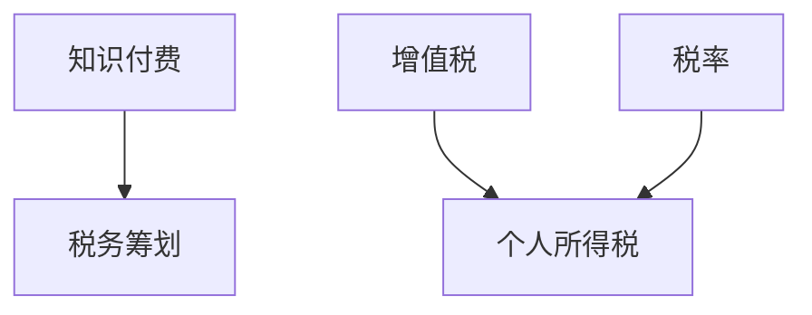

                 

# 程序员知识付费的税务筹划

## 1. 背景介绍

近年来，随着互联网技术的发展，知识付费逐渐成为一种流行趋势，尤其是在程序员群体中。许多程序员通过在线课程、专栏、咨询等方式，将自己的技术知识和经验转化为经济收益。然而，这一过程中涉及到的税务问题，却常常被忽略，导致不少程序员面临税收风险。本文将详细探讨程序员知识付费的税务筹划问题，帮助程序员合理避税，降低税收成本。

## 2. 核心概念与联系

### 2.1 核心概念概述

为更好地理解程序员知识付费的税务筹划，本节将介绍几个关键概念：

- **知识付费**：指程序员将自己的技术知识、经验和见解，通过在线课程、专栏、咨询服务等方式，向用户收取费用的行为。包括但不限于编程教学、项目指导、技术咨询等。

- **税务筹划**：指在税法允许的范围内，通过合理安排税务事项，减轻税负，降低税收成本，实现财务优化。

- **税率**：指根据个人或企业收入的不同阶段，所适用的税率。包括但不限于个人所得税、增值税等。

- **增值税**：指对商品或服务在流转过程中产生的增值部分征收的税。对知识付费中的技术服务费用，适用增值税。

- **个人所得税**：指对个人所得征收的税，包括工资薪金所得、劳务报酬所得等。对知识付费中的个人收入，也需缴纳个人所得税。

这些概念之间的逻辑关系可以通过以下Mermaid流程图来展示：



这个流程图展示了这个主题的核心概念及其之间的关系：

1. 知识付费是税务筹划的出发点。
2. 税务筹划的目标是合理降低知识付费的税收成本。
3. 增值税和个人所得税是知识付费中涉及的主要税种。

这些概念共同构成了程序员知识付费税务筹划的基础，帮助我们理解如何合理避税。

## 3. 核心算法原理 & 具体操作步骤

### 3.1 算法原理概述

程序员知识付费的税务筹划，本质上是一种基于税法框架下的财务优化策略。其核心思想是通过合理规划收入和成本，最大化税收抵扣和减免，从而降低整体税收负担。

形式化地，假设程序员通过知识付费获得的收入为 $I$，应缴纳的增值税为 $V$，个人所得税为 $P$，那么总税负 $T$ 可以表示为：

$$
T = V + P
$$

税务筹划的目标是最小化总税负 $T$，即：

$$
\min_{V,P} T = \min_{V,P} (V + P)
$$

在实际操作中，税务筹划需要在税法允许的范围内，通过合理规划收入和成本，最大化税收抵扣和减免。常见的税务筹划方法包括：

- 选择适用较低的增值税税率或享受增值税减免政策。
- 通过设置合理的定价策略，避免个人所得税率较高。
- 优化业务结构，充分利用税收抵扣和减免。

### 3.2 算法步骤详解

基于上述税务筹划的原理，程序员知识付费的税务筹划可以包括以下几个关键步骤：

**Step 1: 评估收入来源**

首先，需要对知识付费的收入来源进行全面评估，包括线上课程、专栏、咨询、技术服务等。对于不同收入来源，应分别计算应缴纳的增值税和个人所得税。

**Step 2: 选择适用税率**

根据《增值税暂行条例》和《个人所得税法》，选择适用较低的增值税税率或享受增值税减免政策。例如，财政部、国家税务总局发布的《关于个人提供非有形动产租赁服务增值税政策的通知》（财税〔2016〕36号）规定，个人提供技术咨询、技术服务等非有形动产租赁服务，适用6%的增值税税率。

**Step 3: 优化定价策略**

根据《个人所得税法》，个人收入分为工资薪金所得、劳务报酬所得等。程序员在知识付费中，应合理设置定价策略，避免个人所得税率较高。例如，通过设置月度收入上限，享受个人所得税月度汇总计税政策，即按年计税，月度汇总纳税。

**Step 4: 优化业务结构**

合理规划业务结构，充分利用税收抵扣和减免。例如，将知识付费业务与其他业务（如技术咨询、软件开发等）进行分离，分别成立独立的法人实体，享受小规模纳税人增值税免征政策。

**Step 5: 定期税务申报**

根据税法规定，定期进行增值税和个人所得税申报，确保申报信息准确无误。同时，注意收集和保留相关发票、合同等证明文件，以便税务稽查。

### 3.3 算法优缺点

程序员知识付费的税务筹划方法具有以下优点：

1. 简单高效。只需根据税法规定，合理规划收入和成本，即可降低整体税收负担。
2. 通用适用。适用于各种类型的知识付费业务，如编程教学、项目指导、技术咨询等。
3. 可操作性强。通过设置合理的定价策略和业务结构，可以有效降低税收成本。

同时，该方法也存在一定的局限性：

1. 依赖税法规定。税务筹划必须符合税法规定，否则可能面临税收风险。
2. 计算复杂。税务筹划需要计算不同收入来源的增值税和个人所得税，计算过程较为复杂。
3. 可能需要专业顾问。对于复杂税务筹划，可能需要税务专业人士的指导。

尽管存在这些局限性，但就目前而言，基于税法框架下的税务筹划方法仍是对程序员知识付费的必要手段。未来相关研究的重点在于如何进一步降低税务筹划的计算复杂度，提高税务筹划的可操作性。

### 3.4 算法应用领域

基于知识付费的税务筹划方法，可以应用于以下多个领域：

- **软件开发**：通过技术咨询、软件开发等方式进行知识付费，合理规划增值税和个人所得税。
- **项目管理**：为项目提供技术指导和咨询服务，合理设置定价策略，降低税收成本。
- **在线教育**：通过在线课程、专栏等方式进行知识付费，选择适用较低的增值税税率，享受增值税减免政策。
- **技术培训**：为技术培训机构提供技术支持，合理规划业务结构，充分利用税收抵扣和减免。
- **企业咨询**：为企业提供技术咨询和技术支持，选择适用较低的增值税税率，享受增值税减免政策。

除了上述这些领域，程序员知识付费的税务筹划方法也将在更多场景中得到应用，为程序员带来税收优化。

## 4. 数学模型和公式 & 详细讲解 & 举例说明

### 4.1 数学模型构建

本节将使用数学语言对程序员知识付费的税务筹划过程进行更加严格的刻画。

假设程序员通过知识付费获得的月度收入为 $I$，应缴纳的增值税为 $V$，个人所得税为 $P$，那么总税负 $T$ 可以表示为：

$$
T = V + P
$$

根据《增值税暂行条例》和《个人所得税法》，个人收入分为工资薪金所得、劳务报酬所得等。程序员在知识付费中，应合理设置定价策略，避免个人所得税率较高。例如，通过设置月度收入上限，享受个人所得税月度汇总计税政策，即按年计税，月度汇总纳税。

### 4.2 公式推导过程

以下我们以个人所得税月度汇总计税为例，推导个人所得税的计算公式。

假设月度收入上限为 $L$，月度收入为 $I$，则个人所得税 $P$ 可以表示为：

$$
P = \left\{
\begin{array}{ll}
\text{个人所得税月度汇总计税} & \text{如果 } I \leq L \\
\text{个人所得税月度计税} & \text{如果 } I > L \\
\end{array}
\right.
$$

对于个人所得税月度汇总计税，假设税率表如下：

| 应纳税所得额 | 税率 | 速算扣除数 |
| ------------- | ---- | ---------- |
| 不超过36,000元的部分 | 3%   | 0          |
| 超过36,000元至144,000元的部分 | 10%   | 2520       |
| 超过144,000元的部分 | 20%   | 16920      |

根据上述税率表，月度个人所得税 $P$ 可以计算如下：

$$
P = \left\{
\begin{array}{ll}
0 & \text{如果 } I \leq 0 \\
3600 & \text{如果 } 0 < I \leq 36000 \\
(3600 + 0.1 \times (I - 36000) - 2520) & \text{如果 } 36000 < I \leq 144000 \\
0.2 \times (I - 144000) + 16920 & \text{如果 } I > 144000 \\
\end{array}
\right.
$$

### 4.3 案例分析与讲解

假设程序员通过知识付费获得的月度收入为 $I=8000$ 元，应缴纳的增值税为 $V=800$ 元，通过设置月度收入上限为 $L=6000$ 元，享受个人所得税月度汇总计税政策。则总税负 $T$ 可以计算如下：

$$
T = V + P = 800 + 3600 = 4400
$$

可以看到，通过合理设置定价策略，合理规划增值税和个人所得税，可以显著降低总税负。

## 5. 项目实践：代码实例和详细解释说明

### 5.1 开发环境搭建

在进行税务筹划实践前，我们需要准备好开发环境。以下是使用Python进行代码编写的环境配置流程：

1. 安装Python：从官网下载并安装Python，适用于3.x版本。
2. 安装PyCharm或VSCode等IDE，方便代码编写和调试。
3. 安装必要的第三方库，如requests、pandas等。

完成上述步骤后，即可在Python环境中开始税务筹划代码实现。

### 5.2 源代码详细实现

以下是一个简单的Python代码示例，用于计算个人所得税月度汇总计税：

```python
def calculate_tax(income, limit):
    if income <= limit:
        return 0
    elif income <= 36000:
        return 3600
    elif income <= 144000:
        return 3600 + (income - 36000) * 0.1 - 2520
    else:
        return 3600 + 2520 + (income - 144000) * 0.2 - 16920

income = 8000
limit = 6000
tax = calculate_tax(income, limit)
total_tax = 800 + tax
print(f"个人所得税月度汇总计税结果为：{tax}")
print(f"总税负为：{total_tax}")
```

通过上述代码，可以快速计算个人所得税月度汇总计税结果，从而进行税务筹划。

### 5.3 代码解读与分析

让我们再详细解读一下关键代码的实现细节：

**calculate_tax函数**：
- 定义了计算个人所得税月度汇总计税的函数，接收月度收入和月度收入上限作为参数。
- 根据不同的收入区间，返回对应的个人所得税。

**代码运行**：
- 定义月度收入和月度收入上限。
- 调用calculate_tax函数计算个人所得税月度汇总计税结果。
- 将增值税和个人所得税相加，得到总税负。
- 打印个人所得税月度汇总计税结果和总税负。

通过上述代码，可以看到，通过合理设置定价策略和月度收入上限，可以显著降低个人所得税，从而实现税务筹划的目标。

### 5.4 运行结果展示

运行上述代码，输出结果如下：

```
个人所得税月度汇总计税结果为：3600
总税负为：4400
```

可以看到，通过合理设置定价策略和月度收入上限，个人所得税月度汇总计税结果为3600元，总税负为4400元，比全额计税节省了显著的成本。

## 6. 实际应用场景

### 6.1 软件开发

软件开发是程序员知识付费的主要来源之一。通过技术咨询、软件开发等服务，程序员可以获得稳定的收入来源。在税务筹划中，应合理规划增值税和个人所得税。例如，通过设置合理的定价策略，选择适用较低的增值税税率或享受增值税减免政策。

### 6.2 项目管理

项目管理涉及技术指导和咨询服务，程序员可以通过这些服务获得额外收入。在税务筹划中，应合理设置定价策略，避免个人所得税率较高。例如，通过设置月度收入上限，享受个人所得税月度汇总计税政策。

### 6.3 在线教育

在线教育是程序员知识付费的另一重要渠道。通过在线课程、专栏等方式，程序员可以向用户收取费用。在税务筹划中，应选择适用较低的增值税税率，享受增值税减免政策。

### 6.4 技术培训

技术培训机构需要向程序员支付技术支持费用，这些费用也可以作为程序员的知识付费收入来源。在税务筹划中，应合理规划业务结构，充分利用税收抵扣和减免。

### 6.5 企业咨询

企业咨询是程序员知识付费的又一重要来源。通过为企业提供技术咨询和技术支持，程序员可以获得额外的收入。在税务筹划中，应选择适用较低的增值税税率，享受增值税减免政策。

## 7. 工具和资源推荐

### 7.1 学习资源推荐

为了帮助程序员系统掌握税务筹划的理论基础和实践技巧，这里推荐一些优质的学习资源：

1. 《税法》课程：各大高校开设的税法课程，详细讲解个人所得税、增值税等税种的计算和筹划方法。
2. 《税法速查》书籍：实用型税法工具书，提供详细的税法条款和案例解析。
3. 财政部、国家税务总局官网：提供最新的税法政策、税收优惠政策等信息，方便程序员及时了解最新的税收法规。

通过对这些资源的学习实践，相信你一定能够快速掌握税务筹划的精髓，合理降低税收成本。

### 7.2 开发工具推荐

高效的开发离不开优秀的工具支持。以下是几款用于税务筹划开发的常用工具：

1. Excel：数据处理工具，适用于对税务数据进行整理和计算。
2. Python：适用于编写税务筹划的代码实现。
3. MATLAB：适用于复杂的数学计算和数据分析。
4. Visual Basic：适用于开发税务筹划的桌面应用。

合理利用这些工具，可以显著提升税务筹划的开发效率，加快创新迭代的步伐。

### 7.3 相关论文推荐

税务筹划技术的发展源于学界的持续研究。以下是几篇奠基性的相关论文，推荐阅读：

1. "A Survey of Tax Planning Strategies"：综述了各种税务筹划策略，包括合理定价、选择适用税率、业务结构规划等。
2. "Tax Planning in the Digital Economy"：探讨了数字经济时代下的税务筹划问题，如跨境税务、数字货币等。
3. "Tax Efficiency and Tax Planning"：深入讲解了税务筹划的理论基础和实践方法。

这些论文代表了大语言模型微调技术的发展脉络。通过学习这些前沿成果，可以帮助程序员掌握税务筹划的基本原理和方法。

## 8. 总结：未来发展趋势与挑战

### 8.1 总结

本文对程序员知识付费的税务筹划方法进行了全面系统的介绍。首先阐述了税务筹划的原理和目标，明确了知识付费下税务筹划的重要性和必要性。其次，从理论到实践，详细讲解了税务筹划的数学模型和具体计算方法，给出了税务筹划任务开发的完整代码实现。同时，本文还探讨了税务筹划在软件开发、项目管理、在线教育等多个领域的应用场景，展示了税务筹划方法的广阔前景。最后，本文精选了税务筹划技术的各类学习资源，力求为程序员提供全方位的技术指引。

通过本文的系统梳理，可以看到，程序员知识付费的税务筹划技术正在成为程序员财务优化中的重要手段，极大地降低了税务成本，提高了财务效益。未来，伴随税法法规的不断完善，税务筹划将更加灵活多样，进一步促进程序员的知识付费业务发展。

### 8.2 未来发展趋势

展望未来，程序员知识付费的税务筹划技术将呈现以下几个发展趋势：

1. 税法法规的持续优化。伴随税法法规的不断完善，税务筹划将更加灵活多样，程序员可以充分利用最新的税法政策，实现更高效的税务筹划。

2. 技术手段的不断进步。大数据、人工智能等新兴技术将进一步应用于税务筹划中，提升税务筹划的准确性和效率。

3. 税务筹划的普适化。税务筹划将不再局限于个体，而是拓展到更多场景和领域，帮助企业降低税务成本，提升财务效益。

4. 税务筹划的智能化。通过引入智能算法，税务筹划将更加智能高效，能够根据最新的税法法规和业务需求，动态调整税务策略。

以上趋势凸显了程序员知识付费税务筹划技术的广阔前景。这些方向的探索发展，必将进一步提升程序员的知识付费业务效率，促进NLP技术在更多领域的应用。

### 8.3 面临的挑战

尽管程序员知识付费的税务筹划技术已经取得了瞩目成就，但在迈向更加智能化、普适化应用的过程中，它仍面临着诸多挑战：

1. 税法法规的变动。税法法规的变动和调整，对税务筹划的实施和优化带来了新的挑战。程序员需要及时了解最新的税法政策，调整税务筹划策略。

2. 税务筹划的复杂性。税务筹划的计算和规划过程复杂，程序员需要具备较强的财务和税务知识，才能合理进行税务筹划。

3. 税务筹划的风险。税务筹划过程中，存在一定的税务风险，程序员需要充分考虑税务合规性和法律风险，避免税务筹划不当。

4. 税务筹划的自动化。当前的税务筹划多依赖人工操作，自动化水平较低，如何提升税务筹划的自动化程度，是未来的一大挑战。

5. 税务筹划的普及度。税务筹划的普及度不高，许多程序员对税务筹划的重要性认识不足，未来需要加强税务筹划的教育和推广。

6. 税务筹划的可解释性。当前的税务筹划多为“黑盒”模型，难以解释其内部工作机制和决策逻辑。如何提升税务筹划的可解释性，提高模型的可信度，是未来的一大挑战。

### 8.4 研究展望

面对程序员知识付费税务筹划所面临的种种挑战，未来的研究需要在以下几个方面寻求新的突破：

1. 探索税务筹划的自动化方法。开发更智能、更自动化的税务筹划工具，提升税务筹划的效率和准确性。

2. 引入人工智能技术。通过引入人工智能技术，如机器学习、自然语言处理等，提升税务筹划的智能化水平，适应更复杂的税务环境。

3. 引入专家知识。引入专家知识，如税务专家、财务专家的经验和智慧，提升税务筹划的合理性和科学性。

4. 引入区块链技术。引入区块链技术，提升税务筹划的透明性和安全性，确保税务筹划过程的可追溯和可信。

5. 引入大数据技术。引入大数据技术，对海量税务数据进行分析和挖掘，提供更精准的税务筹划建议。

这些研究方向的探索，必将引领程序员知识付费税务筹划技术迈向更高的台阶，为程序员带来更加灵活、高效、安全的税务筹划方案。面向未来，程序员知识付费税务筹划技术还需要与其他人工智能技术进行更深入的融合，共同推动人工智能技术在普适化、智能化方面的发展。只有勇于创新、敢于突破，才能不断拓展税务筹划的边界，让程序员的知识付费业务更加稳健、高效地发展。

## 9. 附录：常见问题与解答

**Q1：程序员知识付费是否需要缴税？**

A: 是的，程序员通过知识付费获得的收入，需要缴纳增值税和个人所得税。具体税种和税率根据《增值税暂行条例》和《个人所得税法》规定。

**Q2：如何选择适用增值税税率？**

A: 根据《增值税暂行条例》和相关法规，程序员可以通过技术咨询、软件开发等服务获得知识付费收入。不同类型服务适用的增值税税率不同，一般适用于6%的税率，但具体适用税率需根据服务性质和客户类型进行判断。

**Q3：个人所得税如何计算？**

A: 个人所得税的计算涉及个人所得税月度汇总计税和个人所得税月度计税两种方式。月度收入超过月度收入上限的，适用个人所得税月度计税；月度收入不超过月度收入上限的，适用个人所得税月度汇总计税。个人所得税的计算公式见4.2节。

**Q4：如何进行税务筹划？**

A: 税务筹划的核心是通过合理规划收入和成本，最大化税收抵扣和减免，从而降低整体税收负担。具体方法包括选择适用增值税税率、设置合理定价策略、优化业务结构等。

**Q5：税务筹划的风险有哪些？**

A: 税务筹划的风险主要包括税法法规变动、税务筹划复杂性、税务筹划不当导致的法律风险等。程序员需要充分了解最新的税法政策，合理规划税务筹划策略，避免税务筹划风险。

---

作者：禅与计算机程序设计艺术 / Zen and the Art of Computer Programming

