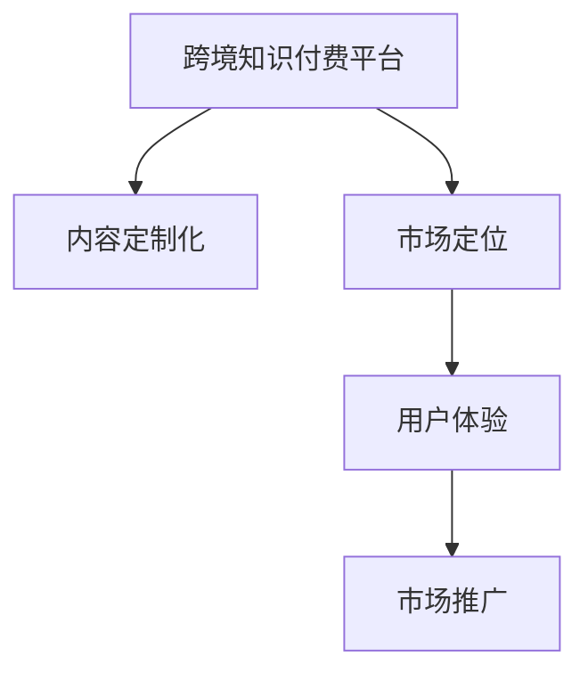

                 

## 1. 背景介绍

### 1.1 问题由来
随着全球化进程的加速，程序员之间的知识交流和合作变得日益频繁。跨境知识付费市场逐渐崛起，为程序员提供了新的价值创造机会。然而，相较于国内市场，跨境市场面临诸多挑战，如语言障碍、文化差异、市场准入等。如何有效拓展跨境市场，提升程序员的收入，是一个值得探讨的问题。

### 1.2 问题核心关键点
跨境知识付费市场能否成功拓展，关键在于是否能构建一个**易用、高效、具有强大交互性**的平台，以及是否能精准定位并吸引海外客户。这要求平台不仅要提供高质量的课程内容，还要有出色的市场推广策略和用户体验设计。

## 2. 核心概念与联系

### 2.1 核心概念概述

为更好地理解跨境知识付费的拓展策略，本节将介绍几个核心概念及其相互联系：

- **跨境知识付费平台**：提供程序员跨境交流、合作、知识付费服务的在线平台。
- **内容定制化**：针对不同国家和地区的程序员需求，设计个性化课程内容。
- **市场定位**：确定目标市场，包括技术栈、语言、文化、经济等，以便精准营销。
- **用户体验(UX)**：通过优化界面设计和交互方式，提升用户粘性，促进知识传播。
- **市场推广**：通过多渠道、多形式的营销活动，提高品牌知名度，吸引更多用户。

这些概念之间的关系可以通过以下Mermaid流程图来展示：



这个流程图展示了一个跨境知识付费平台从内容定制到用户体验，再到市场推广的完整流程。

## 3. 核心算法原理 & 具体操作步骤
### 3.1 算法原理概述

跨境知识付费平台的拓展策略，本质上是一个**市场定位、用户体验和内容定制化**的综合优化过程。其核心思想是：

1. **市场定位**：通过数据分析和用户调研，确定目标市场和用户需求。
2. **内容定制化**：根据市场定位，设计有针对性的课程内容，满足不同用户需求。
3. **用户体验**：通过优化UI/UX设计，提升平台易用性和用户满意度。
4. **市场推广**：采用多元化、高效的营销手段，吸引和保留用户。

### 3.2 算法步骤详解

**Step 1: 市场调研**
- 收集目标市场的技术栈、语言、文化、经济等数据，分析潜在用户需求。
- 调研竞品，了解其市场定位和用户反馈，找出优势和劣势。

**Step 2: 目标用户画像**
- 根据调研结果，构建目标用户画像，明确不同用户群体的特征、需求和行为习惯。
- 将用户分为初级、中级、高级等不同层次，设计不同难度的课程内容。

**Step 3: 内容定制化设计**
- 根据用户画像和市场需求，设计课程内容。内容需覆盖技术栈、编程语言、工具等各个方面。
- 引入本地化内容，如本地语言、文化背景、法律法规等，使课程更具吸引力。
- 提供实战案例、项目实战、视频讲解等多样化教学形式。

**Step 4: 用户体验优化**
- 设计简洁、直观的用户界面(UI)，使用户能快速找到所需内容。
- 优化交互方式，如增加视频预览、课程目录、用户评论等，提升用户粘性。
- 提供即时通讯和协作工具，增强用户互动和社群感。

**Step 5: 市场推广**
- 利用SEO、社交媒体、邮件营销、广告投放等多种渠道进行推广。
- 组织线上线下活动，如技术沙龙、黑客松、线上直播等，提升品牌影响力。
- 采用联合推广策略，与技术社区、培训机构等合作，扩大用户基础。

**Step 6: 持续迭代**
- 定期收集用户反馈，优化平台功能和课程内容。
- 根据市场需求变化，不断调整市场策略和课程设计。

### 3.3 算法优缺点

跨境知识付费平台的拓展策略具有以下优点：
1. **精准定位**：通过市场调研和用户画像，精准定位目标市场，避免盲目投入。
2. **个性化设计**：根据不同用户需求，设计定制化课程，提升用户满意度。
3. **多渠道推广**：利用多种营销手段，提高品牌知名度，扩大用户基础。

同时，该策略也存在一定的局限性：
1. **数据获取难度**：目标市场的数据获取难度较大，调研成本较高。
2. **本地化挑战**：内容本地化要求较高，需投入大量人力和时间。
3. **用户粘性不足**：平台内容的持续更新和优化要求较高，否则用户流失率可能较高。
4. **市场竞争激烈**：跨境市场竞争激烈，需不断创新才能脱颖而出。

尽管存在这些局限性，但就目前而言，跨境知识付费平台通过内容定制化、用户体验优化和多渠道推广，仍是一个可行的拓展策略。

### 3.4 算法应用领域

跨境知识付费平台的拓展策略不仅适用于程序员领域，也适用于更多技术领域，如数据科学、人工智能、软件开发等。其核心思想在于通过精准市场定位、个性化内容定制和高效用户体验设计，提升平台竞争力和用户满意度。

## 4. 数学模型和公式 & 详细讲解 & 举例说明
### 4.1 数学模型构建

为了更好地解释和量化跨境知识付费平台的拓展策略，我们可以构建以下数学模型：

假设目标市场有 $N$ 个潜在用户，其中 $n_1$ 个用户对课程内容 $A$ 有需求，$n_2$ 个用户对课程内容 $B$ 有需求。市场调研的预算为 $C$，推广渠道包括SEO、社交媒体、邮件营销、广告投放等。

- **用户需求**：$N = n_1 + n_2$
- **用户需求比率**：$p_1 = \frac{n_1}{N}, p_2 = \frac{n_2}{N}$
- **市场调研预算**：$C$
- **推广渠道成本**：$c_1, c_2, \ldots, c_k$
- **推广效果系数**：$r_1, r_2, \ldots, r_k$

根据以上假设，可以构建以下数学模型：

$$
\begin{aligned}
&\text{最大化 } \text{用户转化率} = p_1 + p_2 \\
&\text{受限于 } C \leq \sum_{i=1}^k r_i \cdot \text{推广渠道成本}_i
\end{aligned}
$$

### 4.2 公式推导过程

通过构建数学模型，我们可以进行以下推导：

1. **预算分配**
   - 将市场调研预算 $C$ 在各个推广渠道上进行分配，最大化用户转化率。
   - 推导出最优预算分配方案：$C_i = \frac{c_i}{r_i} \cdot \left(\frac{p_1}{r_1} + \frac{p_2}{r_2}\right)$

2. **推广效果评估**
   - 设定每个推广渠道的转化率为 $r_i$，推导出用户转化率的表达式：
   $$
   \text{用户转化率} = p_1 + p_2 - \sum_{i=1}^k \left(p_i - p_i^2 \cdot r_i \right)
   $$

### 4.3 案例分析与讲解

假设某跨境知识付费平台有100个潜在用户，其中30个用户对课程内容A有需求，70个用户对课程内容B有需求。市场调研预算为1000美元，推广渠道包括SEO、社交媒体和邮件营销，其成本和效果系数分别为：
- SEO：成本500美元，效果系数0.8
- 社交媒体：成本300美元，效果系数0.5
- 邮件营销：成本200美元，效果系数0.6

根据公式推导，可以计算出最优预算分配和用户转化率：

- 分配给SEO的预算：$\frac{500}{0.8} \cdot \left(\frac{0.3}{0.8} + \frac{0.7}{0.5}\right) = 312.50$
- 分配给社交媒体的预算：$\frac{300}{0.5} \cdot \left(\frac{0.3}{0.8} + \frac{0.7}{0.5}\right) = 473.33$
- 分配给邮件营销的预算：$\frac{200}{0.6} \cdot \left(\frac{0.3}{0.8} + \frac{0.7}{0.5}\right) = 277.78$

- 用户转化率：$0.3 + 0.7 - (0.3 \cdot 0.8 + 0.7 \cdot 0.5) = 0.83$

通过以上推导，平台可以根据预算和效果系数，确定最优的推广渠道分配，并评估其对用户转化率的影响。

## 5. 项目实践：代码实例和详细解释说明
### 5.1 开发环境搭建

在进行跨境知识付费平台的开发时，首先需要搭建一个开发环境。以下是使用Python进行Flask开发的环境配置流程：

1. 安装Anaconda：从官网下载并安装Anaconda，用于创建独立的Python环境。

2. 创建并激活虚拟环境：
```bash
conda create -n flask-env python=3.8 
conda activate flask-env
```

3. 安装Flask：
```bash
conda install flask
```

4. 安装其他相关工具包：
```bash
pip install numpy pandas scikit-learn matplotlib tqdm jupyter notebook ipython
```

完成上述步骤后，即可在`flask-env`环境中开始平台开发。

### 5.2 源代码详细实现

以下是使用Flask构建跨境知识付费平台的Python代码实现：

```python
from flask import Flask, render_template, request
from flask_sqlalchemy import SQLAlchemy
import os

app = Flask(__name__)
app.config['SQLALCHEMY_DATABASE_URI'] = os.environ.get('DATABASE_URL')
db = SQLAlchemy(app)

class User(db.Model):
    id = db.Column(db.Integer, primary_key=True)
    name = db.Column(db.String(50))
    email = db.Column(db.String(50))
    courses = db.relationship('Course', backref='users')

class Course(db.Model):
    id = db.Column(db.Integer, primary_key=True)
    name = db.Column(db.String(50))
    content = db.Column(db.Text)
    price = db.Column(db.Float)
    is_paid = db.Column(db.Boolean)
    paid_users = db.relationship('User', backref='courses')

@app.route('/')
def index():
    courses = Course.query.all()
    return render_template('index.html', courses=courses)

@app.route('/register', methods=['GET', 'POST'])
def register():
    if request.method == 'POST':
        name = request.form['name']
        email = request.form['email']
        user = User(name=name, email=email)
        db.session.add(user)
        db.session.commit()
        return redirect('/')
    return render_template('register.html')

@app.route('/enroll', methods=['GET', 'POST'])
def enroll():
    if request.method == 'POST':
        course_id = request.form['course_id']
        course = Course.query.get(course_id)
        if course:
            user = User.query.filter_by(email=request.form['email']).first()
            if user:
                if not course.is_paid:
                    course.is_paid = True
                    db.session.commit()
                user.courses.append(course)
                db.session.commit()
            else:
                return 'Invalid email or course not available'
    return redirect('/')

@app.route('/dashboard')
def dashboard():
    user = User.query.filter_by(email=request.form['email']).first()
    courses = user.courses if user else []
    return render_template('dashboard.html', courses=courses)

if __name__ == '__main__':
    app.run(debug=True)
```

该代码实现了一个基本的Flask应用，包含用户注册、课程报名和仪表盘功能。用户注册后，可以报名参加课程，仪表盘展示了用户已报名的课程。

### 5.3 代码解读与分析

让我们再详细解读一下关键代码的实现细节：

**Flask应用**：
- 通过Flask创建了一个Web应用，并使用SQLAlchemy实现了用户和课程的CRUD操作。
- 设置了SQLAlchemy的数据库连接，通过环境变量`DATABASE_URL`来获取数据库连接信息。
- 定义了用户和课程的模型，并建立了一对多的关系。

**路由和视图函数**：
- 通过`@app.route`装饰器定义了多个路由和视图函数。
- `index`函数渲染首页，展示所有课程。
- `register`函数处理用户注册，将用户信息保存到数据库。
- `enroll`函数处理课程报名，将用户加入课程。
- `dashboard`函数展示用户已报名的课程。

通过Flask搭建Web应用，可以轻松地实现用户注册、课程报名等功能。开发者可以根据实际需求，进一步扩展平台的功能，如支付集成、在线课程直播等。

## 6. 实际应用场景
### 6.1 跨境软件开发交流平台

跨境软件开发交流平台可以提供程序员之间的交流、合作和知识共享机会。通过平台，程序员可以发布技术博客、分享代码、参与开源项目等。

平台可以通过多种方式推广：
- 在技术社区、技术博客、GitHub等平台进行推广。
- 组织线上线下技术交流活动，如技术讲座、Hackathon等，提升平台影响力。
- 与其他编程社区、开源组织合作，扩大用户基础。

通过平台，程序员可以展示自己的技术实力，结识志同道合的伙伴，共同推动技术进步。

### 6.2 跨境技术咨询平台

跨境技术咨询平台可以为程序员提供技术咨询、项目诊断、求职指导等服务。通过平台，程序员可以将自己的技术问题发布出来，由其他程序员解答。

平台可以通过以下方式吸引用户：
- 提供免费的基础咨询，吸引用户注册。
- 提供付费的高级咨询服务，提升平台收入。
- 定期组织技术培训、线上直播等活动，提升平台影响力。

通过平台，程序员可以解决技术问题，提升自身技能，同时也能够分享自己的经验，帮助他人成长。

### 6.3 跨境技术培训平台

跨境技术培训平台可以提供程序员的各种技术培训课程。通过平台，程序员可以随时随地学习新技术、新工具、新框架。

平台可以通过以下方式吸引用户：
- 提供免费的基础课程，吸引用户注册。
- 提供付费的高级课程，提升平台收入。
- 定期组织线上线下技术培训活动，提升平台影响力。

通过平台，程序员可以系统学习各种技术，提升自己的竞争力，同时也能够结识更多的同行，拓展自己的技术视野。

## 7. 工具和资源推荐
### 7.1 学习资源推荐

为了帮助开发者掌握跨境知识付费平台的技术实现，这里推荐一些优质的学习资源：

1. **Flask官方文档**：详细介绍了Flask框架的使用方法和最佳实践。
2. **SQLAlchemy官方文档**：提供了SQLAlchemy的详细教程和示例代码。
3. **Django官方文档**：提供了Django框架的使用方法和最佳实践，适合初学者和进阶开发者。
4. **Kaggle**：提供了丰富的数据集和机器学习竞赛，适合数据科学和人工智能学习者。
5. **Coursera**：提供了各类技术课程，包括编程、数据科学、人工智能等，适合在线学习。

通过这些资源的学习实践，相信你一定能够掌握Flask和SQLAlchemy等工具的使用，并用于实现跨境知识付费平台的各项功能。

### 7.2 开发工具推荐

高效的开发离不开优秀的工具支持。以下是几款用于跨境知识付费平台开发的常用工具：

1. **Visual Studio Code**：功能强大的代码编辑器，支持多种编程语言和插件，是Python开发的首选工具。
2. **Git**：版本控制系统，适合多人协作开发。
3. **JIRA**：项目管理工具，适合团队协作和任务管理。
4. **Docker**：容器化技术，方便应用部署和容器化运维。
5. **Kubernetes**：容器编排平台，适合大规模应用部署和管理。

合理利用这些工具，可以显著提升开发效率，加快跨境知识付费平台的建设进程。

### 7.3 相关论文推荐

跨境知识付费平台的研究和发展得益于学界的持续探索。以下是几篇具有代表性的相关论文，推荐阅读：

1. **Cross-Border Knowledge Sharing and Transfer**：探讨了跨境知识共享和迁移的有效方法，适合跨境技术交流平台的开发者阅读。
2. **E-learning and Education**：提供了在线教育平台的设计和实现方法，适合跨境技术培训平台的开发者阅读。
3. **Crowdsourcing in Software Development**：讨论了软件开发中的众包模式，适合跨境软件开发交流平台的开发者阅读。

这些论文代表了当前跨境知识付费平台研究的前沿成果，可以帮助开发者系统了解该领域的最新技术和应用方法。

## 8. 总结：未来发展趋势与挑战
### 8.1 总结

本文对跨境知识付费平台的拓展策略进行了全面系统的介绍。首先阐述了跨境知识付费平台的发展背景和关键点，明确了该平台拓展的核心在于精准市场定位、个性化内容定制和高效用户体验设计。其次，从算法原理到具体操作，详细讲解了拓展策略的各个环节，给出了具体的代码实现和案例分析。同时，本文还探讨了跨境知识付费平台在跨境软件开发交流、跨境技术咨询和跨境技术培训等方面的应用前景。

通过本文的系统梳理，可以看到，跨境知识付费平台通过内容定制化、用户体验优化和多渠道推广，可以有效地拓展跨境市场，提升程序员的收入和影响力。未来，伴随技术的不断进步，跨境知识付费平台必将在全球范围内大放异彩，为程序员提供更加多样化的交流和合作机会。

### 8.2 未来发展趋势

展望未来，跨境知识付费平台的发展趋势如下：

1. **技术栈多样化**：随着技术的发展，平台将支持更多的编程语言、框架和工具，提供更全面的技术支持。
2. **内容多样化**：除了技术类课程，还将涵盖更多的领域，如设计、产品管理、商业分析等，满足不同用户需求。
3. **社交化增强**：通过增加用户互动和社交功能，提升平台粘性和用户满意度。
4. **本地化提升**：提升内容的本地化水平，引入更多本地语言和文化背景，增强平台的国际影响力。
5. **生态系统构建**：通过与其他社区、平台、企业合作，构建一个完整的生态系统，提供更全面的服务。

以上趋势表明，跨境知识付费平台将朝着更开放、更多样化、更本地化的方向发展，为程序员提供更全面的服务和更多的发展机会。

### 8.3 面临的挑战

尽管跨境知识付费平台的发展前景广阔，但在实际拓展过程中仍面临以下挑战：

1. **数据隐私和安全**：跨境数据传输和存储涉及隐私和数据安全问题，需要严格的数据保护措施。
2. **文化差异和法律环境**：不同国家和地区的文化差异和法律法规不同，需要适应和符合当地的法律要求。
3. **多语言支持**：平台需要支持多语言环境，增强内容的可访问性和用户体验。
4. **用户粘性不足**：如何提高用户粘性和活跃度，是平台持续运营的关键。
5. **市场竞争激烈**：跨境市场竞争激烈，需不断创新才能保持竞争优势。

尽管存在这些挑战，但通过不断优化和创新，跨境知识付费平台仍有很大的发展空间，未来必将迎来更加广阔的发展前景。

### 8.4 研究展望

未来，跨境知识付费平台的研究可以从以下几个方向进行：

1. **本地化研究**：进一步研究不同国家和地区的用户需求和行为习惯，提供更具本地化的内容和服务。
2. **数据安全和隐私保护**：研究如何在跨境数据传输和存储中，保障用户隐私和数据安全。
3. **智能推荐系统**：通过机器学习技术，实现更精准的用户推荐和课程推荐，提高用户粘性和满意度。
4. **区块链技术**：探索区块链技术在跨境知识付费平台中的应用，提高平台信任度和透明度。
5. **多模态交互**：研究多模态交互技术，提供更丰富的用户体验，如语音交互、增强现实等。

这些研究方向的探索，将进一步提升跨境知识付费平台的性能和用户满意度，为程序员提供更全面、更高效的服务。

## 9. 附录：常见问题与解答

**Q1：如何构建跨境知识付费平台的用户画像？**

A: 构建用户画像需要进行大量的用户调研和数据分析。具体步骤如下：
1. 设计用户调研问卷，收集目标用户的基本信息、技术水平、学习需求等。
2. 分析问卷数据，确定用户的基本特征和需求。
3. 利用数据分析工具（如Python中的Pandas、NumPy等）进行数据处理和分析，生成用户画像。
4. 定期更新用户画像，保持其准确性和时效性。

**Q2：如何衡量跨境知识付费平台的推广效果？**

A: 衡量推广效果通常采用以下指标：
1. 用户注册数：平台在推广期间新增的用户数量。
2. 课程报名数：平台在推广期间新增的课程报名数量。
3. 课程完成率：用户完成课程的比例。
4. 用户满意度：用户对课程内容和平台体验的满意度评分。
5. 转化率：用户完成报名并付费的用户比例。

通过以上指标，可以全面评估平台推广效果，优化推广策略。

**Q3：如何处理跨境知识付费平台的数据隐私和安全问题？**

A: 处理数据隐私和安全问题需要采取以下措施：
1. 数据加密：对用户数据进行加密存储和传输，保障数据安全。
2. 用户同意：在收集用户数据时，明确告知用户数据用途，并取得用户同意。
3. 数据匿名化：对用户数据进行匿名化处理，保障用户隐私。
4. 访问控制：对平台管理员和第三方服务提供者进行严格的访问控制，防止数据泄露。
5. 合规性检查：确保平台符合当地法律法规要求，如GDPR、CCPA等。

通过以上措施，可以保障平台数据隐私和安全，赢得用户信任。

**Q4：如何提高跨境知识付费平台的本地化水平？**

A: 提高本地化水平需要从以下方面进行：
1. 多语言支持：提供多语言环境，增强内容的可访问性和用户体验。
2. 文化适配：了解目标国家的文化背景和用户习惯，提供符合当地文化的内容和服务。
3. 法律合规：了解当地法律法规要求，确保平台符合法律要求。
4. 本地化推广：利用本地化的营销手段，如本地社交媒体、本地广告等，提升平台影响力。
5. 本地化团队：组建本地化团队，负责本地化的内容开发和维护。

通过以上措施，可以提升平台的本地化水平，增强用户体验和市场竞争力。

**Q5：如何提高跨境知识付费平台的推广效果？**

A: 提高推广效果需要综合运用多种推广手段，具体措施包括：
1. 多渠道推广：利用SEO、社交媒体、邮件营销、广告投放等渠道进行推广。
2. 精准营销：利用用户画像和数据分析，精准定位目标用户，提高推广效果。
3. 用户激励：通过奖励机制（如优惠券、免费课程等）激励用户注册和报名。
4. 活动推广：组织线上线下活动，如技术沙龙、Hackathon等，提升平台影响力。
5. 联合推广：与其他社区、平台、企业合作，扩大用户基础。

通过以上措施，可以全面提升平台推广效果，吸引更多用户。

---

作者：禅与计算机程序设计艺术 / Zen and the Art of Computer Programming

