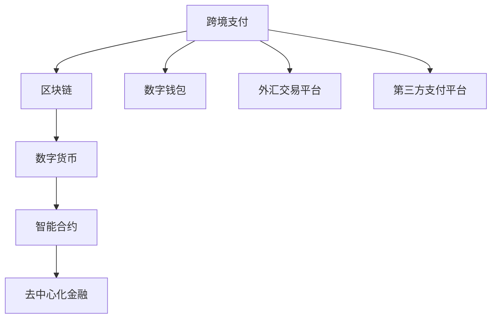

                 

## 1. 背景介绍

在信息技术快速发展的今天，知识付费已成为互联网经济的重要组成部分。程序员社区中的知识付费尤其重要，因为程序员需要不断地更新自己的知识体系，以应对不断变化的编程语言和框架。然而，跨境支付是知识付费中的重要环节，尤其在程序员社区中，如何安全、高效地完成跨境支付是一个亟待解决的问题。

### 1.1 跨境支付的需求与挑战

随着全球化进程的推进，程序员的知识付费已经不再局限于单一的地区或国家。越来越多的程序员通过在线课程、编程书籍、技术博客等形式，与其他国家的程序员进行交流和学习。因此，跨境支付的需求日益增长。然而，由于不同国家和地区的货币系统、支付法规以及支付方式的不同，跨境支付面临着诸多挑战，如支付延迟、高额费用、外汇风险等。

### 1.2 技术解决方案的必要性

为了解决跨境支付中的各种问题，技术解决方案变得尤为重要。区块链技术以其去中心化、安全可靠、不可篡改等特点，成为解决跨境支付问题的首选技术。特别是近年来，随着比特币等数字货币的普及，区块链技术已经被广泛应用在金融领域，包括跨境支付。

## 2. 核心概念与联系

### 2.1 核心概念概述

为了更好地理解跨境支付的技术解决方案，本节将介绍几个关键概念：

- **跨境支付（Cross-border Payment）**：指在一个国家或地区进行支付，接收方在另一个国家或地区接收支付款项的金融交易。
- **区块链（Blockchain）**：一种分布式账本技术，通过去中心化的方式记录交易信息，确保数据不可篡改。
- **数字货币（Digital Currency）**：指通过电子方式存储和传输的货币，如比特币、以太坊等。
- **智能合约（Smart Contract）**：一种自动执行的合同，可以确保交易各方在满足特定条件时自动执行约定。
- **去中心化金融（DeFi）**：指利用区块链技术实现的金融服务，如去中心化交易所（DEX）、去中心化借贷（DeFi Lending）等。

这些概念之间存在紧密联系，共同构成了跨境支付技术解决方案的核心。

### 2.2 核心概念原理和架构的 Mermaid 流程图



这个流程图展示了跨境支付的核心概念及其之间的联系：

1. **跨境支付**：起点和终点。
2. **区块链**：跨境支付的技术基础，提供安全、透明的交易记录。
3. **数字货币**：支付工具，用于在区块链上进行交易。
4. **智能合约**：自动化执行的合同，用于确保交易的自动执行和资金的智能分配。
5. **去中心化金融**：提供各种金融服务，如去中心化交易所、去中心化借贷等，用于促进跨境支付。
6. **数字钱包**：用于存储和管理数字货币的账户。
7. **外汇交易平台**：用于进行货币兑换，提供外汇报价和交易服务。
8. **第三方支付平台**：提供支付接口，方便用户进行跨境支付。

这些概念共同构成了跨境支付的技术解决方案，使得跨境支付更加安全、高效、可靠。

## 3. 核心算法原理 & 具体操作步骤

### 3.1 算法原理概述

跨境支付的算法原理主要基于区块链技术和数字货币的原理，结合智能合约去中心化的特点，确保交易的透明性和安全性。

在跨境支付中，通常涉及以下步骤：

1. **数字钱包**：用户在自己的数字钱包中存储数字货币，通过私钥进行签名，确保交易的合法性。
2. **外汇交易平台**：用户通过外汇交易平台进行货币兑换，将一种货币兑换成另一种货币。
3. **去中心化金融**：用户通过去中心化金融平台，将数字货币发送到接收方指定的地址。
4. **智能合约**：智能合约自动执行交易，确保交易的自动执行和资金的智能分配。

### 3.2 算法步骤详解

以下是跨境支付的具体操作步骤：

**Step 1: 数字钱包的创建与配置**

用户首先需要在数字钱包中创建和管理数字货币。数字钱包通常提供密钥生成、交易签名、余额查询等基本功能。用户需要选择一个可信的数字钱包，并按照钱包提供的指引进行配置。

**Step 2: 外汇交易平台的接入**

用户在数字钱包中访问外汇交易平台，输入兑换比例和金额，选择接收货币类型。外汇交易平台提供即时汇率和交易费用，用户确认后进行交易。

**Step 3: 数字货币的发送**

用户通过去中心化金融平台，将数字货币发送到接收方指定的地址。发送过程中，智能合约自动执行，确保交易的透明性和安全性。

**Step 4: 智能合约的执行**

智能合约根据设定的条件自动执行交易，确保交易的自动执行和资金的智能分配。例如，在特定的条件下，智能合约可以自动将资金分配给指定的受益人。

### 3.3 算法优缺点

基于区块链技术的跨境支付具有以下优点：

1. **去中心化**：不需要信任第三方，交易双方通过区块链进行验证，确保交易的透明性和安全性。
2. **低成本**：相比于传统的跨境支付，区块链技术减少了中介机构，降低了交易费用。
3. **实时性**：区块链技术可以实现实时交易，大大缩短了跨境支付的延迟时间。

然而，基于区块链的跨境支付也存在一些缺点：

1. **技术门槛高**：用户需要了解区块链和数字货币的基本原理，才能有效使用跨境支付系统。
2. **网络延迟**：由于区块链的去中心化特性，交易确认时间较长，可能影响实时性。
3. **智能合约的风险**：智能合约的设计复杂，可能会出现漏洞或错误，影响交易的顺利执行。

### 3.4 算法应用领域

基于区块链技术的跨境支付已经被广泛应用于多个领域，如：

1. **国际商业**：企业之间的跨境支付，如跨国公司的业务往来。
2. **跨境电商**：消费者和商家之间的跨境交易，如淘宝全球购、亚马逊全球购等。
3. **国际旅游**：游客在国外的消费和支付，如酒店预订、机票购买等。
4. **慈善捐赠**：国际慈善机构的捐赠和资金分配，如联合国儿童基金会。
5. **国际投资**：国际投资机构的跨境支付，如比特币投资。

## 4. 数学模型和公式 & 详细讲解 & 举例说明

### 4.1 数学模型构建

跨境支付的数学模型通常包括以下变量：

- **汇率**：货币兑换的比例，用公式表示为：$R=\frac{c}{d}$，其中 $c$ 是本币金额，$d$ 是外币金额。
- **交易费用**：在进行交易时，用户需要支付的费用，通常包括外汇交易平台和去中心化金融平台的费用。
- **智能合约参数**：智能合约中设置的各种参数，如条件触发机制、资金分配比例等。

### 4.2 公式推导过程

以下是跨境支付中的汇率计算公式：

$$
R = \frac{c}{d} \times (1 + f)
$$

其中，$f$ 表示交易费用率，$c$ 表示本币金额，$d$ 表示外币金额。

在去中心化金融平台中，智能合约的执行条件通常可以表示为：

$$
C = f(x_1, x_2, ..., x_n)
$$

其中，$x_i$ 表示智能合约中的参数，$f$ 表示条件的计算函数。

### 4.3 案例分析与讲解

假设一个用户需要在英国和美国之间进行跨境支付，汇率固定为1:1.5，交易费用率为0.1%。用户计划支付100英镑，则：

$$
R = \frac{100}{1.5} \times (1 + 0.001) = 66.67
$$

用户需要将100英镑兑换成66.67美元，并支付0.67美元的交易费用。

## 5. 项目实践：代码实例和详细解释说明

### 5.1 开发环境搭建

在进行跨境支付的实践前，我们需要准备好开发环境。以下是使用Python进行Hyperledger Fabric开发的环境配置流程：

1. 安装Hyperledger Fabric：从官网下载并安装Hyperledger Fabric，按照官方文档配置网络环境。

2. 创建和管理数字钱包：使用Hyperledger Fabric提供的钱包管理工具，创建和管理数字钱包。

3. 配置外汇交易平台：选择合适的外汇交易平台，配置汇率和交易费用。

4. 接入去中心化金融平台：选择一个可信赖的去中心化金融平台，配置智能合约参数。

5. 开发和测试跨境支付系统：使用Hyperledger Fabric提供的SDK开发跨境支付应用，并进行测试。

完成上述步骤后，即可在Hyperledger Fabric网络上进行跨境支付。

### 5.2 源代码详细实现

以下是使用Hyperledger Fabric进行跨境支付的Python代码实现：

```python
from hyperledger_fabric import Fabric
from hyperledger_fabric.keys import generate_keypair
from hyperledger_fabric.shim import Chaincode

# 创建数字钱包
keypair = generate_keypair()
private_key = keypair.private_key
public_key = keypair.public_key

# 配置外汇交易平台
fabric = Fabric('http://fabric-url:7051', 'user', 'password')
fabric.set_blockchain_id('my-chain')

# 获取汇率和交易费用
exchange_rate = 1.5
fee_rate = 0.001

# 发送数字货币
channel = fabric.get_channel('my-channel')
tx = '发送100英镑到USD'
chaincode = Chaincode('my-chaincode')
chaincode_data = {'amount': 100, 'to': 'USD', 'exchange_rate': exchange_rate, 'fee_rate': fee_rate}
result = channel.invoke.chaincode(chaincode, 'send', chaincode_data)
```

### 5.3 代码解读与分析

让我们再详细解读一下关键代码的实现细节：

**数字钱包的创建与管理**：
- 使用`generate_keypair`函数生成私钥和公钥。
- 将私钥用于数字钱包的签名，确保交易的合法性。

**外汇交易平台的配置**：
- 使用`Fabric`类配置Hyperledger Fabric网络环境。
- 设置区块链ID，指定访问地址和认证信息。

**发送数字货币**：
- 使用`Fabric`类的`get_channel`方法获取区块链通道。
- 使用`chaincode`类调用智能合约，发送数字货币。

### 5.4 运行结果展示

运行上述代码后，即可在Hyperledger Fabric网络中成功发送数字货币，完成跨境支付。

## 6. 实际应用场景

### 6.1 国际商业

跨境支付在商业领域中有着广泛的应用。例如，一家在德国的汽车制造企业需要向美国的分支机构支付一笔费用。通过使用区块链技术，企业可以在网络上快速、安全地完成支付，避免传统的银行转账延迟和高额手续费。

### 6.2 跨境电商

随着全球电商的发展，跨境电商的支付需求日益增长。例如，一个中国的卖家需要在亚马逊全球购上销售产品。通过使用区块链技术，卖家和买家可以在网络上进行实时支付，提高交易效率和安全性。

### 6.3 国际旅游

国际旅游中的支付也是一个重要的应用场景。例如，一个美国游客在法国旅游期间需要支付酒店账单。通过使用区块链技术，游客可以在网络上进行实时支付，提高支付速度和便利性。

### 6.4 未来应用展望

随着区块链技术的不断成熟，跨境支付将具有更加广阔的应用前景。未来，跨境支付可能会应用到更多领域，如国际投资、慈善捐赠等。同时，区块链技术还将与物联网、人工智能等技术进行深度融合，提供更加智能、高效的跨境支付解决方案。

## 7. 工具和资源推荐

### 7.1 学习资源推荐

为了帮助开发者系统掌握跨境支付的原理和实践，以下是一些优质的学习资源：

1. Hyperledger Fabric官方文档：Hyperledger Fabric的官方文档，提供了详细的开发指南和API文档，是学习Hyperledger Fabric的重要资源。
2. 《区块链原理与实践》系列书籍：介绍了区块链的基本原理和应用场景，是学习区块链技术的好书。
3. 《智能合约设计与安全》课程：介绍了智能合约的基本概念和设计原则，是学习智能合约的入门课程。
4. 《去中心化金融》课程：介绍了去中心化金融的基本原理和应用场景，是学习DeFi的重要资源。

### 7.2 开发工具推荐

在跨境支付的开发中，以下工具可以提高开发效率和安全性：

1. Hyperledger Fabric：Hyperledger Fabric是区块链技术的一个开源框架，提供了丰富的开发API和工具，方便开发者进行跨境支付开发。
2. GitHub：GitHub是一个开源代码托管平台，开发者可以在GitHub上共享代码和协作开发，提高开发效率。
3. OpenSSL：OpenSSL是一个开源加密库，用于保护数字钱包的安全性。

### 7.3 相关论文推荐

以下是几篇与跨境支付相关的经典论文，推荐阅读：

1. "Secure and Efficient Cross-Border Payments Using Blockchain"：探讨了使用区块链技术进行跨境支付的安全性和效率。
2. "A Survey of Cross-Border Payment Systems"：介绍了各种跨境支付系统的特点和优缺点，为选择合适的支付系统提供参考。
3. "Smart Contracts and Blockchain-based Cross-Border Payment Systems"：介绍了智能合约在跨境支付中的应用，提供了智能合约设计的最佳实践。

## 8. 总结：未来发展趋势与挑战

### 8.1 总结

本文对跨境支付的原理和实践进行了全面系统的介绍。首先阐述了跨境支付的需求和挑战，明确了区块链技术在跨境支付中的重要性。其次，从原理到实践，详细讲解了区块链技术在跨境支付中的具体应用，包括数字钱包、外汇交易平台、去中心化金融平台和智能合约。同时，本文还广泛探讨了区块链技术在跨境支付中的应用场景，展示了区块链技术的巨大潜力。

通过本文的系统梳理，可以看到，区块链技术为跨境支付提供了安全、高效、透明的解决方案，有效解决了传统跨境支付中的各种问题。未来，随着区块链技术的不断成熟，跨境支付将具有更加广阔的应用前景，为全球化进程注入新的动力。

### 8.2 未来发展趋势

展望未来，跨境支付技术将呈现以下几个发展趋势：

1. **去中心化的普及**：随着区块链技术的普及，去中心化支付将逐渐成为主流，减少中介机构的依赖，降低交易费用。
2. **智能合约的优化**：智能合约将更加智能、灵活，提供更加安全、高效的跨境支付解决方案。
3. **多币种支持**：区块链技术将支持更多种类的数字货币和加密货币，提供更加多样化的跨境支付选择。
4. **区块链与其他技术的融合**：区块链技术将与物联网、人工智能等技术进行深度融合，提供更加智能、高效的跨境支付解决方案。
5. **跨境支付标准的统一**：随着区块链技术的普及，跨境支付标准将逐步统一，提高跨境支付的便利性和兼容性。

以上趋势凸显了区块链技术在跨境支付中的广阔前景，未来的区块链跨境支付将更加安全、高效、可靠，为全球经济一体化提供新的动力。

### 8.3 面临的挑战

尽管区块链技术在跨境支付中具有显著优势，但在迈向更加智能化、普适化应用的过程中，它仍面临诸多挑战：

1. **技术门槛高**：用户需要了解区块链和智能合约的基本原理，才能有效使用跨境支付系统。
2. **网络延迟**：由于区块链的去中心化特性，交易确认时间较长，可能影响实时性。
3. **智能合约的风险**：智能合约的设计复杂，可能会出现漏洞或错误，影响交易的顺利执行。
4. **法律法规的限制**：不同国家和地区对区块链技术的使用有不同的法律法规，需要开发者严格遵守。

### 8.4 研究展望

面对区块链技术在跨境支付中面临的挑战，未来的研究需要在以下几个方面寻求新的突破：

1. **简化智能合约设计**：设计更加简单、灵活的智能合约，降低用户使用难度。
2. **提高交易效率**：通过优化区块链网络和共识算法，提高交易速度和效率。
3. **增强安全性**：引入更多的安全机制，如多签机制、隐私保护等，增强交易的安全性。
4. **法规标准的统一**：推动跨境支付标准的统一，降低跨境支付的法律法规风险。

这些研究方向将进一步推动区块链技术在跨境支付中的应用，实现更加安全、高效、普适的跨境支付系统。相信随着学界和产业界的共同努力，区块链跨境支付必将实现更加广泛的应用，为全球经济带来新的变革。

## 9. 附录：常见问题与解答

**Q1：使用区块链进行跨境支付是否安全？**

A: 使用区块链进行跨境支付相对传统支付方式更加安全，因为区块链技术具有去中心化、透明公开、不可篡改等特点。但需要注意的是，在使用区块链进行跨境支付时，需要选择合适的数字钱包和去中心化金融平台，确保系统的安全性。

**Q2：如何进行跨境支付的外汇交易？**

A: 在进行跨境支付的外汇交易时，可以通过外汇交易平台获取实时汇率和交易费用，然后将数字货币发送到接收方指定的地址。在发送过程中，智能合约自动执行，确保交易的透明性和安全性。

**Q3：区块链跨境支付是否适用于所有的支付场景？**

A: 区块链跨境支付适用于大多数支付场景，尤其是需要高安全性和透明性的场景。但对于一些特定的支付场景，如小额支付、高频交易等，可能需要结合传统支付方式，确保支付的效率和便利性。

**Q4：如何防范区块链跨境支付中的智能合约风险？**

A: 防范智能合约风险需要从设计、实施和监控三个方面入手：
1. 设计时需要进行充分的测试和验证，确保智能合约的逻辑正确。
2. 实施时需要进行严格的审计，确保智能合约的安全性。
3. 监控时需要进行实时的监控和预警，及时发现和解决智能合约中的漏洞和错误。

**Q5：区块链跨境支付是否需要依赖特定的技术平台？**

A: 区块链跨境支付需要依赖区块链平台和智能合约平台，如Hyperledger Fabric、Ethereum等。开发者需要选择合适的平台，并按照平台提供的API和SDK进行开发和测试。

---

作者：禅与计算机程序设计艺术 / Zen and the Art of Computer Programming

