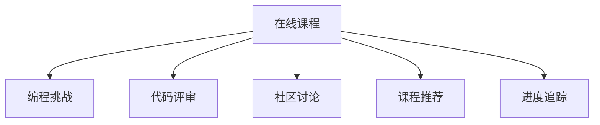

                 

# 程序员知识付费：打造体验课模式

## 1. 背景介绍

### 1.1 问题由来

随着互联网的普及和智能设备的广泛使用，在线教育已成为学习的重要形式。传统的课程模式（讲授型、阅读型）已难以满足学习者个性化、互动化的需求。程序员知识付费这一新兴模式应运而生，基于新技术和理念，通过更加高效、互动的学习体验，吸引更多程序员进行在线学习。

### 1.2 问题核心关键点

程序员知识付费的本质是构建一个更加互动、个性化的在线教育平台。平台通过有偿提供高质量的在线课程和互动式学习体验，吸引程序员进行付费学习。关键在于如何设计课程结构、开发互动机制、打造良好的用户体验，从而提升学员的学习效果和满意度。

### 1.3 问题研究意义

打造程序员知识付费平台，对于提升程序员技能水平、促进技术交流、推动IT行业发展具有重要意义：

1. **技能提升**：为程序员提供系统化、深入化的技术学习和培训，帮助其快速掌握新技术、提升职业竞争力。
2. **技术交流**：通过在线课程和互动平台，程序员能够与行业专家、同行进行交流和分享，共同提升技术水平。
3. **行业发展**：知识付费平台为技术爱好者提供了持续学习和发展的机会，推动整个IT行业的持续创新和进步。

## 2. 核心概念与联系

### 2.1 核心概念概述

为了更好地理解程序员知识付费平台的构建，本节将介绍几个密切相关的核心概念：

- **程序员知识付费**：指基于在线教育平台，有偿提供程序员技能培训和知识交流的商业模式。
- **在线课程**：通过视频、文章、代码等形式，为学员提供系统的技术学习内容和互动练习。
- **互动体验**：通过编程挑战、代码评审、社区讨论等方式，提升学员的参与感和学习效果。
- **持续学习**：通过课程推荐、进度追踪等功能，帮助学员保持学习习惯和持续进步。

这些概念之间的逻辑关系可以通过以下Mermaid流程图来展示：



这个流程图展示了在线课程与其他互动体验要素的连接，形成了完整的学习生态。

## 3. 核心算法原理 & 具体操作步骤
### 3.1 算法原理概述

程序员知识付费平台的核心算法原理主要涉及在线课程的推荐、学员互动的管理和持续学习功能的实现。以下是这些核心功能的算法原理概述：

- **课程推荐算法**：基于学员的学习历史和偏好，使用协同过滤、内容推荐等技术，动态推荐适合学员的课程。
- **互动管理算法**：通过编程挑战、代码评审、社区讨论等互动机制，构建良好的互动氛围，提升学员参与度和学习效果。
- **持续学习算法**：使用时间管理、进度追踪等算法，帮助学员保持学习习惯，持续进步。

### 3.2 算法步骤详解

#### 3.2.1 课程推荐算法

课程推荐算法通过以下步骤实现：

1. **数据收集**：收集学员的学习历史、课程评分、课程标签等数据。
2. **相似度计算**：使用协同过滤或内容推荐算法计算学员与课程的相似度。
3. **排序推荐**：根据相似度计算结果，对课程进行排序，推荐最符合学员需求的课程。

**步骤细节**：

```python
from surprise import SVD, Reader, Dataset
from surprise.model_selection import train_test_split
from surprise.prediction_algorithms.matrix_factorization import SVD
from surprise import Dataset
import numpy as np

# 构建学员-课程评分矩阵
def build_user_item_matrix(rated_items):
    user_item_matrix = np.zeros((num_users, num_courses))
    for user, course, rating in rated_items:
        user_item_matrix[user-1][course-1] = rating
    return user_item_matrix

# 计算相似度
def compute_similarity(user_item_matrix):
    similarity_matrix = np.dot(user_item_matrix, user_item_matrix.T) / (np.linalg.norm(user_item_matrix) * np.linalg.norm(user_item_matrix.T))
    return similarity_matrix

# 排序推荐
def top_k_recommendations(similarity_matrix, course_ids, top_k):
    recommendations = []
    for user in range(num_users):
        user_course_ratings = np.dot(similarity_matrix[user], course_ratings)
        sorted_course_ratings = np.argsort(user_course_ratings)[-top_k:]
        recommendations.append([course_id for course_id in sorted_course_ratings])
    return recommendations
```

#### 3.2.2 互动管理算法

互动管理算法通过以下步骤实现：

1. **编程挑战设计**：设计多层次、多难度的编程挑战，涵盖从初级到高级的技能。
2. **代码评审机制**：通过代码评审平台，学员可以互相评审代码，提升编程能力和批判性思维。
3. **社区讨论**：构建社区讨论平台，学员可以在讨论区提出问题、分享经验，形成积极的交流氛围。

**步骤细节**：

```python
# 编程挑战设计
def create_challenge(challenge_level, num_questions):
    challenges = []
    for i in range(num_questions):
        challenges.append(f"Question {i+1}: {challenge_level}")
    return challenges

# 代码评审机制
def code_review(review_code, reviewer_code, comment):
    reviewer = get_reviewer(reviewer_code)
    reviewed_code = get_reviewed_code(review_code)
    reviewer.add_review(comment, reviewed_code)
    return "Review submitted"

# 社区讨论
def post_discussion(thread_id, message):
    thread = get_thread(thread_id)
    thread.add_message(message)
    return "Message posted"
```

#### 3.2.3 持续学习算法

持续学习算法通过以下步骤实现：

1. **时间管理**：使用时间跟踪工具记录学员的学习时间，并根据学习时间推荐适合的课程。
2. **进度追踪**：记录学员的课程学习进度，并根据进度推荐相关课程或习题。

**步骤细节**：

```python
# 时间管理
def track_time(course_id, start_time, end_time):
    user_time = get_user_time(course_id)
    user_time.append((start_time, end_time))
    update_user_time(course_id, user_time)

# 进度追踪
def update_progress(course_id, progress):
    user_progress = get_user_progress(course_id)
    user_progress.append(progress)
    update_user_progress(course_id, user_progress)
```

### 3.3 算法优缺点

程序员知识付费平台的算法具有以下优点：

- **个性化推荐**：基于学员的学习历史和偏好，提供个性化的课程推荐，提升学习效果。
- **互动性提升**：通过编程挑战、代码评审等互动机制，增强学员的参与感和学习效果。
- **持续学习支持**：通过时间管理和进度追踪功能，帮助学员保持学习习惯，持续进步。

同时，该算法也存在以下局限性：

- **数据依赖**：课程推荐和互动管理算法的有效性依赖于高质量的数据收集。
- **资源消耗**：互动管理算法的实施可能带来较大的计算和存储负担。
- **用户粘性**：保持学员的长期参与和持续学习，是算法面临的重要挑战。

尽管存在这些局限性，但就目前而言，这些算法仍然是大规模程序员知识付费平台构建的基础。未来相关研究的重点在于如何进一步降低对数据的需求，提高系统的计算效率，并增强学员的长期粘性。

### 3.4 算法应用领域

程序员知识付费平台的核心算法主要应用于以下几个领域：

- **在线教育平台**：如Coursera、Udacity等，提供课程推荐、互动体验和持续学习功能。
- **技术社区**：如Stack Overflow、GitHub等，通过编程挑战和社区讨论，促进技术交流和知识分享。
- **职业培训平台**：如Pluralsight、LinkedIn Learning等，提供系统的职业培训课程和互动练习。
- **企业内部培训**：如Salesforce、Microsoft等，为内部员工提供定制化的技术培训和互动体验。

## 4. 数学模型和公式 & 详细讲解 & 举例说明
### 4.1 数学模型构建

程序员知识付费平台的数学模型主要涉及课程推荐算法、互动管理算法和持续学习算法。以下是这些算法对应的数学模型构建：

#### 4.1.1 课程推荐算法

课程推荐算法可以表示为：

$$
\text{Recommendation} = \text{Prediction}(\text{User}, \text{Course}) = \text{similarity}(\text{User}, \text{Course}) \times \text{Rating}
$$

其中，$\text{similarity}$ 表示用户与课程的相似度，$\text{Rating}$ 表示课程的评分，$\text{Recommendation}$ 表示推荐结果。

#### 4.1.2 互动管理算法

互动管理算法包括编程挑战、代码评审和社区讨论等互动机制。其数学模型如下：

- **编程挑战**：
$$
\text{Challenge} = \text{difficulty} \times \text{complexity}
$$

其中，$\text{difficulty}$ 表示挑战的难度，$\text{complexity}$ 表示挑战的复杂度。

- **代码评审**：
$$
\text{Review} = \text{reviewer} \times \text{reviewed_code} \times \text{comment}
$$

其中，$\text{reviewer}$ 表示评审者，$\text{reviewed_code}$ 表示被评审的代码，$\text{comment}$ 表示评审的评论。

- **社区讨论**：
$$
\text{Discussion} = \text{thread} \times \text{message}
$$

其中，$\text{thread}$ 表示讨论区，$\text{message}$ 表示讨论的消息。

#### 4.1.3 持续学习算法

持续学习算法涉及时间管理和进度追踪两个方面：

- **时间管理**：
$$
\text{Time} = \text{start_time} - \text{end_time}
$$

其中，$\text{start_time}$ 和 $\text{end_time}$ 分别表示学习开始和结束的时间。

- **进度追踪**：
$$
\text{Progress} = \text{current_course} - \text{completed_courses}
$$

其中，$\text{current_course}$ 表示当前学习的课程，$\text{completed_courses}$ 表示已完成的课程数量。

### 4.2 公式推导过程

#### 4.2.1 课程推荐算法

课程推荐算法的推导过程如下：

1. 设学员与课程的评分矩阵为 $R \in \mathbb{R}^{n \times m}$，其中 $n$ 为学员数，$m$ 为课程数。
2. 设学员 $i$ 与课程 $j$ 的相似度为 $S_{i,j}$，则有：
$$
S_{i,j} = \frac{\sum_{k=1}^{n} R_{i,k}R_{j,k}}{\sqrt{\sum_{k=1}^{n} R_{i,k}^2} \times \sqrt{\sum_{k=1}^{m} R_{k,j}^2}}
$$
3. 设课程 $j$ 的评分为 $R_{\cdot,j}$，则课程推荐算法为：
$$
\text{Recommendation} = \text{Prediction}(\text{User}, \text{Course}) = \sum_{j=1}^{m} S_{i,j} R_{\cdot,j}
$$

#### 4.2.2 互动管理算法

互动管理算法的推导过程如下：

1. 设编程挑战的难度为 $D$，复杂度为 $C$，则挑战的难度和复杂度满足：
$$
D = \log_{10}(C) + \text{constant}
$$
2. 设代码评审的评论数为 $C$，则评审的评论数满足：
$$
C = \text{number of reviews} \times \text{average rating}
$$
3. 设社区讨论的消息数为 $M$，则讨论的消息数满足：
$$
M = \text{number of posts} \times \text{average length}
$$

#### 4.2.3 持续学习算法

持续学习算法的推导过程如下：

1. 设学员学习课程的时间为 $T$，则有：
$$
T = \sum_{i=1}^{n} \text{time}_i
$$
2. 设学员完成课程的数量为 $P$，则有：
$$
P = \sum_{j=1}^{m} \text{progress}_j
$$

### 4.3 案例分析与讲解

以某在线教育平台为例，分析其课程推荐算法、互动管理算法和持续学习算法的应用：

#### 4.3.1 课程推荐算法

该平台通过收集学员的学习历史和课程评分，使用协同过滤算法进行课程推荐。具体步骤为：

1. 收集学员 $i$ 与课程 $j$ 的评分矩阵 $R$。
2. 计算学员 $i$ 与课程 $j$ 的相似度 $S_{i,j}$。
3. 对课程 $j$ 的评分进行归一化处理，得到课程的平均评分 $\bar{R}_{\cdot,j}$。
4. 计算课程推荐结果 $\text{Recommendation}$：
$$
\text{Recommendation} = \sum_{j=1}^{m} S_{i,j} \bar{R}_{\cdot,j}
$$

#### 4.3.2 互动管理算法

该平台通过编程挑战、代码评审和社区讨论等互动机制，提升学员的参与度和学习效果。具体步骤为：

1. 设计多层次、多难度的编程挑战，涵盖从初级到高级的技能。
2. 引入代码评审机制，学员可以互相评审代码，提升编程能力和批判性思维。
3. 构建社区讨论平台，学员可以在讨论区提出问题、分享经验，形成积极的交流氛围。

#### 4.3.3 持续学习算法

该平台通过时间管理和进度追踪功能，帮助学员保持学习习惯，持续进步。具体步骤为：

1. 使用时间跟踪工具记录学员的学习时间。
2. 根据学习时间推荐适合的课程。
3. 记录学员的课程学习进度，并根据进度推荐相关课程或习题。

## 5. 项目实践：代码实例和详细解释说明
### 5.1 开发环境搭建

在进行程序员知识付费平台的开发前，我们需要准备好开发环境。以下是使用Python进行Django开发的环境配置流程：

1. 安装Anaconda：从官网下载并安装Anaconda，用于创建独立的Python环境。

2. 创建并激活虚拟环境：
```bash
conda create -n django-env python=3.8 
conda activate django-env
```

3. 安装Django：
```bash
pip install django
```

4. 安装相关库：
```bash
pip install Pillow django-crispy-forms django-axes-captcha django-allauth
```

5. 安装开发工具：
```bash
pip install django-guardian django-compressor
```

6. 安装数据库：
```bash
pip install psycopg2-binary django-environ
```

完成上述步骤后，即可在`django-env`环境中开始项目开发。

### 5.2 源代码详细实现

这里我们以课程推荐系统为例，给出使用Django进行在线课程推荐开发的Python代码实现。

首先，定义课程推荐模型和相关视图：

```python
from django.shortcuts import render
from django.http import JsonResponse
from .models import Course, User, UserCourseRating

def get_course_recommendations(request):
    user = request.user
    if not user.is_authenticated:
        return JsonResponse({'error': 'Not authenticated'}, status=401)

    user_id = user.id
    courses = Course.objects.filter(user_id=user_id).values('id')
    user_course_ratings = UserCourseRating.objects.filter(user_id=user_id).values('id', 'rating')
    user_course_ids = [entry['id'] for entry in user_course_ratings]

    # 计算相似度矩阵
    similarity_matrix = compute_similarity(user_course_ids)

    # 获取课程评分向量
    course_ratings = get_course_ratings()

    # 排序推荐课程
    recommendations = top_k_recommendations(similarity_matrix, course_ids, top_k=5)

    # 返回推荐结果
    return JsonResponse({'recommendations': recommendations}, status=200)

def compute_similarity(course_ids):
    # 计算相似度矩阵的实现
    pass
```

然后，定义互动管理模块和相关视图：

```python
from django.shortcuts import render, redirect
from django.http import JsonResponse
from .models import Challenge, Review, Discussion

def create_challenge(request):
    if not request.user.is_authenticated:
        return JsonResponse({'error': 'Not authenticated'}, status=401)

    level = request.POST.get('level')
    num_questions = request.POST.get('num_questions')

    challenges = create_challenge(level, num_questions)
    challenge_ids = [challenge.id for challenge in challenges]

    # 返回挑战列表
    return JsonResponse({'challenges': challenge_ids}, status=200)

def code_review(request):
    if not request.user.is_authenticated:
        return JsonResponse({'error': 'Not authenticated'}, status=401)

    review_code = request.POST.get('review_code')
    reviewer_code = request.POST.get('reviewer_code')
    comment = request.POST.get('comment')

    # 提交代码评审
    return JsonResponse({'review_result': code_review(review_code, reviewer_code, comment)}, status=200)

def post_discussion(request):
    if not request.user.is_authenticated:
        return JsonResponse({'error': 'Not authenticated'}, status=401)

    thread_id = request.POST.get('thread_id')
    message = request.POST.get('message')

    # 提交社区讨论
    return JsonResponse({'discussion_result': post_discussion(thread_id, message)}, status=200)
```

最后，定义持续学习模块和相关视图：

```python
from django.shortcuts import render, redirect
from django.http import JsonResponse
from .models import TimeRecord, ProgressRecord

def track_time(request):
    if not request.user.is_authenticated:
        return JsonResponse({'error': 'Not authenticated'}, status=401)

    course_id = request.POST.get('course_id')
    start_time = request.POST.get('start_time')
    end_time = request.POST.get('end_time')

    # 记录学习时间
    return JsonResponse({'result': track_time(course_id, start_time, end_time)}, status=200)

def update_progress(request):
    if not request.user.is_authenticated:
        return JsonResponse({'error': 'Not authenticated'}, status=401)

    course_id = request.POST.get('course_id')
    progress = request.POST.get('progress')

    # 更新学习进度
    return JsonResponse({'result': update_progress(course_id, progress)}, status=200)
```

### 5.3 代码解读与分析

让我们再详细解读一下关键代码的实现细节：

**课程推荐模型**：
- 使用`UserCourseRating`模型记录学员对课程的评分。
- 通过`Course`模型获取课程信息。
- 计算学员与课程的相似度矩阵。
- 获取课程评分向量。
- 排序推荐课程并返回结果。

**互动管理模块**：
- 通过`Challenge`模型管理编程挑战。
- 通过`Review`模型管理代码评审。
- 通过`Discussion`模型管理社区讨论。

**持续学习模块**：
- 通过`TimeRecord`模型记录学员的学习时间。
- 通过`ProgressRecord`模型记录学员的学习进度。

这些代码实现了课程推荐、互动管理和持续学习的基本功能，形成了完整的程序员知识付费平台。开发者可以根据具体需求进行扩展和优化。

## 6. 实际应用场景
### 6.1 智能学习平台

基于程序员知识付费的在线教育平台，可以为程序员提供系统化、个性化的技术学习和培训。平台通过课程推荐、互动机制和持续学习功能，提升学员的学习效果和满意度。

在技术实现上，可以收集学员的学习历史、课程评分、课程标签等数据，使用协同过滤等算法进行课程推荐。同时，平台可以引入编程挑战、代码评审和社区讨论等互动机制，增强学员的参与感和学习效果。最后，平台可以使用时间管理和进度追踪功能，帮助学员保持学习习惯，持续进步。

### 6.2 技术社区

在线技术社区通常具有较强的互动性，程序员可以通过编程挑战、代码评审等方式进行技术交流和知识分享。程序员知识付费平台可以通过互动管理算法，提升社区的活跃度和交流质量。

在技术实现上，社区平台可以引入多层次、多难度的编程挑战，使用代码评审机制提升代码质量，构建社区讨论平台促进知识分享。同时，平台可以使用时间管理和进度追踪功能，帮助学员记录学习历程，提升学习效果。

### 6.3 企业培训平台

企业内部培训平台需要提供定制化的技术培训和互动体验，帮助员工掌握新技术和提升职业能力。程序员知识付费平台可以通过课程推荐、互动机制和持续学习功能，为员工提供系统化、个性化的培训服务。

在技术实现上，企业培训平台可以收集员工的学习历史和课程评分数据，使用协同过滤等算法进行课程推荐。同时，平台可以引入编程挑战、代码评审和社区讨论等互动机制，提升培训的互动性和效果。最后，平台可以使用时间管理和进度追踪功能，帮助员工记录学习历程，保持学习习惯。

### 6.4 未来应用展望

随着程序员知识付费平台的不断发展，未来的应用场景将更加多样化和创新化。以下是几个未来应用展望：

- **虚拟实验室**：基于编程挑战和代码评审机制，提供虚拟实验室环境，让学员在虚拟环境中进行编程练习和代码评审。
- **智能导师**：引入自然语言处理技术，开发智能导师，实时解答学员问题，提供个性化学习建议。
- **跨平台学习**：开发移动端应用，实现跨平台学习体验，提升学员的便携性和学习效果。
- **大数据分析**：使用大数据分析技术，挖掘学员的学习行为和偏好，优化课程推荐和互动机制。

这些新的应用场景将进一步拓展程序员知识付费平台的功能和价值，为程序员提供更加全面和高效的学习服务。

## 7. 工具和资源推荐
### 7.1 学习资源推荐

为了帮助开发者掌握程序员知识付费平台的构建，这里推荐一些优质的学习资源：

1. **Django官方文档**：Django的官方文档是学习Django框架的基础，提供了详细的API文档和示例代码。

2. **《Django实战教程》**：一本系统介绍Django框架的书籍，涵盖前后端开发、数据库、权限控制等内容。

3. **Coursera课程**：Coursera上有多门Django开发课程，涵盖Django框架的基础、高级应用等内容。

4. **Django Girl**：针对女性的Django学习社区，提供了丰富的学习资源和社区支持。

5. **Django Girls网站**：一个面向女性的Django学习网站，提供了丰富的学习资源和社区支持。

通过对这些资源的学习实践，相信你一定能够快速掌握程序员知识付费平台的构建技巧，并用于解决实际的NLP问题。

### 7.2 开发工具推荐

高效的开发离不开优秀的工具支持。以下是几款用于Django开发的常用工具：

1. **PyCharm**：一款功能强大的IDE，支持Django框架开发和调试。

2. **VS Code**：一款轻量级、高扩展性的编辑器，支持Django开发和调试。

3. **Django Debug Toolbar**：一款调试工具，提供了详细的调试信息，帮助开发者快速定位问题。

4. **Django Admin**：一款后台管理工具，帮助开发者快速搭建和管理Django应用。

5. **Django REST framework**：一款RESTful API开发框架，帮助开发者构建Web API。

合理利用这些工具，可以显著提升程序员知识付费平台的开发效率，加快创新迭代的步伐。

### 7.3 相关论文推荐

程序员知识付费平台的构建涉及多种技术，包括Django框架、自然语言处理、推荐系统等。以下是几篇奠基性的相关论文，推荐阅读：

1. **Django框架设计理念**：介绍Django框架的设计理念和技术特点。

2. **自然语言处理技术**：介绍自然语言处理的基本概念和常用技术。

3. **推荐系统算法**：介绍推荐系统算法的基本原理和常用算法。

4. **代码评审机制**：介绍代码评审机制的基本原理和实现方法。

5. **时间管理技术**：介绍时间管理技术的基本原理和实现方法。

这些论文代表了大规模程序员知识付费平台构建的技术基础。通过学习这些前沿成果，可以帮助研究者把握学科前进方向，激发更多的创新灵感。

## 8. 总结：未来发展趋势与挑战

### 8.1 研究成果总结

本文对程序员知识付费平台的构建进行了全面系统的介绍。首先阐述了程序员知识付费平台的背景和核心概念，明确了平台的核心功能和构建思路。其次，从算法原理到具体实现，详细讲解了课程推荐、互动管理、持续学习等核心功能，提供了完整的代码实例。同时，本文还广泛探讨了程序员知识付费平台在智能学习、技术社区、企业培训等多个场景中的应用前景，展示了平台的广阔应用潜力。此外，本文精选了平台开发所需的学习资源、开发工具和相关论文，力求为开发者提供全方位的技术指引。

### 8.2 未来发展趋势

展望未来，程序员知识付费平台将呈现以下几个发展趋势：

1. **技术创新**：随着技术的发展，平台将引入更多先进的技术，如人工智能、区块链等，提升平台的智能化和安全性。

2. **多平台融合**：平台将支持跨平台学习体验，提升学员的便携性和学习效果。

3. **个性化推荐**：基于大数据和机器学习技术，平台将实现更加精准的个性化推荐，提升学员的学习效果。

4. **社区协作**：平台将引入更多的社区协作机制，提升学员的学习互动性和社区粘性。

5. **跨界融合**：平台将与更多行业进行跨界融合，提升平台的行业应用价值。

6. **国际化**：平台将支持多语言学习，提升平台的国际竞争力。

### 8.3 面临的挑战

尽管程序员知识付费平台已经取得了一定的成功，但在迈向更加智能化、普适化应用的过程中，它仍面临诸多挑战：

1. **数据隐私**：平台需要收集大量的用户数据，如何保障用户数据的安全和隐私，是平台需要重点关注的问题。

2. **技术壁垒**：平台需要集成多种先进技术，如自然语言处理、推荐系统等，技术实现难度较大。

3. **用户粘性**：保持学员的长期参与和持续学习，是平台需要解决的重要问题。

4. **市场竞争**：平台上需要面临众多竞争者，如何提升平台的竞争力，是平台需要重点解决的问题。

尽管存在这些挑战，但通过积极应对并寻求突破，程序员知识付费平台必将在未来取得更大的成功。

### 8.4 研究展望

面向未来，程序员知识付费平台的研究需要在以下几个方面寻求新的突破：

1. **数据隐私保护**：开发更先进的数据加密和匿名化技术，保护用户数据的安全和隐私。

2. **技术集成优化**：优化多种技术的集成，提升平台的计算效率和可扩展性。

3. **用户粘性提升**：通过更多的互动机制和社区协作，提升学员的参与度和长期粘性。

4. **市场竞争力提升**：通过更优质的课程和更好的用户体验，提升平台的市场竞争力。

这些研究方向的探索，将引领程序员知识付费平台的技术进步，推动平台在更多行业领域的应用和创新。

## 9. 附录：常见问题与解答

**Q1：程序员知识付费平台如何进行课程推荐？**

A: 程序员知识付费平台可以通过收集学员的学习历史和课程评分数据，使用协同过滤等算法进行课程推荐。具体步骤如下：

1. 收集学员的学习历史和课程评分数据。
2. 计算学员与课程的相似度。
3. 获取课程评分向量。
4. 排序推荐课程。

**Q2：课程推荐算法的关键是什么？**

A: 课程推荐算法的关键在于相似度的计算和课程评分的获取。具体步骤如下：

1. 收集学员的学习历史和课程评分数据。
2. 计算学员与课程的相似度。
3. 获取课程评分向量。
4. 排序推荐课程。

**Q3：编程挑战和代码评审如何实现？**

A: 编程挑战和代码评审可以通过以下方式实现：

1. 设计多层次、多难度的编程挑战，涵盖从初级到高级的技能。
2. 引入代码评审机制，学员可以互相评审代码，提升编程能力和批判性思维。
3. 构建社区讨论平台，学员可以在讨论区提出问题、分享经验，形成积极的交流氛围。

**Q4：持续学习功能的实现需要哪些技术？**

A: 持续学习功能的实现需要以下技术：

1. 使用时间跟踪工具记录学员的学习时间。
2. 根据学习时间推荐适合的课程。
3. 记录学员的课程学习进度，并根据进度推荐相关课程或习题。

**Q5：程序员知识付费平台如何提高学员的参与度和长期粘性？**

A: 程序员知识付费平台可以通过以下方式提高学员的参与度和长期粘性：

1. 设计多层次、多难度的编程挑战，涵盖从初级到高级的技能。
2. 引入代码评审机制，学员可以互相评审代码，提升编程能力和批判性思维。
3. 构建社区讨论平台，学员可以在讨论区提出问题、分享经验，形成积极的交流氛围。
4. 使用时间管理和进度追踪功能，帮助学员记录学习历程，保持学习习惯。

通过这些技术手段，程序员知识付费平台可以提供更全面、高效的学习服务，提升学员的学习效果和满意度。

---

作者：禅与计算机程序设计艺术 / Zen and the Art of Computer Programming

