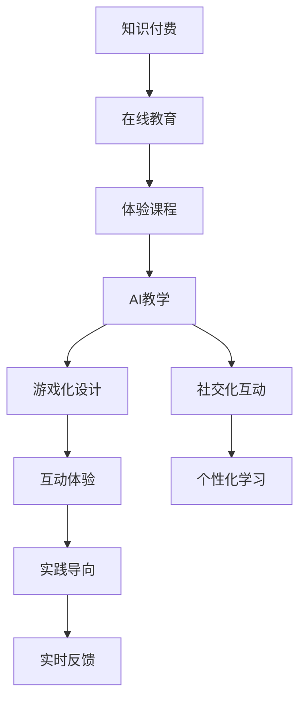

                 

# 程序员知识付费：打造体验课程

> 关键词：知识付费,程序员教育,体验课程,在线教育,AI教学

## 1. 背景介绍

### 1.1 问题由来

随着互联网和移动设备的普及，在线教育和知识付费市场呈现爆发式增长。这种趋势不仅改变了人们的学习方式，也带来了新的商业模式和机遇。在IT领域，程序员作为“程序员工程师”的高需求群体，其教育和培训市场需求尤为旺盛。然而，传统的在线课程往往存在“填鸭式”教学、缺乏互动、缺乏实践经验等缺陷，难以满足程序员的学习需求。因此，如何打造一种更加互动、实践导向的在线教育形式，成为了在线教育市场亟待解决的问题。

### 1.2 问题核心关键点

本文聚焦于程序员在线教育课程的创新设计，通过结合知识付费模式，打造一个以互动、实践为导向的在线体验课程平台。其核心关键点包括：

- **知识付费模式**：通过订阅、按需付费、课程包等形式，让用户为有价值的知识和服务付费，激励优质内容的生产。
- **互动体验**：通过AI技术、游戏化设计、社交化互动等手段，提高课程的互动性和参与感，帮助学员更好地理解和掌握知识。
- **实践导向**：以项目驱动学习，将知识点融合到实际项目中，通过动手实践提升学员的技能和经验。
- **个性化学习**：根据学员的学习进度和兴趣，动态调整课程内容和难度，实现个性化教学。
- **实时反馈**：通过AI智能辅导和即时反馈，帮助学员快速发现并解决问题，提高学习效率。

## 2. 核心概念与联系

### 2.1 核心概念概述

在探讨程序员体验课程的设计和开发时，需要明确几个核心概念及其相互联系：

- **知识付费**：指用户为获取有价值的知识和服务而支付费用的模式。在线教育平台通过订阅制、按需付费等形式，鼓励用户进行持续学习。
- **在线教育**：指通过互联网进行知识传播和教学活动，打破传统时间和空间的限制，为更多人提供学习机会。
- **体验课程**：指注重互动、实践和个性化学习的在线课程形式，强调学习者的参与感和自主性。
- **AI教学**：指利用人工智能技术进行个性化教学、智能辅导、自动评估等，提升教学效果和效率。
- **游戏化设计**：通过将学习过程设计成游戏，引入竞赛、积分、奖励等元素，激发学习者的兴趣和动力。
- **社交化互动**：利用社交媒体、论坛、社区等平台，促进学员之间的交流和协作，营造良好的学习氛围。

这些概念之间相互关联，共同构成了程序员体验课程的基础框架。

### 2.2 核心概念原理和架构的 Mermaid 流程图



这个流程图展示了核心概念之间的逻辑关系：

1. **知识付费**作为在线教育的经济基础，为优质内容的生产提供了动力。
2. **在线教育**打破了时间和空间的限制，为知识传播提供了新的渠道。
3. **体验课程**在在线教育的基础上，通过互动、实践和个性化学习提升用户参与感。
4. **AI教学**利用人工智能技术，提高个性化教学和智能辅导的效果。
5. **游戏化设计**和**社交化互动**进一步增强了课程的吸引力和学习者的积极性。
6. **互动体验**、**实践导向**和**实时反馈**则体现了体验课程的核心价值。

## 3. 核心算法原理 & 具体操作步骤

### 3.1 算法原理概述

体验课程的开发主要依赖于以下几个核心算法和原理：

- **个性化推荐算法**：根据学员的学习历史和兴趣，推荐适合其水平和需求的学习内容。
- **智能辅导算法**：利用AI技术，对学员的学习过程进行实时分析和评估，提供个性化的辅导和建议。
- **互动设计算法**：通过设计有意义的互动元素，提升学员的学习体验和参与度。
- **实践评估算法**：对学员的实践项目进行评估和反馈，帮助其改进和提高。

### 3.2 算法步骤详解

体验课程的开发可以分为以下几个关键步骤：

**Step 1: 需求分析和设计**

- **需求调研**：通过问卷调查、用户访谈等方式，了解学员的学习需求和期望。
- **课程设计**：根据需求调研结果，设计课程内容和结构，确定互动、实践和个性化学习的具体实现方式。
- **技术选型**：选择合适的技术栈和框架，如React、Vue.js、Node.js、Django等。

**Step 2: 构建课程平台**

- **前端开发**：开发课程平台的前端界面，实现课程展示、互动、实践等功能。
- **后端开发**：开发课程平台的后端服务，包括学员管理、课程管理、学习进度跟踪等功能。
- **数据库设计**：设计课程平台所需的数据库结构，如学员信息、课程信息、实践项目等。

**Step 3: 实现核心算法**

- **个性化推荐算法**：根据学员的学习历史和兴趣，构建推荐模型，生成推荐列表。
- **智能辅导算法**：开发智能辅导系统，利用机器学习、自然语言处理等技术，分析学员的学习进度和问题，提供个性化辅导。
- **互动设计算法**：设计课程互动模块，如任务驱动、游戏化竞赛、社交互动等，提升学习体验。
- **实践评估算法**：开发实践评估系统，自动检测学员的代码、项目、报告等，提供实时反馈和建议。

**Step 4: 开发测试与部署**

- **功能测试**：对课程平台进行全面测试，确保各项功能正常运行。
- **性能测试**：测试课程平台的性能和稳定性，优化用户体验。
- **部署上线**：将课程平台部署到服务器上，确保稳定运行。

**Step 5: 维护与迭代**

- **用户反馈**：收集用户反馈，了解用户体验和需求。
- **持续迭代**：根据反馈，不断优化课程内容和平台功能。
- **版本更新**：定期发布课程平台的更新版本，提升用户体验。

### 3.3 算法优缺点

体验课程的开发具有以下优点：

- **高效学习**：通过互动和实践导向，学员能够更快地掌握知识点，提升学习效率。
- **个性化教学**：根据学员的学习进度和兴趣，提供定制化教学，提升学习效果。
- **即时反馈**：通过AI智能辅导和实时反馈，帮助学员快速发现和解决问题，提高学习效率。
- **高参与度**：通过游戏化设计和社交化互动，提升学员的学习兴趣和参与感。

然而，体验课程的开发也面临一些挑战：

- **开发成本高**：需要大量的技术投入和人力资源，开发周期较长。
- **技术难度大**：涉及AI、大数据、前端后端等多个技术领域，开发难度较大。
- **用户需求复杂**：学员需求多样，需要根据不同需求进行个性化设计和优化。
- **内容质量控制**：课程内容需要定期更新和维护，确保教学质量。

## 4. 数学模型和公式 & 详细讲解 & 举例说明

### 4.1 数学模型构建

体验课程的开发涉及多个数学模型和算法，以下重点介绍几个关键的数学模型：

- **个性化推荐模型**：
  - 用户特征表示：利用向量化方法，将学员的学习历史、兴趣、行为等转化为向量表示。
  - 相似度计算：计算学员之间的相似度，推荐与学员最接近的其他学员的学习内容。
  - 推荐算法：基于协同过滤、内容推荐等算法，生成推荐列表。

- **智能辅导模型**：
  - 问题分类：利用自然语言处理技术，对学员提出的问题进行分类，识别问题类型。
  - 智能回答：根据问题分类，调用相应的回答模型，提供个性化建议。
  - 效果评估：评估智能回答的效果，优化智能辅导系统。

### 4.2 公式推导过程

以个性化推荐模型为例，以下是对其关键公式的推导过程：

**用户特征表示**：
设用户 $i$ 的特征表示为 $\mathbf{x}_i=(x_{i1},x_{i2},\ldots,x_{in})$，其中 $n$ 为特征维度，$x_{ik}$ 表示用户 $i$ 在特征 $k$ 上的值。

**相似度计算**：
假设用户 $i$ 和 $j$ 的相似度为 $s_{ij}$，则有：
$$
s_{ij} = \frac{\mathbf{x}_i \cdot \mathbf{x}_j}{\|\mathbf{x}_i\| \cdot \|\mathbf{x}_j\|}
$$
其中 $\cdot$ 表示向量点积，$\|\cdot\|$ 表示向量范数。

**推荐算法**：
基于协同过滤的推荐算法公式如下：
$$
\hat{y}_{ij} = \alpha s_{ij} + (1-\alpha)y_j
$$
其中 $\hat{y}_{ij}$ 表示用户 $i$ 对项目 $j$ 的预测评分，$\alpha$ 为衰减因子。

### 4.3 案例分析与讲解

以一个在线编程练习平台为例，探讨体验课程的实际应用：

- **需求调研**：通过对编程新手的调研，发现其在编程过程中遇到的问题包括语法错误、逻辑错误、运行时错误等。
- **课程设计**：设计了一个以问题驱动的编程练习平台，通过设置小任务、中任务和大任务，逐步提升学员的编程能力。
- **技术选型**：选择了React进行前端开发，Node.js进行后端服务开发，MongoDB作为数据库。
- **核心算法**：开发了基于协同过滤的个性化推荐算法，根据学员的练习历史推荐相似度高的练习题。同时，利用智能辅导算法，对学员的练习进行实时分析和评估，提供个性化建议。
- **开发测试与部署**：开发了练习题、用户管理、进度跟踪等模块，并通过用户测试优化了用户体验。最终将平台部署到云服务器上。
- **维护与迭代**：通过用户反馈和数据监控，不断优化算法和平台功能，提升了学员的学习效果。

## 5. 项目实践：代码实例和详细解释说明

### 5.1 开发环境搭建

在开始体验课程的开发前，需要准备开发环境，具体步骤如下：

**Step 1: 安装开发工具**

- 安装Node.js和npm：
  ```
  sudo apt-get install nodejs npm
  ```
- 安装React：
  ```
  npm install create-react-app
  ```

**Step 2: 搭建开发环境**

- 创建React项目：
  ```
  create-react-app my-app
  ```
- 进入项目目录：
  ```
  cd my-app
  ```

**Step 3: 安装后端服务**

- 安装Node.js和Express：
  ```
  npm install express
  ```
- 创建后端服务：
  ```
  express --no-hmr server.js
  ```

**Step 4: 数据库连接**

- 连接MongoDB数据库：
  ```
  const MongoClient = require('mongodb').MongoClient;
  const url = 'mongodb://localhost:27017';
  MongoClient.connect(url, (err, db) => {
    console.log('Database connected successfully');
    // 连接成功后的代码
  });
  ```

### 5.2 源代码详细实现

以下是体验课程平台前端和后端的核心代码实现：

**前端代码**：
```javascript
import React, { useState } from 'react';
import './App.css';

function App() {
  const [user, setUser] = useState('');
  const [practiceList, setPracticeList] = useState([]);
  
  const fetchPractice = async () => {
    const response = await fetch('http://localhost:3000/practice');
    const data = await response.json();
    setPracticeList(data);
  }
  
  return (
    <div className="App">
      <input type="text" value={user} onChange={(e) => setUser(e.target.value)} />
      <button onClick={fetchPractice}>获取练习题</button>
      <ul>
        {practiceList.map((item, index) => <li key={index}>{item.name}</li>)}
      </ul>
    </div>
  );
}

export default App;
```

**后端代码**：
```javascript
const express = require('express');
const app = express();
const MongoClient = require('mongodb').MongoClient;
const url = 'mongodb://localhost:27017';

MongoClient.connect(url, (err, db) => {
  if (err) throw err;
  console.log('Database connected successfully');
  
  app.get('/practice', (req, res) => {
    const collection = db.collection('practice');
    collection.find().toArray((err, docs) => {
      if (err) throw err;
      res.json(docs);
    });
  });
  
  app.listen(3000, () => {
    console.log('Server started on port 3000');
  });
});
```

### 5.3 代码解读与分析

**前端代码**：
- 通过React组件实现了用户输入框、获取练习题按钮和练习题列表。
- 使用useState钩子管理用户输入和练习题列表状态。
- 定义fetchPractice函数，通过fetch从后端获取练习题数据，并更新练习题列表。

**后端代码**：
- 使用Express创建HTTP服务器。
- 连接MongoDB数据库，获取练习题数据，并返回JSON格式的练习题列表。
- 监听3000端口，启动HTTP服务器。

### 5.4 运行结果展示

通过上述代码实现，可以搭建一个简单的体验课程平台，用户可以输入关键词，获取相关的练习题列表。平台通过数据库获取数据，并通过前端展示。

## 6. 实际应用场景

### 6.1 智能客服系统

智能客服系统是体验课程的重要应用场景之一。传统的客服系统往往需要大量人工客服，高峰期响应缓慢，且质量难以保证。而体验课程可以将常见问题整理成练习题，供客服人员进行学习和练习，提升客服人员的技能和效率。

### 6.2 在线编程学习平台

在线编程学习平台是体验课程的典型应用。平台可以通过任务驱动的方式，引导学员逐步掌握编程知识和技能，并通过实践和即时反馈，提升学员的学习效果。

### 6.3 在线课程平台

在线课程平台可以将体验课程与知识付费模式结合，提供付费订阅服务，激励优质内容的生产。通过互动和个性化学习，提升学员的学习体验和效果。

### 6.4 未来应用展望

未来，体验课程将会在更多领域得到应用，如智能教育、智能医疗、智能制造等。通过结合AI技术、游戏化设计、社交化互动等手段，提升各行业的数字化、智能化水平。

## 7. 工具和资源推荐

### 7.1 学习资源推荐

为了帮助开发者系统掌握体验课程的开发技术，以下推荐一些优质的学习资源：

1. **React官方文档**：React官方提供的文档和示例代码，是学习React的必备资料。
2. **Node.js官方文档**：Node.js官方提供的文档和示例代码，帮助开发者快速上手Node.js。
3. **MongoDB官方文档**：MongoDB官方提供的文档和示例代码，了解MongoDB的使用方法和最佳实践。
4. **《Web前端开发与设计》**：系统介绍Web前端开发的基础知识和设计原则，适合初学者入门。
5. **《JavaScript高级程序设计》**：深入讲解JavaScript语言的各种特性和编程技巧，适合进阶学习。

### 7.2 开发工具推荐

体验课程的开发离不开优秀的工具支持。以下是几款用于体验课程开发的常用工具：

1. **VS Code**：一款功能强大的代码编辑器，支持多种编程语言和插件。
2. **Postman**：一个功能丰富的API测试工具，方便进行API调试和测试。
3. **GitHub**：一个开源代码托管平台，方便版本控制和代码共享。
4. **Jira**：一个项目管理工具，帮助团队协作和任务管理。
5. **Sketch**：一款UI设计工具，方便进行界面设计和原型开发。

### 7.3 相关论文推荐

体验课程的研究源于学界的持续研究。以下是几篇奠基性的相关论文，推荐阅读：

1. **《机器学习应用开发》**：介绍机器学习在各种应用场景中的开发和实践，适合开发者参考。
2. **《在线教育系统设计》**：探讨在线教育系统的设计与实现，提供多种实际案例和解决方案。
3. **《大规模机器学习与数据挖掘》**：讲解大规模机器学习技术的基本原理和应用案例，帮助开发者掌握相关技术。
4. **《用户体验设计》**：探讨用户体验设计的理论和方法，提升用户体验和满意度。

## 8. 总结：未来发展趋势与挑战

### 8.1 研究成果总结

体验课程作为一种新的在线教育形式，通过结合知识付费、AI教学、游戏化设计等手段，提升学习效果和学员体验。其核心优势包括：高效学习、个性化教学、即时反馈、高参与度等。

### 8.2 未来发展趋势

未来，体验课程将呈现以下几个发展趋势：

- **更加智能化**：通过AI技术，实现更加个性化的学习体验和智能辅导。
- **更加互动化**：引入更多互动元素，如任务驱动、游戏化竞赛、社交互动等，提升学员的参与感。
- **更加实践化**：将知识点融合到实际项目中，通过动手实践提升学员的技能和经验。
- **更加多模态化**：融合视觉、听觉等多模态信息，实现多模态交互和教学。

### 8.3 面临的挑战

体验课程的开发和应用面临一些挑战：

- **技术难度高**：涉及多种技术栈和算法，开发难度较大。
- **用户需求复杂**：学员需求多样，需要根据不同需求进行个性化设计和优化。
- **内容质量控制**：课程内容需要定期更新和维护，确保教学质量。

### 8.4 研究展望

未来的研究需要在以下几个方面寻求新的突破：

- **算法优化**：进一步优化个性化推荐、智能辅导等算法，提升教学效果。
- **技术整合**：将AI、大数据、前端后端等多个技术进行整合，提升课程开发效率。
- **用户体验**：关注用户体验，不断优化界面设计、交互流程等，提升学习效果和满意度。
- **内容丰富**：增加课程内容和形式的多样性，满足不同学员的学习需求。

## 9. 附录：常见问题与解答

**Q1: 体验课程与传统在线课程有何不同？**

A: 体验课程通过互动、实践和个性化学习提升学员参与感和自主性，相比传统在线课程的“填鸭式”教学更加高效和有针对性。

**Q2: 如何提升体验课程的用户体验？**

A: 可以通过游戏化设计、社交化互动、个性化推荐等手段，提升课程的趣味性和参与感，从而提升用户体验。

**Q3: 体验课程开发中常用的前端框架有哪些？**

A: 常用的前端框架包括React、Vue.js、Angular等。React是目前最流行的前端框架之一，具有良好的性能和生态系统。

**Q4: 体验课程开发中常用的数据库有哪些？**

A: 常用的数据库包括MongoDB、MySQL、Redis等。MongoDB是一个流行的NoSQL数据库，适合存储非结构化数据，易于扩展。

**Q5: 体验课程开发中常用的机器学习算法有哪些？**

A: 常用的机器学习算法包括协同过滤、决策树、神经网络等。协同过滤算法常用于个性化推荐，决策树算法常用于问题分类，神经网络算法常用于智能辅导。

**Q6: 体验课程开发中如何保障数据安全？**

A: 可以通过数据加密、访问控制、审计日志等手段，保障数据安全。同时，也需要定期进行安全漏洞扫描和风险评估，及时修复漏洞。

---

作者：禅与计算机程序设计艺术 / Zen and the Art of Computer Programming

