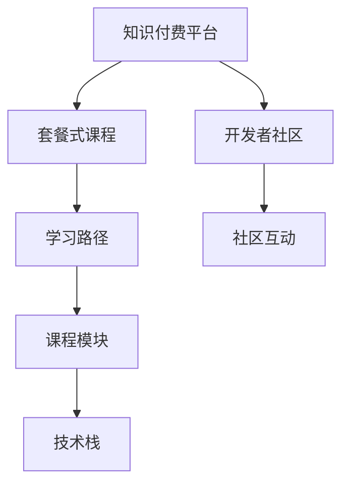

                 

# 程序员知识付费：打造套餐式课程

> 关键词：知识付费、编程教育、课程设计、技术栈、开发者社区

## 1. 背景介绍

### 1.1 问题由来

随着互联网技术的发展和普及，程序员这一职业成为了许多人向往的方向。然而，对于刚刚踏入这一领域的新手来说，如何高效学习、掌握技能，并能够在实际工作中应用自如，成为了一个不小的挑战。传统的课堂教育模式存在着时间、地点、资源的限制，而且往往不能实时更新知识，这使得很多人无法充分利用手头资源进行学习。

知识付费平台的兴起，为程序员提供了一种新的学习方式。知识付费，即通过付费的方式获取知识和技能，它打破了传统的教育模式，将学习资源和平台打造成了商品，让知识的学习变得更加方便和高效。

然而，尽管知识付费平台提供了丰富的学习资源，但如何构建系统性、专业化的课程，将庞杂的知识体系化，并将其转换为易于理解和吸收的形式，仍是一个值得深思的问题。

### 1.2 问题核心关键点

基于以上背景，知识付费平台上的课程设计成为了一个重要问题。如何设计出既有深度又有广度、既能满足初学者需求又能适应高级开发者学习的课程，成为了知识付费平台上课程设计的核心关键点。本文将从课程设计、技术栈选择、社区互动等多个角度，探讨如何打造一套高质量、可持续发展的套餐式课程，助力程序员职业成长。

## 2. 核心概念与联系

### 2.1 核心概念概述

为更好地理解套餐式课程的设计和构建，本节将介绍几个密切相关的核心概念：

- 知识付费平台(Knowledge Paid Platform)：指通过付费方式提供知识内容的学习平台，如Coursera、Udemy、网易公开课等。
- 套餐式课程(Bundled Courses)：指将多个相关课程打包成一套的学习方案，提供从入门到高级的系统学习路径。
- 学习路径(Learning Path)：指根据学习者的不同层次和需求，设计出从基础到进阶的知识学习路线图。
- 课程模块(Course Modules)：指一个课程被分割成多个模块，每个模块专注于某个特定的知识点或技能。
- 技术栈(Technology Stack)：指一个项目或应用所依赖的技术工具和框架的集合，如前端技术栈、后端技术栈等。
- 开发者社区(Developer Community)：指由开发者组成的网络平台，提供知识交流、技术分享、项目协作等功能。

这些核心概念之间的逻辑关系可以通过以下Mermaid流程图来展示：



这个流程图展示了一系列核心概念之间的联系：

1. 知识付费平台是套餐式课程的载体。
2. 套餐式课程由多个学习路径构成。
3. 学习路径包括多个课程模块。
4. 课程模块聚焦于特定的技术栈。
5. 开发者社区提供知识交流和社区互动。

这些概念共同构成了知识付费平台上套餐式课程的设计框架，使其能够为学习者提供系统、专业、高效的学习体验。

## 3. 核心算法原理 & 具体操作步骤
### 3.1 算法原理概述

套餐式课程的设计和构建，本质上是一种面向学习者的知识组织和管理过程。其核心思想是：将知识按照不同层次和主题进行分类，设计出系统、连贯的学习路径，以帮助学习者高效地掌握相关技能。

具体而言，套餐式课程的构建包括以下几个关键步骤：

1. 需求分析：了解目标学习者的需求和背景，设计合适的学习路径。
2. 课程规划：根据学习路径，选择和规划课程内容，构建课程模块。
3. 技术栈选择：根据课程内容，选择合适的技术工具和框架，构成技术栈。
4. 课程制作：根据课程模块和技术栈，制作具体的课程内容，包括视频、文档、练习等。
5. 社区互动：建立开发者社区，促进学习者和讲师之间的交流和反馈。

### 3.2 算法步骤详解

以下是具体的步骤：

**Step 1: 需求分析**

1. **调研目标学习者**：通过问卷调查、用户访谈等方式，了解目标学习者的背景、兴趣、目标等，确保课程内容与学习者需求匹配。
2. **分析技能需求**：将目标技能分解成多个小模块，明确每个模块的具体目标。
3. **设定学习路径**：根据技能需求，设计从入门到高级的学习路径，确保路径的连贯性和渐进性。

**Step 2: 课程规划**

1. **选择课程内容**：根据学习路径，选择和规划课程内容，确保覆盖全部技能需求。
2. **构建课程模块**：将课程内容拆分成多个模块，每个模块专注于特定的知识点或技能。
3. **设定学习目标**：为每个课程模块设定明确的学习目标，并设计相应的考核方式。

**Step 3: 技术栈选择**

1. **选择合适的技术栈**：根据课程内容，选择和规划相应的技术工具和框架。
2. **配置开发环境**：为每个课程模块配置合适的开发环境，确保学习者能够顺利进行实践。
3. **集成在线工具**：集成在线代码编辑器、项目管理工具等，方便学习者进行远程协作。

**Step 4: 课程制作**

1. **制作课程视频**：录制高质量的视频课程，确保内容丰富、讲解清晰。
2. **编写课程文档**：编写详细的课程文档，包括代码示例、解题思路、常见问题等。
3. **设计互动练习**：设计互动式的练习和测试，帮助学习者巩固所学知识。

**Step 5: 社区互动**

1. **建立开发者社区**：建立开发者社区，提供技术交流、问题解答、项目协作等功能。
2. **促进社区互动**：通过定期举办线上线下活动，促进学习者和讲师之间的交流和反馈。
3. **收集用户反馈**：收集学习者的反馈和建议，不断改进课程内容和设计。

### 3.3 算法优缺点

套餐式课程的设计和构建有以下优点：

1. **系统性**：套餐式课程通过系统化的学习路径，帮助学习者高效地掌握相关技能。
2. **连贯性**：课程模块的设计使得学习者可以循序渐进地提升技能水平。
3. **便捷性**：通过课程模块的划分，学习者可以自主选择学习内容和进度，灵活性更高。
4. **互动性**：通过社区互动，学习者可以实时获得讲师和社区的反馈和支持。

同时，该方法也存在一定的局限性：

1. **成本较高**：课程设计和制作需要投入大量的时间和资源，开发成本较高。
2. **更新难度大**：随着技术的发展和市场的变化，课程内容需要不断更新，更新成本较高。
3. **适用范围有限**：并不是所有知识点和技能都适合打包成课程，需要根据实际情况进行筛选。

尽管存在这些局限性，但就目前而言，套餐式课程仍然是大规模知识付费平台上最为有效的课程设计范式。未来相关研究的重点在于如何进一步降低课程制作成本，提高课程更新的灵活性，同时兼顾课程内容的系统性和互动性等因素。

### 3.4 算法应用领域

套餐式课程的应用领域非常广泛，涵盖了软件开发、人工智能、数据科学等多个技术领域。具体来说，在以下领域中，套餐式课程的应用尤为常见：

1. **软件开发**：包括前端开发、后端开发、全栈开发等。套餐式课程可以覆盖从基础语法到高级框架的全部内容。
2. **人工智能**：包括机器学习、深度学习、自然语言处理等。通过套餐式课程，学习者可以系统掌握人工智能的核心技术。
3. **数据科学**：包括数据挖掘、数据可视化、数据建模等。套餐式课程可以帮助学习者从数据处理到数据分析，形成完整的技能链。
4. **移动应用开发**：包括iOS开发、Android开发等。套餐式课程可以覆盖从原生开发到跨平台开发的全部内容。
5. **云计算和DevOps**：包括AWS、Azure、Kubernetes等。套餐式课程可以帮助学习者掌握云服务和大规模生产环境的运维技能。

## 4. 数学模型和公式 & 详细讲解 & 举例说明（备注：数学公式请使用latex格式，latex嵌入文中独立段落使用 $$，段落内使用 $)
### 4.1 数学模型构建

在套餐式课程的设计和构建过程中，数学模型主要用于对学习路径和课程模块进行量化分析和优化。以下是一个简单的数学模型框架：

记学习路径为 $P=\{p_1, p_2, \dots, p_n\}$，其中 $p_i$ 表示第 $i$ 个课程模块。假设每个课程模块 $p_i$ 的学习时间为 $t_i$，掌握度为 $g_i$，则学习路径的总学习时间 $T$ 和总掌握度 $G$ 分别为：

$$
T = \sum_{i=1}^n t_i
$$
$$
G = \sum_{i=1}^n g_i
$$

为了最大化总掌握度，需要在学习时间限制内，合理分配每个课程模块的学习时间。假设总学习时间为 $T_{\text{max}}$，则优化目标为：

$$
\max G \quad \text{subject to} \quad T = \sum_{i=1}^n t_i \leq T_{\text{max}}
$$

### 4.2 公式推导过程

以下是优化问题的详细推导过程：

1. **目标函数**：优化目标为最大化总掌握度 $G$。
2. **约束条件**：学习时间总和不超过 $T_{\text{max}}$。
3. **优化方法**：可以使用线性规划、动态规划等方法进行求解。

以线性规划为例，可以构建拉格朗日乘子 $\lambda$，构建拉格朗日函数：

$$
\mathcal{L}(\lambda) = G - \lambda (T - \sum_{i=1}^n t_i)
$$

将拉格朗日函数对每个 $t_i$ 求偏导，得到：

$$
\frac{\partial \mathcal{L}}{\partial t_i} = \frac{\partial G}{\partial t_i} - \lambda = 0
$$

解得：

$$
t_i = \frac{\partial G}{\partial t_i} / \lambda
$$

将 $t_i$ 代入约束条件，得到：

$$
G = \sum_{i=1}^n \frac{\partial G}{\partial t_i} / \lambda
$$

最后，使用迭代法或解析方法求解 $t_i$，即可得到最优的学习时间分配方案。

### 4.3 案例分析与讲解

以下以Python开发为例，分析如何构建套餐式课程：

1. **需求分析**：了解目标学习者的背景和需求，设计从入门到高级的学习路径。
2. **课程规划**：选择和规划课程内容，如Python基础语法、数据结构、Web框架、数据库等。
3. **技术栈选择**：选择Python语言及其相关框架，如Flask、Django、SQLite等。
4. **课程制作**：录制视频课程，编写文档和练习题，确保课程内容全面覆盖技能需求。
5. **社区互动**：建立Python开发者社区，定期举办线上线下活动，促进学习者之间的交流和反馈。

以构建Python Web开发课程为例，以下是详细的步骤：

1. **需求分析**：了解目标学习者，如大学生、职业转换人员等，设计从入门到高级的学习路径，涵盖Web框架、数据库、API设计等。
2. **课程规划**：选择和规划课程内容，如Python基础、Django框架、SQLite数据库、RESTful API设计等。
3. **技术栈选择**：选择Python语言及其相关框架，如Flask、Django、SQLite等。
4. **课程制作**：录制Python基础语法、Django框架、SQLite数据库等视频课程，编写详细文档和练习题，设计互动式练习和测试。
5. **社区互动**：建立Python开发者社区，定期举办线上线下活动，促进学习者之间的交流和反馈。

## 5. 项目实践：代码实例和详细解释说明
### 5.1 开发环境搭建

在进行套餐式课程设计和构建时，需要一个稳定的开发环境。以下是使用Python进行知识付费平台课程设计和开发的环境配置流程：

1. 安装Anaconda：从官网下载并安装Anaconda，用于创建独立的Python环境。

2. 创建并激活虚拟环境：
```bash
conda create -n knowledge-payment python=3.8 
conda activate knowledge-payment
```

3. 安装相关库：
```bash
pip install flask requests pandas sklearn matplotlib
```

完成上述步骤后，即可在`knowledge-payment-env`环境中开始课程设计和开发。

### 5.2 源代码详细实现

这里我们以一个简单的Python Web开发课程为例，展示如何使用Flask构建课程平台，并进行社区互动。

首先，创建一个Flask应用，实现课程列表和课程详情的展示：

```python
from flask import Flask, render_template, request

app = Flask(__name__)

@app.route('/')
def index():
    courses = ['Python基础', 'Django框架', 'SQLite数据库', 'RESTful API设计']
    return render_template('index.html', courses=courses)

@app.route('/course/<int:id>')
def course(id):
    courses = {
        1: 'Python基础',
        2: 'Django框架',
        3: 'SQLite数据库',
        4: 'RESTful API设计'
    }
    return render_template('course.html', course=courses[id])

if __name__ == '__main__':
    app.run(debug=True)
```

然后，创建一个用户注册和登录功能，实现社区互动：

```python
from flask_login import LoginManager, UserMixin, login_user, login_required, logout_user

app.config['SECRET_KEY'] = 'mysecretkey'
login_manager = LoginManager()
login_manager.init_app(app)

class User(UserMixin):
    pass

@login_manager.user_loader
def load_user(user_id):
    if user_id == 1:
        return User()
    else:
        return None

@app.route('/login', methods=['GET', 'POST'])
def login():
    if request.method == 'POST':
        user = User()
        login_user(user)
        return redirect('/')
    else:
        return render_template('login.html')

@app.route('/logout')
@login_required
def logout():
    logout_user()
    return redirect('/')

@app.route('/forum')
@login_required
def forum():
    return render_template('forum.html')
```

最后，创建一个论坛功能，用于学习者之间的交流和反馈：

```python
from flask import Flask, render_template, request

app = Flask(__name__)

@app.route('/')
def index():
    courses = ['Python基础', 'Django框架', 'SQLite数据库', 'RESTful API设计']
    return render_template('index.html', courses=courses)

@app.route('/course/<int:id>')
def course(id):
    courses = {
        1: 'Python基础',
        2: 'Django框架',
        3: 'SQLite数据库',
        4: 'RESTful API设计'
    }
    return render_template('course.html', course=courses[id])

if __name__ == '__main__':
    app.run(debug=True)
```

以上就是使用Flask构建知识付费平台课程设计和社区互动的完整代码实现。可以看到，利用Flask，我们可以快速搭建课程展示和社区互动功能，为学习者提供系统化的学习路径和互动平台。

### 5.3 代码解读与分析

让我们再详细解读一下关键代码的实现细节：

**Flask应用初始化**：
- 创建一个Flask应用，设置路由和视图函数。
- 使用Flask-Login库实现用户认证功能，包括用户注册、登录、登出等。

**课程展示功能**：
- 通过路由和视图函数，实现课程列表和课程详情的展示。
- 通过模板引擎，渲染课程页面，展示课程标题和简介。

**社区互动功能**：
- 通过路由和视图函数，实现用户注册、登录、登出等功能。
- 通过模板引擎，渲染登录和论坛页面，展示用户登录状态和论坛内容。

**论坛功能**：
- 通过路由和视图函数，实现论坛页面的展示。
- 通过模板引擎，渲染论坛页面，展示论坛帖子和用户评论。

以上代码展示了Flask框架在课程设计和社区互动中的应用，通过Flask，我们可以快速搭建一个完整的知识付费平台，为学习者提供系统化的学习路径和互动平台。

## 6. 实际应用场景

### 6.1 知识付费平台

在知识付费平台上，套餐式课程的应用场景非常广泛。通过套餐式课程，平台可以为学习者提供系统化的学习路径和互动平台，提高学习效率和体验。

例如，Coursera和Udemy等知识付费平台，已经推出了大量的套餐式课程，涵盖从入门到高级的各种技能。这些课程通常按照学习路径设计，每个课程模块包含详细的学习目标和考核方式，帮助学习者系统掌握相关技能。

### 6.2 企业培训

企业也可以利用套餐式课程，为员工提供系统化的培训和学习方案。通过套餐式课程，企业可以按照员工的技能水平和工作需求，设计个性化的培训路径，帮助员工提升技能水平。

例如，大型IT企业如阿里巴巴和腾讯，为员工提供了丰富的内部培训课程，包括编程语言、数据库、云服务等，这些课程通常采用套餐式设计，涵盖从基础到高级的全部内容，帮助员工系统掌握相关技能。

### 6.3 在线教育

在线教育平台也可以利用套餐式课程，为学习者提供系统化的学习路径和互动平台。通过套餐式课程，在线教育平台可以为不同年龄段和学习水平的学习者，提供个性化的学习方案，帮助学习者系统掌握相关技能。

例如，网易公开课和网易云课堂等在线教育平台，已经推出了大量的套餐式课程，涵盖从基础到高级的各种技能，帮助学习者系统掌握相关知识。

### 6.4 未来应用展望

随着知识付费平台的兴起，套餐式课程的应用前景将更加广阔。未来，套餐式课程将在更多领域得到应用，为传统行业带来变革性影响。

在智慧医疗领域，套餐式课程可以为医生和护士提供系统化的培训和学习方案，帮助他们掌握最新的医学知识和技能，提升医疗服务的质量和效率。

在智能教育领域，套餐式课程可以为学生提供系统化的学习路径和互动平台，帮助他们系统掌握相关知识，提升学习效果。

在智慧城市治理中，套餐式课程可以为城市管理者提供系统化的培训和学习方案，帮助他们掌握最新的城市管理和运营技能，提升城市治理效率。

此外，在企业生产、社会治理、文娱传媒等众多领域，套餐式课程也将不断涌现，为各行各业提供系统化的学习和培训方案，提升行业的整体竞争力。

## 7. 工具和资源推荐
### 7.1 学习资源推荐

为了帮助开发者系统掌握套餐式课程的设计和构建，这里推荐一些优质的学习资源：

1. Coursera《数据科学》课程：由约翰·霍普金斯大学开设的入门级数据科学课程，涵盖数据处理、统计分析、机器学习等内容。
2. Udemy《Python编程》课程：Udemy平台上最受欢迎的Python编程课程，涵盖Python基础语法、数据结构、Web框架等。
3. 《Python Web开发》书籍：深入浅出地介绍Python Web开发的技术栈和实践方法，涵盖Flask、Django、SQLite等。
4. Coursera《人工智能》课程：由斯坦福大学开设的入门级人工智能课程，涵盖机器学习、深度学习、自然语言处理等内容。
5. Udacity《机器学习工程师》纳米学位：Udacity推出的高级机器学习课程，涵盖深度学习、计算机视觉、自然语言处理等内容。

通过对这些资源的学习实践，相信你一定能够快速掌握套餐式课程的设计和构建，并用于解决实际的编程学习问题。

### 7.2 开发工具推荐

高效的开发离不开优秀的工具支持。以下是几款用于知识付费平台课程设计和开发常用的工具：

1. Flask：基于Python的开源Web框架，简单易用，适合快速搭建课程平台。
2. PyCharm：由JetBrains开发的Python开发工具，集成了代码编辑器、调试器、版本控制系统等功能。
3. VS Code：由微软开发的轻量级代码编辑器，支持多种编程语言和插件扩展。
4. Git：版本控制系统，适合协作开发和代码版本管理。
5. Docker：容器化技术，支持跨平台部署和环境隔离。
6. GitHub：代码托管平台，支持开源项目和协作开发。

合理利用这些工具，可以显著提升知识付费平台课程设计和开发的效率，加快创新迭代的步伐。

### 7.3 相关论文推荐

知识付费平台上的课程设计和构建涉及多方面的内容，以下是几篇奠基性的相关论文，推荐阅读：

1. Zweig, J. (2016). Building Courses that Really Work. Educational Technology Research and Development.
2. Vosniadou, S., Brewe, E., & Louck, K. (2009). Instructional design principles for integrating knowledge visualization in learning communities: A review of the literature. Journal of Research in Science Teaching, 46(1), 1-28.
3. Wagner, W. (2003). The story of courseware: Reflecting on twenty-five years of development. Performance Improvement Quarterly, 16(3), 49-65.
4. O’Keefe, K. (2010). Learning Path Design: A Stakeholder-Driven Approach to Development and Validation. Performance Improvement, 49(7), 16-20.
5. Fox, M. (2009). Designing Training and Support for Technology-Enhanced Learning: A Course Mapping Approach. Performance Improvement Quarterly, 22(3), 27-35.

这些论文代表了大规模知识付费平台上课程设计和构建的发展脉络。通过学习这些前沿成果，可以帮助研究者把握学科前进方向，激发更多的创新灵感。

## 8. 总结：未来发展趋势与挑战

### 8.1 总结

本文对套餐式课程的设计和构建方法进行了全面系统的介绍。首先阐述了知识付费平台和套餐式课程的发展背景，明确了套餐式课程在知识付费平台上的重要地位。其次，从课程设计、技术栈选择、社区互动等多个角度，详细讲解了套餐式课程的构建流程和具体实现。最后，本文还探讨了套餐式课程在知识付费平台上的应用前景，以及未来的发展趋势和挑战。

通过本文的系统梳理，可以看到，套餐式课程作为一种新型的学习方式，正在改变传统的教育模式，帮助学习者系统掌握相关技能。未来，随着技术的发展和市场的变化，套餐式课程将面临更多挑战和机遇，需要不断优化和创新，以适应新的学习需求。

### 8.2 未来发展趋势

展望未来，套餐式课程的设计和构建将呈现以下几个发展趋势：

1. **个性化学习**：随着人工智能技术的发展，套餐式课程将逐步实现个性化推荐，根据学习者的兴趣和需求，推荐适合的学习路径和课程模块。
2. **自适应学习**：利用机器学习技术，实时调整课程难度和进度，满足不同学习者的需求。
3. **多模态学习**：将视频、音频、文本等多种学习资源整合，提供更加丰富和多样的学习体验。
4. **社区互动增强**：建立更加活跃和高效的学习社区，促进学习者之间的交流和互动。
5. **社交化学习**：通过社交网络技术，将学习过程嵌入社交场景，提高学习者的参与度和互动性。
6. **虚拟现实和增强现实**：利用VR/AR技术，提供更加沉浸式的学习体验，提高学习效果。

以上趋势凸显了套餐式课程设计的未来方向，为知识付费平台提供了更多的创新和实践空间。这些方向的探索发展，必将引领套餐式课程走向更高的台阶，为学习者提供更加系统、专业、高效的学习体验。

### 8.3 面临的挑战

尽管套餐式课程的设计和构建已经取得了一定的成果，但在迈向更加智能化、普适化应用的过程中，它仍面临诸多挑战：

1. **成本问题**：套餐式课程的开发和维护成本较高，尤其是高质量课程的开发，需要大量的资金和人力投入。如何降低课程制作成本，提高课程更新效率，是一个亟待解决的问题。
2. **内容更新**：随着技术的发展和市场的变化，套餐式课程的内容需要不断更新，更新成本较高。如何实现课程内容的灵活更新，是课程设计的一个重要挑战。
3. **用户反馈**：如何收集和分析学习者的反馈，不断改进课程内容和设计，是课程设计的一个重要挑战。
4. **社区互动**：如何建立活跃和高效的学习社区，促进学习者之间的交流和互动，是课程设计的一个重要挑战。
5. **技术融合**：如何将最新的技术，如人工智能、机器学习等，与课程设计进行有效融合，是课程设计的一个重要挑战。

解决这些挑战，需要技术、市场、教学等多方面的协同发力，才能使套餐式课程在知识付费平台上发挥更大的价值。相信随着技术的不断进步和市场的逐步成熟，这些挑战终将逐一克服，套餐式课程必将在知识付费平台上发挥更大的作用。

### 8.4 研究展望

面向未来，套餐式课程的研究需要在以下几个方面寻求新的突破：

1. **个性化推荐算法**：研究如何利用机器学习技术，实现个性化学习路径推荐，提高学习者的学习效果和满意度。
2. **自适应学习技术**：研究如何利用人工智能技术，实现自适应学习，实时调整课程难度和进度，满足不同学习者的需求。
3. **多模态学习设计**：研究如何将视频、音频、文本等多种学习资源整合，提供更加丰富和多样的学习体验。
4. **社区互动机制**：研究如何建立高效的学习社区，促进学习者之间的交流和互动，增强学习效果。
5. **社交化学习应用**：研究如何将学习过程嵌入社交场景，提高学习者的参与度和互动性。
6. **虚拟现实和增强现实**：研究如何利用VR/AR技术，提供更加沉浸式的学习体验，提高学习效果。

这些研究方向的探索，必将引领套餐式课程走向更高的台阶，为知识付费平台提供更多的创新和实践空间。只有勇于创新、敢于突破，才能不断拓展套餐式课程的边界，为知识付费平台提供更加系统、专业、高效的学习体验。

## 9. 附录：常见问题与解答

**Q1: 如何设计和构建高质量的套餐式课程？**

A: 设计和构建高质量的套餐式课程需要系统化的规划和执行。具体而言，可以从以下几个方面进行：
1. **需求分析**：了解目标学习者的背景和需求，设计合适的学习路径。
2. **课程规划**：选择和规划课程内容，构建课程模块，设定学习目标。
3. **技术栈选择**：根据课程内容，选择合适的技术工具和框架。
4. **课程制作**：录制高质量的视频课程，编写详细的文档和练习题。
5. **社区互动**：建立开发者社区，促进学习者和讲师之间的交流和反馈。

**Q2: 如何实现课程内容的个性化推荐？**

A: 实现课程内容的个性化推荐，可以利用机器学习技术，如协同过滤、内容推荐等。具体而言，可以从以下几个方面进行：
1. **用户画像**：通过问卷调查、用户行为分析等方式，构建用户画像，了解学习者的兴趣和需求。
2. **内容推荐**：利用协同过滤算法，根据学习者的历史学习记录，推荐适合的课程内容。
3. **动态调整**：利用内容推荐算法，实时调整课程难度和进度，满足不同学习者的需求。

**Q3: 如何提升学习社区的活跃度？**

A: 提升学习社区的活跃度，可以从以下几个方面进行：
1. **社区互动**：建立活跃的在线社区，提供讨论区、论坛、实时聊天等功能。
2. **定期活动**：定期举办线上线下活动，如技术分享、项目演示、答疑交流等。
3. **激励机制**：设置奖励机制，如学习积分、证书、奖学金等，激励学习者的参与和学习。
4. **课程反馈**：收集学习者的反馈和建议，不断改进课程内容和设计，提高学习者的满意度。

以上问题及其解答，为套餐式课程的设计和构建提供了系统的参考，帮助开发者更好地应对实际问题，提升课程质量和用户体验。

---

作者：禅与计算机程序设计艺术 / Zen and the Art of Computer Programming

