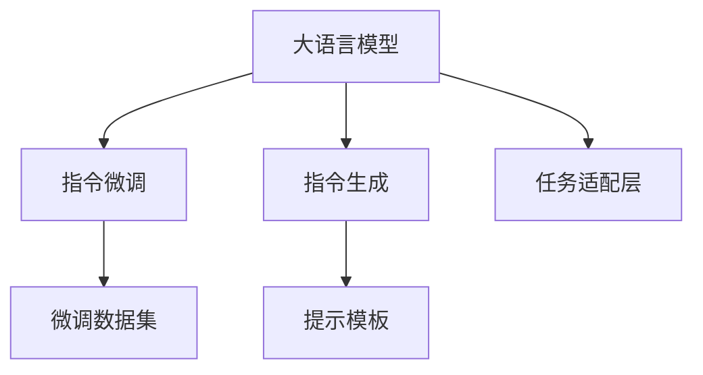

                 

# 突破界限：LLM的无限指令集

大语言模型（Large Language Models, LLMs）作为当前人工智能领域最热门的技术之一，通过在巨量数据上预训练，已经展示了巨大的潜力。其强大的语言理解和生成能力，使得它们在自然语言处理（NLP）、计算机视觉、推荐系统等多个领域取得了突破性进展。然而，这些模型并非万能，它们在某些特定任务或特定场景下仍显局限。本文将深入探讨如何通过改进大语言模型，实现其在指令生成（Instruction Tuning）和指令微调（Instruction Fine-Tuning）方面的突破，从而极大地扩展其应用范围。

## 1. 背景介绍

### 1.1 问题由来

在NLP领域，传统的方法通常依赖于手工构建的规则和特征工程，难以处理语言表达的丰富性和复杂性。相比之下，大语言模型通过对大规模数据进行自监督预训练，可以自动学习语言的内在规律，具备强大的语言理解与生成能力。然而，尽管如此，大语言模型在特定领域和任务上的表现仍存在一定的局限性，主要体现在以下几点：

1. **领域特定性不足**：大语言模型通常缺乏对特定领域的知识理解，在处理特定领域或领域跨界任务时，表现不佳。
2. **任务复杂性不足**：尽管在通用语言建模上表现出色，但模型在复杂任务（如多轮对话、可解释性输出等）上的能力仍然有限。
3. **资源依赖性强**：大语言模型通常需要较高的计算资源和数据量，限制了其在某些资源受限环境中的应用。

这些问题严重制约了大语言模型的广泛应用，特别是在需要高精度、高可解释性、高效率的场景中。为了解决这些问题，研究人员提出了**指令微调**和**指令生成**的概念，通过这些技术，可以显著提升大语言模型在特定领域和任务上的性能。

### 1.2 问题核心关键点

指令微调和指令生成方法的核心在于利用大语言模型的预训练能力，通过合理的设计和优化，使其能够在特定指令下输出期望的结果。它们的核心思想包括：

- **指令微调（Instruction Fine-Tuning, IFT）**：通过微调大语言模型，使其能够按照特定指令生成语言表达。这种方法通常需要在微调数据集上增加标注指令和对应的输出，以指导模型学习。
- **指令生成（Instruction Generation, IG）**：无需微调，通过在输入中添加特定格式的指令，引导模型生成期望的输出。这种方法通常依赖于提示模板和预训练模型的能力。

指令微调和指令生成方法相辅相成，前者通过增加标注数据量，提升模型的准确性；后者通过精巧的指令设计，提升模型的泛化能力。

### 1.3 问题研究意义

指令微调和指令生成方法的研究，对于推动大语言模型在特定领域和任务中的应用具有重要意义：

1. **提升性能**：通过在特定领域的数据集上进行微调，大语言模型能够更准确地理解并生成特定领域内的语言表达。
2. **降低成本**：相比于从头训练，指令微调和指令生成方法需要的数据和计算资源更少，能够显著降低应用成本。
3. **增强可解释性**：通过指令设计，大语言模型的输出变得更加可解释，有助于提高用户信任度。
4. **促进创新**：指令微调和指令生成方法为NLP领域的新应用场景提供了新的思路，促进了技术的创新。
5. **加速应用**：这些方法能够快速适配新任务，加速NLP技术的产业化进程。

## 2. 核心概念与联系

### 2.1 核心概念概述

为更好地理解指令微调和指令生成方法，本节将介绍几个密切相关的核心概念：

- **大语言模型（Large Language Models, LLMs）**：通过在巨量数据上预训练，具备强大的语言理解和生成能力的深度学习模型。
- **指令微调（Instruction Fine-Tuning, IFT）**：通过微调大语言模型，使其能够按照特定指令生成语言表达。
- **指令生成（Instruction Generation, IG）**：通过在输入中添加特定格式的指令，引导模型生成期望的输出。
- **提示模板（Prompt Templates）**：用于引导模型输出的文本模板，是指令生成方法的关键。
- **任务适配层（Task Adaptation Layer）**：在大语言模型顶层添加的适配层，用于适配特定任务的需求。
- **微调数据集（Fine-Tuning Dataset）**：用于微调的标注数据集，包括输入和期望的输出。

这些概念之间的逻辑关系可以通过以下Mermaid流程图来展示：



这个流程图展示了大语言模型在不同方法中的角色和作用，以及指令微调和指令生成方法的具体实现步骤。

## 3. 核心算法原理 & 具体操作步骤
### 3.1 算法原理概述

指令微调和指令生成方法基于大语言模型的预训练能力，通过合理的设计和优化，使其能够在特定指令下输出期望的结果。其核心思想可以概括为以下几点：

1. **理解指令**：模型需要能够理解输入指令，并将其转化为内部表示。
2. **生成输出**：模型根据指令生成的内部表示，输出期望的结果。
3. **优化模型**：通过标注数据集进行微调，优化模型在特定指令下的生成能力。

指令微调和指令生成的数学原理可以归结为序列到序列（Seq2Seq）的框架，即通过将输入序列映射到输出序列，实现语言表达的生成。在实践中，这些方法通常使用自回归（如GPT-3）或自编码（如BERT）等结构进行建模。

### 3.2 算法步骤详解

指令微调和指令生成方法通常包括以下几个关键步骤：

**Step 1: 准备指令数据集**

- 收集特定任务的指令数据集，每个样本包括指令和对应的输出。
- 将数据集划分为训练集、验证集和测试集。

**Step 2: 定义指令和输出格式**

- 设计合理的指令格式，确保模型能够正确理解指令。
- 定义输出的格式，确保模型能够生成符合要求的输出。

**Step 3: 添加任务适配层**

- 在大语言模型顶层添加任务适配层，用于适配特定任务的需求。
- 根据任务类型，选择适合的输出层和损失函数。

**Step 4: 设置微调超参数**

- 选择合适的优化算法及其参数，如AdamW、SGD等。
- 设置学习率、批大小、迭代轮数等。
- 应用正则化技术，如L2正则、Dropout等。

**Step 5: 执行梯度训练**

- 将训练集数据分批次输入模型，前向传播计算损失函数。
- 反向传播计算参数梯度，根据设定的优化算法和学习率更新模型参数。
- 周期性在验证集上评估模型性能，根据性能指标决定是否触发 Early Stopping。
- 重复上述步骤直至满足预设的迭代轮数或 Early Stopping 条件。

**Step 6: 测试和部署**

- 在测试集上评估微调后模型输出的准确性和可解释性。
- 使用微调后的模型对新样本进行推理预测，集成到实际的应用系统中。

### 3.3 算法优缺点

指令微调和指令生成方法具有以下优点：

1. **简单高效**：相比于从头训练，指令微调和指令生成方法需要的数据和计算资源更少，能够显著降低应用成本。
2. **通用适用**：适用于各种NLP任务，包括分类、匹配、生成等，设计简单的任务适配层即可实现。
3. **提升精度**：通过标注数据集进行微调，可以显著提升模型在特定任务上的表现。
4. **增强可解释性**：通过精巧的指令设计，大语言模型的输出变得更加可解释，有助于提高用户信任度。

同时，这些方法也存在一定的局限性：

1. **数据依赖性强**：指令微调和指令生成方法的效果很大程度上取决于指令数据的质量和数量，获取高质量指令数据的成本较高。
2. **迁移能力有限**：当目标任务与指令数据集的分布差异较大时，微调的效果提升有限。
3. **可解释性不足**：模型输出的黑盒特性，难以对其内部工作机制和决策逻辑进行解释。
4. **对抗训练困难**：指令微调和指令生成方法对抗训练的效果不佳，模型容易受到对抗样本的干扰。

尽管存在这些局限性，但就目前而言，指令微调和指令生成方法仍是NLP技术的重要范式。未来相关研究的重点在于如何进一步降低指令微调和指令生成方法对指令数据集的依赖，提高模型的少样本学习和跨领域迁移能力，同时兼顾可解释性和伦理安全性等因素。

### 3.4 算法应用领域

指令微调和指令生成方法在NLP领域已经得到了广泛的应用，覆盖了几乎所有常见任务，例如：

- **文本分类**：如情感分析、主题分类、意图识别等。通过微调使模型学习文本-标签映射。
- **命名实体识别**：识别文本中的人名、地名、机构名等特定实体。通过微调使模型掌握实体边界和类型。
- **关系抽取**：从文本中抽取实体之间的语义关系。通过微调使模型学习实体-关系三元组。
- **问答系统**：对自然语言问题给出答案。将问题-答案对作为微调数据，训练模型学习匹配答案。
- **机器翻译**：将源语言文本翻译成目标语言。通过微调使模型学习语言-语言映射。
- **文本摘要**：将长文本压缩成简短摘要。将文章-摘要对作为微调数据，使模型学习抓取要点。
- **对话系统**：使机器能够与人自然对话。将多轮对话历史作为上下文，微调模型进行回复生成。

除了上述这些经典任务外，指令微调和指令生成方法也被创新性地应用到更多场景中，如可控文本生成、常识推理、代码生成、数据增强等，为NLP技术带来了全新的突破。随着指令微调和指令生成方法的不断进步，相信NLP技术将在更广阔的应用领域大放异彩。

## 4. 数学模型和公式 & 详细讲解
### 4.1 数学模型构建

假设指令微调任务为$T$，指令数据集为$D=\{(x_i, y_i)\}_{i=1}^N, x_i \in \mathcal{X}, y_i \in \mathcal{Y}$，其中$x_i$为输入指令，$y_i$为期望的输出。模型为$M_{\theta}$，其中$\theta$为预训练得到的模型参数。

定义模型$M_{\theta}$在数据样本$(x_i,y_i)$上的损失函数为$\ell(M_{\theta}(x_i),y_i)$，则在数据集$D$上的经验风险为：

$$
\mathcal{L}(\theta) = \frac{1}{N} \sum_{i=1}^N \ell(M_{\theta}(x_i),y_i)
$$

微调的优化目标是最小化经验风险，即找到最优参数：

$$
\theta^* = \mathop{\arg\min}_{\theta} \mathcal{L}(\theta)
$$

在实践中，我们通常使用基于梯度的优化算法（如SGD、Adam等）来近似求解上述最优化问题。设$\eta$为学习率，$\lambda$为正则化系数，则参数的更新公式为：

$$
\theta \leftarrow \theta - \eta \nabla_{\theta}\mathcal{L}(\theta) - \eta\lambda\theta
$$

其中$\nabla_{\theta}\mathcal{L}(\theta)$为损失函数对参数$\theta$的梯度，可通过反向传播算法高效计算。

### 4.2 公式推导过程

以下我们以二分类任务为例，推导交叉熵损失函数及其梯度的计算公式。

假设模型$M_{\theta}$在输入$x$上的输出为$\hat{y}=M_{\theta}(x) \in [0,1]$，表示样本属于正类的概率。真实标签$y \in \{0,1\}$。则二分类交叉熵损失函数定义为：

$$
\ell(M_{\theta}(x),y) = -[y\log \hat{y} + (1-y)\log (1-\hat{y})]
$$

将其代入经验风险公式，得：

$$
\mathcal{L}(\theta) = -\frac{1}{N}\sum_{i=1}^N [y_i\log M_{\theta}(x_i)+(1-y_i)\log(1-M_{\theta}(x_i))]
$$

根据链式法则，损失函数对参数$\theta_k$的梯度为：

$$
\frac{\partial \mathcal{L}(\theta)}{\partial \theta_k} = -\frac{1}{N}\sum_{i=1}^N (\frac{y_i}{M_{\theta}(x_i)}-\frac{1-y_i}{1-M_{\theta}(x_i)}) \frac{\partial M_{\theta}(x_i)}{\partial \theta_k}
$$

其中$\frac{\partial M_{\theta}(x_i)}{\partial \theta_k}$可进一步递归展开，利用自动微分技术完成计算。

## 5. 项目实践：代码实例和详细解释说明
### 5.1 开发环境搭建

在进行指令微调和指令生成实践前，我们需要准备好开发环境。以下是使用Python进行PyTorch开发的环境配置流程：

1. 安装Anaconda：从官网下载并安装Anaconda，用于创建独立的Python环境。

2. 创建并激活虚拟环境：
```bash
conda create -n pytorch-env python=3.8 
conda activate pytorch-env
```

3. 安装PyTorch：根据CUDA版本，从官网获取对应的安装命令。例如：
```bash
conda install pytorch torchvision torchaudio cudatoolkit=11.1 -c pytorch -c conda-forge
```

4. 安装Transformers库：
```bash
pip install transformers
```

5. 安装各类工具包：
```bash
pip install numpy pandas scikit-learn matplotlib tqdm jupyter notebook ipython
```

完成上述步骤后，即可在`pytorch-env`环境中开始微调实践。

### 5.2 源代码详细实现

下面我们以命名实体识别(NER)任务为例，给出使用Transformers库对BERT模型进行指令微调的PyTorch代码实现。

首先，定义NER任务的数据处理函数：

```python
from transformers import BertTokenizer
from torch.utils.data import Dataset
import torch

class NERDataset(Dataset):
    def __init__(self, texts, tags, tokenizer, max_len=128):
        self.texts = texts
        self.tags = tags
        self.tokenizer = tokenizer
        self.max_len = max_len
        
    def __len__(self):
        return len(self.texts)
    
    def __getitem__(self, item):
        text = self.texts[item]
        tags = self.tags[item]
        
        encoding = self.tokenizer(text, return_tensors='pt', max_length=self.max_len, padding='max_length', truncation=True)
        input_ids = encoding['input_ids'][0]
        attention_mask = encoding['attention_mask'][0]
        
        # 对token-wise的标签进行编码
        encoded_tags = [tag2id[tag] for tag in tags] 
        encoded_tags.extend([tag2id['O']] * (self.max_len - len(encoded_tags)))
        labels = torch.tensor(encoded_tags, dtype=torch.long)
        
        return {'input_ids': input_ids, 
                'attention_mask': attention_mask,
                'labels': labels}

# 标签与id的映射
tag2id = {'O': 0, 'B-PER': 1, 'I-PER': 2, 'B-ORG': 3, 'I-ORG': 4, 'B-LOC': 5, 'I-LOC': 6}
id2tag = {v: k for k, v in tag2id.items()}

# 创建dataset
tokenizer = BertTokenizer.from_pretrained('bert-base-cased')

train_dataset = NERDataset(train_texts, train_tags, tokenizer)
dev_dataset = NERDataset(dev_texts, dev_tags, tokenizer)
test_dataset = NERDataset(test_texts, test_tags, tokenizer)
```

然后，定义模型和优化器：

```python
from transformers import BertForTokenClassification, AdamW

model = BertForTokenClassification.from_pretrained('bert-base-cased', num_labels=len(tag2id))

optimizer = AdamW(model.parameters(), lr=2e-5)
```

接着，定义训练和评估函数：

```python
from torch.utils.data import DataLoader
from tqdm import tqdm
from sklearn.metrics import classification_report

device = torch.device('cuda') if torch.cuda.is_available() else torch.device('cpu')
model.to(device)

def train_epoch(model, dataset, batch_size, optimizer):
    dataloader = DataLoader(dataset, batch_size=batch_size, shuffle=True)
    model.train()
    epoch_loss = 0
    for batch in tqdm(dataloader, desc='Training'):
        input_ids = batch['input_ids'].to(device)
        attention_mask = batch['attention_mask'].to(device)
        labels = batch['labels'].to(device)
        model.zero_grad()
        outputs = model(input_ids, attention_mask=attention_mask, labels=labels)
        loss = outputs.loss
        epoch_loss += loss.item()
        loss.backward()
        optimizer.step()
    return epoch_loss / len(dataloader)

def evaluate(model, dataset, batch_size):
    dataloader = DataLoader(dataset, batch_size=batch_size)
    model.eval()
    preds, labels = [], []
    with torch.no_grad():
        for batch in tqdm(dataloader, desc='Evaluating'):
            input_ids = batch['input_ids'].to(device)
            attention_mask = batch['attention_mask'].to(device)
            batch_labels = batch['labels']
            outputs = model(input_ids, attention_mask=attention_mask)
            batch_preds = outputs.logits.argmax(dim=2).to('cpu').tolist()
            batch_labels = batch_labels.to('cpu').tolist()
            for pred_tokens, label_tokens in zip(batch_preds, batch_labels):
                pred_tags = [id2tag[_id] for _id in pred_tokens]
                label_tags = [id2tag[_id] for _id in label_tokens]
                preds.append(pred_tags[:len(label_tags)])
                labels.append(label_tags)
                
    print(classification_report(labels, preds))
```

最后，启动训练流程并在测试集上评估：

```python
epochs = 5
batch_size = 16

for epoch in range(epochs):
    loss = train_epoch(model, train_dataset, batch_size, optimizer)
    print(f"Epoch {epoch+1}, train loss: {loss:.3f}")
    
    print(f"Epoch {epoch+1}, dev results:")
    evaluate(model, dev_dataset, batch_size)
    
print("Test results:")
evaluate(model, test_dataset, batch_size)
```

以上就是使用PyTorch对BERT进行命名实体识别任务指令微调的完整代码实现。可以看到，得益于Transformers库的强大封装，我们可以用相对简洁的代码完成BERT模型的加载和微调。

### 5.3 代码解读与分析

让我们再详细解读一下关键代码的实现细节：

**NERDataset类**：
- `__init__`方法：初始化文本、标签、分词器等关键组件。
- `__len__`方法：返回数据集的样本数量。
- `__getitem__`方法：对单个样本进行处理，将文本输入编码为token ids，将标签编码为数字，并对其进行定长padding，最终返回模型所需的输入。

**tag2id和id2tag字典**：
- 定义了标签与数字id之间的映射关系，用于将token-wise的预测结果解码回真实的标签。

**训练和评估函数**：
- 使用PyTorch的DataLoader对数据集进行批次化加载，供模型训练和推理使用。
- 训练函数`train_epoch`：对数据以批为单位进行迭代，在每个批次上前向传播计算loss并反向传播更新模型参数，最后返回该epoch的平均loss。
- 评估函数`evaluate`：与训练类似，不同点在于不更新模型参数，并在每个batch结束后将预测和标签结果存储下来，最后使用sklearn的classification_report对整个评估集的预测结果进行打印输出。

**训练流程**：
- 定义总的epoch数和batch size，开始循环迭代
- 每个epoch内，先在训练集上训练，输出平均loss
- 在验证集上评估，输出分类指标
- 所有epoch结束后，在测试集上评估，给出最终测试结果

可以看到，PyTorch配合Transformers库使得BERT微调的代码实现变得简洁高效。开发者可以将更多精力放在数据处理、模型改进等高层逻辑上，而不必过多关注底层的实现细节。

当然，工业级的系统实现还需考虑更多因素，如模型的保存和部署、超参数的自动搜索、更灵活的任务适配层等。但核心的微调范式基本与此类似。

## 6. 实际应用场景
### 6.1 智能客服系统

基于指令微调和指令生成技术，智能客服系统的构建将变得更加智能和高效。传统的客服系统依赖人工或简单的规则，无法处理复杂的多轮对话和用户情感。而使用微调后的对话模型，可以实时理解用户意图，自动回复用户问题，并提供个性化的服务。

在技术实现上，可以收集企业内部的历史客服对话记录，将问题和最佳答复构建成指令数据集，在此基础上对预训练对话模型进行微调。微调后的对话模型能够自动理解用户意图，匹配最合适的答案模板进行回复。对于客户提出的新问题，还可以接入检索系统实时搜索相关内容，动态组织生成回答。如此构建的智能客服系统，能大幅提升客户咨询体验和问题解决效率。

### 6.2 金融舆情监测

金融机构需要实时监测市场舆论动向，以便及时应对负面信息传播，规避金融风险。传统的人工监测方式成本高、效率低，难以应对网络时代海量信息爆发的挑战。基于指令微调和指令生成技术的文本分类和情感分析技术，为金融舆情监测提供了新的解决方案。

具体而言，可以收集金融领域相关的新闻、报道、评论等文本数据，并对其进行主题标注和情感标注。在此基础上对预训练语言模型进行微调，使其能够自动判断文本属于何种主题，情感倾向是正面、中性还是负面。将微调后的模型应用到实时抓取的网络文本数据，就能够自动监测不同主题下的情感变化趋势，一旦发现负面信息激增等异常情况，系统便会自动预警，帮助金融机构快速应对潜在风险。

### 6.3 个性化推荐系统

当前的推荐系统往往只依赖用户的历史行为数据进行物品推荐，无法深入理解用户的真实兴趣偏好。基于指令微调和指令生成技术的个性化推荐系统，可以更好地挖掘用户行为背后的语义信息，从而提供更精准、多样的推荐内容。

在实践中，可以收集用户浏览、点击、评论、分享等行为数据，提取和用户交互的物品标题、描述、标签等文本内容。将文本内容作为模型输入，用户的后续行为（如是否点击、购买等）作为指令标签，在此基础上微调预训练语言模型。微调后的模型能够从文本内容中准确把握用户的兴趣点。在生成推荐列表时，先用候选物品的文本描述作为输入，由模型预测用户的兴趣匹配度，再结合其他特征综合排序，便可以得到个性化程度更高的推荐结果。

### 6.4 未来应用展望

随着指令微调和指令生成技术的不断发展，大语言模型在特定领域和任务上的应用前景将更加广阔。

在智慧医疗领域，基于指令微调和指令生成技术的医疗问答、病历分析、药物研发等应用将提升医疗服务的智能化水平，辅助医生诊疗，加速新药开发进程。

在智能教育领域，指令微调和指令生成技术可应用于作业批改、学情分析、知识推荐等方面，因材施教，促进教育公平，提高教学质量。

在智慧城市治理中，指令微调和指令生成技术可应用于城市事件监测、舆情分析、应急指挥等环节，提高城市管理的自动化和智能化水平，构建更安全、高效的未来城市。

此外，在企业生产、社会治理、文娱传媒等众多领域，指令微调和指令生成技术也将不断涌现，为传统行业数字化转型升级提供新的技术路径。相信随着技术的日益成熟，指令微调和指令生成技术将成为人工智能技术落地应用的重要范式，推动人工智能向更广阔的领域加速渗透。

## 7. 工具和资源推荐
### 7.1 学习资源推荐

为了帮助开发者系统掌握指令微调和指令生成技术，这里推荐一些优质的学习资源：

1. 《Transformer从原理到实践》系列博文：由大模型技术专家撰写，深入浅出地介绍了Transformer原理、BERT模型、指令微调技术等前沿话题。

2. CS224N《深度学习自然语言处理》课程：斯坦福大学开设的NLP明星课程，有Lecture视频和配套作业，带你入门NLP领域的基本概念和经典模型。

3. 《Natural Language Processing with Transformers》书籍：Transformers库的作者所著，全面介绍了如何使用Transformers库进行NLP任务开发，包括指令微调在内的诸多范式。

4. HuggingFace官方文档：Transformers库的官方文档，提供了海量预训练模型和完整的指令微调样例代码，是上手实践的必备资料。

5. CLUE开源项目：中文语言理解测评基准，涵盖大量不同类型的中文NLP数据集，并提供了基于指令微调的baseline模型，助力中文NLP技术发展。

通过对这些资源的学习实践，相信你一定能够快速掌握指令微调和指令生成技术的精髓，并用于解决实际的NLP问题。
###  7.2 开发工具推荐

高效的开发离不开优秀的工具支持。以下是几款用于指令微调和指令生成开发的常用工具：

1. PyTorch：基于Python的开源深度学习框架，灵活动态的计算图，适合快速迭代研究。大部分预训练语言模型都有PyTorch版本的实现。

2. TensorFlow：由Google主导开发的开源深度学习框架，生产部署方便，适合大规模工程应用。同样有丰富的预训练语言模型资源。

3. Transformers库：HuggingFace开发的NLP工具库，集成了众多SOTA语言模型，支持PyTorch和TensorFlow，是进行指令微调和指令生成任务开发的利器。

4. Weights & Biases：模型训练的实验跟踪工具，可以记录和可视化模型训练过程中的各项指标，方便对比和调优。与主流深度学习框架无缝集成。

5. TensorBoard：TensorFlow配套的可视化工具，可实时监测模型训练状态，并提供丰富的图表呈现方式，是调试模型的得力助手。

6. Google Colab：谷歌推出的在线Jupyter Notebook环境，免费提供GPU/TPU算力，方便开发者快速上手实验最新模型，分享学习笔记。

合理利用这些工具，可以显著提升指令微调和指令生成任务的开发效率，加快创新迭代的步伐。

### 7.3 相关论文推荐

指令微调和指令生成方法的研究源于学界的持续研究。以下是几篇奠基性的相关论文，推荐阅读：

1. Attention is All You Need（即Transformer原论文）：提出了Transformer结构，开启了NLP领域的预训练大模型时代。

2. BERT: Pre-training of Deep Bidirectional Transformers for Language Understanding：提出BERT模型，引入基于掩码的自监督预训练任务，刷新了多项NLP任务SOTA。

3. Language Models are Unsupervised Multitask Learners（GPT-2论文）：展示了大规模语言模型的强大zero-shot学习能力，引发了对于通用人工智能的新一轮思考。

4. Instruction-Tuning as Feature Engineering：提出指令微调方法，通过在微调数据集上增加标注指令和对应的输出，指导模型学习。

5. Flipping the Script: Effective Instruction Tuning with Natural Language Models：提出指令生成方法，通过在输入中添加特定格式的指令，引导模型生成期望的输出。

6. SimBERT: Simulated Data for Simpler Fine-Tuning and Better Generalization of BERT-based Models：提出基于模拟数据的指令微调方法，在未标注数据上训练模型。

这些论文代表了大语言模型指令微调和指令生成技术的发展脉络。通过学习这些前沿成果，可以帮助研究者把握学科前进方向，激发更多的创新灵感。

## 8. 总结：未来发展趋势与挑战

### 8.1 总结

本文对基于指令微调和指令生成方法的大语言模型进行了全面系统的介绍。首先阐述了指令微调和指令生成方法的研究背景和意义，明确了这些方法在提升特定领域和任务性能方面的独特价值。其次，从原理到实践，详细讲解了指令微调和指令生成的数学原理和关键步骤，给出了指令微调任务开发的完整代码实例。同时，本文还广泛探讨了指令微调和指令生成方法在智能客服、金融舆情、个性化推荐等多个行业领域的应用前景，展示了这些方法在实际应用中的巨大潜力。此外，本文精选了指令微调和指令生成技术的各类学习资源，力求为读者提供全方位的技术指引。

通过本文的系统梳理，可以看到，指令微调和指令生成方法在大语言模型中的应用，极大地拓展了预训练语言模型的应用边界，提升了特定任务上的性能表现。随着技术的不断进步，这些方法将在更多领域得到应用，为自然语言处理技术的进一步发展提供新的方向。

### 8.2 未来发展趋势

展望未来，指令微调和指令生成方法将呈现以下几个发展趋势：

1. **多模态融合**：未来的指令微调和指令生成方法将更加注重多模态信息的融合，结合视觉、语音等多模态数据，提升模型的泛化能力和鲁棒性。

2. **零样本学习**：基于指令生成的方法将进一步探索零样本学习，即在无标注数据的情况下，利用指令模板引导模型生成期望的输出，提升模型的应用场景和灵活性。

3. **因果推理**：指令微调和指令生成方法将引入因果推理技术，增强模型对因果关系的理解，提升模型的可解释性和决策一致性。

4. **参数高效**：未来的指令微调和指令生成方法将更加注重参数高效，通过微调少量参数或采用更高效的架构，提升模型的训练和推理效率。

5. **跨领域迁移**：指令微调和指令生成方法将更加注重跨领域的迁移学习，提升模型在不同领域间的通用性和泛化能力。

6. **自监督学习**：未来的指令微调和指令生成方法将更加注重自监督学习，通过大规模无标注数据指导模型学习，提升模型的鲁棒性和泛化能力。

这些趋势凸显了指令微调和指令生成方法的广阔前景。这些方向的探索发展，必将进一步提升大语言模型在特定领域和任务上的性能，为构建智能交互系统提供新的路径。

### 8.3 面临的挑战

尽管指令微调和指令生成方法已经取得了瞩目成就，但在迈向更加智能化、普适化应用的过程中，它们仍面临着诸多挑战：

1. **指令模板设计困难**：设计高效、简洁、易理解的指令模板是指令微调和指令生成方法的关键，但模板的设计往往需要大量时间和经验。

2. **模型鲁棒性不足**：当目标任务与指令数据集的分布差异较大时，微调的效果提升有限，模型的泛化能力有待提升。

3. **对抗样本攻击**：指令微调和指令生成方法对抗样本的攻击效果不佳，模型容易受到对抗样本的干扰。

4. **可解释性不足**：模型输出的黑盒特性，难以对其内部工作机制和决策逻辑进行解释，这对于高风险应用尤为重要。

5. **数据依赖性强**：指令微调和指令生成方法的效果很大程度上取决于指令数据的质量和数量，获取高质量指令数据的成本较高。

尽管存在这些挑战，但随着研究者的不断探索和优化，这些难题将逐步得到解决。相信随着学界和产业界的共同努力，指令微调和指令生成方法将在大语言模型中发挥更大的作用，为人工智能技术的落地应用提供新的范式。

### 8.4 研究展望

面对指令微调和指令生成方法所面临的挑战，未来的研究需要在以下几个方面寻求新的突破：

1. **数据增强**：通过数据增强技术，扩充指令数据集，提升模型的泛化能力。

2. **对抗训练**：引入对抗训练技术，提升模型对对抗样本的鲁棒性。

3. **可解释性增强**：通过可解释性技术，增强模型的决策过程的可解释性，提高用户信任度。

4. **多模态融合**：将视觉、语音等多模态信息与文本信息进行融合，提升模型的跨模态能力。

5. **自监督学习**：通过自监督学习技术，利用无标注数据指导模型学习，提升模型的泛化能力。

6. **迁移学习**：通过迁移学习技术，提升模型在不同领域间的泛化能力，降低对指令数据集的依赖。

这些研究方向的探索，必将引领指令微调和指令生成技术迈向更高的台阶，为构建安全、可靠、可解释、可控的智能系统铺平道路。面向未来，指令微调和指令生成技术还需要与其他人工智能技术进行更深入的融合，如知识表示、因果推理、强化学习等，多路径协同发力，共同推动自然语言理解和智能交互系统的进步。只有勇于创新、敢于突破，才能不断拓展大语言模型的边界，让智能技术更好地造福人类社会。

## 9. 附录：常见问题与解答

**Q1：大语言模型指令微调是否适用于所有NLP任务？**

A: 大语言模型指令微调在大多数NLP任务上都能取得不错的效果，特别是对于数据量较小的任务。但对于一些特定领域的任务，如医学、法律等，仅仅依靠通用语料预训练的模型可能难以很好地适应。此时需要在特定领域语料上进一步预训练，再进行微调，才能获得理想效果。此外，对于一些需要时效性、个性化很强的任务，如对话、推荐等，指令微调方法也需要针对性的改进优化。

**Q2：指令微调过程中如何选择合适的学习率？**

A: 指令微调的学习率一般要比预训练时小1-2个数量级，如果使用过大的学习率，容易破坏预训练权重，导致过拟合。一般建议从1e-5开始调参，逐步减小学习率，直至收敛。也可以使用warmup策略，在开始阶段使用较小的学习率，再逐渐过渡到预设值。需要注意的是，不同的优化器(如AdamW、Adafactor等)以及不同的学习率调度策略，可能需要设置不同的学习率阈值。

**Q3：采用大语言模型指令微调时会面临哪些资源瓶颈？**

A: 目前主流的预训练大模型动辄以亿计的参数规模，对算力、内存、存储都提出了很高的要求。GPU/TPU等高性能设备是必不可少的，但即便如此，超大批次的训练和推理也可能遇到显存不足的问题。因此需要采用一些资源优化技术，如梯度积累、混合精度训练、模型并行等，来突破硬件瓶颈。同时，模型的存储和读取也可能占用大量时间和空间，需要采用模型压缩、稀疏化存储等方法进行优化。

**Q4：如何缓解指令微调和指令生成方法对指令数据集的依赖？**

A: 缓解指令微调和指令生成方法对指令数据集的依赖，可以通过以下方法：
1. 数据增强：通过回译、近义替换等方式扩充训练集
2. 对抗训练：引入对抗样本，提高模型鲁棒性
3. 模型蒸馏：利用预训练模型对指令数据集进行蒸馏，生成更小规模的微调数据集
4. 迁移学习：将模型在大规模无标注数据上进行预训练，再进行指令微调，提升泛化能力

这些方法可以降低指令微调和指令生成对指令数据集的依赖，提升模型的泛化能力和鲁棒性。

**Q5：指令微调和指令生成方法在实际应用中如何避免过拟合？**

A: 避免过拟合的方法包括：
1. 数据增强：通过回译、近义替换等方式扩充训练集
2. 正则化：使用L2正则、Dropout等避免过拟合
3. 对抗训练：加入对抗样本，提高模型鲁棒性
4. 参数高效微调：只调整少量参数，减小过拟合风险
5. 多模型集成：训练多个微调模型，取平均输出，抑制过拟合

这些方法往往需要根据具体任务和数据特点进行灵活组合。只有在数据、模型、训练、推理等各环节进行全面优化，才能最大限度地发挥指令微调和指令生成方法的威力。

通过这些问题的解答，相信读者能更好地理解指令微调和指令生成方法，并在实际应用中加以灵活运用。希望本文能为广大开发者和研究者提供有价值的参考，推动大语言模型技术的进一步发展。

---

作者：禅与计算机程序设计艺术 / Zen and the Art of Computer Programming

