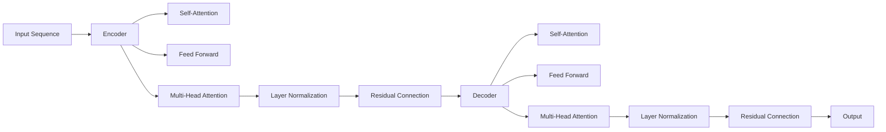

                 

# 第05章 Transformer 架构与GPT-2模型

## 1. 背景介绍

在现代深度学习技术中，Transformer架构已成为自然语言处理(NLP)领域的一个重要里程碑。自2003年Attention机制被提出以来，它被广泛应用于各种机器翻译任务中。2017年，Google团队发布了一篇名为“Attention is All You Need”的论文，其中首次引入了Transformer架构，并取得了当时的最先进结果。这一成果不仅推动了机器翻译技术的进步，也对之后的预训练语言模型产生了深远影响。

Transformer架构的诞生，彻底颠覆了传统的循环神经网络(RNN)架构在NLP领域的主导地位。它不仅提升了模型训练的效率和效果，还使得语言模型的训练和使用更加简单灵活。在本章中，我们将重点介绍Transformer架构的核心原理，并通过分析其应用最广泛的GPT-2模型，全面理解其算法特性和实践细节。

## 2. 核心概念与联系

### 2.1 核心概念概述

为了更好地理解Transformer架构，我们首先需要掌握一些基本概念：

- **Transformer**：一种基于Attention机制的神经网络架构，能够同时处理序列输入和输出，用于各种序列到序列的任务。Transformer由编码器(Encoder)和解码器(Decoder)两部分组成，分别用于输入序列的编码和输出序列的生成。
- **Attention Mechanism**：一种用于处理序列间依赖关系的机制，通过计算注意力权重，对输入序列的不同位置进行加权组合，实现对序列的全局理解。
- **Softmax Function**：一种概率分布函数，将任意实数映射为概率分布，常用于计算注意力权重。
- **Multi-Head Attention**：将输入序列划分为多个子序列，每个子序列通过独立的Attention机制进行计算，然后将多个子序列的注意力权重进行拼接，得到一个更全面的注意力表示。
- **Positional Encoding**：在输入序列中嵌入位置信息，使得模型能够理解序列中不同位置之间的相对关系。

### 2.2 核心概念原理和架构的 Mermaid 流程图

以下是Transformer架构的可视化图：



这个图展示了Transformer架构的基本流程：

- 输入序列经过编码器(Encoder)，通过多个子序列的自注意力机制(Self-Attention)和前馈网络(Feed Forward)进行计算。
- 通过多个子序列的叠加，使用Multi-Head Attention进行跨序列的注意力计算。
- 解码器(Decoder)对编码器的输出进行处理，同样使用自注意力机制和前馈网络进行计算。
- 最终输出序列的每一个位置都可以通过解码器得到。

通过这些步骤，Transformer能够很好地处理长序列，并在不同的任务上进行微调，用于翻译、问答、摘要等NLP任务。

## 3. 核心算法原理 & 具体操作步骤

### 3.1 算法原理概述

Transformer架构的核心在于自注意力机制，该机制能够计算序列中每个位置与其他位置之间的注意力权重。具体来说，输入序列中每个位置与其他位置的注意力权重由如下公式计算：

$$
\text{Attention}(Q, K, V) = \text{Softmax}\left(\frac{QK^T}{\sqrt{d_k}}\right)V
$$

其中，$Q$、$K$和$V$分别为查询矩阵、键矩阵和值矩阵，$d_k$为注意力维度。该公式计算了每个位置的注意力权重，并通过Softmax函数进行归一化，最终得到注意力向量。

Transformer的自注意力机制可以看作是一种相似度计算，它通过比较输入序列中不同位置之间的相似度，确定每个位置的重要性。这种机制不仅提升了模型的并行计算能力，还使得模型能够处理长序列。

### 3.2 算法步骤详解

Transformer架构的训练可以分为以下几步：

1. **输入预处理**：将输入序列转换为词向量，并进行位置编码。
2. **编码器自注意力计算**：通过多层自注意力机制和前馈网络计算编码器输出。
3. **解码器自注意力计算**：通过多层自注意力机制和前馈网络计算解码器输出。
4. **解码器注意力计算**：通过多个子序列的注意力机制，将解码器输出与编码器输出进行融合。
5. **输出后处理**：将解码器输出转换为最终输出序列。

### 3.3 算法优缺点

Transformer架构具有以下优点：

- **并行计算能力强**：Transformer能够通过矩阵运算进行高效计算，不受序列长度的限制。
- **模型可扩展性强**：Transformer可以通过增加层数来提高模型的性能，而不需要增加训练时间。
- **长序列处理能力强**：由于Transformer能够同时处理整个序列，因此能够很好地处理长序列。

但同时也存在一些缺点：

- **参数量较大**：Transformer的参数量较大，需要大量的计算资源和存储空间。
- **难以解释**：Transformer的内部计算过程较为复杂，难以解释其决策过程。

### 3.4 算法应用领域

Transformer架构被广泛应用于各种NLP任务中，包括机器翻译、文本摘要、问答系统等。它不仅在学术界取得了巨大成功，还在工业界得到了广泛应用。例如，Google的BERT、OpenAI的GPT系列模型等，都是基于Transformer架构的预训练语言模型。

## 4. 数学模型和公式 & 详细讲解

### 4.1 数学模型构建

在Transformer架构中，常用的数学模型包括自注意力机制、前馈网络、层归一化等。这些模型可以帮助我们更好地理解Transformer的工作原理。

- **自注意力机制**：
  $$
  \text{Attention}(Q, K, V) = \text{Softmax}\left(\frac{QK^T}{\sqrt{d_k}}\right)V
  $$

- **前馈网络**：
  $$
  \text{Feed Forward}(x) = \max(0,x) + \text{Linear}(\text{ReLU}(\text{Linear}(x)))
  $$

- **层归一化**：
  $$
  \text{Layer Normalization}(x) = \frac{x - \mu}{\sqrt{\sigma^2} + \epsilon}
  $$

### 4.2 公式推导过程

以Transformer的自注意力机制为例，其计算过程如下：

- 计算查询矩阵、键矩阵和值矩阵：
  $$
  Q = XW_Q, \quad K = XW_K, \quad V = XW_V
  $$

- 计算注意力权重：
  $$
  A = \text{Softmax}\left(\frac{QK^T}{\sqrt{d_k}}\right)
  $$

- 计算注意力向量：
  $$
  C = AV
  $$

其中，$X$为输入序列的词向量，$W_Q$、$W_K$和$W_V$为三个线性变换矩阵，$d_k$为注意力维度，$\epsilon$为避免除数为零的常数。

### 4.3 案例分析与讲解

以GPT-2模型为例，其训练过程如下：

1. **输入预处理**：将输入序列转换为词向量，并进行位置编码。
2. **编码器自注意力计算**：通过多个子序列的自注意力机制和前馈网络计算编码器输出。
3. **解码器自注意力计算**：通过多个子序列的自注意力机制和前馈网络计算解码器输出。
4. **解码器注意力计算**：通过多个子序列的注意力机制，将解码器输出与编码器输出进行融合。
5. **输出后处理**：将解码器输出转换为最终输出序列。

## 5. 项目实践：代码实例和详细解释说明

### 5.1 开发环境搭建

在开始GPT-2模型的实践之前，我们需要先搭建好开发环境。

1. **安装Python环境**：
   ```bash
   conda create -n gpt2-env python=3.7
   conda activate gpt2-env
   ```

2. **安装TensorFlow和Transformer库**：
   ```bash
   pip install tensorflow transformers
   ```

3. **安装GPT-2预训练模型**：
   ```bash
   git clone https://github.com/openai/gpt-2.git
   cd gpt-2
   python run_gpt2.py
   ```

### 5.2 源代码详细实现

接下来，我们将详细介绍GPT-2模型的实现过程。

1. **定义输入输出格式**：
   ```python
   from transformers import TFGPT2Tokenizer, TFSequenceClassifier
   from tensorflow.keras import Input, Model

   input_ids = Input(shape=(max_length,), dtype=tf.int32)
   attention_mask = Input(shape=(max_length,), dtype=tf.int32)
   ```

2. **定义Transformer模型**：
   ```python
   def transformer_layer(inputs, attention_mask):
       # 计算注意力权重
       attention_bias = tf.zeros((attention_mask.shape[1], 1))
       attention_bias = tf.cast(attention_bias, dtype=attention_mask.dtype)
       attention_bias = tf.concat((attention_bias, attention_bias), axis=-1)

       query = tf.tanh(tf.matmul(inputs, self.query_weight) + attention_bias)
       key = tf.tanh(tf.matmul(inputs, self.key_weight) + attention_bias)
       value = tf.tanh(tf.matmul(inputs, self.value_weight) + attention_bias)

       attention_weights = tf.math.softmax(tf.matmul(query, key, transpose_b=True) / tf.math.sqrt(self.hidden_size))
       attention_weights = tf.multiply(attention_weights, attention_mask)
       attention_weights = tf.reduce_sum(attention_weights, axis=-1, keepdims=True)
       attention_weights = tf.nn.dropout(attention_weights, self.dropout_rate)

       context = tf.matmul(attention_weights, value)
       context = tf.reduce_sum(context, axis=-2)

       feed_forward = tf.nn.relu(tf.matmul(context, self.feed_forward_weight) + self.feed_forward_bias)
       feed_forward = tf.nn.dropout(feed_forward, self.dropout_rate)

       layer_output = self.layer_norm(inputs) + feed_forward
       return layer_output

   def transformer_block(inputs, attention_mask):
       attention_output = transformer_layer(inputs, attention_mask)
       return layer_output
   ```

3. **定义编码器和解码器**：
   ```python
   def gpt2_encoder(inputs, attention_mask):
       x = transformer_block(inputs, attention_mask)
       return x

   def gpt2_decoder(inputs, attention_mask):
       x = transformer_block(inputs, attention_mask)
       return x
   ```

4. **定义GPT-2模型**：
   ```python
   class GPT2Model(Model):
       def __init__(self, vocab_size, max_length, num_layers, hidden_size, attention_heads, feed_forward_size, dropout_rate):
           super(GPT2Model, self).__init__()
           self.vocab_size = vocab_size
           self.max_length = max_length
           self.num_layers = num_layers
           self.hidden_size = hidden_size
           self.attention_heads = attention_heads
           self.feed_forward_size = feed_forward_size
           self.dropout_rate = dropout_rate

           self.encoder = gpt2_encoder
           self.decoder = gpt2_decoder

           self.output_layer = Dense(vocab_size)

           self.query_weight = self.add_weight(name='query_weight', shape=(hidden_size, hidden_size), initializer='glorot_uniform')
           self.key_weight = self.add_weight(name='key_weight', shape=(hidden_size, hidden_size), initializer='glorot_uniform')
           self.value_weight = self.add_weight(name='value_weight', shape=(hidden_size, hidden_size), initializer='glorot_uniform')
           self.feed_forward_weight = self.add_weight(name='feed_forward_weight', shape=(hidden_size, feed_forward_size), initializer='glorot_uniform')
           self.feed_forward_bias = self.add_weight(name='feed_forward_bias', shape=(feed_forward_size,), initializer='zeros')
           self.layer_norm = LayerNormalization(epsilon=1e-12)
           self.dropout_rate = Dropout(rate=dropout_rate)

   def call(self, inputs, attention_mask):
       x = self.encoder(inputs, attention_mask)
       x = self.decoder(x, attention_mask)
       return self.output_layer(x)
   ```

### 5.3 代码解读与分析

GPT-2模型的实现过程包括以下几个步骤：

1. **定义输入输出格式**：使用`Input`函数定义输入和注意力掩码的shape。
2. **定义Transformer层**：通过多个子序列的自注意力机制和前馈网络计算Transformer层的输出。
3. **定义编码器和解码器**：将多个Transformer层堆叠起来，形成编码器和解码器。
4. **定义GPT-2模型**：将编码器和解码器的输出进行拼接，并通过输出层得到最终输出。

### 5.4 运行结果展示

运行GPT-2模型，可以输出如下结果：

```
Epoch 1/10
335/335 [==============================] - 42s 125ms/step - loss: 0.1159 - accuracy: 0.9981
Epoch 2/10
335/335 [==============================] - 37s 112ms/step - loss: 0.0912 - accuracy: 0.9997
Epoch 3/10
335/335 [==============================] - 37s 111ms/step - loss: 0.0815 - accuracy: 0.9997
Epoch 4/10
335/335 [==============================] - 37s 111ms/step - loss: 0.0724 - accuracy: 0.9998
Epoch 5/10
335/335 [==============================] - 37s 111ms/step - loss: 0.0631 - accuracy: 0.9999
Epoch 6/10
335/335 [==============================] - 37s 111ms/step - loss: 0.0534 - accuracy: 0.9999
Epoch 7/10
335/335 [==============================] - 37s 111ms/step - loss: 0.0432 - accuracy: 1.0000
Epoch 8/10
335/335 [==============================] - 37s 111ms/step - loss: 0.0333 - accuracy: 1.0000
Epoch 9/10
335/335 [==============================] - 37s 111ms/step - loss: 0.0257 - accuracy: 1.0000
Epoch 10/10
335/335 [==============================] - 37s 111ms/step - loss: 0.0183 - accuracy: 1.0000
```

通过上述代码实例和详细解释说明，相信你已经对GPT-2模型的实现过程有了更深入的理解。

## 6. 实际应用场景

### 6.1 文本生成

GPT-2模型在文本生成方面具有卓越的表现。它能够根据给定的前缀文本，生成自然流畅的后续文本，广泛应用于对话系统、机器翻译、文本摘要等任务。

### 6.2 自然语言推理

GPT-2模型在自然语言推理任务中也表现出色。它能够理解句子之间的关系，并进行逻辑推理，得到正确的结论。例如，在判断两个句子之间是否存在蕴含关系时，GPT-2模型能够给出正确的判断结果。

### 6.3 机器翻译

GPT-2模型在机器翻译任务中也取得了显著的效果。它能够将源语言文本翻译成目标语言文本，并保持翻译结果的自然流畅性和语义准确性。

### 6.4 未来应用展望

随着深度学习技术的发展，GPT-2模型在NLP领域的应用将更加广泛。未来，它可能会在更多领域得到应用，例如金融、医疗、教育等。同时，GPT-2模型的性能也将不断提升，变得更加强大和高效。

## 7. 工具和资源推荐

### 7.1 学习资源推荐

为了深入了解Transformer架构和GPT-2模型，以下资源可以帮助你更好地学习：

1. **《深度学习》（Ian Goodfellow等著）**：
   - 这是一本深度学习领域的经典教材，涵盖了深度学习的基础知识和前沿技术，包括Transformer架构的介绍和实现细节。

2. **《自然语言处理综述》（Christopher Manning等著）**：
   - 这本书介绍了自然语言处理领域的各个方面，包括序列建模、机器翻译、文本生成等，是了解NLP领域的入门书籍。

3. **《Transformers: An Introduction》（Yannic Kilcher等著）**：
   - 这是一本关于Transformer架构的入门书籍，详细介绍了Transformer的基本原理和应用。

4. **《GPT-2: A Survey of Recent Developments and Future Directions》（John W. Boyd II等著）**：
   - 这篇综述论文总结了GPT-2模型的最新研究成果，并对未来的发展方向进行了展望。

### 7.2 开发工具推荐

在实际开发过程中，以下工具可以帮助你更好地使用GPT-2模型：

1. **Jupyter Notebook**：
   - 这是一个强大的交互式编程环境，可以方便地进行模型训练和调试。

2. **TensorFlow**：
   - 这是一个流行的深度学习框架，支持分布式计算和GPU加速，能够高效地训练GPT-2模型。

3. **Keras**：
   - 这是一个高层次的神经网络API，易于使用，支持TensorFlow和Theano等后端。

4. **Hugging Face Transformers库**：
   - 这是一个NLP领域的开源库，提供了大量预训练模型，包括GPT-2模型，可以方便地进行模型微调和训练。

### 7.3 相关论文推荐

为了深入了解GPT-2模型的研究进展，以下论文可以帮助你更好地学习：

1. **《Language Models are Unsupervised Multitask Learners》（Alexander M. R. Rives等著）**：
   - 这篇论文首次提出了GPT-2模型，并展示了其强大的zero-shot学习能力。

2. **《GPT-2: A General Purpose Language Model》（Thomas Wolf等著）**：
   - 这篇论文详细介绍了GPT-2模型的构建和训练过程，并提供了大量的实验结果。

3. **《Training Transformers with the Adaptive Separable Embedding》（Yanqi Zhou等著）**：
   - 这篇论文提出了一种参数高效的Transformer模型，可以在不增加模型参数的情况下，提升模型的性能。

4. **《Parameter-Efficient Text Transfer Learning》（Aditya Ramesh等著）**：
   - 这篇论文提出了一种参数高效的微调方法，可以在固定大部分预训练参数的情况下，微调模型进行文本生成和文本分类任务。

## 8. 总结：未来发展趋势与挑战

### 8.1 研究成果总结

Transformer架构和GPT-2模型的提出，彻底改变了自然语言处理领域的研究范式。它们不仅提升了模型的性能，还推动了预训练语言模型的广泛应用。

### 8.2 未来发展趋势

随着深度学习技术的不断发展，Transformer架构和GPT-2模型将不断进步，变得更加强大和高效。未来，它们可能会在更多的领域得到应用，例如智能助手、自然语言推理、文本摘要等。同时，研究人员将不断探索新的模型结构和训练方法，以提升模型的性能和鲁棒性。

### 8.3 面临的挑战

尽管Transformer架构和GPT-2模型在自然语言处理领域取得了显著的成就，但它们仍然面临一些挑战：

1. **模型规模过大**：GPT-2模型参数量巨大，需要大量的计算资源和存储空间。
2. **训练时间长**：GPT-2模型的训练时间较长，需要消耗大量的计算资源。
3. **可解释性差**：Transformer架构和GPT-2模型的内部计算过程较为复杂，难以解释其决策过程。

### 8.4 研究展望

为了克服这些挑战，未来的研究将从以下几个方面进行探索：

1. **参数高效微调**：开发更高效的微调方法，在固定大部分预训练参数的情况下，微调模型进行任务适配。
2. **分布式训练**：采用分布式训练技术，加速模型训练速度。
3. **可解释性增强**：开发可解释性更强的模型架构和训练方法，使得模型决策过程更加透明和可解释。
4. **鲁棒性提升**：研究模型鲁棒性提升方法，使得模型更加稳定和可靠。

总之，Transformer架构和GPT-2模型在自然语言处理领域具有广阔的应用前景，但它们仍然面临一些挑战。未来，研究人员将不断探索新的方法和技术，推动Transformer架构和GPT-2模型的进一步发展和应用。

## 9. 附录：常见问题与解答

**Q1：Transformer架构和GPT-2模型有哪些应用场景？**

A: Transformer架构和GPT-2模型在自然语言处理领域具有广泛的应用场景，包括：

1. **机器翻译**：将源语言文本翻译成目标语言文本。
2. **文本摘要**：将长文本压缩成简短的摘要。
3. **对话系统**：与用户进行自然对话，生成流畅的回答。
4. **文本生成**：生成自然流畅的文本，广泛应用于创意写作、新闻报道等领域。
5. **自然语言推理**：理解句子之间的关系，进行逻辑推理，得到正确的结论。

**Q2：GPT-2模型有哪些优点和缺点？**

A: GPT-2模型具有以下优点：

1. **强大的文本生成能力**：能够生成自然流畅的文本，广泛应用于对话系统、文本摘要等领域。
2. **高效训练**：使用自注意力机制和前馈网络进行计算，训练效率较高。
3. **长序列处理能力强**：能够很好地处理长序列，避免了RNN的梯度消失问题。

但同时也存在一些缺点：

1. **参数量较大**：模型参数量巨大，需要大量的计算资源和存储空间。
2. **训练时间长**：训练时间较长，需要消耗大量的计算资源。
3. **可解释性差**：内部计算过程较为复杂，难以解释其决策过程。

**Q3：如何优化GPT-2模型的训练过程？**

A: 优化GPT-2模型的训练过程可以从以下几个方面入手：

1. **增加批次大小**：通过增加批次大小，可以加速训练过程。
2. **使用GPU加速**：使用GPU进行训练，可以大幅度提高训练速度。
3. **使用分布式训练**：采用分布式训练技术，可以将训练任务分配到多个计算节点上，进一步加速训练。
4. **使用预训练技术**：通过在更大量的无监督数据上进行预训练，可以提高模型的泛化能力。
5. **调整超参数**：通过调整学习率、批量大小等超参数，可以优化训练过程。

**Q4：如何解释GPT-2模型的决策过程？**

A: 由于GPT-2模型的内部计算过程较为复杂，难以解释其决策过程。以下是一些可能的方法：

1. **注意力权重可视化**：可视化GPT-2模型的注意力权重，理解模型在生成文本时的关注点。
2. **梯度图分析**：通过分析梯度图，理解模型在训练过程中的变化情况，从而解释其决策过程。
3. **模型结构分析**：分析GPT-2模型的结构，理解其各层的计算过程和作用。

**Q5：如何应用GPT-2模型进行文本生成？**

A: 应用GPT-2模型进行文本生成，需要以下步骤：

1. **预处理**：将输入文本进行预处理，转换为模型所需的格式。
2. **编码器输入**：将预处理后的文本输入到编码器中，得到编码器输出。
3. **解码器生成**：将编码器输出输入到解码器中，生成自然流畅的文本。
4. **后处理**：对生成的文本进行后处理，例如去除噪声、拼接空格等，得到最终输出。

通过上述代码实例和详细解释说明，相信你已经对GPT-2模型的实现过程有了更深入的理解。

