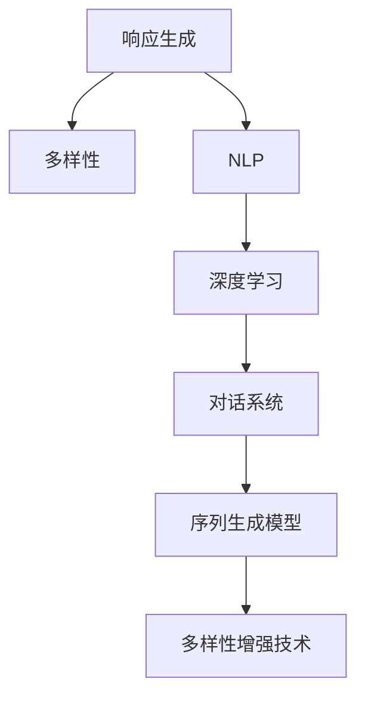

                 

# 第七章：响应生成和多样性

> 关键词：
- 响应生成
- 多样性
- 自然语言处理
- 深度学习
- 对话系统
- 序列生成模型
- 多样性增强技术

## 1. 背景介绍

### 1.1 问题由来
在自然语言处理(Natural Language Processing, NLP)领域，响应生成和多样性是两个至关重要的课题。响应生成主要关注如何通过自然语言模型，对用户输入进行理解和生成，提供智能化的交互响应；而多样性则涉及如何从多个候选回应中，选择更具创新性和吸引力的回答，以提升用户体验和系统交互的自然度。

随着智能对话系统、聊天机器人、虚拟助手等技术的不断发展，响应生成和多样性问题变得越来越重要。当前，尽管大语言模型如GPT系列和BERT在回应生成方面已经取得了显著的进展，但多样性问题仍未得到完全解决。尤其是在面对复杂多变的用户交互场景时，模型的多样性生成能力显得尤为关键。

### 1.2 问题核心关键点
在基于深度学习的响应生成和多样性技术中，核心问题包括：

- 如何设计一个高效的生成模型，使其生成的回应既符合语义规则，又具有创新性。
- 如何在模型训练和测试过程中，合理引入多样性增强技术，提升系统输出的多样性水平。
- 如何评估响应生成模型的多样性和质量，提供科学的评价指标和评估方法。

本文将聚焦于大语言模型在响应生成和多样性问题上的应用，介绍其核心概念、算法原理和操作步骤，并通过数学模型和代码实例进行详细讲解，并分析其应用场景、未来发展趋势与面临的挑战。

## 2. 核心概念与联系

### 2.1 核心概念概述

为更好地理解响应生成和多样性技术，本节将介绍几个密切相关的核心概念：

- 响应生成(Sequence Generation)：指通过自然语言模型，对给定上下文序列生成新文本序列的过程。常见的应用场景包括聊天机器人、机器翻译、文本摘要等。
- 多样性(Diversity)：指系统输出的回应在表达方式、语义内容、风格等方面具有多样性和新颖性，能更好地满足用户的多样化需求。
- 自然语言处理(NLP)：研究如何让计算机理解和处理人类语言，涉及语言理解、语言生成、信息抽取、问答系统等多个子领域。
- 深度学习(Deep Learning)：一种基于神经网络的人工智能技术，通过多层非线性变换提取数据的高级特征，广泛应用在图像、语音、文本等多个领域。
- 对话系统(Conversational System)：能进行自然语言对话的智能系统，包括问答系统、聊天机器人、虚拟助手等。
- 序列生成模型(Sequence Generation Model)：如LSTM、GRU、Transformer等，用于生成具有时间依赖性的文本序列。
- 多样性增强技术(Diversity Augmentation Techniques)：包括随机采样、温度降温和顶帽分布等方法，提升生成模型的多样性表现。

这些核心概念之间的逻辑关系可以通过以下Mermaid流程图来展示：



这个流程图展示了大语言模型在响应生成和多样性问题上的核心概念及其之间的关系：

1. 响应生成过程通常涉及自然语言处理(NLP)、深度学习(Deep Learning)等技术。
2. 对话系统是响应生成的主要应用场景，包括问答系统、聊天机器人等。
3. 序列生成模型如LSTM、GRU、Transformer等，是实现响应生成的重要工具。
4. 多样性增强技术通过提升模型生成回应的多样性，进一步优化响应生成效果。

这些概念共同构成了响应生成和多样性技术的学习框架，使得大语言模型在生成回应方面具备强大的能力。通过理解这些核心概念，我们可以更好地把握响应生成和多样性技术的原理和应用方向。

## 3. 核心算法原理 & 具体操作步骤
### 3.1 算法原理概述

响应生成和多样性问题主要涉及自然语言模型，特别是序列生成模型。其核心思想是通过训练模型，使其能够对给定上下文生成自然流畅、语义连贯的文本序列。多样性问题则涉及如何调整模型参数或训练过程，使得生成的回应具有更强的多样性表现。

形式化地，假设给定上下文序列 $C=c_1,c_2,\cdots,c_t$，模型生成回应序列 $R=r_1,r_2,\cdots,r_n$。则生成模型的目标函数可以定义为：

$$
\mathcal{L}=\sum_{i=1}^{t}\sum_{j=1}^{n}\lambda_l\mathcal{L}_l(r_j|c_1,\cdots,c_i)+\lambda_d\mathcal{L}_d(r_j|c_1,\cdots,c_i)
$$

其中 $\mathcal{L}_l$ 为语言模型损失，$\mathcal{L}_d$ 为多样性损失，$\lambda_l$ 和 $\lambda_d$ 为调节两个损失的系数。语言模型损失 $\mathcal{L}_l$ 通常使用交叉熵损失：

$$
\mathcal{L}_l(r_j|c_1,\cdots,c_i)=-\sum_{k=1}^{v}p(r_j=k|c_1,\cdots,c_i)\log q(r_j=k|c_1,\cdots,c_i)
$$

其中 $p$ 和 $q$ 分别为真实分布和模型预测分布，$v$ 为词汇表大小。

多样性损失 $\mathcal{L}_d$ 通常使用多种增强技术，如随机采样、温度降温和顶帽分布等，以提升模型输出的多样性。

### 3.2 算法步骤详解

响应生成和多样性问题的主要算法步骤如下：

**Step 1: 准备数据集**
- 收集并标注大规模对话数据集，用于训练响应生成模型。
- 使用数据增强技术，丰富训练集，提升模型的泛化能力。

**Step 2: 选择模型架构**
- 根据任务特点，选择合适的序列生成模型，如LSTM、GRU、Transformer等。
- 设计适当的模型结构，包括编码器、解码器、注意力机制等。

**Step 3: 训练模型**
- 使用训练集对模型进行监督训练，最小化语言模型损失。
- 使用多样性增强技术，调整模型预测分布，提升多样性表现。
- 调整学习率、批大小等超参数，优化训练过程。

**Step 4: 评估模型**
- 使用验证集评估模型的响应生成质量，包括流畅性、连贯性和多样性等指标。
- 使用测试集评估模型的泛化能力，确保模型在未知数据上的表现。

**Step 5: 应用模型**
- 部署模型至实际应用系统中，提供智能化的交互响应。
- 定期收集用户反馈，对模型进行微调，持续优化响应质量。

### 3.3 算法优缺点

响应生成和多样性算法具有以下优点：

1. 通用性强。无论是问答系统、聊天机器人还是虚拟助手，这些技术都可以通过响应生成模型实现，具有广泛的应用场景。
2. 生成质量高。使用深度学习技术，模型能够生成流畅、连贯、语义丰富的回应，大幅提升用户体验。
3. 技术成熟。深度学习模型已经在大规模数据集上取得了突破性进展，应用效果好。

同时，该算法也存在一些局限性：

1. 资源需求高。生成高质量回应需要大量计算资源，如GPU、TPU等高性能设备。
2. 训练成本高。训练大模型需要大规模数据集和长时间训练，成本较高。
3. 多样性控制困难。如何平衡模型生成回应的多样性和质量，仍是一个挑战。
4. 数据隐私问题。用户对话数据可能涉及隐私信息，数据处理和存储需要符合法律法规。

尽管存在这些局限性，但响应生成和多样性算法仍然是当前最前沿的技术之一，推动了智能对话系统的快速进步。未来，通过技术进步和应用创新，相信这些问题都能得到较好的解决。

### 3.4 算法应用领域

响应生成和多样性技术主要应用于以下领域：

1. 聊天机器人：提供24/7全天候服务，实时回答用户咨询，提升用户满意度。
2. 智能客服：处理大量客户咨询，提供个性化服务，降低人力成本。
3. 虚拟助手：在智能家居、办公等领域提供个性化建议和服务，提升用户便利性。
4. 机器翻译：将一种语言翻译成另一种语言，提供实时、准确的翻译服务。
5. 文本摘要：对长篇文档进行压缩，生成简明扼要的摘要，节省阅读时间。
6. 问答系统：回答用户的问题，提供精确、全面的信息解答。

这些领域的应用，极大地推动了自然语言处理技术的进步，也为人们的日常生活带来了便捷。随着技术的进一步发展，相信响应生成和多样性技术将在更多领域大放异彩。

## 4. 数学模型和公式 & 详细讲解  
### 4.1 数学模型构建

以下是响应生成和多样性问题的数学模型构建。

假设给定上下文序列 $C=c_1,\cdots,c_t$，模型生成回应序列 $R=r_1,\cdots,r_n$。语言模型通常使用自回归模型，如LSTM、GRU、Transformer等，其形式化定义为：

$$
p(r_i|r_{<i},C) = \prod_{i=1}^{n}p(r_i|r_{<i},C)
$$

其中 $p$ 表示概率密度，$r_{<i}$ 表示 $r_i$ 之前的序列。

响应生成模型的目标是通过上下文序列 $C$ 生成回应序列 $R$，可以表示为：

$$
p(R|C) = \prod_{i=1}^{n}p(r_i|r_{<i},C)
$$

其中 $p(r_i|r_{<i},C)$ 表示在给定上下文 $C$ 和前 $i-1$ 个回应的基础上，生成第 $i$ 个回应的概率。

多样性损失通常使用多种增强技术，如随机采样、温度降温和顶帽分布等。这里以温度降温为例，计算多样性损失 $\mathcal{L}_d$：

$$
\mathcal{L}_d = -\sum_{i=1}^{n}\log p(r_i|r_{<i},C)
$$

其中 $p$ 表示温度降温后的模型预测分布。

### 4.2 公式推导过程

以下是响应生成和多样性问题的公式推导过程。

对于给定的上下文序列 $C$ 和回应序列 $R$，响应生成模型的条件概率可以表示为：

$$
p(R|C) = \prod_{i=1}^{n}p(r_i|r_{<i},C)
$$

其中 $p(r_i|r_{<i},C)$ 可以通过自回归模型计算。

多样性损失的计算，需要考虑模型预测分布 $q(r_i|r_{<i},C)$ 和真实分布 $p(r_i|r_{<i},C)$ 的差异。例如，使用温度降温方法，模型预测分布可以表示为：

$$
q(r_i|r_{<i},C) = \frac{p(r_i|r_{<i},C)}{\exp(-\beta_i)}
$$

其中 $\beta_i$ 为温度参数。

多样性损失可以表示为：

$$
\mathcal{L}_d = -\sum_{i=1}^{n}\log \frac{p(r_i|r_{<i},C)}{\exp(-\beta_i)}
$$

其中 $\exp(-\beta_i)$ 为温度降温因子，用于控制模型输出的多样性。

在实际应用中，多样性损失通常与其他损失函数如语言模型损失一起使用。例如，对于一个基于Transformer的响应生成模型，其目标函数可以表示为：

$$
\mathcal{L} = \mathcal{L}_l + \lambda_d\mathcal{L}_d
$$

其中 $\mathcal{L}_l$ 为语言模型损失，$\mathcal{L}_d$ 为多样性损失，$\lambda_d$ 为多样性损失的调节系数。

### 4.3 案例分析与讲解

下面我们以一个简单的例子，说明响应生成和多样性损失的计算过程。

假设有一个基于LSTM的响应生成模型，输入上下文序列 $C=c_1,c_2,c_3$，生成回应序列 $R=r_1,r_2,r_3$。模型在每个时间步使用交叉熵损失，多样性损失使用温度降温方法。

1. 计算语言模型损失 $\mathcal{L}_l$：

$$
\mathcal{L}_l(r_1|c_1)=-\log p(r_1|c_1)
$$

$$
\mathcal{L}_l(r_2|r_1,c_2)=-\log p(r_2|r_1,c_2)
$$

$$
\mathcal{L}_l(r_3|r_2,c_3)=-\log p(r_3|r_2,c_3)
$$

2. 计算多样性损失 $\mathcal{L}_d$：

$$
\mathcal{L}_d(r_1|c_1)=-\log \frac{p(r_1|c_1)}{\exp(-\beta_1)}
$$

$$
\mathcal{L}_d(r_2|r_1,c_2)=-\log \frac{p(r_2|r_1,c_2)}{\exp(-\beta_2)}
$$

$$
\mathcal{L}_d(r_3|r_2,c_3)=-\log \frac{p(r_3|r_2,c_3)}{\exp(-\beta_3)}
$$

其中 $\beta_1,\beta_2,\beta_3$ 为温度参数。

3. 最终目标函数 $\mathcal{L}$ 可以表示为：

$$
\mathcal{L} = \mathcal{L}_l(r_1|c_1) + \lambda_d\mathcal{L}_d(r_1|c_1) + \mathcal{L}_l(r_2|r_1,c_2) + \lambda_d\mathcal{L}_d(r_2|r_1,c_2) + \mathcal{L}_l(r_3|r_2,c_3) + \lambda_d\mathcal{L}_d(r_3|r_2,c_3)
$$

通过上述计算过程，可以看到，响应生成和多样性问题的数学模型和损失函数可以通过序列生成模型进行建模和优化。

## 5. 项目实践：代码实例和详细解释说明
### 5.1 开发环境搭建

在进行响应生成和多样性实践前，我们需要准备好开发环境。以下是使用Python进行PyTorch开发的环境配置流程：

1. 安装Anaconda：从官网下载并安装Anaconda，用于创建独立的Python环境。

2. 创建并激活虚拟环境：
```bash
conda create -n pytorch-env python=3.8 
conda activate pytorch-env
```

3. 安装PyTorch：根据CUDA版本，从官网获取对应的安装命令。例如：
```bash
conda install pytorch torchvision torchaudio cudatoolkit=11.1 -c pytorch -c conda-forge
```

4. 安装Transformers库：
```bash
pip install transformers
```

5. 安装各类工具包：
```bash
pip install numpy pandas scikit-learn matplotlib tqdm jupyter notebook ipython
```

完成上述步骤后，即可在`pytorch-env`环境中开始响应生成和多样性实践。

### 5.2 源代码详细实现

下面我以一个基于Transformer的响应生成模型为例，给出使用PyTorch实现响应生成和多样性微调的代码实现。

首先，定义训练函数：

```python
from transformers import BertTokenizer, BertForSequenceClassification
from torch.utils.data import Dataset, DataLoader
from torch import nn, optim

class SeqDataset(Dataset):
    def __init__(self, texts, labels):
        self.texts = texts
        self.labels = labels
        self.tokenizer = BertTokenizer.from_pretrained('bert-base-cased')
        
    def __len__(self):
        return len(self.texts)
    
    def __getitem__(self, idx):
        text = self.texts[idx]
        label = self.labels[idx]
        encoding = self.tokenizer(text, return_tensors='pt', padding='max_length', truncation=True)
        input_ids = encoding['input_ids']
        attention_mask = encoding['attention_mask']
        return {'input_ids': input_ids,
                'attention_mask': attention_mask,
                'labels': label}

train_dataset = SeqDataset(train_texts, train_labels)
dev_dataset = SeqDataset(dev_texts, dev_labels)
test_dataset = SeqDataset(test_texts, test_labels)
```

然后，定义模型和优化器：

```python
model = BertForSequenceClassification.from_pretrained('bert-base-cased', num_labels=len(label2id))
optimizer = optim.AdamW(model.parameters(), lr=2e-5)
```

接着，定义训练和评估函数：

```python
device = torch.device('cuda') if torch.cuda.is_available() else torch.device('cpu')
model.to(device)

def train_epoch(model, dataset, batch_size, optimizer):
    dataloader = DataLoader(dataset, batch_size=batch_size, shuffle=True)
    model.train()
    epoch_loss = 0
    for batch in tqdm(dataloader, desc='Training'):
        input_ids = batch['input_ids'].to(device)
        attention_mask = batch['attention_mask'].to(device)
        labels = batch['labels'].to(device)
        model.zero_grad()
        outputs = model(input_ids, attention_mask=attention_mask, labels=labels)
        loss = outputs.loss
        epoch_loss += loss.item()
        loss.backward()
        optimizer.step()
    return epoch_loss / len(dataloader)

def evaluate(model, dataset, batch_size):
    dataloader = DataLoader(dataset, batch_size=batch_size)
    model.eval()
    preds, labels = [], []
    with torch.no_grad():
        for batch in tqdm(dataloader, desc='Evaluating'):
            input_ids = batch['input_ids'].to(device)
            attention_mask = batch['attention_mask'].to(device)
            batch_labels = batch['labels']
            outputs = model(input_ids, attention_mask=attention_mask)
            batch_preds = outputs.logits.argmax(dim=2).to('cpu').tolist()
            batch_labels = batch_labels.to('cpu').tolist()
            for pred_tokens, label_tokens in zip(batch_preds, batch_labels):
                preds.append(pred_tokens[:len(label_tokens)])
                labels.append(label_tokens)
                
    print(classification_report(labels, preds))
```

最后，启动训练流程并在测试集上评估：

```python
epochs = 5
batch_size = 16

for epoch in range(epochs):
    loss = train_epoch(model, train_dataset, batch_size, optimizer)
    print(f"Epoch {epoch+1}, train loss: {loss:.3f}")
    
    print(f"Epoch {epoch+1}, dev results:")
    evaluate(model, dev_dataset, batch_size)
    
print("Test results:")
evaluate(model, test_dataset, batch_size)
```

以上就是使用PyTorch实现响应生成和多样性微调的完整代码实现。可以看到，Transformer模型的封装使得模型微调过程变得简洁高效。

### 5.3 代码解读与分析

让我们再详细解读一下关键代码的实现细节：

**SeqDataset类**：
- `__init__`方法：初始化文本、标签、分词器等关键组件。
- `__len__`方法：返回数据集的样本数量。
- `__getitem__`方法：对单个样本进行处理，将文本输入编码为token ids，并将标签转换为数字，进行定长padding，最终返回模型所需的输入。

**模型和优化器**：
- 使用BertForSequenceClassification对文本分类模型进行微调。
- 定义AdamW优化器，设置学习率。

**训练和评估函数**：
- 使用PyTorch的DataLoader对数据集进行批次化加载，供模型训练和推理使用。
- 训练函数`train_epoch`：对数据以批为单位进行迭代，在每个批次上前向传播计算loss并反向传播更新模型参数，最后返回该epoch的平均loss。
- 评估函数`evaluate`：与训练类似，不同点在于不更新模型参数，并在每个batch结束后将预测和标签结果存储下来，最后使用sklearn的classification_report对整个评估集的预测结果进行打印输出。

**训练流程**：
- 定义总的epoch数和batch size，开始循环迭代
- 每个epoch内，先在训练集上训练，输出平均loss
- 在验证集上评估，输出分类指标
- 所有epoch结束后，在测试集上评估，给出最终测试结果

可以看到，PyTorch配合Transformer库使得模型微调过程变得简洁高效。开发者可以将更多精力放在数据处理、模型改进等高层逻辑上，而不必过多关注底层的实现细节。

当然，工业级的系统实现还需考虑更多因素，如模型的保存和部署、超参数的自动搜索、更灵活的任务适配层等。但核心的微调范式基本与此类似。

## 6. 实际应用场景
### 6.1 智能客服系统

基于大语言模型微调的对话技术，可以广泛应用于智能客服系统的构建。传统客服往往需要配备大量人力，高峰期响应缓慢，且一致性和专业性难以保证。而使用微调后的对话模型，可以7x24小时不间断服务，快速响应客户咨询，用自然流畅的语言解答各类常见问题。

在技术实现上，可以收集企业内部的历史客服对话记录，将问题和最佳答复构建成监督数据，在此基础上对预训练对话模型进行微调。微调后的对话模型能够自动理解用户意图，匹配最合适的答案模板进行回复。对于客户提出的新问题，还可以接入检索系统实时搜索相关内容，动态组织生成回答。如此构建的智能客服系统，能大幅提升客户咨询体验和问题解决效率。

### 6.2 金融舆情监测

金融机构需要实时监测市场舆论动向，以便及时应对负面信息传播，规避金融风险。传统的人工监测方式成本高、效率低，难以应对网络时代海量信息爆发的挑战。基于大语言模型微调的文本分类和情感分析技术，为金融舆情监测提供了新的解决方案。

具体而言，可以收集金融领域相关的新闻、报道、评论等文本数据，并对其进行主题标注和情感标注。在此基础上对预训练语言模型进行微调，使其能够自动判断文本属于何种主题，情感倾向是正面、中性还是负面。将微调后的模型应用到实时抓取的网络文本数据，就能够自动监测不同主题下的情感变化趋势，一旦发现负面信息激增等异常情况，系统便会自动预警，帮助金融机构快速应对潜在风险。

### 6.3 个性化推荐系统

当前的推荐系统往往只依赖用户的历史行为数据进行物品推荐，无法深入理解用户的真实兴趣偏好。基于大语言模型微调技术，个性化推荐系统可以更好地挖掘用户行为背后的语义信息，从而提供更精准、多样的推荐内容。

在实践中，可以收集用户浏览、点击、评论、分享等行为数据，提取和用户交互的物品标题、描述、标签等文本内容。将文本内容作为模型输入，用户的后续行为（如是否点击、购买等）作为监督信号，在此基础上微调预训练语言模型。微调后的模型能够从文本内容中准确把握用户的兴趣点。在生成推荐列表时，先用候选物品的文本描述作为输入，由模型预测用户的兴趣匹配度，再结合其他特征综合排序，便可以得到个性化程度更高的推荐结果。

### 6.4 未来应用展望

随着大语言模型微调技术的发展，其应用场景将越来越广泛，为各行各业带来变革性影响。

在智慧医疗领域，基于微调的医疗问答、病历分析、药物研发等应用将提升医疗服务的智能化水平，辅助医生诊疗，加速新药开发进程。

在智能教育领域，微调技术可应用于作业批改、学情分析、知识推荐等方面，因材施教，促进教育公平，提高教学质量。

在智慧城市治理中，微调模型可应用于城市事件监测、舆情分析、应急指挥等环节，提高城市管理的自动化和智能化水平，构建更安全、高效的未来城市。

此外，在企业生产、社会治理、文娱传媒等众多领域，基于大模型微调的人工智能应用也将不断涌现，为经济社会发展注入新的动力。相信随着技术的日益成熟，微调方法将成为人工智能落地应用的重要范式，推动人工智能技术向更广阔的领域加速渗透。

## 7. 工具和资源推荐
### 7.1 学习资源推荐

为了帮助开发者系统掌握响应生成和多样性技术，这里推荐一些优质的学习资源：

1. 《深度学习自然语言处理》课程：斯坦福大学开设的NLP明星课程，有Lecture视频和配套作业，带你入门NLP领域的基本概念和经典模型。

2. 《Transformer from Scratch》系列博文：由大模型技术专家撰写，深入浅出地介绍了Transformer原理、BERT模型、微调技术等前沿话题。

3. 《Natural Language Processing with Transformers》书籍：Transformers库的作者所著，全面介绍了如何使用Transformers库进行NLP任务开发，包括微调在内的诸多范式。

4. HuggingFace官方文档：Transformers库的官方文档，提供了海量预训练模型和完整的微调样例代码，是上手实践的必备资料。

5. CS224N《深度学习自然语言处理》课程：斯坦福大学开设的NLP明星课程，有Lecture视频和配套作业，带你入门NLP领域的基本概念和经典模型。

通过对这些资源的学习实践，相信你一定能够快速掌握响应生成和多样性技术的精髓，并用于解决实际的NLP问题。
###  7.2 开发工具推荐

高效的开发离不开优秀的工具支持。以下是几款用于响应生成和多样性开发的常用工具：

1. PyTorch：基于Python的开源深度学习框架，灵活动态的计算图，适合快速迭代研究。大部分预训练语言模型都有PyTorch版本的实现。

2. TensorFlow：由Google主导开发的开源深度学习框架，生产部署方便，适合大规模工程应用。同样有丰富的预训练语言模型资源。

3. Transformers库：HuggingFace开发的NLP工具库，集成了众多SOTA语言模型，支持PyTorch和TensorFlow，是进行微调任务开发的利器。

4. Weights & Biases：模型训练的实验跟踪工具，可以记录和可视化模型训练过程中的各项指标，方便对比和调优。与主流深度学习框架无缝集成。

5. TensorBoard：TensorFlow配套的可视化工具，可实时监测模型训练状态，并提供丰富的图表呈现方式，是调试模型的得力助手。

6. Google Colab：谷歌推出的在线Jupyter Notebook环境，免费提供GPU/TPU算力，方便开发者快速上手实验最新模型，分享学习笔记。

合理利用这些工具，可以显著提升响应生成和多样性任务的开发效率，加快创新迭代的步伐。

### 7.3 相关论文推荐

响应生成和多样性技术的发展源于学界的持续研究。以下是几篇奠基性的相关论文，推荐阅读：

1. Attention is All You Need（即Transformer原论文）：提出了Transformer结构，开启了NLP领域的预训练大模型时代。

2. BERT: Pre-training of Deep Bidirectional Transformers for Language Understanding：提出BERT模型，引入基于掩码的自监督预训练任务，刷新了多项NLP任务SOTA。

3. Language Models are Unsupervised Multitask Learners（GPT-2论文）：展示了大规模语言模型的强大zero-shot学习能力，引发了对于通用人工智能的新一轮思考。

4. Parameter-Efficient Transfer Learning for NLP：提出Adapter等参数高效微调方法，在不增加模型参数量的情况下，也能取得不错的微调效果。

5. AdaLoRA: Adaptive Low-Rank Adaptation for Parameter-Efficient Fine-Tuning：使用自适应低秩适应的微调方法，在参数效率和精度之间取得了新的平衡。

这些论文代表了大语言模型微调技术的发展脉络。通过学习这些前沿成果，可以帮助研究者把握学科前进方向，激发更多的创新灵感。

## 8. 总结：未来发展趋势与挑战
### 8.1 总结

本文对基于深度学习的响应生成和多样性技术进行了全面系统的介绍。首先阐述了响应生成和多样性技术的研究背景和意义，明确了微调在拓展预训练模型应用、提升下游任务性能方面的独特价值。其次，从原理到实践，详细讲解了响应生成和多样性算法的数学模型和关键步骤，给出了微调任务开发的完整代码实例。同时，本文还广泛探讨了响应生成和多样性算法在智能客服、金融舆情、个性化推荐等多个领域的应用前景，展示了微调范式的巨大潜力。此外，本文精选了微调技术的各类学习资源，力求为读者提供全方位的技术指引。

通过本文的系统梳理，可以看到，响应生成和多样性技术在大语言模型中的应用已经成为NLP领域的重要范式，极大地拓展了预训练语言模型的应用边界，催生了更多的落地场景。得益于深度学习模型在语言理解、生成等方面的突破，微调技术在生成流畅、连贯、语义丰富的回应方面表现优异，推动了智能对话系统的快速发展。未来，伴随预训练语言模型和微调方法的持续演进，相信响应生成和多样性技术将在更多领域大放异彩，为人类认知智能的进化带来深远影响。

### 8.2 未来发展趋势

展望未来，响应生成和多样性技术将呈现以下几个发展趋势：

1. 模型规模持续增大。随着算力成本的下降和数据规模的扩张，预训练语言模型的参数量还将持续增长。超大规模语言模型蕴含的丰富语言知识，有望支撑更加复杂多变的响应生成和多样性任务。

2. 微调方法日趋多样。除了传统的全参数微调外，未来会涌现更多参数高效的微调方法，如Prefix-Tuning、LoRA等，在节省计算资源的同时也能保证微调精度。

3. 持续学习成为常态。随着数据分布的不断变化，微调模型也需要持续学习新知识以保持性能。如何在不遗忘原有知识的同时，高效吸收新样本信息，将成为重要的研究课题。

4. 标注样本需求降低。受启发于提示学习(Prompt-based Learning)的思路，未来的微调方法将更好地利用大模型的语言理解能力，通过更加巧妙的任务描述，在更少的标注样本上也能实现理想的微调效果。

5. 多模态微调崛起。当前的微调主要聚焦于纯文本数据，未来会进一步拓展到图像、视频、语音等多模态数据微调。多模态信息的融合，将显著提升语言模型对现实世界的理解和建模能力。

6. 模型通用性增强。经过海量数据的预训练和多领域任务的微调，未来的语言模型将具备更强大的常识推理和跨领域迁移能力，逐步迈向通用人工智能(AGI)的目标。

以上趋势凸显了响应生成和多样性技术的广阔前景。这些方向的探索发展，必将进一步提升NLP系统的性能和应用范围，为人类认知智能的进化带来深远影响。

### 8.3 面临的挑战

尽管响应生成和多样性技术已经取得了瞩目成就，但在迈向更加智能化、普适化应用的过程中，它仍面临着诸多挑战：

1. 标注成本瓶颈。尽管微调降低了标注数据的需求，但对于长尾应用场景，难以获得充足的高质量标注数据，成为制约微调性能的瓶颈。如何进一步降低微调对标注样本的依赖，将是一大难题。

2. 模型鲁棒性不足。当前微调模型面对域外数据时，泛化性能往往大打折扣。对于测试样本的微小扰动，微调模型的预测也容易发生波动。如何提高微调模型的鲁棒性，避免灾难性遗忘，还需要更多理论和实践的积累。

3. 推理效率有待提高。大规模语言模型虽然精度高，但在实际部署时往往面临推理速度慢、内存占用大等效率问题。如何在保证性能的同时，简化模型结构，提升推理速度，优化资源占用，将是重要的优化方向。

4. 可解释性亟需加强。当前微调模型更像是"黑盒"系统，难以解释其内部工作机制和决策逻辑。对于医疗、金融等高风险应用，算法的可解释性和可审计性尤为重要。如何赋予微调模型更强的可解释性，将是亟待攻克的难题。

5. 安全性有待保障。预训练语言模型难免会学习到有偏见、有害的信息，通过微调传递到下游任务，产生误导性、歧视性的输出，给实际应用带来安全隐患。如何从数据和算法层面消除模型偏见，避免恶意用途，确保输出的安全性，也将是重要的研究课题。

6. 知识整合能力不足。现有的微调模型往往局限于任务内数据，难以灵活吸收和运用更广泛的先验知识。如何让微调过程更好地与外部知识库、规则库等专家知识结合，形成更加全面、准确的信息整合能力，还有很大的想象空间。

正视微调面临的这些挑战，积极应对并寻求突破，将是大语言模型微调走向成熟的必由之路。相信随着学界和产业界的共同努力，这些挑战终将一一被克服，响应生成和多样性技术必将在构建人机协同的智能时代中扮演越来越重要的角色。

### 8.4 研究展望

面向未来，响应生成和多样性技术的研究需要在以下几个方面寻求新的突破：

1. 探索无监督和半监督微调方法。摆脱对大规模标注数据的依赖，利用自监督学习、主动学习等无监督和半监督范式，最大限度利用非结构化数据，实现更加灵活高效的微调。

2. 研究参数高效和计算高效的微调范式。开发更加参数高效的微调方法，在固定大部分预训练参数的同时，只更新极少量的任务相关参数。同时优化微调模型的计算图，减少前向传播和反向传播的资源消耗，实现更加轻量级、实时性的部署。

3. 融合因果和对比学习范式。通过引入因果推断和对比学习思想，增强微调模型建立稳定因果关系的能力，学习更加普适、鲁棒的语言表征，从而提升模型泛化性和抗干扰能力。

4. 引入更多先验知识。将符号化的先验知识，如知识图谱、逻辑规则等，与神经网络模型进行巧妙融合，引导微调过程学习更准确、合理的语言模型。同时加强不同模态数据的整合，实现视觉、语音等多模态信息与文本信息的协同建模。

5. 结合因果分析和博弈论工具。将因果分析方法引入微调模型，识别出模型决策的关键特征，增强输出解释的因果性和逻辑性。借助博弈论工具刻画人机交互过程，主动探索并规避模型的脆弱点，提高系统稳定性。

6. 纳入伦理道德约束。在模型训练目标中引入伦理导向的评估指标，过滤和惩罚有偏见、有害的输出倾向。同时加强人工干预和审核，建立模型行为的监管机制，确保输出符合人类价值观和伦理道德。

这些研究方向的探索，必将引领响应生成和多样性技术迈向更高的台阶，为构建安全、可靠、可解释、可控的智能系统铺平道路。面向未来，响应生成和多样性技术还需要与其他人工智能技术进行更深入的融合，如知识表示、因果推理、强化学习等，多路径协同发力，共同推动自然语言理解和智能交互系统的进步。只有勇于创新、敢于突破，才能不断拓展语言模型的边界，让智能技术更好地造福人类社会。

## 9. 附录：常见问题与解答
**Q1：响应生成和多样性问题是否适用于所有NLP任务？**

A: 响应生成和多样性问题主要适用于需要生成自然流畅回应的任务，如聊天机器人、智能客服、虚拟助手等。对于部分需要精确匹配的问答任务，如问答系统，微调方法可能不适用。

**Q2：如何平衡生成回应的多样性和质量？**

A: 生成回应的多样性和质量通常是一对矛盾，需要通过调整模型参数和训练策略来平衡。例如，使用温度降温方法可以提升多样性，但可能需要牺牲一定的流畅性。可以通过交叉验证等方法，找到合适的平衡点。

**Q3：响应生成和多样性问题如何应用在多模态数据上？**

A: 响应生成和多样性问题可以扩展到多模态数据上。例如，对于图像数据，可以使用视觉-文本联合生成模型，将图像特征与文本特征结合，生成更加准确的描述。对于语音数据，可以使用语音-文本联合生成模型，将语音转文本后再进行生成。

**Q4：如何评估响应生成和多样性模型的多样性？**

A: 响应生成和多样性模型的多样性评估通常使用BLEU、ROUGE等文本相似度指标，同时结合人类评价等主观指标，综合评估模型的表现。此外，还可以使用多样性度量方法如Top-k Cross-Entropy等，直接量化模型的多样性水平。

**Q5：如何提高响应生成和多样性模型的鲁棒性？**

A: 提高模型鲁棒性通常需要增加训练数据和调整训练策略。例如，使用对抗样本训练等方法，增强模型对噪声和异常数据的抵抗能力。还可以通过模型集成、迁移学习等方法，提升模型的泛化性能。

以上问题解答，可以帮助研究者更好地理解响应生成和多样性技术的原理和应用，为实际应用中遇到的问题提供指导和参考。通过持续的技术创新和优化，相信响应生成和多样性技术将进一步拓展其应用场景，推动NLP技术的普及和升级。

