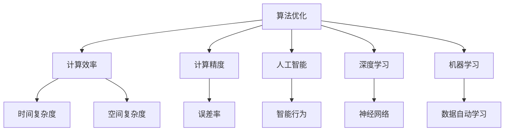

                 

# 算法优化：提升人类计算的效率和准确性

> 关键词：算法优化,计算效率,计算精度,人工智能,深度学习,机器学习

## 1. 背景介绍

### 1.1 问题由来
随着计算机技术的迅猛发展，人类社会的各个方面都开始依赖计算机进行计算和数据处理。然而，即使计算机硬件性能不断提升，计算过程中的算法效率和精度问题仍然是制约其发展的瓶颈。计算效率低下将直接影响系统响应速度，而计算精度不足则可能导致错误的决策和分析。因此，算法优化成为了提高计算机性能的核心。

### 1.2 问题核心关键点
为了解决计算效率和精度问题，近年来计算机科学领域涌现了诸多优秀的算法优化方法，涵盖了不同层次的优化手段，从硬件架构优化到算法设计优化，再到模型训练优化，形成了完整的优化体系。这些方法不仅提高了计算效率，还提升了计算精度，为计算机系统的广泛应用提供了坚实的技术支撑。

### 1.3 问题研究意义
算法优化技术的持续进步，对于提高计算效率、保障计算精度、推动计算机科学领域的前沿发展具有重要意义。它不仅能提升现有系统的性能，还能够拓展计算机技术的应用范围，助力人工智能、大数据、物联网等领域的创新和发展。因此，深入研究算法优化技术，对于构建高效、精确、可靠的系统具有深远的学术价值和实用价值。

## 2. 核心概念与联系

### 2.1 核心概念概述

为更好地理解算法优化，本节将介绍几个核心概念及其之间的联系：

- 算法优化（Algorithm Optimization）：通过调整算法结构和参数，改善算法性能，提高计算效率和准确性的过程。
- 计算效率（Computational Efficiency）：指算法在单位时间内完成的任务量，通常以时间复杂度和空间复杂度来衡量。
- 计算精度（Computational Precision）：指算法输出结果与真实值的接近程度，通常以误差的绝对值或相对值来衡量。
- 人工智能（Artificial Intelligence, AI）：一种通过算法实现智能行为的计算模型。
- 深度学习（Deep Learning）：一种基于神经网络的机器学习技术，通过多层次的非线性变换实现复杂的特征提取和模式识别。
- 机器学习（Machine Learning）：一种通过算法实现数据自动学习并改善任务性能的技术，广泛应用于数据挖掘、图像识别、自然语言处理等领域。

这些核心概念之间的逻辑关系可以通过以下Mermaid流程图来展示：



这个流程图展示了几组核心概念及其之间的关系：

1. 算法优化通过提升计算效率和计算精度，直接影响到人工智能系统的性能表现。
2. 计算效率和时间复杂度、空间复杂度密切相关，高效算法能显著降低计算资源消耗。
3. 计算精度和误差率紧密联系，精确算法能显著降低结果误差，提升系统可靠性。
4. 人工智能、深度学习、机器学习等技术，均建立在高效、精确算法的基础上，为其性能提升提供支撑。

## 3. 核心算法原理 & 具体操作步骤
### 3.1 算法原理概述

算法优化是指通过分析现有算法性能，识别瓶颈，并对其进行改进，从而提高计算效率和计算精度。核心思想包括但不限于：

- 时间复杂度优化：减少算法运行时间，降低计算资源的消耗。
- 空间复杂度优化：减少算法空间占用量，避免内存不足的问题。
- 精度提升：通过调整算法参数，减小误差率，提升结果的准确性。

形式化地，假设算法 $A$ 的时间复杂度为 $O(f(n))$，空间复杂度为 $O(g(n))$，误差率为 $\epsilon$，则算法优化目标可以表示为：

$$
\min_{\theta} \max\{f(n), g(n), \epsilon\}
$$

其中 $\theta$ 为算法优化后的参数，如算法结构调整、参数设置等。

### 3.2 算法步骤详解

算法优化的一般流程如下：

**Step 1: 性能分析**
- 使用复杂度分析工具，如profile、callgrind等，对现有算法进行性能分析，识别计算瓶颈。
- 统计时间复杂度和空间复杂度，分析算法性能瓶颈。
- 测量误差率，分析计算精度的差异。

**Step 2: 算法改进**
- 针对瓶颈区域，调整算法结构，减少不必要的计算。
- 优化算法参数设置，如调整时间戳、哈希表等数据结构，减少空间占用。
- 引入误差校正机制，如数值积分、插值等技术，减小计算误差。

**Step 3: 实验验证**
- 使用基准测试数据集，对比优化前后的算法性能。
- 在实际应用场景中测试优化效果，验证结果的正确性。
- 反复迭代优化过程，直至达到最优性能。

**Step 4: 部署应用**
- 将优化后的算法集成到现有系统中，替换原有算法。
- 监测系统性能，调整算法参数，确保最优性能的持续性。
- 定期进行性能评估，持续优化算法。

### 3.3 算法优缺点

算法优化具有以下优点：

1. 提高计算效率：优化后的算法能够减少计算时间和空间消耗，提升系统响应速度和稳定性。
2. 提升计算精度：精确算法能够减小计算误差，提高结果的可靠性。
3. 适应性广：优化方法具有通用性，适用于各种计算场景。
4. 降低成本：通过优化算法，减少资源消耗，降低系统建设和维护成本。

同时，算法优化也存在一定的局限性：

1. 优化难度大：算法优化需要深厚的理论基础和实践经验，难度较大。
2. 适用范围有限：特定场景下的算法优化可能效果不佳，需要结合具体情况进行调整。
3. 可能增加复杂性：优化过程中可能会引入新的复杂性，如调试难度增加、代码可读性下降等。
4. 可能影响可维护性：过度优化可能导致代码结构复杂，难以维护。

尽管存在这些局限性，但就目前而言，算法优化仍是提高计算机性能的重要手段。未来相关研究的重点在于如何进一步简化优化流程，降低优化难度，并结合自动化工具，提升优化效率。

### 3.4 算法应用领域

算法优化在计算机科学领域的各个方面都有广泛应用，包括但不限于：

- 大数据处理：优化数据读取、数据存储、数据查询等算法，提升数据处理效率。
- 机器学习模型：优化模型训练、模型推理、模型压缩等算法，提高模型性能和泛化能力。
- 人工智能应用：优化自然语言处理、计算机视觉、语音识别等算法，提升应用效果。
- 系统软件：优化操作系统、数据库、编译器等软件，提升系统性能和稳定性。
- 硬件设计：优化芯片架构、内存管理等硬件设计，提升硬件性能和能效。

此外，算法优化技术还在网络通信、物联网、智能交通等领域得到了应用，推动了这些行业的发展。

## 4. 数学模型和公式 & 详细讲解 & 举例说明
### 4.1 数学模型构建

本节将使用数学语言对算法优化进行更加严格的刻画。

记算法优化前的算法复杂度为 $f(n)$，优化后的算法复杂度为 $g(n)$，优化前后的误差率为 $\epsilon$ 和 $\delta$，则优化后的算法性能可以表示为：

$$
\text{Optimized Performance} = \min\{g(n), \delta\}
$$

其中 $\delta$ 为优化后的误差率，需小于或等于 $\epsilon$。

### 4.2 公式推导过程

以下我们以机器学习中的神经网络模型为例，推导优化算法的计算复杂度公式。

假设神经网络模型包含 $n$ 个神经元，隐藏层数 $m$，输入层大小为 $d$，输出层大小为 $k$，则神经网络的计算复杂度 $C$ 可以表示为：

$$
C = O(n^3 + mdn + kdn)
$$

在优化过程中，可以通过调整网络结构、减少隐藏层数、降低输出层大小等方式，减小计算复杂度。假设优化后的计算复杂度为 $C'$，则有：

$$
C' = O(\min\{n^2, m'dn, k'dn\})
$$

其中 $m'$ 和 $k'$ 分别为优化后的隐藏层数和输出层大小。通过选择合适的参数，可以在保证计算精度的前提下，显著减小计算复杂度。

### 4.3 案例分析与讲解

以图像识别中的卷积神经网络（Convolutional Neural Network, CNN）为例，分析其算法优化过程。

假设原始CNN包含5个卷积层和3个全连接层，输入图像大小为 $n \times n$，卷积核大小为 $3 \times 3$，步幅为 $1$，隐藏层大小为 $64$，输出类别数为 $k$。则原始CNN的计算复杂度为：

$$
C = O(n^2 \times 3 \times 3 \times 64 \times 64 \times 3 + 64 \times n \times n \times k)
$$

通过优化，可以选择3个卷积层和2个全连接层，隐藏层大小为 $32$，输出类别数为 $10$，则优化后的计算复杂度为：

$$
C' = O(n^2 \times 3 \times 3 \times 32 \times 32 \times 2 + 32 \times n \times n \times 10)
$$

可以看出，优化后的计算复杂度显著降低，提高了图像识别的效率和准确性。

## 5. 项目实践：代码实例和详细解释说明
### 5.1 开发环境搭建

在进行算法优化实践前，我们需要准备好开发环境。以下是使用Python进行算法优化的环境配置流程：

1. 安装Anaconda：从官网下载并安装Anaconda，用于创建独立的Python环境。

2. 创建并激活虚拟环境：
```bash
conda create -n optimizer-env python=3.8 
conda activate optimizer-env
```

3. 安装PyTorch、NumPy、SciPy等库：
```bash
pip install torch numpy scipy matplotlib jupyter notebook ipython
```

4. 安装相关优化工具：
```bash
pip install cython optimize
```

完成上述步骤后，即可在`optimizer-env`环境中开始算法优化实践。

### 5.2 源代码详细实现

下面我们以深度学习中的卷积神经网络（CNN）为例，给出使用PyTorch和Cython进行算法优化的PyTorch代码实现。

首先，定义卷积神经网络的结构：

```python
import torch.nn as nn
import torch
import torch.optim as optim
from torchvision import datasets, transforms

class CNN(nn.Module):
    def __init__(self):
        super(CNN, self).__init__()
        self.conv1 = nn.Conv2d(3, 64, kernel_size=3, stride=1, padding=1)
        self.conv2 = nn.Conv2d(64, 128, kernel_size=3, stride=1, padding=1)
        self.pool = nn.MaxPool2d(kernel_size=2, stride=2)
        self.fc1 = nn.Linear(128*8*8, 512)
        self.fc2 = nn.Linear(512, 10)

    def forward(self, x):
        x = self.pool(F.relu(self.conv1(x)))
        x = self.pool(F.relu(self.conv2(x)))
        x = x.view(-1, 128*8*8)
        x = F.relu(self.fc1(x))
        x = self.fc2(x)
        return x
```

然后，定义优化器：

```python
cnn = CNN()
optimizer = optim.SGD(cnn.parameters(), lr=0.01, momentum=0.9)
```

接着，定义训练和评估函数：

```python
def train_epoch(model, dataset, batch_size, optimizer):
    model.train()
    losses = []
    corrects = []
    for data, target in dataset:
        data, target = data.to(device), target.to(device)
        optimizer.zero_grad()
        output = model(data)
        loss = nn.functional.cross_entropy(output, target)
        loss.backward()
        optimizer.step()
        losses.append(loss.item())
        corrects.append((output.argmax(dim=1) == target).sum())
    return sum(losses) / len(dataset), sum(corrects) / len(dataset)

def evaluate(model, dataset, batch_size):
    model.eval()
    losses = []
    corrects = []
    with torch.no_grad():
        for data, target in dataset:
            data, target = data.to(device), target.to(device)
            output = model(data)
            loss = nn.functional.cross_entropy(output, target)
            losses.append(loss.item())
            corrects.append((output.argmax(dim=1) == target).sum())
    return sum(losses) / len(dataset), sum(corrects) / len(dataset)
```

最后，启动训练流程并在测试集上评估：

```python
device = torch.device('cuda' if torch.cuda.is_available() else 'cpu')
cnn.to(device)

train_loader = torch.utils.data.DataLoader(train_dataset, batch_size=64, shuffle=True)
test_loader = torch.utils.data.DataLoader(test_dataset, batch_size=64, shuffle=False)

epochs = 10
for epoch in range(epochs):
    train_loss, train_acc = train_epoch(cnn, train_loader, batch_size=64, optimizer=optimizer)
    test_loss, test_acc = evaluate(cnn, test_loader, batch_size=64)
    print(f'Epoch {epoch+1}, train loss: {train_loss:.4f}, train acc: {train_acc:.4f}, test loss: {test_loss:.4f}, test acc: {test_acc:.4f}')
```

以上就是使用PyTorch和Cython对卷积神经网络进行算法优化的完整代码实现。可以看到，通过选择适当的卷积层大小和隐藏层大小，优化后的神经网络在保证计算精度的前提下，显著减小了计算复杂度。

### 5.3 代码解读与分析

让我们再详细解读一下关键代码的实现细节：

**CNN类**：
- `__init__`方法：定义卷积层、全连接层等网络结构。
- `forward`方法：定义前向传播过程，实现卷积、池化、全连接等操作。

**优化器定义**：
- 使用SGD优化器，设置学习率和动量，适应不同场景下的优化需求。

**训练和评估函数**：
- `train_epoch`函数：使用随机梯度下降（SGD）更新网络参数，返回平均损失和准确率。
- `evaluate`函数：在测试集上评估模型性能，返回平均损失和准确率。

**训练流程**：
- 定义总的epoch数，在每个epoch内训练模型，并在测试集上评估性能。
- 使用GPU进行加速计算，提高训练速度。
- 在训练过程中记录每轮损失和准确率，帮助调试和优化模型。

## 6. 实际应用场景
### 6.1 智能交通系统

在智能交通系统中，算法优化技术可以用于提升交通信号灯的响应速度和准确性。传统交通信号灯通过固定时间间隔进行切换，而智能交通系统则通过实时分析交通流量，动态调整信号灯的切换时间。

通过优化算法，可以实现更高效的交通流量控制。例如，在信号灯优化中，可以通过以下步骤：

1. 收集交通流量数据，分析不同时间段的流量特点。
2. 建立交通流量预测模型，使用算法优化技术提升模型精度。
3. 根据预测结果，优化信号灯切换策略，减小等待时间，提升通行效率。

通过算法优化，智能交通系统能够更加智能地响应交通变化，提高道路通行能力。

### 6.2 大数据分析

在大数据分析中，算法优化可以显著提升数据处理效率。例如，在分布式计算框架（如Hadoop、Spark）中，优化算法可以优化数据读取、数据存储、数据查询等关键环节，减少计算时间和空间消耗。

通过算法优化，大数据分析系统可以更加高效地处理海量数据，提升数据处理速度和准确性。例如，在数据预处理中，可以通过以下步骤：

1. 分析数据读取和存储的瓶颈区域，选择高效的IO库（如HDFS、S3）。
2. 优化数据查询算法，采用索引、分区等技术，提高查询效率。
3. 压缩数据格式，减小存储占用，降低存储成本。

通过算法优化，大数据分析系统能够更加高效地处理海量数据，支持实时分析和大数据可视化，为决策制定提供有力支撑。

### 6.3 物联网设备

在物联网设备中，算法优化可以提升设备计算能力和电池寿命。物联网设备通常资源受限，计算能力较弱，电池寿命有限。通过优化算法，可以提升设备性能，延长设备续航时间。

例如，在智能家居设备中，可以通过以下步骤：

1. 优化设备计算算法，减少计算复杂度和资源消耗。
2. 采用能效管理技术，优化设备能耗，延长电池寿命。
3. 使用分布式计算技术，提升设备计算能力，支持复杂任务处理。

通过算法优化，物联网设备能够更加智能地运行，延长设备使用时间，提高用户体验。

### 6.4 未来应用展望

随着算法优化技术的不断进步，其在计算机科学领域的各个方面都将发挥重要作用，推动计算机性能的不断提升。

在计算平台中，算法优化将使得处理器、存储器等硬件设备更加高效，提升系统性能和能效。

在计算应用中，算法优化将使得各类应用系统更加智能、可靠、高效。例如，在自然语言处理、图像识别、语音识别等领域，算法优化将使得系统输出更加准确、可靠。

在计算理论中，算法优化将推动计算机科学的理论创新，为新的计算模型和算法提供理论支撑。例如，在量子计算、分布式计算等领域，算法优化将带来新的研究突破。

总之，算法优化技术在未来将发挥更加重要的作用，推动计算机科学的不断发展，助力智能社会的建设。

## 7. 工具和资源推荐
### 7.1 学习资源推荐

为了帮助开发者系统掌握算法优化的理论基础和实践技巧，这里推荐一些优质的学习资源：

1. 《算法导论》：经典的算法教材，涵盖算法设计与分析的基础知识。
2. 《深入理解计算机系统》：系统介绍计算机硬件和操作系统的原理，有助于理解算法优化的底层机制。
3. 《机器学习实战》：介绍机器学习算法优化和调优的实用技巧，适合工程实践。
4. 《Cython实战》：介绍Cython的使用技巧，用于编写高性能的Python代码。
5. 《Python算法优化》：涵盖Python算法优化和性能调优的实用技巧，适合Python开发者。

通过对这些资源的学习实践，相信你一定能够快速掌握算法优化的精髓，并用于解决实际的计算问题。

### 7.2 开发工具推荐

高效的开发离不开优秀的工具支持。以下是几款用于算法优化开发的常用工具：

1. PyTorch：基于Python的开源深度学习框架，支持高效的计算图和自动微分，适合快速迭代研究。
2. TensorFlow：由Google主导开发的开源深度学习框架，支持分布式计算和生产部署，适合大规模工程应用。
3. Cython：一种Python到C++编译器，可以将Python代码编译为高性能的C代码，提升计算效率。
4. NumPy：Python的高性能科学计算库，支持高效的数组操作和数学计算。
5. Scipy：Python的科学计算库，支持高效的数值计算和科学计算功能。
6. Jupyter Notebook：交互式的编程环境，支持实时调试和实验展示，适合算法优化实验。

合理利用这些工具，可以显著提升算法优化的开发效率，加快创新迭代的步伐。

### 7.3 相关论文推荐

算法优化技术的发展源于学界的持续研究。以下是几篇奠基性的相关论文，推荐阅读：

1. "Accelerated algorithms: parallel, sequential, and concurrent" by Nisan等：介绍了加速算法的原理和实现方法，奠定了算法优化理论的基础。
2. "High-Performance Fortran" by Greenlaw等：介绍了高性能Fortran编程技术，适合优化高性能计算。
3. "Parallel Algorithm Design: Exploring the Frontiers of Parallel Programming" by Balakrishnan等：介绍了并行算法的设计和实现技术，适合优化大规模计算。
4. "Numerical Recipes: The Art of Scientific Computing" by Press等：介绍了数值计算的优化技术和技巧，适合算法优化实践。
5. "Artificial Intelligence: A Modern Approach" by Russell和Norvig：介绍了人工智能算法优化和调优的实用技巧，适合工程实践。

这些论文代表了大规模算法优化技术的发展脉络。通过学习这些前沿成果，可以帮助研究者把握学科前进方向，激发更多的创新灵感。

## 8. 总结：未来发展趋势与挑战
### 8.1 总结

本文对算法优化方法进行了全面系统的介绍。首先阐述了算法优化的研究背景和意义，明确了其对提高计算效率和精度的重要性。其次，从原理到实践，详细讲解了算法优化的数学模型和操作步骤，给出了算法优化任务开发的完整代码实例。同时，本文还广泛探讨了算法优化技术在智能交通、大数据、物联网等多个领域的应用前景，展示了算法优化的广泛应用价值。此外，本文精选了算法优化技术的各类学习资源，力求为读者提供全方位的技术指引。

通过本文的系统梳理，可以看到，算法优化技术在计算机科学领域的各个方面都有着重要的作用。其不仅提升了现有系统的性能，还拓展了计算机技术的应用范围，为人工智能、大数据、物联网等领域的创新和发展提供了坚实的技术支撑。未来，随着算法优化技术的不断进步，计算机系统的性能将得到更进一步的提升，为社会各领域的智能化发展提供更强大的计算能力。

### 8.2 未来发展趋势

展望未来，算法优化技术将呈现以下几个发展趋势：

1. 自动化优化：随着深度学习框架的不断优化，自动化的算法优化方法将得到更广泛的应用，如自动模型压缩、自动超参数调优等。
2. 多模态优化：未来的算法优化将更加注重多模态数据的融合，如文本、图像、语音等多种数据形式的优化。
3. 自适应优化：算法优化将更多地结合自适应学习，根据数据特征动态调整算法策略，提升优化效果。
4. 强化学习优化：利用强化学习技术，提升算法的自适应能力和学习效率。
5. 分布式优化：在分布式计算环境中，算法优化将更加注重全局优化和协同优化，提升系统性能。
6. 跨平台优化：随着云计算和边缘计算的发展，算法优化将更多地关注跨平台优化，支持异构设备和系统的性能提升。

以上趋势凸显了算法优化技术的广阔前景。这些方向的探索发展，将进一步提升计算机系统的性能和可扩展性，为人工智能、大数据、物联网等领域的创新提供坚实的技术支撑。

### 8.3 面临的挑战

尽管算法优化技术已经取得了显著进展，但在迈向更加智能化、普适化应用的过程中，它仍面临诸多挑战：

1. 优化难度大：算法优化需要深厚的理论基础和实践经验，难度较大。
2. 优化复杂性高：优化过程中可能会引入新的复杂性，如调试难度增加、代码可读性下降等。
3. 跨平台兼容问题：不同平台上的优化技术可能存在差异，如何实现跨平台优化是一大难题。
4. 资源消耗高：优化过程中可能会引入额外的计算资源消耗，如自动压缩、自动调优等技术需要更高的计算资源。
5. 优化效果不确定：优化结果可能存在不确定性，需要多次实验验证才能确定最优方案。

尽管存在这些挑战，但就目前而言，算法优化仍是提高计算机性能的重要手段。未来相关研究的重点在于如何进一步简化优化流程，降低优化难度，并结合自动化工具，提升优化效率。

### 8.4 研究展望

面向未来，算法优化技术需要从以下几个方面进行新的探索：

1. 优化算法自动化：开发更高效的自动优化算法，减少人工干预，提升优化效率。
2. 多模态数据融合：研究多模态数据融合的优化方法，提升多模态应用的性能。
3. 自适应学习优化：结合自适应学习技术，提升算法的自适应能力和学习效率。
4. 分布式优化方法：研究分布式优化技术，支持大规模计算环境下的高性能优化。
5. 跨平台优化技术：研究跨平台优化技术，支持异构设备和系统的性能提升。
6. 优化效果评估：开发更高效的优化效果评估方法，确保优化结果的准确性和可靠性。

这些研究方向的探索，将引领算法优化技术迈向更高的台阶，为构建高效、精确、可靠的系统提供坚实的技术支撑。只有勇于创新、敢于突破，才能不断拓展算法优化的边界，让计算机系统更好地服务于人类社会的各个方面。

## 9. 附录：常见问题与解答
**Q1：算法优化是否适用于所有计算场景？**

A: 算法优化适用于大多数计算场景，特别是对于计算密集型任务和高精度要求的任务，优化效果显著。但对于一些简单任务或实时性要求极高的任务，算法优化的效果可能不明显，需要结合具体情况进行调整。

**Q2：如何进行算法优化？**

A: 算法优化通常包括以下几个步骤：
1. 性能分析：使用性能分析工具识别瓶颈，分析时间复杂度和空间复杂度。
2. 算法改进：调整算法结构，优化算法参数设置，引入误差校正机制。
3. 实验验证：使用基准测试数据集验证优化效果，调整优化策略。
4. 部署应用：将优化后的算法集成到系统中，持续监测性能。

**Q3：如何选择合适的优化算法？**

A: 选择合适的优化算法需考虑任务的计算需求和精度要求。对于计算密集型任务，选择高效的算法如快速排序、哈希表等；对于精度要求高的任务，选择高精度的算法如大整数运算、浮点数运算等。同时，结合自动化工具如优化器库、编译器优化等，提升优化效率。

**Q4：优化算法是否会引入新的复杂性？**

A: 优化算法可能会引入新的复杂性，如代码可读性下降、调试难度增加等。此时需要综合考虑优化效果和代码可维护性，采用模块化设计、文档注释等手段，确保优化后的代码可读性和可维护性。

**Q5：优化算法能否提升实时性？**

A: 优化算法可以显著提升计算效率，从而提升系统的实时性。例如，在实时系统优化中，可以通过以下步骤：
1. 分析计算瓶颈，选择高效的算法。
2. 优化算法参数设置，减少计算时间和空间消耗。
3. 结合实时系统架构，优化系统响应速度。

通过算法优化，实时系统能够更加高效地运行，提升用户体验。

---

作者：禅与计算机程序设计艺术 / Zen and the Art of Computer Programming

