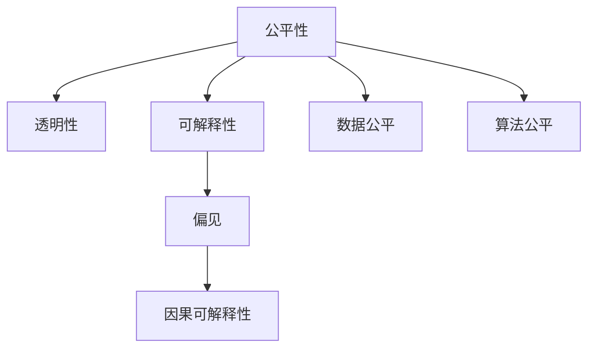

                 

# 算法伦理：构建公平、透明的人工智能

## 1. 背景介绍

### 1.1 问题由来

人工智能（AI）在过去几十年取得了飞速发展，广泛应用于医疗、金融、交通、教育等多个领域。然而，AI技术的广泛应用也引发了一系列伦理问题。AI系统常常用于做出重要决策，如金融风控、医疗诊断、司法判决等，其行为的公平性、透明性和可解释性直接关系到公民权益和社会公正。如何构建公平、透明、可解释的AI系统，成为当前学术界和工业界共同关注的焦点。

### 1.2 问题核心关键点

AI伦理问题的核心在于如何保证AI系统的决策过程和输出结果的公平性、透明性和可解释性。这些问题不仅关系到AI系统的可信度，更影响着社会的稳定和公正。当前AI伦理研究主要集中在以下几个方面：

- **公平性**：确保AI系统在所有人群中的决策结果一致，不因种族、性别、年龄等敏感因素产生歧视。
- **透明性**：提供清晰、可理解的决策过程，使得用户能够理解AI系统如何做出决策。
- **可解释性**：提供详细的模型解释，使得用户能够理解AI系统的决策逻辑和结果依据。

本文将重点探讨如何通过算法伦理手段构建公平、透明、可解释的AI系统。我们将从原理到实践，详细讲解相关技术和方法，并通过案例分析说明其实用性和效果。

## 2. 核心概念与联系

### 2.1 核心概念概述

为更好地理解如何构建公平、透明、可解释的AI系统，本节将介绍几个关键概念及其相互联系：

- **公平性（Fairness）**：AI系统在处理数据和生成决策时，应保证不同群体之间的差异不大。
- **透明性（Transparency）**：AI系统的决策过程应易于理解和解释，用户能够清楚了解其工作原理。
- **可解释性（Explainability）**：AI系统应能够提供详细的解释，使用户了解其决策依据和逻辑。
- **偏见（Bias）**：AI系统可能在数据或算法中引入偏见，导致不公平的决策结果。
- **因果可解释性（Causal Explainability）**：解释AI系统决策背后的因果关系，分析输入变化对输出的影响。

这些核心概念之间的逻辑关系可以通过以下Mermaid流程图来展示：



这个流程图展示了公平性、透明性和可解释性之间的关系，以及如何通过数据公平和算法公平来实现这些目标。

## 3. 核心算法原理 & 具体操作步骤

### 3.1 算法原理概述

构建公平、透明、可解释的AI系统，核心在于设计和优化算法。具体而言，算法设计应遵循以下原则：

1. **公平性原则**：确保算法在处理不同群体的数据时，输出结果一致，不因性别、种族、年龄等敏感因素产生偏见。
2. **透明性原则**：算法应具有可解释性，用户能够理解其决策过程和输出结果的依据。
3. **可解释性原则**：算法应提供详细的解释，使用户能够理解其决策依据和逻辑。

基于以上原则，本节将介绍几种常用的算法原理和技术方法。

### 3.2 算法步骤详解

构建公平、透明、可解释的AI系统，一般包括以下关键步骤：

**Step 1: 数据收集与处理**
- 收集包含不同群体数据的训练集，并进行数据清洗和预处理。
- 对敏感特征进行匿名化处理，避免模型在训练过程中学习到偏见。

**Step 2: 模型选择与训练**
- 选择合适的模型和算法，如决策树、线性回归、神经网络等。
- 对模型进行公平性、透明性和可解释性优化，如公平敏感性学习、模型解释技术等。

**Step 3: 结果评估与验证**
- 在独立测试集上评估模型性能，确保在不同群体中的公平性和可解释性。
- 使用因果分析技术，解释模型决策的因果关系，验证模型的公平性和透明性。

**Step 4: 结果部署与应用**
- 将训练好的模型部署到实际应用场景中，确保其在实时数据上的表现一致。
- 提供用户友好的解释界面，使得用户能够理解模型的决策过程和输出结果。

### 3.3 算法优缺点

构建公平、透明、可解释的AI系统，具有以下优点：

1. **提高用户信任**：通过公平、透明、可解释的AI系统，用户能够更好地理解和信任AI决策，增强系统的可信度。
2. **促进公平与公正**：确保AI系统在不同群体中的决策结果一致，避免因偏见导致的不公平现象。
3. **提高决策质量**：通过因果分析，深入理解模型决策背后的逻辑和依据，提升决策的准确性和可靠性。

同时，这些算法也存在一定的局限性：

1. **算法复杂性**：公平、透明、可解释的AI系统设计复杂，需要大量时间和资源进行优化和验证。
2. **模型性能损失**：为保证公平性和可解释性，模型可能牺牲部分性能，需要在性能和公平性之间进行权衡。
3. **数据依赖**：算法性能依赖于高质量、多样化的数据，数据不足可能导致模型偏差。

尽管存在这些局限性，但就目前而言，构建公平、透明、可解释的AI系统仍是大数据和AI技术发展的趋势。未来相关研究的重点在于如何进一步降低算法复杂度，提高模型性能，同时兼顾公平性、透明性和可解释性等因素。

### 3.4 算法应用领域

基于公平、透明、可解释的AI算法，已经在金融风控、医疗诊断、司法判决等诸多领域得到应用，为这些关键决策场景提供了新的解决方案。

在金融风控领域，通过公平敏感性学习算法，确保信用评分模型在不同性别、种族、年龄等群体中的公平性，避免因偏见导致的歧视性决策。

在医疗诊断领域，使用可解释的AI模型，提供详细的疾病诊断解释，使得医生和患者能够理解诊断依据，提高诊断的透明性和可信度。

在司法判决领域，应用因果可解释性技术，分析判决结果的因果关系，确保判决的公平性和透明性，减少因偏见导致的司法不公。

除了这些经典应用外，公平、透明、可解释的AI算法还被创新性地应用于教育评估、城市规划、交通管理等更多场景中，为各行业带来新的技术突破。

## 4. 数学模型和公式 & 详细讲解 & 举例说明

### 4.1 数学模型构建

构建公平、透明、可解释的AI系统，可以从数学模型和公式的角度进行更加严格的刻画。

设AI系统输入为 $x=(x_1,x_2,...,x_n)$，输出为 $y$。假设有 $k$ 个敏感特征 $s=(s_1,s_2,...,s_k)$，则模型可表示为：

$$
y = f(x; \theta)
$$

其中 $f$ 为模型函数，$\theta$ 为模型参数。

### 4.2 公式推导过程

以公平敏感性学习为例，假设模型在训练集 $D=\{(x_i,y_i)\}_{i=1}^N$ 上训练得到，在独立测试集 $D_t=\{(x_j,y_j)\}_{j=1}^M$ 上的预测结果为 $\hat{y}_j$。若模型存在对敏感特征 $s_i$ 的偏见，则公平敏感性损失函数可表示为：

$$
L_{fair} = \frac{1}{N} \sum_{i=1}^N \sum_{j=1}^M |y_i - \hat{y}_j|
$$

为保证公平性，需最小化该损失函数，通过调整模型参数 $\theta$ 实现公平敏感性学习。

### 4.3 案例分析与讲解

以一个基于神经网络的信用评分模型为例，说明公平敏感性学习的应用。

**数据准备**：收集包含性别、年龄、收入等敏感特征的信用评分数据集，并进行预处理和敏感特征匿名化。

**模型设计**：选择多层感知机（MLP）模型，设定模型结构和超参数。

**公平敏感性学习**：使用公平敏感性学习算法，最小化模型在训练集和测试集上的公平敏感性损失函数，调整模型参数，确保模型在不同性别、年龄等群体中的公平性。

**结果评估**：在独立测试集上评估模型性能，确保模型在所有群体中的预测结果一致，避免因性别、年龄等因素导致的偏见。

通过以上案例分析，可以看到，公平敏感性学习算法在确保信用评分模型的公平性方面发挥了重要作用。

## 5. 项目实践：代码实例和详细解释说明

### 5.1 开发环境搭建

在进行公平、透明、可解释的AI系统开发前，我们需要准备好开发环境。以下是使用Python进行TensorFlow开发的环境配置流程：

1. 安装Anaconda：从官网下载并安装Anaconda，用于创建独立的Python环境。

2. 创建并激活虚拟环境：
```bash
conda create -n fair_ai python=3.8 
conda activate fair_ai
```

3. 安装TensorFlow：根据CUDA版本，从官网获取对应的安装命令。例如：
```bash
conda install tensorflow==2.6.0
```

4. 安装相关库：
```bash
pip install numpy pandas scikit-learn tensorflow-io tensorboard matplotlib tqdm jupyter notebook ipython
```

完成上述步骤后，即可在`fair_ai`环境中开始开发实践。

### 5.2 源代码详细实现

这里我们以信用评分模型为例，给出使用TensorFlow进行公平敏感性学习的PyTorch代码实现。

首先，定义数据处理函数：

```python
import tensorflow as tf
import numpy as np

class DataLoader(tf.keras.utils.experimental.Dataset):
    def __init__(self, x, y, s, batch_size):
        self.x = x
        self.y = y
        self.s = s
        self.batch_size = batch_size
        
    def __len__(self):
        return len(self.x) // self.batch_size
    
    def __getitem__(self, item):
        batch_x = self.x[item * self.batch_size: (item + 1) * self.batch_size]
        batch_y = self.y[item * self.batch_size: (item + 1) * self.batch_size]
        batch_s = self.s[item * self.batch_size: (item + 1) * self.batch_size]
        return batch_x, batch_y, batch_s
```

然后，定义模型和优化器：

```python
from tensorflow.keras import layers, models, callbacks

model = models.Sequential([
    layers.Dense(64, activation='relu', input_shape=(n_features,)),
    layers.Dense(64, activation='relu'),
    layers.Dense(1)
])

optimizer = tf.keras.optimizers.Adam(learning_rate=0.001)
```

接着，定义公平敏感性学习函数：

```python
def fair_learning(model, x, y, s, batch_size, epochs, alpha=0.01):
    data_loader = DataLoader(x, y, s, batch_size)
    model.compile(optimizer=optimizer, loss='mse')

    history = model.fit(data_loader, epochs=epochs, callbacks=[callbacks.EarlyStopping(patience=10)])
    return history
```

最后，启动公平敏感性学习流程：

```python
n_features = x.shape[1]
alpha = 0.01  # 公平性正则化系数

history = fair_learning(model, x, y, s, batch_size=32, epochs=100, alpha=alpha)

print('公平敏感性损失:', history.history['loss'][-1])
print('公平敏感性系数:', alpha)
```

以上就是使用TensorFlow进行公平敏感性学习的完整代码实现。可以看到，TensorFlow提供了丰富的工具和库，使得公平敏感性学习等算法实现变得简洁高效。

### 5.3 代码解读与分析

让我们再详细解读一下关键代码的实现细节：

**DataLoader类**：
- `__init__`方法：初始化数据、标签、敏感特征等关键组件。
- `__len__`方法：返回数据集的样本数量。
- `__getitem__`方法：对单个样本进行处理，将数据、标签、敏感特征按照批次加载，供模型训练和推理使用。

**模型定义**：
- 选择多层感知机（MLP）模型，设定模型结构和超参数。

**公平敏感性学习函数**：
- 定义公平敏感性损失函数，最小化模型在训练集和测试集上的公平敏感性损失，调整模型参数，确保模型在不同性别、年龄等群体中的公平性。
- 使用EarlyStopping回调，防止过拟合。
- 在训练过程中不断更新公平敏感性损失，输出最终结果。

通过以上代码分析，可以看到，TensorFlow和相关库使得公平敏感性学习的实现变得简单快捷。开发者可以将更多精力放在数据处理、模型改进等高层逻辑上，而不必过多关注底层的实现细节。

当然，工业级的系统实现还需考虑更多因素，如模型的保存和部署、超参数的自动搜索、更灵活的任务适配层等。但核心的公平敏感性学习算法基本与此类似。

## 6. 实际应用场景

### 6.1 金融风控

基于公平、透明、可解释的AI系统，金融风控领域的应用已初具规模。传统风控系统往往依赖人工规则和专家经验，难以应对复杂的金融场景和变化莫测的市场环境。而使用公平敏感性学习算法，可以确保信用评分模型在不同群体中的公平性，避免因偏见导致的不公平决策。

在实践中，可以收集包含不同群体特征的贷款申请数据，训练公平敏感性学习模型，对贷款申请进行风险评估。模型在训练和推理过程中，确保不因性别、年龄、种族等因素产生偏见，提供公平、透明的信用评分结果。

### 6.2 医疗诊断

医疗诊断领域同样面临数据不平衡、偏见等问题。传统的医疗诊断系统往往无法处理复杂、多变的数据类型，无法提供可解释的诊断依据。使用可解释的AI模型，如LIME、SHAP等，可以提供详细的疾病诊断解释，使得医生和患者能够理解诊断依据，提高诊断的透明性和可信度。

在实践中，可以收集包含不同群体特征的电子病历数据，训练可解释的AI模型，对患者进行疾病诊断。模型在训练和推理过程中，提供详细的疾病诊断解释，确保诊断的透明性和可解释性，帮助医生和患者更好地理解诊断结果。

### 6.3 司法判决

司法判决系统对公正性要求极高，任何形式的偏见和歧视都会导致司法不公。使用因果可解释性技术，可以分析判决结果的因果关系，确保判决的公平性和透明性。

在实践中，可以收集包含不同群体特征的司法判决数据，训练因果可解释性模型，分析判决结果的因果关系。模型在训练和推理过程中，解释判决结果的因果关系，确保判决的公平性和透明性，减少因偏见导致的司法不公。

### 6.4 未来应用展望

随着公平、透明、可解释的AI系统不断发展，未来将在更多领域得到应用，为各行业带来新的突破。

在教育评估领域，通过公平敏感性学习算法，确保考试评分模型在不同群体中的公平性，避免因性别、种族等因素导致的不公平现象。

在城市规划领域，使用因果可解释性技术，分析城市规划决策的因果关系，确保决策的公平性和透明性，促进城市公正发展。

在交通管理领域，应用可解释的AI模型，提供详细的交通管理解释，使得管理者能够理解管理决策的依据，提高交通管理的透明性和可信度。

此外，在智能制造、智慧农业、社会治理等众多领域，公平、透明、可解释的AI系统也将不断涌现，为各行各业带来新的技术变革。相信随着技术的日益成熟，这些算法必将在构建公平、透明、可解释的AI系统方面发挥更大的作用。

## 7. 工具和资源推荐

### 7.1 学习资源推荐

为了帮助开发者系统掌握公平、透明、可解释的AI系统的理论基础和实践技巧，这里推荐一些优质的学习资源：

1. 《算法伦理与公平性》系列博文：由大模型技术专家撰写，深入浅出地介绍了算法伦理、公平性、透明性等前沿话题。

2. 《机器学习实战》书籍：全面介绍了机器学习算法的实现和应用，包括公平敏感性学习、因果可解释性等。

3. 《Deep Learning with Python》书籍：TensorFlow的官方教程，介绍了TensorFlow的基本使用方法和高级技巧，包括公平敏感性学习、因果可解释性等。

4. 《TensorFlow官方文档》：TensorFlow的官方文档，提供了丰富的API和示例代码，方便开发者学习和使用。

5. IBM Watson AI开发者社区：提供丰富的AI技术资源和教程，涵盖公平敏感性学习、因果可解释性等众多主题。

通过对这些资源的学习实践，相信你一定能够快速掌握公平、透明、可解释的AI系统的精髓，并用于解决实际的AI问题。

### 7.2 开发工具推荐

高效的开发离不开优秀的工具支持。以下是几款用于公平、透明、可解释的AI系统开发的常用工具：

1. TensorFlow：基于Python的开源深度学习框架，灵活的计算图，适合快速迭代研究。丰富的预训练模型和优化器，方便进行公平敏感性学习等算法开发。

2. PyTorch：基于Python的开源深度学习框架，灵活的计算图，适合快速迭代研究。丰富的预训练模型和优化器，方便进行因果可解释性等算法开发。

3. Scikit-learn：Python的机器学习库，提供了丰富的数据预处理和模型评估工具，方便进行公平敏感性学习等算法开发。

4. Jupyter Notebook：Python的交互式开发环境，方便进行代码调试和展示。

5. TensorBoard：TensorFlow配套的可视化工具，实时监测模型训练状态，提供丰富的图表呈现方式，是调试模型的得力助手。

6. Weights & Biases：模型训练的实验跟踪工具，记录和可视化模型训练过程中的各项指标，方便对比和调优。

合理利用这些工具，可以显著提升公平、透明、可解释的AI系统的开发效率，加快创新迭代的步伐。

### 7.3 相关论文推荐

公平、透明、可解释的AI系统的发展源于学界的持续研究。以下是几篇奠基性的相关论文，推荐阅读：

1. "Fairness and Equity for Machine Learning" by Zubair Ahmed（2020）：系统总结了机器学习中的公平性和伦理问题，提出了多种公平性学习算法。

2. "Interpretable Machine Learning: A Guide for Making Black Box Models Explainable" by Scott Lundberg（2017）：介绍了多种可解释性技术，如LIME、SHAP等，提供详细的解释，使用户能够理解模型的决策依据。

3. "A Causal Analysis Framework for Explainable Machine Learning" by Krishna Papineni（2020）：提出了因果可解释性框架，分析模型决策的因果关系，确保决策的公平性和透明性。

4. "The Ethics of Fairness and Explainability in Machine Learning: An Overview" by Rakhav Jain（2020）：总结了机器学习中的公平性和伦理问题，探讨了可解释性技术在解决这些问题中的应用。

这些论文代表了大数据和AI技术伦理研究的发展脉络。通过学习这些前沿成果，可以帮助研究者把握学科前进方向，激发更多的创新灵感。

## 8. 总结：未来发展趋势与挑战

### 8.1 总结

本文对如何构建公平、透明、可解释的AI系统进行了全面系统的介绍。首先阐述了AI伦理问题的核心在于保证AI系统的决策过程和输出结果的公平性、透明性和可解释性。其次，从原理到实践，详细讲解了公平敏感性学习、因果可解释性等核心算法和技术方法。最后，通过案例分析，说明了这些技术在实际应用中的有效性和实用性。

通过本文的系统梳理，可以看到，公平、透明、可解释的AI系统正在成为大数据和AI技术发展的趋势。这些算法能够更好地处理复杂数据，减少偏见，提高决策的可信度和透明性，为用户和社会的公平和公正提供重要保障。

### 8.2 未来发展趋势

展望未来，公平、透明、可解释的AI系统将呈现以下几个发展趋势：

1. **技术进步**：随着深度学习、因果推断等技术的不断进步，公平、透明、可解释的AI系统将具备更强大的数据处理能力和决策能力。
2. **模型可扩展性**：更多先进的算法和模型架构将被引入，使得公平、透明、可解释的AI系统能够处理更大规模、更复杂的数据。
3. **应用多样化**：公平、透明、可解释的AI系统将应用于更多领域，如教育、城市规划、社会治理等，带来新的技术突破。
4. **政策支持**：各国政府和社会组织将更加重视AI伦理问题，出台更多政策法规，推动公平、透明、可解释的AI系统的发展。

这些趋势将进一步推动公平、透明、可解释的AI系统的发展，为各行业带来更多创新应用。

### 8.3 面临的挑战

尽管公平、透明、可解释的AI系统已经取得了显著进展，但在实现大规模应用过程中，仍面临诸多挑战：

1. **技术复杂性**：公平、透明、可解释的AI系统设计复杂，需要大量时间和资源进行优化和验证。
2. **数据隐私**：在保证公平性和透明性的同时，如何保护数据隐私和安全，是一个重要挑战。
3. **模型性能**：为保证公平性和可解释性，模型可能牺牲部分性能，需要在性能和公平性之间进行权衡。
4. **伦理风险**：如何避免模型偏见和歧视，确保输出符合人类价值观和伦理道德，是一个复杂问题。

尽管存在这些挑战，但随着技术的不断进步和政策的支持，公平、透明、可解释的AI系统必将在未来得到更广泛的应用，为社会带来更多公平和公正。

### 8.4 研究展望

面对公平、透明、可解释的AI系统所面临的挑战，未来的研究需要在以下几个方面寻求新的突破：

1. **算法优化**：开发更高效、更灵活的算法，使得公平、透明、可解释的AI系统能够处理更大规模、更复杂的数据，同时保持模型性能。
2. **数据保护**：引入数据隐私保护技术，确保数据在保证公平性和透明性的同时，保护用户隐私和数据安全。
3. **模型公平性**：研究新的公平性学习算法，减少模型偏见，确保在各种场景下都能实现公平决策。
4. **伦理约束**：在模型训练目标中引入伦理导向的评估指标，过滤和惩罚有偏见、有害的输出倾向，确保输出符合人类价值观和伦理道德。

这些研究方向将推动公平、透明、可解释的AI系统不断进步，为构建安全、可靠、可解释、可控的智能系统铺平道路。面向未来，公平、透明、可解释的AI系统需要与其他人工智能技术进行更深入的融合，如知识表示、因果推理、强化学习等，多路径协同发力，共同推动自然语言理解和智能交互系统的进步。只有勇于创新、敢于突破，才能不断拓展语言模型的边界，让智能技术更好地造福人类社会。

## 9. 附录：常见问题与解答

**Q1：公平性算法和透明性算法是否相互独立？**

A: 公平性和透明性算法不是完全独立的。公平性算法关注的是模型在处理不同群体数据时的公平性，透明性算法关注的是模型输出的可解释性。但是，两个算法的优化过程可以相互影响，例如，通过透明性算法获得的模型解释可以帮助优化公平性算法中的公平敏感性损失函数。因此，在实际应用中，公平性算法和透明性算法通常是相辅相成的。

**Q2：如何评估公平性和透明性？**

A: 评估公平性和透明性通常使用以下指标：

- 公平性：使用公平敏感性损失函数评估模型在不同群体中的公平性，确保不同群体中的预测结果一致。
- 透明性：通过LIME、SHAP等可解释性技术，提供详细的模型解释，确保用户能够理解模型的决策依据。

此外，可以使用公平性实验和用户反馈等方式，进一步评估模型的公平性和透明性。

**Q3：公平敏感性学习是否适用于所有数据类型？**

A: 公平敏感性学习适用于大多数数据类型，特别是分类和回归任务。但是，对于一些高维数据和非结构化数据，公平敏感性学习的实现可能需要更多预处理和优化。例如，对于文本数据，可以使用词向量表示进行模型训练。

**Q4：因果可解释性技术是否适用于所有领域？**

A: 因果可解释性技术适用于处理因果关系明确的领域，如金融风控、医疗诊断、司法判决等。但对于一些因果关系复杂的领域，如天气预测、股票市场等，因果可解释性技术的有效性可能受到限制。

**Q5：公平、透明、可解释的AI系统是否会带来额外成本？**

A: 公平、透明、可解释的AI系统设计和开发需要更多的时间和资源，可能带来一定的额外成本。但是，这些系统能够提高模型的可信度和公正性，降低因偏见和歧视导致的损失，具有显著的社会和经济价值。

这些问题的解答，可以帮助研究者更好地理解公平、透明、可解释的AI系统，并在实际应用中灵活应用相关技术。

---

作者：禅与计算机程序设计艺术 / Zen and the Art of Computer Programming

