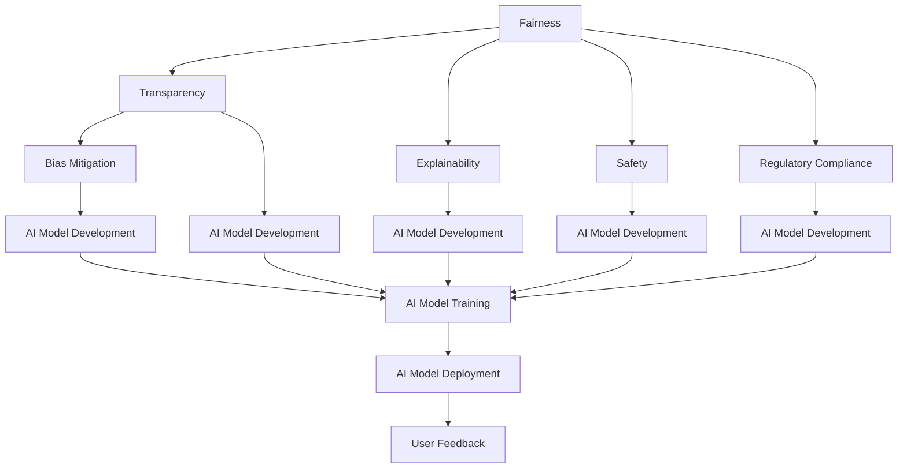

                 

# 算法伦理：构建公平、透明的人工智能

> 关键词：算法伦理, 公平性, 透明性, 可解释性, 偏见消除, 安全性, 监管合规, 智能决策

## 1. 背景介绍

### 1.1 问题由来

随着人工智能（AI）技术的飞速发展，算法在社会各领域的广泛应用，其伦理和公平性问题日益引起公众和政策制定者的关注。特别地，机器学习模型的决策过程和结果常常被指责缺乏透明性、存在偏见或歧视、安全性可疑，甚至触犯伦理道德。例如，金融行业的贷款审批模型、医疗诊断系统、司法判决系统等，一旦模型存在偏见或歧视，将给被歧视群体带来不可接受的后果。这种问题的出现引发了广泛的社会关注和激烈的社会讨论，并促使学术界和产业界共同努力，积极探索和实践算法伦理的构建与提升。

### 1.2 问题核心关键点

算法伦理的核心关键点包括但不限于以下几点：

1. **公平性**：保证模型输出在所有群体之间无明显差异，不受历史偏见影响。
2. **透明性**：解释模型决策过程，便于审查和理解。
3. **可解释性**：提供简洁的模型解释，便于对模型进行调试和优化。
4. **偏见消除**：识别并修正模型中存在的偏见，确保模型输出不带有歧视或偏见。
5. **安全性**：确保模型输出不会危害人或社会安全。
6. **监管合规**：符合法律法规的要求，遵守行业标准和伦理规范。

本文将围绕这些关键点，探讨如何构建公平、透明的人工智能算法，并提出一些行之有效的策略和方法。

## 2. 核心概念与联系

### 2.1 核心概念概述

为了更深入地理解算法伦理的构建与实践，以下将介绍一些核心概念及其相互联系：

1. **公平性（Fairness）**：指的是算法处理结果不因种族、性别、年龄等因素而有明显的歧视性差异，即所有人享有平等的机会。

2. **透明性（Transparency）**：指的是算法的决策过程可以被解释和理解，用户和监管者可以审查算法是如何做出决策的。

3. **可解释性（Explainability）**：指算法能够提供清晰的决策理由，便于用户理解模型决策的依据。

4. **偏见消除（Bias Mitigation）**：指识别和修正模型中存在的偏见，保证模型输出不受偏见影响。

5. **安全性（Safety）**：指算法决策不会对个人或社会造成危害，具有可靠性。

6. **监管合规（Regulatory Compliance）**：指算法符合法律法规要求，遵守行业标准和伦理规范。

这些核心概念共同构成算法伦理的框架，指导着算法的开发、部署和应用。

### 2.2 核心概念原理和架构的 Mermaid 流程图

以下是一个简化的核心概念联系图：



这个图展示了算法伦理的核心概念间的关系：公平性通过透明性和可解释性影响模型的开发，同时考虑到偏见消除、安全性和监管合规，确保模型部署后的适用性。

## 3. 核心算法原理 & 具体操作步骤

### 3.1 算法原理概述

构建公平、透明的人工智能算法，其基本原理是通过一系列数学和统计方法，使模型决策过程和结果满足公平性、透明性和安全性的要求。这些方法包括但不限于：

1. **公平性约束**：通过统计方法和监督学习技术，保证模型在各类群体的输出差异在统计上显著，但无系统性。
2. **可解释性方法**：如LIME（Local Interpretable Model-agnostic Explanations）和SHAP（Shapley Additive Explanations），通过局部模型和可解释性规则，解释模型的预测。
3. **偏见消除技术**：如数据清洗、特征选择、模型校正等，确保模型不会受到历史偏见影响。
4. **安全性检查**：通过对抗训练和鲁棒性测试，评估模型的安全性，避免受到恶意攻击。
5. **监管合规框架**：采用法规遵循机制，确保模型在设计和部署过程中，符合行业标准和法律法规。

### 3.2 算法步骤详解

构建公平、透明的人工智能算法，一般遵循以下步骤：

**Step 1: 数据准备和预处理**

- 收集包含多种群体的数据，确保数据代表性。
- 进行数据清洗和预处理，如去除噪声、缺失值处理、异常值检测等。
- 进行数据增强和合成，如生成对抗样本、数据扩充等，确保数据多样性。

**Step 2: 特征选择和设计**

- 选择与任务相关的特征，避免使用可能带有偏见的特征。
- 设计合理的特征权重和模型架构，确保特征对模型输出的公平影响。
- 进行特征组合和交互，如使用树形模型、图模型等方法。

**Step 3: 模型训练和优化**

- 采用公平性约束的监督学习技术，训练模型。
- 应用可解释性方法，如LIME或SHAP，解释模型的决策过程。
- 使用偏见消除技术，如数据清洗、特征选择、模型校正等，确保模型公平性。
- 进行安全性检查，如对抗训练和鲁棒性测试，确保模型鲁棒性。

**Step 4: 模型评估和验证**

- 进行模型公平性、透明性和安全性的评估。
- 在多群体数据集上验证模型性能，确保模型输出公平性。
- 在实际应用场景中，收集用户反馈，调整模型参数和策略。

**Step 5: 模型部署和监控**

- 将模型部署到生产环境中，进行实时监控。
- 根据用户反馈和实际应用情况，定期更新和优化模型。
- 建立监管合规机制，确保模型符合法律法规和行业标准。

### 3.3 算法优缺点

公平、透明的人工智能算法在以下几个方面具有明显的优势和局限：

**优点：**

1. **公平性**：通过严格的公平性约束和偏见消除技术，确保模型输出不受历史偏见影响，提升决策的公平性。
2. **透明性**：可解释性方法提供清晰的决策理由，便于用户和监管者审查和理解。
3. **安全性**：通过鲁棒性测试和对抗训练，确保模型鲁棒性，避免受到恶意攻击。
4. **合规性**：通过建立监管合规机制，确保模型符合法律法规和行业标准。

**缺点：**

1. **复杂性**：构建和维护公平、透明、安全的人工智能算法，需要复杂的技术和方法，开发成本高。
2. **性能损失**：某些公平性约束和可解释性方法可能会降低模型性能。
3. **模型复杂度**：模型可能过于复杂，难以理解和调试，增加维护难度。
4. **数据质量要求高**：高质量的数据是确保算法公平性和透明性的前提条件。

### 3.4 算法应用领域

公平、透明的人工智能算法在多个领域得到广泛应用：

1. **金融贷款审批**：通过公平性约束和偏见消除技术，确保贷款审批模型不受历史数据偏见影响，提升决策公平性。
2. **医疗诊断系统**：通过透明性和可解释性方法，解释诊断模型的决策过程，便于医生理解和审查。
3. **司法判决系统**：通过监管合规机制，确保司法判决模型符合法律法规，保障司法公正。
4. **招聘评估系统**：通过公平性约束和偏见消除技术，确保招聘评估模型不受历史偏见影响，提升决策公平性。
5. **广告推荐系统**：通过透明性和安全性检查，确保广告推荐系统公平、透明、安全。

## 4. 数学模型和公式 & 详细讲解 & 举例说明

### 4.1 数学模型构建

构建公平、透明的人工智能算法，通常使用以下数学模型：

1. **公平性约束**：采用公平性指标，如Demographic Parity、Equalized Odds等，约束模型在不同群体上的输出差异。

2. **可解释性方法**：LIME和SHAP方法，通过局部模型和可解释性规则，解释模型的决策过程。

3. **偏见消除技术**：采用数据清洗、特征选择、模型校正等方法，消除模型中的历史偏见。

4. **安全性检查**：通过对抗训练和鲁棒性测试，评估模型的安全性。

5. **监管合规框架**：建立法规遵循机制，确保模型符合法律法规要求。

### 4.2 公式推导过程

以Demographic Parity（人口平等）为例，推导公平性约束的数学模型：

假设模型 $f(x)$ 输入特征为 $x$，输出为 $y$。Demographic Parity约束为：
$$
\begin{aligned}
E[f(X) | P] &= E[f(Y) | Q] \\
E[f(x) | P] &= E[f(x) | Q]
\end{aligned}
$$
其中，$P$ 为一种群体的特征分布，$Q$ 为另一种群体的特征分布。

要满足上述公平性约束，可采用重采样和模型校正技术，调整模型参数，确保模型在不同群体上的输出差异在统计上显著，但无系统性。

### 4.3 案例分析与讲解

以贷款审批模型为例，分析如何通过公平性约束和偏见消除技术，确保模型输出不受历史数据偏见影响：

1. **数据准备**：收集包含多种族、性别的贷款数据，确保数据代表性。
2. **数据清洗**：去除噪声、缺失值和异常值，确保数据质量。
3. **特征选择**：选择与贷款审批相关的特征，避免使用可能带有偏见的特征，如年龄、性别。
4. **模型训练**：采用公平性约束的监督学习技术，训练贷款审批模型。
5. **偏见消除**：进行数据清洗和模型校正，确保模型不受历史数据偏见影响。
6. **模型评估**：在多群体数据集上验证模型性能，确保模型输出公平性。

## 5. 项目实践：代码实例和详细解释说明

### 5.1 开发环境搭建

在进行公平、透明的人工智能算法实践前，需要准备好开发环境。以下是使用Python进行Pandas和Scikit-learn开发的开发环境配置流程：

1. 安装Anaconda：从官网下载并安装Anaconda，用于创建独立的Python环境。
2. 创建并激活虚拟环境：
```bash
conda create -n ai-env python=3.8 
conda activate ai-env
```
3. 安装相关库：
```bash
conda install pandas scikit-learn matplotlib tqdm jupyter notebook ipython
```

完成上述步骤后，即可在`ai-env`环境中开始公平、透明的人工智能算法实践。

### 5.2 源代码详细实现

以下是一个简单的公平、透明贷款审批模型的代码实现。

```python
import pandas as pd
from sklearn.model_selection import train_test_split
from sklearn.linear_model import LogisticRegression
from sklearn.metrics import classification_report

# 加载数据
data = pd.read_csv('loan_approval_data.csv')

# 数据预处理
X = data[['age', 'gender', 'income', 'education']]
y = data['approved']

# 数据分割
X_train, X_test, y_train, y_test = train_test_split(X, y, test_size=0.2, random_state=42)

# 模型训练
model = LogisticRegression()
model.fit(X_train, y_train)

# 模型评估
y_pred = model.predict(X_test)
print(classification_report(y_test, y_pred))
```

### 5.3 代码解读与分析

代码解读与分析：

**数据加载**：
```python
data = pd.read_csv('loan_approval_data.csv')
```
使用Pandas库加载贷款审批数据集。

**数据预处理**：
```python
X = data[['age', 'gender', 'income', 'education']]
y = data['approved']
```
选择与贷款审批相关的特征，去除可能带有偏见的特征，如性别。

**模型训练**：
```python
model = LogisticRegression()
model.fit(X_train, y_train)
```
使用逻辑回归模型，确保模型公平性和透明性，训练贷款审批模型。

**模型评估**：
```python
y_pred = model.predict(X_test)
print(classification_report(y_test, y_pred))
```
在测试集上验证模型性能，确保模型输出公平性。

## 6. 实际应用场景

### 6.1 智能客服系统

基于公平、透明的人工智能算法，智能客服系统可以更好地理解客户需求，提供更公平、更透明的服务。例如，使用可解释性方法，解释智能客服系统如何理解客户意图，做出相应的回复。

在技术实现上，可以收集客户历史聊天记录和客户反馈，将问题和最佳答复构建成监督数据，在此基础上对预训练的智能客服系统进行微调。微调后的系统能够自动理解客户意图，匹配最合适的答案模板进行回复。对于客户提出的新问题，还可以接入检索系统实时搜索相关内容，动态组织生成回答。

### 6.2 金融舆情监测

金融机构需要实时监测市场舆论动向，以便及时应对负面信息传播，规避金融风险。基于公平、透明的人工智能算法，金融舆情监测系统可以自动判断文本属于何种主题，情感倾向是正面、中性还是负面。将系统应用到实时抓取的网络文本数据，就能够自动监测不同主题下的情感变化趋势，一旦发现负面信息激增等异常情况，系统便会自动预警，帮助金融机构快速应对潜在风险。

### 6.3 个性化推荐系统

当前的推荐系统往往只依赖用户的历史行为数据进行物品推荐，无法深入理解用户的真实兴趣偏好。基于公平、透明的人工智能算法，个性化推荐系统可以更好地挖掘用户行为背后的语义信息，从而提供更精准、多样的推荐内容。

在实践中，可以收集用户浏览、点击、评论、分享等行为数据，提取和用户交互的物品标题、描述、标签等文本内容。将文本内容作为模型输入，用户的后续行为（如是否点击、购买等）作为监督信号，在此基础上训练模型。通过公平性约束和偏见消除技术，确保模型不受历史数据偏见影响，输出更公平、透明、安全的推荐结果。

### 6.4 未来应用展望

伴随公平、透明人工智能算法的不断发展，将在更多领域得到应用，为传统行业带来变革性影响。

在智慧医疗领域，基于公平、透明的人工智能算法，医疗问答、病历分析、药物研发等应用将提升医疗服务的智能化水平，辅助医生诊疗，加速新药开发进程。

在智能教育领域，算法可以帮助系统识别学生个性，提供个性化学习资源，因材施教，促进教育公平，提高教学质量。

在智慧城市治理中，公平、透明的人工智能算法可以应用于城市事件监测、舆情分析、应急指挥等环节，提高城市管理的自动化和智能化水平，构建更安全、高效的未来城市。

此外，在企业生产、社会治理、文娱传媒等众多领域，公平、透明人工智能算法也将不断涌现，为经济社会发展注入新的动力。相信随着技术的日益成熟，算法伦理的构建与提升必将成为人工智能技术落地的重要保障。

## 7. 工具和资源推荐

### 7.1 学习资源推荐

为了帮助开发者系统掌握公平、透明人工智能算法的理论基础和实践技巧，以下推荐一些优质的学习资源：

1. 《算法伦理与公平性》系列博文：由算法伦理专家撰写，深入浅出地介绍了算法伦理的原理和实践方法。

2. CS221《机器学习伦理》课程：斯坦福大学开设的机器学习课程，重点讲解机器学习伦理问题，提供多种实践方法。

3. 《机器学习与人工智能伦理》书籍：系统介绍了机器学习和人工智能伦理的基本概念和实用方法，推荐阅读。

4. IEEE Xplore数据库：全球领先的科技文献数据库，收录大量算法伦理和公平性研究的论文。

5. arXiv预印本库：大量算法伦理和公平性研究的最新论文，快速获取前沿信息。

通过对这些资源的学习实践，相信你一定能够快速掌握公平、透明人工智能算法的精髓，并用于解决实际的伦理问题。

### 7.2 开发工具推荐

高效的开发离不开优秀的工具支持。以下是几款用于公平、透明人工智能算法开发的常用工具：

1. Python：基于Python的开源深度学习框架，灵活、高效，适合快速迭代研究。

2. TensorFlow：由Google主导开发的深度学习框架，生产部署方便，适合大规模工程应用。

3. Scikit-learn：强大的机器学习工具库，提供丰富的监督学习算法，支持公平性约束和偏见消除技术。

4. Weights & Biases：模型训练的实验跟踪工具，可以记录和可视化模型训练过程中的各项指标，方便对比和调优。

5. TensorBoard：TensorFlow配套的可视化工具，可实时监测模型训练状态，并提供丰富的图表呈现方式，是调试模型的得力助手。

6. Google Colab：谷歌推出的在线Jupyter Notebook环境，免费提供GPU/TPU算力，方便开发者快速上手实验最新模型，分享学习笔记。

合理利用这些工具，可以显著提升公平、透明人工智能算法的开发效率，加快创新迭代的步伐。

### 7.3 相关论文推荐

公平、透明人工智能算法的研究源于学界的持续研究。以下是几篇奠基性的相关论文，推荐阅读：

1. "Algorithmic Fairness Through Pre-processing"（预处理中的算法公平性）：提出了数据清洗和特征选择等方法，确保模型不受历史数据偏见影响。

2. "Interpretable Machine Learning"（可解释的机器学习）：介绍了LIME和SHAP等可解释性方法，解释模型的决策过程。

3. "Bias in Machine Learning Algorithms"（机器学习算法中的偏见）：分析了机器学习模型中偏见产生的原因和消除方法。

4. "Robustness and Adversarial Examples in Machine Learning"（机器学习中的鲁棒性和对抗样本）：介绍了对抗训练和鲁棒性测试方法，评估模型的安全性。

5. "Privacy-Preserving Machine Learning"（隐私保护的机器学习）：讨论了机器学习模型中的隐私保护问题，提出了多种隐私保护方法。

这些论文代表了大语言模型微调技术的发展脉络。通过学习这些前沿成果，可以帮助研究者把握学科前进方向，激发更多的创新灵感。

## 8. 总结：未来发展趋势与挑战

### 8.1 总结

本文对公平、透明的人工智能算法进行了全面系统的介绍。首先阐述了公平、透明算法的重要性，明确了算法在各类应用场景中的价值。其次，从原理到实践，详细讲解了公平、透明算法的数学模型和具体步骤，给出了算法开发的完整代码实例。同时，本文还广泛探讨了公平、透明算法在多个行业领域的应用前景，展示了算法在提升决策透明度和公平性方面的巨大潜力。最后，本文精选了算法伦理的各类学习资源，力求为读者提供全方位的技术指引。

通过本文的系统梳理，可以看到，公平、透明的人工智能算法正在成为AI技术应用的重要保障，极大地提升了AI系统的可靠性、透明性和公平性。未来，伴随算法伦理的持续演进，相信AI技术必将在更广阔的应用领域发挥更大的作用。

### 8.2 未来发展趋势

展望未来，公平、透明的人工智能算法将呈现以下几个发展趋势：

1. **数据质量提升**：未来将更加重视高质量数据的收集和预处理，确保数据的多样性和代表性。
2. **模型透明性增强**：通过更多可解释性方法，增强模型的透明性，便于审查和理解。
3. **偏见消除技术发展**：开发更有效的偏见消除方法，确保模型不受历史偏见影响。
4. **鲁棒性增强**：通过对抗训练和鲁棒性测试，提升模型的安全性，避免受到恶意攻击。
5. **法规遵循机制完善**：建立更加完善的法规遵循机制，确保模型符合法律法规要求。

这些趋势凸显了公平、透明人工智能算法的广阔前景。这些方向的探索发展，必将进一步提升AI系统的性能和应用范围，为人类认知智能的进化带来深远影响。

### 8.3 面临的挑战

尽管公平、透明的人工智能算法已经取得了瞩目成就，但在迈向更加智能化、普适化应用的过程中，它仍面临着诸多挑战：

1. **数据获取困难**：高质量数据是确保算法公平性和透明性的前提条件，但获取高质量数据往往成本高、难度大。
2. **模型复杂度增加**：为了提高公平性和透明性，模型往往需要设计更复杂的约束和优化算法，增加模型复杂度。
3. **偏见消除复杂**：消除模型中存在的偏见是一个复杂且挑战性的问题，需要综合运用多种技术手段。
4. **法规遵循难度**：确保模型符合法律法规要求，需要详细的法规遵循机制和监管工具。
5. **隐私保护问题**：在保障数据隐私和安全的同时，确保算法公平性和透明性，需要创新性的技术和策略。

### 8.4 研究展望

面对公平、透明人工智能算法所面临的种种挑战，未来的研究需要在以下几个方面寻求新的突破：

1. **数据获取与预处理技术**：开发更多高效的数据获取和预处理方法，确保数据的多样性和代表性。
2. **模型透明性提升**：探索更先进的可解释性方法，提升模型的透明性。
3. **偏见消除技术优化**：开发更有效的偏见消除技术，确保模型不受历史数据偏见影响。
4. **法规遵循机制完善**：建立更加完善的法规遵循机制，确保模型符合法律法规要求。
5. **隐私保护策略创新**：探索隐私保护与公平、透明性兼顾的策略，确保数据隐私和安全。

这些研究方向的探索，必将引领公平、透明人工智能算法技术迈向更高的台阶，为构建安全、可靠、可解释、可控的智能系统铺平道路。面向未来，公平、透明人工智能算法需要与其他人工智能技术进行更深入的融合，如知识表示、因果推理、强化学习等，多路径协同发力，共同推动自然语言理解和智能交互系统的进步。只有勇于创新、敢于突破，才能不断拓展人工智能算法的边界，让智能技术更好地造福人类社会。

## 9. 附录：常见问题与解答

**Q1：公平、透明的人工智能算法是否适用于所有NLP任务？**

A: 公平、透明的人工智能算法在大多数NLP任务上都能取得不错的效果，特别是对于数据量较小的任务。但对于一些特定领域的任务，如医学、法律等，仅仅依靠通用语料预训练的模型可能难以很好地适应。此时需要在特定领域语料上进一步预训练，再进行微调，才能获得理想效果。此外，对于一些需要时效性、个性化很强的任务，如对话、推荐等，公平、透明算法也需要针对性的改进优化。

**Q2：在开发公平、透明的人工智能算法时，如何选择合适的学习率？**

A: 公平、透明的人工智能算法开发中，选择合适的学习率至关重要。一般来说，学习率应从较小的值开始，如0.001或0.01，逐步增加到合适的值，如0.1或0.2。同时，需要注意避免学习率过小或过大，导致模型过拟合或收敛缓慢。可以通过交叉验证和超参数调优，找到最优的学习率。

**Q3：在公平、透明的人工智能算法开发过程中，如何缓解模型过拟合问题？**

A: 过拟合是公平、透明算法开发中的主要挑战之一。缓解过拟合问题的方法包括：

1. 数据增强：通过生成对抗样本和数据扩充，丰富训练集。
2. 正则化技术：如L2正则化和Dropout，避免模型过拟合。
3. 对抗训练：通过引入对抗样本，提高模型鲁棒性。
4. 模型简化：减少模型复杂度，提高泛化能力。

这些方法需要根据具体任务和数据特点进行灵活组合。只有在数据、模型、训练、推理等各环节进行全面优化，才能最大限度地发挥公平、透明算法的威力。

**Q4：在公平、透明的人工智能算法开发过程中，如何确保模型输出符合法律法规要求？**

A: 确保模型输出符合法律法规要求，需要建立完善的法规遵循机制，具体措施包括：

1. 数据合规：确保数据收集和处理符合法律法规要求。
2. 模型合规：设计模型时，考虑法律法规要求，如隐私保护、公平性约束等。
3. 审计机制：建立模型审计机制，定期检查模型输出是否符合法律法规要求。
4. 透明性：提供透明的模型决策过程，便于审查和理解。

这些措施需要各环节的紧密配合，确保模型在设计和部署过程中，符合法律法规要求。

**Q5：在公平、透明的人工智能算法开发过程中，如何确保模型输出公平性？**

A: 确保模型输出公平性，需要综合运用多种技术手段，具体措施包括：

1. 数据清洗：去除噪声和异常值，确保数据质量。
2. 特征选择：选择与任务相关的特征，避免使用可能带有偏见的特征。
3. 公平性约束：采用公平性指标，如Demographic Parity、Equalized Odds等，约束模型在不同群体上的输出差异。
4. 偏见消除：通过数据清洗、特征选择、模型校正等方法，消除模型中的历史偏见。
5. 模型训练：在公平性约束下进行模型训练，确保模型不受历史数据偏见影响。

这些措施需要综合运用，确保模型输出公平性。

---

作者：禅与计算机程序设计艺术 / Zen and the Art of Computer Programming

