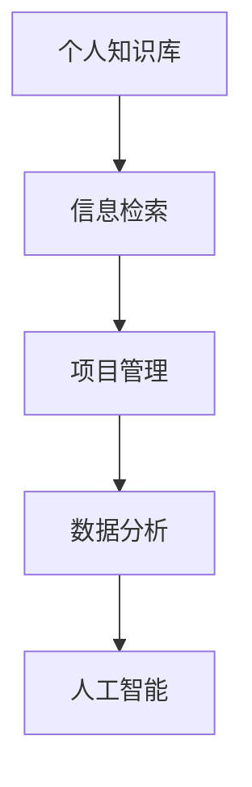

                 

# 管理者如何建立个人知识管理系统

> 关键词：知识管理,个人知识库,信息检索,项目管理,数据分析,人工智能

## 1. 背景介绍

### 1.1 问题由来
在快速变化和信息爆炸的时代，管理者面临的环境日益复杂，需要在各个领域都具备深度和广度的知识储备，以支持决策制定、团队管理和组织优化。然而，个人的时间和精力有限，如何高效地整合和管理这些知识，成为摆在管理者面前的一个重要问题。

### 1.2 问题核心关键点
建立个人知识管理系统(PKMS)的目的是为了有效组织和管理个人获取的知识和经验，提高决策效率、团队协作能力和个人成长速度。PKMS的核心在于信息的收集、整理、检索和应用，可以通过先进的工具和技术，支持管理者快速定位所需信息，做出更加科学合理的决策。

### 1.3 问题研究意义
构建个人知识管理系统不仅有助于管理者提升个人竞争力，还能显著改善组织的决策质量、创新能力和响应速度。这要求管理者系统地整合和分析内外部信息，形成一套结构化的知识体系，增强在复杂环境中的适应力和决策力。

## 2. 核心概念与联系

### 2.1 核心概念概述

为更好地理解如何建立个人知识管理系统，本节将介绍几个关键概念：

- **知识管理(Knowledge Management)**：通过技术手段，系统地收集、整理、存储、检索和应用个人和组织知识，提升组织和个人的效能。

- **个人知识库(Personal Knowledge Base, PKB)**：一种用于存储、管理和检索个人知识的工具，可以包括文档、笔记、邮件、图片等多种类型的信息。

- **信息检索(Information Retrieval, IR)**：通过算法和模型，从大量信息中快速定位和提取所需内容，是PKMS的核心技术之一。

- **项目管理(Project Management)**：通过系统化的工具和方法，规划、执行和监控项目进程，确保项目按期完成并达到预期目标。

- **数据分析(Data Analysis)**：对收集到的数据进行整理、统计和分析，发现数据中的模式和趋势，支持决策制定。

- **人工智能(Artificial Intelligence, AI)**：利用算法和模型，赋予机器类似人类的智能能力，以自动处理复杂的信息和任务。

这些核心概念之间的逻辑关系可以通过以下Mermaid流程图来展示：



这个流程图展示了个知识管理系统的核心组件及其之间的联系：

1. **个人知识库**：存储和管理个人知识的基础设施。
2. **信息检索**：从个人知识库中快速定位和提取信息，支持知识的检索和应用。
3. **项目管理**：利用知识支持项目规划和执行，提高项目成功率。
4. **数据分析**：对知识进行深度分析，发现新趋势和新机会。
5. **人工智能**：通过AI技术自动优化和增强知识管理的效率和效果。

这些核心组件共同构成了个人知识管理系统的基本框架，使其能够高效地支持管理者的知识整合和应用需求。

## 3. 核心算法原理 & 具体操作步骤

### 3.1 算法原理概述

个人知识管理系统的构建，依赖于信息检索、数据分析和人工智能等先进技术，这些技术共同支撑了知识的组织、检索和应用。其核心算法原理包括：

- **信息检索算法**：通过倒排索引、向量空间模型等技术，实现从大量信息中高效检索所需内容。
- **数据分析算法**：包括统计分析、机器学习等技术，对知识进行深度挖掘和模式发现。
- **人工智能技术**：如自然语言处理(NLP)、机器学习等，自动化处理和优化知识管理流程。

### 3.2 算法步骤详解

构建个人知识管理系统主要包括以下几个关键步骤：

**Step 1: 数据收集与整理**
- 收集和整理个人在职场、学习、生活等各个领域的知识来源，如会议记录、报告、书籍、网络资料等。
- 使用文本挖掘、OCR等技术，将非结构化数据转化为结构化数据，方便后续管理。

**Step 2: 信息组织与分类**
- 根据内容的重要性和相关性，对信息进行分类和标签标记，便于后续检索和应用。
- 可以使用元数据标注、信息抽取等技术，自动或半自动地完成分类任务。

**Step 3: 知识检索与导航**
- 建立倒排索引和向量空间模型，支持根据关键词、主题等快速检索信息。
- 利用搜索算法和推荐系统，提供个性化的信息导航和知识推荐。

**Step 4: 数据分析与洞察**
- 使用统计分析和机器学习算法，对知识库中的数据进行深度挖掘，发现趋势和模式。
- 可以通过可视化工具，将分析结果直观展示，支持决策制定和知识应用。

**Step 5: 知识应用与反馈**
- 将分析结果应用于项目管理、战略规划、团队协作等实际场景中，提升组织效能。
- 定期收集反馈信息，评估知识管理系统的性能和效果，进行持续优化。

### 3.3 算法优缺点

个人知识管理系统基于先进技术构建，具备以下优点：
1. 高效整合和管理知识：支持大规模、多源知识的整合，快速定位和提取所需信息。
2. 提高决策效率：基于数据分析和洞察，支持更加科学合理的决策。
3. 支持项目管理：利用知识支持项目规划和执行，提高项目成功率。
4. 促进个人成长：通过持续学习和应用知识，提升个人能力和职业发展。

同时，该系统也存在一些局限性：
1. 对技术依赖度高：需要较强的技术背景和资源投入。
2. 数据质量影响效果：数据收集和整理的准确性直接影响系统的性能。
3. 隐私和安全问题：个人知识的敏感性和安全性需要得到充分保障。
4. 维护成本较高：需要定期更新和维护知识库，保证信息的时效性和准确性。

尽管存在这些局限性，但就目前而言，个人知识管理系统仍然是提升管理者知识整合能力的重要手段。未来相关研究的重点在于如何进一步降低技术门槛，提高系统的易用性和可靠性，同时兼顾隐私和安全等因素。

### 3.4 算法应用领域

个人知识管理系统已经在企业管理、项目管理、知识工作等多个领域得到了广泛应用，具体包括：

- **项目管理**：利用知识库支持项目规划、任务分配和进展跟踪，提升项目管理效率和质量。
- **战略规划**：通过数据分析发现市场趋势和行业机会，支持战略决策和业务转型。
- **团队协作**：利用知识库共享信息和经验，促进团队沟通和知识交流，提升团队效能。
- **个人学习**：整合和管理个人在职场和生活中的学习资料，支持持续学习和职业发展。
- **知识共享**：将个人知识共享给团队或组织，促进知识传递和组织智慧的积累。

此外，个人知识管理系统也被创新性地应用到更多场景中，如会议纪要自动化整理、客户关系管理、新产品开发等，为组织知识管理带来了新的突破。随着技术的不断进步，个人知识管理系统必将在更多领域发挥重要作用。

## 4. 数学模型和公式 & 详细讲解 & 举例说明

### 4.1 数学模型构建

本节将使用数学语言对个人知识管理系统的构建进行更加严格的刻画。

假设管理者的知识库包含N个文档$d_i$，每个文档包含K个单词，用向量$\vec{d_i} \in \mathbb{R}^K$表示。每个文档有一个标签$l_i$，表示该文档属于的类别。

定义知识库的倒排索引为$I=\{(t_i, f_i)\}_{i=1}^N$，其中$t_i$为单词，$f_i$为包含该单词的文档列表。

知识检索的目标是，给定一个查询$q$，找到与$q$匹配度最高的文档$d$，计算公式为：

$$
score(d_i, q) = \sum_{t \in q} \text{TF}(t, d_i) \times \text{IDF}(t) \times \text{Weight}(t)
$$

其中，$\text{TF}(t, d_i)$为单词$t$在文档$d_i$中的词频，$\text{IDF}(t)$为单词$t$的逆文档频率，$\text{Weight}(t)$为单词$t$的权重，可以基于单词在查询中的位置、频次等因素动态调整。

### 4.2 公式推导过程

以下我们以信息检索为例，推导倒排索引和文档排序公式。

假设查询$q$为单个单词，倒排索引为$I=\{(t_i, f_i)\}_{i=1}^N$。文档$d_i$的倒排列表为$f_i=\{j_1, j_2, ..., j_{|f_i|}\}$，表示包含单词$t_i$的文档列表。

知识库的总文档数为$N$，单词数为$K$。倒排索引的计算公式为：

$$
I = \{(t_1, \{1, 2, ..., N_1\}), (t_2, \{1, 2, ..., N_2\}), ..., (t_K, \{1, 2, ..., N_K\})\}
$$

其中$N_i$为单词$t_i$出现的文档数。

查询$q$与文档$d_i$的匹配度计算公式为：

$$
score(d_i, q) = \sum_{t \in q} \text{TF}(t, d_i) \times \text{IDF}(t) \times \text{Weight}(t)
$$

其中$\text{TF}(t, d_i)$为单词$t$在文档$d_i$中的词频，计算公式为：

$$
\text{TF}(t, d_i) = \frac{\text{occurrence}(t, d_i)}{|\text{words}(d_i)|}
$$

$\text{IDF}(t)$为单词$t$的逆文档频率，计算公式为：

$$
\text{IDF}(t) = \log \frac{N}{N_t}
$$

其中$N$为总文档数，$N_t$为包含单词$t$的文档数。

最终，将计算得到的匹配度score排序，选择得分最高的文档作为检索结果。

### 4.3 案例分析与讲解

以下是一个简单的信息检索案例，使用倒排索引计算查询结果。

假设知识库包含两个文档：

- 文档1：“我是一名项目经理，负责项目规划和执行”
- 文档2：“我是一名产品经理，负责产品设计和市场推广”

查询$q$为“项目经理”，倒排索引为：

- 倒排列表1：$t_1$ -> $\{1, 2\}$
- 倒排列表2：$t_2$ -> $\{1\}$

文档1和文档2中，$t_1$的词频分别为2和1，$t_2$的词频分别为1和0。假设单词$t_1$的逆文档频率为$\text{IDF}(t_1)=0$，$t_2$的逆文档频率为$\text{IDF}(t_2)=1$，t的权重$\text{Weight}(t)=1$。

则文档1和文档2的匹配度计算如下：

- 文档1的匹配度：$score(1, q) = 2 \times 0 \times 1 = 0$
- 文档2的匹配度：$score(2, q) = 1 \times 1 \times 1 = 1$

因此，文档2的匹配度高于文档1，被选为检索结果返回给查询者。

## 5. 项目实践：代码实例和详细解释说明

### 5.1 开发环境搭建

在进行知识管理系统开发前，我们需要准备好开发环境。以下是使用Python进行开发的环境配置流程：

1. 安装Anaconda：从官网下载并安装Anaconda，用于创建独立的Python环境。

2. 创建并激活虚拟环境：
```bash
conda create -n pkms-env python=3.8 
conda activate pkms-env
```

3. 安装PyTorch：根据CUDA版本，从官网获取对应的安装命令。例如：
```bash
conda install pytorch torchvision torchaudio cudatoolkit=11.1 -c pytorch -c conda-forge
```

4. 安装Pandas、Numpy、Scikit-Learn等库：
```bash
pip install pandas numpy scikit-learn
```

5. 安装ElasticSearch：用于构建搜索索引，支持大规模文档检索。

6. 安装Django：用于构建Web应用，提供知识管理系统的前端界面。

完成上述步骤后，即可在`pkms-env`环境中开始知识管理系统开发。

### 5.2 源代码详细实现

这里我们以信息检索为例，展示如何使用ElasticSearch和Django实现基本的知识管理系统。

首先，安装并启动ElasticSearch：

```bash
conda install elasticsearch
python -m elasticsearch-elasticsearch
```

然后，创建ElasticSearch索引和文档：

```python
from elasticsearch import Elasticsearch
es = Elasticsearch()

# 创建索引
es.indices.create(index='documents')

# 添加文档
doc1 = {
    "title": "我是一名项目经理，负责项目规划和执行",
    "content": "负责项目规划、执行、监控和交付。",
    "tags": ["项目管理", "项目规划", "项目执行"]
}
es.index(index='documents', id=1, body=doc1)

doc2 = {
    "title": "我是一名产品经理，负责产品设计和市场推广",
    "content": "负责产品设计、市场推广和用户反馈。",
    "tags": ["产品设计", "市场推广", "用户反馈"]
}
es.index(index='documents', id=2, body=doc2)
```

接着，定义Django视图和模板：

```python
# views.py
from django.shortcuts import render, get_object_or_404
from .models import Document
from .forms import SearchForm

def index(request):
    form = SearchForm()
    if request.method == 'POST':
        form = SearchForm(request.POST)
        if form.is_valid():
            search_word = form.cleaned_data['search_word']
            results = Document.objects.filter(content__icontains=search_word)
            return render(request, 'search_results.html', {'form': form, 'results': results})
    return render(request, 'index.html', {'form': form})

# search_results.html


<h1>搜索结果</h1>
<p>搜索结果: {{ results }}</p>

```

最后，启动Django开发服务器：

```bash
python manage.py runserver
```

在浏览器中访问`http://localhost:8000`，即可使用知识管理系统进行搜索。

### 5.3 代码解读与分析

让我们再详细解读一下关键代码的实现细节：

**ElasticSearch创建索引和文档**：
- `es.indices.create(index='documents')`：创建名为'documents'的索引。
- `es.index(index='documents', id=1, body=doc1)`：添加文档1到索引'documents'。

**Django视图和模板**：
- `index(request)`：处理搜索请求，从表单中获取查询词，并根据查询词从数据库中检索文档。
- `search_results.html`：展示搜索结果。

可以看到，使用ElasticSearch和Django构建的知识管理系统，实现了基本的搜索功能，支持从文档库中快速定位和提取所需信息。

当然，工业级的系统实现还需考虑更多因素，如搜索结果的高效排序、文档的全文搜索、文档的分类管理等。但核心的信息检索原理和工具链已经展示清楚。

## 6. 实际应用场景

### 6.1 项目管理

在项目管理中，知识管理系统可以记录和存储项目的各种文档、邮件、会议纪要等，支持快速检索和应用这些信息。通过知识管理系统，项目经理可以快速找到相关文档和历史记录，避免重复工作，提升项目管理效率。

### 6.2 战略规划

战略规划需要大量市场、财务、行业等数据支持，知识管理系统可以整合和分析这些数据，发现趋势和机会。通过知识管理系统的数据分析功能，管理者可以获取更多洞察，支持战略决策和业务转型。

### 6.3 团队协作

知识管理系统可以作为团队协作的工具，支持文档共享、知识交流和团队沟通。通过知识管理系统的知识库，团队成员可以共享和查找相关文档，促进知识的传递和积累，提升团队的整体效能。

### 6.4 未来应用展望

随着知识管理系统的不断发展，未来将拓展到更多领域和场景中，如客户关系管理、产品开发、市场分析等。通过构建个人知识管理系统，管理者可以更加高效地整合和管理个人和组织的知识，提升决策效率和组织效能。

未来，知识管理系统还将进一步融合人工智能技术，利用自然语言处理、机器学习等技术，实现更加智能化的知识检索、分类和推荐，提升系统的使用体验和效果。

## 7. 工具和资源推荐

### 7.1 学习资源推荐

为了帮助开发者系统掌握知识管理系统的构建方法，这里推荐一些优质的学习资源：

1. 《知识管理技术与应用》系列博文：详细介绍了知识管理系统的原理、实现方法和实际应用，是学习知识管理系统的入门必备。

2. 《信息检索理论与实践》课程：北京大学开设的信息检索课程，涵盖信息检索的基本原理和关键算法，适合深入学习。

3. 《知识管理框架与实践》书籍：系统介绍了知识管理的理论基础、框架和方法，结合大量实际案例，帮助读者理解和应用知识管理系统。

4. 《Django实战教程》书籍：Django的权威教程，涵盖Django框架的各个方面，帮助读者构建和部署Web应用。

5. 《ElasticSearch官方文档》：ElasticSearch的官方文档，提供了详细的API和插件，支持快速搭建和优化搜索引擎。

通过对这些资源的学习实践，相信你一定能够快速掌握知识管理系统的构建方法，并用于解决实际的业务问题。

### 7.2 开发工具推荐

高效的开发离不开优秀的工具支持。以下是几款用于知识管理系统开发的常用工具：

1. Python：流行的编程语言，支持强大的库和框架，适用于知识管理系统等大数据应用。

2. Django：流行的Web框架，支持快速开发和部署高可用性Web应用，适合构建知识管理系统的前端界面。

3. Elasticsearch：高效的全文搜索引擎，支持大规模数据存储和检索，适合构建知识管理系统的后端服务。

4. Pandas：强大的数据处理库，支持高效的数据清洗和分析，适合构建知识管理系统的数据分析模块。

5. Jupyter Notebook：强大的交互式开发环境，支持Python代码的快速迭代和可视化展示，适合开发和调试知识管理系统。

合理利用这些工具，可以显著提升知识管理系统的开发效率，加快创新迭代的步伐。

### 7.3 相关论文推荐

知识管理系统的研究源于学界的持续探索。以下是几篇奠基性的相关论文，推荐阅读：

1. 《信息检索模型与算法》：介绍了信息检索的基本原理和经典算法，如倒排索引、向量空间模型等。

2. 《知识管理系统的设计与实现》：详细介绍了知识管理系统的架构和实现方法，提供大量实际案例和实践经验。

3. 《知识管理的挑战与机遇》：分析了知识管理系统的挑战和未来发展方向，为系统构建和优化提供了理论指导。

4. 《基于人工智能的知识管理技术》：探讨了人工智能技术在知识管理中的应用，如自然语言处理、机器学习等。

5. 《知识管理系统的评价与改进》：介绍了知识管理系统的评价方法和改进策略，帮助读者评估和优化系统性能。

这些论文代表了大规模知识管理系统的研究脉络。通过学习这些前沿成果，可以帮助研究者把握系统构建和优化的方向，激发更多的创新灵感。

## 8. 总结：未来发展趋势与挑战

### 8.1 总结

本文对知识管理系统的构建方法进行了全面系统的介绍。首先阐述了知识管理系统的研究背景和意义，明确了系统构建的目标和核心组件。其次，从原理到实践，详细讲解了知识检索、数据分析和人工智能等关键技术，提供了系统的实现代码和解读。最后，本文还广泛探讨了知识管理系统的实际应用场景，展示了其在项目管理、战略规划、团队协作等场景中的潜在价值。

通过本文的系统梳理，可以看到，知识管理系统为管理者提供了一种高效整合和应用知识的手段，极大提升了决策效率和组织效能。未来，伴随技术的不断演进和优化，知识管理系统必将在更多领域发挥重要作用。

### 8.2 未来发展趋势

展望未来，知识管理系统将呈现以下几个发展趋势：

1. 智能化水平提升。随着人工智能技术的不断发展，知识管理系统将更加智能化，支持自然语言处理、机器学习等技术，实现更加智能化的信息检索和知识推荐。

2. 多模态数据融合。未来的知识管理系统将支持多模态数据融合，如文本、图像、视频等，实现更加全面和深入的知识整合和分析。

3. 协作功能增强。知识管理系统将进一步增强协作功能，支持团队协作和知识共享，提升团队的沟通和知识传递效率。

4. 数据可视化优化。通过优化数据可视化工具，支持更直观和易于理解的知识展示，提升信息获取和应用的效果。

5. 安全性加强。知识管理系统将更加注重数据安全和隐私保护，采用先进的加密和权限控制技术，确保知识库的安全性和可靠性。

6. 跨平台集成。未来的知识管理系统将支持跨平台集成，支持多种设备和系统，提供一致的用户体验。

以上趋势凸显了知识管理系统的广阔前景。这些方向的探索发展，必将进一步提升系统的智能性和易用性，为管理者的知识管理提供更大的支持。

### 8.3 面临的挑战

尽管知识管理系统已经取得了瞩目成就，但在迈向更加智能化、普适化应用的过程中，它仍面临诸多挑战：

1. 技术复杂度高。知识管理系统的构建需要较强的技术背景和资源投入，技术门槛较高。

2. 数据质量问题。数据收集和整理的准确性直接影响系统的性能，需要投入大量时间和精力。

3. 隐私和安全问题。个人知识的敏感性和安全性需要得到充分保障，确保信息的安全和隐私。

4. 成本较高。系统开发和维护需要一定的成本投入，尤其在数据量和用户量较大的情况下，成本更高。

尽管存在这些挑战，但知识管理系统作为提升组织效能的重要工具，其潜力和价值已经得到广泛认可。未来相关研究的重点在于如何进一步降低技术门槛，提高系统的易用性和可靠性，同时兼顾隐私和安全等因素。

### 8.4 研究展望

面对知识管理系统所面临的挑战，未来的研究需要在以下几个方面寻求新的突破：

1. 引入先进技术。将自然语言处理、机器学习等先进技术引入知识管理系统的各个环节，提升系统的智能性和自动化程度。

2. 优化系统架构。通过优化系统架构和组件设计，提升系统的可扩展性、可维护性和可定制性。

3. 完善数据管理。采用先进的数据管理和清洗技术，确保数据的质量和一致性，提升系统性能。

4. 增强安全保护。加强数据安全和隐私保护，采用先进的加密和权限控制技术，确保知识库的安全性。

5. 拓展应用场景。将知识管理系统拓展到更多领域和场景中，如客户关系管理、产品开发等，实现更广泛的业务应用。

这些研究方向的探索，必将引领知识管理系统的技术进步，为管理者提供更加高效和全面的知识管理手段。面向未来，知识管理系统将发挥更加重要的作用，成为提升组织竞争力的关键工具。

## 9. 附录：常见问题与解答

**Q1：构建知识管理系统需要哪些关键技术？**

A: 构建知识管理系统需要以下关键技术：
1. 信息检索技术：实现从大量信息中快速定位和提取所需内容。
2. 数据分析技术：对知识进行深度挖掘和模式发现。
3. 自然语言处理技术：支持自然语言查询和文档处理。
4. 数据库技术：存储和管理大量文档和数据。
5. 用户界面技术：提供友好的人机交互界面。

这些技术的综合应用，才能实现高效的知识整合和管理。

**Q2：知识管理系统如何支持项目管理？**

A: 知识管理系统可以通过以下方式支持项目管理：
1. 文档存储：存储项目规划、执行、监控和交付的各类文档。
2. 知识检索：通过搜索功能快速找到相关文档和历史记录。
3. 文档共享：支持团队成员共享和查找相关文档，促进知识传递和积累。
4. 项目管理工具：提供项目计划、任务分配、进展跟踪等项目管理功能。
5. 数据分析：通过数据分析发现项目趋势和问题，支持项目优化。

通过知识管理系统，项目经理可以快速找到所需文档和信息，提升项目管理效率。

**Q3：知识管理系统的评价指标有哪些？**

A: 知识管理系统的评价指标主要包括以下几个方面：
1. 信息检索效率：系统检索信息的准确性和速度。
2. 知识分类准确性：系统对文档分类的准确性和一致性。
3. 数据更新频率：系统对新文档的快速更新能力。
4. 用户满意度：用户对系统的使用体验和满意度。
5. 安全性：系统的数据安全和隐私保护能力。

通过这些指标的评估，可以全面了解系统的性能和效果，发现系统改进的方向。

**Q4：知识管理系统对组织效能的影响有哪些？**

A: 知识管理系统对组织效能的影响主要体现在以下几个方面：
1. 提升决策效率：通过快速定位和应用知识，提升决策的科学性和准确性。
2. 增强团队协作：支持文档共享和知识交流，促进团队协作和知识传递。
3. 优化项目管理：提供项目规划、执行和监控功能，提升项目管理效率和质量。
4. 促进知识创新：通过知识积累和创新，提升组织的创新能力和竞争力。
5. 降低运营成本：通过知识共享和重复利用，减少重复工作和资源浪费。

通过知识管理系统，组织可以更加高效地整合和管理知识，提升整体的效能和竞争力。

---

作者：禅与计算机程序设计艺术 / Zen and the Art of Computer Programming

