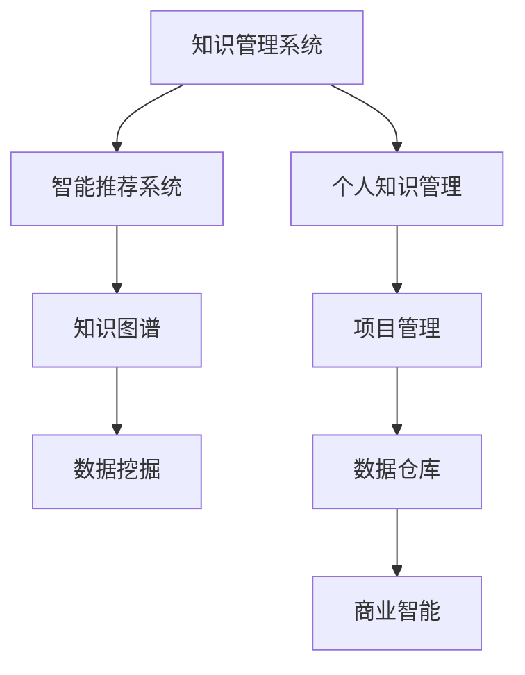

                 

# 管理者如何建立个人知识管理系统

> 关键词：知识管理系统, 个人知识管理, 智能推荐系统, 知识图谱, 数据挖掘, 项目管理, 数据仓库, 商业智能(BI)

## 1. 背景介绍

### 1.1 问题由来
在信息爆炸的时代，个人和团队面临着海量的数据和信息。如何高效地整理、存储、检索和利用这些信息，成为现代管理者必须面对的挑战。信息化的时代要求管理者不仅要具备卓越的领导和管理能力，还要具备信息管理的意识和技术。管理者如何建立有效的个人知识管理系统，利用先进的信息技术提升个人和团队的工作效率，是现代管理中一个重要的课题。

### 1.2 问题核心关键点
建立一个有效的个人知识管理系统，需要明确几个核心关键点：

1. 数据收集：如何高效地从各种来源收集信息，包括在线文档、电子邮件、会议记录、社交网络等。
2. 数据整理：如何对收集到的数据进行分类、标记、归档，使其便于检索和管理。
3. 数据存储：如何选择合适的存储介质和工具，保证数据的可靠性和安全性。
4. 数据检索：如何设计高效的检索方式，快速找到需要的信息。
5. 数据应用：如何将数据转化为可操作的决策支持，提高个人和团队的工作效率。
6. 系统维护：如何持续地维护和更新知识管理系统，适应不断变化的信息需求。

### 1.3 问题研究意义
建立一个高效的个人知识管理系统，对个人和团队的成长有着深远的意义：

1. 提升效率：通过自动化信息处理，管理者可以节省大量时间，专注于更重要的战略决策。
2. 促进创新：系统化的信息管理使得管理者能够更容易地发现潜在的趋势和机会，促进创新。
3. 增强协作：系统化的知识管理为团队提供共享信息的基础，提高协作效率。
4. 增强决策支持：系统化的知识管理能够提供准确、全面的数据支持，提升决策质量。
5. 增强学习能力：系统化的知识管理促进持续学习和个人成长，提升竞争力。

## 2. 核心概念与联系

### 2.1 核心概念概述

为更好地理解个人知识管理系统的构建，本节将介绍几个密切相关的核心概念：

- 知识管理系统(Knowledge Management System, KMS)：用于管理和利用组织知识的系统，包括知识的收集、整理、存储、检索和应用等环节。
- 个人知识管理(Individual Knowledge Management, IKM)：个人层面的知识管理，包括知识收集、整理、存储、检索和应用等，旨在提升个人工作效率和学习能力。
- 智能推荐系统(Recommender System)：基于用户行为和偏好，自动推荐相关信息，提高知识检索的效率和准确性。
- 知识图谱(Knowledge Graph)：通过语义关系将知识表示为图形结构，便于查询和推理，支持更深入的知识应用。
- 数据挖掘(Data Mining)：从大量数据中提取有用信息，发现数据间的关系和趋势，支持更精确的知识分析。
- 项目管理(Project Management)：用于规划、执行和监控项目，确保项目按时、按预算和质量完成，支持知识的应用和验证。
- 数据仓库(Data Warehouse)：集中存储企业业务数据的仓库，支持历史数据管理和查询，为知识分析提供基础数据支持。
- 商业智能(Business Intelligence, BI)：利用数据仓库和分析工具，为企业决策提供支持，帮助管理者做出更好的业务决策。

这些核心概念之间的逻辑关系可以通过以下Mermaid流程图来展示：



这个流程图展示了个体知识管理的核心概念及其之间的关系：

1. 知识管理系统提供全局的知识管理支持，包括数据收集、存储、检索等。
2. 个人知识管理关注个体层面的知识管理，通过智能推荐、知识图谱等技术提升个人效率。
3. 智能推荐系统利用用户行为和偏好，自动推荐相关信息，提高知识检索效率。
4. 知识图谱通过语义关系将知识表示为图形结构，便于查询和推理。
5. 数据挖掘从大量数据中提取有用信息，发现数据间的关系和趋势。
6. 项目管理支持知识的应用和验证，确保项目按时、按预算和质量完成。
7. 数据仓库集中存储企业业务数据，为知识分析提供基础数据支持。
8. 商业智能利用数据仓库和分析工具，为企业决策提供支持。

这些概念共同构成了知识管理的系统框架，为其在个人和团队中的应用提供了理论基础。

## 3. 核心算法原理 & 具体操作步骤
### 3.1 算法原理概述

个人知识管理系统的构建，本质上是一个信息收集、整理、存储、检索和应用的过程。其核心思想是利用先进的信息技术和数据处理算法，将知识以高效、结构化的方式进行管理和利用。

形式化地，假设我们需要管理的知识数据集为 $K=\{k_i\}_{i=1}^N$，其中 $k_i$ 为知识节点，可能包含文档、图片、会议记录等。知识管理系统通过以下步骤对数据进行收集、整理、存储、检索和应用：

1. **数据收集**：从各种来源收集知识数据，如电子邮件、社交媒体、会议记录等。
2. **数据整理**：对收集到的数据进行清洗、分类、标记和归档。
3. **数据存储**：选择合适的存储介质和工具，保证数据的可靠性和安全性。
4. **数据检索**：设计高效的检索方式，快速找到需要的信息。
5. **数据应用**：将数据转化为可操作的决策支持，提高个人和团队的工作效率。
6. **系统维护**：持续地维护和更新知识管理系统，适应不断变化的信息需求。

### 3.2 算法步骤详解

建立一个高效的个人知识管理系统，一般包括以下几个关键步骤：

**Step 1: 选择知识管理系统平台**
- 根据个人需求和预算，选择合适的知识管理软件，如Confluence、Evernote、Microsoft OneNote等。
- 了解平台的功能和特点，如文档存储、标签管理、搜索功能等。

**Step 2: 收集知识数据**
- 确定需要收集的知识类型，如会议记录、电子邮件、社交媒体等。
- 利用平台提供的导入功能，将数据导入知识管理系统。

**Step 3: 整理和标记数据**
- 对收集到的数据进行清洗、分类、标记和归档。
- 使用平台的标签、文件夹等工具，对数据进行结构化组织。

**Step 4: 存储和管理数据**
- 选择合适的存储介质，如云端存储、本地存储等。
- 定期备份数据，确保数据的安全性和可恢复性。

**Step 5: 设计和实现检索系统**
- 设计高效的检索方式，如搜索、过滤、排序等。
- 利用平台提供的查询功能，实现快速、准确的检索。

**Step 6: 应用和分享知识**
- 将检索到的知识应用于决策支持，提升个人和团队的工作效率。
- 分享知识，促进团队协作和学习，扩展个人知识库。

**Step 7: 持续维护和优化**
- 定期评估和改进知识管理系统，确保其适应不断变化的需求。
- 根据新数据和需求，更新知识库，提升系统的实用性和效率。

### 3.3 算法优缺点

建立一个高效的个人知识管理系统，具有以下优点：

1. **提升效率**：自动化信息处理，节省时间，专注于战略决策。
2. **促进创新**：系统化的信息管理促进发现趋势和机会，促进创新。
3. **增强协作**：系统化的知识管理支持信息共享，提高协作效率。
4. **增强决策支持**：系统化的知识管理提供准确数据支持，提升决策质量。
5. **增强学习能力**：系统化的知识管理促进持续学习和个人成长，提升竞争力。

同时，该方法也存在一定的局限性：

1. **初始成本高**：选择合适的知识管理平台和软件，并进行数据导入和整理，需要一定的初始投入。
2. **操作复杂**：系统使用和管理需要一定的学习和适应过程。
3. **依赖平台**：系统的效果很大程度上取决于平台的功能和可靠性。
4. **数据隐私和安全**：知识管理涉及敏感数据，需要采取安全措施保护隐私。

尽管存在这些局限性，但就目前而言，个人知识管理系统仍是提升个人和团队工作效率的重要工具。未来相关研究的重点在于如何进一步降低使用成本，提高系统易用性，同时兼顾数据隐私和安全等因素。

### 3.4 算法应用领域

个人知识管理系统在多个领域得到了广泛应用，例如：

- 项目管理：通过整理和检索项目相关的知识，支持项目规划、执行和监控，提升项目管理的效率和质量。
- 技术开发：利用知识管理系统存储和检索技术文档、代码库等，支持技术开发和学习。
- 业务分析：通过知识管理系统的数据分析功能，支持业务决策和商业智能应用。
- 个人学习：系统化的知识管理帮助个人积累和整理学习资料，促进持续学习。
- 医疗管理：通过知识管理系统存储和检索医疗知识，支持医疗决策和研究。
- 教育培训：利用知识管理系统存储和检索教学资料，支持教学和学习。

除了上述这些经典应用外，个人知识管理系统还被创新性地应用到更多场景中，如智能推荐、数据可视化、协作平台等，为知识管理的深度应用提供了新的可能性。

## 4. 数学模型和公式 & 详细讲解 & 举例说明

### 4.1 数学模型构建

本节将使用数学语言对个人知识管理系统的构建进行更加严格的刻画。

假设我们需要管理的知识数据集为 $K=\{k_i\}_{i=1}^N$，其中 $k_i$ 为知识节点，可能包含文档、图片、会议记录等。知识管理系统通过以下步骤对数据进行收集、整理、存储、检索和应用：

1. **数据收集**：从各种来源收集知识数据，如电子邮件、社交媒体、会议记录等。
2. **数据整理**：对收集到的数据进行清洗、分类、标记和归档。
3. **数据存储**：选择合适的存储介质和工具，保证数据的可靠性和安全性。
4. **数据检索**：设计高效的检索方式，快速找到需要的信息。
5. **数据应用**：将数据转化为可操作的决策支持，提高个人和团队的工作效率。
6. **系统维护**：持续地维护和更新知识管理系统，适应不断变化的信息需求。

### 4.2 公式推导过程

以下我们以文本知识管理为例，推导搜索系统的数学模型及其梯度计算公式。

假设知识管理系统中的文本知识库为 $K=\{d_i\}_{i=1}^M$，其中 $d_i$ 为文档。文档的特征表示为向量 $v_i \in \mathbb{R}^D$，其中 $D$ 为特征维度。用户输入查询 $q$，我们希望计算出与查询最相关的文档 $d_k$，即：

$$
k=\mathop{\arg\min}_{i} \|v_i - q\|^2
$$

其中 $\| \cdot \|^2$ 为欧式距离。通过最小化欧式距离，我们可以找到与查询最相关的文档。

对于大规模知识库，直接计算欧式距离将非常耗时。一种高效的解决方案是使用倒排索引(Inverted Index)技术，将文档特征向量 $v_i$ 按照每个特征进行倒排，构建倒排索引表 $I$。倒排索引表的结构如下：

$$
I = \{(i, j, v_i[j])\}_{i=1}^M \quad \text{and} \quad j \in \{1, \ldots, D\}
$$

其中 $(i, j, v_i[j])$ 表示文档 $i$ 在特征 $j$ 上的取值。通过倒排索引表，查询 $q$ 的欧式距离计算可以转换为：

$$
d_k = \mathop{\arg\min}_{i} \sum_{j=1}^D (q[j] - v_i[j])^2
$$

在得到最相关的文档后，我们可以通过检索系统获取文档内容，进行进一步的分析应用。

### 4.3 案例分析与讲解

以下我们以Google Scholar为例，分析其搜索系统的数学模型。

Google Scholar的搜索系统采用了基于向量空间模型(Vector Space Model, VSM)的检索方法。具体步骤如下：

1. 对每篇文档进行分词和向量化，得到文档向量 $v_i$。
2. 对每个查询词进行分词和向量化，得到查询向量 $q$。
3. 计算查询向量与文档向量的欧式距离，找到最相关的文档 $d_k$。
4. 根据文档的相关度排序，展示搜索结果。

通过VSM模型，Google Scholar能够高效地处理大规模的文本数据，为用户提供精准的搜索结果。

## 5. 项目实践：代码实例和详细解释说明
### 5.1 开发环境搭建

在进行知识管理系统的开发前，我们需要准备好开发环境。以下是使用Python进行Flask框架开发的环境配置流程：

1. 安装Anaconda：从官网下载并安装Anaconda，用于创建独立的Python环境。

2. 创建并激活虚拟环境：
```bash
conda create -n flask-env python=3.8 
conda activate flask-env
```

3. 安装Flask：
```bash
pip install Flask
```

4. 安装Flask-RESTful：
```bash
pip install Flask-RESTful
```

5. 安装Flask-SQLAlchemy：
```bash
pip install Flask-SQLAlchemy
```

6. 安装Flask-WTF：
```bash
pip install Flask-WTF
```

7. 安装Werkzeug：
```bash
pip install Werkzeug
```

完成上述步骤后，即可在`flask-env`环境中开始知识管理系统的开发。

### 5.2 源代码详细实现

下面我们以Flask构建的简单知识管理系统为例，给出完整的代码实现。

首先，定义Flask应用和数据库：

```python
from flask import Flask, request, jsonify
from flask_sqlalchemy import SQLAlchemy
from flask_wtf import FlaskForm
from flask_ckit import FileUploadSet

app = Flask(__name__)
app.config['SQLALCHEMY_DATABASE_URI'] = 'sqlite:///./database.db'
db = SQLAlchemy(app)

class Document(db.Model):
    id = db.Column(db.Integer, primary_key=True)
    name = db.Column(db.String(100), nullable=False)
    content = db.Column(db.Text, nullable=False)
    tags = db.Column(db.String(100), nullable=True)

class Tag(db.Model):
    id = db.Column(db.Integer, primary_key=True)
    name = db.Column(db.String(100), nullable=False)
    documents = db.relationship('Document', backref='tags', lazy='dynamic')

class UploadSet(FileUploadSet)
    def __init__(self, name, upload_dir, allowed_extensions):
        super(UploadSet, self).__init__()
        self.name = name
        self.upload_dir = upload_dir
        self.allowed_extensions = allowed_extensions
```

然后，定义Flask表单和路由：

```python
class DocumentForm(FlaskForm):
    name = StringField('Name', required=True)
    content = TextAreaField('Content', required=True)
    tags = StringField('Tags', default='', render_kw={'placeholder': 'e.g., project, python'})

@app.route('/')
def index():
    return render_template('index.html')

@app.route('/documents', methods=['GET', 'POST'])
def documents():
    form = DocumentForm()
    if form.validate_on_submit():
        document = Document(name=form.name.data, content=form.content.data)
        document.tags.append(tag)
        db.session.add(document)
        db.session.commit()
        flash('Document created successfully.')
        return redirect('/')
    return render_template('documents.html', form=form)

@app.route('/documents/<int:id>', methods=['GET'])
def document(id):
    document = Document.query.get_or_404(id)
    return render_template('document.html', document=document)
```

最后，定义数据库初始化和应用启动：

```python
@app.before_first_request
def init_db():
    db.create_all()

if __name__ == '__main__':
    app.run(debug=True)
```

### 5.3 代码解读与分析

让我们再详细解读一下关键代码的实现细节：

**Flask应用**：
- 初始化Flask应用，配置数据库连接。
- 定义数据库模型，包括文档和标签。

**Flask表单**：
- 定义文档表单，包括名称、内容和标签。
- 使用Flask-WTF框架，实现表单验证。

**路由定义**：
- 定义主页路由，展示文档列表。
- 定义文档创建路由，创建文档并添加标签。
- 定义文档详情路由，展示单个文档。

**数据库初始化**：
- 在应用启动前，初始化数据库。
- 通过Flask-SQLAlchemy实现模型与数据库的映射。

这些代码实现了基本的知识管理系统功能，包括文档的创建、展示和标签管理。尽管功能较为简单，但可以作为一个基础模板，供开发者进一步扩展和优化。

## 6. 实际应用场景
### 6.1 项目管理
在项目管理中，个人知识管理系统可以用于存储和检索项目相关的文档、计划、任务等。通过系统化的管理，管理者可以更高效地规划、执行和监控项目，确保项目按时、按预算和质量完成。

以Trello为例，利用知识管理系统存储项目文档和任务，可以在Trello中使用文档链接进行快速浏览和查阅。同时，通过标签和文件夹管理，对项目文档进行分类和归档，提升项目管理的效率。

### 6.2 技术开发
在技术开发中，个人知识管理系统可以用于存储和检索技术文档、代码库、测试用例等。通过系统化的管理，开发者可以更高效地进行技术学习和代码开发。

以GitHub为例，利用知识管理系统存储GitHub代码库和文档，可以在GitHub中使用代码链接进行快速查看和对比。同时，通过标签和文件夹管理，对代码库进行分类和归档，提升代码管理和版本控制的能力。

### 6.3 业务分析
在业务分析中，个人知识管理系统可以用于存储和检索业务数据、报表、分析文档等。通过系统化的管理，管理者可以更高效地进行业务决策和商业智能应用。

以Tableau为例，利用知识管理系统存储业务数据和报表，可以在Tableau中使用数据链接进行快速查询和分析。同时，通过标签和文件夹管理，对报表和文档进行分类和归档，提升业务分析和决策的能力。

### 6.4 未来应用展望
随着知识管理系统的不断演进，其在未来将有更广泛的应用前景：

1. **智能推荐系统**：结合用户行为和偏好，自动推荐相关信息，提高知识检索的效率和准确性。
2. **知识图谱**：通过语义关系将知识表示为图形结构，便于查询和推理，支持更深入的知识应用。
3. **数据挖掘**：从大量数据中提取有用信息，发现数据间的关系和趋势，支持更精确的知识分析。
4. **个性化学习**：根据用户的学习行为和偏好，推荐个性化学习资源，提升学习效果。
5. **多模态知识管理**：融合文本、图片、视频、音频等多模态信息，提升知识管理的全面性和深入性。
6. **跨平台协作**：支持多设备、多平台访问，促进团队协作和学习。

这些方向的探索，将使得知识管理系统更加智能、全面和易用，为个人和团队提供更高效、更便捷的知识管理支持。

## 7. 工具和资源推荐
### 7.1 学习资源推荐

为了帮助开发者系统掌握知识管理系统的构建和应用，这里推荐一些优质的学习资源：

1. **《构建知识管理系统》系列博文**：由知识管理领域的专家撰写，深入浅出地介绍了知识管理系统的基本概念和构建方法。

2. **《信息管理与知识管理》课程**：斯坦福大学开设的信息管理课程，涵盖了知识管理的基本理论和实践。

3. **《知识管理与信息检索》书籍**：介绍知识管理的基本理论和实践，重点讲解信息检索技术。

4. **Konceptum软件**：一款优秀的知识管理软件，支持文档存储、标签管理、搜索等功能。

5. **Evernote文档管理**：一款简单易用的文档管理软件，支持文档存储、标签管理、搜索等功能。

通过对这些资源的学习实践，相信你一定能够快速掌握知识管理系统的精髓，并用于解决实际的业务问题。

### 7.2 开发工具推荐

高效的开发离不开优秀的工具支持。以下是几款用于知识管理系统的常用工具：

1. **Flask框架**：轻量级的Python Web框架，易于上手，适合快速开发知识管理系统。

2. **Django框架**：全功能的Python Web框架，支持数据库管理、表单验证等功能，适合开发复杂应用。

3. **JIRA**：一款流行的项目管理工具，支持任务分配、进度跟踪等功能，适合集成知识管理系统。

4. **Tableau**：一款强大的商业智能工具，支持数据可视化、报表分析等功能，适合集成知识管理系统。

5. **Confluence**：一款广泛使用的协作工具，支持文档存储、标签管理、搜索等功能，适合集成知识管理系统。

合理利用这些工具，可以显著提升知识管理系统的开发效率，加快创新迭代的步伐。

### 7.3 相关论文推荐

知识管理系统和知识管理的理论研究已有众多经典论文，以下是几篇奠基性的相关论文，推荐阅读：

1. **《知识管理：过去、现在和未来》**：介绍知识管理的理论基础和发展历史，概述知识管理的未来趋势。

2. **《知识管理系统的构建与评估》**：详细讲解知识管理系统的构建方法和评估指标，提供实际应用的案例分析。

3. **《信息检索与知识管理》**：介绍信息检索和知识管理的基本理论和应用，重点讲解智能推荐系统。

4. **《知识管理与信息检索系统》**：介绍知识管理系统的基本理论和实践，重点讲解信息检索技术。

5. **《跨领域知识管理研究》**：介绍跨领域知识管理的理论和方法，探讨多模态知识管理的实践应用。

这些论文代表了大规模知识管理系统构建的理论基础，提供了丰富的实践经验和案例分析，对系统构建和优化具有重要的指导意义。

## 8. 总结：未来发展趋势与挑战
### 8.1 总结

本文对知识管理系统及其构建方法进行了全面系统的介绍。首先阐述了知识管理系统的研究背景和意义，明确了系统构建的关键点和步骤。其次，从原理到实践，详细讲解了知识管理系统的数学模型和具体实现方法。同时，本文还广泛探讨了知识管理系统在实际应用中的多种场景，展示了其在多个领域的应用潜力。此外，本文精选了知识管理系统的学习资源、开发工具和相关论文，力求为读者提供全方位的技术指引。

通过本文的系统梳理，可以看到，知识管理系统为个人和团队提供了一种高效、结构化的信息管理方式，极大地提升了信息处理的效率和准确性，为现代管理提供了强大的技术支持。未来，随着知识管理系统的不断演进，其在更广泛的领域中必将发挥更大的作用，成为现代管理的重要组成部分。

### 8.2 未来发展趋势

展望未来，知识管理系统将呈现以下几个发展趋势：

1. **智能推荐系统**：结合用户行为和偏好，自动推荐相关信息，提高知识检索的效率和准确性。
2. **知识图谱**：通过语义关系将知识表示为图形结构，便于查询和推理，支持更深入的知识应用。
3. **数据挖掘**：从大量数据中提取有用信息，发现数据间的关系和趋势，支持更精确的知识分析。
4. **个性化学习**：根据用户的学习行为和偏好，推荐个性化学习资源，提升学习效果。
5. **多模态知识管理**：融合文本、图片、视频、音频等多模态信息，提升知识管理的全面性和深入性。
6. **跨平台协作**：支持多设备、多平台访问，促进团队协作和学习。

这些趋势凸显了知识管理系统的广阔前景，为知识管理的深度应用提供了新的可能性。这些方向的探索，将使得知识管理系统更加智能、全面和易用，为个人和团队提供更高效、更便捷的知识管理支持。

### 8.3 面临的挑战

尽管知识管理系统已经取得了显著的进展，但在迈向更加智能化、普适化应用的过程中，仍面临诸多挑战：

1. **用户接受度**：知识管理系统需要用户广泛接受和应用，部分用户可能对系统功能和使用方法不够熟悉。
2. **数据质量**：知识管理系统的效果很大程度上取决于数据的质量和完整性，数据收集和整理需要投入大量时间和资源。
3. **系统易用性**：系统操作复杂，用户需要一定的学习和适应过程，尤其是跨领域的用户。
4. **数据隐私和安全**：知识管理系统涉及敏感数据，需要采取安全措施保护隐私。
5. **数据兼容性**：知识管理系统需要兼容多种数据源和格式，集成难度较大。

尽管存在这些挑战，但随着技术的发展和用户需求的提高，知识管理系统的易用性和应用范围将不断提升。未来，相关研究的重点在于如何进一步降低使用成本，提高系统易用性，同时兼顾数据隐私和安全等因素。

### 8.4 研究展望

面对知识管理系统面临的种种挑战，未来的研究需要在以下几个方面寻求新的突破：

1. **智能推荐系统**：结合因果推断和机器学习，进一步提升推荐系统的准确性和用户体验。
2. **知识图谱**：引入更多先验知识，如知识图谱、逻辑规则等，引导知识图谱构建和应用。
3. **多模态知识管理**：融合文本、图片、视频、音频等多模态信息，提升知识管理的全面性和深入性。
4. **跨领域知识管理**：研究跨领域知识管理的理论和方法，解决多领域知识整合和应用的问题。
5. **持续学习**：引入持续学习机制，使知识管理系统能够不断学习新知识，适应数据分布的变化。

这些研究方向的探索，将使得知识管理系统更加智能、全面和易用，为个人和团队提供更高效、更便捷的知识管理支持。面向未来，知识管理系统的研究需要不断创新，结合最新的信息技术，提升系统的效果和应用范围。

## 9. 附录：常见问题与解答

**Q1：知识管理系统是否适用于所有业务场景？**

A: 知识管理系统在大多数业务场景中都能取得不错的效果，特别是对于数据量较大的场景。但对于一些特定领域的业务，如法律、金融等，知识管理系统的效果可能受到限制。此时需要结合领域特定知识，优化系统功能和数据模型。

**Q2：如何选择合适的知识管理系统平台？**

A: 选择合适的知识管理系统平台需要考虑多个因素，如功能、易用性、成本等。建议选择具有良好社区支持和丰富功能的平台，如Confluence、Evernote、Microsoft OneNote等。同时，结合实际业务需求和预算，进行综合评估。

**Q3：如何优化知识管理系统的数据质量？**

A: 优化知识管理系统的数据质量需要从多个环节入手：
1. 数据收集：选择可靠的来源，定期更新数据。
2. 数据整理：进行数据清洗、分类、标记和归档，确保数据结构化。
3. 数据存储：选择合适的存储介质，定期备份数据。
4. 数据检索：设计高效的检索方式，确保数据快速检索。

**Q4：如何提高知识管理系统的易用性？**

A: 提高知识管理系统的易用性需要从多个方面入手：
1. 系统设计：简化系统操作，提供清晰的界面和提示。
2. 用户培训：对用户进行培训，帮助他们熟悉系统功能和使用方法。
3. 反馈机制：收集用户反馈，不断改进和优化系统功能。

**Q5：如何保护知识管理系统的数据隐私和安全？**

A: 保护知识管理系统的数据隐私和安全需要采取以下措施：
1. 数据加密：对敏感数据进行加密存储和传输。
2. 访问控制：设置严格的访问控制机制，限制数据的访问权限。
3. 数据审计：定期审计系统数据，发现和修复安全隐患。

通过合理设计和持续维护，知识管理系统可以更好地保护数据隐私和安全，确保系统的稳定性和可靠性。

**Q6：如何结合知识管理系统进行商业智能应用？**

A: 结合知识管理系统进行商业智能应用需要从多个环节入手：
1. 数据整合：将知识管理系统中的数据与商业智能工具集成，进行数据整合和处理。
2. 数据建模：构建数据模型，支持商业智能分析。
3. 数据可视化：利用商业智能工具，将分析结果可视化展示，支持决策支持。

这些措施将使得知识管理系统与商业智能工具无缝集成，提供更全面的业务分析和决策支持。

这些问题的回答，展示了知识管理系统的广泛应用和复杂性，对系统构建和优化具有重要的指导意义。

---

作者：禅与计算机程序设计艺术 / Zen and the Art of Computer Programming

