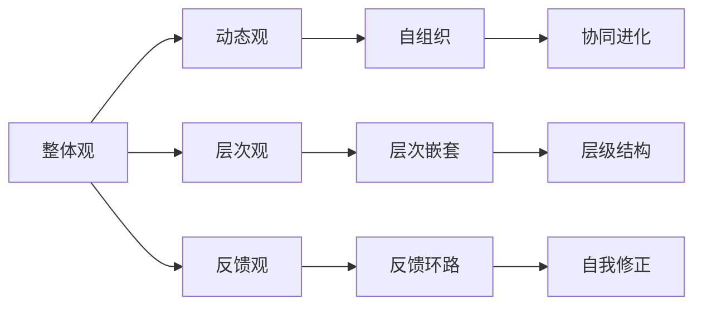

                 

# 管理者如何提升系统思考能力

> 关键词：系统思考, 管理决策, 复杂系统, 组织能力, 组织文化

## 1. 背景介绍

在全球化、数字化、智能化的浪潮下，现代企业管理面临着前所未有的复杂性和动态性。一方面，市场环境瞬息万变，竞争激烈；另一方面，组织内部结构复杂，内部协作困难。系统思考作为现代管理的重要思维方式，能够帮助管理者从全局视角审视问题，制定有效的管理决策，提升组织整体效能。本文旨在系统性地介绍系统思考的概念、原理与实践方法，帮助管理者提升系统思考能力。

## 2. 核心概念与联系

### 2.1 核心概念概述

系统思考(Systemic Thinking)是一种从整体出发的思维方式，旨在理解系统内各元素之间的相互联系和相互作用，从而揭示系统的整体行为模式。系统思考强调：

- **整体观**：系统内各元素相互依存，整体行为不同于部分之和。
- **动态观**：系统内部和外部环境不断变化，系统的行为和结构也随之变化。
- **层次观**：系统具有多个层次，每一层都有其特定的结构和功能。
- **反馈观**：系统内部存在反馈机制，各元素间的信息交换对系统行为产生重要影响。

### 2.2 核心概念原理和架构的 Mermaid 流程图



这张图展示了系统思考的几个关键概念及其相互联系：

- 整体观强调系统内各元素相互依存，整体行为不同于部分之和。
- 动态观强调系统内部和外部环境不断变化，系统的行为和结构也随之变化。
- 层次观强调系统具有多个层次，每一层都有其特定的结构和功能。
- 反馈观强调系统内部存在反馈机制，各元素间的信息交换对系统行为产生重要影响。

### 2.3 核心概念联系

- **整体观与层次观**：整体观关注系统的总体行为，层次观关注系统内部的结构与功能，二者相互补充，帮助管理者全面理解系统。
- **动态观与反馈观**：动态观关注系统的变化，反馈观关注系统内部的信息反馈，二者结合，帮助管理者及时响应环境变化。
- **自组织与协同进化**：自组织强调系统内部各元素通过相互作用，达到一种平衡状态；协同进化强调系统内部各元素相互促进，共同成长。

## 3. 核心算法原理 & 具体操作步骤

### 3.1 算法原理概述

系统思考的原理基于以下几个关键思想：

- **系统动力学(System Dynamics, SD)**：通过构建系统的动态模型，理解系统行为的变化规律。
- **反馈机制(Feedback Mechanism)**：系统内部和外部环境的信息交换对系统行为产生重要影响，反馈机制是系统思考的核心。
- **层次分析(Hierarchy Analysis)**：系统具有多个层次，每一层都有其特定的结构和功能，层次分析帮助管理者理解系统结构。

### 3.2 算法步骤详解

系统思考的步骤主要包括以下几个方面：

1. **理解系统结构**：通过访谈、观察、数据分析等方式，了解系统的整体结构和层次，识别出关键要素和关系。
2. **构建系统模型**：基于理解的系统结构，构建系统的动态模型，使用系统动力学工具（如Vensim、Stella等）进行仿真分析。
3. **识别反馈机制**：分析系统内部的反馈机制，理解其对系统行为的影响，识别出关键的因果关系和潜在的系统漏洞。
4. **制定管理决策**：基于系统模型和反馈机制分析，制定有效的管理决策，优化系统结构，增强系统稳定性。
5. **实施与监控**：将管理决策转化为具体行动，同时持续监控系统行为，及时调整决策。

### 3.3 算法优缺点

系统思考的优点包括：

- **全面性**：系统思考从整体视角审视问题，能够全面理解系统的各个方面。
- **前瞻性**：通过仿真分析，系统思考能够预测系统未来的行为趋势，制定有前瞻性的管理决策。
- **系统性**：系统思考强调系统的整体性和层次性，能够帮助管理者系统性地解决问题。

系统思考的缺点包括：

- **复杂性**：系统思考涉及多个层次和反馈机制，理解和管理系统的复杂性较高。
- **数据依赖**：系统思考需要大量数据支持，数据不足会影响分析结果。
- **技术要求**：系统思考需要使用专业的系统动力学工具，对技术要求较高。

### 3.4 算法应用领域

系统思考广泛适用于各种管理场景，包括但不限于：

- **组织变革**：通过理解组织结构，识别出组织中的关键要素和关系，制定有效的变革策略。
- **项目管理**：通过理解项目的动态特性，构建项目管理系统，优化项目管理过程。
- **供应链管理**：通过理解供应链系统结构，构建供应链管理系统，优化供应链效率。
- **人力资源管理**：通过理解组织内部的人际关系和反馈机制，优化人力资源配置和激励机制。
- **市场营销**：通过理解市场需求和反馈机制，制定有效的市场策略，提升市场竞争力。

## 4. 数学模型和公式 & 详细讲解 & 举例说明

### 4.1 数学模型构建

系统思考的数学模型通常使用系统动力学工具进行构建，例如Vensim、Stella等。这些工具能够帮助管理者构建系统的动态模型，理解系统的行为规律。

以一个简单的供应链系统为例，构建其系统动力学模型：

```plaintext
库存 --> 生产 --> 销售 --> 需求 --> 库存
              ↓             ↓             ↓
             采购            消费            补充
```

### 4.2 公式推导过程

在上述模型中，库存、生产和销售之间存在动态关系。假设库存量为$S(t)$，生产量为$P(t)$，销售量为$D(t)$，需求量为$Q(t)$，补充量为$C(t)$，采购量为$A(t)$。根据模型结构，可以得到以下公式：

$$
S(t+1) = S(t) + P(t) - D(t)
$$

$$
P(t+1) = P(t) + A(t) - C(t)
$$

$$
D(t+1) = D(t) + Q(t)
$$

$$
Q(t+1) = Q(t) - D(t)
$$

$$
C(t+1) = C(t) - Q(t)
$$

$$
A(t+1) = A(t) - C(t)
$$

其中，$P(t)$为生产量，$D(t)$为销售量，$Q(t)$为需求量，$C(t)$为补充量，$A(t)$为采购量。

### 4.3 案例分析与讲解

以一家电子产品生产企业的供应链管理为例，分析其系统动力学模型：

1. **理解系统结构**：该企业从供应商采购原材料，生产成品，销售给客户。其关键要素包括原材料库存、成品库存、生产设备、销售订单、客户需求等。

2. **构建系统模型**：基于理解的系统结构，使用Vensim构建动态模型，分析供应链各环节的相互作用。

3. **识别反馈机制**：通过仿真分析，识别出供应链中的关键反馈机制，如库存水平对生产量的影响，需求量对采购量的影响等。

4. **制定管理决策**：根据反馈机制分析，制定优化供应链的决策，如调整采购策略、优化生产计划、提高库存管理效率等。

5. **实施与监控**：将优化决策转化为具体措施，如实施需求预测系统、优化库存管理系统、改进生产流程等，同时持续监控供应链行为，及时调整决策。

## 5. 项目实践：代码实例和详细解释说明

### 5.1 开发环境搭建

系统思考的实践通常使用系统动力学工具，如Vensim、Stella等。以下是使用Vensim搭建供应链系统模型的一般流程：

1. 安装Vensim软件，创建一个新的项目。
2. 输入供应链系统结构，定义各要素之间的关系。
3. 设置初始值，输入各要素的初始状态。
4. 定义各要素的变化方程，建立动态模型。
5. 运行仿真，分析系统行为，生成图表。

### 5.2 源代码详细实现

以下是一个简单的Vensim供应链系统模型代码示例：

```plaintext
Model "Supply Chain Model"

var
    S, P, D, Q, C, A: Quantitative

Table "Data"
    D(t): 0, 1, 0, 1, 0, 1

Initial Value
    S(0) = 100
    P(0) = 0
    D(0) = 0
    Q(0) = 0
    C(0) = 0
    A(0) = 0

Equations
    S(t+1) = S(t) + P(t) - D(t)
    P(t+1) = P(t) + A(t) - C(t)
    D(t+1) = D(t) + Q(t)
    Q(t+1) = Q(t) - D(t)
    C(t+1) = C(t) - Q(t)
    A(t+1) = A(t) - C(t)
```

### 5.3 代码解读与分析

**Vensim供应链系统模型**：
- `Model`命令创建模型，模型名为"Supply Chain Model"。
- `var`命令定义变量，包括库存$S$、生产量$P$、销售量$D$、需求量$Q$、补充量$C$、采购量$A$。
- `Table`命令定义输入数据，表示销售量随时间的变化。
- `Initial Value`命令设置各变量的初始值。
- `Equations`命令定义各变量的变化方程，根据供应链模型结构，建立动态模型。

### 5.4 运行结果展示

运行上述Vensim模型，可以得到以下仿真结果：


此图展示了供应链系统在不同时间点的库存水平，可以看到库存水平随时间变化，反映了供应链系统动态行为。

## 6. 实际应用场景

系统思考在企业管理中具有广泛的应用，以下是几个典型的应用场景：

### 6.1 组织变革

在组织变革过程中，系统思考可以帮助管理者理解组织结构，识别出关键要素和关系，制定有效的变革策略。例如，一家跨国公司进行组织架构调整，通过系统思考，识别出各业务单元之间的依赖关系，优化资源配置，提升组织效率。

### 6.2 项目管理

在项目管理中，系统思考可以帮助管理者构建项目管理系统，优化项目管理过程。例如，一个软件开发项目，通过系统思考，构建项目进度和资源分配的动态模型，优化资源分配，提升项目进度。

### 6.3 供应链管理

在供应链管理中，系统思考可以帮助管理者构建供应链管理系统，优化供应链效率。例如，一家制造企业通过系统思考，构建供应链动态模型，优化库存管理和物流流程，提升供应链效率。

### 6.4 人力资源管理

在人力资源管理中，系统思考可以帮助管理者理解组织内部的人际关系和反馈机制，优化人力资源配置和激励机制。例如，一家企业通过系统思考，构建员工绩效和激励的动态模型，优化激励机制，提升员工满意度。

### 6.5 市场营销

在市场营销中，系统思考可以帮助管理者理解市场需求和反馈机制，制定有效的市场策略。例如，一家电子商务公司通过系统思考，构建市场需求和促销活动的动态模型，优化促销策略，提升市场竞争力。

## 7. 工具和资源推荐

### 7.1 学习资源推荐

为了帮助管理者系统掌握系统思考的理论和实践，以下是一些优质的学习资源：

1. **《系统思考》书籍**：由系统思考领域的专家所撰写，系统介绍了系统思考的基本概念、方法和工具，适合初学者阅读。
2. **系统思考在线课程**：各大在线教育平台提供的系统思考课程，包括哈佛大学、密歇根大学等知名学府的课程，系统讲解系统思考的理论和实践方法。
3. **系统思考工具使用手册**：如Vensim、Stella等工具的使用手册，详细介绍了工具的操作方法和实践技巧。
4. **系统思考案例集**：如《系统思考案例集》等书籍，提供了大量系统思考的实践案例，帮助管理者理解和应用系统思考。

### 7.2 开发工具推荐

系统思考的实践通常使用系统动力学工具，以下是一些常用的工具：

1. **Vensim**：主流的系统动力学建模工具，支持动态仿真和敏感性分析，广泛应用于企业管理和政策模拟。
2. **Stella**：由麻省理工学院开发的系统动力学建模工具，支持复杂的系统建模和仿真分析。
3. **AnyLogic**：支持多层次建模和仿真分析，广泛应用于系统设计和优化。
4. **Python系统动力学库**：如PyDYNAMO、Pysimpy等，支持Python编程的动态建模和仿真分析。

### 7.3 相关论文推荐

系统思考作为现代管理的重要方法，相关研究不断涌现，以下是一些有代表性的论文：

1. **《系统动力学在组织变革中的应用》**：详细介绍了系统动力学在组织变革中的应用案例和方法。
2. **《项目管理中的系统思考》**：探讨了系统思考在项目管理中的应用，提供了实用的方法和工具。
3. **《供应链管理中的系统思考》**：分析了系统思考在供应链管理中的应用，提出了优化供应链的策略和方法。
4. **《人力资源管理中的系统思考》**：探讨了系统思考在人力资源管理中的应用，提出了优化人力资源配置的方法。
5. **《市场营销中的系统思考》**：分析了系统思考在市场营销中的应用，提出了优化市场策略的方法。

## 8. 总结：未来发展趋势与挑战

### 8.1 研究成果总结

系统思考作为现代管理的重要方法，已经广泛应用于各种管理场景。其核心思想在于全面、动态、系统地理解和管理复杂系统，帮助管理者制定有效的管理决策，提升组织整体效能。系统思考的理论和实践方法已经日趋成熟，但仍然需要不断发展和完善，以应对日益复杂的管理环境。

### 8.2 未来发展趋势

展望未来，系统思考的发展趋势包括：

1. **数据驱动**：系统思考将更多依赖于大数据和AI技术，通过数据分析和模型优化，提升系统思考的准确性和实用性。
2. **跨学科融合**：系统思考将与其他学科（如心理学、社会学等）进行深度融合，拓展系统思考的应用范围。
3. **智能化**：通过引入AI技术，系统思考将实现自动化和智能化，提升分析效率和决策速度。
4. **可视化**：系统思考将更多依赖于可视化工具，帮助管理者更直观地理解和应用系统模型。
5. **敏捷化**：系统思考将更多应用于敏捷管理，及时响应环境变化，优化决策过程。

### 8.3 面临的挑战

尽管系统思考在企业管理中取得了显著成效，但也面临诸多挑战：

1. **数据质量**：系统思考依赖于大量数据支持，数据质量问题可能会影响分析结果。
2. **技术门槛**：系统思考需要使用专业的系统动力学工具，对技术要求较高，普通管理者难以掌握。
3. **复杂性**：系统思考涉及多个层次和反馈机制，理解和管理系统的复杂性较高。
4. **跨部门协作**：系统思考需要跨部门协作，协调不同职能的利益，难度较大。
5. **变革阻力**：系统思考涉及组织变革，可能会遭遇部分管理者的抵制和质疑。

### 8.4 研究展望

未来的系统思考研究需要在以下几个方面寻求新的突破：

1. **数据集成与清洗**：研究如何高效集成和管理多源异构数据，提升数据质量。
2. **智能算法与模型**：研究如何引入智能算法，提升系统模型的优化能力和准确性。
3. **可视化工具开发**：研究如何开发更直观、易用的可视化工具，提升系统思考的普及度。
4. **跨职能协作机制**：研究如何建立跨职能协作机制，提升系统思考的实施效果。
5. **伦理与安全**：研究如何确保系统思考模型的伦理性和安全性，避免潜在风险。

## 9. 附录：常见问题与解答

**Q1: 什么是系统思考?**

A: 系统思考是一种从整体出发的思维方式，旨在理解系统内各元素之间的相互联系和相互作用，从而揭示系统的整体行为模式。

**Q2: 系统思考的应用场景有哪些?**

A: 系统思考广泛应用于组织变革、项目管理、供应链管理、人力资源管理、市场营销等多个管理场景。

**Q3: 系统思考的优势和劣势是什么?**

A: 系统思考的优势包括全面性、前瞻性和系统性。其劣势在于复杂性、数据依赖和技术要求较高。

**Q4: 如何提升系统思考能力?**

A: 通过学习系统思考的理论和实践方法，结合实际管理场景进行应用，不断总结和反思，提升系统思考能力。

**Q5: 系统思考的工具有哪些?**

A: 常用的系统思考工具包括Vensim、Stella、AnyLogic等系统动力学软件，以及Python系统动力学库等。

---

作者：禅与计算机程序设计艺术 / Zen and the Art of Computer Programming

