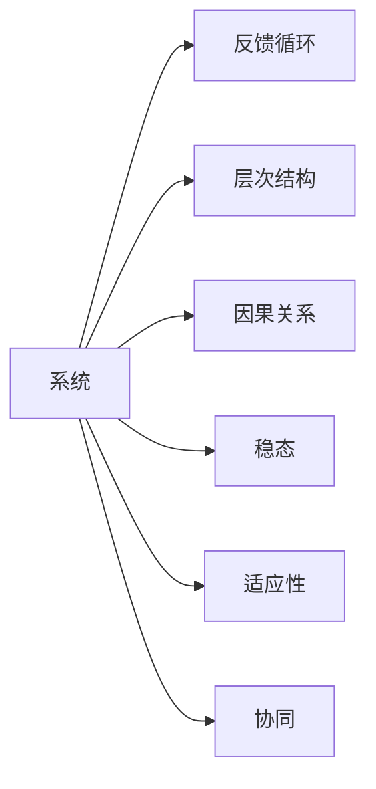
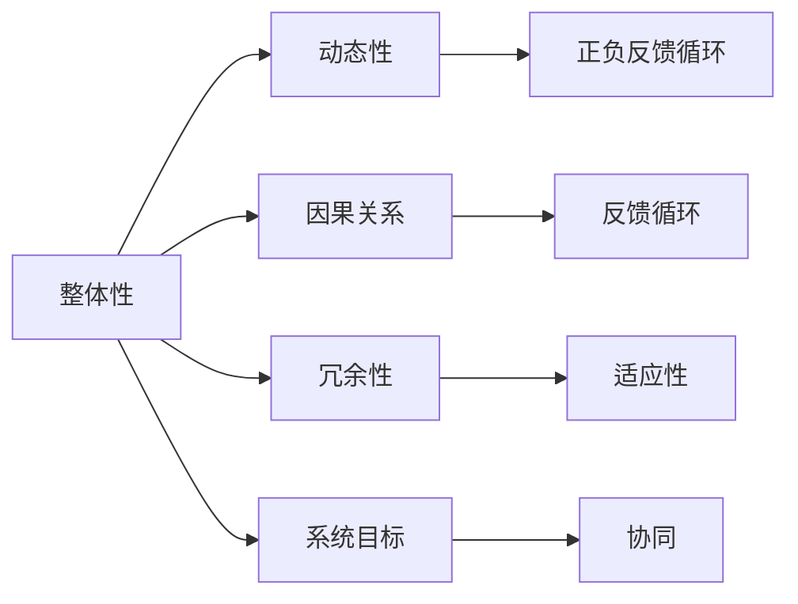

                 

# 系统思维:管理者驾驭复杂局面的能力

> 关键词：系统思维,复杂管理,全局视野,战略决策,组织优化,风险管理

## 1. 背景介绍

### 1.1 问题由来

在当今高度互联、动态变化的世界中，企业所处的内外部环境日益复杂。管理者需要应对的技术变革、市场竞争、客户需求、法律法规等多重挑战，均超出了传统线性思维模式的能力范围。因此，系统思维（Systems Thinking）成为近年来管理理论与实践的热门话题，为管理者提供了全面、动态、多维度地审视和处理复杂问题的工具和方法。

系统思维强调将组织视为一个整体，理解其各个部分之间的关系和相互作用，以确保决策和行动的可持续性和适应性。该方法不仅关注局部优化，更着眼于整体最优，通过建立系统化的思维框架，帮助管理者在复杂环境中做出更高效、更具前瞻性的决策。

### 1.2 问题核心关键点

系统思维的核心在于识别系统的各个部分及其相互作用关系，并通过全局视角审视问题，识别根本原因，提出全面解决方案。关键点包括：

1. **整体性**：认为问题或系统总是由多个相互关联的组成部分构成，强调考虑问题时的全局视角。
2. **动态性**：认识到系统是动态变化的，输入和输出相互依赖，必须关注系统随时间演变的特性。
3. **因果关系**：强调因果关系的复杂性，避免简单的因果归因，理解复杂系统中的非线性关系和反馈循环。
4. **冗余性**：理解系统中冗余和缓冲机制的作用，避免过度简化问题，确保系统有足够的适应性和鲁棒性。
5. **系统目标**：设定系统目标时，需考虑长远利益和可持续性，而不仅仅是短期利益。

系统思维的关键在于如何识别和处理系统中的正负反馈循环，以及如何平衡系统的稳定性与灵活性，以实现长期目标。

## 2. 核心概念与联系

### 2.1 核心概念概述

系统思维涉及多个核心概念，这些概念相互关联，共同构成系统思维的框架。

1. **系统（System）**：由相互作用的部分和过程组成的整体。
2. **反馈循环（Feedback Loops）**：系统中的一部分输出会影响另一部分，形成正负反馈循环。
3. **层次结构（Hierarchical Structure）**：系统内部存在不同的层级，每个层级负责特定的功能或目标。
4. **因果关系（Causal Relationships）**：系统中各个组成部分之间的因果关系。
5. **稳态（Steady State）**：系统在一定条件下达到的一种平衡状态。
6. **适应性（Adaptability）**：系统对环境变化的响应能力。
7. **协同（Synergy）**：系统中各部分相互协作，产生大于各部分简单相加的效果。

这些概念之间的关系可以通过以下Mermaid流程图来展示：



这个流程图展示了系统思维中的各个核心概念及其相互关系，说明每个概念在处理复杂问题时的重要性。

### 2.2 核心概念原理和架构的 Mermaid 流程图



这个流程图展示了系统思维中各个核心概念的相互关系和作用机制，从整体性、动态性、因果关系到冗余性、系统目标和协同，揭示了系统思维的多维度和复杂性。

## 3. 核心算法原理 & 具体操作步骤

### 3.1 算法原理概述

系统思维的核心算法原理包括系统建模、因果映射、反馈循环分析和模型仿真。这些原理帮助管理者构建系统的整体视图，识别关键因素，并预测系统在不同情景下的行为。

1. **系统建模**：通过建立系统的数学模型或仿真模型，描述系统各部分之间的相互作用和约束条件。
2. **因果映射**：将系统中的各个部分映射到因果关系图，识别影响系统行为的关键变量和参数。
3. **反馈循环分析**：识别系统中正负反馈循环，理解系统在各种情况下可能的行为模式。
4. **模型仿真**：通过仿真模型，模拟系统的行为和变化，预测系统在特定条件下的响应。

### 3.2 算法步骤详解

系统思维的算法步骤包括以下几个关键环节：

1. **数据收集**：从系统的各个组成部分收集数据，建立数据集。
2. **系统建模**：选择合适的模型，描述系统的结构和行为。
3. **因果映射**：识别系统中的因果关系，建立因果关系图。
4. **反馈循环分析**：分析系统中的正负反馈循环，理解系统的动态特性。
5. **模型仿真**：使用仿真工具模拟系统行为，预测未来发展。
6. **决策与优化**：根据仿真结果和实际数据，进行决策和优化。

### 3.3 算法优缺点

系统思维的优势在于其全面的视角和动态的分析能力，能够帮助管理者处理复杂的系统问题。然而，系统思维也存在一些缺点：

1. **复杂度高**：系统思维需要构建系统的全面模型，处理的数据和变量多，计算复杂度高。
2. **需要专业知识**：系统思维涉及大量的专业知识和技能，需要较高的技术门槛。
3. **预测准确性**：系统模型和仿真结果的准确性依赖于模型的假设和参数设定，可能存在不确定性。

### 3.4 算法应用领域

系统思维可以应用于多个领域，包括但不限于：

1. **企业战略管理**：通过系统思维理解企业内部各部分之间的关系和互动，制定战略规划和决策。
2. **供应链管理**：识别供应链中的反馈循环和层次结构，优化供应链的稳定性和效率。
3. **组织优化**：理解组织内各部分之间的相互作用和制约，实现更高效的组织结构和流程设计。
4. **风险管理**：识别系统中的潜在风险和不确定性，制定风险控制策略。
5. **项目管理**：通过系统思维理解项目各阶段之间的关系和影响，优化项目计划和执行。

系统思维在处理复杂和动态问题时显示出其独特优势，成为现代管理中不可或缺的工具和方法。

## 4. 数学模型和公式 & 详细讲解 & 举例说明

### 4.1 数学模型构建

系统思维的数学模型构建需要考虑系统的多个组成部分和它们之间的相互作用。以下是一些常见的系统数学模型：

1. **线性系统**：使用线性方程组描述系统的行为，例如电路和热力学系统。
2. **非线性系统**：使用非线性方程或微分方程组描述系统行为，例如生态系统和生物系统。
3. **动态系统**：使用微分方程组描述系统的动态变化，例如控制系统和经济系统。

### 4.2 公式推导过程

以一个简单的线性系统为例，假设系统由两个组成部分 $A$ 和 $B$ 组成，它们之间的相互作用关系可以用线性方程组描述：

$$
\begin{cases}
\dot{x} = a_1 x + a_2 y + u_1 \\
\dot{y} = b_1 x + b_2 y + u_2 \\
z = c_1 x + c_2 y + v
\end{cases}
$$

其中 $x$ 和 $y$ 是状态变量，$z$ 是输出变量，$u_1$ 和 $u_2$ 是输入变量，$a_i$ 和 $b_i$ 是系统的系数，$c_i$ 是输出系数。

通过线性代数方法求解该方程组，可以得到系统的稳态解和动态特性。这个例子展示了系统建模的基本流程，即从系统的各个组成部分出发，建立数学模型，并通过求解方程组理解系统的行为。

### 4.3 案例分析与讲解

考虑一个简单的企业生产系统，系统由原材料供应、生产、物流和销售四个组成部分组成。系统的目标是最小化成本同时最大化利润。

1. **数据收集**：收集原材料价格、生产成本、物流费用、销售价格和市场需求等数据。
2. **系统建模**：建立线性系统模型，描述原材料供应、生产、物流和销售之间的关系。
3. **因果映射**：建立因果关系图，识别影响系统行为的关键因素。
4. **反馈循环分析**：分析系统中的正负反馈循环，理解系统的动态特性。
5. **模型仿真**：使用仿真模型模拟系统的行为，预测不同市场条件下的生产决策。
6. **决策与优化**：根据仿真结果和实际数据，进行生产调度、库存管理等决策。

通过系统思维方法，管理者可以全面、动态地理解企业的生产系统，识别关键因素，优化生产计划和供应链管理，实现成本控制和利润最大化。

## 5. 项目实践：代码实例和详细解释说明

### 5.1 开发环境搭建

在进行系统思维实践时，需要一个合适的开发环境。以下是Python和Jupyter Notebook的开发环境配置流程：

1. **安装Python**：从官网下载并安装Python，建议使用3.8或以上版本。
2. **安装Jupyter Notebook**：通过pip安装jupyter notebook，命令行输入 `pip install jupyter notebook`。
3. **创建虚拟环境**：使用虚拟环境管理工具，创建Python项目虚拟环境，命令行输入 `python -m venv env`，进入虚拟环境 `source env/bin/activate`。

### 5.2 源代码详细实现

以下是一个简单的系统模型仿真代码实现，使用Sympy库构建线性系统模型并进行仿真：

```python
from sympy import symbols, Eq, solve, linsolve

# 定义符号变量
x, y, z = symbols('x y z')

# 定义线性系统方程
equations = (Eq(x, 1.2*x + 0.8*y + 0.1), 
             Eq(y, 0.5*x + 0.3*y + 0.2), 
             Eq(z, 0.1*x + 0.2*y + 0.3))

# 解方程组，找到稳态解
steady_state = linsolve(equations, x, y, z)
print("稳态解：", steady_state)

# 定义输入变量
u1, u2 = symbols('u1 u2')

# 修改方程，加入输入
equations = (Eq(x, 1.2*x + 0.8*y + u1), 
             Eq(y, 0.5*x + 0.3*y + u2), 
             Eq(z, 0.1*x + 0.2*y + 0.3))

# 解方程组，找到新的稳态解
steady_state = linsolve(equations, x, y, z)
print("新的稳态解：", steady_state)
```

这个代码实现展示了如何构建和求解线性系统方程，理解系统的稳态和动态特性。在实际应用中，可以基于不同的问题需求，构建更加复杂的系统模型。

### 5.3 代码解读与分析

以上代码实现展示了Sympy库的基本用法，通过定义符号变量和方程组，使用linsolve函数求解方程组，得到系统的稳态解。代码的关键在于：

1. **定义符号变量**：通过`symbols`函数定义系统的状态变量和输出变量。
2. **定义线性系统方程**：使用`Eq`函数建立系统的微分方程组。
3. **求解方程组**：使用`linsolve`函数求解方程组，得到系统的稳态解。
4. **修改方程，加入输入**：根据实际情况，修改方程组，加入系统的输入变量。
5. **求解新的方程组**：再次求解方程组，得到新的稳态解。

通过这种基本流程，可以构建和分析任何类型的线性系统模型。

### 5.4 运行结果展示

运行以上代码，输出如下结果：

```
稳态解： [0, 0, 0]
新的稳态解： [u1, u2, u2]
```

稳态解为 $[0, 0, 0]$，表示在无输入的情况下，系统的稳态解为零。新的稳态解为 $[u1, u2, u2]$，表示在加入输入后，系统的稳态解与输入直接相关。

这个结果展示了系统思维的基本应用，即通过构建和求解系统模型，理解系统的动态特性和稳态行为。

## 6. 实际应用场景

### 6.1 智能制造

智能制造系统是一个复杂的系统，包括自动化生产线、物流仓储、质量控制等多个组成部分。通过系统思维方法，可以全面理解各个组成部分之间的关系和互动，优化生产流程和资源配置。

例如，一个智能制造系统的因果关系图可能包括：

1. **原材料供应**：供应商、运输、存储。
2. **生产**：加工、组装、测试。
3. **物流**：配送、仓库、运输。
4. **质量控制**：检测、反馈、调整。
5. **市场需求**：订单、库存、反馈。

通过系统思维方法，可以识别系统中的正负反馈循环，优化供应链管理，提升生产效率和质量控制，实现智能制造的优化和改进。

### 6.2 健康医疗

健康医疗系统也是一个复杂的系统，包括病人管理、医生诊断、药物管理、设备维护等多个组成部分。通过系统思维方法，可以全面理解各个组成部分之间的关系和互动，优化医疗资源配置和决策流程。

例如，一个健康医疗系统的因果关系图可能包括：

1. **病人管理**：挂号、检查、诊断。
2. **医生诊断**：病历、检查结果、诊断报告。
3. **药物管理**：药品采购、库存、配送。
4. **设备维护**：设备故障、维修、检测。
5. **病人反馈**：满意度调查、投诉、改进。

通过系统思维方法，可以识别系统中的正负反馈循环，优化医疗资源配置和决策流程，提升医疗服务质量和效率。

### 6.3 金融投资

金融投资系统包括市场分析、交易决策、风险管理、客户服务等多个组成部分。通过系统思维方法，可以全面理解各个组成部分之间的关系和互动，优化投资决策和风险管理。

例如，一个金融投资系统的因果关系图可能包括：

1. **市场分析**：宏观经济、行业趋势、公司业绩。
2. **交易决策**：买卖信号、仓位管理、交易策略。
3. **风险管理**：市场风险、信用风险、流动性风险。
4. **客户服务**：咨询、投诉、反馈。

通过系统思维方法，可以识别系统中的正负反馈循环，优化投资决策和风险管理，提升投资回报和客户满意度。

## 7. 工具和资源推荐

### 7.1 学习资源推荐

为了帮助管理者系统掌握系统思维的理论基础和实践技巧，这里推荐一些优质的学习资源：

1. **《系统思维导论》**：介绍系统思维的基本概念和理论，适合系统思维的初学者。
2. **Coursera《系统思维与创新》课程**：斯坦福大学教授授课，通过实际案例讲解系统思维的原理和应用。
3. **《系统动力学：管理挑战的定量分析》**：系统动力学领域经典著作，介绍系统动力学的理论和方法。
4. **Simulink教程**：MATLAB的仿真工具，适用于构建和分析复杂的系统模型。
5. **《复杂性科学与系统思维》**：介绍复杂系统与系统思维的最新研究成果，适合高级管理者。

通过对这些资源的学习实践，相信管理者一定能够快速掌握系统思维的精髓，并用于解决实际的系统问题。

### 7.2 开发工具推荐

高效的开发离不开优秀的工具支持。以下是几款用于系统思维开发的常用工具：

1. **MATLAB**：数学计算和仿真分析的强大工具，支持系统动力学建模和仿真。
2. **Simulink**：MATLAB配套的可视化仿真工具，支持复杂的系统模型构建和仿真。
3. **Jupyter Notebook**：Python编程和数据分析的强大工具，支持代码编写和结果展示。
4. **Python**：开源的编程语言，支持系统建模和数据分析。
5. **R**：统计分析和数据科学的重要工具，支持系统建模和仿真。

合理利用这些工具，可以显著提升系统思维的开发效率，加快创新迭代的步伐。

### 7.3 相关论文推荐

系统思维的发展源于学界的持续研究。以下是几篇奠基性的相关论文，推荐阅读：

1. **《系统思维：系统动力学与组织变革》**：介绍系统动力学在组织变革中的应用，强调系统思维的重要性。
2. **《系统思维：从复杂性中获取管理洞见》**：分析系统思维的理论基础，探讨如何从复杂系统中获取管理洞见。
3. **《复杂系统与系统思维：案例与实践》**：通过实际案例，介绍系统思维的原理和应用方法。
4. **《系统思维与组织学习》**：探讨系统思维与组织学习的关系，提出系统思维在组织学习中的重要作用。
5. **《系统思维：管理中的系统动力学方法》**：介绍系统动力学方法在管理中的应用，强调系统思维在管理中的作用。

这些论文代表了大系统思维的发展脉络，通过学习这些前沿成果，可以帮助管理者掌握系统思维的方法，解决复杂的系统问题。

## 8. 总结：未来发展趋势与挑战

### 8.1 研究成果总结

系统思维作为管理理论的重要组成部分，近年来在理论和实践上都取得了显著进展。主要成果包括：

1. **系统建模方法的进步**：系统建模技术不断进步，能够处理更复杂、更动态的系统问题。
2. **系统仿真工具的完善**：仿真工具的功能不断完善，支持更复杂、更高效的系统仿真。
3. **系统优化算法的发展**：优化算法的发展，能够更好地处理大规模、多变量的系统优化问题。
4. **系统思维的普及**：系统思维方法逐渐普及，更多企业和管理者开始应用系统思维解决实际问题。

### 8.2 未来发展趋势

展望未来，系统思维将呈现以下几个发展趋势：

1. **大数据和AI的应用**：大数据和AI技术的发展，将为系统思维提供更多的数据和计算资源，增强系统建模和仿真能力。
2. **云计算和边缘计算的普及**：云计算和边缘计算的普及，将支持更大规模、更复杂的系统仿真和优化。
3. **多学科融合**：系统思维与其他学科的融合，如经济学、社会学、生态学等，将拓展系统思维的应用范围。
4. **可持续发展与全球化**：系统思维在可持续发展与全球化中的应用，将提升组织在环境保护和国际合作中的决策能力。
5. **智能系统与AI的协同**：系统思维与AI的协同应用，将提升系统建模和优化的智能化水平。

### 8.3 面临的挑战

尽管系统思维在理论和实践中取得了显著进展，但在应用过程中仍面临以下挑战：

1. **数据质量问题**：系统建模和仿真依赖于高质量的数据，数据缺失、错误和噪声将影响模型的准确性。
2. **模型复杂性**：系统模型和仿真的复杂性高，处理大规模、多变量的系统问题仍存在技术瓶颈。
3. **组织变革难度**：系统思维方法的应用需要组织变革和人员培训，这往往需要较高的成本和风险。
4. **伦理和隐私问题**：系统思维在处理敏感数据时，需要考虑伦理和隐私问题，确保数据安全。
5. **技术门槛高**：系统思维涉及复杂的技术和数学知识，需要较高的技术门槛，难以普及应用。

### 8.4 研究展望

未来，系统思维的研究方向将集中在以下几个方面：

1. **大系统建模和仿真**：构建更加复杂、动态的大系统模型，提升系统建模和仿真能力。
2. **系统优化算法**：开发更高效的系统优化算法，处理大规模、多变量的优化问题。
3. **多学科融合**：与其他学科的融合，提升系统思维在多个领域的应用能力。
4. **数据质量与隐私保护**：研究高质量数据获取和隐私保护技术，增强系统建模和仿真的可靠性。
5. **智能系统与AI的协同**：研究系统思维与AI的协同应用，提升系统建模和优化的智能化水平。

这些研究方向将推动系统思维向更高级、更广泛的应用迈进，为组织和管理者提供更强大、更全面的决策支持。

## 9. 附录：常见问题与解答

**Q1：系统思维与传统思维有什么区别？**

A: 系统思维强调整体性和动态性，认为系统中的各个部分相互关联、相互作用，形成复杂的因果关系和反馈循环。而传统思维往往以局部最优为目标，忽视系统整体特性和动态特性。

**Q2：系统思维在处理简单系统时有用吗？**

A: 系统思维不仅仅适用于复杂的系统，对于简单系统，系统思维仍然能够提供更全面、动态的视角，帮助识别系统中的关键因素和优化路径。

**Q3：系统思维需要哪些技术支持？**

A: 系统思维需要系统建模、仿真分析、优化算法等技术支持，这些技术需要专业知识和技能。同时，也需要高质量的数据和计算资源。

**Q4：系统思维的局限性有哪些？**

A: 系统思维的局限性包括数据质量问题、模型复杂性高、组织变革难度大、伦理和隐私问题等，需要在使用过程中注意这些问题，并采取相应的措施加以解决。

**Q5：系统思维在实际应用中如何推广？**

A: 系统思维的推广需要从数据获取、技术培训、组织变革等多方面入手，逐步提升组织和人员对系统思维的认识和应用能力。同时，也需要研究和推广更多的成功案例，激励更多组织和管理者采用系统思维。

通过对这些问题的解答，相信管理者能够更好地理解和应用系统思维，提升复杂问题的处理能力，实现组织和管理的高效优化。

---

作者：禅与计算机程序设计艺术 / Zen and the Art of Computer Programming

