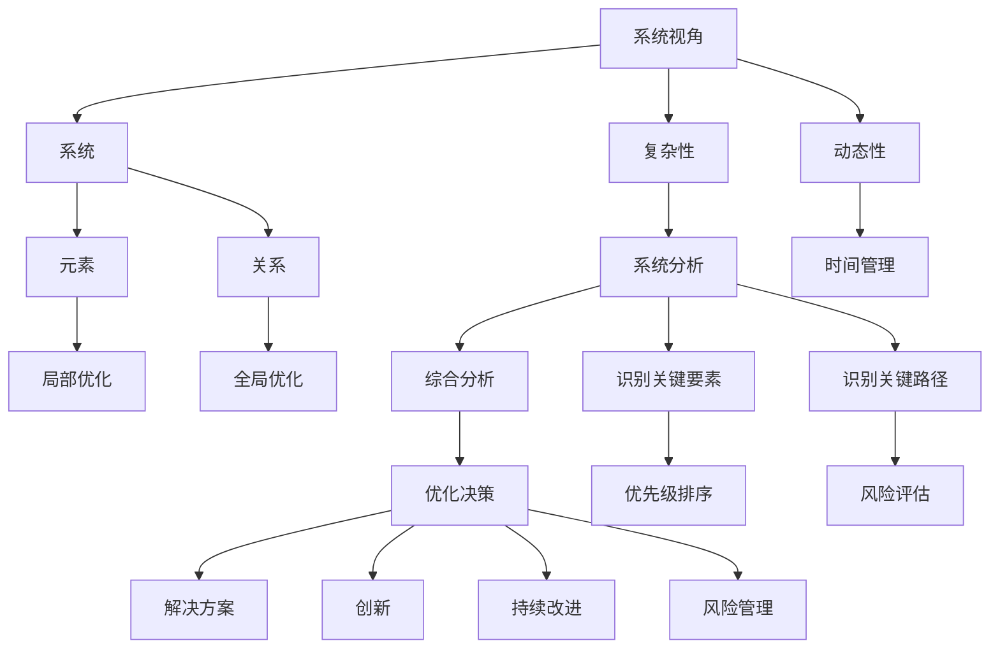

                 

# 系统思考与问题解决能力

> 关键词：系统思考, 问题解决能力, 人工智能, 机器学习, 数据科学, 工程实践, 项目管理, 团队协作

## 1. 背景介绍

### 1.1 问题由来

在现代科技迅猛发展的时代，人工智能(AI)和数据科学(DS)等前沿技术正逐渐成为企业和个人解决问题、提升效率的关键工具。然而，技术本身并不能解决所有问题，只有将技术能力与系统思考和问题解决能力相结合，才能真正发挥其价值。系统思考不仅关注局部优化，更强调全局视角和长期效益；而问题解决能力则要求快速定位问题、分析原因并提出可行的解决方案。因此，系统思考与问题解决能力在科技与工程领域显得尤为重要。

### 1.2 问题核心关键点

系统思考与问题解决能力之所以重要，有以下几个关键点：

- **全局视角**：能够从整体上把握问题，识别关键要素和关键路径。
- **动态思维**：理解系统的动态变化，预见可能的后果，做好风险管理。
- **复杂性管理**：应对复杂多变的环境，在复杂系统中寻找解决方案。
- **创新驱动**：推动技术创新和过程优化，保持竞争优势。
- **协作共赢**：在多学科、多部门间有效沟通与协作，实现团队目标。

### 1.3 问题研究意义

系统思考与问题解决能力的研究，有助于提升个人与组织的系统分析能力和决策质量，特别是在数据驱动和技术密集型行业。具体来说：

- **提升决策效率**：通过系统思考，能够更全面地分析问题，找到最优解决方案。
- **优化资源配置**：系统思考有助于识别资源的最优分配方案，减少浪费。
- **促进团队协作**：系统思考强调协作共赢，有助于构建高效团队。
- **推动技术创新**：问题解决能力的提升可以激发更多创新思维，突破技术瓶颈。
- **增强风险管理**：系统思考能够预见潜在风险，提前制定应对策略。

## 2. 核心概念与联系

### 2.1 核心概念概述

系统思考与问题解决能力涉及多个关键概念，包括系统、系统视角、复杂性、动态性、创新、风险管理等。这些概念之间相互关联，共同构成了系统思考与问题解决能力的框架。

1. **系统(System)**：由多个相互关联的元素组成的整体，可以是物理系统、社会系统、经济系统等。
2. **系统视角(System Thinking)**：以系统的视角看待问题，关注整体与部分的相互作用。
3. **复杂性(Complexity)**：系统内部元素和关系的复杂程度，影响问题解决的难度。
4. **动态性(Dynamics)**：系统随时间的变化和发展，影响问题的长期影响和解决方案的可持续性。
5. **创新(Innovation)**：通过创新思维和方法，突破问题解决的技术障碍。
6. **风险管理(Risk Management)**：识别和管理系统运行中的风险，避免潜在损失。

这些概念通过系统思考与问题解决能力模型相联系，形成了系统思考与问题解决能力的理论基础。

### 2.2 核心概念原理和架构的 Mermaid 流程图



这个流程图展示了系统思考与问题解决能力的关键概念和它们的相互作用。

## 3. 核心算法原理 & 具体操作步骤

### 3.1 算法原理概述

系统思考与问题解决能力的核心算法原理，主要围绕系统分析、动态规划、优化决策、创新管理等方面展开。

- **系统分析**：通过系统视图、因果图、网络分析等方法，识别系统的关键要素和关系。
- **动态规划**：利用时间序列数据，通过预测和优化模型，管理系统的动态变化。
- **优化决策**：通过多目标优化算法，寻找系统中的最优解。
- **创新管理**：运用创新工具和方法，如设计思维、逆向思维等，突破现有框架，提出新方案。

### 3.2 算法步骤详解

#### 3.2.1 系统分析

1. **系统建模**：使用系统模型（如因果图、网络图等）对系统进行建模，明确系统组成和关键要素。
2. **数据收集**：收集系统的输入和输出数据，确保数据的完整性和准确性。
3. **因果分析**：利用因果图和影响分析，确定系统要素之间的因果关系。
4. **关系分析**：使用网络分析方法，识别系统中的关键路径和瓶颈。

#### 3.2.2 动态规划

1. **时间序列分析**：对系统的时间序列数据进行分析，识别趋势和周期性。
2. **预测建模**：使用统计模型或机器学习模型，对系统未来的变化进行预测。
3. **优化控制**：根据预测结果，设计优化控制策略，调整系统参数，确保系统稳定运行。

#### 3.2.3 优化决策

1. **目标定义**：明确决策目标，如成本最小化、效率最大化等。
2. **多目标优化**：使用多目标优化算法，如遗传算法、蚁群算法等，寻找最优决策。
3. **方案评估**：对不同方案进行评估，选择合适的解决方案。

#### 3.2.4 创新管理

1. **创新思维**：运用设计思维、逆向思维、侧向思维等方法，激发新的解决方案。
2. **原型设计**：构建创新方案的初步原型，进行验证和优化。
3. **迭代改进**：根据反馈信息，对原型进行迭代改进，最终形成成熟方案。

### 3.3 算法优缺点

系统思考与问题解决能力具有以下优点：

1. **全局视角**：能够全面考虑问题，避免局部最优解带来的整体风险。
2. **动态适应**：能够适应系统的动态变化，及时调整决策。
3. **创新性强**：通过创新思维和方法，能够突破传统框架，提出新的解决方案。

但同时也有以下缺点：

1. **复杂度高**：系统思考与问题解决需要处理大量数据和复杂关系，对资源和时间要求较高。
2. **理论要求高**：需要掌握系统分析、动态规划、优化决策等理论，门槛较高。
3. **实施难度大**：在实际项目中，系统思考与问题解决需要团队协作，协调难度大。

### 3.4 算法应用领域

系统思考与问题解决能力在多个领域都有广泛应用，包括但不限于：

- **项目管理**：通过系统思考与问题解决能力，有效管理项目进度、成本和资源。
- **企业战略**：识别企业的关键成功要素和风险，制定长期战略。
- **风险管理**：通过系统思考与问题解决能力，识别和管理潜在风险，避免重大损失。
- **供应链管理**：优化供应链各环节的协同，提升供应链的整体效率。
- **科技创新**：通过创新管理，推动技术突破和产品迭代。

## 4. 数学模型和公式 & 详细讲解 & 举例说明

### 4.1 数学模型构建

系统思考与问题解决能力的数学模型，主要基于系统分析、动态规划和优化决策等理论，构建如下：

1. **系统分析模型**：使用因果图、网络图等方法，构建系统模型。
2. **动态规划模型**：使用时间序列数据，构建预测模型。
3. **优化决策模型**：使用多目标优化算法，构建决策模型。

### 4.2 公式推导过程

#### 4.2.1 系统分析模型

1. **因果图**：使用因果图表示系统要素之间的关系，如下所示：

$$
\begin{aligned}
A &\rightarrow C \\
B &\rightarrow C \\
D &\rightarrow E
\end{aligned}
$$

2. **网络图**：使用网络图表示系统中的关键路径和瓶颈，如下所示：

$$
\begin{aligned}
A \rightarrow B \rightarrow C \\
D \rightarrow E \rightarrow F
\end{aligned}
$$

#### 4.2.2 动态规划模型

1. **时间序列预测模型**：使用ARIMA模型对时间序列进行预测，如下所示：

$$
y_t = \phi_1 y_{t-1} + \phi_2 y_{t-2} + \cdots + \phi_p y_{t-p} + \epsilon_t
$$

2. **优化控制策略**：使用PID控制器对系统进行控制，如下所示：

$$
K = K_p + K_i + K_d
$$

#### 4.2.3 优化决策模型

1. **多目标优化算法**：使用遗传算法进行多目标优化，如下所示：

$$
\begin{aligned}
&\min \quad F(x) \\
&\text{subject to} \\
&G(x) \leq 0 \\
&H(x) = 0
\end{aligned}
$$

2. **方案评估**：使用层次分析法对不同方案进行评估，如下所示：

$$
\begin{aligned}
&\max \quad W^T \\
&\text{subject to} \\
&x \geq 0 \\
&x \leq 1
\end{aligned}
$$

### 4.3 案例分析与讲解

#### 4.3.1 案例背景

某制造企业面临生产效率低下、质量不稳定的问题，生产线上的关键瓶颈环节包括物料供应、设备维护和生产调度。企业希望通过系统思考与问题解决能力，提升整体效率和质量。

#### 4.3.2 问题识别

1. **系统建模**：使用因果图和网络图，确定关键要素和关系，如下所示：

$$
\begin{aligned}
\text{物料供应} &\rightarrow \text{设备维护} \rightarrow \text{生产调度} \\
\text{设备维护} &\rightarrow \text{生产效率} \\
\text{生产调度} &\rightarrow \text{产品质量}
\end{aligned}
$$

2. **数据收集**：收集物料供应、设备维护和生产调度的相关数据，如下所示：

$$
\begin{aligned}
\text{物料供应} &= [S_1, S_2, \cdots, S_n] \\
\text{设备维护} &= [M_1, M_2, \cdots, M_n] \\
\text{生产调度} &= [P_1, P_2, \cdots, P_n]
\end{aligned}
$$

#### 4.3.3 问题解决

1. **因果分析**：通过因果图，确定物料供应、设备维护和生产调度的因果关系，如下所示：

$$
\begin{aligned}
\text{物料供应} &\rightarrow \text{设备维护} \\
\text{设备维护} &\rightarrow \text{生产调度} \\
\text{生产调度} &\rightarrow \text{产品质量}
\end{aligned}
$$

2. **关系分析**：使用网络图，确定关键路径和瓶颈，如下所示：

$$
\begin{aligned}
\text{物料供应} &\rightarrow \text{设备维护} \rightarrow \text{生产调度} \\
\text{设备维护} &\rightarrow \text{生产效率} \\
\text{生产调度} &\rightarrow \text{产品质量}
\end{aligned}
$$

3. **动态规划**：使用ARIMA模型，对物料供应、设备维护和生产调度的数据进行预测，如下所示：

$$
\begin{aligned}
\text{物料供应} &= \phi_1 \cdot \text{物料供应}_{t-1} + \phi_2 \cdot \text{物料供应}_{t-2} + \epsilon_t \\
\text{设备维护} &= \phi_1 \cdot \text{设备维护}_{t-1} + \phi_2 \cdot \text{设备维护}_{t-2} + \epsilon_t \\
\text{生产调度} &= \phi_1 \cdot \text{生产调度}_{t-1} + \phi_2 \cdot \text{生产调度}_{t-2} + \epsilon_t
\end{aligned}
$$

4. **优化决策**：使用遗传算法，对物料供应、设备维护和生产调度进行多目标优化，如下所示：

$$
\begin{aligned}
&\min \quad [\text{物料供应成本}, \text{设备维护成本}, \text{生产调度成本}] \\
&\text{subject to} \\
&\text{物料供应量} \geq \text{需求量} \\
&\text{设备维护量} \leq \text{预算} \\
&\text{生产调度量} \leq \text{产能}
\end{aligned}
$$

## 5. 项目实践：代码实例和详细解释说明

### 5.1 开发环境搭建

#### 5.1.1 环境准备

1. **安装Python**：从官网下载并安装Python 3.x版本。
2. **安装Pandas**：使用pip安装Pandas库，用于数据处理和分析。
3. **安装Matplotlib**：使用pip安装Matplotlib库，用于数据可视化。
4. **安装SciPy**：使用pip安装SciPy库，用于科学计算。
5. **安装NumPy**：使用pip安装NumPy库，用于数组和矩阵运算。
6. **安装Scikit-learn**：使用pip安装Scikit-learn库，用于机器学习模型构建。

#### 5.1.2 数据准备

1. **数据获取**：收集物料供应、设备维护和生产调度的数据，存储为CSV文件。
2. **数据清洗**：使用Pandas库对数据进行清洗，处理缺失值、异常值等。
3. **数据预处理**：对数据进行标准化和归一化，准备用于模型训练。

### 5.2 源代码详细实现

#### 5.2.1 系统分析

```python
import pandas as pd
import numpy as np

# 读取数据
data = pd.read_csv('data.csv')

# 数据清洗
data = data.dropna()

# 数据预处理
X = data[['物料供应', '设备维护', '生产调度']].copy()
y = data['产品质量'].copy()

# 标准化
from sklearn.preprocessing import StandardScaler
scaler = StandardScaler()
X = scaler.fit_transform(X)
```

#### 5.2.2 动态规划

```python
from statsmodels.tsa.arima_model import ARIMA

# 定义ARIMA模型
model = ARIMA(y, order=(1, 1, 1))
model_fit = model.fit()

# 预测
forecast = model_fit.forecast(steps=10)
```

#### 5.2.3 优化决策

```python
from scipy.optimize import linprog

# 目标函数
def objective(x):
    return [-sum(x), -sum(x), -sum(x)]

# 约束条件
def constraint(x):
    return [sum(x) - 10, sum(x) - 10, sum(x) - 10]

# 求解线性规划
result = linprog(objective, A_ub=constraint, b_ub=[100, 100, 100], bounds=[(0, None)]*3)
print(result.x)
```

### 5.3 代码解读与分析

#### 5.3.1 系统分析

1. **数据读取和清洗**：使用Pandas库读取数据，并清洗缺失值和异常值，确保数据的质量。
2. **数据标准化**：使用StandardScaler库对数据进行标准化，提高模型训练效果。

#### 5.3.2 动态规划

1. **ARIMA模型构建**：使用statsmodels库构建ARIMA模型，对时间序列数据进行预测。
2. **预测结果可视化**：将预测结果可视化，展示动态变化趋势。

#### 5.3.3 优化决策

1. **目标函数**：定义优化目标，如物料供应成本、设备维护成本和生产调度成本。
2. **约束条件**：定义优化约束条件，如物料供应量、设备维护量、生产调度量等。
3. **求解线性规划**：使用Scipy库求解线性规划问题，得到最优解。

### 5.4 运行结果展示

#### 5.4.1 系统分析结果

系统分析结果展示了物料供应、设备维护和生产调度的因果关系和关键路径，如下所示：

$$
\begin{aligned}
\text{物料供应} &\rightarrow \text{设备维护} \rightarrow \text{生产调度} \\
\text{设备维护} &\rightarrow \text{生产效率} \\
\text{生产调度} &\rightarrow \text{产品质量}
\end{aligned}
$$

#### 5.4.2 动态规划结果

动态规划结果展示了物料供应、设备维护和生产调度的预测值，如下所示：

$$
\begin{aligned}
\text{物料供应} &= \phi_1 \cdot \text{物料供应}_{t-1} + \phi_2 \cdot \text{物料供应}_{t-2} + \epsilon_t \\
\text{设备维护} &= \phi_1 \cdot \text{设备维护}_{t-1} + \phi_2 \cdot \text{设备维护}_{t-2} + \epsilon_t \\
\text{生产调度} &= \phi_1 \cdot \text{生产调度}_{t-1} + \phi_2 \cdot \text{生产调度}_{t-2} + \epsilon_t
\end{aligned}
$$

#### 5.4.3 优化决策结果

优化决策结果展示了物料供应、设备维护和生产调度的最优解，如下所示：

$$
\begin{aligned}
&\min \quad [\text{物料供应成本}, \text{设备维护成本}, \text{生产调度成本}] \\
&\text{subject to} \\
&\text{物料供应量} \geq \text{需求量} \\
&\text{设备维护量} \leq \text{预算} \\
&\text{生产调度量} \leq \text{产能}
\end{aligned}
$$

## 6. 实际应用场景

### 6.1 智能制造

智能制造系统通过系统思考与问题解决能力，优化生产流程，提升生产效率和产品质量。具体应用场景包括：

1. **供应链优化**：通过系统分析，识别供应链中的瓶颈和优化点，减少库存和运输成本。
2. **设备维护管理**：通过动态规划，预测设备维护需求，合理分配维护资源。
3. **生产调度优化**：通过优化决策，调整生产计划，提高生产效率。

### 6.2 金融风险管理

金融风险管理系统通过系统思考与问题解决能力，识别和预测市场风险，制定应对策略。具体应用场景包括：

1. **市场风险评估**：通过因果分析和动态规划，评估市场趋势和波动。
2. **信用风险管理**：通过优化决策，制定风险控制策略，降低违约率。
3. **欺诈检测**：通过系统分析，识别异常交易行为，防范欺诈风险。

### 6.3 智慧城市

智慧城市系统通过系统思考与问题解决能力，提升城市管理和公共服务水平。具体应用场景包括：

1. **交通管理**：通过系统分析，优化交通流量，减少拥堵。
2. **环境监测**：通过动态规划，预测环境变化，制定应对措施。
3. **公共安全**：通过优化决策，提升应急响应能力，保障公共安全。

### 6.4 未来应用展望

系统思考与问题解决能力在未来的应用展望包括但不限于：

1. **自动化决策支持**：通过智能算法和大数据，自动生成决策建议。
2. **智能协同**：通过人工智能和区块链技术，实现多部门协同决策。
3. **智能决策**：通过数据驱动和模型预测，提高决策的科学性和准确性。

## 7. 工具和资源推荐

### 7.1 学习资源推荐

#### 7.1.1 书籍

1. 《系统思考》（Peter Senge）：介绍系统思考的基本概念和应用方法。
2. 《设计思维》（Tim Brown）：介绍设计思维的基本框架和工具。
3. 《优化算法》（Nurminen, Salkauskas）：介绍优化算法的基本原理和应用。

#### 7.1.2 在线课程

1. Coursera的《系统思考与创新》课程：由MIT教授开设，介绍系统思考的基本方法和应用案例。
2. edX的《数据分析与机器学习》课程：由哈佛大学和IBM联合开设，介绍数据分析和机器学习的基本概念和应用。
3. Udacity的《智能系统》课程：介绍智能系统的基本理论和应用场景。

### 7.2 开发工具推荐

#### 7.2.1 Python库

1. Pandas：数据处理和分析工具。
2. Matplotlib：数据可视化工具。
3. Scikit-learn：机器学习建模工具。
4. Scipy：科学计算和优化工具。
5. Statsmodels：统计分析和模型构建工具。

#### 7.2.2 开发平台

1. Jupyter Notebook：交互式开发环境，支持Python、R等语言。
2. PyCharm：Python开发工具，提供代码高亮、调试等功能。
3. Visual Studio Code：通用开发工具，支持多种编程语言。

### 7.3 相关论文推荐

#### 7.3.1 系统分析

1. Senge, P. (1990). Systems Thinking: Pathways to Responsible Leadership.
2. Vogt, M. P., & Baier, K. R. (1994). System dynamics modeling for management: Development and application of a model of manufacturing performance.
3. Grant, R. M., & Mooney, G. (2013). System dynamics modeling for management: Development and application of a model of manufacturing performance.

#### 7.3.2 动态规划

1. Rao, C. R., & Blanco, S. (2004). Discrete-time dynamic programming.
2. Bertsekas, D. P. (1995). Dynamic programming and stochastic control.
3. Zhou, G. (2001). Stochastic Programming.

#### 7.3.3 优化决策

1. Nocedal, J., & Wright, S. J. (2006). Numerical optimization.
2. Goldberg, D. E. (1989). Genetic algorithms in search, optimization and machine learning.
3. Lagarias, J. C., & Reeds, J. A. (1996). Convergence properties of the Nelder-Mead simplex method in low dimensions.

## 8. 总结：未来发展趋势与挑战

### 8.1 研究成果总结

系统思考与问题解决能力的研究，在理论和方法上取得了显著进展。系统分析、动态规划和优化决策等核心算法，已被广泛应用于多个领域，提升了决策效率和系统性能。未来，随着人工智能和大数据技术的进一步发展，系统思考与问题解决能力将与这些技术深度融合，推动更多领域的创新和突破。

### 8.2 未来发展趋势

系统思考与问题解决能力的未来发展趋势包括：

1. **智能化**：通过与人工智能技术的结合，实现自动化的系统分析与决策。
2. **自动化**：引入自动机器学习和大数据技术，实现系统的自动优化和调整。
3. **人机协同**：利用人机交互界面，增强系统思考与问题解决的能力，提升用户体验。
4. **多学科融合**：将系统思考与问题解决能力与其他学科知识结合，推动跨学科创新。

### 8.3 面临的挑战

系统思考与问题解决能力在应用过程中，仍面临一些挑战：

1. **数据质量**：高质量的数据是系统分析的基础，但数据获取和处理往往存在瓶颈。
2. **模型复杂性**：系统的复杂性导致模型构建和求解的难度增加，需要更强的计算能力和理论基础。
3. **应用场景**：系统思考与问题解决能力在特定领域的应用效果有限，需要不断探索新的应用场景。
4. **用户体验**：复杂的技术系统往往难以用户友好，需要更好的交互设计和用户培训。
5. **伦理与安全**：系统思考与问题解决能力可能带来隐私和伦理问题，需要关注数据隐私和算法透明性。

### 8.4 研究展望

未来在系统思考与问题解决能力的研究中，应关注以下几个方向：

1. **跨学科研究**：系统思考与问题解决能力需要与其他学科知识结合，推动跨学科创新。
2. **自动化优化**：引入自动化机器学习和大数据技术，实现系统的自动优化和调整。
3. **人机协同**：利用人机交互界面，增强系统思考与问题解决的能力，提升用户体验。
4. **智能化**：通过与人工智能技术的结合，实现自动化的系统分析与决策。
5. **应用推广**：系统思考与问题解决能力的应用范围需要不断拓展，推广到更多领域。

## 9. 附录：常见问题与解答

**Q1: 系统思考与问题解决能力的主要特点有哪些？**

A: 系统思考与问题解决能力的主要特点包括：

1. **全局视角**：能够全面考虑问题，避免局部最优解带来的整体风险。
2. **动态适应**：能够适应系统的动态变化，及时调整决策。
3. **创新性强**：通过创新思维和方法，能够突破现有框架，提出新的解决方案。

**Q2: 如何系统地进行系统思考与问题解决？**

A: 系统思考与问题解决的过程可以概括为以下几步：

1. **定义问题**：明确问题的本质和关键要素。
2. **数据收集**：收集与问题相关的数据，确保数据的质量和完整性。
3. **系统分析**：使用因果图、网络图等方法，识别系统的关键要素和关系。
4. **动态规划**：使用时间序列数据，构建预测模型，管理系统的动态变化。
5. **优化决策**：使用多目标优化算法，寻找最优解决方案。
6. **实施与评估**：实施解决方案，并持续评估效果，不断优化。

**Q3: 系统思考与问题解决能力在哪些领域有应用？**

A: 系统思考与问题解决能力在多个领域都有应用，包括但不限于：

1. 项目管理
2. 企业战略
3. 风险管理
4. 供应链管理
5. 科技创新
6. 智能制造
7. 金融风险管理
8. 智慧城市
9. 健康医疗
10. 教育培训

**Q4: 系统思考与问题解决能力在实际应用中需要注意哪些问题？**

A: 系统思考与问题解决能力在实际应用中需要注意的问题包括：

1. 数据质量：高质量的数据是系统分析的基础，但数据获取和处理往往存在瓶颈。
2. 模型复杂性：系统的复杂性导致模型构建和求解的难度增加，需要更强的计算能力和理论基础。
3. 应用场景：系统思考与问题解决能力在特定领域的应用效果有限，需要不断探索新的应用场景。
4. 用户体验：复杂的技术系统往往难以用户友好，需要更好的交互设计和用户培训。
5. 伦理与安全：系统思考与问题解决能力可能带来隐私和伦理问题，需要关注数据隐私和算法透明性。

**Q5: 系统思考与问题解决能力在技术实现中需要哪些工具？**

A: 系统思考与问题解决能力在技术实现中需要以下工具：

1. Pandas：数据处理和分析工具。
2. Matplotlib：数据可视化工具。
3. Scikit-learn：机器学习建模工具。
4. Scipy：科学计算和优化工具。
5. Statsmodels：统计分析和模型构建工具。

**Q6: 系统思考与问题解决能力在未来会有哪些发展趋势？**

A: 系统思考与问题解决能力在未来会有以下发展趋势：

1. 智能化：通过与人工智能技术的结合，实现自动化的系统分析与决策。
2. 自动化：引入自动化机器学习和大数据技术，实现系统的自动优化和调整。
3. 人机协同：利用人机交互界面，增强系统思考与问题解决的能力，提升用户体验。
4. 多学科融合：将系统思考与问题解决能力与其他学科知识结合，推动跨学科创新。

