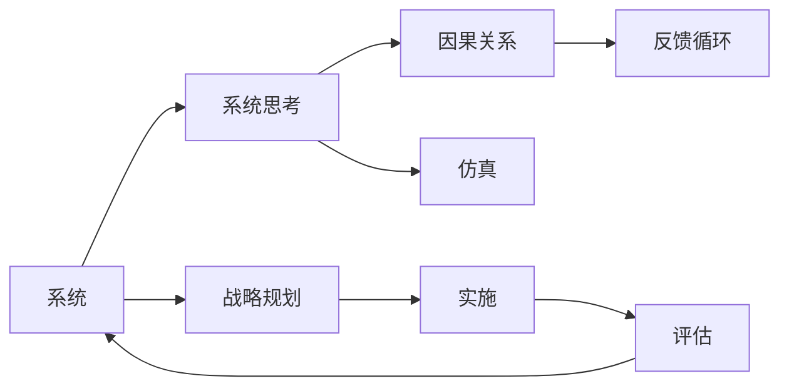
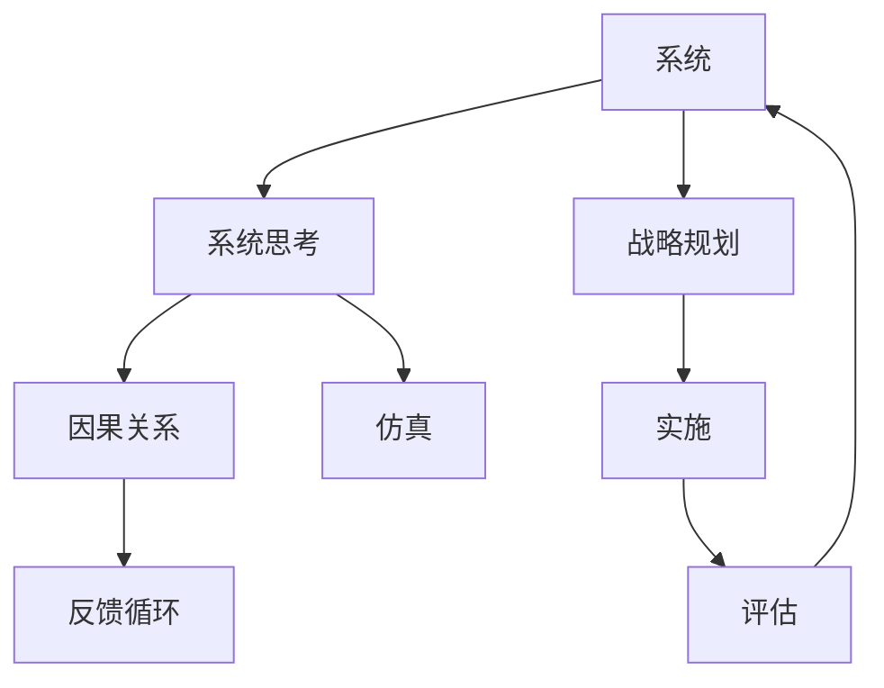

                 

# 系统思考在战略规划中的应用

## 1. 背景介绍

### 1.1 问题由来

系统思考(Systemic Thinking)是上个世纪60年代兴起的一种跨学科思维方式，其核心思想是将研究对象视为一个整体系统，考虑系统各部分间的相互影响和相互作用，而不仅仅局限于对部分要素的孤立分析。

在战略规划中，系统思考成为现代决策者不可或缺的工具。它帮助组织管理者从整体视角出发，理解和处理复杂多变的战略环境，识别影响系统行为的关键驱动因素，并制定基于全局最优的系统性战略决策。

### 1.2 问题核心关键点

系统思考在战略规划中的核心关键点包括：
- 整体性视角：考虑整个系统而不是孤立地看待其中的部分。
- 动态性思维：理解系统随时间变化的特性，并据此进行预测和规划。
- 因果关系分析：识别系统内外部关键驱动因素，构建因果模型。
- 反馈循环理解：发现系统内的正负反馈环，及时调整策略应对。
- 仿真与预测：利用仿真工具模拟系统行为，预测未来的发展趋势。
- 组织学习与适应：构建学习型组织，通过不断反馈和学习优化系统策略。

### 1.3 问题研究意义

系统思考在战略规划中的应用，对于提升组织的战略决策质量，适应环境变化，增强组织的竞争力和适应性具有重要意义：

1. 增强全局视角：系统思考帮助管理者全面理解业务环境，避免因局部利益而做出短视决策。
2. 提高战略灵活性：动态性思维使组织能够更灵活地应对市场和技术的变化，保持长期的竞争力。
3. 优化资源配置：因果关系分析有助于识别关键驱动因素，优化资源配置，提升战略效果。
4. 增强风险管理：反馈循环理解帮助识别风险点，建立预警机制，降低系统不确定性。
5. 促进组织学习：仿真与预测模拟为组织学习提供数据支持，实现持续优化和改进。
6. 加强战略实施：系统思考帮助组织制定系统性战略，提升执行力和执行力。

## 2. 核心概念与联系

### 2.1 核心概念概述

为更好地理解系统思考在战略规划中的应用，本节将介绍几个关键概念：

- 系统(System)：指由多个相互联系和相互作用的元素组成的整体。系统可以是企业、组织、生态系统等。
- 系统思考(Systemic Thinking)：一种跨学科的思维方式，关注系统各部分间的相互关系和整体行为，用于识别影响系统行为的深层次驱动因素。
- 因果关系(Causal Relationship)：系统内部各因素间的关系，通常有正向和负向两种类型。
- 反馈循环(Feedback Loop)：系统内部的信息反馈机制，正反馈会放大变化，负反馈会抑制变化。
- 仿真(Simulation)：通过建立系统的数学模型或计算机模型，预测系统未来的行为和趋势。

这些核心概念通过一个简单的Mermaid流程图来展示，这个流程图展示系统思考在战略规划中的关键联系：



### 2.2 核心概念原理和架构的 Mermaid 流程图



## 3. 核心算法原理 & 具体操作步骤

### 3.1 算法原理概述

系统思考在战略规划中的应用，主要通过以下几个关键步骤：

1. **系统建模**：利用因果关系构建系统的动态模型，并识别关键驱动因素。
2. **仿真模拟**：使用仿真工具预测系统行为，评估不同策略的效果。
3. **反馈控制**：根据仿真结果，调整和优化战略规划，并构建反馈控制机制。
4. **学习与改进**：通过不断的仿真和实践，收集反馈信息，提升战略规划的质量。

### 3.2 算法步骤详解

以下详细介绍系统思考在战略规划中的应用步骤：

**Step 1: 系统建模**

系统建模是战略规划的第一步，涉及识别系统要素，并构建各要素间的因果关系模型。通常可采用因果图(Cause-and-Effect Diagram)、系统动力学模型(System Dynamics Model)等方法。

以一家制造企业为例，系统建模过程如下：

1. **确定系统边界**：明确企业系统的组成要素，如供应链、生产、销售、研发等。
2. **识别因果关系**：通过数据分析、专家访谈等方式，识别要素间的因果关系，如订单量变化对库存的影响，生产速度对客户满意度的影响等。
3. **构建因果图**：使用因果图工具(如Vensim、AnyLogic)，绘制各要素间的因果关系图，并转化为数学模型。

**Step 2: 仿真模拟**

仿真模拟旨在通过数学模型预测系统未来的行为，帮助管理者评估不同战略的效果。常见的仿真工具包括Vensim、AnyLogic、Python等。

以系统动力学模型为例，模拟过程如下：

1. **设定变量**：设定系统中的关键变量，如订单量、库存量、客户满意度等。
2. **建立方程**：根据因果关系，建立各变量间的动态方程。
3. **运行仿真**：在仿真工具中运行模型，观察系统在不同战略下的行为变化。
4. **分析结果**：通过仿真结果，评估战略的优劣，选择最优方案。

**Step 3: 反馈控制**

反馈控制是战略规划中非常重要的一环，通过构建反馈机制，及时调整和优化战略，保持系统的稳定和高效。

以制造企业为例，反馈控制过程如下：

1. **设定指标**：根据关键变量，设定评估指标，如订单满足率、库存周转率、客户满意度等。
2. **监控指标**：实时监控系统的运行状态，收集反馈数据。
3. **分析数据**：利用数据挖掘工具(如Python、R)，分析反馈数据的模式和趋势。
4. **调整策略**：根据反馈数据，及时调整和优化战略，如调整生产计划、优化库存管理等。

**Step 4: 学习与改进**

学习与改进是系统思考中的核心部分，通过不断的反馈和学习，提升战略规划的质量。

以制造企业为例，学习与改进过程如下：

1. **定期评估**：定期对系统的运行情况进行评估，比较实际结果与仿真预测的差异。
2. **收集反馈**：收集员工、客户、供应商等多方的反馈信息，了解系统运行中的问题和改进点。
3. **优化模型**：基于反馈信息，对系统模型进行优化，引入新的因果关系或调整变量。
4. **迭代优化**：通过不断迭代优化模型和战略，提升系统的适应性和绩效。

### 3.3 算法优缺点

系统思考在战略规划中的优点：
1. 全局视角：系统思考帮助管理者全面考虑系统各部分间的相互影响，避免短视决策。
2. 动态模拟：仿真工具可以模拟系统在不同策略下的行为变化，评估战略效果。
3. 反馈控制：通过实时反馈和调整，保持系统的稳定性和高效性。
4. 持续优化：通过不断的反馈和学习，提升战略规划的质量和效率。

系统思考的缺点：
1. 建模复杂：系统建模和仿真模拟需要较长时间和较大投入，尤其在复杂系统中难度更大。
2. 数据需求高：需要大量的数据支持建模和仿真，数据质量对结果影响较大。
3. 学习曲线陡：需要系统思考和仿真模拟的基础，非专业人士可能难以掌握。
4. 结果不确定：系统行为受多种因素影响，仿真结果存在一定的不确定性。

### 3.4 算法应用领域

系统思考在战略规划中的应用，广泛应用于多个行业和领域：

1. 制造业：制造企业通过系统思考和仿真，优化生产计划、库存管理、供应链协调等，提高运营效率。
2. 零售业：零售企业通过系统思考和反馈控制，优化库存水平、客户服务、营销策略，提升客户满意度和销售额。
3. 金融业：金融机构通过系统思考和因果关系分析，优化风险管理、投资决策、客户服务，增强市场竞争力。
4. 医疗行业：医疗机构通过系统思考和仿真，优化诊疗流程、资源配置、病患管理，提高医疗服务质量。
5. 政府治理：政府机构通过系统思考和仿真，优化政策制定、公共服务、应急管理，提高治理效能。

## 4. 数学模型和公式 & 详细讲解 & 举例说明

### 4.1 数学模型构建

系统思考在战略规划中的应用，通常涉及建立系统的因果关系模型，并使用系统动力学方程进行描述。

以一家制造企业为例，其系统因果关系模型包含以下关键变量和方程：

1. **订单量(Orders)**
   - $O(t+1) = O(t) + P(t) - C(t)$

2. **库存量(Inventory)**
   - $I(t+1) = I(t) + O(t) - P(t) - S(t)$

3. **生产量(Production)**
   - $P(t) = f(S(t), M(t), C(t))$

4. **客户满意度(Customer Satisfaction)**
   - $S(t) = g(O(t), I(t), D(t))$

其中：
- $O(t)$ 表示在时间 $t$ 的订单量。
- $I(t)$ 表示在时间 $t$ 的库存量。
- $P(t)$ 表示在时间 $t$ 的生产量。
- $S(t)$ 表示在时间 $t$ 的客户满意度。
- $M(t)$ 表示在时间 $t$ 的机器维护成本。
- $D(t)$ 表示在时间 $t$ 的交付延迟时间。
- $f$ 和 $g$ 为非线性函数，具体形式根据实际数据和业务模型确定。

### 4.2 公式推导过程

以订单量(Orders)方程为例，推导如下：

- 在时间 $t$ 的订单量为 $O(t)$。
- 在时间 $t+1$ 的订单量 $O(t+1)$ 由两部分组成：
  - 时间 $t$ 的订单量 $O(t)$ 的累积。
  - 时间 $t$ 的未交付订单 $P(t)$ 的增加。
  - 时间 $t$ 的退货订单 $C(t)$ 的减少。
- 因此，订单量的动态方程为：

$$
O(t+1) = O(t) + P(t) - C(t)
$$

### 4.3 案例分析与讲解

以一家制造企业为例，分析系统思考在战略规划中的应用：

1. **确定系统边界**：企业系统包括供应链、生产、销售、研发等要素。

2. **识别因果关系**：订单量对库存量有正向影响，订单量对生产量有正向影响，客户满意度对生产量有正向影响，生产量对客户满意度有正向影响。

3. **构建因果图**：

```
Order
  |
  V
 +----> Inventory
  |
  V
P     - C    - D
  |  |  |  |
  V  V  V  V
Sales  Orders  Firm Strategy
```

4. **设定变量**：订单量 $O(t)$、库存量 $I(t)$、生产量 $P(t)$、客户满意度 $S(t)$、机器维护成本 $M(t)$、交付延迟时间 $D(t)$。

5. **建立方程**：根据因果图，建立动态方程组：

$$
\begin{align*}
O(t+1) &= O(t) + P(t) - C(t) \\
I(t+1) &= I(t) + O(t) - P(t) - S(t) \\
P(t) &= f(S(t), M(t), C(t)) \\
S(t) &= g(O(t), I(t), D(t))
\end{align*}
$$

6. **运行仿真**：在Vensim等仿真工具中运行模型，模拟不同的战略方案，如增加营销投入、优化生产计划、改进供应链管理等。

7. **分析结果**：通过仿真结果，评估不同战略方案的效果，选择最优方案，并构建反馈控制机制。

## 5. 项目实践：代码实例和详细解释说明

### 5.1 开发环境搭建

在系统思考的实践中，常用的开发环境包括Python、R、MATLAB等。

以下以Python为例，介绍开发环境的搭建过程：

1. **安装Python**：从官网下载并安装Python，建议使用Anaconda或Miniconda。

2. **创建虚拟环境**：

```bash
conda create -n system_dynamics_env python=3.8
conda activate system_dynamics_env
```

3. **安装必要的库**：

```bash
pip install pandas matplotlib scipy vensim pystructpy
```

4. **安装Vensim**：

```bash
conda install -c conda-forge vensim
```

完成环境配置后，即可开始系统建模和仿真。

### 5.2 源代码详细实现

以下是一个简单的系统动力学模型示例，用于模拟一家制造企业的订单量变化：

```python
import vensim
import matplotlib.pyplot as plt
import pandas as pd

# 创建模型
model = vensim.Model()

# 定义变量
orders = model.add_var('Orders', units='Number')
inventory = model.add_var('Inventory', units='Number')
production = model.add_var('Production', units='Number')
customer_satisfaction = model.add_var('Customer Satisfaction', units='Score')
machine_maintenance_cost = model.add_var('Machine Maintenance Cost', units='Dollar')
delivery_delay_time = model.add_var('Delivery Delay Time', units='Days')

# 建立方程
orders["change"] = vensim expressions.Rule(orders["value"], 0, 1, 1)
inventory["change"] = vensim expressions.Rule(inventory["value"], 0, 1, -1, -1, production["value"])
production["value"] = vensim expressions.Rule(production["value"], 0, 1, customer_satisfaction["value"], machine_maintenance_cost["value"], delivery_delay_time["value"])
customer_satisfaction["value"] = vensim expressions.Rule(customer_satisfaction["value"], 0, 1, orders["value"], inventory["value"], delivery_delay_time["value"])
machine_maintenance_cost["value"] = vensim expressions.Rule(machine_maintenance_cost["value"], 0, 1, 1)
delivery_delay_time["value"] = vensim expressions.Rule(delivery_delay_time["value"], 0, 1, 1)

# 运行仿真
results = model.simulate(0, 12, initial_value={'Orders': 100, 'Inventory': 100, 'Production': 100, 'Customer Satisfaction': 10, 'Machine Maintenance Cost': 0, 'Delivery Delay Time': 0})

# 可视化结果
fig, ax = plt.subplots(figsize=(10, 6))
ax.plot(results['Orders'], label='Orders')
ax.plot(results['Inventory'], label='Inventory')
ax.plot(results['Production'], label='Production')
ax.plot(results['Customer Satisfaction'], label='Customer Satisfaction')
ax.set_xlabel('Time')
ax.set_ylabel('Value')
ax.legend()
plt.show()
```

### 5.3 代码解读与分析

这段代码实现了以下功能：

1. **创建模型**：使用Vensim创建系统动力学模型，添加变量和方程。
2. **定义变量**：添加订单量、库存量、生产量、客户满意度等变量。
3. **建立方程**：根据因果关系建立动态方程，如订单量变化方程、库存量变化方程等。
4. **运行仿真**：模拟不同时间段的系统行为，生成数据结果。
5. **可视化结果**：使用Matplotlib对结果进行可视化，观察系统在不同策略下的行为变化。

### 5.4 运行结果展示

运行以上代码，将生成订单量、库存量、生产量、客户满意度等变量的时间序列图，帮助管理者评估不同战略的效果，并构建反馈控制机制。

## 6. 实际应用场景

### 6.1 制造业

系统思考在制造业中主要应用于生产计划、库存管理、供应链优化等环节。以一家制造企业为例，系统思考的应用场景包括：

1. **生产计划优化**：通过仿真模拟不同生产计划的效果，选择最优的生产计划。
2. **库存管理**：优化库存水平，避免库存过剩或不足，提高运营效率。
3. **供应链协调**：通过因果关系分析，优化供应链上下游的协调机制，降低成本，提高响应速度。

### 6.2 零售业

系统思考在零售业中主要应用于客户服务、库存管理、营销策略等环节。以一家零售企业为例，系统思考的应用场景包括：

1. **客户服务优化**：通过仿真模拟不同服务策略的效果，选择最优的客户服务方案。
2. **库存管理**：优化库存水平，避免库存过剩或不足，提高运营效率。
3. **营销策略优化**：通过因果关系分析，优化营销策略，提升销售额和客户满意度。

### 6.3 金融业

系统思考在金融业中主要应用于风险管理、投资决策、客户服务等环节。以一家金融机构为例，系统思考的应用场景包括：

1. **风险管理**：通过仿真模拟不同风险管理策略的效果，选择最优的风险管理方案。
2. **投资决策**：通过因果关系分析，优化投资组合，提升投资回报。
3. **客户服务优化**：通过仿真模拟不同客户服务策略的效果，选择最优的客户服务方案。

### 6.4 未来应用展望

未来，系统思考在战略规划中的应用将更加广泛，主要发展方向包括：

1. **多模态融合**：结合视觉、听觉、文本等多模态数据，提升系统分析的全面性和准确性。
2. **深度学习应用**：利用深度学习模型进行因果关系学习和预测，提升系统的智能化水平。
3. **实时反馈机制**：构建实时反馈系统，及时调整和优化战略，增强系统的适应性和灵活性。
4. **仿真与优化**：引入优化算法，提升系统仿真的精度和效果，更好地支持决策制定。
5. **可解释性**：增强系统的可解释性，使管理者能够理解系统行为和决策的逻辑。

## 7. 工具和资源推荐

### 7.1 学习资源推荐

为帮助开发者系统掌握系统思考在战略规划中的应用，以下推荐一些优质的学习资源：

1. **《系统动力学入门》书籍**：介绍系统动力学的基本概念和方法，适合初学者入门。
2. **Coursera《系统动力学》课程**：斯坦福大学开设的在线课程，提供系统动力学理论和方法的详细讲解。
3. **Vensim官方文档**：Vensim的官方文档和教程，帮助用户快速上手系统动力学建模和仿真。
4. **MATLAB Simulink**：MATLAB的Simulink工具箱，提供强大的仿真和建模功能。
5. **Python PyStructPy库**：用于系统动力学建模的Python库，适合Python用户使用。

### 7.2 开发工具推荐

常用的系统动力学建模和仿真工具包括：

1. **Vensim**：领先的系统动力学建模工具，支持复杂系统的建模和仿真。
2. **AnyLogic**：强大的建模和仿真工具，支持多学科的复杂系统分析。
3. **MATLAB Simulink**：MATLAB的Simulink工具箱，提供强大的建模和仿真功能。
4. **Simulink**：MATLAB的Simulink工具箱，提供强大的建模和仿真功能。
5. **PyStructPy**：用于系统动力学建模的Python库，适合Python用户使用。

### 7.3 相关论文推荐

系统思考在战略规划中的应用涉及多个学科，以下是一些代表性的研究成果：

1. **《系统动力学基础》**：介绍系统动力学的基础理论和建模方法。
2. **《系统思考：应用案例分析》**：通过实际案例展示系统思考在多个领域的应用。
3. **《仿真建模与优化》**：介绍仿真建模的基本方法和优化算法。
4. **《因果关系学习》**：介绍因果关系学习的理论和应用。
5. **《系统动力学在战略规划中的应用》**：讨论系统思考在战略规划中的理论和实践。

## 8. 总结：未来发展趋势与挑战

### 8.1 研究成果总结

系统思考在战略规划中的应用，通过系统建模、仿真模拟、反馈控制和学习改进，提升了系统的全局视角和动态性，帮助管理者制定更加系统性、灵活性和高效的战略决策。在实际应用中，系统思考已成功应用于制造业、零售业、金融业等多个领域，取得了显著的成效。

### 8.2 未来发展趋势

未来，系统思考在战略规划中的应用将呈现以下几个发展趋势：

1. **多模态融合**：结合视觉、听觉、文本等多模态数据，提升系统分析的全面性和准确性。
2. **深度学习应用**：利用深度学习模型进行因果关系学习和预测，提升系统的智能化水平。
3. **实时反馈机制**：构建实时反馈系统，及时调整和优化战略，增强系统的适应性和灵活性。
4. **仿真与优化**：引入优化算法，提升系统仿真的精度和效果，更好地支持决策制定。
5. **可解释性**：增强系统的可解释性，使管理者能够理解系统行为和决策的逻辑。

### 8.3 面临的挑战

尽管系统思考在战略规划中已经取得了一定成效，但面临的挑战依然不容忽视：

1. **建模复杂**：系统建模和仿真模拟需要较长时间和较大投入，尤其在复杂系统中难度更大。
2. **数据需求高**：需要大量的数据支持建模和仿真，数据质量对结果影响较大。
3. **学习曲线陡**：需要系统思考和仿真模拟的基础，非专业人士可能难以掌握。
4. **结果不确定**：系统行为受多种因素影响，仿真结果存在一定的不确定性。

### 8.4 研究展望

为应对上述挑战，未来的研究需要在以下几个方面寻求新的突破：

1. **简化建模流程**：开发更加用户友好的建模工具，降低系统建模的复杂性和学习成本。
2. **提高数据质量**：利用先进的数据采集和处理技术，提升数据质量和精度，支持更高质量的建模和仿真。
3. **增强可解释性**：利用可解释AI技术，增强系统思考模型的可解释性，使管理者能够理解系统行为和决策的逻辑。
4. **引入优化算法**：结合优化算法，提升系统仿真的精度和效果，更好地支持决策制定。
5. **多学科融合**：结合不同学科的知识和方法，提升系统思考模型的全面性和适用性。

系统思考在战略规划中的应用，为管理者提供了一种全新的系统性思维方式，有助于全面理解系统行为，优化战略决策，提升组织绩效。未来，系统思考的应用将进一步深入到各行业，带来更广泛的变革和创新。相信随着技术的不断进步，系统思考将成为战略规划中不可或缺的重要工具，引领人类进入更加智慧、高效和灵活的未来。

---

作者：禅与计算机程序设计艺术 / Zen and the Art of Computer Programming

