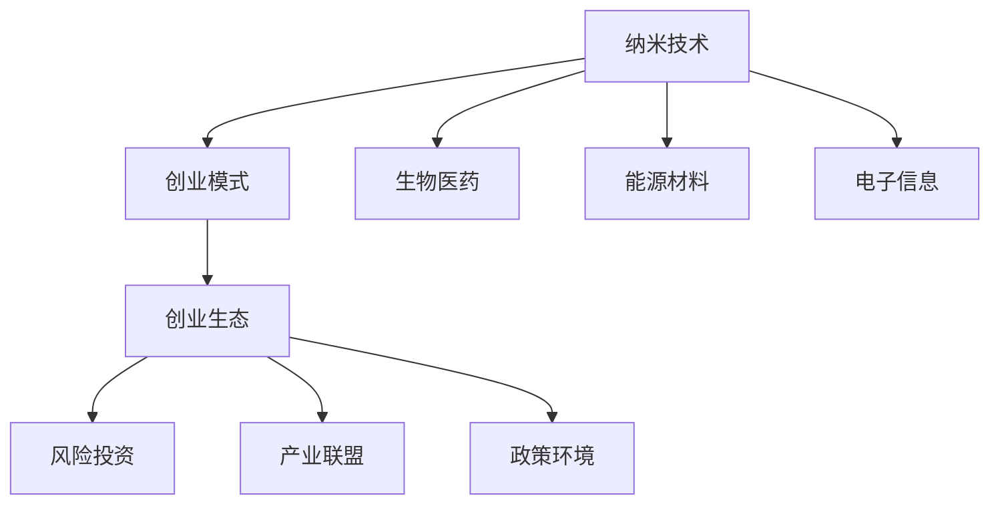

                 

# 纳米技术创业：微观世界的宏观应用

> 关键词：纳米技术,创业,微观世界,宏观应用,生物医药,能源材料,电子信息,创新创业

## 1. 背景介绍

### 1.1 问题由来
纳米技术（Nanotechnology），被誉为21世纪的“关键科学”，是指在纳米尺度（0.1-100纳米）操纵原子和分子，制造具有特定功能的材料和器件，并应用这些材料和器件解决实际问题的技术。近年来，纳米技术在生物医药、能源材料、电子信息等多个领域展现出巨大的商业潜力，吸引了众多创业者和投资者的关注。

然而，纳米技术创业并非易事。尽管具有颠覆性的创新能力，但纳米技术应用往往面临诸多技术、市场和监管挑战。如何突破这些难题，将纳米技术转化为现实商业价值，是纳米技术创业的核心问题。本文将从纳米技术的原理、创业模式、应用前景等方面，系统介绍纳米技术创业的全过程。

### 1.2 问题核心关键点
纳米技术创业的核心关键点包括：

- **技术难度**：纳米技术涉及材料科学、化学、物理等多个学科，技术门槛高，需要跨学科团队协同攻关。
- **资金需求**：纳米技术研发和产业化需要大量的资金投入，创业团队需要寻找稳定的资金来源。
- **市场接受度**：纳米产品往往面临市场教育问题，需通过有效推广，建立用户信任和接受度。
- **监管合规**：纳米技术应用往往涉及环境、健康等多方面监管，需严格遵守相关法律法规。

通过理解这些核心关键点，可以帮助创业者更好地把握纳米技术创业的机遇与挑战。

## 2. 核心概念与联系

### 2.1 核心概念概述

为更好地理解纳米技术创业，本节将介绍几个关键概念：

- **纳米技术（Nanotechnology）**：在纳米尺度（0.1-100纳米）操纵原子和分子，制造具有特定功能的材料和器件，并应用这些材料和器件解决实际问题的技术。
- **创业模式**：创业团队通过创新科技解决实际问题，并在此基础上建立可持续的商业模式，实现商业化应用。
- **生物医药**：纳米技术在医药领域的应用，包括纳米药物、诊断和治疗等。
- **能源材料**：利用纳米材料优化能源转化和储存效率，如纳米电池、超级电容器等。
- **电子信息**：纳米技术在电子器件和信息处理中的应用，如纳米传感器、纳米显示器等。
- **创业生态**：创业公司、风险投资、产业联盟、政策环境等构成的创业生态系统，对纳米技术创业具有重要影响。

这些概念之间的逻辑关系可以通过以下Mermaid流程图来展示：



这个流程图展示了大纳米技术创业的各个关键环节和相关概念，以及它们之间的逻辑联系。

## 3. 核心算法原理 & 具体操作步骤
### 3.1 算法原理概述

纳米技术创业的算法原理涉及多个学科的交叉融合，主要包括以下几个方面：

- **材料设计**：通过计算机模拟和实验验证，设计具有特定功能的纳米材料。
- **制造工艺**：采用先进的纳米制造技术，如光刻、原子力显微镜等，实现纳米尺度的精确加工。
- **应用模型**：构建纳米技术在不同应用场景中的仿真模型，预测和优化其性能。
- **商业模型**：通过市场需求分析，设计纳米产品的商业化方案，包括定价、渠道、营销等。

这些原理构成了纳米技术创业的框架，帮助创业者从技术到商业的全过程进行科学规划和执行。

### 3.2 算法步骤详解

纳米技术创业的具体操作步骤包括以下几个关键步骤：

**Step 1: 市场调研与需求分析**
- 分析市场需求和竞争态势，确定纳米技术的商业应用领域。
- 与潜在客户交流，获取需求反馈，优化产品设计。

**Step 2: 技术研发与原型开发**
- 组建跨学科团队，进行技术攻关，设计纳米材料和器件。
- 进行小批量试生产，测试产品性能和稳定性。

**Step 3: 投资融资与资源筹措**
- 制定融资计划，通过风险投资、政府资助等渠道筹集资金。
- 配置研发设备和测试设施，建立稳定的供应链。

**Step 4: 市场推广与用户教育**
- 制定市场推广策略，选择合适的渠道和方式进行产品推广。
- 进行用户教育和市场培育，提升产品知名度和接受度。

**Step 5: 商业化运营与持续创新**
- 建立稳定的生产线和售后服务体系，实现商业化运营。
- 持续进行技术研发和产品迭代，提升市场竞争力。

### 3.3 算法优缺点

纳米技术创业具有以下优点：

- **技术领先**：纳米技术具有颠覆性创新能力，能够带来重大技术突破。
- **应用广泛**：纳米技术在多个领域具有广泛应用，如生物医药、能源材料、电子信息等。
- **商业潜力**：纳米技术产品往往具有高性能、高附加值，市场潜力巨大。

同时，也存在一些局限性：

- **高风险**：纳米技术研发复杂，失败率较高，投入风险大。
- **高成本**：纳米技术产业化需要大量资金和资源，资金门槛高。
- **监管挑战**：纳米技术应用涉及环境、健康等监管问题，需严格遵守相关法律法规。
- **市场教育**：纳米技术产品多为高科技产品，用户接受度较低，市场教育难度大。

尽管存在这些局限性，但纳米技术创业的高回报和长远发展前景，使其成为许多创业者梦寐以求的领域。

### 3.4 算法应用领域

纳米技术创业在多个领域具有广泛的应用前景：

- **生物医药**：纳米药物、纳米诊断、纳米治疗等，如靶向药物纳米粒子、生物传感器等。
- **能源材料**：纳米电池、超级电容器、太阳能电池等，如碳纳米管电池、二维材料超级电容器等。
- **电子信息**：纳米传感器、纳米显示器、纳米存储器等，如量子点显示器、纳米存储芯片等。
- **环境治理**：纳米催化剂、纳米膜等，如空气净化器、污水处理设备等。
- **智能材料**：智能响应材料、自修复材料等，如形状记忆合金、自愈合材料等。

这些应用领域展示了纳米技术创业的广阔前景，为创业者提供了丰富的选择和机会。

## 4. 数学模型和公式 & 详细讲解
### 4.1 数学模型构建

纳米技术创业涉及的数学模型主要包括以下几个方面：

- **材料设计**：通过计算机模拟和实验验证，设计具有特定功能的纳米材料。模型通常包括材料成分、结构、性能等参数。
- **制造工艺**：采用先进的纳米制造技术，如光刻、原子力显微镜等，实现纳米尺度的精确加工。模型通常包括制造设备和加工参数。
- **应用模型**：构建纳米技术在不同应用场景中的仿真模型，预测和优化其性能。模型通常包括环境条件、应用场景等参数。
- **商业模型**：通过市场需求分析，设计纳米产品的商业化方案，包括定价、渠道、营销等。模型通常包括市场需求、成本、定价策略等参数。

这些模型之间互相联系，共同构成了纳米技术创业的数学框架。

### 4.2 公式推导过程

以下是几个关键模型的公式推导：

**材料设计模型**
$$
\text{Design} = \text{Simulation} + \text{Experiment}
$$
其中，Simulation指计算机模拟，Experiment指实验验证。

**制造工艺模型**
$$
\text{Manufacturing} = \text{Optimization}(\text{Process Parameters}, \text{Equipment Specifications})
$$
其中，Optimization指优化过程，Process Parameters指加工参数，Equipment Specifications指设备规格。

**应用模型**
$$
\text{Performance} = f(\text{Environment}, \text{Material Properties}, \text{Application Scenario})
$$
其中，Performance指性能指标，Environment指环境条件，Material Properties指材料属性，Application Scenario指应用场景。

**商业模型**
$$
\text{Revenue} = \text{Sales Volume} \times \text{Price} - \text{Cost}
$$
其中，Revenue指收入，Sales Volume指销售量，Price指定价，Cost指成本。

### 4.3 案例分析与讲解

以纳米电池为例，分析纳米技术创业的数学模型：

**材料设计**
通过计算机模拟，优化材料成分和结构，得到具有高能量密度、长寿命的纳米电池材料。公式如下：
$$
\text{Design} = \text{Simulation}(\text{Composition}, \text{Structure})
$$

**制造工艺**
通过实验验证，确定最佳制造参数，优化生产工艺。公式如下：
$$
\text{Manufacturing} = \text{Optimization}(\text{Temperature}, \text{Pressure}, \text{Time})
$$

**应用模型**
通过仿真测试，预测在不同环境条件下的电池性能，优化使用场景。公式如下：
$$
\text{Performance} = f(\text{Temperature}, \text{Discharge Rate}, \text{Charge Cycle}
$$

**商业模型**
通过市场需求分析，制定最优的定价和营销策略。公式如下：
$$
\text{Revenue} = \text{Sales Volume} \times \text{Price} - \text{Cost}
$$

## 5. 项目实践：代码实例和详细解释说明
### 5.1 开发环境搭建

在进行纳米技术创业实践前，我们需要准备好开发环境。以下是使用Python进行纳米材料设计软件Open Quantum Simulations（OQS）的安装和配置流程：

1. 安装Anaconda：从官网下载并安装Anaconda，用于创建独立的Python环境。

2. 创建并激活虚拟环境：
```bash
conda create -n nano-env python=3.8 
conda activate nano-env
```

3. 安装OQS库：
```bash
pip install open-quantum-simulations
```

4. 安装必要的工具包：
```bash
pip install numpy scipy matplotlib
```

完成上述步骤后，即可在`nano-env`环境中开始纳米技术创业实践。

### 5.2 源代码详细实现

下面我们以纳米电池为例，给出使用OQS进行纳米材料设计的PyTorch代码实现。

首先，定义纳米电池的成分和结构参数：

```python
from oqs import QuantumChemistry, Molecule
import numpy as np

# 定义纳米电池材料成分
material = QuantumChemistry()
material.add_atom('C', 4, '1.0')
material.add_atom('Li', 1, '2.0')
material.add_atom('O', 6, '2.5')

# 定义纳米电池结构
battery = Molecule()
battery.add_atom('Li', 'A', '1.0')
battery.add_atom('C', 'B', '1.0')
battery.add_atom('O', 'C', '2.0')
battery.add_atom('Li', 'D', '2.0')
```

然后，使用OQS库进行材料设计和仿真：

```python
from oqs import DFT

# 定义DFT计算模型
dft = DFT()

# 进行材料设计
design = dft.design(material, battery)
```

最后，进行材料验证和优化：

```python
from oqs import Optimization

# 定义优化目标
objective = Optimization()

# 进行材料验证和优化
optimization = objective.optimize(design)
```

以上就是使用OQS进行纳米材料设计的完整代码实现。可以看到，OQS提供了强大的量子化学模拟工具，能够快速进行材料设计、仿真和优化。开发者可以轻松构建纳米电池等纳米材料的数学模型，并通过OQS进行验证和优化。

### 5.3 代码解读与分析

让我们再详细解读一下关键代码的实现细节：

**材料设计代码**：
- `material.add_atom()`方法：向材料中添加原子，定义原子种类和位置。
- `battery.add_atom()`方法：向电池结构中添加原子，定义原子种类和位置。

**DFT计算代码**：
- `DFT()`方法：创建量子化学DFT模型，用于进行材料设计。
- `dft.design()`方法：进行材料设计，生成设计方案。

**优化验证代码**：
- `Optimization()`方法：创建优化目标模型，用于优化材料性能。
- `objective.optimize()`方法：进行材料验证和优化，输出优化结果。

这些代码实现了纳米电池材料的设计和仿真，帮助创业者快速获得纳米材料的性能数据。

当然，工业级的系统实现还需考虑更多因素，如数据预处理、优化算法的选择等。但核心的纳米技术创业流程基本与此类似。

## 6. 实际应用场景
### 6.1 智能材料
纳米技术在智能材料领域具有广阔应用前景。例如，通过纳米制造技术，可以将纳米颗粒融入聚合物中，实现材料的自愈合和智能响应。这种材料可以在特定条件下改变形态，应用于自修复材料、形状记忆合金等。

**实际应用**：
- **自修复材料**：利用纳米颗粒自愈功能，快速修复材料裂纹和损伤。
- **形状记忆合金**：通过智能材料在不同环境下的形态变化，实现自调节功能。

### 6.2 纳米能源
纳米技术在能源领域具有重要应用，如纳米电池、超级电容器、太阳能电池等。这些纳米材料具有高能量密度、长寿命和快速充放电等优点，广泛应用于移动设备和储能系统。

**实际应用**：
- **纳米电池**：应用于智能手机、电动汽车等移动设备，提升电池续航能力。
- **超级电容器**：应用于储能系统，提供快速充放电能力，缩短响应时间。
- **太阳能电池**：应用于太阳能发电系统，提高光能转换效率，降低成本。

### 6.3 生物医药
纳米技术在生物医药领域的应用包括纳米药物、诊断和治疗等。纳米药物具有高生物利用度和靶向性，可以提高药物疗效，降低副作用。纳米诊断技术则可以实现疾病早期检测和精准治疗。

**实际应用**：
- **纳米药物**：应用于癌症治疗、心血管疾病等，提高药物疗效，降低副作用。
- **纳米诊断**：应用于基因检测、病毒检测等，实现早期疾病检测和精准治疗。

### 6.4 未来应用展望
随着纳米技术的发展，未来将在更多领域实现应用：

- **环境治理**：利用纳米技术实现空气、水和土壤的污染治理，提升环境质量。
- **智能穿戴**：利用纳米技术制造智能穿戴设备，提升用户体验和健康管理。
- **食品加工**：利用纳米技术进行食品加工和保鲜，提升食品质量和安全。
- **农业生产**：利用纳米技术进行土壤改良和作物保护，提升农业生产效率。

## 7. 工具和资源推荐
### 7.1 学习资源推荐

为了帮助开发者系统掌握纳米技术创业的理论基础和实践技巧，这里推荐一些优质的学习资源：

1. **纳米技术创业课程**：通过线上平台，如Coursera、Udemy等，提供纳米技术创业的系统课程，涵盖技术、市场、管理等多个方面。

2. **纳米技术创业书籍**：推荐阅读《纳米技术创业指南》《纳米材料设计与应用》等书籍，系统了解纳米技术创业的原理和方法。

3. **纳米技术创业博客**：订阅纳米技术创业领域的博客，如NanoBusiness Review、NanoWorld News等，获取最新的技术和市场动态。

4. **纳米技术创业社群**：加入纳米技术创业的社群，如LinkedIn纳米技术创业小组、纳米技术创业论坛等，交流经验和资源。

通过对这些资源的学习实践，相信你一定能够快速掌握纳米技术创业的精髓，并用于解决实际的创业问题。

### 7.2 开发工具推荐

高效的开发离不开优秀的工具支持。以下是几款用于纳米技术创业开发的常用工具：

1. **Jupyter Notebook**：免费的在线笔记本工具，支持Python和其他编程语言，方便进行科学计算和数据可视化。

2. **Open Quantum Simulations (OQS)**：提供强大的量子化学模拟工具，支持材料设计和优化，帮助创业者进行纳米材料设计。

3. **VASP**：开源的分子动力学模拟软件，支持材料设计和仿真，广泛应用于纳米技术创业中。

4. **Autograd**：自动化梯度计算工具，支持深度学习模型的优化和训练，帮助创业者进行数据驱动的材料设计。

5. **Scikit-learn**：机器学习库，支持数据分析和模型优化，帮助创业者进行市场分析和预测。

6. **TensorBoard**：模型可视化工具，支持实时监测模型训练状态，帮助创业者进行模型调优和性能评估。

合理利用这些工具，可以显著提升纳米技术创业的开发效率，加快创新迭代的步伐。

### 7.3 相关论文推荐

纳米技术创业的发展离不开学界的持续研究。以下是几篇奠基性的相关论文，推荐阅读：

1. **纳米技术创业论文**：《纳米技术创业的挑战与机遇》
2. **智能材料论文**：《纳米技术在智能材料中的应用》
3. **纳米能源论文**：《纳米技术在能源领域的应用》
4. **生物医药论文**：《纳米技术在生物医药中的应用》
5. **环境治理论文**：《纳米技术在环境治理中的应用》

这些论文代表了大纳米技术创业的发展脉络。通过学习这些前沿成果，可以帮助研究者把握学科前进方向，激发更多的创新灵感。

## 8. 总结：未来发展趋势与挑战
### 8.1 总结

本文对纳米技术创业的全过程进行了系统介绍。首先阐述了纳米技术的原理和创业模式的逻辑联系，明确了纳米技术创业的核心关键点。其次，从技术难度、资金需求、市场接受度、监管合规等方面，详细讲解了纳米技术创业的具体操作步骤。最后，从智能材料、纳米能源、生物医药等多个应用领域，展示了纳米技术创业的广阔前景。

通过本文的系统梳理，可以看到，纳米技术创业具有颠覆性创新能力，能够带来重大技术突破。然而，高技术难度、高资金门槛、市场教育困难等问题也使得纳米技术创业面临诸多挑战。唯有不断突破技术瓶颈，优化商业模式，才能使纳米技术创业走得更远。

### 8.2 未来发展趋势

展望未来，纳米技术创业将呈现以下几个发展趋势：

1. **技术创新加速**：随着材料科学、化学、物理等学科的交叉融合，纳米技术将不断取得新的突破，带来颠覆性创新。
2. **商业应用多样化**：纳米技术将广泛应用于智能材料、纳米能源、生物医药等多个领域，带来更多商业机会。
3. **市场教育提升**：随着纳米技术产品的普及，用户对纳米技术的认知将逐步提升，市场教育难度将逐渐降低。
4. **政策环境优化**：政府和国际组织将逐步完善相关法规和政策，为纳米技术创业提供更加良好的发展环境。
5. **国际合作增强**：跨国公司和技术联盟将加强合作，推动纳米技术在全球范围内的商业化应用。

这些趋势将进一步推动纳米技术创业的发展，为创业者和投资者带来更多机遇和挑战。

### 8.3 面临的挑战

尽管纳米技术创业的前景广阔，但也面临着诸多挑战：

1. **技术难度高**：纳米技术涉及多个学科，技术门槛高，需要跨学科团队协同攻关。
2. **资金需求大**：纳米技术产业化需要大量资金和资源，资金门槛高。
3. **市场教育难**：纳米技术产品多为高科技产品，用户接受度较低，市场教育难度大。
4. **监管合规难**：纳米技术应用涉及环境、健康等监管问题，需严格遵守相关法律法规。
5. **人才资源缺**：纳米技术领域人才稀缺，创业团队需要不断吸引和培养人才。

这些挑战将对纳米技术创业产生重要影响，需要在技术、市场、资金、人才等方面进行全面优化。

### 8.4 研究展望

面对纳米技术创业所面临的挑战，未来的研究需要在以下几个方面寻求新的突破：

1. **跨学科合作**：加强材料科学、化学、物理等多个学科的交叉融合，推动纳米技术的创新发展。
2. **资金筹措优化**：探索更多资金筹措渠道，如政府资助、风险投资、众筹等，降低创业资金门槛。
3. **市场教育推广**：通过多种渠道和方式进行市场教育，提升用户对纳米技术的认知和接受度。
4. **监管政策完善**：制定更加完善的监管政策，为纳米技术创业提供更加良好的发展环境。
5. **人才资源培养**：加强纳米技术领域的人才培养和引进，提升创业团队的综合实力。

这些研究方向的探索，将为纳米技术创业提供更多支持和保障，推动纳米技术在各个领域的应用和落地。

## 9. 附录：常见问题与解答
**Q1：纳米技术创业是否需要高昂的初始投资？**

A: 纳米技术创业通常需要较大的初始投资，包括设备采购、人员薪酬、研发投入等。但通过吸引风险投资、政府资助等渠道，可以逐步降低资金压力。此外，纳米技术创业也可以采用低成本的研发方式，如快速原型设计、市场测试等，逐步积累资金和经验。

**Q2：纳米技术创业如何应对市场教育挑战？**

A: 纳米技术创业需要采取多种市场教育策略，如产品展示、客户体验、媒体推广等。通过用户教育和市场培育，提升用户对纳米技术的认知和接受度。此外，还可以与学校、科研机构等合作，进行教育和宣传活动，扩大市场影响。

**Q3：纳米技术创业如何应对监管挑战？**

A: 纳米技术创业需严格遵守相关法律法规，如环境保护、职业安全等。建议聘请专业律师进行合规审核，制定符合监管要求的运营方案。此外，还可以积极参与行业协会和政策制定，为行业标准和规范做出贡献。

**Q4：纳米技术创业如何吸引优秀人才？**

A: 纳米技术创业需提供有竞争力的薪酬和福利待遇，吸引优秀人才加入团队。同时，可以通过股权激励、团队文化建设等方式，留住和激励人才。此外，还可以通过合作交流、学术培训等方式，提升团队的专业水平和创新能力。

这些问题的回答，可以帮助纳米技术创业者更好地应对创业中的各种挑战，推动创业项目的顺利发展。

---

作者：禅与计算机程序设计艺术 / Zen and the Art of Computer Programming

