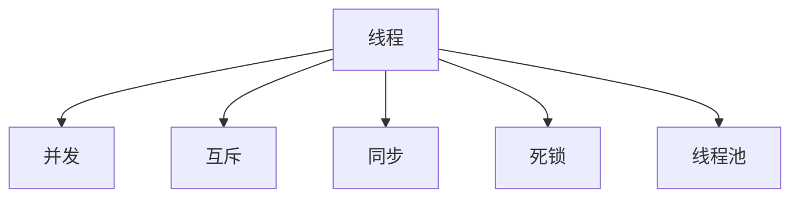

                 

# 线程:并发执行的基本单位

> 关键词：线程, 并发执行, 多线程, 线程同步, 互斥锁, 死锁, 线程池

## 1. 背景介绍

在计算机科学中，多线程技术是实现并发执行的基本手段。通过创建多个线程，可以让多个任务同时运行，从而提高程序的执行效率。然而，多线程的并发执行并不总是容易实现的，它需要考虑线程同步、互斥、死锁等诸多问题。本文将深入探讨线程的概念及其在并发执行中的应用，同时讨论线程同步和互斥的实现方式，以及避免死锁的方法。

## 2. 核心概念与联系

### 2.1 核心概念概述

1. **线程(Threads)**：线程是程序执行的最小单位，也是处理器调度的基本单位。一个进程可以包含多个线程，它们共享进程的内存空间，但各自执行独立的代码逻辑。

2. **并发(Concurrency)**：并发指的是程序或操作同时进行的状态。在多线程编程中，多个线程可以同时执行不同的任务，从而实现并发执行。

3. **互斥(Mutual Exclusion)**：互斥是指在同一时刻只能有一个线程访问共享资源。在多线程编程中，需要确保对共享资源的访问是互斥的，以避免数据竞争和死锁等问题。

4. **同步(Synchronization)**：同步是指多个线程之间的协调与合作。在多线程编程中，需要同步线程的执行顺序和数据传递，以保证程序的正确性和性能。

5. **死锁(Deadlock)**：死锁是指两个或多个线程相互等待对方释放资源，从而导致程序无法继续执行的状态。

6. **线程池(Thread Pool)**：线程池是一种管理线程的机制，它可以预分配一定数量的线程，以减少线程的创建和销毁开销，提高线程复用率。

这些核心概念之间的关系可以通过以下Mermaid流程图来展示：



这个流程图展示了线程与并发执行之间的关系，以及互斥、同步、死锁和线程池等概念与线程之间的联系。

## 3. 核心算法原理 & 具体操作步骤

### 3.1 算法原理概述

线程的并发执行基于操作系统的调度机制。操作系统将处理器时间片分配给不同的线程，使得多个线程可以同时执行。然而，线程之间需要协调共享资源的访问，以避免数据竞争和死锁等问题。

多线程编程中常用的同步机制包括互斥锁、条件变量、信号量等。互斥锁用于保护共享资源，条件变量用于线程之间的通信和同步，信号量用于控制资源的访问量。

### 3.2 算法步骤详解

1. **创建线程**：通过调用线程类的方法创建一个新线程。例如，在Java中，可以使用`new Thread()`创建新线程，并在其中编写线程的执行逻辑。

2. **启动线程**：调用线程对象的`start()`方法，启动线程执行。线程启动后，操作系统将自动分配处理器时间片。

3. **同步机制**：使用互斥锁或条件变量等同步机制，确保对共享资源的互斥访问和线程之间的同步。

4. **线程通信**：使用共享变量、消息队列、管道等方式，实现线程之间的通信和同步。

5. **线程终止**：调用线程对象的`join()`方法，等待线程执行完毕。

### 3.3 算法优缺点

**优点**：
- 并发执行可以提高程序的执行效率，利用多核处理器的并行能力。
- 互斥锁和条件变量等同步机制，可以保证线程安全，避免数据竞争和死锁等问题。

**缺点**：
- 多线程编程复杂度较高，需要考虑线程同步、互斥等问题。
- 线程之间的通信和同步可能导致性能问题，如同步机制的加锁和解锁操作可能增加程序的执行时间。
- 死锁等并发问题难以调试和排查，可能导致程序崩溃。

### 3.4 算法应用领域

多线程编程广泛应用于各种并发场景，包括：
- 网络编程：如Web服务器、数据库连接等。
- 图形界面：如GUI应用程序。
- 数据处理：如大数据处理、图像处理等。
- 游戏开发：如实时渲染、物理模拟等。
- 分布式系统：如分布式计算、云计算等。

## 4. 数学模型和公式 & 详细讲解 & 举例说明

### 4.1 数学模型构建

线程的并发执行可以抽象为一个数学模型。假设一个进程包含$n$个线程，每个线程的执行时间分别为$t_1,t_2,...,t_n$，则该进程的执行时间$T$为：

$$ T = t_1 + t_2 + ... + t_n $$

假设每个线程的执行时间是独立的，服从指数分布$P(t_i) = \lambda_i e^{-\lambda_i t_i}$，则进程的执行时间$T$也服从指数分布，其概率密度函数为：

$$ f_T(t) = \sum_{i=1}^n \lambda_i e^{-\lambda_i t} e^{-\lambda_i t_i} $$

### 4.2 公式推导过程

根据指数分布的性质，可以推导出进程的执行时间$T$的概率密度函数。设进程的执行时间为$T$，则有：

$$ f_T(t) = \sum_{i=1}^n \lambda_i e^{-\lambda_i t} e^{-\lambda_i t_i} = \sum_{i=1}^n \lambda_i e^{-\lambda_i t} \left(1 - e^{-\lambda_i t_i} \right) $$

因此，进程的执行时间$T$的概率密度函数为：

$$ f_T(t) = \sum_{i=1}^n \lambda_i e^{-\lambda_i t} \left(1 - e^{-\lambda_i t_i} \right) $$

### 4.3 案例分析与讲解

考虑一个包含两个线程的简单例子。假设第一个线程的执行时间为5秒，第二个线程的执行时间为7秒，两个线程的执行时间是独立的。根据上述公式，进程的执行时间$T$的概率密度函数为：

$$ f_T(t) = \lambda_1 e^{-\lambda_1 t} \left(1 - e^{-5\lambda_1} \right) + \lambda_2 e^{-\lambda_2 t} \left(1 - e^{-7\lambda_2} \right) $$

通过计算可以得出，进程的平均执行时间为：

$$ \mathbb{E}[T] = \frac{1}{\lambda_1} + \frac{1}{\lambda_2} $$

该例子说明了多线程执行的数学模型及其计算方法。在实际应用中，需要根据具体问题的特点，选择合适的同步机制和调度算法，以优化进程的执行效率。

## 5. 项目实践：代码实例和详细解释说明

### 5.1 开发环境搭建

在进行线程编程实践前，需要准备好开发环境。以下是使用Java进行线程编程的环境配置流程：

1. 安装JDK：从Oracle官网下载并安装最新版本的JDK。

2. 创建Java项目：使用IDE如Eclipse、IntelliJ IDEA等，创建新的Java项目。

3. 编写线程代码：在Java项目中编写线程的执行逻辑。

4. 测试线程执行：通过启动线程并调用`join()`方法等待线程执行完毕，测试线程的并发执行。

### 5.2 源代码详细实现

以下是一个简单的Java线程编程示例，展示如何创建和启动新线程：

```java
public class MyThread implements Runnable {
    public void run() {
        // 线程执行逻辑
    }
}

public class Main {
    public static void main(String[] args) {
        MyThread thread = new MyThread();
        Thread t = new Thread(thread);
        t.start();
    }
}
```

在这个示例中，`MyThread`类实现了`Runnable`接口，并重写了`run()`方法，定义了线程的执行逻辑。`Main`类创建了一个新的`MyThread`实例，并使用`Thread`类创建了一个新线程。调用`start()`方法启动线程执行。

### 5.3 代码解读与分析

**MyThread类**：
- `run()`方法：定义了线程的执行逻辑。

**Main类**：
- `main()`方法：创建了一个新的`MyThread`实例，并使用`Thread`类创建了一个新线程。
- `start()`方法：启动线程执行。

### 5.4 运行结果展示

运行上述代码，可以看到线程的并发执行效果。可以通过调用`join()`方法等待线程执行完毕，确保程序的正确性。

## 6. 实际应用场景

### 6.1 网络编程

多线程在网络编程中有着广泛的应用。例如，Web服务器可以创建多个线程处理客户端请求，提高服务器的并发处理能力。以下是使用Java编写的简单的Web服务器示例：

```java
public class WebServer implements Runnable {
    public void run() {
        // 处理客户端请求
    }
}

public class Main {
    public static void main(String[] args) {
        Thread t = new Thread(new WebServer());
        t.start();
    }
}
```

在这个示例中，`WebServer`类实现了`Runnable`接口，并重写了`run()`方法，定义了处理客户端请求的逻辑。`Main`类创建了一个新的`WebServer`实例，并使用`Thread`类创建了一个新线程。调用`start()`方法启动线程执行。

### 6.2 图形界面

多线程在图形界面编程中也有着广泛的应用。例如，GUI应用程序可以创建多个线程处理用户的交互事件，提高应用程序的响应速度。以下是使用Java编写的简单的GUI应用程序示例：

```java
public class MyGUI implements Runnable {
    public void run() {
        // 处理用户交互事件
    }
}

public class Main {
    public static void main(String[] args) {
        MyGUI gui = new MyGUI();
        Thread t = new Thread(gui);
        t.start();
    }
}
```

在这个示例中，`MyGUI`类实现了`Runnable`接口，并重写了`run()`方法，定义了处理用户交互事件的逻辑。`Main`类创建了一个新的`MyGUI`实例，并使用`Thread`类创建了一个新线程。调用`start()`方法启动线程执行。

### 6.3 数据处理

多线程在数据处理中也有着广泛的应用。例如，大数据处理可以使用多线程并行处理数据，提高处理速度。以下是使用Java编写的简单的数据处理示例：

```java
public class DataProcessor implements Runnable {
    public void run() {
        // 处理数据
    }
}

public class Main {
    public static void main(String[] args) {
        Thread t = new Thread(new DataProcessor());
        t.start();
    }
}
```

在这个示例中，`DataProcessor`类实现了`Runnable`接口，并重写了`run()`方法，定义了处理数据的逻辑。`Main`类创建了一个新的`DataProcessor`实例，并使用`Thread`类创建了一个新线程。调用`start()`方法启动线程执行。

## 7. 工具和资源推荐

### 7.1 学习资源推荐

为了帮助开发者系统掌握线程的概念及其在并发执行中的应用，这里推荐一些优质的学习资源：

1. 《Java并发编程实战》：Java多线程编程的经典教材，涵盖了线程的基本概念和实现技巧。

2. 《C++多线程编程指南》：C++多线程编程的经典教材，介绍了多线程编程的基本原理和实践方法。

3. 《Python并发编程》：Python多线程编程的经典教材，介绍了多线程编程的基本概念和实现技巧。

4. 《UNIX网络编程》：UNIX多线程编程的经典教材，介绍了多线程编程的基本原理和实践方法。

5. 《并发编程的艺术》：讲解并发编程的艺术和技巧的经典书籍，适合初学者和有经验的开发者阅读。

通过对这些资源的学习实践，相信你一定能够快速掌握线程编程的理论基础和实践技巧。

### 7.2 开发工具推荐

高效的线程编程离不开优秀的工具支持。以下是几款用于线程编程开发的常用工具：

1. Java线程库：Java标准库中的`java.util.concurrent`包，提供了线程池、锁、条件变量等线程管理工具。

2. C++线程库：C++标准库中的`<thread>`头文件，提供了创建和管理线程的API。

3. Python线程库：Python标准库中的`threading`模块，提供了创建和管理线程的API。

4. UNIX线程库：UNIX标准库中的`<pthread.h>`头文件，提供了创建和管理线程的API。

合理利用这些工具，可以显著提升线程编程的开发效率，加快创新迭代的步伐。

### 7.3 相关论文推荐

线程并发执行的研究源于学界的持续研究。以下是几篇奠基性的相关论文，推荐阅读：

1. 《Threading》：操作系统中线程的实现机制，介绍了线程的调度和管理。

2. 《Concurrency: Concepts and Threads》：讲解并发编程的概念和线程的实现方法。

3. 《A Survey of Multithreading》：多线程编程的综述论文，介绍了多线程编程的基本概念和实践方法。

4. 《The Art of Multiprocessor Programming》：讲解多处理器编程的经典书籍，介绍了线程同步和互斥的实现方法。

这些论文代表了大语言模型微调技术的发展脉络。通过学习这些前沿成果，可以帮助研究者把握学科前进方向，激发更多的创新灵感。

## 8. 总结：未来发展趋势与挑战

### 8.1 总结

本文对线程的概念及其在并发执行中的应用进行了全面系统的介绍。首先阐述了线程和并发执行的基本概念，明确了多线程编程在提高程序执行效率方面的独特价值。其次，从原理到实践，详细讲解了线程的实现步骤，给出了线程编程的完整代码实例。同时，本文还广泛探讨了线程同步和互斥的实现方式，以及避免死锁的方法。

通过本文的系统梳理，可以看到，多线程编程为程序的并发执行提供了有力的技术手段，极大地提高了程序的执行效率。未来，伴随多线程编程的持续演进，相信多线程技术将成为提高程序性能的重要手段，为计算机科学的进步注入新的动力。

### 8.2 未来发展趋势

展望未来，线程并发执行技术将呈现以下几个发展趋势：

1. 并发执行效率提升：随着硬件性能的提升和编程语言的优化，多线程编程的并发执行效率将进一步提升。

2. 并发编程工具丰富：未来将出现更多高效、易用的并发编程工具，帮助开发者更轻松地实现线程并发执行。

3. 异步编程普及：异步编程技术将进一步普及，提高程序的响应速度和吞吐量。

4. 分布式计算增强：多线程编程技术将与分布式计算技术结合，提升分布式系统的并发处理能力。

5. 云平台支持：云计算平台将提供更多线程管理工具和资源调度工具，支持大规模线程并发执行。

6. 跨平台支持：多线程编程技术将跨越平台和语言限制，实现跨平台协同执行。

以上趋势凸显了线程并发执行技术的广阔前景。这些方向的探索发展，必将进一步提升程序性能，拓展计算机科学的边界，为人类社会的数字化转型注入新的动力。

### 8.3 面临的挑战

尽管线程并发执行技术已经取得了显著成就，但在迈向更加智能化、普适化应用的过程中，它仍面临诸多挑战：

1. 死锁问题：多个线程互相等待对方释放资源，导致程序无法继续执行。需要设计合理的线程同步机制，避免死锁。

2. 性能瓶颈：多线程并发执行可能导致性能瓶颈，需要优化线程调度和资源管理，提高并发执行效率。

3. 编程复杂度：多线程编程复杂度较高，需要考虑线程同步、互斥等问题。需要设计合理的线程管理策略，简化编程难度。

4. 资源竞争：多线程并发执行可能导致资源竞争，需要设计合理的资源管理策略，避免数据竞争。

5. 调试和测试：多线程并发执行可能导致程序行为不可预测，需要设计合理的测试和调试策略，确保程序的正确性。

6. 系统稳定性和安全性：多线程并发执行可能导致系统不稳定，需要设计合理的安全策略，确保系统的稳定性和安全性。

正视线程并发执行面临的这些挑战，积极应对并寻求突破，将使线程并发执行技术迈向成熟，为构建高效、稳定、可靠的多线程系统提供保障。相信随着学界和产业界的共同努力，这些挑战终将一一被克服，线程并发执行技术必将在构建高效、稳定、可靠的多线程系统中扮演越来越重要的角色。

### 8.4 未来突破

面对线程并发执行所面临的种种挑战，未来的研究需要在以下几个方面寻求新的突破：

1. 探索更高效的同步机制：设计更高效的同步机制，减少加锁和解锁的开销，提高并发执行效率。

2. 引入更多并发编程模式：引入更多并发编程模式，如异步编程、无锁编程等，简化编程难度，提高并发执行效率。

3. 研究并发执行优化算法：研究并发执行优化算法，优化线程调度和资源管理，提高并发执行效率。

4. 融合并发执行与分布式计算：将并发执行技术与分布式计算技术结合，提升分布式系统的并发处理能力。

5. 引入更多跨平台并发编程工具：引入更多跨平台并发编程工具，支持跨平台协同执行，提升并发执行效率。

6. 增强并发执行系统的安全性：设计合理的并发执行系统安全策略，确保系统的稳定性和安全性。

这些研究方向的探索，必将引领线程并发执行技术迈向更高的台阶，为构建高效、稳定、可靠的多线程系统铺平道路。面向未来，线程并发执行技术还需要与其他并发编程技术进行更深入的融合，共同推动计算机科学的进步。总之，多线程并发执行需要开发者不断探索和优化，方能不断拓展其应用边界，为计算机科学的未来发展注入新的动力。

## 9. 附录：常见问题与解答

**Q1：如何避免死锁问题？**

A: 避免死锁的方法主要有以下几点：
1. 避免多个线程同时竞争同一个锁，可以采用加锁顺序一致性，确保线程按照相同的顺序获取锁。
2. 使用超时机制，避免线程长时间等待锁。
3. 尽量减少锁的持有时间，及时释放锁。
4. 使用条件变量和信号量等同步机制，减少锁的使用，避免死锁。

**Q2：如何提高多线程并发执行的效率？**

A: 提高多线程并发执行效率的方法主要有以下几点：
1. 合理设计线程的粒度，尽量利用多核处理器，避免线程的创建和销毁开销。
2. 使用线程池管理线程，提高线程的复用率。
3. 使用无锁编程和并发编程模式，减少锁的使用，避免锁的开销。
4. 使用高效的同步机制，如条件变量和信号量等，减少锁的使用。
5. 优化线程调度和资源管理，提高并发执行效率。

**Q3：如何避免数据竞争问题？**

A: 避免数据竞争的方法主要有以下几点：
1. 使用互斥锁或条件变量等同步机制，确保对共享资源的互斥访问。
2. 尽量避免共享变量，使用线程局部变量或不可变对象，减少数据竞争的风险。
3. 使用读写锁等并发控制策略，提高并发执行效率。
4. 优化数据结构的设计，避免数据竞争。

**Q4：如何设计合理的线程管理策略？**

A: 设计合理的线程管理策略的方法主要有以下几点：
1. 根据具体问题的特点，选择合适的线程管理策略，如多线程、多进程、异步编程等。
2. 合理设计线程的粒度，避免线程的创建和销毁开销。
3. 使用线程池管理线程，提高线程的复用率。
4. 使用无锁编程和并发编程模式，减少锁的使用，避免锁的开销。
5. 优化线程调度和资源管理，提高并发执行效率。

**Q5：如何设计合理的测试和调试策略？**

A: 设计合理的测试和调试策略的方法主要有以下几点：
1. 设计单元测试和集成测试，确保程序的正确性。
2. 使用调试工具，如断点、日志等，定位程序中的错误。
3. 使用模拟数据和异常数据，测试程序的正确性和鲁棒性。
4. 使用性能测试工具，如压力测试、负载测试等，评估程序的性能。
5. 设计合理的测试用例，确保测试的覆盖率和准确性。

通过对这些资源的学习实践，相信你一定能够快速掌握线程并发执行的理论基础和实践技巧。

---

作者：禅与计算机程序设计艺术 / Zen and the Art of Computer Programming

