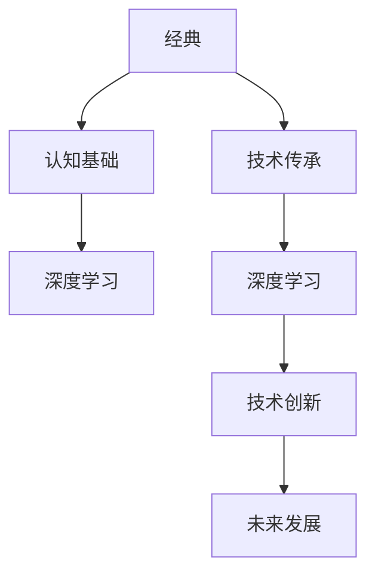

                 

# 经典为师:夯实认知基础的必由之路

## 1. 背景介绍

在当今这个信息爆炸的时代，技术的更新迭代速度不断加快，如何在纷繁复杂的技术环境中找到一条能够稳健前行的道路，成为了许多IT从业人员和研究人员关注的焦点。本博客将探讨“经典为师”这一理念，分析其对夯实认知基础的重要性，并结合具体案例，阐述如何在实际工作中运用这一理念。

## 2. 核心概念与联系

### 2.1 核心概念概述

本文的核心概念包括经典、认知基础、技术传承、深度学习等，这些概念之间存在着紧密的联系。

- **经典**：经典通常指的是经过长时间考验、具有普遍适用性和长久生命力的理论或实践。
- **认知基础**：认知基础是指人类或智能体对世界的理解与知识，是建立在经验、观察和推理之上的。
- **技术传承**：技术传承是指通过经典文献、书籍、论文、代码等形式，将知识、技能和经验从一代人传递给另一代人的过程。
- **深度学习**：深度学习是一种机器学习技术，通过构建深层神经网络来模拟人脑处理数据的能力。

这些概念共同构成了技术传承的基础，深度学习作为现代技术的代表，其发展也离不开对经典的深入理解和传承。

### 2.2 核心概念原理和架构的 Mermaid 流程图



这个流程图展示了经典、认知基础、技术传承、深度学习、技术创新和未来发展之间的联系。经典和认知基础是技术传承的基石，而技术传承又为深度学习提供了丰富的理论基础和实践经验，推动了深度学习的发展。深度学习的成功应用和创新，又反过来加深了对经典理论的理解，促进了技术的进一步发展。

## 3. 核心算法原理 & 具体操作步骤

### 3.1 算法原理概述

深度学习算法在处理复杂数据、提取特征、构建模型等方面展现出强大的能力。然而，深度学习的理论基础和实现方法并非凭空而来，而是建立在经典理论之上，如机器学习、统计学、神经科学等。本文将从深度学习的基本原理出发，分析其在实际应用中的操作步骤。

### 3.2 算法步骤详解

深度学习的核心步骤包括数据预处理、模型构建、训练、调参和测试。

1. **数据预处理**：清洗、归一化、分词、构建标签等步骤，为深度学习模型提供高质量的数据。
2. **模型构建**：选择合适的架构（如卷积神经网络、循环神经网络、Transformer等），并设计适合任务的模型结构。
3. **训练**：使用反向传播算法更新模型参数，通过正则化、Dropout等技术防止过拟合。
4. **调参**：调整学习率、批大小、迭代次数等超参数，以获得最优的模型性能。
5. **测试**：在测试集上评估模型性能，确保模型泛化能力强，适用于真实场景。

### 3.3 算法优缺点

深度学习算法具有以下优点：

- 强大的数据处理能力，能够自动提取高层次的特征。
- 适用于多种任务，如图像识别、自然语言处理、语音识别等。
- 在处理大规模数据时表现优异。

然而，深度学习也存在一些缺点：

- 对数据质量要求高，需要大量标注数据。
- 模型复杂，训练和调参过程耗时较长。
- 可能存在过拟合问题，泛化能力不足。

### 3.4 算法应用领域

深度学习在计算机视觉、自然语言处理、语音识别、推荐系统、医学影像分析等多个领域得到了广泛应用。以自然语言处理为例，深度学习模型如BERT、GPT、XLNet等在文本分类、情感分析、机器翻译、问答系统等任务上取得了显著的成果。

## 4. 数学模型和公式 & 详细讲解 & 举例说明

### 4.1 数学模型构建

本节将详细介绍深度学习模型的数学模型构建过程。以神经网络为例，神经网络可以表示为：

$$
f(x;w,b) = \sigma(\sum_{i=1}^{n} w_i a_i(x) + b)
$$

其中 $x$ 是输入向量，$w$ 是权重矩阵，$b$ 是偏置向量，$\sigma$ 是非线性激活函数，$a_i(x)$ 是输入向量 $x$ 通过权重矩阵 $w_i$ 和偏置 $b$ 线性变换后的结果。

### 4.2 公式推导过程

以反向传播算法为例，其公式推导过程如下：

$$
\frac{\partial L}{\partial w} = \frac{\partial L}{\partial y} \frac{\partial y}{\partial z} \frac{\partial z}{\partial w}
$$

其中 $L$ 是损失函数，$y$ 是输出，$z$ 是中间层的输出。通过反向传播，可以计算出每个权重 $w$ 对损失函数 $L$ 的贡献，从而更新权重，优化模型性能。

### 4.3 案例分析与讲解

以卷积神经网络（CNN）为例，CNN 常用于图像识别任务。其核心思想是通过卷积层提取图像的特征，并通过池化层减小特征图的大小。假设输入图像 $x$ 为 $m \times n \times c$ 的张量，卷积核 $k$ 为 $h \times w \times c$ 的张量，卷积操作可表示为：

$$
f(x) = \sum_{i=1}^{k} \sum_{j=1}^{c} w_{i,j} x_{i,j} \ast k
$$

其中 $\ast$ 表示卷积运算。通过不断叠加卷积和池化层，CNN 可以逐步提取出图像的高层次特征，并进行分类。

## 5. 项目实践：代码实例和详细解释说明

### 5.1 开发环境搭建

为了进行深度学习模型的开发，首先需要搭建开发环境。本文以 PyTorch 为例，介绍开发环境的搭建步骤。

1. 安装 PyTorch：
```bash
pip install torch torchvision torchaudio
```

2. 安装必要的依赖：
```bash
pip install numpy scipy scikit-learn matplotlib seaborn jupyter
```

3. 创建虚拟环境：
```bash
python -m venv venv
source venv/bin/activate
```

### 5.2 源代码详细实现

以下是一个简单的图像分类器的代码实现，以 MNIST 数据集为例：

```python
import torch
import torch.nn as nn
import torch.optim as optim
from torchvision import datasets, transforms

# 定义模型
class Net(nn.Module):
    def __init__(self):
        super(Net, self).__init__()
        self.conv1 = nn.Conv2d(1, 32, 3, 1)
        self.conv2 = nn.Conv2d(32, 64, 3, 1)
        self.dropout1 = nn.Dropout(0.25)
        self.dropout2 = nn.Dropout(0.5)
        self.fc1 = nn.Linear(9216, 128)
        self.fc2 = nn.Linear(128, 10)

    def forward(self, x):
        x = self.conv1(x)
        x = nn.functional.relu(x)
        x = self.conv2(x)
        x = nn.functional.relu(x)
        x = nn.functional.max_pool2d(x, 2)
        x = self.dropout1(x)
        x = torch.flatten(x, 1)
        x = self.fc1(x)
        x = nn.functional.relu(x)
        x = self.dropout2(x)
        x = self.fc2(x)
        output = nn.functional.log_softmax(x, dim=1)
        return output

# 加载数据集
train_dataset = datasets.MNIST(root='./data', train=True, download=True, transform=transforms.ToTensor())
test_dataset = datasets.MNIST(root='./data', train=False, download=True, transform=transforms.ToTensor())

# 定义数据加载器
train_loader = torch.utils.data.DataLoader(dataset=train_dataset, batch_size=64, shuffle=True)
test_loader = torch.utils.data.DataLoader(dataset=test_dataset, batch_size=64, shuffle=False)

# 定义模型、损失函数和优化器
model = Net()
criterion = nn.CrossEntropyLoss()
optimizer = optim.SGD(model.parameters(), lr=0.01, momentum=0.5)

# 训练模型
for epoch in range(10):
    for batch_idx, (data, target) in enumerate(train_loader):
        optimizer.zero_grad()
        output = model(data)
        loss = criterion(output, target)
        loss.backward()
        optimizer.step()

# 测试模型
correct = 0
total = 0
with torch.no_grad():
    for data, target in test_loader:
        output = model(data)
        _, predicted = torch.max(output.data, 1)
        total += target.size(0)
        correct += (predicted == target).sum().item()

print('Accuracy of the network on the 10000 test images: %d %%' % (100 * correct / total))
```

### 5.3 代码解读与分析

上述代码中，首先定义了一个简单的卷积神经网络模型，包括两个卷积层、两个池化层、两个 Dropout 层和两个全连接层。在训练过程中，使用交叉熵损失函数和随机梯度下降优化器进行参数更新。在测试阶段，计算模型在测试集上的准确率。

## 6. 实际应用场景

### 6.1 医疗影像分析

深度学习在医疗影像分析中的应用非常广泛，如肺部 X 光片分析、眼底图像分析等。以肺部 X 光片分析为例，使用卷积神经网络（CNN）可以识别肺部结节、肿瘤等病变。医学影像分析的发展，极大地提高了诊断的准确性和效率，为医疗提供了强有力的支持。

### 6.2 自然语言处理

自然语言处理是深度学习在文本处理方面的重要应用。深度学习模型如BERT、GPT等在文本分类、情感分析、机器翻译、问答系统等任务上取得了显著成果。例如，BERT 模型在情感分析任务上表现出色，能够从大量文本中自动识别情感倾向。

### 6.3 自动驾驶

深度学习在自动驾驶领域也得到了广泛应用。例如，使用卷积神经网络（CNN）进行图像识别，使用循环神经网络（RNN）进行时间序列预测，结合这两种技术可以构建自动驾驶系统。自动驾驶技术的进步，极大地提高了交通安全性，减少了交通事故的发生。

## 7. 工具和资源推荐

### 7.1 学习资源推荐

1. 《深度学习》（Ian Goodfellow 著）：深度学习领域的经典教材，详细介绍了深度学习的理论和实现方法。
2. 《Python深度学习》（Francois Chollet 著）：该书以 TensorFlow 为工具，系统讲解了深度学习的基础知识。
3. 《动手学深度学习》（李沐等著）：该书以 PyTorch 为工具，提供了丰富的实验和项目实践，适合初学者入门。

### 7.2 开发工具推荐

1. PyTorch：深度学习领域的主流框架，提供了灵活的动态图计算和丰富的模型库。
2. TensorFlow：由 Google 主导的开源框架，支持分布式训练和生产部署。
3. Jupyter Notebook：数据科学和机器学习常用的交互式编程环境，便于实验和交流。
4. Kaggle：数据科学竞赛平台，提供了大量公开数据集和竞赛，适合学习和实践。

### 7.3 相关论文推荐

1. AlexNet：2012 年 ImageNet 竞赛冠军模型，标志着深度学习在图像分类任务上的突破。
2. ResNet：深度残差网络，解决了深层网络训练过程中的梯度消失问题。
3. GANs：生成对抗网络，能够生成高质量的图像和音频数据。

## 8. 总结：未来发展趋势与挑战

### 8.1 研究成果总结

深度学习作为现代技术的重要组成部分，已经取得了显著的成果，并广泛应用于多个领域。通过经典理论的传承和创新，深度学习不断发展，推动了人工智能技术的进步。

### 8.2 未来发展趋势

1. 模型的深度和广度将进一步提升，涌现更多复杂的深度学习模型。
2. 深度学习将与其他技术融合，如强化学习、知识图谱、因果推理等，拓展应用范围。
3. 深度学习在生物医药、金融等领域的应用将进一步深化，推动各行业的发展。
4. 深度学习将更加注重隐私保护和安全性，提升应用的可信度。

### 8.3 面临的挑战

1. 数据质量和数量的瓶颈，仍需解决大规模数据获取和标注问题。
2. 模型的可解释性不足，仍需探索更易于理解和解释的模型。
3. 计算资源的消耗巨大，需进一步优化模型结构，提升计算效率。
4. 伦理和道德问题，深度学习在医疗、司法等领域的应用需要慎重考虑。

### 8.4 研究展望

未来，深度学习的研究将更加注重模型的可解释性和可控性，推动技术向更广泛、更深入的应用领域发展。同时，深度学习需要与其他技术结合，形成更加全面、智能化的系统，推动社会进步。

## 9. 附录：常见问题与解答

**Q1: 深度学习与传统机器学习有什么区别？**

A: 深度学习相比于传统机器学习，具有以下特点：
1. 数据需求量大：深度学习需要大量标注数据进行训练。
2. 模型复杂：深度学习模型包含大量参数，训练和调参过程复杂。
3. 特征提取能力强：深度学习能够自动提取高层次特征，适合处理复杂数据。
4. 泛化能力强：深度学习模型在处理大规模数据时表现优异。

**Q2: 深度学习在实际应用中遇到的最大挑战是什么？**

A: 深度学习在实际应用中面临的最大挑战是数据质量和数量的瓶颈。高质量的数据和大量的标注数据是深度学习取得良好效果的前提，然而这些资源往往难以获取。此外，深度学习的模型复杂，计算资源消耗大，可解释性不足，这些都是实际应用中需要注意的问题。

**Q3: 如何提高深度学习模型的可解释性？**

A: 提高深度学习模型的可解释性可以从以下几个方面入手：
1. 模型结构简化：通过减少层数和参数，降低模型的复杂度。
2. 使用可视化工具：如 t-SNE、LIME 等工具，可视化模型的特征和决策过程。
3. 模型解释方法：如 SHAP、LIME 等方法，解释模型的输出。
4. 多模型集成：通过多个模型的集成，提高模型的可解释性。

**Q4: 深度学习在医疗领域的应用前景如何？**

A: 深度学习在医疗领域的应用前景非常广阔。例如，在医学影像分析方面，可以使用卷积神经网络（CNN）识别病变；在自然语言处理方面，可以使用 BERT、GPT 等模型分析病历和医学文献；在疾病预测方面，可以使用深度学习模型预测病情发展趋势。深度学习技术的发展，将极大地提高医疗诊断的准确性和效率，推动医疗行业的发展。

