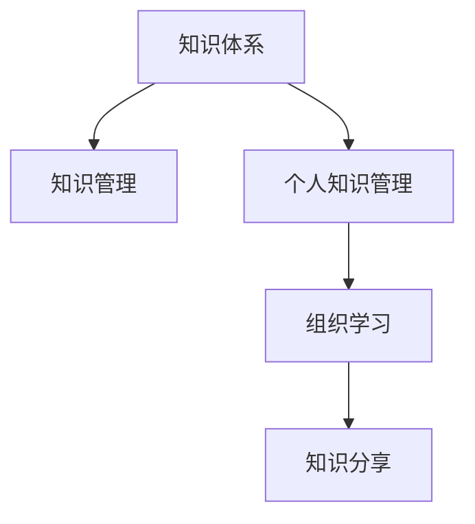

                 

# 经典书籍:管理者构建知识体系的基石

> 关键词：知识体系构建,管理理论,技术实践,个人成长,企业文化

## 1. 背景介绍

### 1.1 问题由来

在当今快速变化、高度不确定的商业环境中，企业管理者面临的挑战日益严峻。市场竞争日益激烈，客户需求日益多样化，新技术和创新层出不穷，这对企业的高效运营和可持续发展提出了更高要求。因此，管理者需要不断提升自身的知识水平和综合能力，构建科学合理的知识体系，以应对这些复杂多变的外部环境。

### 1.2 问题核心关键点

构建知识体系的核心在于：

- 梳理和整合企业内部外部的各类知识，形成系统的知识结构。
- 将理论知识与实践经验相结合，应用于实际管理工作，提升管理效能。
- 建立良好的知识传承机制，确保知识体系能够持续更新和迭代。
- 通过知识共享和知识管理工具，促进企业内部知识和外部信息的融合，增强企业的创新能力。

### 1.3 问题研究意义

构建知识体系对于管理者的成长、企业的创新和组织能力的提升具有重要意义：

1. 提升个人能力。管理者通过系统化的知识学习，可以提升分析、决策和创新能力，增强领导力和影响力。
2. 优化企业运营。科学的知识体系有助于制定更加精准、合理的战略规划，提高企业的运营效率和市场竞争力。
3. 增强企业创新。知识体系的有效运作能够促进跨部门协作和信息共享，激发组织内部的创新活力。
4. 塑造企业文化。知识体系的构建和应用能够形成良好的学习和创新氛围，塑造积极向上的企业文化。
5. 实现可持续发展。通过知识体系的持续更新和优化，企业能够更好地适应外部环境变化，实现长期可持续发展。

## 2. 核心概念与联系

### 2.1 核心概念概述

为更好地理解管理者构建知识体系的过程，本节将介绍几个密切相关的核心概念：

- **知识体系(Knowledge System)**：由各类学科知识、实践经验、管理理论等组成的系统化结构，旨在支撑企业战略决策、运营管理和创新发展。
- **知识管理(Knowledge Management)**：通过制定策略和工具，对企业内部的知识进行收集、存储、共享和应用的过程。
- **个人知识管理(PKM)**：个人对自身知识进行整理、存储、分享和应用的方法，提升个体知识效能。
- **组织学习(Organizational Learning)**：企业通过结构化流程和制度，促进员工学习和知识共享，提高组织适应性和创新能力。
- **知识分享(Knowledge Sharing)**：通过多种途径，如会议、培训、平台等，使知识在组织内部或外部流动，促进知识扩散和应用。

这些核心概念之间的逻辑关系可以通过以下Mermaid流程图来展示：



这个流程图展示了一些核心概念及其之间的关联关系：

1. 知识体系是知识管理的顶层设计，为知识管理的实施提供方向和依据。
2. 个人知识管理是知识体系构建的基础，强调个体知识的整理和提升。
3. 组织学习是基于知识管理的方法，促进企业在知识应用中的迭代和改进。
4. 知识分享是知识管理的手段，促进知识在组织内部的广泛应用和创新。

## 3. 核心算法原理 & 具体操作步骤
### 3.1 算法原理概述

构建知识体系本质上是一个结构化、系统化的学习过程。其核心思想是：

- 将企业内外部的各类知识资源进行梳理和分类，形成知识体系的基本架构。
- 通过学习工具和实践机制，促进知识在组织内部的高效传播和应用。
- 利用反馈机制和持续改进策略，动态更新和优化知识体系。

形式化地，假设企业当前的知识体系为 $K_{\theta}$，其中 $\theta$ 为知识体系参数，包括各类知识模块和相关链接。构建知识体系的目标是找到最优参数 $\hat{\theta}$，使得知识体系更加系统化、实用化，具体优化目标为：

$$
\hat{\theta} = \mathop{\arg\min}_{\theta} \mathcal{L}(K_{\theta},E)
$$

其中 $\mathcal{L}$ 为知识体系的损失函数，用于衡量知识体系的实用性、完整性和创新性。$E$ 为企业的实际运营数据和市场需求，包括战略决策、运营效率、市场反馈等。

### 3.2 算法步骤详解

构建知识体系一般包括以下几个关键步骤：

**Step 1: 知识分类与梳理**

- 制定知识分类标准，将各类知识划分为基础理论、实践经验、管理方法等模块。
- 梳理企业内部和外部各模块的知识资源，形成知识体系的基本框架。
- 对各模块的关键知识进行标注和编码，便于知识管理和共享。

**Step 2: 知识收集与整合**

- 通过调查问卷、专家访谈等方式，收集各类知识资源，包括文献、案例、管理实践等。
- 利用知识管理工具，如Confluence、SharePoint等，整合知识资源，形成知识库。
- 引入开放获取的知识资源，如Google Scholar、arXiv等，拓展知识体系的边界。

**Step 3: 知识结构设计与优化**

- 基于知识分类和整合的结果，设计知识体系的结构，包括顶层架构、底层细粒度内容。
- 设计知识体系的关键性能指标(KPIs)，如知识覆盖率、知识更新频率等。
- 利用优化算法，如遗传算法、模拟退火等，对知识体系结构进行动态调整和优化。

**Step 4: 知识应用与反馈**

- 将知识体系应用到实际管理工作中，如战略规划、项目管理、绩效评估等。
- 建立知识应用反馈机制，通过问卷调查、绩效评估等方式收集反馈信息。
- 根据反馈信息，持续改进知识体系的结构和内容，确保知识体系的实用性和有效性。

**Step 5: 知识迭代与更新**

- 制定知识体系定期更新的机制，确保知识体系能够及时反映最新的管理理论和技术进展。
- 引入外部专家和顾问，定期进行知识体系评审和更新。
- 利用人工智能技术，如自然语言处理、机器学习等，自动抽取和提炼知识，提升知识体系的智能化水平。

以上是构建知识体系的一般流程。在实际应用中，还需要针对具体企业的特点，对知识分类、知识收集、知识应用等环节进行优化设计，以实现更加高效、系统化的知识管理体系。

### 3.3 算法优缺点

构建知识体系的方法具有以下优点：

1. 系统化管理。通过知识分类和梳理，形成系统化的知识结构，便于知识管理和应用。
2. 实用性强。基于实际管理需求，设计知识体系，提升知识应用效果。
3. 动态更新。通过持续反馈和优化，知识体系能够不断更新和迭代，保持最新状态。
4. 推动创新。知识体系的构建和应用能够促进跨部门协作，激发创新活力。

同时，该方法也存在一定的局限性：

1. 初始成本高。知识体系的构建需要大量人力物力，初期投入成本较高。
2. 需要专业人才。知识体系的构建和应用需要具备知识管理的专业人才，企业需进行人才培训和引进。
3. 知识更新难度大。知识体系的大规模更新和优化，需要专业的知识管理工具和技术支持。
4. 知识体系复杂。过于复杂的知识体系，可能增加管理难度，降低知识应用效率。

尽管存在这些局限性，但就目前而言，构建知识体系仍是大规模企业管理者的重要管理手段。未来相关研究的重点在于如何进一步降低知识体系构建的初始成本，提高知识应用的效率，同时兼顾知识体系的灵活性和可扩展性。

### 3.4 算法应用领域

知识体系构建方法在企业管理中的应用非常广泛，涵盖了各类管理场景，例如：

- **战略管理**：通过知识体系的构建，使企业能够更好地制定和实施战略规划，提升战略决策的科学性和有效性。
- **项目管理**：利用知识体系，协调项目各阶段的知识应用，确保项目顺利推进和高质量交付。
- **绩效管理**：将知识体系应用于绩效评估和员工发展，提升企业整体绩效水平。
- **流程优化**：通过知识体系的构建和应用，识别流程中的瓶颈和改进点，实现流程的持续优化。
- **知识创新**：知识体系为创新提供了坚实的知识基础，促进跨部门协作和知识融合，提升企业的创新能力。

除了上述这些经典应用外，知识体系构建方法还被创新性地应用于市场营销、客户关系管理、供应链管理等更多领域，为企业提供全方位的管理支持。

## 4. 数学模型和公式 & 详细讲解 & 举例说明

### 4.1 数学模型构建

本节将使用数学语言对构建知识体系的过程进行更加严格的刻画。

记知识体系为 $K_{\theta}=\{K_1, K_2, ..., K_n\}$，其中 $K_i$ 为知识模块，$i=1,...,n$。假设企业当前的知识体系为 $K_{\theta_0}$，目标为优化后的知识体系为 $K_{\hat{\theta}}$。

定义知识体系的完整性指标为 $C(K_{\theta})$，实用性指标为 $U(K_{\theta})$，创新性指标为 $I(K_{\theta})$。则知识体系的损失函数为：

$$
\mathcal{L}(K_{\theta}) = \alpha C(K_{\theta}) + \beta U(K_{\theta}) + \gamma I(K_{\theta})
$$

其中 $\alpha, \beta, \gamma$ 为权重系数，用于平衡不同指标的重要性。

### 4.2 公式推导过程

以下我们以战略规划为例，推导知识体系的损失函数及其优化过程。

假设企业当前的知识体系 $K_{\theta_0}=\{K_1^{(\theta_0)}, K_2^{(\theta_0)}, ..., K_n^{(\theta_0)}\}$，目标优化后的知识体系为 $K_{\hat{\theta}}=\{K_1^{(\hat{\theta})}, K_2^{(\hat{\theta})}, ..., K_n^{(\hat{\theta})}\}$。则知识体系优化目标为：

$$
\hat{\theta} = \mathop{\arg\min}_{\theta} \alpha C(K_{\theta}) + \beta U(K_{\theta}) + \gamma I(K_{\theta})
$$

其中 $C(K_{\theta})$ 为知识体系的完整性指标，定义为知识模块的覆盖率和更新频率。$U(K_{\theta})$ 为实用性指标，定义为知识体系在实际管理中的应用效果和用户反馈。$I(K_{\theta})$ 为创新性指标，定义为知识体系对创新决策的贡献。

利用优化算法，如遗传算法、模拟退火等，对知识体系进行优化。假设优化后的知识体系为 $K_{\hat{\theta}}$，其完整性指标、实用性指标和创新性指标分别为 $C(K_{\hat{\theta}}), U(K_{\hat{\theta}}), I(K_{\hat{\theta}})$。则知识体系优化过程的损失函数为：

$$
\mathcal{L}(K_{\theta}) = \alpha C(K_{\theta_0}) - \alpha C(K_{\hat{\theta}}) + \beta U(K_{\theta_0}) - \beta U(K_{\hat{\theta}}) + \gamma I(K_{\theta_0}) - \gamma I(K_{\hat{\theta}})
$$

其中，损失函数最小化表示知识体系在完整性、实用性和创新性上的提升。

### 4.3 案例分析与讲解

假设某公司需要进行新市场的开拓战略规划，已有的知识体系包括市场调研报告、竞争对手分析、营销策略等。通过对这些知识的梳理和整合，形成新的知识体系，并进行优化。

1. **知识分类与梳理**

   - 将现有知识分为市场调研、竞争分析、营销策略、技术创新四个模块。
   - 对每个模块的关键知识进行标注和编码，形成知识体系的基本框架。

2. **知识收集与整合**

   - 通过市场调研，收集最新的市场数据和行业报告。
   - 利用竞争对手分析模块，对主要竞争对手的情况进行综合评估。
   - 引入营销策略模块，结合市场调研和竞争分析，制定新的营销方案。
   - 引入技术创新模块，结合现有技术和市场趋势，探索新的技术应用。

3. **知识结构设计与优化**

   - 设计知识体系的结构，包括顶层架构、底层细粒度内容。
   - 设计知识体系的关键性能指标(KPIs)，如知识覆盖率、知识更新频率等。
   - 利用优化算法，如遗传算法、模拟退火等，对知识体系结构进行动态调整和优化。

4. **知识应用与反馈**

   - 将新的知识体系应用到实际市场开拓战略规划中。
   - 建立知识应用反馈机制，通过问卷调查、绩效评估等方式收集反馈信息。
   - 根据反馈信息，持续改进知识体系的结构和内容，确保知识体系的实用性和有效性。

5. **知识迭代与更新**

   - 制定知识体系定期更新的机制，确保知识体系能够及时反映最新的市场变化和技术进展。
   - 引入外部专家和顾问，定期进行知识体系评审和更新。
   - 利用人工智能技术，如自然语言处理、机器学习等，自动抽取和提炼知识，提升知识体系的智能化水平。

通过上述过程，新知识体系在完整性、实用性和创新性上均有所提升，从而更好地支持企业战略决策和市场开拓。

## 5. 项目实践：代码实例和详细解释说明
### 5.1 开发环境搭建

在进行知识体系构建实践前，我们需要准备好开发环境。以下是使用Python进行知识管理系统的环境配置流程：

1. 安装Anaconda：从官网下载并安装Anaconda，用于创建独立的Python环境。

2. 创建并激活虚拟环境：
```bash
conda create -n knowledge-env python=3.8 
conda activate knowledge-env
```

3. 安装相关库：
```bash
pip install pandas numpy scikit-learn transformers tensorflow
```

4. 安装知识管理系统：
```bash
pip install confluence-py
```

完成上述步骤后，即可在`knowledge-env`环境中开始知识体系的构建实践。

### 5.2 源代码详细实现

下面是使用Confluence进行知识体系构建的Python代码实现：

```python
from confluence import Confluence, Space

# 配置Confluence连接
confluence = Confluence('https://your-confluence-instance', 'your-username', 'your-api-token')

# 创建知识体系空间
space = Space('KnowledgeSystem')
space.create()

# 创建知识模块
module1 = space.get_content('Module1')
module2 = space.get_content('Module2')
module3 = space.get_content('Module3')

# 更新知识模块内容
module1['body'] = 'This is the content of Module 1.'
module2['body'] = 'This is the content of Module 2.'
module3['body'] = 'This is the content of Module 3.'

# 提交更新
module1.update()
module2.update()
module3.update()
```

通过上述代码，可以在Confluence上创建一个新的知识体系空间，并在其中添加和管理各类知识模块。

### 5.3 代码解读与分析

让我们再详细解读一下关键代码的实现细节：

**Confluence模块**：
- `Confluence`类：用于连接Confluence，进行知识体系的创建和管理。
- `Space`类：表示知识体系的某个模块，可以获取、更新和删除内容。

**知识体系创建与管理**：
- 首先创建一个Confluence连接，传入实例地址、用户名和API密钥。
- 创建一个新的知识体系空间，用于存储和管理各类知识模块。
- 创建知识模块，通过`Space.get_content`获取已有内容，或通过`Space.create_content`创建新的内容。
- 更新知识模块的内容，并通过`Space.update_content`提交更新。

**知识体系的动态更新**：
- 在实际应用中，知识体系的更新是一个持续的过程。通过定期获取最新的市场数据、技术进展等，对知识模块进行更新和优化。
- 利用Confluence的API接口，可以实现自动化的知识体系更新和管理。

## 6. 实际应用场景

### 6.1 智能客服系统

智能客服系统的构建可以基于知识体系的方法，通过整合企业的内部知识资源，提升客服响应速度和质量。

1. **知识收集与整合**

   - 收集企业的历史客服记录、常见问题解答、服务流程等知识资源。
   - 利用知识管理工具，如Confluence、SharePoint等，将这些知识资源整理和整合，形成知识库。

2. **知识结构设计与优化**

   - 设计知识体系的层次结构，如FAQ、常见问题、服务流程等模块。
   - 利用知识体系的完整性、实用性和创新性指标，进行优化设计。

3. **知识应用与反馈**

   - 将知识体系应用到智能客服系统中，通过自然语言处理技术，提取用户问题的语义信息，匹配知识库中的答案。
   - 建立知识应用反馈机制，通过客户满意度调查等方式，收集用户反馈信息，持续改进知识体系。

4. **知识迭代与更新**

   - 制定知识体系定期更新的机制，确保知识体系能够及时反映最新的客户需求和问题。
   - 引入外部专家和顾问，定期进行知识体系评审和更新。

通过上述过程，智能客服系统能够更好地理解和解决用户问题，提升客户体验和满意度。

### 6.2 市场营销

市场营销的规划和执行可以基于知识体系的方法，通过整合市场数据和营销策略，制定更加精准和有效的营销方案。

1. **知识收集与整合**

   - 收集市场调研报告、竞争对手分析、营销策略等知识资源。
   - 利用知识管理工具，如Confluence、SharePoint等，将这些知识资源整理和整合，形成知识库。

2. **知识结构设计与优化**

   - 设计知识体系的层次结构，如市场调研、竞争分析、营销策略等模块。
   - 利用知识体系的完整性、实用性和创新性指标，进行优化设计。

3. **知识应用与反馈**

   - 将知识体系应用到市场营销活动中，如市场调研、竞争分析、营销策略制定等。
   - 建立知识应用反馈机制，通过市场效果评估等方式，收集反馈信息，持续改进知识体系。

4. **知识迭代与更新**

   - 制定知识体系定期更新的机制，确保知识体系能够及时反映最新的市场变化和趋势。
   - 引入外部专家和顾问，定期进行知识体系评审和更新。

通过上述过程，市场营销团队能够更好地理解市场变化，制定精准的营销策略，提升市场效果和投资回报率。

### 6.3 绩效管理

绩效管理的优化可以基于知识体系的方法，通过整合绩效评估和员工发展知识，提升企业的整体绩效水平。

1. **知识收集与整合**

   - 收集绩效评估标准、员工发展计划、培训资料等知识资源。
   - 利用知识管理工具，如Confluence、SharePoint等，将这些知识资源整理和整合，形成知识库。

2. **知识结构设计与优化**

   - 设计知识体系的层次结构，如绩效评估、员工发展、培训资料等模块。
   - 利用知识体系的完整性、实用性和创新性指标，进行优化设计。

3. **知识应用与反馈**

   - 将知识体系应用到绩效管理中，如绩效评估标准的制定、员工发展的指导等。
   - 建立知识应用反馈机制，通过绩效评估和员工满意度调查等方式，收集反馈信息，持续改进知识体系。

4. **知识迭代与更新**

   - 制定知识体系定期更新的机制，确保知识体系能够及时反映最新的绩效管理要求和员工需求。
   - 引入外部专家和顾问，定期进行知识体系评审和更新。

通过上述过程，绩效管理系统能够更好地支持企业的绩效评估和员工发展，提升整体绩效水平和员工满意度。

### 6.4 未来应用展望

随着知识体系构建技术的发展，未来在企业管理中的应用将更加广泛和深入，具体展望如下：

1. **智能决策支持**

   - 通过知识体系与人工智能技术的结合，构建智能决策支持系统，辅助企业管理决策。

2. **自动化知识管理**

   - 利用自然语言处理和机器学习技术，实现知识体系的自动化收集、整理和更新。

3. **跨部门协作**

   - 通过知识体系的跨部门协作机制，促进不同部门之间的知识共享和协同工作。

4. **个性化知识服务**

   - 利用知识体系的个性化推荐功能，为员工提供个性化的知识服务，提升知识获取效率。

5. **知识地图**

   - 利用知识体系的可视化工具，构建知识地图，帮助员工快速定位所需知识。

6. **智能办公**

   - 将知识体系与智能办公系统集成，提升办公效率和工作质量。

## 7. 工具和资源推荐

### 7.1 学习资源推荐

为了帮助开发者系统掌握知识体系构建的理论基础和实践技巧，这里推荐一些优质的学习资源：

1. **《知识管理:知识获取、共享与创新》**：本书全面介绍了知识管理的基本概念、方法和应用，涵盖知识体系的构建、知识管理的策略和技术等。

2. **Coursera《知识管理与创新》课程**：由耶鲁大学开设的知识管理课程，系统讲解了知识管理的理论基础和实践应用，适合初学者系统学习。

3. **KnowledgeHub网站**：一个开放的在线知识管理系统，提供丰富的知识管理工具和案例，供学习和借鉴。

4. **Harvard Business Review《知识管理》杂志**：该杂志定期发布知识管理领域的前沿研究和技术动态，是了解知识管理最新进展的重要渠道。

通过这些资源的学习实践，相信你一定能够快速掌握知识体系构建的精髓，并用于解决实际的企业管理问题。

### 7.2 开发工具推荐

高效的开发离不开优秀的工具支持。以下是几款用于知识体系构建开发的常用工具：

1. **Confluence**：一个强大的企业级知识管理系统，支持文档管理、知识库构建、协作等。

2. **SharePoint**：微软提供的企业级信息管理和协作平台，提供丰富的知识管理工具和集成能力。

3. **Trello**：一款轻量级的项目管理工具，支持任务分配、进度跟踪、协作等。

4. **Slack**：一款团队沟通工具，支持知识共享、任务分配、提醒等功能。

5. **Google Drive**：一个云存储和协作平台，支持文档管理、知识库构建、协作等。

合理利用这些工具，可以显著提升知识体系构建的效率，加速创新迭代的步伐。

### 7.3 相关论文推荐

知识体系构建技术的发展源于学界的持续研究。以下是几篇奠基性的相关论文，推荐阅读：

1. **《组织学习:理论、方法和实践》**：介绍了组织学习的理论基础、方法和实践应用，为知识体系构建提供了理论指导。

2. **《知识管理:概念、策略和技术》**：系统讲解了知识管理的概念、策略和应用技术，适合深入理解知识体系构建的基本原理。

3. **《基于知识管理的企业绩效提升研究》**：通过案例研究，探讨了知识体系构建对企业绩效提升的贡献，为实践应用提供了参考。

4. **《知识管理与创新:理论与实践》**：介绍了知识管理与创新的关系，展示了知识体系构建对创新的推动作用。

5. **《智能决策支持系统:理论、方法与应用》**：系统讲解了智能决策支持系统的理论基础、方法和应用，展示了知识体系在智能决策中的重要性。

这些论文代表了大规模企业管理者知识体系构建技术的发展脉络。通过学习这些前沿成果，可以帮助研究者把握学科前进方向，激发更多的创新灵感。

## 8. 总结：未来发展趋势与挑战

### 8.1 总结

本文对管理者构建知识体系的过程进行了全面系统的介绍。首先阐述了知识体系构建的背景和意义，明确了知识体系的核心理念和核心概念。其次，从原理到实践，详细讲解了知识体系构建的数学模型和操作步骤，给出了知识体系构建的完整代码实例。同时，本文还探讨了知识体系在企业管理中的广泛应用，展示了知识体系构建的巨大潜力。最后，本文精选了知识体系构建的学习资源、开发工具和相关论文，力求为读者提供全方位的技术指引。

通过本文的系统梳理，可以看到，知识体系的构建对于企业管理者的成长、企业的创新和组织能力的提升具有重要意义。知识体系通过系统化的知识管理，提升管理者的知识水平和综合能力，优化企业的运营效率和市场竞争力，增强企业的创新活力和组织适应性。未来，随着知识体系构建技术的不断发展，知识体系将在企业管理中发挥更加重要的作用，为构建人机协同的智能时代做出更大贡献。

### 8.2 未来发展趋势

展望未来，知识体系构建技术的发展趋势主要体现在以下几个方面：

1. **智能化与自动化**

   - 利用人工智能技术，如自然语言处理、机器学习等，实现知识体系的智能化和自动化管理。

2. **跨部门协作**

   - 通过知识体系的跨部门协作机制，促进不同部门之间的知识共享和协同工作，提升整体效率。

3. **个性化知识服务**

   - 利用知识体系的个性化推荐功能，为员工提供个性化的知识服务，提升知识获取效率。

4. **知识地图**

   - 利用知识体系的可视化工具，构建知识地图，帮助员工快速定位所需知识，提升知识管理效率。

5. **智能办公**

   - 将知识体系与智能办公系统集成，提升办公效率和工作质量，实现智能化办公。

6. **知识驱动决策**

   - 通过知识体系的决策支持功能，提升企业管理决策的科学性和准确性，推动企业可持续发展。

### 8.3 面临的挑战

尽管知识体系构建技术已经取得了显著进展，但在实现大规模、智能化的知识管理过程中，仍面临诸多挑战：

1. **知识收集难度大**

   - 知识体系构建需要收集大量内部和外部知识资源，工作量巨大，且需要专业人员进行整理和整合。

2. **知识更新频繁**

   - 知识体系需要不断更新和优化，以反映最新的管理要求和技术进展，但频繁的更新增加了管理复杂性。

3. **知识共享机制不完善**

   - 知识体系的共享机制需要设计合理，确保知识能够在组织内部高效流动，但实际操作中仍存在许多阻碍。

4. **知识应用效果不佳**

   - 知识体系应用到实际管理中，仍存在应用效果不佳的问题，需要进一步优化知识应用机制。

5. **知识安全保障不足**

   - 知识体系中包含大量敏感信息，需要建立严格的访问控制和数据安全机制，确保知识体系的安全性和隐私性。

### 8.4 研究展望

面对知识体系构建所面临的种种挑战，未来的研究需要在以下几个方面寻求新的突破：

1. **自动化知识收集与整理**

   - 开发智能化的知识管理工具，自动化收集、整理和整合知识，降低人工干预的复杂性。

2. **智能知识推荐**

   - 利用知识体系的知识推荐功能，提升员工的知识获取效率和应用效果。

3. **跨部门知识共享**

   - 设计合理跨部门协作机制，促进知识在组织内部的高效共享和应用。

4. **知识体系的安全与隐私**

   - 建立知识体系的安全保障机制，确保知识体系的安全性和隐私性。

5. **知识驱动的决策支持**

   - 构建基于知识体系的企业决策支持系统，提升企业管理决策的科学性和准确性。

这些研究方向的探索，必将引领知识体系构建技术迈向更高的台阶，为构建安全、可靠、可解释、可控的智能系统铺平道路。面向未来，知识体系构建技术还需要与其他人工智能技术进行更深入的融合，如知识表示、因果推理、强化学习等，多路径协同发力，共同推动自然语言理解和智能交互系统的进步。只有勇于创新、敢于突破，才能不断拓展知识体系的边界，让智能技术更好地造福人类社会。

## 9. 附录：常见问题与解答

**Q1：知识体系构建是否适用于所有企业？**

A: 知识体系构建方法对企业的规模和行业没有特定的要求，各类企业都可以采用。但对于中小型企业或传统型企业，构建知识体系的初始成本较高，需要投入一定的人力物力资源。同时，知识体系的构建和应用需要企业的管理团队具备一定的知识管理意识和技术能力，因此需要系统的培训和推广。

**Q2：构建知识体系需要哪些资源？**

A: 构建知识体系需要以下资源：

- 人力资源：需要具备知识管理意识和技能的管理者、知识工程师、数据分析师等。
- 技术资源：需要知识管理平台、数据分析工具、自动化工具等。
- 数据资源：需要各类管理数据、市场数据、员工数据等。
- 财务资源：需要投入一定的预算，用于知识体系的构建、维护和更新。

**Q3：知识体系构建过程中如何确保知识的质量和可靠性？**

A: 确保知识体系的质量和可靠性需要从以下几个方面入手：

- 建立知识质量评估机制，定期对知识进行审核和评估。
- 引入外部专家和顾问，参与知识体系的评审和更新。
- 利用知识管理工具，实现知识共享和协作，确保知识的质量和一致性。
- 制定知识共享和知识使用的标准和规范，提升知识的质量和可靠性。

**Q4：知识体系构建与企业战略规划的关系是什么？**

A: 知识体系构建与企业战略规划密切相关，具体体现在以下几个方面：

- 知识体系提供战略决策所需的关键信息，支持企业战略规划的制定。
- 通过知识体系的持续优化，提升企业对市场变化和技术趋势的敏感性和适应性，增强战略规划的前瞻性和科学性。
- 知识体系为战略执行提供知识支持，提升战略执行的效果和效率。

**Q5：知识体系构建如何提升企业的创新能力？**

A: 知识体系构建通过以下几个方面提升企业的创新能力：

- 知识体系整合了企业的各类知识资源，提供了全面的信息支撑，有助于创新团队的灵感启发。
- 知识体系促进了跨部门协作和知识共享，便于不同领域的知识融合，激发创新潜力。
- 知识体系支持创新决策，提供创新所需的关键信息，提升创新成功率。

通过上述过程，企业能够更好地利用知识体系构建创新能力，推动企业的持续创新和发展。

---

作者：禅与计算机程序设计艺术 / Zen and the Art of Computer Programming

