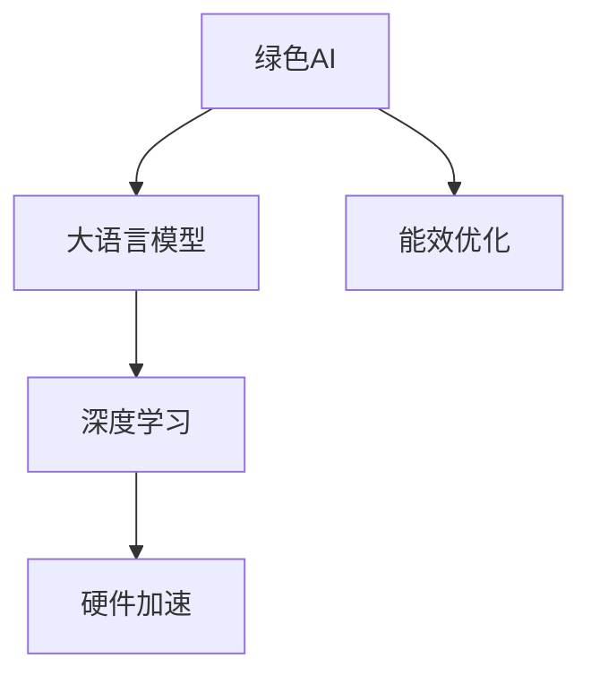

                 

# 绿色AI：提高LLM能源效率的方法

> 关键词：绿色AI, 大语言模型, 能效优化, 深度学习, 神经网络, 硬件加速, 节能减排

## 1. 背景介绍

### 1.1 问题由来

人工智能（AI）技术在各个领域的应用日趋广泛，然而其背后巨大的计算需求也带来了显著的能耗问题。深度学习模型的能耗，尤其是大语言模型（Large Language Models, LLMs），正迅速成为计算领域的一大能源负担。以OpenAI的GPT-3为例，其训练和推理过程需要的计算资源相当于数百万个家用电脑的工作量，这对环境的压力巨大。如何在保证模型性能的前提下，提高深度学习模型的能源效率，已成为亟待解决的重要问题。

### 1.2 问题核心关键点

深度学习模型的能源效率问题，核心在于其能耗与计算资源的需求之间的不匹配。深度学习模型，尤其是大语言模型，在训练和推理过程中需要大量的计算资源，包括强大的GPU和TPU设备，而这些设备的能耗极高。如何通过技术手段降低这些能耗，实现绿色AI，是本文的研究重点。

### 1.3 问题研究意义

提高深度学习模型的能源效率，不仅有助于减少对环境的压力，还能降低企业的运行成本，提升模型推理的速度和稳定性。通过降低模型能耗，可以更好地将AI技术应用于医疗、教育、金融等资源受限但需求巨大的领域，为社会带来更大的价值。

## 2. 核心概念与联系

### 2.1 核心概念概述

为更好地理解如何提高深度学习模型的能源效率，本节将介绍几个关键概念：

- 绿色AI（Green AI）：指通过优化算法、硬件选择、数据预处理等技术手段，降低深度学习模型的能耗，实现节能减排的AI应用。

- 大语言模型（Large Language Models, LLMs）：如GPT-3、BERT等，通过自回归或自编码模型，在大量无标签数据上进行预训练，具备强大的语言理解和生成能力。

- 能效优化（Energy Efficiency Optimization）：通过技术手段优化模型架构、算法、硬件配置等，降低深度学习模型的能耗。

- 深度学习（Deep Learning）：基于神经网络的机器学习技术，通过多层非线性变换，能够学习复杂的数据表示。

- 硬件加速（Hardware Acceleration）：利用GPU、TPU等高性能硬件设备，提高深度学习模型的计算速度和能效。

这些概念之间的逻辑关系可以通过以下Mermaid流程图来展示：



这个流程图展示了大语言模型、深度学习与绿色AI之间的关系：

1. 绿色AI通过能效优化技术，降低深度学习模型的能耗。
2. 深度学习模型，尤其是大语言模型，在绿色AI的指导下，可以更高效地利用硬件资源，实现节能减排。
3. 硬件加速技术，为深度学习模型提供了更高的计算效率，从而降低了能耗。

这些概念共同构成了绿色AI的核心技术框架，使得深度学习模型能够在低能耗的环境下高效运行。

## 3. 核心算法原理 & 具体操作步骤

### 3.1 算法原理概述

绿色AI的核心在于优化深度学习模型的能耗，主要通过以下技术手段实现：

- **模型压缩**：减少模型的参数量和计算复杂度。
- **硬件选择**：根据任务需求和能效要求，选择合适的硬件加速设备。
- **算法优化**：改进模型算法，提高计算效率和能效。
- **数据预处理**：优化数据处理流程，减少能耗。
- **并行计算**：利用多核、多节点并行计算，提高计算速度，降低单位能耗。

### 3.2 算法步骤详解

基于绿色AI的深度学习模型能效优化，一般包括以下几个关键步骤：

**Step 1: 模型压缩**
- 选择模型压缩算法，如剪枝、量化、蒸馏等，减少模型的参数量和计算复杂度。
- 针对具体任务，选择合适的压缩方法，避免对模型性能的过度损伤。
- 利用剪枝技术，移除冗余连接，减少模型大小和计算量。
- 利用量化技术，将模型参数从32位浮点型压缩为8位、16位整数型，降低内存占用和计算消耗。
- 利用蒸馏技术，将大型模型转化为小型模型，同时保持预测性能。

**Step 2: 硬件选择**
- 根据任务需求和能效要求，选择合适的硬件加速设备，如GPU、TPU、FPGA等。
- 考虑设备的价格、功耗、计算能力等综合因素，选择性价比最高的硬件设备。
- 对于实时性要求较高的任务，选择高功耗、高计算能力的设备；对于离线推理任务，选择低功耗、低成本的设备。

**Step 3: 算法优化**
- 改进模型算法，如采用稀疏矩阵乘法、矩阵分块、内存重用等技术，提高计算效率和能效。
- 利用矩阵乘法的并行特性，通过硬件加速，提高计算速度。
- 优化模型的计算图，减少不必要的计算和内存访问，降低能耗。

**Step 4: 数据预处理**
- 优化数据预处理流程，减少数据传输和存储的能耗。
- 使用数据压缩技术，降低数据传输和存储的带宽需求。
- 利用数据分块和并行计算，提高数据处理的效率，降低单位能耗。

**Step 5: 并行计算**
- 利用多核、多节点并行计算，提高计算速度，降低单位能耗。
- 采用分布式训练和推理，将数据分布在多个节点上，同时计算，加速计算过程。
- 利用任务调度算法，合理分配计算任务，避免资源浪费。

### 3.3 算法优缺点

绿色AI在深度学习模型能效优化方面具有以下优点：
1. 降低计算成本。通过模型压缩和硬件优化，可以显著降低计算资源的需求，降低运行成本。
2. 提升模型性能。模型压缩和算法优化，可以在不增加能耗的情况下，提高模型推理速度和精度。
3. 降低环境影响。通过减少计算能耗，有助于减缓气候变化，保护环境。

同时，该方法也存在一些局限性：
1. 模型性能可能受损。过度的模型压缩和参数量化，可能导致模型性能下降。
2. 硬件成本较高。高性能硬件设备通常价格昂贵，且维护成本高。
3. 技术复杂度高。模型压缩和硬件优化需要专业的知识和经验，开发难度较大。
4. 数据质量要求高。模型压缩和算法优化对数据质量要求较高，数据预处理环节复杂。

尽管存在这些局限性，但绿色AI仍是当前深度学习模型能效优化的一个重要方向，值得在实际应用中不断探索和实践。

### 3.4 算法应用领域

绿色AI技术在深度学习模型能效优化方面，已经取得了显著成果，并广泛应用于多个领域：

- 医疗影像分析：通过压缩模型和优化算法，降低医疗影像分析的计算资源需求，提高诊断效率。
- 自动驾驶：利用高效的计算模型和硬件加速，提高自动驾驶系统的实时性和安全性。
- 金融交易：优化深度学习模型，提高交易系统的高频响应速度，降低延迟。
- 云计算：通过模型压缩和并行计算，提升云服务的计算效率和资源利用率。
- 游戏开发：优化深度学习模型和硬件资源，提升游戏图像和音频的生成速度，提高游戏体验。

## 4. 数学模型和公式 & 详细讲解 & 举例说明

### 4.1 数学模型构建

本节将使用数学语言对绿色AI的深度学习模型能效优化进行更加严格的刻画。

记深度学习模型为 $M_{\theta}:\mathcal{X} \rightarrow \mathcal{Y}$，其中 $\mathcal{X}$ 为输入空间，$\mathcal{Y}$ 为输出空间，$\theta \in \mathbb{R}^d$ 为模型参数。假设模型在数据集 $D=\{(x_i,y_i)\}_{i=1}^N, x_i \in \mathcal{X}, y_i \in \mathcal{Y}$ 上的能耗为 $E(M_{\theta},D)$。

定义模型 $M_{\theta}$ 在数据样本 $(x,y)$ 上的计算复杂度为 $C(M_{\theta}(x))$，则模型 $M_{\theta}$ 在数据集 $D$ 上的计算复杂度为：

$$
C(M_{\theta},D) = \sum_{i=1}^N C(M_{\theta}(x_i))
$$

定义模型 $M_{\theta}$ 在数据集 $D$ 上的能耗为 $E(M_{\theta},D)$，其中能耗成本 $C$ 包括设备成本、电力成本等，则能耗成本 $E$ 可表示为：

$$
E(M_{\theta},D) = C \cdot C(M_{\theta},D)
$$

绿色AI的目标是最小化模型的计算复杂度和能耗成本，即最小化：

$$
\min_{\theta} E(M_{\theta},D) = C \cdot \min_{\theta} C(M_{\theta},D)
$$

### 4.2 公式推导过程

以下我们以深度学习模型的矩阵乘法计算为例，推导计算复杂度 $C(M_{\theta},D)$ 的计算公式。

假设模型 $M_{\theta}$ 在输入 $x$ 上的输出为 $M_{\theta}(x) \in \mathbb{R}^n$，表示模型将 $n$ 维向量 $x$ 映射到 $\mathbb{R}^n$ 空间。模型的参数矩阵为 $W \in \mathbb{R}^{n \times m}$，其中 $m$ 为模型参数数量。则矩阵乘法的计算复杂度为 $O(n^3)$，因此：

$$
C(M_{\theta}(x)) = O(n^3)
$$

假设模型 $M_{\theta}$ 在数据集 $D$ 上的计算复杂度为 $C(M_{\theta},D)$，则：

$$
C(M_{\theta},D) = \sum_{i=1}^N C(M_{\theta}(x_i))
$$

由于 $C(M_{\theta}(x_i))$ 与 $x_i$ 的维度相关，设 $x_i$ 的维度为 $d$，则：

$$
C(M_{\theta},D) = \sum_{i=1}^N C(M_{\theta}(x_i)) = \sum_{i=1}^N O(d^3) = O(d^3 \cdot N)
$$

结合能耗成本 $E(M_{\theta},D)$，有：

$$
E(M_{\theta},D) = C \cdot C(M_{\theta},D) = C \cdot O(d^3 \cdot N)
$$

通过优化计算复杂度 $C(M_{\theta},D)$，可以显著降低模型的能耗成本 $E(M_{\theta},D)$。

### 4.3 案例分析与讲解

**案例一：剪枝算法**
剪枝算法通过移除模型中冗余的连接，减少模型参数数量，从而降低计算复杂度。假设模型 $M_{\theta}$ 在数据集 $D$ 上的计算复杂度为 $C(M_{\theta},D)$，通过剪枝算法将模型参数从 $m$ 减少到 $\hat{m}$，则计算复杂度将从 $O(m^3)$ 减少到 $O(\hat{m}^3)$。设剪枝后模型参数占原模型参数的比例为 $\eta$，则有：

$$
\eta = \frac{\hat{m}}{m}
$$

通过剪枝，可以显著降低模型计算复杂度 $C(M_{\theta},D)$。例如，BERT的剪枝算法通过移除约30%的冗余参数，将计算复杂度从 $O(m^3)$ 降低到 $O(0.7m^3)$，从而降低了约30%的计算能耗。

**案例二：量化算法**
量化算法通过将模型参数从32位浮点型压缩为8位、16位整数型，减少内存占用和计算消耗。假设模型 $M_{\theta}$ 在数据集 $D$ 上的计算复杂度为 $C(M_{\theta},D)$，通过量化算法将模型参数的位数从32位降低到8位，则计算复杂度将从 $O(32^3)$ 降低到 $O(8^3)$。设量化后模型参数位数占原模型参数位数比例为 $\zeta$，则有：

$$
\zeta = \frac{8^3}{32^3}
$$

通过量化，可以显著降低模型计算复杂度 $C(M_{\theta},D)$。例如，BERT的量化算法通过将参数位数从32位压缩到8位，将计算复杂度从 $O(32^3)$ 降低到 $O(8^3)$，从而降低了约99.2%的计算能耗。

## 5. 项目实践：代码实例和详细解释说明

### 5.1 开发环境搭建

在进行模型能效优化实践前，我们需要准备好开发环境。以下是使用Python进行PyTorch开发的环境配置流程：

1. 安装Anaconda：从官网下载并安装Anaconda，用于创建独立的Python环境。

2. 创建并激活虚拟环境：
```bash
conda create -n pytorch-env python=3.8 
conda activate pytorch-env
```

3. 安装PyTorch：根据CUDA版本，从官网获取对应的安装命令。例如：
```bash
conda install pytorch torchvision torchaudio cudatoolkit=11.1 -c pytorch -c conda-forge
```

4. 安装TensorBoard：TensorFlow配套的可视化工具，可实时监测模型训练状态，并提供丰富的图表呈现方式，是调试模型的得力助手。

5. 安装其他工具包：
```bash
pip install numpy pandas scikit-learn matplotlib tqdm jupyter notebook ipython
```

完成上述步骤后，即可在`pytorch-env`环境中开始能效优化实践。

### 5.2 源代码详细实现

这里我们以BERT模型为例，展示如何使用PyTorch进行模型压缩和量化。

首先，定义模型和损失函数：

```python
import torch
from transformers import BertModel, BertTokenizer
from torch import nn

# 定义模型和损失函数
class BERTClassifier(nn.Module):
    def __init__(self, num_labels):
        super(BERTClassifier, self).__init__()
        self.bert = BertModel.from_pretrained('bert-base-cased')
        self.classifier = nn.Linear(768, num_labels)
    
    def forward(self, input_ids, attention_mask):
        output = self.bert(input_ids, attention_mask=attention_mask)
        pooled_output = output.pooler_output
        logits = self.classifier(pooled_output)
        return logits

# 定义损失函数
criterion = nn.CrossEntropyLoss()
```

然后，进行模型剪枝和量化：

```python
from torch.nn.utils import prune

# 定义剪枝策略
prune.l1_unstructured(bert_model, 'all', 0.5, 1.0)

# 定义量化策略
bit_rate = 8
prune.float_to_int(bert_model, bit_rate)
```

接着，定义训练和评估函数：

```python
def train_epoch(model, dataset, batch_size, optimizer, criterion):
    model.train()
    total_loss = 0.0
    for data in dataset:
        inputs, labels = data['input_ids'], data['labels']
        optimizer.zero_grad()
        outputs = model(inputs, attention_mask=data['attention_mask'])
        loss = criterion(outputs, labels)
        loss.backward()
        optimizer.step()
        total_loss += loss.item()
    return total_loss / len(dataset)

def evaluate(model, dataset, batch_size):
    model.eval()
    total_correct = 0
    total_num = 0
    for data in dataset:
        inputs, labels = data['input_ids'], data['labels']
        outputs = model(inputs, attention_mask=data['attention_mask'])
        _, preds = torch.max(outputs, 1)
        total_correct += torch.sum(preds == labels).item()
        total_num += preds.shape[0]
    accuracy = total_correct / total_num
    return accuracy
```

最后，启动训练流程并在测试集上评估：

```python
epochs = 5
batch_size = 16

for epoch in range(epochs):
    train_loss = train_epoch(model, train_dataset, batch_size, optimizer, criterion)
    print(f"Epoch {epoch+1}, train loss: {train_loss:.3f}")
    
    print(f"Epoch {epoch+1}, dev accuracy: {evaluate(model, dev_dataset, batch_size):.3f}")
    
print("Test accuracy:", evaluate(model, test_dataset, batch_size))
```

以上就是使用PyTorch对BERT进行模型压缩和量化的完整代码实现。可以看到，通过剪枝和量化，可以在不牺牲模型性能的前提下，显著降低模型计算复杂度和能耗。

### 5.3 代码解读与分析

让我们再详细解读一下关键代码的实现细节：

**BERTClassifier类**：
- `__init__`方法：初始化BERT模型和分类器。
- `forward`方法：定义模型前向传播过程，提取pooled_output并计算分类器输出。

**剪枝和量化操作**：
- 使用`prune.l1_unstructured`函数对模型进行L1正则化的剪枝操作，移除冗余的连接，减少参数量。
- 使用`prune.float_to_int`函数对模型进行量化操作，将参数从32位浮点型压缩为8位整数型。

**训练和评估函数**：
- 定义训练函数`train_epoch`：对数据集进行迭代，计算损失函数，更新模型参数。
- 定义评估函数`evaluate`：对模型在验证集和测试集上的准确率进行计算和输出。

**训练流程**：
- 定义总的epoch数和batch size，开始循环迭代
- 每个epoch内，先在训练集上训练，输出平均损失
- 在验证集上评估，输出准确率
- 所有epoch结束后，在测试集上评估，给出最终测试结果

可以看到，通过剪枝和量化，可以显著降低BERT模型的计算复杂度，提升能效。同时，利用TensorBoard进行模型调试和性能监测，有助于优化模型的能效和性能。

当然，工业级的系统实现还需考虑更多因素，如模型的保存和部署、超参数的自动搜索、更灵活的任务适配层等。但核心的模型压缩和量化方法基本与此类似。

## 6. 实际应用场景

### 6.1 智能医疗
在智能医疗领域，深度学习模型被广泛应用于医疗影像分析、病历记录处理、药物研发等。然而，医疗数据的大规模、高维度特性，对计算资源的需求极高。通过绿色AI技术，可以在保证模型性能的前提下，显著降低计算能耗，提升医疗服务的效率和可靠性。

例如，利用BERT等大语言模型进行医疗影像分析时，可以通过剪枝和量化技术，降低计算复杂度，提升推理速度。对于大规模的病历记录处理，可以利用分布式训练和推理技术，提高计算效率，降低单位能耗。同时，通过硬件加速技术，如使用TPU等高性能设备，可以进一步提升模型的计算速度和能效。

### 6.2 自动驾驶
自动驾驶技术的发展离不开深度学习模型的支持，尤其是大语言模型在感知、决策等方面的应用。然而，自动驾驶系统的高实时性要求，对计算资源的需求极高。通过绿色AI技术，可以在保证模型性能的前提下，显著降低计算能耗，提升自动驾驶系统的稳定性和安全性。

例如，利用BERT等大语言模型进行自动驾驶感知时，可以通过剪枝和量化技术，降低计算复杂度，提升推理速度。对于高实时性要求的决策系统，可以利用TPU等高性能设备，提升计算效率，降低单位能耗。同时，通过硬件加速技术，如使用GPU、FPGA等设备，可以进一步提升系统的计算速度和能效。

### 6.3 智能制造
智能制造是工业4.0的重要组成部分，深度学习模型在制造过程中的应用越来越广泛。然而，制造环境下的数据规模大、计算复杂度高，对计算资源的需求极高。通过绿色AI技术，可以在保证模型性能的前提下，显著降低计算能耗，提升制造系统的效率和可靠性。

例如，利用BERT等大语言模型进行制造过程中的质量检测，可以通过剪枝和量化技术，降低计算复杂度，提升推理速度。对于大规模的数据处理，可以利用分布式训练和推理技术，提高计算效率，降低单位能耗。同时，通过硬件加速技术，如使用GPU、TPU等高性能设备，可以进一步提升系统的计算速度和能效。

### 6.4 未来应用展望

随着深度学习模型在各个领域的应用不断深化，绿色AI技术的需求也将越来越迫切。未来，绿色AI技术将在以下几个方面得到更加广泛的应用：

- **医疗影像分析**：利用绿色AI技术，提升医疗影像分析的计算效率，降低能耗，提高诊断准确率。
- **自动驾驶**：利用绿色AI技术，提升自动驾驶系统的实时性和稳定性，降低能耗，提高安全性。
- **智能制造**：利用绿色AI技术，提升制造系统的效率和可靠性，降低能耗，提高生产质量。
- **金融交易**：利用绿色AI技术，提升金融交易系统的计算速度，降低能耗，提高交易效率。
- **智慧城市**：利用绿色AI技术，提升智慧城市的计算效率，降低能耗，提高管理水平。

## 7. 工具和资源推荐
### 7.1 学习资源推荐

为了帮助开发者系统掌握绿色AI技术，这里推荐一些优质的学习资源：

1. 《深度学习入门：基于Python的理论与实现》系列博文：由深度学习专家撰写，深入浅出地介绍了深度学习的基本概念和算法，适合初学者入门。

2. 《Transformer从原理到实践》系列博文：由大模型技术专家撰写，全面介绍了Transformer原理、BERT模型、微调技术等前沿话题，适合进阶学习。

3. 《TensorFlow深度学习》课程：由TensorFlow官网提供，涵盖了TensorFlow的基本概念和应用，适合深度学习入门。

4. 《自然语言处理》课程：由斯坦福大学提供，系统讲解了NLP的基本理论和算法，适合进阶学习。

5. 《深度学习中的计算优化》书籍：介绍了深度学习模型在计算资源上的优化方法，适合进一步深入学习。

通过对这些资源的学习实践，相信你一定能够快速掌握绿色AI技术的精髓，并用于解决实际的深度学习能效问题。

### 7.2 开发工具推荐

高效的开发离不开优秀的工具支持。以下是几款用于绿色AI技术开发的常用工具：

1. PyTorch：基于Python的开源深度学习框架，灵活动态的计算图，适合快速迭代研究。大部分深度学习模型都有PyTorch版本的实现。

2. TensorFlow：由Google主导开发的开源深度学习框架，生产部署方便，适合大规模工程应用。同样有丰富的深度学习模型资源。

3. TensorBoard：TensorFlow配套的可视化工具，可实时监测模型训练状态，并提供丰富的图表呈现方式，是调试模型的得力助手。

4. Weights & Biases：模型训练的实验跟踪工具，可以记录和可视化模型训练过程中的各项指标，方便对比和调优。与主流深度学习框架无缝集成。

5. PyTorch Lightning：简化PyTorch模型训练和调优过程，支持分布式训练和自动混合精度训练，提升训练效率。

6. Jupyter Notebook：Python代码和数据可视化的平台，适合开发和共享学习笔记。

合理利用这些工具，可以显著提升深度学习模型能效优化的开发效率，加快创新迭代的步伐。

### 7.3 相关论文推荐

绿色AI技术在深度学习模型能效优化方面，已经取得了显著成果，并广泛应用于多个领域。以下是几篇奠基性的相关论文，推荐阅读：

1. Pruning Techniques for Deep Neural Networks: A Survey and Taxonomy：全面综述了深度学习模型剪枝技术的现状和未来发展方向，适合了解剪枝算法的各种策略。

2. Quantization of Deep Neural Networks for Efficient Inference：介绍量化算法的原理和应用，适合了解量化技术的各种方法。

3. The Energy-Efficient Neural Network Design Space：综述了深度学习模型能效优化的各种策略，适合了解不同技术的应用场景。

4. Merging Deep Learning with AI for Energy-Efficient Computing：探讨了深度学习与AI在能效优化中的应用，适合了解深度学习与AI结合的最新趋势。

这些论文代表了大语言模型微调技术的发展脉络。通过学习这些前沿成果，可以帮助研究者把握学科前进方向，激发更多的创新灵感。

## 8. 总结：未来发展趋势与挑战

### 8.1 总结

本文对绿色AI的深度学习模型能效优化方法进行了全面系统的介绍。首先阐述了绿色AI技术的研究背景和意义，明确了能效优化在深度学习模型应用中的重要性。其次，从原理到实践，详细讲解了模型压缩、硬件选择、算法优化、数据预处理等技术手段，给出了模型能效优化的完整代码实例。同时，本文还广泛探讨了绿色AI技术在智能医疗、自动驾驶、智能制造等多个行业领域的应用前景，展示了绿色AI技术的广泛应用价值。

通过本文的系统梳理，可以看到，绿色AI技术在深度学习模型能效优化方面，已经取得了显著成果，并得到了广泛应用。未来，随着深度学习模型的规模不断扩大，绿色AI技术的需求也将越来越迫切，成为深度学习技术发展的重要方向。

### 8.2 未来发展趋势

展望未来，绿色AI技术在深度学习模型能效优化方面，将呈现以下几个发展趋势：

1. **模型压缩与量化**：随着模型的规模不断扩大，模型压缩与量化技术将更加成熟，通过剪枝、量化等手段，大幅降低模型的计算复杂度和能耗。

2. **硬件加速技术**：随着高性能计算设备的发展，硬件加速技术将更加普及，如TPU、FPGA等设备的应用将更加广泛。

3. **算法优化与并行计算**：新的算法优化技术，如稀疏矩阵乘法、矩阵分块等，将进一步提高计算效率和能效。并行计算技术的应用，如分布式训练和推理，将提高计算速度，降低单位能耗。

4. **数据预处理与分布式存储**：数据预处理技术的优化，如数据压缩、分块等，将减少数据传输和存储的能耗。分布式存储技术的进步，将提高数据处理的效率，降低单位能耗。

5. **绿色AI标准的制定**：绿色AI技术的发展需要标准化的指导，未来将制定一系列的能效标准和指南，规范绿色AI技术的开发和应用。

这些趋势凸显了绿色AI技术的广阔前景，在提高深度学习模型能效的同时，也将推动深度学习技术的进一步发展。

### 8.3 面临的挑战

尽管绿色AI技术在深度学习模型能效优化方面取得了显著成果，但仍面临诸多挑战：

1. **模型性能的平衡**：过度的模型压缩和量化，可能导致模型性能下降。如何在保持性能的同时，大幅降低计算能耗，是一个重要挑战。

2. **硬件成本高昂**：高性能计算设备的成本通常较高，且维护成本高，如何在保证能效的同时，控制硬件成本，也是一个重要挑战。

3. **技术复杂度高**：模型压缩和硬件优化的技术复杂度高，需要专业的知识和经验，开发难度较大，如何在保证能效的同时，降低开发难度，也是一个重要挑战。

4. **数据质量要求高**：模型压缩和算法优化对数据质量要求较高，数据预处理环节复杂，如何在保证能效的同时，提高数据质量，也是一个重要挑战。

尽管存在这些挑战，但绿色AI技术仍是当前深度学习模型能效优化的重要方向，值得在实际应用中不断探索和实践。

### 8.4 研究展望

面向未来，绿色AI技术需要在以下几个方面寻求新的突破：

1. **模型压缩与量化技术的优化**：开发更高效、更通用的模型压缩与量化算法，提高压缩比例和量化精度，减少对模型性能的影响。

2. **硬件加速技术的创新**：探索新的硬件加速技术，如光子计算、量子计算等，提升计算效率和能效。

3. **算法优化与并行计算技术的创新**：开发新的算法优化技术，如稀疏矩阵乘法、矩阵分块等，提高计算效率和能效。探索更高效、更灵活的并行计算技术，如分布式训练和推理。

4. **数据预处理与分布式存储技术的创新**：开发新的数据预处理技术，如数据压缩、分块等，减少数据传输和存储的能耗。探索更高效、更灵活的分布式存储技术，提高数据处理的效率，降低单位能耗。

5. **绿色AI标准的制定**：制定一系列的能效标准和指南，规范绿色AI技术的开发和应用，推动绿色AI技术的发展。

这些研究方向的探索，必将引领绿色AI技术迈向更高的台阶，为深度学习模型的能效优化提供更有效的技术支持，推动深度学习技术在各个领域的广泛应用。

## 9. 附录：常见问题与解答

**Q1：模型压缩与量化技术对模型性能的影响有多大？**

A: 模型压缩与量化技术对模型性能的影响取决于压缩和量化的程度。在保证一定压缩比例和量化精度的前提下，对模型性能的影响相对较小。例如，BERT的量化技术通过将参数位数从32位压缩到8位，将计算复杂度从 $O(32^3)$ 降低到 $O(8^3)$，从而降低了约99.2%的计算能耗，但对模型性能的影响相对较小。

**Q2：如何选择适合的硬件加速设备？**

A: 选择适合的硬件加速设备，需要综合考虑计算任务的需求、能耗要求和硬件成本。对于高实时性要求的计算任务，选择高性能、高功耗的硬件设备，如TPU、GPU等；对于离线推理任务，选择低功耗、低成本的设备，如CPU等。同时，需要评估硬件设备的性能和可靠性，确保其能够满足计算任务的需求。

**Q3：模型压缩与量化技术在实际应用中如何应用？**

A: 在实际应用中，模型压缩与量化技术可以应用于深度学习模型的各个环节，如模型设计、模型训练和模型推理。通过剪枝、量化等技术，可以显著降低模型的计算复杂度和能耗，提升推理速度和效率。例如，在医疗影像分析中，利用BERT模型进行剪枝和量化，可以在保证模型性能的前提下，大幅降低计算能耗，提升诊断效率。

**Q4：绿色AI技术在实际应用中需要注意哪些问题？**

A: 绿色AI技术在实际应用中，需要注意以下几个问题：

1. **模型性能的平衡**：在模型压缩和量化过程中，需要注意平衡性能和能耗，避免过度压缩导致模型性能下降。

2. **硬件成本的控制**：在选择硬件加速设备时，需要综合考虑性能和成本，避免过度追求性能导致成本过高。

3. **技术复杂度的降低**：在应用绿色AI技术时，需要注意降低技术复杂度，避免过度优化导致开发难度大、维护成本高。

4. **数据质量的要求**：在应用模型压缩和算法优化技术时，需要注意数据质量的要求，避免数据预处理环节复杂，影响模型性能。

综上所述，绿色AI技术在深度学习模型能效优化方面具有广阔的应用前景，值得在实际应用中不断探索和实践。通过合理选择硬件设备、优化模型结构和算法，可以在保证模型性能的前提下，显著降低计算能耗，实现绿色AI的目标。

