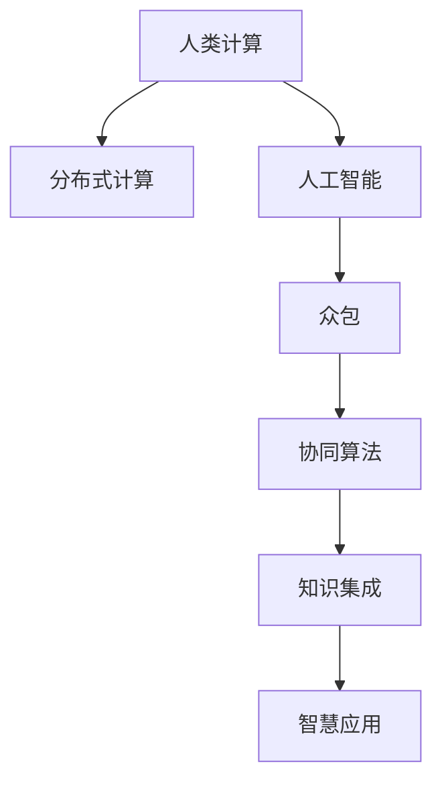

                 

# 群体智慧：人类计算的新纪元

> 关键词：群体智慧,人类计算,分布式协作,人工智能,众包,协同算法,智慧应用

## 1. 背景介绍

### 1.1 问题由来

人类社会的发展史，本质上是一部计算技术的演进史。从算盘到机械计算器，再到早期的电子计算机，计算能力经历了数次飞跃，极大地推动了科学、工程和社会的发展。然而，面对日益复杂的计算问题，传统的集中式计算模式逐渐显示出其局限性，难以适应大规模、分布式、跨领域计算需求。

随着互联网技术的普及，分布式计算模式应运而生。云计算、大数据等技术，为大规模、低成本地处理和分析海量数据提供了可能。然而，分布式计算的优化和调度，仍依赖于人类专家的经验和智慧。如何发挥集体智慧，协同计算，成为新的研究热点。

群体智慧(Group Intelligence)，即通过分布式系统协同人类与机器，集成人类直觉和机器计算，构建全新的智慧协作体系，成为计算技术新纪元的重要方向。近年来，越来越多的研究机构和企业，投入力量探索群体智慧的实现路径。本博文将系统阐述群体智慧的概念、原理和实践，旨在为相关研究者和工程开发者提供全面的技术指引。

### 1.2 问题核心关键点

群体智慧的本质，是将人类计算和机器学习结合起来，构建一个智能化的计算系统。关键在于：

1. **协同计算**：将人类专家的智慧和机器学习的能力相结合，形成分布式协同计算能力。
2. **智慧集成**：构建一个跨领域的知识集成平台，将海量的人类知识与机器算法融合，提升问题解决能力。
3. **智慧应用**：利用协同计算和知识集成，应用于科学、工程、社会等各领域，推动智慧应用的创新和发展。

本文将从群体智慧的原理和实践出发，介绍相关的核心概念和技术，并通过具体案例和应用场景，展示群体智慧的潜力和应用前景。

## 2. 核心概念与联系

### 2.1 核心概念概述

为更好地理解群体智慧的概念和技术，本节将介绍几个密切相关的核心概念：

- **人类计算(Human Computation)**：利用人类的计算能力和知识，解决传统计算难以解决的问题。
- **分布式计算(Distributed Computing)**：将计算任务分配到多个计算节点上，并行处理，提高计算效率。
- **人工智能(Artificial Intelligence)**：利用机器学习算法，赋予机器智能，使其能够自主学习和解决问题。
- **众包(Crowdsourcing)**：将复杂任务拆分为简单的小任务，分配给多个人类工作者，协同完成。
- **协同算法(Cooperative Algorithms)**：用于协同计算的算法，如共识算法、协同过滤、协同优化等。
- **知识集成(Knowledge Integration)**：将分散的知识源集成到一个平台，形成知识网络，支持智能计算。
- **智慧应用(Wisdom Application)**：利用协同计算和知识集成，解决实际问题，如科学探索、工程优化、社会治理等。

这些概念之间的逻辑关系可以通过以下Mermaid流程图来展示：



这个流程图展示了这个概念框架的核心组件及其相互关系：

1. 人类计算通过分布式计算，结合人工智能，成为群体智慧的计算基础。
2. 众包利用人类的计算能力，将复杂任务分解为简单任务，实现协同计算。
3. 协同算法用于优化任务的分布和协同，确保高效协同。
4. 知识集成将分散的知识源集成，形成智慧知识网络，支持智能应用。
5. 智慧应用通过协同计算和知识集成，解决实际问题，推动创新发展。

这些概念共同构成了群体智慧的理论基础，成为实现群体智慧的基石。

## 3. 核心算法原理 & 具体操作步骤
### 3.1 算法原理概述

群体智慧的本质，是通过分布式系统，协同人类与机器的计算能力，集成人类智慧和机器算法，构建一个高效的智能协作系统。其核心思想是：

- **协同计算**：将计算任务拆分为多个子任务，分配给多个计算节点，并行处理，提高计算效率。
- **知识集成**：将海量的人类知识和机器算法集成到一个平台，构建知识网络，支持智能决策。
- **智慧应用**：利用协同计算和知识集成，应用于科学、工程、社会等各领域，解决实际问题。

形式化地，设问题P为需要解决的计算任务，C为计算节点集，K为知识库，A为人工智能算法集，群体智慧系统S的计算过程可以表示为：

$$
S = (C, K, A, P)
$$

其中，C、K、A分别表示计算节点集、知识库、人工智能算法集，P表示问题集合。

群体智慧系统的目标，是通过协同计算和知识集成，最小化计算时间，提升问题解决的效率和质量。

### 3.2 算法步骤详解

群体智慧系统的实现，通常包括以下几个关键步骤：

**Step 1: 构建计算节点集C**

- 选择合适的计算节点，如服务器、个人计算机、移动设备等。
- 设计节点的计算能力和通信机制，确保数据交换和协同计算的效率。

**Step 2: 集成知识库K**

- 收集和整理领域专家的知识、经验和数据，构建知识库。
- 设计知识表示和组织方式，确保知识库的可靠性和可扩展性。

**Step 3: 选择人工智能算法A**

- 选择合适的算法库或定制算法，如机器学习、深度学习、协同算法等。
- 设计算法的输入输出接口，确保算法与知识库和计算节点无缝集成。

**Step 4: 设计协同计算流程**

- 将问题P拆分为多个子任务，分配给计算节点C。
- 设计任务调度和协同算法，优化任务分配和执行效率。
- 设计反馈机制，收集节点反馈，动态调整任务分配。

**Step 5: 应用知识集成**

- 将知识库K与计算节点C集成，支持任务的协同计算。
- 设计知识推理和应用机制，将知识集成到计算过程中。
- 设计知识更新机制，实时更新知识库，确保知识的时效性。

**Step 6: 实现智慧应用**

- 将协同计算和知识集成应用于具体问题P，构建智慧应用系统。
- 设计用户体验和交互界面，提升智慧应用的可用性。
- 持续监测系统性能，优化算法和知识库，提升应用效果。

### 3.3 算法优缺点

群体智慧系统具有以下优点：

1. **高效计算**：通过分布式计算和并行处理，大幅度提升计算效率，适用于大规模、复杂计算任务。
2. **知识集成**：将人类智慧和机器算法融合，构建知识网络，提升问题解决的深度和广度。
3. **灵活应用**：适用于科学、工程、社会等各领域，具有较强的跨领域适用性。

然而，群体智慧系统也存在一些缺点：

1. **计算复杂性**：系统设计和管理复杂，需要多学科知识支持。
2. **协同难度**：需要解决任务分配、节点通信、反馈机制等协同问题。
3. **知识偏见**：知识库可能存在偏见和误差，影响计算结果的准确性。
4. **性能瓶颈**：计算节点和网络带宽的限制，可能影响系统性能。

尽管存在这些局限性，但群体智慧系统在解决复杂计算问题上，仍具有重要的应用价值。

### 3.4 算法应用领域

群体智慧系统已经在多个领域取得了成功应用，具体包括：

1. **科学计算**：应用于天文学、生物学、化学等领域，解决复杂的计算和仿真问题。
2. **工程优化**：应用于工业设计、机械设计、流程优化等领域，提升工程设计效率和质量。
3. **社会治理**：应用于公共安全、交通管理、城市规划等领域，提升社会治理的智能化水平。
4. **医疗健康**：应用于疾病预测、药物研发、基因组分析等领域，提升医疗服务的智能化水平。
5. **金融分析**：应用于股票预测、风险评估、信用评分等领域，提升金融分析的准确性和效率。

这些领域的成功应用，展示了群体智慧系统的强大潜力和广阔应用前景。

## 4. 数学模型和公式 & 详细讲解  
### 4.1 数学模型构建

本节将使用数学语言对群体智慧的概念和计算过程进行更加严格的刻画。

设群体智慧系统 $S$ 由计算节点集 $C=\{c_1, c_2, \cdots, c_n\}$、知识库 $K$ 和人工智能算法集 $A=\{a_1, a_2, \cdots, a_m\}$ 构成。设问题 $P$ 为需要解决的计算任务，可以表示为：

$$
P = \{p_1, p_2, \cdots, p_n\}
$$

其中 $p_i$ 表示第 $i$ 个子任务。

群体智慧系统的目标是最小化计算时间，可以表示为：

$$
\min_{\theta} \sum_{i=1}^n t_{c_i}(p_i, \theta)
$$

其中 $t_{c_i}$ 表示节点 $c_i$ 计算任务 $p_i$ 的时间，$\theta$ 表示算法参数。

### 4.2 公式推导过程

以下我们以科学计算中的分子动力学模拟为例，推导群体智慧系统的计算过程。

设分子动力学模拟任务 $P$ 需要计算大量分子轨迹，可以通过并行计算加速。设计算节点集 $C$ 包括 $m$ 个节点，每个节点计算任务 $p_i$ 的时间为 $t_{c_i}$，则总计算时间可以表示为：

$$
T = \sum_{i=1}^m t_{c_i}(p_i, \theta)
$$

其中 $\theta$ 表示优化算法的参数。

为了最小化计算时间 $T$，可以通过优化算法进行并行计算。设 $n$ 为节点数，节点 $c_i$ 计算任务 $p_i$ 的时间为 $t_{c_i}(p_i, \theta)$，则有：

$$
t_{c_i}(p_i, \theta) = a_i \cdot \mathbb{E}_{x_i \sim P} f(x_i, \theta)
$$

其中 $a_i$ 表示节点 $c_i$ 的计算能力，$\mathbb{E}_{x_i \sim P}$ 表示任务 $p_i$ 的期望计算时间，$f(x_i, \theta)$ 表示优化算法在节点 $c_i$ 上对任务 $p_i$ 的计算结果。

将上式代入总计算时间 $T$，得：

$$
T = \sum_{i=1}^m a_i \cdot \mathbb{E}_{x_i \sim P} f(x_i, \theta)
$$

为了最小化总计算时间 $T$，可以通过优化算法 $\theta$ 进行并行计算。具体地，可以通过共识算法将任务 $P$ 分配到计算节点 $C$，通过协同优化算法进行并行计算，得到最终的计算结果 $y$，即：

$$
y = \sum_{i=1}^m w_i f(x_i, \theta)
$$

其中 $w_i$ 表示节点 $c_i$ 对计算结果的贡献权重。

最终，群体智慧系统通过协同计算和知识集成，最小化计算时间 $T$，提升问题解决的效率和质量。

## 5. 项目实践：代码实例和详细解释说明
### 5.1 开发环境搭建

在进行群体智慧系统开发前，我们需要准备好开发环境。以下是使用Python进行PyTorch开发的环境配置流程：

1. 安装Anaconda：从官网下载并安装Anaconda，用于创建独立的Python环境。

2. 创建并激活虚拟环境：
```bash
conda create -n pytorch-env python=3.8 
conda activate pytorch-env
```

3. 安装PyTorch：根据CUDA版本，从官网获取对应的安装命令。例如：
```bash
conda install pytorch torchvision torchaudio cudatoolkit=11.1 -c pytorch -c conda-forge
```

4. 安装各类工具包：
```bash
pip install numpy pandas scikit-learn matplotlib tqdm jupyter notebook ipython
```

完成上述步骤后，即可在`pytorch-env`环境中开始开发。

### 5.2 源代码详细实现

这里我们以分子动力学模拟为例，给出使用PyTorch进行群体智慧系统开发的基本框架和实现代码。

```python
import torch
import torch.nn as nn
import torch.optim as optim
import torch.distributed as dist

class MoleculeDynamicsSimulation(nn.Module):
    def __init__(self):
        super(MoleculeDynamicsSimulation, self).__init__()
        # 定义计算层和优化器
        self.layers = nn.Sequential(
            nn.Linear(3, 64),
            nn.ReLU(),
            nn.Linear(64, 64),
            nn.ReLU(),
            nn.Linear(64, 3)
        )
        self.optimizer = optim.Adam(self.parameters(), lr=0.001)
    
    def forward(self, x):
        # 计算分子轨迹
        return self.layers(x)
    
    def run_simulation(self, data, num_nodes=4):
        # 数据预处理
        x = torch.tensor(data, dtype=torch.float)
        
        # 分布式计算
        dist.init_process_group("gloo", rank=0, world_size=num_nodes)
        dist.barrier()
        dist.scatter_tensor(x, root=0)
        
        # 并行计算
        outputs = []
        for i in range(num_nodes):
            dist.barrier()
            local_x = x[i]
            local_output = self(local_x)
            outputs.append(local_output)
        
        # 结果合并
        dist.barrier()
        output = torch.cat(outputs, dim=0)
        dist.barrier()
        dist.reduce(output, root=0)
        
        return output
```

### 5.3 代码解读与分析

让我们再详细解读一下关键代码的实现细节：

**MoleculeDynamicsSimulation类**：
- `__init__`方法：定义计算层和优化器。
- `forward`方法：定义分子轨迹的计算过程。
- `run_simulation`方法：进行分布式并行计算。

**数据预处理和分布式初始化**：
- 通过`dist.init_process_group`初始化分布式计算环境，定义计算节点数和通信机制。
- 通过`dist.scatter_tensor`将数据分发到各个节点上。

**并行计算**：
- 通过`dist.barrier`确保节点同步，避免数据竞争。
- 在每个节点上计算分子轨迹，并将结果存储到`outputs`列表中。

**结果合并和分布式收集**：
- 通过`dist.barrier`确保节点同步，避免数据竞争。
- 通过`torch.cat`将各个节点的计算结果合并，形成最终输出。
- 通过`dist.reduce`将结果汇总到主节点上。

可以看到，通过分布式计算和并行处理，上述代码实现了分子动力学模拟任务的高效计算。这种实现方式不仅提升了计算效率，还使得系统具有较好的扩展性和可靠性。

## 6. 实际应用场景
### 6.1 智慧医疗

群体智慧系统在医疗领域具有广阔的应用前景。通过整合海量医疗数据和专家知识，协同计算，可以提升医疗服务的智能化水平，辅助医生诊疗，加速新药开发进程。

具体而言，可以构建一个跨领域的智慧医疗系统，包含疾病预测、药物研发、基因组分析等多个子系统。每个子系统通过分布式计算和知识集成，协同计算海量数据，形成智慧诊断和药物设计方案。医生可以通过系统输入患者的症状、基因信息等数据，系统自动推荐最佳诊疗方案，辅助医生进行决策。同时，系统还可以通过数据收集和知识更新，不断提升模型的精确度和可靠性。

### 6.2 智慧交通

交通管理是城市治理中的重要组成部分。通过群体智慧系统，可以实现智能交通监控和管理，提升交通效率和安全性。

具体而言，可以构建一个跨领域的智慧交通系统，包含交通流量预测、事故预警、路线优化等多个子系统。每个子系统通过分布式计算和知识集成，协同计算交通数据和专家知识，形成智慧交通管理方案。系统可以实时监控交通状况，预测交通流量，预警交通事故，优化交通路线，提升交通管理和应急响应能力。

### 6.3 智慧城市

智慧城市是未来城市治理的重要方向。通过群体智慧系统，可以实现智能化城市管理，提升城市治理的效率和水平。

具体而言，可以构建一个跨领域的智慧城市系统，包含城市事件监测、舆情分析、应急指挥等多个子系统。每个子系统通过分布式计算和知识集成，协同计算城市数据和专家知识，形成智慧城市管理方案。系统可以实时监测城市事件，分析舆情动态，调度应急资源，提升城市治理的智能化水平。

### 6.4 未来应用展望

随着群体智慧技术的不断发展，其在更多领域的应用将不断拓展，为社会治理、经济发展、科学探索等领域注入新的动力。

在智慧医疗领域，通过整合医疗数据和专家知识，智慧医疗系统可以提升医疗服务的智能化水平，辅助医生诊疗，加速新药开发进程。

在智慧交通领域，通过整合交通数据和专家知识，智慧交通系统可以提升交通效率和安全性，优化交通管理，提升城市治理的智能化水平。

在智慧城市领域，通过整合城市数据和专家知识，智慧城市系统可以实现智能化城市管理，提升城市治理的效率和水平。

此外，在科学研究、工业工程、社会治理等更多领域，群体智慧系统也将得到广泛应用，为社会进步和经济发展注入新的动力。

## 7. 工具和资源推荐
### 7.1 学习资源推荐

为了帮助开发者系统掌握群体智慧的概念和实践，这里推荐一些优质的学习资源：

1. 《群体智慧：智能时代的分布式协同计算》系列博文：由大模型技术专家撰写，深入浅出地介绍了群体智慧的原理、技术和应用场景。

2. 斯坦福大学《分布式系统》课程：斯坦福大学开设的分布式系统课程，有Lecture视频和配套作业，带你入门分布式系统设计的基本概念和经典模型。

3. 《人工智能导论》书籍：斯坦福大学等名校教授合著，全面介绍了人工智能的基本原理和技术，包括分布式计算和知识集成。

4. Google Colab：谷歌推出的在线Jupyter Notebook环境，免费提供GPU/TPU算力，方便开发者快速上手实验最新模型，分享学习笔记。

5. Arxiv论文预印本网站：可以查看最新的群体智慧研究论文，了解前沿动态和技术趋势。

通过对这些资源的学习实践，相信你一定能够快速掌握群体智慧技术的精髓，并用于解决实际的科学问题。

### 7.2 开发工具推荐

高效的开发离不开优秀的工具支持。以下是几款用于群体智慧系统开发的常用工具：

1. PyTorch：基于Python的开源深度学习框架，灵活动态的计算图，适合快速迭代研究。大部分预训练语言模型都有PyTorch版本的实现。

2. TensorFlow：由Google主导开发的开源深度学习框架，生产部署方便，适合大规模工程应用。同样有丰富的预训练语言模型资源。

3. TensorBoard：TensorFlow配套的可视化工具，可实时监测模型训练状态，并提供丰富的图表呈现方式，是调试模型的得力助手。

4. Weights & Biases：模型训练的实验跟踪工具，可以记录和可视化模型训练过程中的各项指标，方便对比和调优。与主流深度学习框架无缝集成。

5. Crowdflower：专业的众包平台，可以方便地进行人类计算任务的分发和收集。

6. AWS SageMaker：亚马逊提供的云平台，提供丰富的分布式计算和协同算法资源，适合大规模群体智慧系统的部署和应用。

合理利用这些工具，可以显著提升群体智慧系统的开发效率，加快创新迭代的步伐。

### 7.3 相关论文推荐

群体智慧技术的发展源于学界的持续研究。以下是几篇奠基性的相关论文，推荐阅读：

1. Crowd wisdom and the future of human-computer interaction（2006年）：提出群体智慧的概念，探讨人类智慧和机器学习结合的可能性。

2. Crowdsourcing for data-centric research（2011年）：探讨在科学研究中利用众包平台进行数据分析和研究的方法。

3. Computational scalability of human crowdsourcing for scientific discovery（2014年）：研究在科学探索中利用众包平台进行大规模计算实验的方法。

4. Distributed computing in the age of cloud computing（2003年）：探讨云时代分布式计算的发展趋势和应用前景。

5. Big data meets big crowds（2016年）：探讨大数据和众包平台的结合，应用于科学研究和社会治理的方法。

这些论文代表了大数据和群体智慧技术的发展脉络。通过学习这些前沿成果，可以帮助研究者把握学科前进方向，激发更多的创新灵感。

## 8. 总结：未来发展趋势与挑战

### 8.1 总结

本文对群体智慧的概念、原理和实践进行了全面系统的介绍。首先阐述了群体智慧的计算基础和应用场景，明确了群体智慧在提升计算效率、集成人类智慧和机器算法方面的独特价值。其次，从原理到实践，详细讲解了群体智慧系统的设计思路和关键步骤，给出了群体智慧系统开发的完整代码实例。同时，本文还广泛探讨了群体智慧在医疗、交通、城市等领域的应用前景，展示了群体智慧技术的广阔前景。

通过本文的系统梳理，可以看到，群体智慧系统通过分布式计算和知识集成，实现了跨领域的智慧应用，为科学、工程和社会带来了新的可能性。群体智慧技术的发展，将推动智慧应用系统的创新和发展，为社会进步和经济发展注入新的动力。

### 8.2 未来发展趋势

展望未来，群体智慧技术将呈现以下几个发展趋势：

1. **分布式计算**：分布式计算模式将继续发展，大规模计算任务将越来越多地利用分布式系统进行协同计算。云计算、边缘计算等技术将为分布式计算提供更多支持。

2. **知识集成**：知识库和知识推理技术将不断发展，更好地集成人类智慧和机器算法，提升问题解决的深度和广度。知识图谱、语义网络等技术将为知识集成提供更多支持。

3. **协同算法**：协同算法将不断发展，更好地解决分布式系统中的协同问题。共识算法、协同过滤、协同优化等技术将得到更广泛应用。

4. **智慧应用**：群体智慧技术将不断拓展，应用于更多领域，提升各领域的智能化水平。智慧医疗、智慧交通、智慧城市等将成为群体智慧的重要应用场景。

5. **跨领域融合**：群体智慧技术将与大数据、区块链、物联网等技术进行更深入的融合，推动跨领域智慧应用的创新和发展。

这些趋势凸显了群体智慧技术的发展方向，必将进一步推动智慧应用系统的创新和应用。

### 8.3 面临的挑战

尽管群体智慧技术已经取得了一定的进展，但在迈向更加智能化、普适化应用的过程中，仍面临诸多挑战：

1. **数据分布不均**：不同地区和领域的数据分布不均，可能影响群体智慧系统的性能。

2. **协同难度**：分布式系统中的任务分配、节点通信、反馈机制等协同问题，仍需深入研究。

3. **知识偏见**：知识库可能存在偏见和误差，影响计算结果的准确性。

4. **计算复杂性**：系统设计和管理复杂，需要多学科知识支持。

5. **隐私和安全**：数据隐私和安全问题仍需解决，确保数据和模型安全。

6. **性能瓶颈**：计算节点和网络带宽的限制，可能影响系统性能。

正视群体智慧技术面临的这些挑战，积极应对并寻求突破，将是大数据和群体智慧技术走向成熟的必由之路。相信随着学界和产业界的共同努力，这些挑战终将一一被克服，群体智慧技术必将在构建智慧社会中扮演越来越重要的角色。

### 8.4 研究展望

面对群体智慧技术所面临的挑战，未来的研究需要在以下几个方面寻求新的突破：

1. **数据整合与共享**：发展数据整合与共享技术，促进不同地区和领域的数据共享，提升数据分布的均匀性。

2. **协同计算优化**：研究协同计算优化算法，解决分布式系统中的协同问题，提升协同计算的效率和可靠性。

3. **知识集成与推理**：发展知识集成与推理技术，提升知识库的可靠性和智能推理能力，增强问题解决的深度和广度。

4. **跨领域融合**：推动群体智慧技术与其他技术如大数据、区块链、物联网等的深度融合，拓展应用场景和提升系统性能。

5. **隐私保护与安全**：发展数据隐私保护和安全技术，确保数据和模型在分布式系统中的安全性和隐私性。

6. **计算性能优化**：研究分布式计算性能优化技术，提升系统的计算能力和响应速度，优化计算资源的配置和使用。

这些研究方向的探索，必将引领群体智慧技术迈向更高的台阶，为构建智慧社会和智慧应用系统提供新的技术路径。面向未来，群体智慧技术还需要与其他人工智能技术进行更深入的融合，如知识表示、因果推理、强化学习等，多路径协同发力，共同推动智慧应用系统的进步。

## 9. 附录：常见问题与解答

**Q1：如何构建一个跨领域的群体智慧系统？**

A: 构建跨领域的群体智慧系统，需要明确系统的目标和需求，选择合适的计算节点和知识库，设计协同算法和知识推理机制。具体步骤如下：
1. 确定系统目标和需求，明确问题的计算任务。
2. 选择合适的计算节点，设计节点的计算能力和通信机制。
3. 构建知识库，收集和整理领域专家的知识和经验。
4. 设计协同算法，优化任务分配和执行效率。
5. 设计知识推理和应用机制，将知识集成到计算过程中。
6. 设计用户体验和交互界面，提升智慧应用的可用性。

**Q2：群体智慧系统如何处理大规模数据？**

A: 群体智慧系统通过分布式计算和并行处理，可以高效处理大规模数据。具体方法如下：
1. 数据分布式存储：将大规模数据分散存储在多个节点上，确保数据冗余和容错。
2. 数据并行处理：通过分布式计算，将大规模数据并行处理，提升计算效率。
3. 数据分块处理：将大规模数据拆分为多个小块，并行处理，提升处理速度。
4. 数据压缩与存储优化：采用数据压缩技术，减少存储空间，提升存储效率。
5. 数据实时处理：采用流式计算技术，实时处理数据，提升数据处理的响应速度。

**Q3：群体智慧系统如何应对数据分布不均问题？**

A: 数据分布不均是群体智慧系统面临的常见问题。可以通过以下方法应对：
1. 数据预处理：通过数据预处理，如归一化、平衡化等方法，提升数据分布的均匀性。
2. 数据迁移与共享：通过数据迁移和共享技术，将数据迁移到计算节点较少的区域，提升数据分布的均匀性。
3. 数据扩充与生成：通过数据扩充和生成技术，增加数据量，提升数据分布的均匀性。
4. 数据采集与监控：通过数据采集和监控技术，实时监控数据分布情况，及时调整数据采集策略，提升数据分布的均匀性。

**Q4：群体智慧系统如何保障数据隐私与安全？**

A: 数据隐私和安全是群体智慧系统面临的重要问题。可以通过以下方法保障数据隐私与安全：
1. 数据加密与脱敏：采用数据加密和脱敏技术，保护数据的隐私性。
2. 数据访问控制：采用数据访问控制技术，限制数据的访问权限，确保数据的安全性。
3. 数据审计与监控：采用数据审计和监控技术，实时监控数据的使用情况，确保数据的使用符合规定。
4. 数据备份与恢复：采用数据备份与恢复技术，确保数据的安全性和可靠性。
5. 数据共享与合作：采用数据共享与合作技术，建立数据共享机制，提升数据的安全性和可靠性。

这些方法可以综合应用，确保数据在群体智慧系统中的安全性和隐私性。

**Q5：群体智慧系统如何提升计算效率？**

A: 计算效率是群体智慧系统的重要性能指标。可以通过以下方法提升计算效率：
1. 数据分块与并行处理：将数据拆分为多个小块，并行处理，提升计算效率。
2. 分布式计算与优化：通过分布式计算，优化任务分配和执行效率，提升计算效率。
3. 数据压缩与存储优化：采用数据压缩技术，减少存储空间，提升存储效率。
4. 数据预处理与优化：通过数据预处理和优化，提升数据处理效率，提升计算效率。
5. 数据采集与监控：采用数据采集和监控技术，实时监控数据处理情况，及时调整处理策略，提升计算效率。

这些方法可以综合应用，确保群体智慧系统的高效性和可靠性。

---

作者：禅与计算机程序设计艺术 / Zen and the Art of Computer Programming

