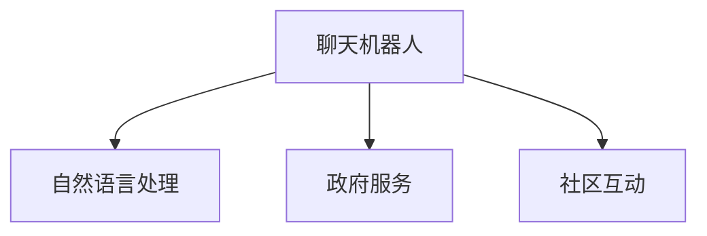

                 

# 聊天机器人公共服务：政府和社区互动

> 关键词：聊天机器人, 政府服务, 社区互动, 自然语言处理, 公共服务自动化

## 1. 背景介绍

在数字时代，政府机构和社区组织正面临着前所未有的挑战。随着信息技术的普及和人民生活水平的提高，公众对公共服务的期望和需求也在不断升级。传统的政府和社区互动方式，如电话咨询、柜台服务、邮件处理等，已经无法满足现代公民对效率、便捷、个性化和多样性的要求。

为了提升公共服务的质量与效率，各国政府和社区组织开始探索使用先进的技术手段，其中聊天机器人（Chatbot）成为了一种新兴的、备受瞩目的工具。通过聊天机器人，公众可以实时获得所需信息，进行事务咨询和办理，完成各类互动任务，从而实现无障碍、全天候、即时的公共服务。

本文将系统地介绍聊天机器人技术在政府和社区互动中的应用，包括其核心概念、关键技术、优化方法以及未来发展方向，以期为相关领域的实践者提供参考和指导。

## 2. 核心概念与联系

### 2.1 核心概念概述

为更好地理解聊天机器人在政府和社区互动中的应用，本节将介绍几个密切相关的核心概念：

- **聊天机器人（Chatbot）**：一种基于自然语言处理(NLP)技术的智能交互系统，能够模拟人类对话，处理各类自然语言输入和输出。

- **自然语言处理（NLP）**：研究如何让计算机理解、处理和生成自然语言的技术，包括语言模型、语义理解、对话管理等关键模块。

- **政府服务（Government Service）**：政府机构提供的各类公共服务和互动渠道，如政策咨询、证件办理、在线投诉等。

- **社区互动（Community Interaction）**：社区组织与居民之间的双向交流与互动，涵盖信息发布、活动组织、需求收集等方面。

这些核心概念之间的逻辑关系可以通过以下Mermaid流程图来展示：



这个流程图展示了一个聊天机器人系统如何在政府和社区互动中发挥作用：

1. 聊天机器人通过自然语言处理技术，能够与用户进行自然语言交流。
2. 对于政府服务相关的咨询，机器人可以调用相关API进行信息查询和事务办理。
3. 对于社区互动相关的问题，机器人可以组织活动、发布信息或收集居民反馈。

## 3. 核心算法原理 & 具体操作步骤

### 3.1 算法原理概述

聊天机器人在政府和社区互动中的关键算法原理主要包括自然语言处理、对话管理和任务执行。

**自然语言处理**：通过对输入文本进行分词、词性标注、命名实体识别等步骤，将自然语言转换为机器可以理解的结构化数据。

**对话管理**：设计状态机或基于规则的对话模型，管理对话流程，根据上下文选择合适的回复策略。

**任务执行**：集成第三方API接口，调用政府服务、社区资源等，完成用户的各类事务办理和信息查询。

### 3.2 算法步骤详解

聊天机器人的构建主要包括以下几个关键步骤：

**Step 1: 准备数据和资源**
- 收集和整理相关领域的对话数据，包括历史聊天记录、常见问题等。
- 确定聊天机器人的应用场景，如政府服务、社区互动等。
- 选择合适的第三方API和服务，如政府服务门户、社区平台等。

**Step 2: 选择聊天机器人框架**
- 根据需求选择合适的聊天机器人框架，如Microsoft Bot Framework、Rasa、Dialogflow等。

**Step 3: 构建对话模型**
- 设计对话流程，定义状态、意图、槽位等关键组件。
- 利用NLP技术提取输入文本的关键信息，填充到对话模型中。
- 配置对话管理逻辑，实现对话过程的动态调整。

**Step 4: 集成第三方服务**
- 对接政府服务API，实现信息查询、证件办理等功能。
- 集成社区互动API，实现活动组织、信息发布、反馈收集等功能。

**Step 5: 测试和优化**
- 在测试集上评估聊天机器人的表现，检查准确性、流畅性、用户满意度等指标。
- 根据测试结果不断调整对话模型，优化对话管理策略。
- 引入用户反馈机制，持续迭代优化。

### 3.3 算法优缺点

聊天机器人在政府和社区互动中具有以下优点：

- **高效便捷**：聊天机器人能够7x24小时在线服务，提供即时的信息查询和事务办理。
- **成本低廉**：相比于传统的人工客服，聊天机器人能够显著降低人力成本。
- **覆盖面广**：适用于各类公共服务场景，涵盖政府、社区、教育、医疗等多个领域。

同时，也存在一些局限性：

- **自然语言理解能力有限**：当前的聊天机器人对于复杂的语言理解和语境处理仍然存在挑战。
- **用户交互体验不稳定**：对话质量受对话模型和上下文管理的影响较大。
- **数据隐私和安全性问题**：处理涉及个人隐私信息时，需要确保数据安全和隐私保护。

### 3.4 算法应用领域

聊天机器人在政府和社区互动中的应用非常广泛，以下是几个典型的应用场景：

- **政府服务咨询**：通过聊天机器人，公众可以获取政策解读、证件办理指南、税务咨询等政府服务信息。
- **社区信息发布**：聊天机器人可以发布社区活动、通知公告、服务信息等，方便居民了解社区动态。
- **公共安全预警**：对于地震、洪水等突发事件，聊天机器人可以实时发布预警信息，指导居民安全避险。
- **智能客服系统**：金融机构、电商平台等可以通过聊天机器人提供客服支持，提升用户体验。

此外，聊天机器人在教育、医疗、交通等多个领域都有广泛的应用前景，未来必将成为公共服务自动化和智能化的一个重要组成部分。

## 4. 数学模型和公式 & 详细讲解 & 举例说明

### 4.1 数学模型构建

聊天机器人系统通过自然语言处理和对话管理技术，将输入的文本转换为结构化数据，并依据特定逻辑生成回复。其核心模型包括以下几部分：

- **分词模型**：对输入文本进行分词处理，生成词语序列。
- **语言模型**：利用统计语言模型或深度学习模型，预测输入文本的概率分布。
- **对话状态跟踪**：通过状态机或序列模型，记录和更新对话上下文，指导回复生成。

### 4.2 公式推导过程

以自然语言处理中的词向量表示为例，常用模型为Word2Vec。假设输入的文本序列为 $x_1, x_2, \ldots, x_n$，通过Word2Vec模型，将每个词语转换为向量表示 $v_i$。推导过程如下：

- 计算每个词语$x_i$在上下文中出现的概率$p_i$：
$$
p_i = \frac{\text{上下文出现次数}}{\text{总词汇数}}
$$

- 利用softmax函数，将概率转换为概率分布：
$$
\text{Prob}(v_i|x_i) = \frac{e^{v_i^T \cdot \text{context}(x_i)}}{\sum_{k=1}^n e^{v_k^T \cdot \text{context}(x_i)}}
$$

其中，$\text{context}(x_i)$为词语$x_i$的上下文，如前文和后文。

### 4.3 案例分析与讲解

以一个简单的政府服务咨询聊天机器人为例，分析其实现过程。

假设用户输入：“我想了解疫情期间的防护措施。”

1. 分词模型：将输入文本分词，得到词语序列$[x_i, x_j, x_k, x_l]$。
2. 语言模型：利用预训练模型如BERT，计算每个词语的概率分布。
3. 对话管理：判断用户意图为“防护措施”，调用政府服务API获取相关信息。
4. 回复生成：生成回复文本“疫情期间，建议居家隔离，佩戴口罩，勤洗手。”

## 5. 项目实践：代码实例和详细解释说明

### 5.1 开发环境搭建

在进行聊天机器人项目实践前，我们需要准备好开发环境。以下是使用Python进行Flask开发的环境配置流程：

1. 安装Anaconda：从官网下载并安装Anaconda，用于创建独立的Python环境。

2. 创建并激活虚拟环境：
```bash
conda create -n chatbot-env python=3.8 
conda activate chatbot-env
```

3. 安装Flask：
```bash
pip install flask
```

4. 安装NLTK和spaCy：
```bash
pip install nltk spacy
```

5. 下载预训练模型：
```bash
python -m nltk.downloader averaging_perceptron_tagger
python -m spacy download en_core_web_lg
```

完成上述步骤后，即可在`chatbot-env`环境中开始项目开发。

### 5.2 源代码详细实现

我们使用Flask框架，通过调用Google Dialogflow API实现一个简单的聊天机器人。以下是一个完整的Flask应用代码：

```python
from flask import Flask, request, jsonify
import dialogflow_v2 as dialogflow
import nltk

app = Flask(__name__)

# 初始化Dialogflow客户端
project_id = 'YOUR_PROJECT_ID'
session_client = dialogflow.SessionsClient()
session_client.set_project_location(project_id, 'us')

# 加载自然语言处理工具
nltk.download('averaging_perceptron_tagger')
tokenizer = nltk.data.load('tokenizers/punkt/english.pickle')

def get_intents(text):
    # 将文本分词
    tokens = tokenizer.tokenize(text)
    # 计算每个词语的概率分布
    probabilities = []
    for token in tokens:
        probabilities.append(calculate_probability(token))
    return probabilities

def calculate_probability(token):
    # 调用Dialogflow进行意图识别，返回意图和置信度
    session = session_client.session_path(project_id, 'YOUR_SESSION_ID')
    text_input = dialogflow.types.TextInput(text=token, language_code='en-US')
    query_input = dialogflow.types.QueryInput(text=text_input)
    response = session_client.detect_intent(session=session, query_input=query_input)
    return response.query_result.intent.display_name

@app.route('/', methods=['POST'])
def chatbot():
    data = request.json
    text = data['queryResult']['queryText']
    intents = get_intents(text)
    # 根据意图生成回复
    response = []
    for intent in intents:
        response.append(f"意图：{intent}")
    return jsonify({'response': response})

if __name__ == '__main__':
    app.run(debug=True)
```

以上代码实现了通过Flask接收用户输入，利用Dialogflow进行意图识别，并根据识别结果生成回复的功能。具体步骤如下：

1. 初始化Dialogflow客户端，配置项目ID和会话ID。
2. 加载自然语言处理工具，进行分词处理。
3. 定义计算概率函数，调用Dialogflow进行意图识别，并返回置信度最高的意图。
4. 使用Flask接收用户输入，调用意图识别函数，生成回复并返回。

### 5.3 代码解读与分析

让我们再详细解读一下关键代码的实现细节：

**Flask应用程序**：
- `get_intents`函数：接收用户输入文本，将其分词，并计算每个词语的概率分布。
- `calculate_probability`函数：调用Dialogflow进行意图识别，返回置信度最高的意图。
- `chatbot`函数：接收用户输入文本，调用意图识别函数，并生成回复。

**自然语言处理工具**：
- `nltk`库：用于进行分词和计算概率。
- `spaCy`库：用于处理英文分词和词性标注，但本文未使用。

**Dialogflow集成**：
- `dialogflow`库：用于与Dialogflow API进行交互，进行意图识别。
- `session_client`：创建会话，并调用`detect_intent`方法进行意图识别。

通过这些工具和函数，我们可以高效地构建聊天机器人，实现政府和社区互动的自动化服务。当然，在实际应用中，还需要进一步优化和扩展，以满足更复杂的需求。

## 6. 实际应用场景

### 6.1 政府服务咨询

在政府服务咨询场景中，聊天机器人可以提供各类政策解读、证件办理指南、税务咨询等服务，极大提升政府服务的便捷性和效率。

**具体应用**：
- **政策咨询**：公众输入“房产证如何办理”，聊天机器人通过调用政府服务API，生成详细办理指南。
- **税务咨询**：用户询问“个人所得税如何申报”，机器人返回申报步骤和注意事项。

### 6.2 社区信息发布

聊天机器人能够发布各类社区信息，如活动公告、通知公告、服务信息等，方便居民了解社区动态。

**具体应用**：
- **活动发布**：社区管理部门通过聊天机器人发布活动公告，居民可以实时获取信息。
- **通知公告**：政府部门通过聊天机器人发布紧急通知，确保信息传递的及时性和准确性。

### 6.3 公共安全预警

对于地震、洪水等突发事件，聊天机器人可以实时发布预警信息，指导居民安全避险。

**具体应用**：
- **地震预警**：地震发生时，机器人自动发送预警信息，建议居民避难。
- **洪水预警**：暴雨来临时，机器人提供实时水位和道路情况，建议居民注意安全。

### 6.4 未来应用展望

未来，聊天机器人在政府和社区互动中的应用将更加广泛和深入。以下是几个发展方向：

- **多模态交互**：结合语音、图像、视频等多种交互方式，提升用户体验。
- **智能推荐系统**：通过分析用户行为和偏好，提供个性化服务和建议。
- **AI辅助决策**：利用机器学习算法，辅助政府和社区进行决策分析。
- **跨领域融合**：与其他智能系统（如智能家居、智能交通）进行融合，提供一站式服务。

## 7. 工具和资源推荐

### 7.1 学习资源推荐

为了帮助开发者系统掌握聊天机器人在政府和社区互动中的应用，这里推荐一些优质的学习资源：

1. **《自然语言处理综论》**：清华大学出版社，涵盖自然语言处理基础理论和实践方法，适合初学者学习。
2. **《Dialogflow实战》**：国内权威技术书籍，介绍Dialogflow的基本原理和实践技巧。
3. **NLP Super Bowl**：每年一次的NLP领域顶级竞赛，汇集全球顶尖NLP人才，展示最新技术成果。
4. **Kaggle社区**：NLP和机器学习社区，提供丰富的数据集和模型库，适合数据驱动的研究。

通过对这些资源的学习实践，相信你一定能够快速掌握聊天机器人在政府和社区互动中的应用技巧，并用于解决实际的公共服务问题。

### 7.2 开发工具推荐

高效的开发离不开优秀的工具支持。以下是几款用于聊天机器人开发的工具：

1. **Flask**：轻量级的Python Web框架，易于上手，适合快速开发。
2. **Dialogflow**：Google提供的自然语言处理平台，支持意图识别、对话管理等关键功能。
3. **Rasa**：开源的对话管理框架，提供丰富的NLP组件和API接口，适合复杂对话系统的构建。
4. **Botpress**：企业级的聊天机器人开发平台，提供可视化界面和插件系统，适合企业应用。

合理利用这些工具，可以显著提升聊天机器人开发效率，加快技术创新迭代的步伐。

### 7.3 相关论文推荐

聊天机器人技术的发展源于学界的持续研究。以下是几篇奠基性的相关论文，推荐阅读：

1. **"Attention is All You Need"**：Transformer原论文，提出了自注意力机制，开启了大模型时代的序幕。
2. **"Neural Machine Translation by Jointly Learning to Align and Translate"**：机器翻译领域的经典论文，介绍了Seq2Seq模型的基本原理。
3. **"Exploring the Limits of Language Modeling"**：BERT论文，提出了预训练语言模型的基本框架，推动了NLP技术的突破。

这些论文代表了大语言模型和自然语言处理技术的发展脉络。通过学习这些前沿成果，可以帮助研究者把握学科前进方向，激发更多的创新灵感。

## 8. 总结：未来发展趋势与挑战

### 8.1 总结

本文对聊天机器人技术在政府和社区互动中的应用进行了全面系统的介绍。首先阐述了聊天机器人在公共服务中的重要性和应用场景，明确了其核心概念和关键技术。其次，从原理到实践，详细讲解了聊天机器人的构建流程和优化方法，给出了完整的代码实现。同时，本文还广泛探讨了聊天机器人在政府服务、社区互动等多个领域的应用前景，展示了其广泛的应用价值。

通过本文的系统梳理，可以看到，聊天机器人技术在公共服务自动化和智能化中发挥了重要作用，极大地提升了政府和社区的效率和服务水平。未来，随着技术的不断进步和应用的不断深入，聊天机器人必将在构建人机协同的智能政府和智慧社区中扮演越来越重要的角色。

### 8.2 未来发展趋势

展望未来，聊天机器人在政府和社区互动中的应用将呈现以下几个发展趋势：

- **智能化水平提升**：随着深度学习和大规模数据的应用，聊天机器人的智能化水平将不断提升，能够更好地理解复杂语义和语境。
- **多渠道融合**：结合语音、图像、视频等多种交互方式，提供全方位的智能服务。
- **跨领域协同**：与其他智能系统（如智能家居、智能交通）进行融合，形成更全面、智能的服务体系。
- **隐私保护强化**：在处理涉及个人隐私信息时，加强数据安全和隐私保护。
- **服务质量优化**：通过持续学习和优化，提升聊天机器人的交互体验和用户满意度。

以上趋势凸显了聊天机器人技术的广阔前景。这些方向的探索发展，必将进一步推动公共服务的智能化和自动化，为社会治理带来新的突破。

### 8.3 面临的挑战

尽管聊天机器人在政府和社区互动中已经取得了显著成就，但在迈向更加智能化、普适化应用的过程中，它仍面临着诸多挑战：

- **数据质量问题**：低质量的数据会严重影响聊天机器人的性能，如何收集和处理高精度的数据是关键。
- **模型训练困难**：复杂的对话场景下，训练大规模对话模型面临诸多困难，需要更多的数据和计算资源。
- **用户接受度低**：用户对聊天机器人服务体验的不满意，可能导致其接受度低，影响推广效果。
- **隐私和安全问题**：处理涉及个人隐私信息时，需要确保数据安全和隐私保护。
- **交互体验不稳定**：对话质量受上下文管理和算法优化影响较大，需要不断改进以提升用户体验。

### 8.4 研究展望

面对聊天机器人面临的这些挑战，未来的研究需要在以下几个方面寻求新的突破：

- **多模态数据融合**：将语音、图像、视频等多种模态数据与自然语言处理结合，提升对话系统的智能水平。
- **跨模态交互设计**：设计更自然、流畅的多模态交互方式，提高用户使用体验。
- **自监督学习**：通过无监督学习和半监督学习，减少对标注数据的依赖，提升模型的泛化能力。
- **个性化推荐系统**：结合用户行为数据，提供个性化服务和推荐。
- **联邦学习**：在保护用户隐私的前提下，利用分布式学习提升模型性能。

这些研究方向将推动聊天机器人技术迈向更高的台阶，为构建高效、智能、安全的公共服务系统提供重要支撑。

## 9. 附录：常见问题与解答

**Q1：聊天机器人在政府和社区互动中的应用有哪些局限性？**

A: 聊天机器人在政府和社区互动中存在以下局限性：
- **复杂语义理解**：对于含有多义、语境复杂的情况，聊天机器人可能无法正确理解用户意图。
- **知识库更新**：需要定期更新知识库，确保机器人能够提供最新信息。
- **个性化服务**：当前聊天机器人普遍缺乏个性化服务能力，需要进一步提升用户交互体验。
- **交互自然度**：对话自然度仍需提升，避免生硬和刻板。

**Q2：如何提高聊天机器人的交互质量？**

A: 提高聊天机器人的交互质量可以从以下几个方面入手：
- **数据质量**：收集高精度的对话数据，进行数据清洗和标注，确保训练数据的质量。
- **模型优化**：使用最新的深度学习模型和算法，优化对话管理策略，提升模型性能。
- **用户反馈**：引入用户反馈机制，不断调整和优化模型，提升用户满意度。
- **多模态交互**：结合语音、图像、视频等多种模态数据，提供更丰富的交互体验。

**Q3：如何确保聊天机器人的数据安全和隐私保护？**

A: 确保聊天机器人的数据安全和隐私保护，可以从以下几个方面入手：
- **数据匿名化**：对用户数据进行匿名化处理，防止数据泄露。
- **加密传输**：使用加密技术对数据进行传输和存储，保障数据安全。
- **访问控制**：限制对数据资源的访问权限，防止未经授权的访问。
- **隐私政策**：制定明确的隐私政策，告知用户数据的使用情况和保护措施。

**Q4：如何在政府和社区互动中实现多渠道融合？**

A: 在政府和社区互动中实现多渠道融合，可以从以下几个方面入手：
- **统一接口**：设计统一的API接口，支持多种交互方式。
- **跨模态数据融合**：将语音、图像、视频等模态数据与自然语言处理结合，提供更丰富的交互体验。
- **智能代理**：使用智能代理，对多种交互渠道进行统一管理和调度。
- **用户界面**：设计统一的用户界面，方便用户在不同渠道之间切换。

通过这些方法，可以构建更全面、智能的政府和社区互动系统，提升公共服务的智能化和便捷性。

---

作者：禅与计算机程序设计艺术 / Zen and the Art of Computer Programming

