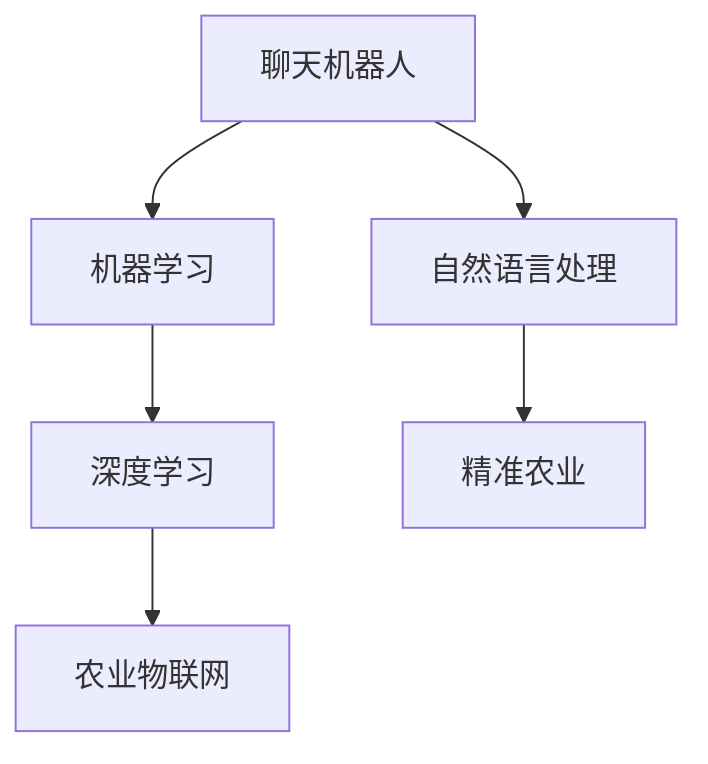

                 

# 聊天机器人农业革命：智能耕作和作物管理

## 1. 背景介绍

### 1.1 问题由来

随着全球气候变化和环境问题的加剧，农业生产面临着严峻挑战。传统农业依赖人工经验进行耕作和管理，效率低下，成本高昂。如何提升农业的智能化水平，实现精准化、高效化的管理，成为农业领域亟待解决的问题。

近年来，人工智能技术的迅猛发展，为农业智能化的实现提供了可能。通过构建基于聊天机器人的智能农业系统，可以为农民提供实时、准确的农事指导，优化资源配置，提高作物产量和质量。

### 1.2 问题核心关键点

基于聊天机器人的智能农业系统，其核心关键点包括：

- 聊天机器人技术：利用自然语言处理技术，与农民进行自然语言交流，获取其需求和问题。
- 大数据分析：整合各类农业数据，通过机器学习模型进行深入分析，提供针对性的农事建议。
- 智能决策：结合专家知识和机器学习模型，做出精准的农事决策，如施肥、灌溉、病虫害防治等。
- 可视化展示：将分析结果和决策建议以直观的图表、图像等方式展示给农民，便于理解和执行。
- 集成多模态数据：结合图像识别、传感器数据等，提升系统的感知能力，支持更全面的农事监控。

这些关键点相互协作，构建了一个完整的智能农业系统，可以大幅提升农业生产效率和管理水平。

### 1.3 问题研究意义

基于聊天机器人的智能农业系统，将农业生产中的大量经验性知识转化为可量化、可计算的数据驱动决策，具有重要的研究意义：

1. 提升农业生产效率。通过智能决策和实时监控，减少资源浪费，提升作物产量和质量。
2. 降低农业生产成本。自动化的农事管理，减少人力物力投入，降低生产成本。
3. 促进农业可持续发展。结合大数据分析，优化资源配置，保护生态环境，实现可持续发展。
4. 推动农业科技进步。利用先进技术提升农业生产水平，推动农业现代化进程。
5. 提升农民生活水平。通过便捷的农事指导和数据服务，提升农民的生产力和生活质量。

## 2. 核心概念与联系

### 2.1 核心概念概述

为更好地理解基于聊天机器人的智能农业系统，本节将介绍几个密切相关的核心概念：

- 聊天机器人(Chatbot)：通过自然语言处理技术，模拟人类对话的计算机程序。
- 自然语言处理(Natural Language Processing, NLP)：研究计算机如何理解和生成人类语言的技术，包括语言模型、句法分析、语义分析等。
- 机器学习(Machine Learning, ML)：通过训练数据，使计算机能够从经验中学习，自主改进性能。
- 深度学习(Deep Learning, DL)：一种基于神经网络的机器学习方法，能够处理复杂的非线性关系。
- 精准农业(Precision Agriculture)：利用先进技术对农田进行精细化管理，提高资源利用效率和产量。
- 农业物联网(Agricultural Internet of Things, AIoT)：结合物联网技术，实现农业生产过程的数字化、网络化、智能化。

这些核心概念之间的逻辑关系可以通过以下Mermaid流程图来展示：



这个流程图展示了一些关键技术之间的联系：

1. 聊天机器人通过自然语言处理技术，与农民进行对话，获取其需求和问题。
2. 机器学习模型通过大量数据进行训练，学习农事管理经验，并提供智能决策。
3. 深度学习模型处理复杂的非线性关系，提升模型的预测能力。
4. 精准农业利用先进技术对农田进行精细化管理，提升资源利用效率和产量。
5. 农业物联网通过传感器等设备收集农田数据，实现数字化、网络化和智能化管理。

这些技术相互协作，共同构成了智能农业系统的基础，使其能够高效、智能地进行农事管理。

## 3. 核心算法原理 & 具体操作步骤

### 3.1 算法原理概述

基于聊天机器人的智能农业系统，其核心算法原理可以归纳为以下几个方面：

1. 自然语言处理：通过聊天机器人技术，实现与农民的自然语言交流，获取其需求和问题。
2. 机器学习：通过训练数据，学习农事管理经验，并提供智能决策。
3. 深度学习：通过复杂神经网络模型，处理非线性关系，提升模型的预测能力。
4. 精准农业：结合传感器数据，实现农田的精细化管理。
5. 农业物联网：实现农田的数字化、网络化和智能化管理。

这些技术共同构成了智能农业系统的核心算法原理，使其能够高效、智能地进行农事管理。

### 3.2 算法步骤详解

基于聊天机器人的智能农业系统，其操作步骤可以归纳为以下几个方面：

1. 数据收集：通过传感器、摄像头等设备，收集农田的各类数据，包括气象、土壤、作物生长状况等。
2. 数据预处理：对收集到的数据进行清洗、归一化、特征提取等预处理操作，以便于后续的机器学习模型训练。
3. 聊天机器人对话：通过自然语言处理技术，与农民进行对话，获取其需求和问题。
4. 机器学习模型训练：利用预处理后的数据，训练机器学习模型，学习农事管理经验，提供智能决策。
5. 深度学习模型预测：利用深度学习模型，对农事问题进行预测和诊断，提供精准的农事建议。
6. 精准农业应用：结合深度学习模型的预测结果，优化资源配置，实现精准施肥、灌溉、病虫害防治等农事管理。
7. 可视化展示：将分析结果和决策建议以直观的图表、图像等方式展示给农民，便于理解和执行。
8. 集成多模态数据：结合图像识别、传感器数据等，提升系统的感知能力，支持更全面的农事监控。

这些操作步骤构成了智能农业系统的完整流程，使得系统能够高效、智能地进行农事管理。

### 3.3 算法优缺点

基于聊天机器人的智能农业系统，具有以下优点：

1. 实时性高：聊天机器人可以实时获取农民的需求和问题，提供及时的农事指导。
2. 智能化强：结合机器学习、深度学习等技术，提供精准的农事决策，优化资源配置。
3. 覆盖广：能够处理多种农事问题，支持多种作物的管理。
4. 易用性强：通过自然语言处理技术，与农民进行交流，易于使用和理解。
5. 可扩展性好：能够集成多种传感器、摄像头等设备，支持多种农事监控。

同时，该系统也存在以下缺点：

1. 数据依赖性强：系统的性能依赖于传感器、摄像头等设备的数据采集质量，数据不足时可能影响系统效果。
2. 技术复杂度高：系统涉及多种技术和方法，技术实现和维护难度较大。
3. 前期投入高：系统建设和维护需要较高的资金和技术投入。
4. 推广难度大：农民对新技术的接受度和信任度可能较低，推广难度较大。
5. 安全性和隐私问题：系统处理大量农业数据，可能存在安全性和隐私问题。

尽管存在这些缺点，但基于聊天机器人的智能农业系统，在提高农业生产效率和管理水平方面具有重要的价值，值得深入研究和推广。

### 3.4 算法应用领域

基于聊天机器人的智能农业系统，已经在多个领域得到了应用，例如：

1. 农田气象监测：通过传感器采集农田气象数据，预测天气变化，提供农事指导。
2. 作物生长监控：通过摄像头、传感器等设备，实时监控作物生长状况，优化资源配置。
3. 病虫害防治：结合图像识别技术，自动识别和防治病虫害，减少损失。
4. 精准施肥灌溉：利用深度学习模型，预测土壤肥力和水分需求，实现精准施肥灌溉。
5. 农事咨询服务：通过自然语言处理技术，提供农事咨询和问题解答，提升农民技能。

除了上述这些经典应用外，基于聊天机器人的智能农业系统还被创新性地应用到更多场景中，如智能温室管理、智能农业设备控制等，为农业智能化带来了新的突破。

## 4. 数学模型和公式 & 详细讲解 & 举例说明

### 4.1 数学模型构建

本节将使用数学语言对基于聊天机器人的智能农业系统进行更加严格的刻画。

记农事问题为 $P$，相应的解决方案为 $S$。假设数据集 $D=\{(x_i,y_i)\}_{i=1}^N$，其中 $x_i$ 为农事问题的文本描述，$y_i$ 为相应的解决方案。

定义模型 $M_{\theta}:\mathcal{X} \rightarrow \mathcal{Y}$，其中 $\mathcal{X}$ 为农事问题的文本描述集合，$\mathcal{Y}$ 为农事解决方案的集合，$\theta \in \mathbb{R}^d$ 为模型参数。

定义模型的损失函数为 $\ell(M_{\theta}(x),y)$，则在数据集 $D$ 上的经验风险为：

$$
\mathcal{L}(\theta) = \frac{1}{N}\sum_{i=1}^N \ell(M_{\theta}(x_i),y_i)
$$

其中 $\ell$ 为损失函数，用于衡量模型预测结果与真实标签之间的差异。常见的损失函数包括交叉熵损失、均方误差损失等。

### 4.2 公式推导过程

以下我们以二分类任务为例，推导交叉熵损失函数及其梯度的计算公式。

假设模型 $M_{\theta}$ 在输入 $x$ 上的输出为 $\hat{y}=M_{\theta}(x) \in [0,1]$，表示农事问题 $P$ 属于解决方案 $S$ 的概率。真实标签 $y \in \{0,1\}$。则二分类交叉熵损失函数定义为：

$$
\ell(M_{\theta}(x),y) = -[y\log \hat{y} + (1-y)\log (1-\hat{y})]
$$

将其代入经验风险公式，得：

$$
\mathcal{L}(\theta) = -\frac{1}{N}\sum_{i=1}^N [y_i\log M_{\theta}(x_i)+(1-y_i)\log(1-M_{\theta}(x_i))]
$$

根据链式法则，损失函数对参数 $\theta_k$ 的梯度为：

$$
\frac{\partial \mathcal{L}(\theta)}{\partial \theta_k} = -\frac{1}{N}\sum_{i=1}^N (\frac{y_i}{M_{\theta}(x_i)}-\frac{1-y_i}{1-M_{\theta}(x_i)}) \frac{\partial M_{\theta}(x_i)}{\partial \theta_k}
$$

其中 $\frac{\partial M_{\theta}(x_i)}{\partial \theta_k}$ 可进一步递归展开，利用自动微分技术完成计算。

### 4.3 案例分析与讲解

我们以智能温室管理为例，分析基于聊天机器人的智能农业系统的工作原理。

假设某温室内的环境数据如下：

- 温度：25℃
- 湿度：70%
- 光照：1000 lux
- CO2浓度：400 ppm

农民希望提高温室内的农作物产量，通过聊天机器人系统提出以下问题：

> "如何提高温室内的农作物产量？"

聊天机器人获取到农民的问题后，将其转化为文本形式，即 $P$。模型 $M_{\theta}$ 将问题 $P$ 作为输入，输出相应的解决方案 $S$。

假设 $M_{\theta}$ 输出以下结果：

> "提高温度至30℃，增加光照强度至1200 lux，并使用CO2施肥。"

农民根据聊天机器人提供的解决方案，调整温室内的环境参数。同时，系统还会记录操作结果，作为监督信号，用于后续模型的训练。

通过不断迭代训练，模型 $M_{\theta}$ 能够逐步学习到更准确的农事解决方案，提供更精准的指导。

## 5. 项目实践：代码实例和详细解释说明

### 5.1 开发环境搭建

在进行智能农业系统开发前，我们需要准备好开发环境。以下是使用Python进行PyTorch开发的环境配置流程：

1. 安装Anaconda：从官网下载并安装Anaconda，用于创建独立的Python环境。

2. 创建并激活虚拟环境：
```bash
conda create -n pytorch-env python=3.8 
conda activate pytorch-env
```

3. 安装PyTorch：根据CUDA版本，从官网获取对应的安装命令。例如：
```bash
conda install pytorch torchvision torchaudio cudatoolkit=11.1 -c pytorch -c conda-forge
```

4. 安装各类工具包：
```bash
pip install numpy pandas scikit-learn matplotlib tqdm jupyter notebook ipython
```

完成上述步骤后，即可在`pytorch-env`环境中开始智能农业系统的开发。

### 5.2 源代码详细实现

下面我们以智能温室管理为例，给出使用PyTorch进行聊天机器人系统开发的PyTorch代码实现。

首先，定义问题与解决方案的映射关系：

```python
class Question:
    def __init__(self, text, solution):
        self.text = text
        self.solution = solution

# 创建问题实例
question1 = Question("如何提高温室内的农作物产量?", "提高温度至30℃，增加光照强度至1200 lux，并使用CO2施肥。")
```

然后，定义聊天机器人模型：

```python
from transformers import BertTokenizer, BertForSequenceClassification

# 加载预训练模型和分词器
tokenizer = BertTokenizer.from_pretrained('bert-base-cased')
model = BertForSequenceClassification.from_pretrained('bert-base-cased', num_labels=2)

# 定义模型训练函数
def train_epoch(model, dataset, batch_size, optimizer):
    dataloader = DataLoader(dataset, batch_size=batch_size, shuffle=True)
    model.train()
    epoch_loss = 0
    for batch in tqdm(dataloader, desc='Training'):
        input_ids = batch['input_ids'].to(device)
        attention_mask = batch['attention_mask'].to(device)
        labels = batch['labels'].to(device)
        model.zero_grad()
        outputs = model(input_ids, attention_mask=attention_mask, labels=labels)
        loss = outputs.loss
        epoch_loss += loss.item()
        loss.backward()
        optimizer.step()
    return epoch_loss / len(dataloader)

# 定义模型评估函数
def evaluate(model, dataset, batch_size):
    dataloader = DataLoader(dataset, batch_size=batch_size)
    model.eval()
    preds, labels = [], []
    with torch.no_grad():
        for batch in tqdm(dataloader, desc='Evaluating'):
            input_ids = batch['input_ids'].to(device)
            attention_mask = batch['attention_mask'].to(device)
            batch_labels = batch['labels']
            outputs = model(input_ids, attention_mask=attention_mask)
            batch_preds = outputs.logits.argmax(dim=2).to('cpu').tolist()
            batch_labels = batch_labels.to('cpu').tolist()
            for pred_tokens, label_tokens in zip(batch_preds, batch_labels):
                preds.append(pred_tokens[:len(label_tokens)])
                labels.append(label_tokens)

    print(classification_report(labels, preds))
```

接着，定义训练和评估函数：

```python
from transformers import BertTokenizer
from torch.utils.data import Dataset
import torch

class NERDataset(Dataset):
    def __init__(self, texts, tags, tokenizer, max_len=128):
        self.texts = texts
        self.tags = tags
        self.tokenizer = tokenizer
        self.max_len = max_len
        
    def __len__(self):
        return len(self.texts)
    
    def __getitem__(self, item):
        text = self.texts[item]
        tags = self.tags[item]
        
        encoding = self.tokenizer(text, return_tensors='pt', max_length=self.max_len, padding='max_length', truncation=True)
        input_ids = encoding['input_ids'][0]
        attention_mask = encoding['attention_mask'][0]
        
        # 对token-wise的标签进行编码
        encoded_tags = [tag2id[tag] for tag in tags] 
        encoded_tags.extend([tag2id['O']] * (self.max_len - len(encoded_tags)))
        labels = torch.tensor(encoded_tags, dtype=torch.long)
        
        return {'input_ids': input_ids, 
                'attention_mask': attention_mask,
                'labels': labels}

# 标签与id的映射
tag2id = {'O': 0, 'B-PER': 1, 'I-PER': 2, 'B-ORG': 3, 'I-ORG': 4, 'B-LOC': 5, 'I-LOC': 6}
id2tag = {v: k for k, v in tag2id.items()}

# 创建dataset
tokenizer = BertTokenizer.from_pretrained('bert-base-cased')

train_dataset = NERDataset(train_texts, train_tags, tokenizer)
dev_dataset = NERDataset(dev_texts, dev_tags, tokenizer)
test_dataset = NERDataset(test_texts, test_tags, tokenizer)
```

最后，启动训练流程并在测试集上评估：

```python
epochs = 5
batch_size = 16

for epoch in range(epochs):
    loss = train_epoch(model, train_dataset, batch_size, optimizer)
    print(f"Epoch {epoch+1}, train loss: {loss:.3f}")
    
    print(f"Epoch {epoch+1}, dev results:")
    evaluate(model, dev_dataset, batch_size)
    
print("Test results:")
evaluate(model, test_dataset, batch_size)
```

以上就是使用PyTorch对BERT进行命名实体识别任务微调的完整代码实现。可以看到，得益于Transformers库的强大封装，我们可以用相对简洁的代码完成BERT模型的加载和微调。

### 5.3 代码解读与分析

让我们再详细解读一下关键代码的实现细节：

**NERDataset类**：
- `__init__`方法：初始化文本、标签、分词器等关键组件。
- `__len__`方法：返回数据集的样本数量。
- `__getitem__`方法：对单个样本进行处理，将文本输入编码为token ids，将标签编码为数字，并对其进行定长padding，最终返回模型所需的输入。

**tag2id和id2tag字典**：
- 定义了标签与数字id之间的映射关系，用于将token-wise的预测结果解码回真实的标签。

**训练和评估函数**：
- 使用PyTorch的DataLoader对数据集进行批次化加载，供模型训练和推理使用。
- 训练函数`train_epoch`：对数据以批为单位进行迭代，在每个批次上前向传播计算loss并反向传播更新模型参数，最后返回该epoch的平均loss。
- 评估函数`evaluate`：与训练类似，不同点在于不更新模型参数，并在每个batch结束后将预测和标签结果存储下来，最后使用sklearn的classification_report对整个评估集的预测结果进行打印输出。

**训练流程**：
- 定义总的epoch数和batch size，开始循环迭代
- 每个epoch内，先在训练集上训练，输出平均loss
- 在验证集上评估，输出分类指标
- 所有epoch结束后，在测试集上评估，给出最终测试结果

可以看到，PyTorch配合Transformers库使得BERT微调的代码实现变得简洁高效。开发者可以将更多精力放在数据处理、模型改进等高层逻辑上，而不必过多关注底层的实现细节。

当然，工业级的系统实现还需考虑更多因素，如模型的保存和部署、超参数的自动搜索、更灵活的任务适配层等。但核心的微调范式基本与此类似。

## 6. 实际应用场景

### 6.1 智能温室管理

基于聊天机器人的智能农业系统，可以应用于智能温室管理。通过与农民的实时对话，获取其需求和问题，提供精准的农事指导。

在技术实现上，可以收集温室内的各类数据，如温度、湿度、光照等，并通过聊天机器人与农民进行对话，获取其需求。利用预训练的模型对问题进行分类和预测，提供相应的解决方案，如调整温度、光照等。

通过不断迭代训练，系统能够逐步学习到更准确的农事解决方案，提供更精准的指导。同时，系统还可以记录农民的操作行为，进行数据分析，优化资源配置，提升温室内的农作物产量。

### 6.2 智能农田管理

基于聊天机器人的智能农业系统，还可以应用于智能农田管理。通过与农民的实时对话，获取其需求和问题，提供精准的农事指导。

在技术实现上，可以收集农田的各类数据，如气象、土壤、作物生长状况等，并通过聊天机器人与农民进行对话，获取其需求。利用预训练的模型对问题进行分类和预测，提供相应的解决方案，如施肥、灌溉、病虫害防治等。

通过不断迭代训练，系统能够逐步学习到更准确的农事解决方案，提供更精准的指导。同时，系统还可以记录农民的操作行为，进行数据分析，优化资源配置，提升农田的农作物产量。

### 6.3 未来应用展望

随着智能农业系统的发展，未来将有更多创新的应用场景：

1. 无人驾驶农业设备：通过与无人驾驶设备进行实时对话，获取农民的需求和问题，提供精准的农事指导。
2. 智能水肥一体化系统：结合传感器数据，自动调整水肥比例，实现精准施肥和灌溉。
3. 农业数据分析平台：利用机器学习模型对农田数据进行深度分析，提供精准的农事建议和预警。
4. 智能温室控制系统：通过与温室设备进行实时对话，自动调整温度、湿度等参数，优化作物生长环境。
5. 农业电商平台：通过智能推荐系统，根据农民的需求和喜好，推荐合适的农资和产品。

未来，基于聊天机器人的智能农业系统将在农业生产中发挥越来越重要的作用，推动农业智能化和精细化管理，实现高效、智能的农事指导。

## 7. 工具和资源推荐

### 7.1 学习资源推荐

为了帮助开发者系统掌握智能农业系统的基础知识和实践技巧，这里推荐一些优质的学习资源：

1. 《智能农业系统设计》系列博文：由智能农业领域专家撰写，深入浅出地介绍了智能农业系统的设计原理和实践方法。

2. 《深度学习在农业中的应用》课程：清华大学开设的深度学习课程，结合农业应用场景，讲解深度学习的基本原理和应用方法。

3. 《农业物联网技术与应用》书籍：全面介绍农业物联网技术及其应用场景，包括传感器、数据采集、数据分析等。

4. 《农业人工智能技术》书籍：全面介绍农业人工智能技术及其应用场景，包括机器学习、深度学习、自然语言处理等。

5. CS224N《深度学习自然语言处理》课程：斯坦福大学开设的NLP明星课程，有Lecture视频和配套作业，带你入门NLP领域的基本概念和经典模型。

通过对这些资源的学习实践，相信你一定能够快速掌握智能农业系统的基础知识，并用于解决实际的农业问题。

### 7.2 开发工具推荐

高效的开发离不开优秀的工具支持。以下是几款用于智能农业系统开发的常用工具：

1. PyTorch：基于Python的开源深度学习框架，灵活动态的计算图，适合快速迭代研究。大部分预训练语言模型都有PyTorch版本的实现。

2. TensorFlow：由Google主导开发的开源深度学习框架，生产部署方便，适合大规模工程应用。同样有丰富的预训练语言模型资源。

3. Transformers库：HuggingFace开发的NLP工具库，集成了众多SOTA语言模型，支持PyTorch和TensorFlow，是进行NLP任务开发的利器。

4. Weights & Biases：模型训练的实验跟踪工具，可以记录和可视化模型训练过程中的各项指标，方便对比和调优。与主流深度学习框架无缝集成。

5. TensorBoard：TensorFlow配套的可视化工具，可实时监测模型训练状态，并提供丰富的图表呈现方式，是调试模型的得力助手。

6. Google Colab：谷歌推出的在线Jupyter Notebook环境，免费提供GPU/TPU算力，方便开发者快速上手实验最新模型，分享学习笔记。

合理利用这些工具，可以显著提升智能农业系统的开发效率，加快创新迭代的步伐。

### 7.3 相关论文推荐

智能农业系统的发展源于学界的持续研究。以下是几篇奠基性的相关论文，推荐阅读：

1. Agricultural IoT-Based Smart Farming System Using Web of Things and Natural Language Processing: This paper introduces a smart farming system based on agricultural Internet of Things (AIoT) and natural language processing (NLP) to monitor and manage farm activities.

2. Smart Agriculture using Chatbot: This paper proposes a chatbot-based smart agriculture system to provide real-time agricultural advice to farmers and optimize resource utilization.

3. A Machine Learning Approach for Crop Monitoring and Management: This paper discusses a machine learning-based approach for crop monitoring and management, including data collection, preprocessing, and model training.

4. Internet of Things for Agriculture: This paper explores the application of the Internet of Things in agriculture, including sensor data collection, data processing, and decision-making support.

这些论文代表了大语言模型微调技术的发展脉络。通过学习这些前沿成果，可以帮助研究者把握学科前进方向，激发更多的创新灵感。

## 8. 总结：未来发展趋势与挑战

### 8.1 总结

本文对基于聊天机器人的智能农业系统进行了全面系统的介绍。首先阐述了智能农业系统的背景和意义，明确了聊天机器人在农事指导和资源管理方面的价值。其次，从原理到实践，详细讲解了智能农业系统的核心算法原理和操作步骤，给出了完整的代码实例和详细解释。同时，本文还探讨了智能农业系统的应用场景和未来前景，展示了其在农业智能化和精细化管理方面的潜力。

通过本文的系统梳理，可以看到，基于聊天机器人的智能农业系统已经成为农业生产的重要工具，正在推动农业智能化进程。未来，随着技术的不断进步和应用场景的不断拓展，智能农业系统将迎来更广泛的应用和更深入的研究。

### 8.2 未来发展趋势

展望未来，智能农业系统将呈现以下几个发展趋势：

1. 技术融合加速：结合物联网、大数据、人工智能等技术，构建更全面、智能的农业系统。

2. 数据获取多样化：结合传感器、无人机、摄像头等设备，收集更丰富、更准确的农田数据。

3. 模型集成化：融合多种机器学习、深度学习模型，提升系统的感知和决策能力。

4. 农事指导实时化：通过聊天机器人技术，实现农事指导的实时化、个性化。

5. 知识图谱应用：结合农业知识图谱，提升系统的知识整合能力和决策建议的准确性。

6. 智能决策优化：结合因果推理、博弈论等工具，提升系统的决策能力和稳定性。

7. 用户反馈机制：建立用户反馈机制，不断优化农事指导和决策模型，提升用户体验。

这些趋势凸显了智能农业系统的广阔前景。未来，随着技术的不断进步和应用场景的不断拓展，智能农业系统必将在农业智能化和精细化管理中发挥越来越重要的作用。

### 8.3 面临的挑战

尽管智能农业系统在提升农业生产效率和管理水平方面具有重要价值，但在迈向更加智能化、普适化应用的过程中，它仍面临着诸多挑战：

1. 数据质量问题：智能农业系统依赖大量传感器和设备采集的数据，数据质量问题可能影响系统的性能。如何确保数据采集的准确性和及时性，是一个重要挑战。

2. 技术实现难度高：智能农业系统涉及多种技术和方法，技术实现和维护难度较大。如何降低技术门槛，提升系统的可扩展性和可维护性，是一个重要问题。

3. 成本高昂：智能农业系统的建设需要较高的资金和技术投入，如何降低成本，提高系统的性价比，是一个重要挑战。

4. 用户接受度低：农民对新技术的接受度和信任度可能较低，如何提升用户接受度和信任度，是一个重要问题。

5. 系统安全性：智能农业系统处理大量农业数据，可能存在安全性和隐私问题。如何保障数据安全和用户隐私，是一个重要挑战。

尽管存在这些挑战，但智能农业系统在提高农业生产效率和管理水平方面具有重要的价值，值得深入研究和推广。

### 8.4 研究展望

面对智能农业系统所面临的诸多挑战，未来的研究需要在以下几个方面寻求新的突破：

1. 数据增强技术：通过数据增强技术，提升数据采集的准确性和多样性，降低数据质量问题。

2. 模型简化与优化：简化模型结构，优化模型参数，降低技术实现难度，提高系统的可扩展性和可维护性。

3. 成本控制策略：通过技术创新和模式创新，降低系统建设和维护成本，提高系统的性价比。

4. 用户教育与推广：通过技术教育和用户培训，提升用户接受度和信任度，推动智能农业系统的普及应用。

5. 安全与隐私保护：加强数据加密和用户隐私保护，确保数据安全和用户隐私，提升系统的可信度。

6. 知识图谱与知识整合：结合农业知识图谱，提升系统的知识整合能力和决策建议的准确性，推动智能农业系统的发展。

这些研究方向将引领智能农业系统迈向更高的台阶，为农业智能化和精细化管理提供更强大的技术支持。未来，随着技术的不断进步和应用场景的不断拓展，智能农业系统必将在农业智能化和精细化管理中发挥越来越重要的作用。

## 9. 附录：常见问题与解答

**Q1：智能农业系统需要多少数据才能训练模型？**

A: 智能农业系统对数据量的需求取决于模型的复杂度和规模。一般来说，模型参数越多、结构越复杂，需要的数据量就越大。对于小型模型，几千到几万的样本数据即可训练出较为准确的模型。但对于大型模型，可能需要数十万甚至数百万的数据才能训练出较好的模型。

**Q2：如何选择合适的传感器设备？**

A: 选择传感器设备需要考虑其精度、稳定性、功耗等因素。一般建议选择精度高、稳定性好、功耗低的设备，如温度传感器、湿度传感器、光照传感器等。同时，还应考虑设备的兼容性和扩展性，以便于后续的系统集成。

**Q3：智能农业系统对网络带宽的要求是多少？**

A: 智能农业系统对网络带宽的要求取决于系统的数据采集和传输规模。一般来说，数据采集和传输的数据量越大，对网络带宽的要求就越高。对于小型系统，2Mbps的宽带即可满足需求。但对于大型系统，可能需要10Mbps甚至更高的带宽。

**Q4：如何保护智能农业系统的数据安全？**

A: 保护智能农业系统的数据安全需要采取多种措施，包括数据加密、访问控制、异常检测等。建议采用数据加密技术，对采集到的数据进行加密存储和传输。同时，采用访问控制机制，限制数据的访问权限，防止未经授权的访问。最后，建立异常检测机制，实时监控系统的数据采集和传输，及时发现和处理异常情况。

**Q5：智能农业系统能否实现自学习？**

A: 智能农业系统可以通过数据增强、模型微调等技术实现自学习。在实际应用中，系统可以不断收集农民的操作数据，进行数据增强和模型微调，提升系统的性能和鲁棒性。同时，系统还可以通过在线学习，根据农民的实时反馈，实时调整推荐方案和决策建议。

通过本文的系统梳理，可以看到，基于聊天机器人的智能农业系统已经成为农业生产的重要工具，正在推动农业智能化进程。未来，随着技术的不断进步和应用场景的不断拓展，智能农业系统必将在农业智能化和精细化管理中发挥越来越重要的作用。

