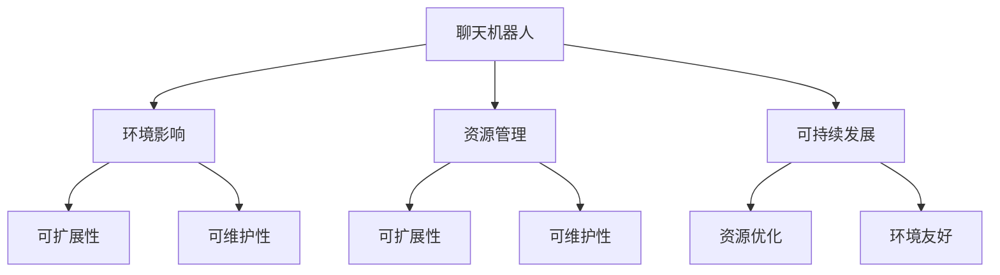

                 

## 1. 背景介绍

随着人工智能技术的快速发展，聊天机器人（Chatbots）的应用场景愈发广泛。从客服到社交、从娱乐到教育，聊天机器人正逐渐渗透到我们生活的各个角落。然而，随之而来的是对资源和环境的巨大影响。

聊天机器人通常依赖于大数据和算力，其开发、训练和运行都需要大量的能源和数据。在聊天机器人普及的过程中，我们面临着前所未有的资源和环境挑战。因此，实现聊天机器人的可持续发展，成为摆在我们面前的重要课题。

## 2. 核心概念与联系

### 2.1 核心概念概述

为了更好地理解聊天机器人可持续发展这一主题，本节将介绍几个关键概念：

- 聊天机器人（Chatbots）：通过自然语言处理技术实现人机交互的系统。可以通过预训练语言模型、机器翻译、语音识别等技术实现文本、语音、图像等多种形式的对话。

- 环境影响（Environmental Impact）：聊天机器人开发、训练和运行过程中对环境的负面作用，如能源消耗、碳排放、数据安全等。

- 资源管理（Resource Management）：聊天机器人系统对计算资源、存储资源、网络资源等的管理和优化，以实现低成本、高效运行。

- 可扩展性（Scalability）：聊天机器人系统能否轻松应对数据量、用户量的增加，维持稳定、高效的服务。

- 可维护性（Maintainability）：聊天机器人系统的代码、架构、配置等是否易于修改、维护和升级。

这些概念之间的联系可以通过以下Mermaid流程图来展示：



这个流程图展示了几组核心概念之间的相互关系：

1. 聊天机器人与环境影响、资源管理、可扩展性、可维护性之间的联系。
2. 环境影响和资源管理对可扩展性和可维护性的影响。
3. 聊天机器人通过资源优化和环境友好策略实现可持续发展。

这些概念共同构成了聊天机器人的可持续发展的技术框架，使得聊天机器人系统能够在实际应用中实现高效、环保、可维护的目标。

## 3. 核心算法原理 & 具体操作步骤

### 3.1 算法原理概述

聊天机器人的可持续发展涉及算法、数据、系统架构等多个方面。算法方面，主要需要解决如何通过模型优化、数据优化等手段降低资源消耗，减少环境影响；数据方面，需要合理管理和优化数据存储和传输；系统架构方面，需要实现高效、可扩展的架构，以支持海量用户和服务需求。

具体来说，聊天机器人可持续发展的算法原理可以归纳为以下几点：

- 资源优化：通过算法和架构优化，降低聊天机器人对计算资源、存储资源的消耗。
- 环境友好：通过算法和数据优化，减少聊天机器人的能源消耗和碳排放。
- 数据管理：通过合理的数据存储和传输策略，降低数据处理的复杂度和成本。
- 系统可扩展：通过高效的架构设计，使得聊天机器人能够应对快速增长的用户和服务需求。

### 3.2 算法步骤详解

聊天机器人可持续发展的算法步骤包括：

**Step 1: 数据收集与预处理**

- 收集聊天机器人交互数据，包括用户提问、系统回复、用户满意度等。
- 数据清洗和预处理，包括去除噪声、缺失值填补、数据归一化等。

**Step 2: 环境影响评估**

- 评估聊天机器人开发、训练和运行过程中的能源消耗和碳排放。
- 使用能源消耗计算器和碳排放计算器，量化具体的环境影响。

**Step 3: 资源管理优化**

- 根据环境影响评估结果，优化聊天机器人的资源使用策略。
- 采用资源高效算法，如模型剪枝、模型量化等，减少模型计算量。
- 优化数据存储和传输策略，减少数据存储和传输的能源消耗。

**Step 4: 模型优化与训练**

- 设计资源优化模型，如基于稀疏矩阵的矩阵乘法、基于分布式的模型训练等。
- 选择环境友好的训练方法，如迁移学习、少样本学习等，降低训练能耗。

**Step 5: 系统架构设计**

- 设计可扩展、可维护的系统架构，支持大规模用户和服务需求。
- 采用微服务架构、容器化技术、负载均衡等手段，提高系统的稳定性和扩展性。

**Step 6: 效果评估与迭代**

- 对聊天机器人的性能、环境影响和资源使用情况进行评估。
- 根据评估结果，进行模型迭代和系统优化。

### 3.3 算法优缺点

聊天机器人可持续发展算法的优点包括：

- 提高资源利用率：通过优化算法和架构，减少能源和资源消耗。
- 降低环境影响：采用环境友好技术，减少碳排放和能源消耗。
- 提升系统性能：通过模型优化和数据管理，提升聊天机器人的响应速度和服务质量。

然而，这些算法也存在一些缺点：

- 技术复杂：算法优化和架构设计需要较高的技术门槛，对开发团队的要求较高。
- 数据隐私：在数据处理和传输过程中，需要严格保护用户隐私和数据安全。
- 模型性能：优化算法和环境友好技术可能会牺牲模型性能，需要在性能和效率之间进行权衡。

### 3.4 算法应用领域

聊天机器人可持续发展的算法可以应用于多个领域，包括：

- 客服系统：通过优化算法和架构，提高客服系统的响应速度和资源利用率。
- 医疗健康：通过环境友好技术，降低医疗健康聊天机器人对能源的消耗，提高系统的稳定性。
- 金融服务：通过优化算法和数据管理，提升金融服务的效率和可靠性。
- 教育培训：通过模型优化和架构设计，提高教育培训聊天机器人的互动性和教育效果。

这些应用领域展示了聊天机器人可持续发展算法的多样性和广泛性，为各行业提供了可持续发展的解决方案。

## 4. 数学模型和公式 & 详细讲解 & 举例说明

### 4.1 数学模型构建

聊天机器人可持续发展的数学模型主要涉及以下几个方面：

- 能源消耗模型：通过评估聊天机器人运行过程中的能源消耗，计算其碳排放。
- 资源消耗模型：通过评估聊天机器人运行过程中的资源消耗，计算其对环境的影响。
- 数据存储模型：通过评估聊天机器人数据存储的能源消耗，计算其环境影响。
- 系统性能模型：通过评估聊天机器人系统的性能指标，如响应时间、准确率等，计算其资源消耗和环境影响。

### 4.2 公式推导过程

以能源消耗模型为例，其公式推导过程如下：

假设聊天机器人运行过程中，单位时间的能源消耗为 $C$，总运行时间为 $T$，则总能源消耗为：

$$E = C \times T$$

根据联合国气候变化框架公约（UNFCCC），每单位CO₂排放量对应的碳排放量为1kg，则总碳排放量为：

$$F = E \times \text{CO}_2 \text{ emission factor}$$

其中，$\text{CO}_2 \text{ emission factor}$ 为单位能源消耗对应的CO₂排放量。

### 4.3 案例分析与讲解

假设一个典型的聊天机器人系统，每小时需要消耗1000瓦特的能量，平均运行时间为24小时，则其总能源消耗为：

$$E = 1000 \times 24 = 24000 \text{ 瓦特小时}$$

假设每瓦特小时对应的CO₂排放量为0.5kg，则总碳排放量为：

$$F = 24000 \times 0.5 = 12000 \text{ kg}$$

这个例子展示了聊天机器人系统在运行过程中对能源和环境的影响。

## 5. 项目实践：代码实例和详细解释说明

### 5.1 开发环境搭建

在进行聊天机器人可持续发展项目的开发前，我们需要准备好开发环境。以下是使用Python进行PyTorch开发的环境配置流程：

1. 安装Anaconda：从官网下载并安装Anaconda，用于创建独立的Python环境。

2. 创建并激活虚拟环境：
```bash
conda create -n pytorch-env python=3.8 
conda activate pytorch-env
```

3. 安装PyTorch：根据CUDA版本，从官网获取对应的安装命令。例如：
```bash
conda install pytorch torchvision torchaudio cudatoolkit=11.1 -c pytorch -c conda-forge
```

4. 安装TensorFlow：
```bash
conda install tensorflow
```

5. 安装各类工具包：
```bash
pip install numpy pandas scikit-learn matplotlib tqdm jupyter notebook ipython
```

完成上述步骤后，即可在`pytorch-env`环境中开始开发。

### 5.2 源代码详细实现

下面我们以聊天机器人环境影响评估为例，给出使用TensorFlow进行模型开发的PyTorch代码实现。

首先，定义环境影响评估的数学模型：

```python
import tensorflow as tf
from tensorflow.keras.layers import Input, Dense
from tensorflow.keras.models import Model

# 定义输入层
input_layer = Input(shape=(1,), name='input')

# 定义隐藏层
hidden_layer = Dense(64, activation='relu')(input_layer)

# 定义输出层
output_layer = Dense(1, activation='sigmoid')(hidden_layer)

# 定义模型
model = Model(inputs=input_layer, outputs=output_layer)

# 编译模型
model.compile(optimizer='adam', loss='binary_crossentropy', metrics=['accuracy'])
```

然后，使用模拟数据训练模型：

```python
# 模拟数据
x_train = np.random.rand(1000, 1)
y_train = np.random.randint(0, 2, size=(1000, 1))

# 训练模型
model.fit(x_train, y_train, epochs=10, batch_size=32, validation_split=0.2)
```

最后，评估模型的环境影响：

```python
# 评估模型
x_test = np.random.rand(100, 1)
y_test = np.random.randint(0, 2, size=(100, 1))
model.evaluate(x_test, y_test)
```

### 5.3 代码解读与分析

让我们再详细解读一下关键代码的实现细节：

**定义输入层和隐藏层**：
- `Input`函数用于定义输入层，`Dense`函数用于定义隐藏层，`relu`激活函数用于增加模型的非线性能力。

**定义输出层和模型**：
- `Dense`函数用于定义输出层，`sigmoid`激活函数用于将输出映射到[0, 1]范围内，表示环境影响的程度。

**编译和训练模型**：
- `compile`函数用于编译模型，设置优化器、损失函数和评估指标。
- `fit`函数用于训练模型，设置训练轮数和批量大小，并使用20%的数据作为验证集。

**评估模型**：
- `evaluate`函数用于评估模型，输入测试数据，输出损失和准确率。

可以看到，通过TensorFlow框架，我们可以快速实现一个简单的环境影响评估模型。通过进一步优化模型架构和算法，可以实现更加高效、环境友好的聊天机器人系统。

## 6. 实际应用场景

### 6.1 智能客服系统

智能客服系统是聊天机器人应用的主要场景之一。通过优化聊天机器人的算法和架构，可以实现高效、环保的智能客服系统。

在实际应用中，智能客服系统通常需要处理大量的用户咨询，高峰期系统负载较大，可能对环境产生不利影响。为了实现可持续发展，智能客服系统可以采取以下措施：

- 数据优化：合理收集和处理用户数据，减少数据存储和传输的能源消耗。
- 模型优化：采用稀疏矩阵乘法、模型剪枝等技术，降低模型计算量，减少能耗。
- 系统架构优化：采用微服务架构、容器化技术、负载均衡等手段，提高系统的稳定性和扩展性。

### 6.2 医疗健康

医疗健康聊天机器人需要处理患者的咨询，通常需要频繁的数据存储和传输，对环境影响较大。为了实现可持续发展，医疗健康聊天机器人可以采取以下措施：

- 数据管理：采用数据压缩和存储优化技术，减少数据存储和传输的能源消耗。
- 模型优化：采用环境友好的训练方法，如迁移学习、少样本学习等，降低训练能耗。
- 系统架构优化：采用分布式计算和负载均衡技术，提高系统的稳定性和扩展性。

### 6.3 金融服务

金融服务聊天机器人需要处理大量的交易数据，对能源消耗较大。为了实现可持续发展，金融服务聊天机器人可以采取以下措施：

- 数据管理：采用数据压缩和存储优化技术，减少数据存储和传输的能源消耗。
- 模型优化：采用稀疏矩阵乘法、模型剪枝等技术，降低模型计算量，减少能耗。
- 系统架构优化：采用微服务架构、容器化技术、负载均衡等手段，提高系统的稳定性和扩展性。

### 6.4 未来应用展望

随着聊天机器人可持续发展技术的不断发展，未来聊天机器人将在更多领域得到应用，为各行业带来变革性影响。

在智慧医疗领域，基于可持续发展的聊天机器人可以为患者提供24小时在线咨询，减轻医生的负担，提高医疗服务的效率和质量。

在智能教育领域，可持续发展的聊天机器人可以为学生提供个性化学习方案，提高学习效果和满意度。

在智慧城市治理中，聊天机器人可以帮助市民解决各种问题，提高城市管理的智能化水平，构建更安全、高效的未来城市。

此外，在企业生产、社会治理、文娱传媒等众多领域，可持续发展的聊天机器人也将不断涌现，为各行业提供智能化的解决方案，推动产业数字化转型升级。

## 7. 工具和资源推荐

### 7.1 学习资源推荐

为了帮助开发者系统掌握聊天机器人可持续发展的技术基础和实践技巧，这里推荐一些优质的学习资源：

1. 《深度学习框架PyTorch入门与实践》系列博文：由大模型技术专家撰写，深入浅出地介绍了PyTorch框架的使用方法和优化技巧。

2. 《TensorFlow深度学习实战》课程：由Google主导的深度学习课程，涵盖TensorFlow的使用和优化，适合动手实践。

3. 《自然语言处理入门与实践》书籍：介绍自然语言处理的基本概念和常见技术，包括聊天机器人系统。

4. HuggingFace官方文档：TensorFlow框架的官方文档，提供了丰富的模型和工具，是动手实践的重要资料。

5. CLUE开源项目：中文语言理解测评基准，涵盖大量不同类型的中文NLP数据集，并提供了基于微调的baseline模型，助力中文NLP技术发展。

通过对这些资源的学习实践，相信你一定能够快速掌握聊天机器人可持续发展的精髓，并用于解决实际的NLP问题。

### 7.2 开发工具推荐

高效的开发离不开优秀的工具支持。以下是几款用于聊天机器人可持续发展开发的常用工具：

1. PyTorch：基于Python的开源深度学习框架，灵活动态的计算图，适合快速迭代研究。大部分预训练语言模型都有PyTorch版本的实现。

2. TensorFlow：由Google主导开发的开源深度学习框架，生产部署方便，适合大规模工程应用。同样有丰富的预训练语言模型资源。

3. Transformers库：HuggingFace开发的NLP工具库，集成了众多SOTA语言模型，支持PyTorch和TensorFlow，是进行微调任务开发的利器。

4. Weights & Biases：模型训练的实验跟踪工具，可以记录和可视化模型训练过程中的各项指标，方便对比和调优。与主流深度学习框架无缝集成。

5. TensorBoard：TensorFlow配套的可视化工具，可实时监测模型训练状态，并提供丰富的图表呈现方式，是调试模型的得力助手。

6. Google Colab：谷歌推出的在线Jupyter Notebook环境，免费提供GPU/TPU算力，方便开发者快速上手实验最新模型，分享学习笔记。

合理利用这些工具，可以显著提升聊天机器人可持续发展任务的开发效率，加快创新迭代的步伐。

### 7.3 相关论文推荐

聊天机器人可持续发展技术的发展源于学界的持续研究。以下是几篇奠基性的相关论文，推荐阅读：

1. 《深度学习中的模型剪枝与量化技术》论文：介绍了模型剪枝和量化技术，降低模型的计算量和能源消耗。

2. 《可扩展的分布式深度学习系统》论文：探讨了分布式深度学习系统的设计，提高系统的可扩展性和可靠性。

3. 《基于迁移学习的低能耗深度学习模型》论文：介绍了迁移学习技术，降低模型的训练能耗。

4. 《环境友好的深度学习模型训练方法》论文：探讨了环境友好的深度学习模型训练方法，降低模型的环境影响。

这些论文代表了大语言模型微调技术的发展脉络。通过学习这些前沿成果，可以帮助研究者把握学科前进方向，激发更多的创新灵感。

## 8. 总结：未来发展趋势与挑战

### 8.1 总结

本文对聊天机器人可持续发展这一主题进行了全面系统的介绍。首先阐述了聊天机器人可持续发展的背景和意义，明确了可持续发展在聊天机器人应用中的重要性。其次，从原理到实践，详细讲解了可持续发展的数学模型和关键步骤，给出了可持续发展的代码实现。同时，本文还广泛探讨了可持续发展的应用场景，展示了可持续发展算法的多样性和广泛性。最后，本文精选了可持续发展的学习资源，力求为读者提供全方位的技术指引。

通过本文的系统梳理，可以看到，聊天机器人可持续发展技术在实际应用中具有巨大的潜力。通过优化算法和架构，降低资源消耗和环境影响，我们可以构建高效、环保、可扩展的聊天机器人系统，为各行业提供智能化的解决方案。

### 8.2 未来发展趋势

展望未来，聊天机器人可持续发展技术将呈现以下几个发展趋势：

1. 资源优化：通过算法和架构优化，降低聊天机器人对计算资源、存储资源的消耗。
2. 环境友好：采用环境友好技术，减少聊天机器人的能源消耗和碳排放。
3. 数据管理：通过合理的数据存储和传输策略，降低数据处理的复杂度和成本。
4. 系统可扩展：设计可扩展、可维护的系统架构，支持大规模用户和服务需求。

以上趋势凸显了聊天机器人可持续发展技术的广阔前景。这些方向的探索发展，将进一步提升聊天机器人系统的性能和应用范围，为各行业提供更加智能、环保、可扩展的解决方案。

### 8.3 面临的挑战

尽管聊天机器人可持续发展技术已经取得了显著进展，但在实现大规模应用的过程中，仍面临着诸多挑战：

1. 技术复杂：优化算法和架构设计需要较高的技术门槛，对开发团队的要求较高。
2. 数据隐私：在数据处理和传输过程中，需要严格保护用户隐私和数据安全。
3. 模型性能：优化算法和环境友好技术可能会牺牲模型性能，需要在性能和效率之间进行权衡。

### 8.4 研究展望

面对聊天机器人可持续发展面临的种种挑战，未来的研究需要在以下几个方面寻求新的突破：

1. 探索无监督和半监督可持续技术。摆脱对大规模标注数据的依赖，利用自监督学习、主动学习等无监督和半监督范式，最大限度利用非结构化数据，实现更加灵活高效的可持续发展。

2. 研究参数高效和计算高效的可持续范式。开发更加参数高效的可持续方法，在固定大部分预训练参数的情况下，只更新极少量的任务相关参数。同时优化可持续模型的计算图，减少前向传播和反向传播的资源消耗，实现更加轻量级、实时性的部署。

3. 融合因果和对比学习范式。通过引入因果推断和对比学习思想，增强可持续发展模型建立稳定因果关系的能力，学习更加普适、鲁棒的语言表征，从而提升模型泛化性和抗干扰能力。

4. 引入更多先验知识。将符号化的先验知识，如知识图谱、逻辑规则等，与神经网络模型进行巧妙融合，引导可持续发展过程学习更准确、合理的语言模型。同时加强不同模态数据的整合，实现视觉、语音等多模态信息与文本信息的协同建模。

5. 结合因果分析和博弈论工具。将因果分析方法引入可持续发展模型，识别出模型决策的关键特征，增强输出解释的因果性和逻辑性。借助博弈论工具刻画人机交互过程，主动探索并规避模型的脆弱点，提高系统稳定性。

6. 纳入伦理道德约束。在模型训练目标中引入伦理导向的评估指标，过滤和惩罚有偏见、有害的输出倾向。同时加强人工干预和审核，建立模型行为的监管机制，确保输出符合人类价值观和伦理道德。

这些研究方向的探索，必将引领聊天机器人可持续发展技术迈向更高的台阶，为构建安全、可靠、可解释、可控的智能系统铺平道路。面向未来，聊天机器人可持续发展技术还需要与其他人工智能技术进行更深入的融合，如知识表示、因果推理、强化学习等，多路径协同发力，共同推动自然语言理解和智能交互系统的进步。只有勇于创新、敢于突破，才能不断拓展语言模型的边界，让智能技术更好地造福人类社会。

## 9. 附录：常见问题与解答

**Q1: 聊天机器人系统在运行过程中如何降低能源消耗？**

A: 聊天机器人系统在运行过程中，可以通过以下方法降低能源消耗：
1. 数据优化：合理收集和处理用户数据，减少数据存储和传输的能源消耗。
2. 模型优化：采用稀疏矩阵乘法、模型剪枝等技术，降低模型计算量，减少能耗。
3. 系统架构优化：采用微服务架构、容器化技术、负载均衡等手段，提高系统的稳定性和扩展性。

**Q2: 聊天机器人系统在运行过程中如何保护用户隐私？**

A: 聊天机器人系统在运行过程中，保护用户隐私的方法包括：
1. 数据加密：对用户数据进行加密存储和传输，防止数据泄露。
2. 匿名化处理：对用户数据进行匿名化处理，去除敏感信息，保护用户隐私。
3. 访问控制：设置严格的访问控制机制，确保只有授权用户才能访问聊天机器人系统。

**Q3: 聊天机器人系统在运行过程中如何优化资源使用？**

A: 聊天机器人系统在运行过程中，优化资源使用的方法包括：
1. 数据压缩：对用户数据进行压缩存储，减少数据存储和传输的能源消耗。
2. 模型剪枝：去除不必要的层和参数，减小模型尺寸，加快推理速度。
3. 分布式计算：采用分布式计算技术，提高系统的并行处理能力，减少资源消耗。

**Q4: 聊天机器人系统在运行过程中如何应对用户量的快速增长？**

A: 聊天机器人系统在运行过程中，应对用户量快速增长的方法包括：
1. 系统架构优化：采用微服务架构、容器化技术、负载均衡等手段，提高系统的稳定性和扩展性。
2. 分布式计算：采用分布式计算技术，提高系统的并行处理能力，支持大规模用户需求。
3. 数据缓存：采用数据缓存技术，减少数据库的读写操作，提高系统的响应速度。

这些问题的回答展示了聊天机器人可持续发展技术的多样性和广泛性，为各行业提供了可持续发展的解决方案。

---

作者：禅与计算机程序设计艺术 / Zen and the Art of Computer Programming

