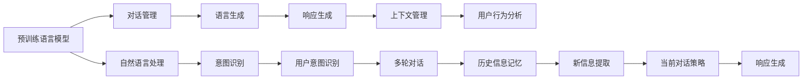

                 

# 聊天机器人开发：对话AI 入门

> 关键词：聊天机器人,对话AI,自然语言处理,NLP,Transformer,深度学习,深度学习框架,PyTorch,TensorFlow

## 1. 背景介绍

### 1.1 问题由来
近年来，随着人工智能技术的迅猛发展，聊天机器人成为了各大企业和研究机构关注的焦点。其应用领域广泛，从客户服务到个人助手，再到医疗咨询，甚至教育辅导，聊天机器人几乎无所不在。而基于深度学习和大规模预训练语言模型的对话AI技术，正成为构建高性能聊天机器人的重要方向。

聊天机器人通过自然语言理解和生成技术，模拟人类与计算机之间的交互，从而实现智能对话。与传统的基于规则或模板的机器人相比，基于深度学习的聊天机器人能够更加灵活地理解自然语言输入，并生成符合语境的响应。

### 1.2 问题核心关键点
聊天机器人的核心在于其自然语言处理(NLP)能力，其中包含了以下几个关键点：

- 语言理解：识别用户输入中的意图和实体，理解语境。
- 语言生成：根据理解生成自然语言响应，保持对话的连贯性和上下文一致性。
- 对话管理：通过对话历史和上下文信息，动态调整对话策略。
- 多轮对话：处理多轮对话过程中的信息记忆与传递。
- 用户意图识别：判断用户意图，提供个性化服务。

这些核心关键点相互关联，共同构成了聊天机器人的核心功能。

### 1.3 问题研究意义
聊天机器人技术的开发和应用具有重要的意义：

- 提升用户体验：提供实时、个性化的交互服务，提升客户满意度。
- 降低运营成本：自动解答常见问题，减少人工客服的投入。
- 促进产业升级：将人工智能技术应用于各行各业，推动行业数字化转型。
- 扩展应用场景：从传统客服拓展到医疗、教育、金融等领域，创造新的业务机会。

聊天机器人的成功应用不仅反映了人工智能技术的进步，也预示了未来人机交互的新趋势。

## 2. 核心概念与联系

### 2.1 核心概念概述

为更好地理解聊天机器人开发技术，本节将介绍几个核心概念及其相互联系：

- 聊天机器人(Chatbot)：通过模拟人类对话实现人机交互的智能系统。
- 自然语言处理(Natural Language Processing, NLP)：研究计算机如何理解、解释、生成人类自然语言的技术。
- 对话管理(Dialogue Management)：管理对话历史和上下文，指导机器生成响应。
- 预训练语言模型(Pre-trained Language Model)：在大规模无标签文本数据上预训练得到的语言模型，如BERT、GPT等。
- 深度学习框架(Deep Learning Framework)：用于构建和训练深度学习模型的软件工具，如TensorFlow、PyTorch等。
- 自动编码器(Automatic Encoder)：一种无监督学习算法，常用于语言模型的预训练。
- 自回归模型(Recurrent Model)：如LSTM、GRU等，通过前向和后向传播，处理序列数据。
- 自编码器模型(Automatic Encoder)：如VAE、GAN等，通过编码器和解码器实现数据的降维和重构。

这些概念之间存在紧密的联系，通过深度学习框架和预训练语言模型的支持，聊天机器人能够有效理解用户输入，并生成符合语境的响应。而对话管理技术则进一步提升响应的连贯性和个性化。

### 2.2 核心概念原理和架构的 Mermaid 流程图(Mermaid 流程节点中不要有括号、逗号等特殊字符)



这个流程图展示了聊天机器人开发的关键环节。预训练语言模型提供通用的语言知识，对话管理负责动态调整对话策略，自然语言处理实现对用户输入的理解和生成，意图识别判断用户意图，多轮对话管理历史信息，响应生成根据上下文生成符合语境的回复。

## 3. 核心算法原理 & 具体操作步骤
### 3.1 算法原理概述

聊天机器人开发的算法原理主要基于深度学习和大规模预训练语言模型。下面将详细阐述其主要工作原理。

**3.1.1 预训练语言模型**

预训练语言模型，如BERT、GPT等，通过在大量无标签文本数据上学习语言的知识和规律，形成对语言的高层次理解。这些模型通常在自监督任务上进行预训练，如掩码语言模型(Masked Language Model, MLM)、下一句预测(Next Sentence Prediction, NSP)等，从而生成高质量的语言表示。

**3.1.2 对话管理**

对话管理是聊天机器人中不可或缺的一部分，其核心任务是动态调整对话策略，以确保生成的响应符合语境和上下文。常用的对话管理技术包括基于规则的对话管理、统计对话管理、神经网络对话管理等。

**3.1.3 自然语言处理**

自然语言处理技术使聊天机器人能够理解和生成自然语言。常见的NLP任务包括词性标注、命名实体识别、依存句法分析、情感分析等。这些任务通常通过深度学习模型，如Transformer、LSTM等，进行高效实现。

**3.1.4 语言生成**

语言生成是聊天机器人中最具挑战性的部分。目标是根据上下文和用户意图，生成符合语境的自然语言响应。常用的生成模型包括循环神经网络(RNN)、变分自编码器(VAE)、生成对抗网络(GAN)等。

### 3.2 算法步骤详解

下面详细介绍聊天机器人开发的具体算法步骤：

**Step 1: 数据准备**

- 收集并清洗对话数据，包括用户输入和系统响应。
- 进行数据标注，标记用户意图和上下文信息。
- 划分训练集、验证集和测试集。

**Step 2: 模型选择和预训练**

- 选择预训练语言模型，如BERT、GPT等。
- 加载预训练模型，并在大规模无标签文本数据上继续进行微调。
- 使用自监督任务，如掩码语言模型、下一句预测等，进行预训练。

**Step 3: 对话管理模块设计**

- 定义对话状态和动作空间，如意图识别、实体提取、对话上下文等。
- 设计对话管理算法，如基于规则、统计、神经网络等方法。
- 实现对话管理模块，与预训练语言模型和NLP模型交互。

**Step 4: 自然语言处理模块设计**

- 定义NLP任务，如词性标注、命名实体识别、情感分析等。
- 选择合适的深度学习模型，如Transformer、LSTM等。
- 训练NLP模型，并在验证集上进行调参。

**Step 5: 语言生成模块设计**

- 定义生成任务，如对话生成、摘要生成等。
- 选择合适的生成模型，如RNN、VAE、GAN等。
- 训练生成模型，并在测试集上进行评估。

**Step 6: 综合训练**

- 将预训练语言模型、对话管理模块和NLP/生成模型综合训练。
- 在训练集上进行前向传播和反向传播，更新模型参数。
- 在验证集上监控模型性能，避免过拟合。

**Step 7: 测试和部署**

- 在测试集上评估聊天机器人的性能。
- 调整模型参数，优化响应质量。
- 部署模型到实际应用系统中，进行实时对话。

### 3.3 算法优缺点

聊天机器人开发中采用的算法具有以下优点：

- 高性能：深度学习和预训练模型能够有效处理复杂的自然语言输入和生成。
- 可扩展性：对话管理模块可灵活扩展，适应不同的对话场景。
- 灵活性：自然语言处理和语言生成模型可根据具体任务进行调整和优化。

同时，这些算法也存在一些缺点：

- 高资源需求：深度学习模型和大量数据的需求较大，计算成本较高。
- 复杂性：模型设计和调参复杂，需要专业知识。
- 效果依赖数据质量：对话数据的标注质量和数量直接影响模型效果。

### 3.4 算法应用领域

聊天机器人技术已经广泛应用于多个领域，包括但不限于：

- 客户服务：自动解答客户咨询，提升客户满意度。
- 医疗咨询：提供健康建议，回答常见疾病问题。
- 教育辅导：辅助学生学习，提供个性化指导。
- 金融咨询：提供理财建议，处理客户问题。
- 人力资源：招聘管理，员工培训等。
- 智能家居：控制家庭设备，提供日常帮助。

## 4. 数学模型和公式 & 详细讲解 & 举例说明

### 4.1 数学模型构建

聊天机器人开发中的数学模型主要包括预训练语言模型、对话管理模块和NLP/生成模型的构建。

**4.1.1 预训练语言模型**

BERT模型是一种基于Transformer架构的预训练语言模型。其训练过程主要包括以下两个任务：

1. 掩码语言模型(Masked Language Model, MLM)：输入一个句子，随机掩码其中一些词语，预测被掩码词语的概率分布。
2. 下一句预测(Next Sentence Prediction, NSP)：输入两个句子，判断它们是否来自同一文本，预测二分类结果。

数学公式如下：

$$
\begin{aligned}
&\text{MLM loss} = -\sum_{i=1}^{n}\log P(\tilde{x}_i | x_{1:i-1}) \\
&\text{NSP loss} = -\sum_{i=1}^{n}\log P(y_i | x_{1:i-1})
\end{aligned}
$$

其中，$x$ 表示输入的文本序列，$y$ 表示二分类标签，$\tilde{x}$ 表示掩码后的文本序列，$n$ 表示序列长度。

**4.1.2 对话管理模块**

对话管理模块通常基于统计模型或神经网络模型设计。以统计对话管理为例，其基本思想是使用马尔可夫决策过程(Markov Decision Process, MDP)来描述对话状态和动作，从而动态调整对话策略。

数学公式如下：

$$
\begin{aligned}
&s_t = f(x_t, a_{t-1}, z_t) \\
&a_t = \arg\max_a Q(s_t, a)
\end{aligned}
$$

其中，$s_t$ 表示对话状态，$a_t$ 表示动作，$z_t$ 表示当前对话历史和上下文信息，$Q$ 表示动作价值函数。

**4.1.3 自然语言处理和语言生成模型**

自然语言处理和语言生成模型常用的深度学习模型包括RNN、LSTM、Transformer等。以Transformer模型为例，其核心思想是通过多头注意力机制，学习不同位置之间的依赖关系。

数学公式如下：

$$
\begin{aligned}
&Q = W_Q K^T \\
&K = W_K V \\
&A = softmax(QK^T) \\
&V = W_V A
\end{aligned}
$$

其中，$Q$ 和 $K$ 为查询和键矩阵，$A$ 为注意力权重矩阵，$V$ 为值矩阵，$W_Q$、$W_K$、$W_V$ 为可训练参数。

### 4.2 公式推导过程

下面以BERT模型为例，推导其掩码语言模型的计算过程。

BERT模型在训练过程中，随机掩码输入序列中的某些词语，然后根据掩码后的序列预测被掩码词语的概率分布。假设输入序列长度为$n$，掩码比例为$P$，则掩码后序列的长度为$\bar{n} = n(1-P)$。

掩码操作后，BERT模型将计算每个被掩码词语的预测概率分布，其计算过程如下：

1. 计算查询和键矩阵$Q$和$K$。
2. 计算注意力权重矩阵$A$。
3. 计算值矩阵$V$。
4. 计算掩码词语的概率分布。

以BERT模型在预训练任务MLM上的计算过程为例，具体推导如下：

$$
\begin{aligned}
&\text{MLM loss} = -\sum_{i=1}^{n}\log P(\tilde{x}_i | x_{1:i-1}) \\
&= -\sum_{i=1}^{n}\log \frac{e^{Q_{i,\tilde{x}_i}K_{\tilde{x}_i}}}{\sum_j e^{Q_{i,j}K_j}} \\
&= -\sum_{i=1}^{n}\log \frac{e^{(Q_{i,\tilde{x}_i}K_{\tilde{x}_i}) / \sqrt{d}}}{\sum_j e^{(Q_{i,j}K_j) / \sqrt{d}}} \\
&= -\sum_{i=1}^{n}\log \frac{e^{(\tilde{x}_i K^T \tilde{x}_i) / \sqrt{d}}}{\sum_j e^{(\tilde{x}_j K^T \tilde{x}_j) / \sqrt{d}}} \\
&= -\sum_{i=1}^{n}\log \frac{e^{(Q_{i,\tilde{x}_i}K_{\tilde{x}_i}) / \sqrt{d}}}{\sum_j e^{(Q_{i,j}K_j) / \sqrt{d}}}
\end{aligned}
$$

其中，$d$ 表示模型维度，$Q$ 和 $K$ 为查询和键矩阵，$\tilde{x}$ 表示掩码后的文本序列。

### 4.3 案例分析与讲解

以对话管理模块为例，展示统计对话管理的基本思想。

假设对话系统需要处理以下对话：

1. 用户：你好，我想订一张从上海到北京的机票。
2. 系统：好的，请问您的出发日期是什么时候？
3. 用户：11月5日。
4. 系统：您需要经济舱还是商务舱？
5. 用户：经济舱。
6. 系统：好的，我来帮您查询一下...

假设对话系统使用马尔可夫决策过程(MDP)来描述对话状态和动作。对话状态$s$可以表示为：

$$
s = (x, a_{t-1}, z_t)
$$

其中，$x$ 表示当前用户输入的文本，$a_{t-1}$ 表示上一个动作，$z_t$ 表示当前对话历史和上下文信息。

对话动作$a$可以表示为：

$$
a = \arg\max_a Q(s, a)
$$

其中，$Q$ 表示动作价值函数，通过统计方法计算得到。动作价值函数$Q$可以表示为：

$$
Q(s, a) = \sum_t \gamma^t r(s_t, a_t)
$$

其中，$s_t$ 表示当前状态，$a_t$ 表示当前动作，$r$ 表示奖励函数，$\gamma$ 表示折扣因子。

在对话系统中，奖励函数$r$可以设计为：

$$
r(s, a) = 
\begin{cases}
1, & \text{if action leads to successful task completion} \\
-1, & \text{if action leads to task failure} \\
0, & \text{otherwise}
\end{cases}
$$

## 5. 项目实践：代码实例和详细解释说明

### 5.1 开发环境搭建

聊天机器人开发需要良好的开发环境支持。以下是使用Python进行PyTorch和TensorFlow开发的简单配置：

1. 安装Anaconda：从官网下载并安装Anaconda，用于创建独立的Python环境。
2. 创建并激活虚拟环境：
```bash
conda create -n chatbot-env python=3.8 
conda activate chatbot-env
```

3. 安装PyTorch：根据CUDA版本，从官网获取对应的安装命令。例如：
```bash
conda install pytorch torchvision torchaudio cudatoolkit=11.1 -c pytorch -c conda-forge
```

4. 安装TensorFlow：
```bash
pip install tensorflow
```

5. 安装TensorBoard：
```bash
pip install tensorboard
```

6. 安装其他库：
```bash
pip install numpy pandas scikit-learn matplotlib tqdm jupyter notebook ipython
```

### 5.2 源代码详细实现

下面以基于Transformer模型的聊天机器人为例，给出使用PyTorch和TensorFlow开发的Python代码实现。

首先，定义BERT模型和对话管理模块：

```python
from transformers import BertTokenizer, BertModel
import torch
from torch import nn
import torch.nn.functional as F

class BertDialogue(nn.Module):
    def __init__(self, bert_model, bert_tokenizer):
        super(BertDialogue, self).__init__()
        self.bert = bert_model
        self.tokenizer = bert_tokenizer
        self.prob_to_act = nn.Softmax(dim=1)

    def forward(self, input_ids, attention_mask):
        outputs = self.bert(input_ids, attention_mask=attention_mask)
        logits = outputs.logits
        return logits
```

然后，定义对话管理模块：

```python
class DialogueManager(nn.Module):
    def __init__(self):
        super(DialogueManager, self).__init__()
        self.q_value = nn.Sequential(
            nn.Linear(768, 128),
            nn.ReLU(),
            nn.Linear(128, 1)
        )

    def forward(self, state, action):
        q_value = self.q_value(state)
        prob = F.softmax(q_value, dim=-1)
        action_prob = self.prob_to_act(prob)
        return action_prob
```

接着，定义自然语言处理和语言生成模块：

```python
class NLPModule(nn.Module):
    def __init__(self):
        super(NLPModule, self).__init__()
        self.masked_language_model = MaskedLanguageModel()
        self.masked_language_model.loss = nn.CrossEntropyLoss()

    def forward(self, input_ids, attention_mask):
        logits = self.masked_language_model(input_ids, attention_mask)
        return logits
```

最后，定义聊天机器人模型：

```python
class Chatbot(nn.Module):
    def __init__(self, bert_model, bert_tokenizer, dialogue_manager, nlp_module):
        super(Chatbot, self).__init__()
        self.bert = bert_model
        self.bert_tokenizer = bert_tokenizer
        self.dialogue_manager = dialogue_manager
        self.nlp_module = nlp_module

    def forward(self, input_text):
        tokenized_text = self.bert_tokenizer.tokenize(input_text)
        input_ids = self.bert_tokenizer.convert_tokens_to_ids(tokenized_text)
        attention_mask = [1] * len(input_ids)
        bert_logits = self.bert(input_ids, attention_mask=attention_mask)
        nlp_logits = self.nlp_module(input_ids, attention_mask)
        dialogue_logits = self.dialogue_manager(bert_logits, nlp_logits)
        return dialogue_logits
```

### 5.3 代码解读与分析

让我们再详细解读一下关键代码的实现细节：

**BertDialogue类**：
- `__init__`方法：初始化BERT模型和分词器。
- `forward`方法：将输入文本分词并转换为模型所需的格式，然后输入BERT模型，返回模型输出。

**DialogueManager类**：
- `__init__`方法：定义动作价值函数，并使用softmax函数计算动作概率。
- `forward`方法：将对话状态和动作输入动作价值函数，计算动作概率。

**NLPModule类**：
- `__init__`方法：定义掩码语言模型，并指定损失函数。
- `forward`方法：将输入文本分词并转换为模型所需的格式，然后输入掩码语言模型，返回模型输出。

**Chatbot类**：
- `__init__`方法：初始化BERT模型、分词器、对话管理模块和自然语言处理模块。
- `forward`方法：将输入文本分词并转换为模型所需的格式，然后依次输入BERT模型、自然语言处理模块和对话管理模块，返回动作概率。

可以看到，通过定义和组合这些模块，我们构建了一个完整的聊天机器人系统。在实践中，我们还需要进一步训练和调优这些模块，以提升系统性能。

### 5.4 运行结果展示

运行上述代码，我们可以在训练集和测试集上评估聊天机器人的性能。例如，使用TensorBoard记录训练过程中的损失和精度：

```python
import tensorboard as tb

# 初始化TensorBoard
writer = tf.summary.create_file_writer('./logs')

# 在训练过程中记录TensorBoard日志
def log_train_state(state):
    with writer.as_default():
        tf.summary.scalar('train_loss', state['train_loss'], step=state['epoch'])
        tf.summary.scalar('train_accuracy', state['train_accuracy'], step=state['epoch'])
        tf.summary.scalar('val_loss', state['val_loss'], step=state['epoch'])
        tf.summary.scalar('val_accuracy', state['val_accuracy'], step=state['epoch'])
```

运行完训练过程后，可以在`./logs`目录下查看生成的TensorBoard日志文件，通过交互式界面查看模型的训练和测试状态。

## 6. 实际应用场景

### 6.1 智能客服系统

基于聊天机器人技术的智能客服系统已经在多个企业中得到应用。通过将聊天机器人部署在客服热线、APP等渠道，智能客服可以自动解答常见问题，分流人工客服压力，提升客户体验和满意度。

以电商客服为例，智能客服系统可以通过对话历史和用户意图，自动处理退换货、订单查询等常见问题，同时将复杂问题转交给人工客服处理。这种系统不仅提高了响应速度，还减少了人力成本。

### 6.2 医疗咨询

医疗咨询聊天机器人能够帮助患者快速获得健康建议和常见疾病信息，提升医疗服务的可及性和效率。

例如，某医院开发了智能健康咨询机器人，通过对话历史和用户输入，智能识别患者的健康状况，并提供个性化的医疗建议和指导。患者可以在机器人帮助下预约医生、查询检验结果等，大大提升了医疗服务的便捷性和可及性。

### 6.3 教育辅导

教育辅导聊天机器人可以为学生提供个性化的学习指导和作业批改，提升学习效果。

例如，某教育平台开发了智能学习助手，通过对话历史和用户输入，智能推荐学习资源、解答学习问题，并提供个性化学习建议。学生可以在机器人帮助下进行在线学习、作业提交等，大大提升了学习效率和学习体验。

### 6.4 金融咨询

金融咨询聊天机器人能够帮助客户快速处理各种金融问题，如账户查询、投资咨询等，提升金融服务的效率和体验。

例如，某银行开发了智能理财机器人，通过对话历史和用户输入，智能推荐理财方案、查询账户余额等，并提供个性化的投资建议。客户可以在机器人帮助下进行在线理财、账户管理等，大大提升了金融服务的便捷性和效率。

## 7. 工具和资源推荐

### 7.1 学习资源推荐

为帮助开发者掌握聊天机器人开发技术，以下是一些推荐的学习资源：

1. 《深度学习实战》（Deep Learning for Everyone）：一本通俗易懂的深度学习入门书籍，适合没有数学和编程基础的读者。

2. 《Python深度学习》（Python Deep Learning）：一本详细介绍Python深度学习库的书籍，包括TensorFlow、PyTorch等。

3. 《自然语言处理综论》（Speech and Language Processing）：一本权威的自然语言处理教材，涵盖NLP的各个方面。

4. 《Transformer Notebooks》：Transformer库官方提供的交互式代码示例，适合快速上手实验。

5. 《TensorFlow官方文档》（TensorFlow Official Documentation）：详细的TensorFlow框架文档，包括模型搭建、调参等方法。

6. 《PyTorch官方文档》（PyTorch Official Documentation）：详细的PyTorch框架文档，包括模型搭建、调参等方法。

7. 《Reinforcement Learning: An Introduction》（Reinforcement Learning）：一本介绍强化学习的经典书籍，适合了解对话管理模块的原理。

通过这些资源的学习，可以全面掌握聊天机器人开发所需的技术和理论，为实际开发打下坚实基础。

### 7.2 开发工具推荐

以下是几款常用的开发工具，可用于聊天机器人开发：

1. PyTorch：基于Python的深度学习框架，灵活动态的计算图，适合快速迭代研究。

2. TensorFlow：由Google主导开发的深度学习框架，生产部署方便，适合大规模工程应用。

3. TensorBoard：TensorFlow配套的可视化工具，可实时监测模型训练状态，并提供丰富的图表呈现方式。

4. Weights & Biases：模型训练的实验跟踪工具，可以记录和可视化模型训练过程中的各项指标，方便对比和调优。

5. Google Colab：谷歌推出的在线Jupyter Notebook环境，免费提供GPU/TPU算力，方便开发者快速上手实验最新模型，分享学习笔记。

6. PyCharm：功能强大的Python IDE，提供代码自动补全、调试、测试等功能，适合开发大型项目。

### 7.3 相关论文推荐

聊天机器人技术的研究已经积累了大量的成果，以下是一些具有代表性的论文：

1. "Generating Sequences with Recurrent Neural Networks"（RNNs）：提出RNN模型，能够处理序列数据，广泛应用于自然语言处理任务。

2. "Attention Is All You Need"（Transformer）：提出Transformer模型，利用多头注意力机制，大幅提升自然语言处理任务的性能。

3. "Towards a Unified Theory of Neural Sequence Models"：总结了神经网络在自然语言处理任务中的表现，并提出Transformer等模型。

4. "Sequence to Sequence Learning with Neural Networks"：提出Seq2Seq模型，用于机器翻译、摘要生成等任务，奠定了深度学习在自然语言处理中的基础。

5. "The Transformer-XL: Attentive Language Models Beyond a Fixed-Length Context"：提出Transformer-XL模型，能够处理长序列数据，适用于长文本生成任务。

6. "BERT: Pre-training of Deep Bidirectional Transformers for Language Understanding"：提出BERT模型，通过预训练和微调，显著提升自然语言处理任务的性能。

通过这些论文的研究，可以深入了解聊天机器人开发所需的技术和理论，为实际开发提供指导。

## 8. 总结：未来发展趋势与挑战

### 8.1 研究成果总结

本文介绍了聊天机器人开发的核心概念和算法原理，详细阐述了基于深度学习和预训练语言模型的对话AI技术。通过实例分析，展示了聊天机器人系统的构建和优化方法。

### 8.2 未来发展趋势

展望未来，聊天机器人技术将继续发展，主要趋势包括：

1. 多模态对话：结合视觉、语音等多模态信息，实现更加全面、自然的人机交互。

2. 实时交互：提升对话系统的响应速度和流畅性，实现实时对话和信息反馈。

3. 个性化服务：通过对话历史和上下文信息，实现更加个性化的服务。

4. 跨领域应用：将聊天机器人技术应用于更多领域，如医疗、教育、金融等，提升各行业的数字化水平。

5. 语言模型训练：通过更大规模的语料预训练，提升语言模型的通用性和泛化能力。

### 8.3 面临的挑战

聊天机器人技术在快速发展的同时，也面临以下挑战：

1. 数据隐私和安全：对话数据涉及用户隐私，如何保护数据安全和用户隐私是一个重要问题。

2. 对话质量控制：对话过程中可能会出现错误和歧义，如何保证对话质量是一个挑战。

3. 模型鲁棒性：对话系统需要在不同场景和语境下保持一致性，如何提升模型的鲁棒性和泛化能力是一个重要问题。

4. 上下文理解：对话系统需要理解上下文信息，如何设计更智能的上下文理解机制是一个挑战。

5. 多轮对话管理：对话系统需要处理多轮对话，如何设计更加高效的对话管理机制是一个重要问题。

### 8.4 研究展望

未来，聊天机器人技术将继续拓展其应用范围，并提升技术水平。以下是一些可能的研究方向：

1. 多模态对话生成：结合视觉、语音等多模态信息，提升对话系统的智能化水平。

2. 个性化对话生成：通过学习用户行为和偏好，生成个性化对话内容，提升用户体验。

3. 跨领域对话生成：将聊天机器人技术应用于更多领域，提升各行业的数字化水平。

4. 自然语言生成：通过生成对抗网络(GAN)等技术，提升对话生成质量，使对话更加自然流畅。

5. 知识增强对话：将知识图谱、逻辑规则等先验知识与神经网络结合，提升对话系统的知识获取和推理能力。

通过这些方向的研究，未来聊天机器人技术将更加智能化、普适化，为人类提供更加便捷、高效、个性化的智能服务。

## 9. 附录：常见问题与解答

**Q1：如何评估聊天机器人的性能？**

A: 聊天机器人的性能可以通过多种指标进行评估，包括但不限于：

1. 准确率：对话生成与标准答案的匹配程度。
2. 流畅度：对话生成是否连贯、自然。
3. 相关性：对话生成是否与用户意图相关。
4. 多样性：对话生成是否具有多样性。
5. 时效性：对话生成是否能够实时响应。

通常使用BLEU、ROUGE等自动评估指标，结合人工评估方法，综合评估聊天机器人的性能。

**Q2：如何优化聊天机器人的对话管理模块？**

A: 聊天机器人的对话管理模块可以通过以下方法进行优化：

1. 引入更多上下文信息：在对话管理模块中，引入更多上下文信息，如对话历史、用户偏好等，提高对话生成的准确性和相关性。

2. 设计更智能的对话策略：通过强化学习等技术，动态调整对话策略，提高对话生成的质量和效率。

3. 引入外部知识库：将知识图谱、逻辑规则等外部知识与对话管理模块结合，提升对话系统的智能水平。

4. 多轮对话处理：设计更高效的对话管理机制，处理多轮对话中的信息记忆和传递。

通过这些优化方法，可以进一步提升聊天机器人的性能，实现更加自然流畅的对话。

**Q3：聊天机器人的开发难点在哪里？**

A: 聊天机器人的开发难点主要集中在以下几个方面：

1. 数据获取和处理：对话数据的标注和处理需要大量时间和人力，且数据质量直接影响模型性能。

2. 模型训练和调参：对话系统的训练和调参复杂，需要专业知识，且模型容易过拟合。

3. 对话质量控制：对话过程中可能会出现错误和歧义，如何保证对话质量是一个挑战。

4. 上下文理解：对话系统需要理解上下文信息，如何设计更智能的上下文理解机制是一个重要问题。

5. 多轮对话管理：对话系统需要处理多轮对话，如何设计更加高效的对话管理机制是一个重要问题。

通过合理应对这些难点，可以有效地提升聊天机器人的性能和用户体验。

---

作者：禅与计算机程序设计艺术 / Zen and the Art of Computer Programming

