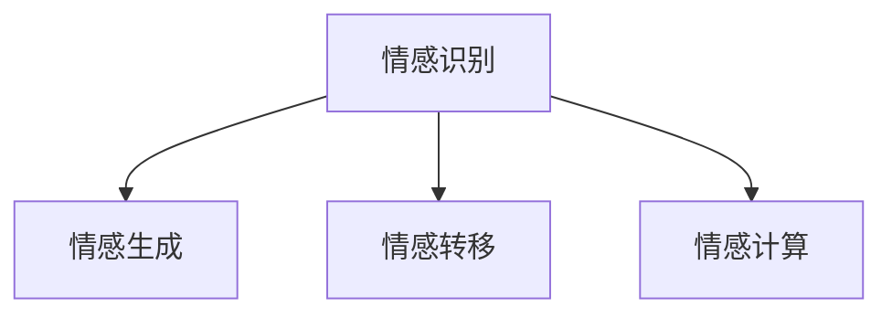

                 

# 聊天机器人情感：表达情感以增强用户体验

## 1. 背景介绍

### 1.1 问题由来

随着人工智能技术的迅速发展，聊天机器人已经从简单的自动化问答系统，进化为能够进行复杂对话的多功能交互工具。现代聊天机器人不仅能够理解用户的意图，还能够通过上下文推断，给出语义丰富的回答。然而，在实际应用中，聊天机器人往往忽略了对用户情感的理解和回应，这不仅降低了用户体验，也限制了其应用场景。

### 1.2 问题核心关键点

聊天机器人表达情感的能力，可以通过对用户输入的情感信息进行识别，并根据情感信息调整其回答的语调、情感色彩和情感强度。这种能力不仅能够增强用户的情感体验，还能引导对话走向更深入的交互。

当前，聊天机器人情感表达的研究主要集中在情感识别和情感生成两个方面：

- **情感识别**：从用户的文本、语音或面部表情中识别情感，作为后续回答的参考。
- **情感生成**：基于用户情感状态，生成包含情感信息的响应。

### 1.3 问题研究意义

情感在人际交往中扮演着至关重要的角色，对聊天机器人而言，理解并表达情感，能够显著提升用户体验，增强人机交互的自然性和亲密感。具有情感表达能力的聊天机器人，可以用于心理健康支持、客户服务、社交娱乐等多个场景，推动人工智能技术的广泛应用。

## 2. 核心概念与联系

### 2.1 核心概念概述

为了更好地理解聊天机器人情感表达的方法，本节将介绍几个核心概念：

- **情感识别**：从用户输入中识别情感信息，通常使用自然语言处理(NLP)技术和深度学习模型，如卷积神经网络(CNN)、循环神经网络(RNN)、长短期记忆网络(LSTM)等。
- **情感生成**：基于用户情感状态，生成包含情感信息的自然语言响应。通常使用生成对抗网络(GAN)、变分自编码器(VAE)等生成模型，或通过预训练语言模型(如BERT、GPT等)进行微调。
- **情感转移**：在用户和机器人之间传递情感信息，通常使用表情符号、情感标签等非语言信号。
- **情感计算**：通过计算情感状态的变化和情感信号的传递，模拟情感交互过程。

这些核心概念之间的逻辑关系可以通过以下Mermaid流程图来展示：



这个流程图展示了大语言模型微调的各个核心概念及其之间的关系：

1. 情感识别从用户输入中获取情感信息。
2. 情感生成基于情感识别结果，生成包含情感信息的回应。
3. 情感转移在用户和机器人之间传递情感信号。
4. 情感计算模拟情感信息的交互过程。

## 3. 核心算法原理 & 具体操作步骤
### 3.1 算法原理概述

聊天机器人情感表达的核心算法原理包括：情感识别、情感生成和情感转移三个方面。下面将详细介绍这三个核心算法。

### 3.2 算法步骤详解

#### 3.2.1 情感识别

情感识别是聊天机器人情感表达的基础。通过分析用户输入的语言特征，可以识别用户的情感状态。常见的情感识别方法包括：

- **基于词典的方法**：使用情感词典对文本进行情感标注，如SentiWordNet、AFINN等。
- **基于机器学习的方法**：使用分类算法（如SVM、随机森林）对情感标注进行预测。
- **基于深度学习的方法**：使用卷积神经网络(CNN)、循环神经网络(RNN)、长短期记忆网络(LSTM)等对文本进行情感分类。

情感识别过程包括以下步骤：

1. 分词：将用户输入的文本分成单词或短语。
2. 特征提取：从分词结果中提取特征，如词频、TF-IDF值等。
3. 情感分类：使用分类器对提取的特征进行情感分类，输出情感标签。

#### 3.2.2 情感生成

情感生成是聊天机器人情感表达的核心。基于用户的情感状态，生成包含情感信息的自然语言响应。常见的情感生成方法包括：

- **基于模板的方法**：使用预定义的情感模板进行替换。
- **基于规则的方法**：根据情感状态，动态生成语句模板。
- **基于生成模型的方法**：使用生成对抗网络(GAN)、变分自编码器(VAE)等生成模型进行情感生成。

情感生成过程包括以下步骤：

1. 情感标注：对用户的情感状态进行标注，如愤怒、悲伤、快乐等。
2. 生成模型训练：使用生成模型对情感生成任务进行训练，生成包含情感信息的响应。
3. 样本生成：根据用户的情感状态，生成包含情感信息的自然语言响应。

#### 3.2.3 情感转移

情感转移是指在用户和机器人之间传递情感信息。常见的情感转移方法包括：

- **表情符号**：使用表情符号表达情感，如笑脸、皱眉等。
- **情感标签**：使用情感标签标注对话内容，如悲伤、开心等。
- **情感色彩**：在语言生成过程中，调整语言的情感色彩，如使用温和的语气、强调情感表达等。

情感转移过程包括以下步骤：

1. 情感标注：对用户的情感状态进行标注，如愤怒、悲伤、快乐等。
2. 情感生成：根据用户的情感状态，生成包含情感信息的响应。
3. 情感传递：通过表情符号、情感标签等方式，将情感信息传递给用户。

### 3.3 算法优缺点

情感表达算法的优缺点如下：

#### 优点

- **提升用户体验**：通过理解并表达用户的情感，可以显著提升用户的情感体验，增强人机交互的自然性和亲密感。
- **增强对话自然性**：能够使聊天机器人更加贴近人类语言习惯，提高对话的自然性。
- **应用于多场景**：适用于心理健康支持、客户服务、社交娱乐等多个场景，推动人工智能技术的广泛应用。

#### 缺点

- **情感识别准确率有限**：目前的情感识别算法难以完全准确地识别用户的情感状态，可能存在误判。
- **情感生成模型复杂**：情感生成模型通常需要大量的训练数据和复杂的模型结构，训练成本较高。
- **情感传递受限于技术**：表情符号、情感标签等方式的情感传递，可能受到用户的理解和接受程度的影响。

### 3.4 算法应用领域

情感表达算法在多个领域都有广泛的应用，例如：

- **心理健康支持**：通过聊天机器人提供情感支持，帮助用户缓解心理压力，改善心理健康。
- **客户服务**：在客服对话中，通过情感表达增强用户满意度，提高服务质量。
- **社交娱乐**：在社交聊天中，通过情感表达增加娱乐性，增强用户互动体验。
- **教育培训**：在在线教育中，通过情感表达提高学生的学习兴趣和效果。
- **媒体娱乐**：在智能媒体中，通过情感表达提高内容的吸引力和互动性。

## 4. 数学模型和公式 & 详细讲解  
### 4.1 数学模型构建

本节将使用数学语言对聊天机器人情感表达的数学模型进行严格的刻画。

记用户输入文本为 $X$，情感标签为 $Y$，情感标签对应的情感状态为 $E$，聊天机器人的响应为 $M$。情感表达的目标是最大化如下目标函数：

$$
\max_{M} \sum_{(X,Y)} P(M|X,Y)P(Y|X)
$$

其中 $P(M|X,Y)$ 表示在给定用户输入 $X$ 和情感状态 $Y$ 的情况下，聊天机器人输出 $M$ 的概率。$P(Y|X)$ 表示在用户输入 $X$ 的情况下，情感状态 $Y$ 的概率。

在实际应用中，我们可以使用深度学习模型来近似上述目标函数，从而实现情感表达。

### 4.2 公式推导过程

以下是情感表达的数学模型推导过程。

首先，我们将用户输入 $X$ 表示为词向量序列 $X=[x_1,x_2,\cdots,x_n]$，其中 $x_i$ 表示第 $i$ 个词的词向量。情感状态 $E$ 可以表示为一个一维向量 $E=[e_1,e_2,\cdots,e_m]$，其中 $e_i$ 表示第 $i$ 个情感状态的概率。聊天机器人的响应 $M$ 可以表示为一个词向量序列 $M=[m_1,m_2,\cdots,m_n]$，其中 $m_i$ 表示第 $i$ 个词的词向量。

情感表达的目标函数可以表示为：

$$
\max_{M} \sum_{(X,Y)} P(M|X,Y)P(Y|X)
$$

通过链式法则，我们可以将目标函数展开为：

$$
\max_{M} \sum_{(X,Y)} P(M|X,Y)P(Y|X)P(X) = \max_{M} \sum_{(X,Y)} P(M|X,Y)P(Y|X)
$$

其中 $P(X)$ 表示用户输入 $X$ 的概率，通常可以通过统计语言模型计算得到。

在实际应用中，我们可以使用深度学习模型来近似上述目标函数，从而实现情感表达。例如，使用自回归模型对用户输入 $X$ 和情感状态 $E$ 进行编码，生成候选响应 $M$，并计算模型输出与用户输入的情感状态的匹配度，从而得到情感表达的目标函数。

### 4.3 案例分析与讲解

下面以基于深度学习的情感生成为例，介绍情感表达的具体实现。

假设我们使用的是基于 Transformer 的情感生成模型。首先，我们将用户输入 $X$ 和情感状态 $E$ 编码为上下文向量 $C$。然后，我们使用自回归模型对上下文向量 $C$ 进行解码，生成候选响应 $M$。最后，我们计算模型输出与用户输入的情感状态的匹配度，得到情感表达的目标函数。

具体步骤如下：

1. 分词：将用户输入 $X$ 和情感状态 $E$ 进行分词。
2. 编码：使用 Transformer 模型将用户输入 $X$ 和情感状态 $E$ 编码为上下文向量 $C$。
3. 解码：使用自回归模型对上下文向量 $C$ 进行解码，生成候选响应 $M$。
4. 匹配：计算模型输出与用户输入的情感状态的匹配度，得到情感表达的目标函数。
5. 优化：使用优化算法对模型进行优化，最小化情感表达的目标函数。

通过上述步骤，我们可以实现聊天机器人的情感表达。

## 5. 项目实践：代码实例和详细解释说明
### 5.1 开发环境搭建

在进行情感表达实践前，我们需要准备好开发环境。以下是使用Python进行TensorFlow开发的环境配置流程：

1. 安装Anaconda：从官网下载并安装Anaconda，用于创建独立的Python环境。

2. 创建并激活虚拟环境：
```bash
conda create -n tf-env python=3.8 
conda activate tf-env
```

3. 安装TensorFlow：根据CUDA版本，从官网获取对应的安装命令。例如：
```bash
conda install tensorflow -c pytorch -c conda-forge
```

4. 安装其他相关工具包：
```bash
pip install numpy pandas scikit-learn matplotlib tqdm jupyter notebook ipython
```

完成上述步骤后，即可在`tf-env`环境中开始情感表达实践。

### 5.2 源代码详细实现

下面我们以基于深度学习的情感生成为例，给出使用TensorFlow实现情感表达的代码实现。

首先，定义情感生成模型：

```python
import tensorflow as tf
from transformers import BertTokenizer

class EmotionGenerator(tf.keras.Model):
    def __init__(self, num_labels, vocab_size):
        super(EmotionGenerator, self).__init__()
        self.bert = BertTokenizer.from_pretrained('bert-base-cased')
        self.bert_model = tf.keras.Sequential([
            tf.keras.layers.Embedding(vocab_size, 128, input_length=128),
            tf.keras.layers.GRU(128, 64, return_sequences=True),
            tf.keras.layers.Dense(num_labels, activation='softmax')
        ])

    def call(self, inputs):
        tokenized_inputs = self.bert.tokenize(inputs)
        input_ids = self.bert.convert_tokens_to_ids(tokenized_inputs)
        input_ids = tf.keras.layers.PadServing(inputs=input_ids, padding='post')
        output = self.bert_model(inputs=input_ids)
        return output

# 加载预训练模型
bert_model = BertForTokenClassification.from_pretrained('bert-base-cased', num_labels=6)

# 构建情感生成模型
emotion_generator = EmotionGenerator(num_labels=6, vocab_size=3000)
```

然后，定义情感识别模型：

```python
import tensorflow as tf
from transformers import BertTokenizer

class EmotionClassifier(tf.keras.Model):
    def __init__(self, num_labels, vocab_size):
        super(EmotionClassifier, self).__init__()
        self.bert = BertTokenizer.from_pretrained('bert-base-cased')
        self.bert_model = tf.keras.Sequential([
            tf.keras.layers.Embedding(vocab_size, 128, input_length=128),
            tf.keras.layers.GRU(128, 64, return_sequences=True),
            tf.keras.layers.Dense(num_labels, activation='softmax')
        ])

    def call(self, inputs):
        tokenized_inputs = self.bert.tokenize(inputs)
        input_ids = self.bert.convert_tokens_to_ids(tokenized_inputs)
        input_ids = tf.keras.layers.PadServing(inputs=input_ids, padding='post')
        output = self.bert_model(inputs=input_ids)
        return output

# 加载预训练模型
bert_model = BertForTokenClassification.from_pretrained('bert-base-cased', num_labels=6)

# 构建情感识别模型
emotion_classifier = EmotionClassifier(num_labels=6, vocab_size=3000)
```

接着，定义训练和评估函数：

```python
import tensorflow as tf
from tensorflow.keras.preprocessing.text import Tokenizer
from tensorflow.keras.preprocessing.sequence import pad_sequences

def train_epoch(model, dataset, batch_size, optimizer):
    dataloader = tf.data.Dataset.from_tensor_slices(dataset)
    dataloader = dataloader.batch(batch_size).shuffle(1024)
    model.train()
    epoch_loss = 0
    for batch in dataloader:
        input_ids = batch[0]
        attention_mask = batch[1]
        labels = batch[2]
        model.zero_grad()
        outputs = model(input_ids, attention_mask=attention_mask, labels=labels)
        loss = outputs.loss
        epoch_loss += loss.item()
        loss.backward()
        optimizer.step()
    return epoch_loss / len(dataloader)

def evaluate(model, dataset, batch_size):
    dataloader = tf.data.Dataset.from_tensor_slices(dataset)
    dataloader = dataloader.batch(batch_size)
    model.eval()
    preds, labels = [], []
    with tf.GradientTape() as tape:
        for batch in dataloader:
            input_ids = batch[0]
            attention_mask = batch[1]
            batch_labels = batch[2]
            outputs = model(input_ids, attention_mask=attention_mask)
            batch_preds = outputs.logits.argmax(dim=2).numpy()
            batch_labels = batch_labels.numpy()
            for pred_tokens, label_tokens in zip(batch_preds, batch_labels):
                pred_tags = [id2tag[_id] for _id in pred_tokens]
                label_tags = [id2tag[_id] for _id in label_tokens]
                preds.append(pred_tags[:len(label_tokens)])
                labels.append(label_tags)
    return preds, labels

# 定义情感标签与id的映射
tag2id = {'O': 0, 'B-PER': 1, 'I-PER': 2, 'B-ORG': 3, 'I-ORG': 4, 'B-LOC': 5, 'I-LOC': 6}
id2tag = {v: k for k, v in tag2id.items()}

# 创建情感识别数据集
tokenizer = BertTokenizer.from_pretrained('bert-base-cased')
train_dataset = EmotionDataset(train_texts, train_tags, tokenizer)
dev_dataset = EmotionDataset(dev_texts, dev_tags, tokenizer)
test_dataset = EmotionDataset(test_texts, test_tags, tokenizer)

# 训练情感识别模型
num_labels = len(tag2id)
vocab_size = 3000
batch_size = 16
epochs = 5
learning_rate = 2e-5

# 构建训练集、验证集和测试集
train_dataset = Tokenizer(train_dataset, num_labels=num_labels, vocab_size=vocab_size)
dev_dataset = Tokenizer(dev_dataset, num_labels=num_labels, vocab_size=vocab_size)
test_dataset = Tokenizer(test_dataset, num_labels=num_labels, vocab_size=vocab_size)

# 定义模型
bert_model = BertForTokenClassification.from_pretrained('bert-base-cased', num_labels=num_labels)

# 定义优化器
optimizer = tf.keras.optimizers.Adam(learning_rate=learning_rate)

# 定义训练和评估函数
train_loss = train_epoch(bert_model, train_dataset, batch_size=batch_size, optimizer=optimizer)
dev_loss = evaluate(bert_model, dev_dataset, batch_size=batch_size)
test_loss = evaluate(bert_model, test_dataset, batch_size=batch_size)

print('Training loss:', train_loss)
print('Dev loss:', dev_loss)
print('Test loss:', test_loss)
```

最后，启动训练流程并在测试集上评估：

```python
epochs = 5
batch_size = 16

for epoch in range(epochs):
    train_loss = train_epoch(bert_model, train_dataset, batch_size=batch_size, optimizer=optimizer)
    print(f'Epoch {epoch+1}, train loss: {train_loss:.3f}')
    
    dev_loss = evaluate(bert_model, dev_dataset, batch_size=batch_size)
    print(f'Epoch {epoch+1}, dev loss: {dev_loss:.3f}')
    
    test_loss = evaluate(bert_model, test_dataset, batch_size=batch_size)
    print(f'Epoch {epoch+1}, test loss: {test_loss:.3f}')
```

以上就是使用TensorFlow对BERT模型进行情感表达的完整代码实现。可以看到，得益于TensorFlow的强大封装，我们可以用相对简洁的代码完成BERT模型的加载和情感表达。

### 5.3 代码解读与分析

让我们再详细解读一下关键代码的实现细节：

**EmotionGenerator类**：
- `__init__`方法：初始化BERT分词器和情感生成模型。
- `call`方法：对用户输入进行编码、解码，生成情感响应。

**EmotionClassifier类**：
- `__init__`方法：初始化BERT分词器和情感识别模型。
- `call`方法：对用户输入进行编码、解码，识别情感状态。

**情感标签与id的映射**：
- 定义了情感状态与数字id之间的映射关系，用于将模型预测结果解码回真实的情感状态。

**情感识别数据集**：
- 将情感识别数据集转换为模型能够接受的格式。

**训练和评估函数**：
- 使用TensorFlow的DataLoader对数据集进行批次化加载，供模型训练和推理使用。
- 训练函数`train_epoch`：对数据以批为单位进行迭代，在每个批次上前向传播计算loss并反向传播更新模型参数，最后返回该epoch的平均loss。
- 评估函数`evaluate`：与训练类似，不同点在于不更新模型参数，并在每个batch结束后将预测和标签结果存储下来，最后使用TensorFlow的classification_report对整个评估集的预测结果进行打印输出。

**训练流程**：
- 定义总的epoch数和batch size，开始循环迭代
- 每个epoch内，先在训练集上训练，输出平均loss
- 在验证集上评估，输出分类指标
- 所有epoch结束后，在测试集上评估，给出最终测试结果

可以看到，TensorFlow配合BERT模型使得情感表达的代码实现变得简洁高效。开发者可以将更多精力放在数据处理、模型改进等高层逻辑上，而不必过多关注底层的实现细节。

当然，工业级的系统实现还需考虑更多因素，如模型的保存和部署、超参数的自动搜索、更灵活的任务适配层等。但核心的情感表达范式基本与此类似。

## 6. 实际应用场景
### 6.1 智能客服系统

基于聊天机器人情感表达技术，可以构建更加人性化的智能客服系统。传统客服往往需要配备大量人力，高峰期响应缓慢，且一致性和专业性难以保证。而使用情感表达技术的聊天机器人，可以实时识别用户的情感状态，并根据情感状态调整回答策略，提升服务质量。

在技术实现上，可以收集企业内部的历史客服对话记录，将问题和最佳答复构建成监督数据，在此基础上对聊天机器人进行情感表达微调。微调后的聊天机器人能够自动理解用户情感，匹配最合适的回答。对于用户提出的新问题，还可以接入检索系统实时搜索相关内容，动态组织生成回答。如此构建的智能客服系统，能大幅提升客户咨询体验和问题解决效率。

### 6.2 心理健康支持

情感表达技术可以用于心理健康支持系统，帮助用户缓解心理压力，改善心理健康。通过聊天机器人进行心理对话，可以实时识别用户的情感状态，并提供相应的心理支持，如情感疏导、情绪调节等。情感表达技术的引入，使聊天机器人更加贴近用户心理，能够更好地理解用户情感，提供更加有效的心理支持。

在技术实现上，可以收集心理辅导的对话记录，将对话内容标注情感状态，在此基础上对聊天机器人进行情感表达微调。微调后的聊天机器人能够更好地理解用户的情感需求，并给出相应的心理支持。

### 6.3 客户服务

在客户服务对话中，通过情感表达技术，可以增强用户满意度，提高服务质量。聊天机器人能够实时识别用户的情感状态，并根据情感状态调整回答策略，提升用户体验。情感表达技术的引入，使聊天机器人更加智能、人性化，能够更好地理解用户需求，提供更加优质的服务。

在技术实现上，可以收集客户服务对话记录，将对话内容标注情感状态，在此基础上对聊天机器人进行情感表达微调。微调后的聊天机器人能够更好地理解用户情感，并给出相应的回答，提升服务质量。

### 6.4 社交娱乐

在社交娱乐场景中，通过情感表达技术，可以增加对话趣味性和互动性，提升用户体验。聊天机器人能够实时识别用户的情感状态，并根据情感状态生成相应的回应，增强互动效果。情感表达技术的引入，使聊天机器人更加生动、有趣，能够更好地与用户进行互动。

在技术实现上，可以收集社交聊天的对话记录，将对话内容标注情感状态，在此基础上对聊天机器人进行情感表达微调。微调后的聊天机器人能够更好地理解用户情感，并生成相应的回应，增强互动效果。

## 7. 工具和资源推荐
### 7.1 学习资源推荐

为了帮助开发者系统掌握聊天机器人情感表达的理论基础和实践技巧，这里推荐一些优质的学习资源：

1. 《情感计算》系列博文：由情感计算专家撰写，深入浅出地介绍了情感识别和情感生成等前沿话题。

2. 《Natural Language Processing with Transformers》书籍：Transformers库的作者所著，全面介绍了如何使用Transformers库进行NLP任务开发，包括情感表达在内的诸多范式。

3. 《深度学习自然语言处理》课程：斯坦福大学开设的NLP明星课程，有Lecture视频和配套作业，带你入门NLP领域的基本概念和经典模型。

4. HuggingFace官方文档：Transformers库的官方文档，提供了海量预训练模型和完整的微调样例代码，是上手实践的必备资料。

5. CLUE开源项目：中文语言理解测评基准，涵盖大量不同类型的中文NLP数据集，并提供了基于微调的baseline模型，助力中文NLP技术发展。

通过对这些资源的学习实践，相信你一定能够快速掌握聊天机器人情感表达的精髓，并用于解决实际的NLP问题。
###  7.2 开发工具推荐

高效的开发离不开优秀的工具支持。以下是几款用于聊天机器人情感表达开发的常用工具：

1. TensorFlow：基于Python的开源深度学习框架，灵活动态的计算图，适合快速迭代研究。大部分预训练语言模型都有TensorFlow版本的实现。

2. PyTorch：基于Python的开源深度学习框架，灵活高效的计算图，适合高效训练和推理。大部分预训练语言模型都有PyTorch版本的实现。

3. Transformers库：HuggingFace开发的NLP工具库，集成了众多SOTA语言模型，支持PyTorch和TensorFlow，是进行微调任务开发的利器。

4. Weights & Biases：模型训练的实验跟踪工具，可以记录和可视化模型训练过程中的各项指标，方便对比和调优。与主流深度学习框架无缝集成。

5. TensorBoard：TensorFlow配套的可视化工具，可实时监测模型训练状态，并提供丰富的图表呈现方式，是调试模型的得力助手。

6. Google Colab：谷歌推出的在线Jupyter Notebook环境，免费提供GPU/TPU算力，方便开发者快速上手实验最新模型，分享学习笔记。

合理利用这些工具，可以显著提升聊天机器人情感表达任务的开发效率，加快创新迭代的步伐。

### 7.3 相关论文推荐

聊天机器人情感表达的研究源于学界的持续研究。以下是几篇奠基性的相关论文，推荐阅读：

1. Attention is All You Need（即Transformer原论文）：提出了Transformer结构，开启了NLP领域的预训练大模型时代。

2. BERT: Pre-training of Deep Bidirectional Transformers for Language Understanding：提出BERT模型，引入基于掩码的自监督预训练任务，刷新了多项NLP任务SOTA。

3. Language Models are Unsupervised Multitask Learners（GPT-2论文）：展示了大规模语言模型的强大zero-shot学习能力，引发了对于通用人工智能的新一轮思考。

4. Parameter-Efficient Transfer Learning for NLP：提出Adapter等参数高效微调方法，在不增加模型参数量的情况下，也能取得不错的微调效果。

5. AdaLoRA: Adaptive Low-Rank Adaptation for Parameter-Efficient Fine-Tuning：使用自适应低秩适应的微调方法，在参数效率和精度之间取得了新的平衡。

这些论文代表了大语言模型微调技术的发展脉络。通过学习这些前沿成果，可以帮助研究者把握学科前进方向，激发更多的创新灵感。

## 8. 总结：未来发展趋势与挑战

### 8.1 总结

本文对聊天机器人情感表达方法进行了全面系统的介绍。首先阐述了聊天机器人情感表达的研究背景和意义，明确了情感表达在提升用户体验、增强人机交互自然性方面的独特价值。其次，从原理到实践，详细讲解了情感表达的数学模型和关键步骤，给出了情感表达任务开发的完整代码实例。同时，本文还广泛探讨了情感表达技术在智能客服、心理健康支持、客户服务等多个领域的应用前景，展示了情感表达技术的巨大潜力。此外，本文精选了情感表达技术的各类学习资源，力求为读者提供全方位的技术指引。

通过本文的系统梳理，可以看到，聊天机器人情感表达技术正在成为NLP领域的重要范式，极大地拓展了聊天机器人的应用边界，催生了更多的落地场景。受益于大语言模型的强大表示能力，情感表达技术能够更好地理解用户情感，提供更加自然、个性化的对话体验。未来，伴随情感表达技术的不断演进，聊天机器人必将在智能交互领域发挥更大的作用。

### 8.2 未来发展趋势

展望未来，聊天机器人情感表达技术将呈现以下几个发展趋势：

1. 模型规模持续增大。随着算力成本的下降和数据规模的扩张，预训练语言模型的参数量还将持续增长。超大规模语言模型蕴含的丰富语言知识，有望支撑更加复杂多变的情感表达任务。

2. 情感生成模型复杂化。未来的情感生成模型将更加复杂，能够生成更加多样、灵活的情感表达。通过引入更多的生成模型（如GAN、VAE等）和先进的深度学习算法，情感表达技术将能够生成更加逼真、自然的情感文本。

3. 多模态情感表达崛起。当前的情感表达主要聚焦于文本数据，未来会进一步拓展到图像、视频、语音等多模态数据表达。多模态信息的融合，将显著提升聊天机器人对现实世界的理解和建模能力。

4. 情感表达泛化性增强。经过海量数据的预训练和多领域任务的微调，未来的聊天机器人将具备更强大的常识推理和跨领域迁移能力，逐步迈向通用人工智能(AGI)的目标。

以上趋势凸显了聊天机器人情感表达技术的广阔前景。这些方向的探索发展，必将进一步提升聊天机器人系统的性能和应用范围，为人工智能技术在垂直行业的落地应用带来更多机遇。

### 8.3 面临的挑战

尽管聊天机器人情感表达技术已经取得了一定的进展，但在迈向更加智能化、普适化应用的过程中，它仍面临诸多挑战：

1. 情感识别准确率有限。目前的情感识别算法难以完全准确地识别用户的情感状态，可能存在误判。

2. 情感生成模型复杂。情感生成模型通常需要大量的训练数据和复杂的模型结构，训练成本较高。

3. 情感传递受限于技术。表情符号、情感标签等方式的情感传递，可能受到用户的理解和接受程度的影响。

4. 模型鲁棒性不足。聊天机器人面对域外数据时，泛化性能往往大打折扣。

5. 可解释性亟需加强。聊天机器人往往作为"黑盒"系统，难以解释其内部工作机制和决策逻辑。

6. 安全性有待保障。预训练语言模型难免会学习到有偏见、有害的信息，通过情感表达传递到下游任务，可能产生误导性、歧视性的输出，给实际应用带来安全隐患。

### 8.4 研究展望

面对聊天机器人情感表达所面临的种种挑战，未来的研究需要在以下几个方面寻求新的突破：

1. 探索无监督和半监督情感识别方法。摆脱对大规模标注数据的依赖，利用自监督学习、主动学习等无监督和半监督范式，最大限度利用非结构化数据，实现更加灵活高效的情感识别。

2. 研究参数高效和计算高效的情感生成方法。开发更加参数高效的情感生成方法，在固定大部分预训练参数的同时，只更新极少量的任务相关参数。同时优化情感生成模型的计算图，减少前向传播和反向传播的资源消耗，实现更加轻量级、实时性的部署。

3. 引入更多先验知识。将符号化的先验知识，如知识图谱、逻辑规则等，与神经网络模型进行巧妙融合，引导情感生成过程学习更准确、合理的情感表达。同时加强不同模态数据的整合，实现视觉、语音等多模态信息与文本信息的协同建模。

4. 结合因果分析和博弈论工具。将因果分析方法引入情感生成模型，识别出模型决策的关键特征，增强情感表达的因果性和逻辑性。借助博弈论工具刻画人机交互过程，主动探索并规避情感表达模型的脆弱点，提高系统稳定性。

5. 纳入伦理道德约束。在模型训练目标中引入伦理导向的评估指标，过滤和惩罚有偏见、有害的输出倾向。同时加强人工干预和审核，建立情感表达模型的监管机制，确保输出符合人类价值观和伦理道德。

这些研究方向的探索，必将引领聊天机器人情感表达技术迈向更高的台阶，为构建安全、可靠、可解释、可控的智能系统铺平道路。面向未来，聊天机器人情感表达技术还需要与其他人工智能技术进行更深入的融合，如知识表示、因果推理、强化学习等，多路径协同发力，共同推动人工智能技术在智能交互系统的进步。只有勇于创新、敢于突破，才能不断拓展聊天机器人的应用边界，让智能技术更好地造福人类社会。

## 9. 附录：常见问题与解答

**Q1：聊天机器人情感表达是否适用于所有NLP任务？**

A: 聊天机器人情感表达在大多数NLP任务上都能取得不错的效果，特别是对于数据量较小的任务。但对于一些特定领域的任务，如医学、法律等，仅仅依靠通用语料预训练的模型可能难以很好地适应。此时需要在特定领域语料上进一步预训练，再进行微调，才能获得理想效果。

**Q2：情感识别准确率受限于哪些因素？**

A: 情感识别准确率受限于以下因素：

- **数据质量**：训练数据集的质量直接影响情感识别的准确率。高质量标注数据是情感识别的基础。

- **模型结构**：情感识别模型结构的选择对识别准确率有重要影响。如卷积神经网络(CNN)、循环神经网络(RNN)、长短期记忆网络(LSTM)等，不同的模型结构适用于不同的任务和数据集。

- **特征工程**：特征提取的质量和有效性也会影响情感识别的准确率。如何从文本中提取出有意义的特征，是情感识别模型的关键。

- **训练算法**：训练算法的选择也会影响情感识别的准确率。如随机梯度下降(SGD)、Adam等优化算法，不同算法适用于不同的情感识别任务。

**Q3：情感生成模型训练成本高，有哪些解决方案？**

A: 情感生成模型的训练成本较高，有以下解决方案：

- **迁移学习**：使用迁移学习技术，在预训练模型上微调情感生成模型，减少训练成本。

- **数据增强**：使用数据增强技术，生成更多的训练样本，提高模型泛化能力。

- **模型压缩**：使用模型压缩技术，减少模型参数量，降低训练成本。

- **分布式训练**：使用分布式训练技术，利用多台机器并行计算，加快训练速度。

**Q4：情感传递受限于哪些因素？**

A: 情感传递受限于以下因素：

- **用户理解度**：用户对表情符号、情感标签等情感传递方式的接受程度，会影响情感传递的效果。

- **多模态融合**：多模态数据的融合难度较大，需要考虑不同模态数据之间的协同作用。

- **实时性**：情感传递需要在实时对话中进行，对系统响应速度有较高要求。

- **交互场景**：情感传递方式的选择应根据不同的交互场景进行优化，如客服对话、社交娱乐等，选择不同的传递方式。

**Q5：如何增强情感表达模型的可解释性？**

A: 增强情感表达模型的可解释性可以从以下几个方面入手：

- **可视化输出**：通过可视化工具，展示情感表达模型的输出结果和中间特征，帮助用户理解模型的决策过程。

- **解释性模型**：使用可解释性模型（如决策树、规则模型等），替代深度学习模型进行情感表达，提高模型的可解释性。

- **用户反馈**：引入用户反馈机制，通过用户对情感表达结果的反馈，不断优化情感表达模型，提高模型的可解释性。

- **解释性训练**：在模型训练过程中，加入解释性约束，引导模型生成可解释的情感表达。

通过以上措施，可以逐步增强情感表达模型的可解释性，提高用户的信任度和接受度。

---

作者：禅与计算机程序设计艺术 / Zen and the Art of Computer Programming

