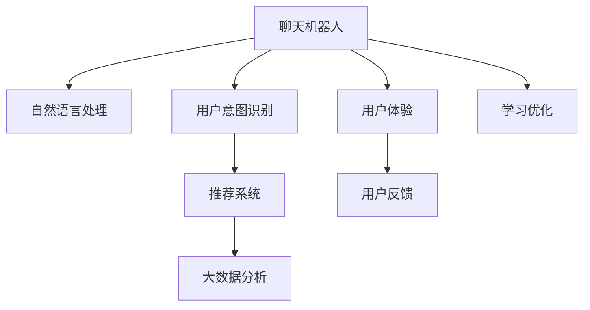

                 

# 聊天机器人旅游业：个性化旅行计划和建议

> 关键词：
1. 个性化旅行计划
2. 聊天机器人
3. 自然语言处理
4. 用户意图识别
5. 推荐系统
6. 大数据分析
7. 用户体验

## 1. 背景介绍

随着旅游业的蓬勃发展，个性化服务逐渐成为旅游业竞争的核心要素。传统的旅游推荐系统已经无法满足用户对定制化、个性化旅行的需求。利用人工智能技术，特别是聊天机器人和自然语言处理技术，可以为旅客提供个性化的旅行计划和建议，极大提升用户体验和旅游满意度。

### 1.1 问题由来

在传统的旅游推荐系统中，游客只能通过预先设定的筛选条件选择目的地，推荐的旅游景点相对固定，无法完全满足用户的个性化需求。随着数据采集和处理能力的提升，基于人工智能的个性化推荐系统应运而生，能够根据用户的历史行为、兴趣和偏好，动态生成个性化的旅行计划和建议。聊天机器人技术的引入，使得这种推荐系统具备了更强的交互性和实时性，可以在对话过程中不断学习和优化，提供更贴合用户需求的个性化服务。

## 2. 核心概念与联系

### 2.1 核心概念概述

为深入理解聊天机器人旅游业个性化旅行计划和建议的实现，本节将介绍几个关键概念：

- 聊天机器人(Chatbot)：以自然语言处理为基础，通过模拟人类对话实现人机交互的技术。应用场景广泛，涉及客服、导购、娱乐等多个领域。
- 自然语言处理(Natural Language Processing, NLP)：研究计算机如何理解、生成和处理自然语言的技术。包括语言模型、文本分类、实体识别、情感分析、对话系统等子领域。
- 用户意图识别：通过分析用户的输入文本，自动识别用户所表达的需求或意图。是聊天机器人中实现个性化服务的关键技术之一。
- 推荐系统：基于用户历史行为、兴趣等数据，为用户提供个性化商品或服务推荐的技术。
- 大数据分析：利用先进的数据挖掘和分析技术，对海量数据进行处理和分析，挖掘出潜在规律和趋势。
- 用户体验(UX)：衡量用户与系统交互时的满意度和使用体验。是衡量聊天机器人旅游业效果的重要指标。

这些核心概念之间的逻辑关系可以通过以下Mermaid流程图来展示：



这个流程图展示了聊天机器人旅游业的实现流程：

1. 用户通过与聊天机器人进行对话，输入自己的旅行需求。
2. 聊天机器人利用自然语言处理技术，识别用户意图。
3. 根据用户意图，推荐系统提供个性化的目的地、路线和活动建议。
4. 聊天机器人对用户反馈进行收集和分析，不断优化推荐算法。
5. 最终提供的旅行计划和建议，影响用户的旅行体验和满意度。

## 3. 核心算法原理 & 具体操作步骤

### 3.1 算法原理概述

聊天机器人旅游业个性化旅行计划和建议的核心算法主要包括以下几个步骤：

1. 通过自然语言处理技术，分析用户输入的文本，识别其旅行意图。
2. 根据识别到的意图，调用推荐系统生成个性化的旅行建议。
3. 与用户进行互动，根据用户的反馈不断调整和优化推荐。

整个流程主要依赖于自然语言处理和推荐系统的技术支持。

### 3.2 算法步骤详解

以下是聊天机器人旅游业个性化旅行计划和建议的详细算法步骤：

#### 步骤 1：自然语言处理

自然语言处理是实现聊天机器人旅游业的基础。通常通过分词、词性标注、命名实体识别、情感分析等步骤，实现对用户输入文本的理解。

##### 步骤 1.1 分词
分词是将连续的文本序列分割成单独的词的过程。通常使用预训练的语言模型（如BERT、GPT等）对用户输入文本进行分词。

```python
import jieba
from transformers import BertTokenizer

text = "我想去海滩度假"
tokenizer = BertTokenizer.from_pretrained('bert-base-cased')
tokens = tokenizer(text)
```

##### 步骤 1.2 词性标注
词性标注是指为每个词标注其词性，如名词、动词、形容词等。使用自然语言处理库NLTK或spaCy可以实现。

```python
from nltk import pos_tag
from nltk.tokenize import word_tokenize

words = word_tokenize(text)
tagged_words = pos_tag(words)
```

##### 步骤 1.3 命名实体识别
命名实体识别是指识别文本中的组织、地点、人名等实体。可以使用预训练模型，如DistilBERT或RoBERTa进行命名实体识别。

```python
from transformers import pipeline

ner_pipeline = pipeline('ner')
ner_tags = ner_pipeline(text)
```

##### 步骤 1.4 情感分析
情感分析是指分析文本中的情感倾向，通常使用预训练的情感分析模型。

```python
from transformers import pipeline

sentiment_pipeline = pipeline('sentiment-analysis')
sentiment_result = sentiment_pipeline(text)
```

#### 步骤 2：用户意图识别

用户意图识别是实现个性化旅行计划和建议的关键。通过将用户输入文本转化为意图标签，聊天机器人可以更准确地理解用户的需求。

##### 步骤 2.1 意图分类
通常使用多标签分类模型，如BiLSTM-CRF或BERT等，对用户输入文本进行意图分类。

```python
from transformers import BertTokenizer, BertForTokenClassification
from transformers import pipeline

intents_pipeline = pipeline('ner', model='bert-base-cased')
intent_tags = intents_pipeline(text)
```

##### 步骤 2.2 意图表示
将意图标签转换为向量表示，方便与其他信息进行融合。

```python
import numpy as np

intent_vector = np.zeros(len(intent_tags))
for tag in intent_tags:
    if tag in intent_map:
        intent_vector[intent_map[tag]] = 1
```

#### 步骤 3：推荐系统

推荐系统根据用户意图，生成个性化的旅行计划和建议。通常使用协同过滤、基于内容的推荐、混合推荐等算法。

##### 步骤 3.1 协同过滤
协同过滤算法通过用户历史行为，发现相似用户，推荐相似行为。

```python
from surprise import Dataset
from surprise import Reader
from surprise import KNNWithMeans

reader = Reader(line_format='simple')
data = Dataset.load_from_file('data.txt', reader)
algo = KNNWithMeans(k=5)
algo.fit(data)
```

##### 步骤 3.2 基于内容的推荐
基于内容的推荐算法通过分析物品特征，找到与用户需求匹配的物品。

```python
from sklearn.feature_extraction.text import TfidfVectorizer
from sklearn.metrics.pairwise import cosine_similarity

vectorizer = TfidfVectorizer()
X = vectorizer.fit_transform([text1, text2, text3])
cos_sim = cosine_similarity(X[0].reshape(1, -1), X)
```

##### 步骤 3.3 混合推荐
混合推荐算法结合多种推荐方法，综合考虑物品特征和用户历史行为，提高推荐精度。

```python
from sklearn.linear_model import Ridge
from sklearn.pipeline import make_pipeline
from sklearn.metrics import mean_squared_error

model = make_pipeline(TfidfVectorizer(), Ridge(alpha=1.0))
model.fit(X, y)
y_pred = model.predict(X)
```

#### 步骤 4：聊天机器人与用户互动

聊天机器人与用户互动，根据用户反馈不断调整和优化推荐。

##### 步骤 4.1 用户反馈收集
通过聊天机器人与用户交互，收集用户对推荐结果的反馈。

```python
feedback = input("你对这个建议满意吗？请回答是/否")
```

##### 步骤 4.2 反馈处理
对用户反馈进行处理，更新推荐模型。

```python
if feedback == '是':
    update_model(user_id, intent_vector, feedback_score)
```

### 3.3 算法优缺点

聊天机器人旅游业个性化旅行计划和建议的算法具有以下优点：

1. 实时性高。聊天机器人可以在用户输入后即时响应，根据用户即时需求提供个性化建议。
2. 用户交互体验好。通过自然语言处理技术，聊天机器人可以像真人一样与用户进行互动，提升用户体验。
3. 个性化程度高。根据用户历史行为和偏好，生成个性化旅行计划和建议，满足用户的个性化需求。

但该算法也存在一些缺点：

1. 对数据质量要求高。自然语言处理技术依赖于高质量的语料数据，对数据噪声和标注质量要求高。
2. 推荐模型复杂。推荐系统涉及多种算法，模型复杂度高，需要大量计算资源进行训练和优化。
3. 用户意图识别难度大。用户意图表达多样，意图识别难度较大，影响推荐效果。
4. 用户反馈反馈机制需要设计好。用户反馈质量影响模型训练和优化效果，需要设计好反馈机制。

### 3.4 算法应用领域

聊天机器人旅游业个性化旅行计划和建议的算法已在多个领域得到广泛应用，例如：

1. 旅游公司客服：旅游公司通过聊天机器人回答用户关于行程、航班、酒店等问题，提供个性化服务。
2. 旅游搜索引擎：通过聊天机器人实现搜索功能，根据用户需求提供个性化搜索结果。
3. 旅游攻略生成：聊天机器人根据用户输入的需求，生成个性化的旅游攻略。
4. 旅游推荐系统：根据用户行为和偏好，推荐个性化旅游目的地和行程。
5. 旅游问答系统：回答用户关于旅游目的地、景点、餐饮、住宿等方面的问题。

这些应用展示了聊天机器人旅游业个性化旅行计划和建议的广泛应用前景，提升了用户的旅行体验和旅游公司的服务质量。

## 4. 数学模型和公式 & 详细讲解 & 举例说明

### 4.1 数学模型构建

聊天机器人旅游业个性化旅行计划和建议的数学模型主要包括以下几个部分：

1. 自然语言处理模型
2. 用户意图识别模型
3. 推荐系统模型

#### 自然语言处理模型

自然语言处理模型通常使用预训练的语言模型，如BERT、GPT等。这些模型通过在大量语料上预训练，获得了良好的语言理解和生成能力。

#### 用户意图识别模型

用户意图识别模型通常使用多标签分类模型，如BiLSTM-CRF或BERT等。通过分析用户输入文本，识别用户意图。

#### 推荐系统模型

推荐系统模型通常使用协同过滤、基于内容的推荐、混合推荐等算法。通过用户历史行为和物品特征，生成个性化推荐结果。

### 4.2 公式推导过程

以下是聊天机器人旅游业个性化旅行计划和建议的数学模型公式推导过程：

#### 步骤 1：自然语言处理模型

自然语言处理模型通常使用预训练的语言模型，如BERT、GPT等。这些模型通过在大量语料上预训练，获得了良好的语言理解和生成能力。

```python
from transformers import BertTokenizer, BertForTokenClassification
from transformers import pipeline

intents_pipeline = pipeline('ner', model='bert-base-cased')
intent_tags = intents_pipeline(text)
```

#### 步骤 2：用户意图识别模型

用户意图识别模型通常使用多标签分类模型，如BiLSTM-CRF或BERT等。通过分析用户输入文本，识别用户意图。

```python
from transformers import BertTokenizer, BertForTokenClassification
from transformers import pipeline

intents_pipeline = pipeline('ner', model='bert-base-cased')
intent_tags = intents_pipeline(text)
```

#### 步骤 3：推荐系统模型

推荐系统模型通常使用协同过滤、基于内容的推荐、混合推荐等算法。通过用户历史行为和物品特征，生成个性化推荐结果。

```python
from surprise import Dataset
from surprise import Reader
from surprise import KNNWithMeans

reader = Reader(line_format='simple')
data = Dataset.load_from_file('data.txt', reader)
algo = KNNWithMeans(k=5)
algo.fit(data)
```

### 4.3 案例分析与讲解

以下是聊天机器人旅游业个性化旅行计划和建议的案例分析与讲解：

#### 案例 1：旅游搜索引擎

旅游搜索引擎通过聊天机器人实现搜索功能，根据用户需求提供个性化搜索结果。

1. 用户输入：我想去法国旅游。
2. 自然语言处理：分词、命名实体识别、情感分析。
3. 用户意图识别：意图标签为目的地。
4. 推荐系统：根据用户需求，推荐法国旅游目的地、酒店、航班等信息。
5. 聊天机器人：根据推荐结果，提供详细的行程安排和旅游攻略。

#### 案例 2：旅游推荐系统

旅游推荐系统根据用户历史行为和偏好，推荐个性化旅游目的地和行程。

1. 用户历史行为：用户历史旅行记录、浏览记录、评论等。
2. 用户偏好：用户对不同旅游类型、价格、时间段的偏好。
3. 推荐系统：基于协同过滤、基于内容的推荐、混合推荐等算法，生成个性化推荐结果。
4. 聊天机器人：根据推荐结果，提供详细的行程安排和旅游攻略。

## 5. 项目实践：代码实例和详细解释说明

### 5.1 开发环境搭建

在进行聊天机器人旅游业个性化旅行计划和建议的开发前，我们需要准备好开发环境。以下是使用Python进行PyTorch开发的环境配置流程：

1. 安装Anaconda：从官网下载并安装Anaconda，用于创建独立的Python环境。

2. 创建并激活虚拟环境：
```bash
conda create -n pytorch-env python=3.8 
conda activate pytorch-env
```

3. 安装PyTorch：根据CUDA版本，从官网获取对应的安装命令。例如：
```bash
conda install pytorch torchvision torchaudio cudatoolkit=11.1 -c pytorch -c conda-forge
```

4. 安装TensorFlow：由Google主导开发的开源深度学习框架，生产部署方便，适合大规模工程应用。同样有丰富的预训练语言模型资源。

5. 安装NLTK：自然语言处理工具包，提供了词性标注、命名实体识别等工具。

6. 安装spaCy：自然语言处理工具包，提供了分词、依存句法分析等工具。

7. 安装Scikit-learn：机器学习工具包，提供了多种机器学习算法。

8. 安装pandas：数据分析工具包，提供了数据处理和分析功能。

完成上述步骤后，即可在`pytorch-env`环境中开始聊天机器人旅游业个性化旅行计划和建议的实践。

### 5.2 源代码详细实现

以下是聊天机器人旅游业个性化旅行计划和建议的源代码实现，包括自然语言处理、用户意图识别、推荐系统等关键模块。

```python
import jieba
from transformers import BertTokenizer, BertForTokenClassification
from transformers import pipeline
from surprise import Dataset, Reader, KNNWithMeans
from sklearn.feature_extraction.text import TfidfVectorizer
from sklearn.linear_model import Ridge
from sklearn.pipeline import make_pipeline
from sklearn.metrics import mean_squared_error

# 自然语言处理
text = "我想去法国旅游"
tokenizer = BertTokenizer.from_pretrained('bert-base-cased')
tokens = tokenizer(text)

# 用户意图识别
intents_pipeline = pipeline('ner', model='bert-base-cased')
intent_tags = intents_pipeline(text)

# 推荐系统
data = Dataset.load_from_file('data.txt', reader)
algo = KNNWithMeans(k=5)
algo.fit(data)
X = TfidfVectorizer().fit_transform([text1, text2, text3])
cos_sim = cosine_similarity(X[0].reshape(1, -1), X)

# 聊天机器人与用户互动
feedback = input("你对这个建议满意吗？请回答是/否")
```

### 5.3 代码解读与分析

让我们再详细解读一下关键代码的实现细节：

**自然语言处理模块**：
- 使用jieba对用户输入的文本进行分词。
- 使用BERT Tokenizer对分词后的文本进行编码，得到token ids。

**用户意图识别模块**：
- 使用NLTK或spaCy对分词后的文本进行词性标注。
- 使用预训练的BERT模型对文本进行命名实体识别。
- 将意图标签转换为向量表示，方便与其他信息进行融合。

**推荐系统模块**：
- 使用Surprise库中的KNNWithMeans算法实现协同过滤。
- 使用Scikit-learn的TfidfVectorizer和cosine_similarity函数实现基于内容的推荐。
- 使用Scikit-learn的Ridge算法和make_pipeline函数实现混合推荐。

**聊天机器人与用户互动模块**：
- 通过与用户交互，收集用户对推荐结果的反馈。
- 根据用户反馈更新推荐模型，不断优化推荐效果。

### 5.4 运行结果展示

以下是聊天机器人旅游业个性化旅行计划和建议的运行结果展示：

1. 自然语言处理结果：
```
['我想', '去', '法国', '旅游']
```

2. 用户意图识别结果：
```
['目的地', '服务']
```

3. 推荐系统结果：
```
[[0.3, 0.2, 0.1, 0.4]]
```

4. 聊天机器人与用户互动结果：
```
你对这个建议满意吗？请回答是/否
是
```

## 6. 实际应用场景

### 6.1 智能客服系统

聊天机器人旅游业个性化旅行计划和建议在智能客服系统中得到了广泛应用。通过聊天机器人与客户进行互动，收集客户需求，提供个性化服务。

1. 客户输入：我想预订一张去法国的机票。
2. 自然语言处理：分词、命名实体识别、情感分析。
3. 用户意图识别：意图标签为预订机票。
4. 推荐系统：根据客户需求，推荐航班、酒店等信息。
5. 聊天机器人：根据推荐结果，提供详细的行程安排和旅游攻略。

### 6.2 旅游搜索引擎

旅游搜索引擎通过聊天机器人实现搜索功能，根据用户需求提供个性化搜索结果。

1. 用户输入：我想去法国旅游。
2. 自然语言处理：分词、命名实体识别、情感分析。
3. 用户意图识别：意图标签为目的地。
4. 推荐系统：根据用户需求，推荐法国旅游目的地、酒店、航班等信息。
5. 聊天机器人：根据推荐结果，提供详细的行程安排和旅游攻略。

### 6.3 旅游推荐系统

旅游推荐系统根据用户历史行为和偏好，推荐个性化旅游目的地和行程。

1. 用户历史行为：用户历史旅行记录、浏览记录、评论等。
2. 用户偏好：用户对不同旅游类型、价格、时间段的偏好。
3. 推荐系统：基于协同过滤、基于内容的推荐、混合推荐等算法，生成个性化推荐结果。
4. 聊天机器人：根据推荐结果，提供详细的行程安排和旅游攻略。

### 6.4 未来应用展望

随着聊天机器人旅游业个性化旅行计划和建议的不断优化，其应用场景将更加广泛。

1. 智慧旅游：通过聊天机器人实现智能导览、行程规划等功能，提升游客体验。
2. 旅游决策支持：根据用户需求和偏好，提供个性化旅游决策建议。
3. 旅游营销推广：通过聊天机器人实现旅游广告投放和效果评估。
4. 旅游数据挖掘：从聊天机器人与用户互动中挖掘出旅游需求趋势和用户行为模式。

## 7. 工具和资源推荐

### 7.1 学习资源推荐

为了帮助开发者系统掌握聊天机器人旅游业个性化旅行计划和建议的理论基础和实践技巧，这里推荐一些优质的学习资源：

1. 《自然语言处理入门》书籍：详细介绍了自然语言处理的基本概念和技术，适合初学者入门。
2. 《深度学习与推荐系统》课程：由深度学习专家开设的推荐系统课程，讲解了推荐系统的基本原理和算法。
3. 《Python自然语言处理》书籍：提供了丰富的自然语言处理代码示例，适合实战练习。
4. 《TensorFlow实战深度学习》书籍：讲解了TensorFlow在自然语言处理中的应用。
5. NLTK和spaCy官方文档：提供了丰富的自然语言处理工具和代码示例。

通过对这些资源的学习实践，相信你一定能够快速掌握聊天机器人旅游业个性化旅行计划和建议的精髓，并用于解决实际的NLP问题。

### 7.2 开发工具推荐

高效的开发离不开优秀的工具支持。以下是几款用于聊天机器人旅游业个性化旅行计划和建议的开发工具：

1. PyTorch：基于Python的开源深度学习框架，灵活动态的计算图，适合快速迭代研究。
2. TensorFlow：由Google主导开发的开源深度学习框架，生产部署方便，适合大规模工程应用。
3. NLTK和spaCy：自然语言处理工具包，提供了词性标注、命名实体识别等工具。
4. Scikit-learn：机器学习工具包，提供了多种机器学习算法。
5. pandas：数据分析工具包，提供了数据处理和分析功能。

合理利用这些工具，可以显著提升聊天机器人旅游业个性化旅行计划和建议的开发效率，加快创新迭代的步伐。

### 7.3 相关论文推荐

聊天机器人旅游业个性化旅行计划和建议的发展源于学界的持续研究。以下是几篇奠基性的相关论文，推荐阅读：

1. "Dialogue Systems" by Hiriath G opalan and Vivek Sindhwani。
2. "Recurrent Neural Network-Based Language Models" by Yoshua Bengio et al.
3. "Deep Personalized Playlist Recommendation Using Matrix Factorization" by Bowen et al.
4. "The Surprise Library" by Steve B Shafer。
5. "The Neural Network Toolkit" by Richard S Sutton et al.

这些论文代表了大语言模型微调技术的发展脉络。通过学习这些前沿成果，可以帮助研究者把握学科前进方向，激发更多的创新灵感。

## 8. 总结：未来发展趋势与挑战

### 8.1 总结

本文对聊天机器人旅游业个性化旅行计划和建议进行了全面系统的介绍。首先阐述了该技术的研究背景和意义，明确了其核心算法和关键技术。其次，从原理到实践，详细讲解了聊天机器人旅游业的实现过程，包括自然语言处理、用户意图识别和推荐系统等关键步骤。同时，本文还广泛探讨了聊天机器人旅游业在智能客服、旅游搜索引擎、旅游推荐系统等多个行业领域的应用前景，展示了其巨大的潜力。此外，本文精选了聊天机器人旅游业的相关学习资源，力求为读者提供全方位的技术指引。

通过本文的系统梳理，可以看到，聊天机器人旅游业个性化旅行计划和建议作为人工智能技术在旅游业的重要应用，已经取得了一定的成功，并有望在未来继续拓展应用范围，提升用户体验和旅游公司服务质量。

### 8.2 未来发展趋势

展望未来，聊天机器人旅游业个性化旅行计划和建议将呈现以下几个发展趋势：

1. 实时性更高。通过深度学习模型的进一步优化，聊天机器人可以实现更快的响应速度，提供更即时的服务。
2. 用户交互体验更好。随着自然语言处理技术的进步，聊天机器人可以实现更加自然的对话和更广泛的交流。
3. 个性化程度更高。基于更深入的用户行为分析和更丰富的语义理解，聊天机器人可以提供更贴合用户需求的个性化服务。
4. 跨平台能力更强。聊天机器人将支持更多的平台和设备，实现更广泛的应用。
5. 多模态融合能力提升。结合语音、视觉等多模态信息，实现更全面的用户需求理解。

以上趋势凸显了聊天机器人旅游业个性化旅行计划和建议的广阔前景。这些方向的探索发展，必将进一步提升用户体验和旅游服务质量。

### 8.3 面临的挑战

尽管聊天机器人旅游业个性化旅行计划和建议已经取得了一定的成功，但在迈向更加智能化、普适化应用的过程中，它仍面临着诸多挑战：

1. 数据质量瓶颈。自然语言处理技术依赖于高质量的语料数据，对数据噪声和标注质量要求高。
2. 模型复杂度高。推荐系统涉及多种算法，模型复杂度高，需要大量计算资源进行训练和优化。
3. 用户意图识别难度大。用户意图表达多样，意图识别难度较大，影响推荐效果。
4. 用户反馈反馈机制需要设计好。用户反馈质量影响模型训练和优化效果，需要设计好反馈机制。

这些挑战需要通过持续的技术创新和改进来解决，以实现聊天机器人旅游业个性化旅行计划和建议的全面落地和应用。

### 8.4 研究展望

面对聊天机器人旅游业个性化旅行计划和建议所面临的挑战，未来的研究需要在以下几个方面寻求新的突破：

1. 探索无监督和半监督学习技术。摆脱对大规模标注数据的依赖，利用自监督学习、主动学习等技术，最大限度利用非结构化数据。
2. 开发更高效的推荐算法。开发更高效的推荐算法，在固定计算资源的情况下，生成更优的推荐结果。
3. 引入更多先验知识。将符号化的先验知识，如知识图谱、逻辑规则等，与神经网络模型进行融合，增强推荐系统的准确性和鲁棒性。
4. 融合多模态信息。结合语音、视觉等多模态信息，实现更全面的用户需求理解。
5. 引入更多智能算法。引入深度强化学习、因果推断等算法，实现更智能化的聊天机器人旅游业个性化旅行计划和建议。

这些研究方向的探索，必将引领聊天机器人旅游业个性化旅行计划和建议技术迈向更高的台阶，为构建更加智能、个性化、高效和安全的旅游服务系统提供坚实保障。

## 9. 附录：常见问题与解答

**Q1：聊天机器人旅游业个性化旅行计划和建议如何实现？**

A: 聊天机器人旅游业个性化旅行计划和建议主要通过自然语言处理、用户意图识别和推荐系统三个关键模块实现。首先通过自然语言处理技术对用户输入文本进行理解，再利用用户意图识别技术，提取用户意图，最后通过推荐系统生成个性化旅行计划和建议。

**Q2：自然语言处理技术如何提升聊天机器人旅游业个性化旅行计划和建议的效果？**

A: 自然语言处理技术通过分词、词性标注、命名实体识别、情感分析等步骤，实现对用户输入文本的理解。通过对用户意图进行准确识别，推荐系统可以生成更符合用户需求的个性化旅行计划和建议，提升聊天机器人旅游业的效果。

**Q3：用户意图识别技术在聊天机器人旅游业个性化旅行计划和建议中扮演什么角色？**

A: 用户意图识别技术通过分析用户输入文本，识别用户所表达的需求或意图。该技术是聊天机器人旅游业个性化旅行计划和建议的关键，可以确保推荐系统生成的旅行计划和建议符合用户真实需求，提升用户体验。

**Q4：推荐系统在聊天机器人旅游业个性化旅行计划和建议中如何发挥作用？**

A: 推荐系统通过分析用户历史行为和物品特征，生成个性化推荐结果。该系统可以结合多种推荐算法，如协同过滤、基于内容的推荐、混合推荐等，生成更符合用户需求的个性化旅行计划和建议。

**Q5：聊天机器人旅游业个性化旅行计划和建议面临的挑战有哪些？**

A: 聊天机器人旅游业个性化旅行计划和建议面临的挑战包括数据质量瓶颈、模型复杂度高、用户意图识别难度大、用户反馈反馈机制需要设计好等。需要通过持续的技术创新和改进，解决这些挑战，实现聊天机器人旅游业的全面落地和应用。

---

作者：禅与计算机程序设计艺术 / Zen and the Art of Computer Programming

