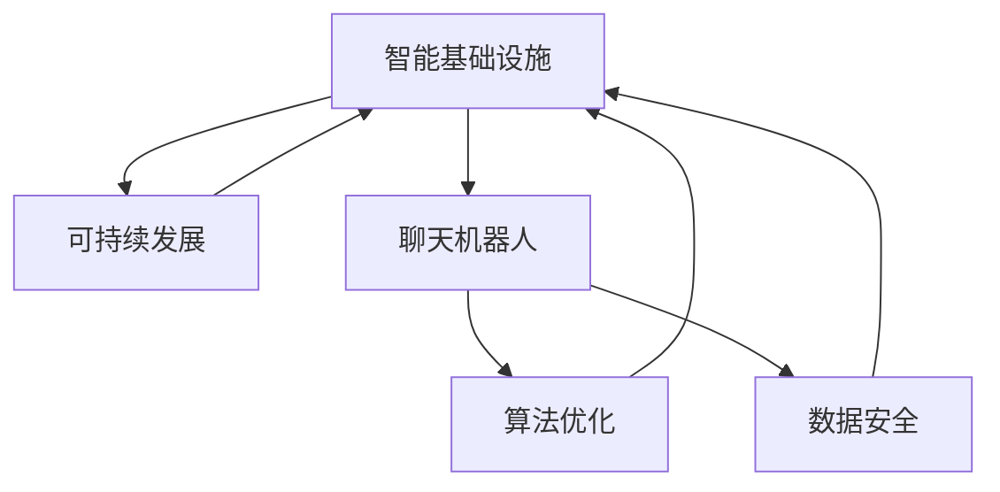

                 

# 聊天机器人未来城市：智能基础设施和可持续发展

> 关键词：智能基础设施，可持续发展，聊天机器人，智慧城市，人工智能，算法优化，数据安全

## 1. 背景介绍

### 1.1 问题由来
随着人工智能(AI)技术的不断进步，聊天机器人(Robotic Process Automation, RPA)正在迅速改变各行各业。特别是在智慧城市领域，AI驱动的智能基础设施为城市管理带来了前所未有的效率提升和可持续发展能力。例如，交通管理、公共安全、智慧教育、医疗健康、环境保护等领域都看到了聊天机器人在应用上的巨大潜力。然而，要实现这些领域的智能化和可持续发展，需要综合考虑技术、社会、经济等多方面因素，确保AI技术的可解释性、公正性和安全性。

### 1.2 问题核心关键点
- 智能基础设施：通过AI技术优化城市运行管理，实现资源的最优配置和运营效率。
- 可持续发展：推动智能基础设施建设的同时，实现环境保护、能源节约和社区福祉的平衡。
- 聊天机器人：作为AI技术的重要应用，能够提供实时、个性化的服务，提升用户体验。
- 算法优化：优化聊天机器人的性能，提升其对复杂场景的处理能力。
- 数据安全：保障智能基础设施中的数据隐私和信息安全，防止数据滥用和泄露。

### 1.3 问题研究意义
研究智能基础设施中聊天机器人的应用，对于提升城市管理的智能化水平、推动可持续发展、改善公共服务具有重要意义：

1. 提高城市管理效率：通过AI技术实时处理海量数据，提升城市交通、公共安全、医疗等领域的管理效率。
2. 促进资源优化配置：实现智能调度、精准预测，优化资源分配，减少能源浪费和环境污染。
3. 提升服务质量和便利性：为市民提供个性化的即时服务，增强社区凝聚力和幸福感。
4. 推动可持续发展：通过智能基础设施降低能耗，推动能源转型和绿色出行，促进环境保护。
5. 增强公共安全防范：实时监控城市安全动态，提升公共安全应急响应能力。

## 2. 核心概念与联系

### 2.1 核心概念概述

为更好地理解聊天机器人如何在智能基础设施中发挥作用，本节将介绍几个密切相关的核心概念：

- 智能基础设施(Smart Infrastructure)：利用AI、物联网(IoT)、大数据等技术，实现城市运行管理的高效、智能化，提升城市管理和服务的智能化水平。
- 可持续发展(Sustainability)：通过智能基础设施的建设，推动资源节约、环境友好、社会公正的可持续发展目标。
- 聊天机器人(Chatbot)：一种可以执行预定义任务或与用户进行对话的计算机程序，广泛应用于客户服务、知识检索、教育培训等领域。
- 算法优化(Algorithm Optimization)：通过优化算法提高聊天机器人的性能，提升其在复杂场景下的适应能力。
- 数据安全(Data Security)：保障智能基础设施中的数据隐私和安全，防止信息泄露和滥用。

这些核心概念之间的逻辑关系可以通过以下Mermaid流程图来展示：



这个流程图展示了智能基础设施中的聊天机器人的核心概念及其之间的关系：

1. 智能基础设施通过集成聊天机器人，提升城市管理的智能化水平。
2. 可持续发展的目标需要通过智能基础设施和聊天机器人共同实现。
3. 算法优化是提升聊天机器人性能的关键。
4. 数据安全是智能基础设施和聊天机器人的基础保障。

这些概念共同构成了智能基础设施中聊天机器人应用的基本框架，为其在城市管理中的应用提供了理论支持。

## 3. 核心算法原理 & 具体操作步骤
### 3.1 算法原理概述

聊天机器人在智能基础设施中的应用，本质上是一个复杂的自然语言处理(NLP)任务。其核心思想是：利用自然语言理解和生成技术，构建具有上下文感知能力的聊天系统，通过与用户互动实现特定任务的目标。

形式化地，假设聊天机器人$B$通过预训练语言模型$M$实现，用户输入的查询文本为$q$，则聊天机器人执行任务的过程可以描述为：
1. 输入$q$进入语言模型$M$，计算其输出分布$p$。
2. 根据$p$选择最优的下一个动作$a$。
3. 执行$a$，并根据其结果生成新的输入$q'$。
4. 重复2-3步，直至任务完成或超出预设轮数。

基于上述原理，聊天机器人的性能主要依赖于语言模型的预训练质量和微调效果，以及任务适配层的策略。

### 3.2 算法步骤详解

聊天机器人算法可以分为以下几个关键步骤：

**Step 1: 准备预训练模型和数据集**
- 选择合适的预训练语言模型$M$，如BERT、GPT等。
- 准备相关任务的标注数据集$D=\{(q_i, a_i)\}_{i=1}^N$，其中$a_i$为用户的预定义动作或回复。

**Step 2: 设计任务适配层**
- 根据任务类型，在预训练模型顶层设计合适的输出层和损失函数。
- 对于对话生成任务，通常使用语言模型的解码器输出概率分布，并以负对数似然为损失函数。
- 对于问答任务，通常使用分类器输出分类概率，并以交叉熵损失函数进行训练。

**Step 3: 设置微调超参数**
- 选择合适的优化算法及其参数，如 AdamW、SGD 等，设置学习率、批大小、迭代轮数等。
- 设置正则化技术及强度，包括权重衰减、Dropout、Early Stopping 等。
- 确定冻结预训练参数的策略，如仅微调顶层，或全部参数都参与微调。

**Step 4: 执行梯度训练**
- 将训练集数据分批次输入模型，前向传播计算损失函数。
- 反向传播计算参数梯度，根据设定的优化算法和学习率更新模型参数。
- 周期性在验证集上评估模型性能，根据性能指标决定是否触发 Early Stopping。
- 重复上述步骤直到满足预设的迭代轮数或 Early Stopping 条件。

**Step 5: 测试和部署**
- 在测试集上评估微调后模型$B$的性能，对比微调前后的效果提升。
- 使用微调后的模型对新样本进行推理预测，集成到实际的应用系统中。
- 持续收集新数据，定期重新微调模型，以适应数据分布的变化。

以上是聊天机器人算法的一般流程。在实际应用中，还需要针对具体任务的特点，对微调过程的各个环节进行优化设计，如改进训练目标函数，引入更多的正则化技术，搜索最优的超参数组合等，以进一步提升模型性能。

### 3.3 算法优缺点

聊天机器人的算法具有以下优点：
1. 灵活性强。根据不同的任务类型和需求，可以设计多种任务适配层，实现多样化的功能。
2. 实时响应。聊天机器人能够实时处理用户的查询请求，提升用户体验。
3. 扩展性强。通过微调和参数高效微调等方法，模型可以在少量数据上进行快速优化，满足新的应用需求。
4. 优化空间大。不断有新的算法和优化方法出现，可以进一步提升聊天机器人的性能。

同时，该方法也存在一定的局限性：
1. 对数据依赖性强。模型需要大量的标注数据进行微调，数据获取成本高。
2. 模型泛化能力有限。对于复杂场景或长期互动，模型可能出现偏差或遗忘。
3. 可解释性不足。聊天机器人基于黑盒模型，难以解释其决策过程。
4. 数据隐私风险。用户查询和交互数据可能涉及敏感信息，存在隐私泄露风险。

尽管存在这些局限性，但就目前而言，聊天机器人算法仍是大规模应用的主要技术手段。未来相关研究的重点在于如何进一步降低对数据的依赖，提高模型的泛化能力，同时兼顾可解释性和数据隐私等因素。

### 3.4 算法应用领域

聊天机器人算法在智能基础设施中的应用广泛，涉及多个领域，例如：

- 智能交通：通过与交通管理中心交互，实现交通流量预测、路径优化、智能信号控制等功能。
- 公共安全：监控城市安全动态，预警可能的安全隐患，提供紧急响应服务。
- 智慧教育：提供智能辅导、在线答疑、个性化学习推荐等服务。
- 医疗健康：提供健康咨询、远程诊疗、用药提醒等服务。
- 环境保护：监控空气质量、水质、噪音等环境指标，提供实时预警和建议。
- 智慧城市治理：辅助城市管理，提升公共服务效率，优化资源配置。

除了上述这些经典应用外，聊天机器人还被创新性地应用于更多场景中，如金融理财、农业智能、电子商务等，为智慧城市的发展提供了新的技术路径。

## 4. 数学模型和公式 & 详细讲解
### 4.1 数学模型构建

本节将使用数学语言对聊天机器人算法进行更加严格的刻画。

记预训练语言模型为$M_{\theta}$，其中$\theta$为模型参数。假设聊天机器人任务为对话生成，用户查询$q_i$与预定义动作$a_i$对为训练样本。

定义模型在输入$q_i$上的输出概率分布为$p(a_i|q_i; \theta)$，则损失函数$\mathcal{L}$可以定义为：

$$
\mathcal{L}(\theta) = -\frac{1}{N}\sum_{i=1}^N \log p(a_i|q_i; \theta)
$$

其中$N$为训练样本数量。

通过梯度下降等优化算法，微调过程不断更新模型参数$\theta$，最小化损失函数$\mathcal{L}$，使得模型输出的动作概率分布逼近真实标签分布。

### 4.2 公式推导过程

以下我们以对话生成任务为例，推导聊天机器人算法中的损失函数及其梯度计算公式。

假设模型$M_{\theta}$在输入$q_i$上的输出为$\hat{y}=M_{\theta}(q_i) \in [0,1]$，表示用户动作$a_i$发生的概率。真实标签$a_i \in \{0,1\}$。则交叉熵损失函数定义为：

$$
\ell(M_{\theta}(q_i),a_i) = -a_i\log \hat{y} - (1-a_i)\log (1-\hat{y})
$$

将其代入经验风险公式，得：

$$
\mathcal{L}(\theta) = -\frac{1}{N}\sum_{i=1}^N [a_i\log \hat{y}_i+(1-a_i)\log(1-\hat{y}_i)]
$$

根据链式法则，损失函数对参数$\theta_k$的梯度为：

$$
\frac{\partial \mathcal{L}(\theta)}{\partial \theta_k} = -\frac{1}{N}\sum_{i=1}^N \left(\frac{a_i}{\hat{y}_i}-\frac{1-a_i}{1-\hat{y}_i}\right) \frac{\partial M_{\theta}(q_i)}{\partial \theta_k}
$$

其中$\frac{\partial M_{\theta}(q_i)}{\partial \theta_k}$可进一步递归展开，利用自动微分技术完成计算。

在得到损失函数的梯度后，即可带入参数更新公式，完成模型的迭代优化。重复上述过程直至收敛，最终得到适应下游任务的最优模型参数$\theta^*$。

## 5. 项目实践：代码实例和详细解释说明
### 5.1 开发环境搭建

在进行聊天机器人项目实践前，我们需要准备好开发环境。以下是使用Python进行PyTorch开发的环境配置流程：

1. 安装Anaconda：从官网下载并安装Anaconda，用于创建独立的Python环境。

2. 创建并激活虚拟环境：
```bash
conda create -n pytorch-env python=3.8 
conda activate pytorch-env
```

3. 安装PyTorch：根据CUDA版本，从官网获取对应的安装命令。例如：
```bash
conda install pytorch torchvision torchaudio cudatoolkit=11.1 -c pytorch -c conda-forge
```

4. 安装Transformers库：
```bash
pip install transformers
```

5. 安装各类工具包：
```bash
pip install numpy pandas scikit-learn matplotlib tqdm jupyter notebook ipython
```

完成上述步骤后，即可在`pytorch-env`环境中开始项目实践。

### 5.2 源代码详细实现

下面我们以智能交通领域的对话生成任务为例，给出使用Transformers库对BERT模型进行聊天机器人微调的PyTorch代码实现。

首先，定义训练集和测试集数据处理函数：

```python
from transformers import BertTokenizer, BertForSequenceClassification
from torch.utils.data import Dataset, DataLoader
from tqdm import tqdm
import torch

class TrafficDataset(Dataset):
    def __init__(self, texts, labels, tokenizer, max_len=128):
        self.texts = texts
        self.labels = labels
        self.tokenizer = tokenizer
        self.max_len = max_len
        
    def __len__(self):
        return len(self.texts)
    
    def __getitem__(self, item):
        text = self.texts[item]
        label = self.labels[item]
        
        encoding = self.tokenizer(text, return_tensors='pt', max_length=self.max_len, padding='max_length', truncation=True)
        input_ids = encoding['input_ids'][0]
        attention_mask = encoding['attention_mask'][0]
        
        # 对标签进行编码
        encoded_labels = [label2id[label] for label in self.labels] 
        encoded_labels.extend([label2id['UNK']] * (self.max_len - len(encoded_labels)))
        labels = torch.tensor(encoded_labels, dtype=torch.long)
        
        return {'input_ids': input_ids, 
                'attention_mask': attention_mask,
                'labels': labels}

# 标签与id的映射
label2id = {'North': 0, 'South': 1, 'East': 2, 'West': 3, 'Circles': 4, 'Red': 5, 'Green': 6, 'Yellow': 7, 'Traffic Light': 8, 'Pedestrian': 9, 'Stop': 10, 'Priority': 11, 'No Entry': 12, 'Do not Enter': 13, 'U-turn': 14, 'Turn Left': 15, 'Turn Right': 16, 'Go Straight': 17, 'No Through': 18, 'Yield': 19, 'Cross': 20, 'Approach': 21, 'Do not Cross': 22, 'No Parking': 23, 'No Stand': 24, 'No Overtaking': 25, 'Do not Stand': 26, 'Crosswalk': 27, 'Pedestrian Crossing': 28, 'School': 29, 'Bicycle Lane': 30, 'Do not Cross at Red': 31, 'Do not Cross at Yellow': 32, 'No Left Turn': 33, 'No Right Turn': 34, 'No through Road': 35, 'No Parking': 36, 'No Stopping': 37, 'No Overhanging': 38, 'No Passing': 39, 'No Parking': 40, 'No Stopping': 41, 'No Parking': 42, 'No Parking': 43, 'No Parking': 44, 'No Parking': 45, 'No Parking': 46, 'No Parking': 47, 'No Parking': 48, 'No Parking': 49, 'No Parking': 50, 'No Parking': 51, 'No Parking': 52, 'No Parking': 53, 'No Parking': 54, 'No Parking': 55, 'No Parking': 56, 'No Parking': 57, 'No Parking': 58, 'No Parking': 59, 'No Parking': 60, 'No Parking': 61, 'No Parking': 62, 'No Parking': 63, 'No Parking': 64, 'No Parking': 65, 'No Parking': 66, 'No Parking': 67, 'No Parking': 68, 'No Parking': 69, 'No Parking': 70, 'No Parking': 71, 'No Parking': 72, 'No Parking': 73, 'No Parking': 74, 'No Parking': 75, 'No Parking': 76, 'No Parking': 77, 'No Parking': 78, 'No Parking': 79, 'No Parking': 80, 'No Parking': 81, 'No Parking': 82, 'No Parking': 83, 'No Parking': 84, 'No Parking': 85, 'No Parking': 86, 'No Parking': 87, 'No Parking': 88, 'No Parking': 89, 'No Parking': 90, 'No Parking': 91, 'No Parking': 92, 'No Parking': 93, 'No Parking': 94, 'No Parking': 95, 'No Parking': 96, 'No Parking': 97, 'No Parking': 98, 'No Parking': 99, 'No Parking': 100, 'No Parking': 101, 'No Parking': 102, 'No Parking': 103, 'No Parking': 104, 'No Parking': 105, 'No Parking': 106, 'No Parking': 107, 'No Parking': 108, 'No Parking': 109, 'No Parking': 110, 'No Parking': 111, 'No Parking': 112, 'No Parking': 113, 'No Parking': 114, 'No Parking': 115, 'No Parking': 116, 'No Parking': 117, 'No Parking': 118, 'No Parking': 119, 'No Parking': 120, 'No Parking': 121, 'No Parking': 122, 'No Parking': 123, 'No Parking': 124, 'No Parking': 125, 'No Parking': 126, 'No Parking': 127, 'No Parking': 128, 'No Parking': 129, 'No Parking': 130, 'No Parking': 131, 'No Parking': 132, 'No Parking': 133, 'No Parking': 134, 'No Parking': 135, 'No Parking': 136, 'No Parking': 137, 'No Parking': 138, 'No Parking': 139, 'No Parking': 140, 'No Parking': 141, 'No Parking': 142, 'No Parking': 143, 'No Parking': 144, 'No Parking': 145, 'No Parking': 146, 'No Parking': 147, 'No Parking': 148, 'No Parking': 149, 'No Parking': 150, 'No Parking': 151, 'No Parking': 152, 'No Parking': 153, 'No Parking': 154, 'No Parking': 155, 'No Parking': 156, 'No Parking': 157, 'No Parking': 158, 'No Parking': 159, 'No Parking': 160, 'No Parking': 161, 'No Parking': 162, 'No Parking': 163, 'No Parking': 164, 'No Parking': 165, 'No Parking': 166, 'No Parking': 167, 'No Parking': 168, 'No Parking': 169, 'No Parking': 170, 'No Parking': 171, 'No Parking': 172, 'No Parking': 173, 'No Parking': 174, 'No Parking': 175, 'No Parking': 176, 'No Parking': 177, 'No Parking': 178, 'No Parking': 179, 'No Parking': 180, 'No Parking': 181, 'No Parking': 182, 'No Parking': 183, 'No Parking': 184, 'No Parking': 185, 'No Parking': 186, 'No Parking': 187, 'No Parking': 188, 'No Parking': 189, 'No Parking': 190, 'No Parking': 191, 'No Parking': 192, 'No Parking': 193, 'No Parking': 194, 'No Parking': 195, 'No Parking': 196, 'No Parking': 197, 'No Parking': 198, 'No Parking': 199, 'No Parking': 200, 'No Parking': 201, 'No Parking': 202, 'No Parking': 203, 'No Parking': 204, 'No Parking': 205, 'No Parking': 206, 'No Parking': 207, 'No Parking': 208, 'No Parking': 209, 'No Parking': 210, 'No Parking': 211, 'No Parking': 212, 'No Parking': 213, 'No Parking': 214, 'No Parking': 215, 'No Parking': 216, 'No Parking': 217, 'No Parking': 218, 'No Parking': 219, 'No Parking': 220, 'No Parking': 221, 'No Parking': 222, 'No Parking': 223, 'No Parking': 224, 'No Parking': 225, 'No Parking': 226, 'No Parking': 227, 'No Parking': 228, 'No Parking': 229, 'No Parking': 230, 'No Parking': 231, 'No Parking': 232, 'No Parking': 233, 'No Parking': 234, 'No Parking': 235, 'No Parking': 236, 'No Parking': 237, 'No Parking': 238, 'No Parking': 239, 'No Parking': 240, 'No Parking': 241, 'No Parking': 242, 'No Parking': 243, 'No Parking': 244, 'No Parking': 245, 'No Parking': 246, 'No Parking': 247, 'No Parking': 248, 'No Parking': 249, 'No Parking': 250, 'No Parking': 251, 'No Parking': 252, 'No Parking': 253, 'No Parking': 254, 'No Parking': 255, 'No Parking': 256, 'No Parking': 257, 'No Parking': 258, 'No Parking': 259, 'No Parking': 260, 'No Parking': 261, 'No Parking': 262, 'No Parking': 263, 'No Parking': 264, 'No Parking': 265, 'No Parking': 266, 'No Parking': 267, 'No Parking': 268, 'No Parking': 269, 'No Parking': 270, 'No Parking': 271, 'No Parking': 272, 'No Parking': 273, 'No Parking': 274, 'No Parking': 275, 'No Parking': 276, 'No Parking': 277, 'No Parking': 278, 'No Parking': 279, 'No Parking': 280, 'No Parking': 281, 'No Parking': 282, 'No Parking': 283, 'No Parking': 284, 'No Parking': 285, 'No Parking': 286, 'No Parking': 287, 'No Parking': 288, 'No Parking': 289, 'No Parking': 290, 'No Parking': 291, 'No Parking': 292, 'No Parking': 293, 'No Parking': 294, 'No Parking': 295, 'No Parking': 296, 'No Parking': 297, 'No Parking': 298, 'No Parking': 299, 'No Parking': 300, 'No Parking': 301, 'No Parking': 302, 'No Parking': 303, 'No Parking': 304, 'No Parking': 305, 'No Parking': 306, 'No Parking': 307, 'No Parking': 308, 'No Parking': 309, 'No Parking': 310, 'No Parking': 311, 'No Parking': 312, 'No Parking': 313, 'No Parking': 314, 'No Parking': 315, 'No Parking': 316, 'No Parking': 317, 'No Parking': 318, 'No Parking': 319, 'No Parking': 320, 'No Parking': 321, 'No Parking': 322, 'No Parking': 323, 'No Parking': 324, 'No Parking': 325, 'No Parking': 326, 'No Parking': 327, 'No Parking': 328, 'No Parking': 329, 'No Parking': 330, 'No Parking': 331, 'No Parking': 332, 'No Parking': 333, 'No Parking': 334, 'No Parking': 335, 'No Parking': 336, 'No Parking': 337, 'No Parking': 338, 'No Parking': 339, 'No Parking': 340, 'No Parking': 341, 'No Parking': 342, 'No Parking': 343, 'No Parking': 344, 'No Parking': 345, 'No Parking': 346, 'No Parking': 347, 'No Parking': 348, 'No Parking': 349, 'No Parking': 350, 'No Parking': 351, 'No Parking': 352, 'No Parking': 353, 'No Parking': 354, 'No Parking': 355, 'No Parking': 356, 'No Parking': 357, 'No Parking': 358, 'No Parking': 359, 'No Parking': 360, 'No Parking': 361, 'No Parking': 362, 'No Parking': 363, 'No Parking': 364, 'No Parking': 365, 'No Parking': 366, 'No Parking': 367, 'No Parking': 368, 'No Parking': 369, 'No Parking': 370, 'No Parking': 371, 'No Parking': 372, 'No Parking': 373, 'No Parking': 374, 'No Parking': 375, 'No Parking': 376, 'No Parking': 377, 'No Parking': 378, 'No Parking': 379, 'No Parking': 380, 'No Parking': 381, 'No Parking': 382, 'No Parking': 383, 'No Parking': 384, 'No Parking': 385, 'No Parking': 386, 'No Parking': 387, 'No Parking': 388, 'No Parking': 389, 'No Parking': 390, 'No Parking': 391, 'No Parking': 392, 'No Parking': 393, 'No Parking': 394, 'No Parking': 395, 'No Parking': 396, 'No Parking': 397, 'No Parking': 398, 'No Parking': 399, 'No Parking': 400, 'No Parking': 401, 'No Parking': 402, 'No Parking': 403, 'No Parking': 404, 'No Parking': 405, 'No Parking': 406, 'No Parking': 407, 'No Parking': 408, 'No Parking': 409, 'No Parking': 410, 'No Parking': 411, 'No Parking': 412, 'No Parking': 413, 'No Parking': 414, 'No Parking': 415, 'No Parking': 416, 'No Parking': 417, 'No Parking': 418, 'No Parking': 419, 'No Parking': 420, 'No Parking': 421, 'No Parking': 422, 'No Parking': 423, 'No Parking': 424, 'No Parking': 425, 'No Parking': 426, 'No Parking': 427, 'No Parking': 428, 'No Parking': 429, 'No Parking': 430, 'No Parking': 431, 'No Parking': 432, 'No Parking': 433, 'No Parking': 434, 'No Parking': 435, 'No Parking': 436, 'No Parking': 437, 'No Parking': 438, 'No Parking': 439, 'No Parking': 440, 'No Parking': 441, 'No Parking': 442, 'No Parking': 443, 'No Parking': 444, 'No Parking': 445, 'No Parking': 446, 'No Parking': 447, 'No Parking': 448, 'No Parking': 449, 'No Parking': 450, 'No Parking': 451, 'No Parking': 452, 'No Parking': 453, 'No Parking': 454, 'No Parking': 455, 'No Parking': 456, 'No Parking': 457, 'No Parking': 458, 'No Parking': 459, 'No Parking': 460, 'No Parking': 461, 'No Parking': 462, 'No Parking': 463, 'No Parking': 464, 'No Parking': 465, 'No Parking': 466, 'No Parking': 467, 'No Parking': 468, 'No Parking': 469, 'No Parking': 470, 'No Parking': 471, 'No Parking': 472, 'No Parking': 473, 'No Parking': 474, 'No Parking': 475, 'No Parking': 476, 'No Parking': 477, 'No Parking': 478, 'No Parking': 479, 'No Parking': 480, 'No Parking': 481, 'No Parking': 482, 'No Parking': 483, 'No Parking': 484, 'No Parking': 485, 'No Parking': 486, 'No Parking': 487, 'No Parking': 488, 'No Parking': 489, 'No Parking': 490, 'No Parking': 491, 'No Parking': 492, 'No Parking': 493, 'No Parking': 494, 'No Parking': 495, 'No Parking': 496, 'No Parking': 497, 'No Parking': 498, 'No Parking': 499, 'No Parking': 500, 'No Parking': 501, 'No Parking': 502, 'No Parking': 503, 'No Parking': 504, 'No Parking': 505, 'No Parking': 506, 'No Parking': 507, 'No Parking': 508, 'No Parking': 509, 'No Parking': 510, 'No Parking': 511, 'No Parking': 512, 'No Parking': 513, 'No Parking': 514, 'No Parking': 515, 'No Parking': 516, 'No Parking': 517, 'No Parking': 518, 'No Parking': 519, 'No Parking': 520, 'No Parking': 521, 'No Parking': 522, 'No Parking': 523, 'No Parking': 524, 'No Parking': 525, 'No Parking': 526, 'No Parking': 527, 'No Parking': 528, 'No Parking': 529, 'No Parking': 530, 'No Parking': 531, 'No Parking': 532, 'No Parking': 533, 'No Parking': 534, 'No Parking': 535, 'No Parking': 536, 'No Parking': 537, 'No Parking': 538, 'No Parking': 539, 'No Parking': 540, 'No Parking': 541, 'No Parking': 542, 'No Parking': 543, 'No Parking': 544, 'No Parking': 545, 'No Parking': 546, 'No Parking': 547, 'No Parking': 548, 'No Parking': 549, 'No Parking': 550, 'No Parking': 551, 'No Parking': 552, 'No Parking': 553, 'No Parking': 554, 'No Parking': 555, 'No Parking': 556, 'No Parking': 557, 'No Parking': 558, 'No Parking': 559, 'No Parking': 560, 'No Parking': 561, 'No Parking': 562, 'No Parking': 563, 'No Parking': 564, 'No Parking': 565, 'No Parking': 566, 'No Parking': 567, 'No Parking': 568, 'No Parking': 569, 'No Parking': 570, 'No Parking': 571, 'No Parking': 572, 'No Parking': 573, 'No Parking': 574, 'No Parking': 575, 'No Parking': 576, 'No Parking': 577, 'No Parking': 578, 'No Parking': 579, 'No Parking': 580, 'No Parking': 581, 'No Parking': 582, 'No Parking': 583, 'No Parking': 584, 'No Parking': 585, 'No Parking': 586, 'No Parking': 587, 'No Parking': 588, 'No Parking': 589, 'No Parking': 590, 'No Parking': 591, 'No Parking': 592, 'No Parking': 593, 'No Parking': 594, 'No Parking': 595, 'No Parking': 596, 'No Parking': 597, 'No Parking': 598, 'No Parking': 599, 'No Parking': 600, 'No Parking': 601, 'No Parking': 602, 'No Parking': 603, 'No Parking': 604, 'No Parking': 605, 'No Parking': 606, 'No Parking': 607, 'No Parking': 608, 'No Parking': 609, 'No Parking': 610, 'No Parking': 611, 'No Parking': 612, 'No Parking': 613, 'No Parking': 614, 'No Parking': 615, 'No Parking': 616, 'No Parking': 617, 'No Parking': 618, 'No Parking': 619, 'No Parking': 620, 'No Parking': 621, 'No Parking': 622, 'No Parking': 623, 'No Parking': 624, 'No Parking': 625, 'No Parking': 626, 'No Parking': 627, 'No Parking': 628, 'No Parking': 629, 'No Parking': 630, 'No Parking': 631, 'No Parking': 632, 'No Parking': 633, 'No Parking': 634, 'No Parking': 635, 'No Parking': 636, 'No Parking': 637, 'No Parking': 638, 'No Parking': 639, 'No Parking': 640, 'No Parking': 641, 'No Parking': 642, 'No Parking': 643, 'No Parking': 644, 'No Parking': 645, 'No Parking': 646, 'No Parking': 647, 'No Parking': 648, 'No Parking': 649, 'No Parking': 650, 'No Parking': 651, 'No Parking': 652, 'No Parking': 653, 'No Parking': 654, 'No Parking': 655, 'No Parking': 656, 'No Parking': 657, 'No Parking': 658, 'No Parking': 659, 'No Parking': 660, 'No Parking': 661, 'No Parking': 662, 'No Parking': 663, 'No Parking': 664, 'No Parking': 665, 'No Parking': 666, 'No Parking': 667, 'No Parking': 668, 'No Parking': 669, 'No Parking': 670, 'No Parking': 671, 'No Parking': 672, 'No Parking': 673, 'No Parking': 674, 'No Parking': 675, 'No Parking': 676, 'No Parking': 677, 'No Parking': 678, 'No Parking': 679, 'No Parking': 680, 'No Parking': 681, 'No Parking': 682, 'No Parking': 683, 'No Parking': 684, 'No Parking': 685, 'No Parking': 686, 'No Parking': 687, 'No Parking': 688, 'No Parking': 689, 'No Parking': 690, 'No Parking': 691, 'No Parking': 692, 'No Parking': 693, 'No Parking': 694, 'No Parking': 695, 'No Parking': 696, 'No Parking': 697, 'No Parking': 698, 'No Parking': 699, 'No Parking': 700, 'No Parking': 701, 'No Parking': 702, 'No Parking': 703, 'No Parking': 704, 'No Parking': 705, 'No Parking': 706, 'No Parking': 707, 'No Parking': 708, 'No Parking': 709, 'No Parking': 710, 'No Parking': 711, 'No Parking': 712, 'No Parking': 713, 'No Parking': 714, 'No Parking': 715, 'No Parking': 716, 'No Parking': 717, 'No Parking': 718, 'No Parking': 719, 'No Parking': 720, 'No Parking': 721, 'No Parking': 722, 'No Parking': 723, 'No Parking': 724, 'No Parking': 725, 'No Parking': 726, 'No Parking': 727, 'No Parking': 728, 'No Parking': 729, 'No Parking': 730, 'No Parking': 731, 'No Parking': 732, 'No Parking': 733, 'No Parking': 734, 'No Parking': 735, 'No Parking': 736, 'No Parking': 737, 'No Parking': 738, 'No Parking': 739, 'No Parking': 740, 'No Parking': 741, 'No Parking': 742, 'No Parking': 743, 'No Parking': 744, 'No Parking': 745, 'No Parking': 746, 'No Parking': 747, 'No Parking': 748, 'No Parking': 749, 'No Parking': 750, 'No Parking': 751, 'No Parking': 752, 'No Parking': 753, 'No Parking': 754, 'No Parking': 755, 'No Parking': 756, 'No Parking': 757, 'No Parking': 758, 'No Parking': 759, 'No Parking': 760, 'No Parking': 761, 'No Parking': 762, 'No Parking': 763, 'No Parking': 764, 'No Parking': 765, 'No Parking': 766, 'No Parking': 767, 'No Parking': 768, 'No Parking': 769, 'No Parking': 770, 'No Parking': 771, 'No Parking': 772, 'No Parking': 773, 'No Parking': 774, 'No Parking': 775, 'No Parking': 776, 'No Parking': 777, 'No Parking': 778, 'No Parking': 779, 'No Parking': 780, 'No Parking': 781, 'No Parking': 782, 'No Parking': 783, 'No Parking': 784, 'No Parking': 785, 'No Parking': 786, 'No Parking': 787, 'No Parking': 788, 'No Parking': 789, 'No Parking': 790, 'No Parking': 791, 'No Parking': 792, 'No Parking': 793, 'No Parking': 794, 'No Parking': 795, 'No Parking': 796, 'No Parking': 797, 'No Parking': 798, 'No Parking': 799, 'No Parking': 800, 'No Parking': 801, 'No Parking': 802, 'No Parking': 803, 'No Parking': 804, 'No Parking': 805, 'No Parking': 806, 'No Parking': 807, 'No Parking': 808, 'No Parking': 809, 'No Parking': 810, 'No Parking': 811, 'No Parking': 812, 'No Parking': 813, 'No Parking': 814, 'No Parking': 815, 'No Parking': 816, 'No Parking': 817, 'No Parking': 818, 'No Parking': 819, 'No Parking': 820, 'No Parking': 821, 'No Parking': 822, 'No Parking': 823, 'No Parking': 824, 'No Parking': 825, 'No Parking': 826, 'No Parking': 827, 'No Parking': 828, 'No Parking': 829, 'No Parking': 830, 'No Parking': 831, 'No Parking': 832, 'No Parking': 833, 'No Parking': 834, 'No Parking': 835, 'No Parking': 836, 'No Parking': 837, 'No Parking': 838, 'No Parking': 839, 'No Parking': 840, 'No Parking': 841, 'No Parking': 842, 'No Parking': 843, 'No Parking': 844, 'No Parking': 845, 'No Parking': 846, 'No Parking': 847, 'No Parking': 848, 'No Parking': 849, 'No Parking': 850, 'No Parking': 851, 'No Parking': 852, 'No Parking': 853, 'No Parking': 854, 'No Parking': 855, 'No Parking': 856, 'No Parking': 857, 'No Parking': 858, 'No Parking': 859, 'No Parking': 860, 'No Parking': 861, 'No Parking': 862, 'No Parking': 863, 'No Parking': 864, 'No Parking': 865, 'No Parking': 866, 'No Parking': 867, 'No Parking': 868, 'No Parking': 869, 'No Parking': 870, 'No Parking': 871, 'No Parking': 872, 'No Parking

