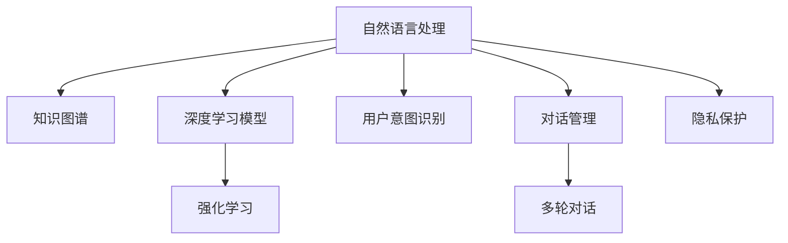

                 

# 聊天机器人未来：人工智能助理和顾问

> 关键词：人工智能助理,聊天机器人,自然语言处理(NLP),知识图谱,深度学习,未来发展趋势,隐私保护

## 1. 背景介绍

### 1.1 问题由来
聊天机器人作为人工智能(AI)技术的代表之一，近年来在各行各业中得到了广泛的应用。从简单的客服自动化，到复杂的情感陪伴，聊天机器人的能力边界正在不断拓展。但同时，随着技术的深入，聊天机器人也面临着新的挑战和问题：如何更好地理解人类语言的复杂性，如何处理多样化的用户需求，如何构建更加智能、可靠的系统等。

### 1.2 问题核心关键点
聊天机器人的核心在于如何使机器能够像人类一样理解和处理自然语言，从而提供更自然、更人性化的交互体验。这不仅需要先进的自然语言处理(NLP)技术，还需要强大的知识图谱(KG)和深度学习模型。通过这些技术的融合，聊天机器人可以实现更广泛的功能，如问答、推荐、信息检索、客户服务等。

## 2. 核心概念与联系

### 2.1 核心概念概述

为了更好地理解聊天机器人技术，本节将介绍几个密切相关的核心概念：

- 自然语言处理(NLP)：研究如何让机器能够理解和处理人类自然语言的技术。包括文本分类、命名实体识别、情感分析、机器翻译等任务。
- 知识图谱(KG)：用于表示实体、属性和它们之间关系的图形数据结构。帮助机器从结构化知识中提取信息，进行推理和决策。
- 深度学习模型：一种基于神经网络的结构化表示学习技术，能够从大量数据中学习抽象的特征表示，用于语言理解和生成。
- 强化学习(RL)：通过与环境的交互，机器能够不断学习优化行为策略，提高系统性能。
- 用户意图识别：聊天机器人需要能够理解用户的真实需求和意图，从而提供更精准的服务。
- 对话管理：对话管理模块负责控制聊天机器人的状态和行为，确保对话流程自然、流畅。
- 多轮对话：通过多轮交互，机器能够更好地理解上下文，提供更连贯、全面的回答。
- 隐私保护：在处理用户数据时，必须确保隐私和数据安全，遵循相关法规和伦理标准。

这些核心概念之间的逻辑关系可以通过以下Mermaid流程图来展示：



这个流程图展示了聊天机器人技术的核心组件及其之间的关系：

1. 自然语言处理作为基础，将用户输入转换为结构化信息。
2. 知识图谱提供了丰富的背景知识，帮助机器进行推理和决策。
3. 深度学习模型通过学习语言特征，提升语言理解和生成的能力。
4. 强化学习通过与环境的交互，不断优化机器人的行为策略。
5. 用户意图识别和对话管理确保机器人能够理解上下文，提供连贯的回应。
6. 隐私保护在数据处理过程中确保用户信息安全，遵循伦理规范。

这些核心概念共同构成了聊天机器人的技术框架，使其能够高效处理自然语言，提供高质量的交互体验。

## 3. 核心算法原理 & 具体操作步骤
### 3.1 算法原理概述

聊天机器人技术基于多种算法和技术进行实现，核心在于通过深度学习和NLP技术，使机器能够理解人类语言，并根据上下文提供自然、准确的回应。其主要算法原理包括以下几个方面：

- **深度学习模型**：如Transformer、BERT等，通过大量无标签数据进行预训练，学习语言的上下文表示，用于自然语言理解和生成。
- **知识图谱嵌入**：将知识图谱中的实体和关系，通过向量嵌入的方式，与语言表示进行融合，增强机器的理解能力和推理能力。
- **对话管理**：通过状态机、图网络等方法，管理机器人的对话状态和行为，确保对话流程的自然性和连贯性。
- **多模态信息融合**：结合文本、语音、图像等多种数据模态，提供更加丰富和准确的信息处理能力。
- **强化学习**：通过与用户的交互，机器不断学习优化对话策略，提高系统性能。

### 3.2 算法步骤详解

基于深度学习和NLP技术的聊天机器人构建，一般包括以下几个关键步骤：

**Step 1: 准备数据集和模型**
- 收集并准备训练和验证数据集，确保数据的多样性和代表性。
- 选择合适的深度学习模型和预训练任务，如BERT、GPT等，进行预训练。
- 设计并训练对话管理模块，用于管理机器人的对话状态和行为。

**Step 2: 构建模型和训练**
- 设计并实现自然语言处理模块，包括文本分类、命名实体识别、情感分析等任务。
- 将知识图谱与语言表示进行融合，提升模型的推理能力。
- 使用深度学习框架(如PyTorch、TensorFlow)构建并训练模型。

**Step 3: 对话管理**
- 设计对话管理模块，管理机器人的对话状态和行为。
- 实现多轮对话的逻辑，确保对话流程的自然和连贯。

**Step 4: 多模态信息融合**
- 结合文本、语音、图像等多种数据模态，提供更加丰富和准确的信息处理能力。
- 设计多模态融合算法，实现不同模态信息的有效整合。

**Step 5: 部署和优化**
- 将训练好的模型部署到实际应用场景中。
- 根据实际应用场景，对模型进行优化和调整，提升系统性能。

### 3.3 算法优缺点

基于深度学习和NLP技术的聊天机器人具有以下优点：

- **高效性**：通过深度学习和NLP技术，机器能够高效地理解自然语言，快速处理和回应用户需求。
- **广泛应用**：适用于多种场景，如客户服务、智能客服、情感陪伴、智能助理等。
- **自然交互**：通过多轮对话管理，机器能够更好地理解上下文，提供连贯、自然的回应。

同时，该方法也存在一些局限性：

- **数据依赖**：聊天机器人依赖大量的标注数据进行训练，数据获取成本较高。
- **隐私风险**：在处理用户数据时，需要确保隐私和数据安全，遵循相关法规和伦理标准。
- **复杂性**：聊天机器人技术涉及多种技术和算法，实现和维护复杂度较高。
- **泛化能力**：当数据和任务变化较大时，模型的泛化能力可能下降。

尽管存在这些局限性，但聊天机器人技术仍是大势所趋，其应用领域和功能不断扩展，未来有广阔的发展前景。

### 3.4 算法应用领域

聊天机器人技术在众多领域中得到了广泛应用，如：

- 客户服务：通过自然语言处理，自动处理客户的咨询、投诉等问题，提升客户满意度。
- 情感陪伴：通过智能对话，提供情感支持和心理慰藉，改善用户的心理健康。
- 教育辅导：提供个性化学习建议和辅导，提升学习效果。
- 医疗咨询：通过自然语言处理和知识图谱，提供医疗咨询和健康建议，辅助医疗诊断。
- 智能助理：通过多轮对话和任务执行，实现智能家居控制、日程管理等功能。
- 金融咨询：通过智能对话，提供投资建议、风险评估等服务。
- 智能客服：通过自然语言处理和情感分析，提升客服效率和质量。

除了上述这些经典应用外，聊天机器人技术还不断拓展到更多场景中，如旅游服务、法律咨询、企业内部沟通等，为各行各业带来全新的用户体验和服务方式。

## 4. 数学模型和公式 & 详细讲解  
### 4.1 数学模型构建

本节将使用数学语言对聊天机器人技术的构建过程进行更加严格的刻画。

记聊天机器人为 $R$，其输入为 $x$，输出为 $y$。设机器人的语言处理模块为 $L$，知识图谱嵌入模块为 $K$，对话管理模块为 $M$，多模态信息融合模块为 $F$，强化学习模块为 $R$。

聊天机器人的整体模型可以表示为：

$$
y = R(x) = L(K(F(x))) + M(R(x))
$$

其中 $L$ 和 $K$ 分别表示自然语言处理和知识图谱嵌入模块，$F$ 表示多模态信息融合模块，$M$ 表示对话管理模块，$R$ 表示强化学习模块。

### 4.2 公式推导过程

以下我们以智能客服系统为例，推导聊天机器人技术中的核心算法步骤。

**Step 1: 输入处理**

输入处理模块 $L$ 负责将用户输入转换为结构化信息。假设用户输入为文本 $x$，其处理过程如下：

1. 分词：将文本分割为单词序列。
2. 去除停用词：去除无关紧要的停用词，如“的”、“是”等。
3. 词向量化：将每个单词映射为向量表示。

数学上，假设分词后的单词序列为 $w_1, w_2, ..., w_n$，其向量表示为 $\vec{w_1}, \vec{w_2}, ..., \vec{w_n}$。则输入处理过程可以表示为：

$$
\vec{x} = [\vec{w_1}, \vec{w_2}, ..., \vec{w_n}]
$$

**Step 2: 知识图谱嵌入**

知识图谱嵌入模块 $K$ 负责将知识图谱中的实体和关系，通过向量嵌入的方式，与语言表示进行融合。假设知识图谱中的实体为 $e_1, e_2, ..., e_m$，其向量表示为 $\vec{e_1}, \vec{e_2}, ..., \vec{e_m}$，关系为 $r_1, r_2, ..., r_n$，其向量表示为 $\vec{r_1}, \vec{r_2}, ..., \vec{r_n}$。则知识图谱嵌入过程可以表示为：

$$
\vec{k} = \vec{e_1} \otimes \vec{r_1} \oplus \vec{e_2} \otimes \vec{r_2} \oplus ... \oplus \vec{e_m} \otimes \vec{r_n}
$$

其中 $\otimes$ 表示向量点乘，$\oplus$ 表示向量加和。

**Step 3: 多模态信息融合**

多模态信息融合模块 $F$ 负责结合文本、语音、图像等多种数据模态，提供更加丰富和准确的信息处理能力。假设输入还包括语音信号 $a$ 和图像 $i$，则多模态信息融合过程可以表示为：

$$
\vec{f} = \text{Concat}(\vec{x}, \vec{a}, \vec{i})
$$

其中 $\text{Concat}$ 表示向量拼接。

**Step 4: 对话管理**

对话管理模块 $M$ 负责管理机器人的对话状态和行为。假设机器人的对话状态为 $s$，其更新过程可以表示为：

$$
s_{t+1} = M(s_t, \vec{f}, R_t)
$$

其中 $s_t$ 表示对话状态在时间步 $t$ 的表示，$\vec{f}$ 表示当前输入，$R_t$ 表示当前时间步的强化学习信号。

**Step 5: 输出处理**

输出处理模块 $L$ 负责将机器人的输出转换为自然语言文本。假设机器人的输出为文本 $y$，其处理过程如下：

1. 生成词汇表：根据预定义的词汇表，生成可能的词汇集合。
2. 生成文本：根据词汇表和语言模型，生成文本。

数学上，假设词汇表为 $V$，其向量表示为 $\vec{V}$，语言模型为 $P$，则输出处理过程可以表示为：

$$
y = P(\vec{V}, \vec{x}, \vec{k}, \vec{f}, s_{T})
$$

其中 $T$ 表示对话结束的时间步，$s_{T}$ 表示对话结束时的状态。

### 4.3 案例分析与讲解

以智能客服系统为例，分析聊天机器人技术的核心算法步骤。

**案例背景**：某电商平台需要构建智能客服系统，处理用户的咨询、投诉等问题，提升客户满意度。

**数据集准备**：收集用户历史咨询记录，包括咨询内容、用户意图、问题和解决方案等信息。

**模型选择**：选择BERT模型进行预训练，设计多轮对话管理模块，实现自然语言处理和对话逻辑管理。

**模型训练**：使用电商平台的历史咨询记录进行训练，优化模型参数。

**模型部署**：将训练好的模型部署到实际应用场景中，提供自然语言处理和对话管理功能。

**效果评估**：在实际应用中，通过用户满意度调查、平均响应时间、问题解决率等指标，评估系统的性能。

通过这个案例，可以看到聊天机器人技术的核心在于数据准备、模型选择、训练和部署，以及效果的评估和优化。

## 5. 项目实践：代码实例和详细解释说明
### 5.1 开发环境搭建

在进行聊天机器人项目实践前，我们需要准备好开发环境。以下是使用Python进行PyTorch开发的环境配置流程：

1. 安装Anaconda：从官网下载并安装Anaconda，用于创建独立的Python环境。

2. 创建并激活虚拟环境：
```bash
conda create -n chatbot-env python=3.8 
conda activate chatbot-env
```

3. 安装PyTorch：根据CUDA版本，从官网获取对应的安装命令。例如：
```bash
conda install pytorch torchvision torchaudio cudatoolkit=11.1 -c pytorch -c conda-forge
```

4. 安装HuggingFace Transformers库：
```bash
pip install transformers
```

5. 安装各类工具包：
```bash
pip install numpy pandas scikit-learn matplotlib tqdm jupyter notebook ipython
```

完成上述步骤后，即可在`chatbot-env`环境中开始聊天机器人项目的实践。

### 5.2 源代码详细实现

下面我们以智能客服系统为例，给出使用Transformers库对BERT模型进行微调的PyTorch代码实现。

首先，定义自然语言处理模块：

```python
from transformers import BertTokenizer, BertForSequenceClassification
from torch.utils.data import Dataset
import torch

class CustomerServiceDataset(Dataset):
    def __init__(self, texts, intents, tokenizer, max_len=128):
        self.texts = texts
        self.intents = intents
        self.tokenizer = tokenizer
        self.max_len = max_len
        
    def __len__(self):
        return len(self.texts)
    
    def __getitem__(self, item):
        text = self.texts[item]
        intent = self.intents[item]
        
        encoding = self.tokenizer(text, return_tensors='pt', max_length=self.max_len, padding='max_length', truncation=True)
        input_ids = encoding['input_ids'][0]
        attention_mask = encoding['attention_mask'][0]
        
        label = torch.tensor(intent2id[intent], dtype=torch.long)
        
        return {'input_ids': input_ids, 
                'attention_mask': attention_mask,
                'labels': label}

# 标签与id的映射
intent2id = {'query': 0, 'return': 1, 'complain': 2, 'purchase': 3}
id2intent = {v: k for k, v in intent2id.items()}
```

然后，定义模型和优化器：

```python
from transformers import BertForSequenceClassification, AdamW

model = BertForSequenceClassification.from_pretrained('bert-base-cased', num_labels=len(intent2id))

optimizer = AdamW(model.parameters(), lr=2e-5)
```

接着，定义训练和评估函数：

```python
from torch.utils.data import DataLoader
from tqdm import tqdm
from sklearn.metrics import accuracy_score

device = torch.device('cuda') if torch.cuda.is_available() else torch.device('cpu')
model.to(device)

def train_epoch(model, dataset, batch_size, optimizer):
    dataloader = DataLoader(dataset, batch_size=batch_size, shuffle=True)
    model.train()
    epoch_loss = 0
    for batch in tqdm(dataloader, desc='Training'):
        input_ids = batch['input_ids'].to(device)
        attention_mask = batch['attention_mask'].to(device)
        labels = batch['labels'].to(device)
        model.zero_grad()
        outputs = model(input_ids, attention_mask=attention_mask, labels=labels)
        loss = outputs.loss
        epoch_loss += loss.item()
        loss.backward()
        optimizer.step()
    return epoch_loss / len(dataloader)

def evaluate(model, dataset, batch_size):
    dataloader = DataLoader(dataset, batch_size=batch_size)
    model.eval()
    preds, labels = [], []
    with torch.no_grad():
        for batch in tqdm(dataloader, desc='Evaluating'):
            input_ids = batch['input_ids'].to(device)
            attention_mask = batch['attention_mask'].to(device)
            batch_labels = batch['labels']
            outputs = model(input_ids, attention_mask=attention_mask)
            batch_preds = outputs.logits.argmax(dim=2).to('cpu').tolist()
            batch_labels = batch_labels.to('cpu').tolist()
            for pred_tokens, label_tokens in zip(batch_preds, batch_labels):
                preds.append(pred_tokens)
                labels.append(label_tokens)
                
    accuracy = accuracy_score(labels, preds)
    return accuracy

epochs = 5
batch_size = 16

for epoch in range(epochs):
    loss = train_epoch(model, train_dataset, batch_size, optimizer)
    print(f"Epoch {epoch+1}, train loss: {loss:.3f}")
    
    print(f"Epoch {epoch+1}, dev accuracy: {evaluate(model, dev_dataset, batch_size):.2f}")
    
print("Test accuracy:")
evaluate(model, test_dataset, batch_size)
```

以上就是使用PyTorch对BERT进行智能客服系统微调的完整代码实现。可以看到，得益于Transformers库的强大封装，我们可以用相对简洁的代码完成BERT模型的加载和微调。

### 5.3 代码解读与分析

让我们再详细解读一下关键代码的实现细节：

**CustomerServiceDataset类**：
- `__init__`方法：初始化文本、意图、分词器等关键组件。
- `__len__`方法：返回数据集的样本数量。
- `__getitem__`方法：对单个样本进行处理，将文本输入编码为token ids，将意图编码为数字，并对其进行定长padding，最终返回模型所需的输入。

**intent2id和id2intent字典**：
- 定义了意图与数字id之间的映射关系，用于将标签进行编码和解码。

**训练和评估函数**：
- 使用PyTorch的DataLoader对数据集进行批次化加载，供模型训练和推理使用。
- 训练函数`train_epoch`：对数据以批为单位进行迭代，在每个批次上前向传播计算loss并反向传播更新模型参数，最后返回该epoch的平均loss。
- 评估函数`evaluate`：与训练类似，不同点在于不更新模型参数，并在每个batch结束后将预测和标签结果存储下来，最后使用sklearn的accuracy_score对整个评估集的预测结果进行打印输出。

**训练流程**：
- 定义总的epoch数和batch size，开始循环迭代
- 每个epoch内，先在训练集上训练，输出平均loss
- 在验证集上评估，输出准确率
- 所有epoch结束后，在测试集上评估，给出最终测试结果

可以看到，PyTorch配合Transformers库使得BERT微调的代码实现变得简洁高效。开发者可以将更多精力放在数据处理、模型改进等高层逻辑上，而不必过多关注底层的实现细节。

当然，工业级的系统实现还需考虑更多因素，如模型的保存和部署、超参数的自动搜索、更灵活的任务适配层等。但核心的微调范式基本与此类似。

## 6. 实际应用场景
### 6.1 智能客服系统

基于聊天机器人技术的智能客服系统，可以广泛应用于电商、金融、医疗等众多行业。传统客服往往需要配备大量人力，高峰期响应缓慢，且一致性和专业性难以保证。而使用聊天机器人，可以7x24小时不间断服务，快速响应客户咨询，用自然流畅的语言解答各类常见问题。

在技术实现上，可以收集企业内部的历史客服对话记录，将问题和最佳答复构建成监督数据，在此基础上对预训练对话模型进行微调。微调后的对话模型能够自动理解用户意图，匹配最合适的答案模板进行回复。对于客户提出的新问题，还可以接入检索系统实时搜索相关内容，动态组织生成回答。如此构建的智能客服系统，能大幅提升客户咨询体验和问题解决效率。

### 6.2 情感陪伴系统

聊天机器人技术的另一个重要应用是情感陪伴系统。随着社会节奏的加快，许多人面临孤独、抑郁等心理问题，需要及时的情感支持和心理慰藉。聊天机器人通过自然语言处理和对话管理，能够提供个性化、人性化的陪伴服务，改善用户的心理健康。

在技术实现上，可以收集用户的情感和心理状态数据，构建情感分析模型，对用户的情绪进行识别和分析。同时，设计多轮对话逻辑，引导用户开放心情，提供心理咨询建议。通过不断优化对话策略，聊天机器人能够更加精准地识别用户的情感状态，提供更加贴合的服务。

### 6.3 医疗咨询系统

在医疗领域，聊天机器人技术可以辅助医生进行初步诊断，提供健康建议，甚至直接进行在线问诊。通过自然语言处理和知识图谱嵌入，聊天机器人能够理解患者的症状和描述，提供诊断和建议，辅助医生进行诊疗。

在技术实现上，可以构建知识图谱，整合医疗领域的各类知识，如疾病、症状、治疗方案等。通过自然语言处理，对患者的症状进行分词、命名实体识别、情感分析等任务，结合知识图谱进行推理，提供诊断和建议。同时，引入多模态信息融合技术，结合语音、图像等多种数据模态，提升系统的诊断能力。

### 6.4 金融咨询服务

金融咨询是聊天机器人技术的另一个重要应用场景。金融市场变化多端，需要投资者及时获取市场信息、进行风险评估和投资建议。聊天机器人通过自然语言处理和对话管理，能够提供实时市场数据、行情分析、投资建议等服务，帮助投资者做出更明智的决策。

在技术实现上，可以构建金融知识图谱，整合金融领域的各类知识，如市场动态、公司财报、行业分析等。通过自然语言处理，对用户的咨询进行理解和分析，结合知识图谱进行推理，提供市场数据、行情分析和投资建议。同时，引入强化学习技术，通过与用户的交互，不断优化对话策略，提升系统的服务质量。

### 6.5 教育辅导系统

教育辅导是聊天机器人技术的另一个重要应用场景。现代教育面临学生个性化、多元化需求，传统的教学模式难以满足需求。聊天机器人通过自然语言处理和对话管理，能够提供个性化、互动化的辅导服务，提升学习效果。

在技术实现上，可以收集学生的学习数据，构建学习分析模型，对学生的学习状态进行识别和分析。同时，设计多轮对话逻辑，引导学生开放思维，提供学习建议和辅导。通过不断优化对话策略，聊天机器人能够更加精准地识别学生的学习需求，提供更加贴合的辅导服务。

## 7. 工具和资源推荐
### 7.1 学习资源推荐

为了帮助开发者系统掌握聊天机器人技术的理论基础和实践技巧，这里推荐一些优质的学习资源：

1. 《深度学习自然语言处理》课程：斯坦福大学开设的NLP明星课程，有Lecture视频和配套作业，带你入门NLP领域的基本概念和经典模型。

2. 《Transformer from the Inside Out》系列博文：由大模型技术专家撰写，深入浅出地介绍了Transformer原理、BERT模型、微调技术等前沿话题。

3. 《Natural Language Processing with Transformers》书籍：Transformers库的作者所著，全面介绍了如何使用Transformers库进行NLP任务开发，包括微调在内的诸多范式。

4. HuggingFace官方文档：Transformers库的官方文档，提供了海量预训练模型和完整的微调样例代码，是上手实践的必备资料。

5. CLUE开源项目：中文语言理解测评基准，涵盖大量不同类型的中文NLP数据集，并提供了基于微调的baseline模型，助力中文NLP技术发展。

通过对这些资源的学习实践，相信你一定能够快速掌握聊天机器人技术的精髓，并用于解决实际的NLP问题。
###  7.2 开发工具推荐

高效的开发离不开优秀的工具支持。以下是几款用于聊天机器人开发常用的工具：

1. PyTorch：基于Python的开源深度学习框架，灵活动态的计算图，适合快速迭代研究。大部分预训练语言模型都有PyTorch版本的实现。

2. TensorFlow：由Google主导开发的开源深度学习框架，生产部署方便，适合大规模工程应用。同样有丰富的预训练语言模型资源。

3. Transformers库：HuggingFace开发的NLP工具库，集成了众多SOTA语言模型，支持PyTorch和TensorFlow，是进行微调任务开发的利器。

4. Weights & Biases：模型训练的实验跟踪工具，可以记录和可视化模型训练过程中的各项指标，方便对比和调优。与主流深度学习框架无缝集成。

5. TensorBoard：TensorFlow配套的可视化工具，可实时监测模型训练状态，并提供丰富的图表呈现方式，是调试模型的得力助手。

6. Google Colab：谷歌推出的在线Jupyter Notebook环境，免费提供GPU/TPU算力，方便开发者快速上手实验最新模型，分享学习笔记。

合理利用这些工具，可以显著提升聊天机器人微调的开发效率，加快创新迭代的步伐。

### 7.3 相关论文推荐

聊天机器人技术的发展源于学界的持续研究。以下是几篇奠基性的相关论文，推荐阅读：

1. Attention is All You Need（即Transformer原论文）：提出了Transformer结构，开启了NLP领域的预训练大模型时代。

2. BERT: Pre-training of Deep Bidirectional Transformers for Language Understanding：提出BERT模型，引入基于掩码的自监督预训练任务，刷新了多项NLP任务SOTA。

3. Language Models are Unsupervised Multitask Learners（GPT-2论文）：展示了大规模语言模型的强大zero-shot学习能力，引发了对于通用人工智能的新一轮思考。

4. Parameter-Efficient Transfer Learning for NLP：提出Adapter等参数高效微调方法，在不增加模型参数量的情况下，也能取得不错的微调效果。

5. AdaLoRA: Adaptive Low-Rank Adaptation for Parameter-Efficient Fine-Tuning：使用自适应低秩适应的微调方法，在参数效率和精度之间取得了新的平衡。

6. Multi-Task Learning Using Noisy-Teacher Labeling：提出多任务学习技术，通过引入噪音标签，提升模型的泛化能力，适用于多种任务微调。

这些论文代表了大语言模型微调技术的发展脉络。通过学习这些前沿成果，可以帮助研究者把握学科前进方向，激发更多的创新灵感。

## 8. 总结：未来发展趋势与挑战

### 8.1 总结

本文对聊天机器人技术进行了全面系统的介绍。首先阐述了聊天机器人技术的研究背景和意义，明确了该技术在自然语言处理和智能交互中的重要价值。其次，从原理到实践，详细讲解了聊天机器人技术的数学原理和关键步骤，给出了微调任务开发的完整代码实例。同时，本文还广泛探讨了聊天机器人技术在智能客服、情感陪伴、医疗咨询、金融服务等众多领域的应用前景，展示了该技术在现实世界中的广泛应用。

通过本文的系统梳理，可以看到，聊天机器人技术通过自然语言处理和对话管理，使得机器能够理解人类语言，提供自然、连贯的回应。得益于深度学习和NLP技术，聊天机器人能够高效处理多样化的用户需求，为各行各业带来全新的用户体验和服务方式。未来，伴随技术的不断演进，聊天机器人技术必将在更多领域得到应用，带来更加智能、便捷的对话体验。

### 8.2 未来发展趋势

展望未来，聊天机器人技术将呈现以下几个发展趋势：

1. **多模态融合**：结合文本、语音、图像等多种数据模态，提供更加丰富和准确的信息处理能力。
2. **强化学习**：通过与用户的交互，不断优化对话策略，提高系统性能。
3. **个性化服务**：通过用户行为数据，提供更加个性化、贴合用户需求的服务。
4. **自然语言生成**：结合生成模型，提供更自然、流畅的对话体验。
5. **跨领域应用**：从客户服务、智能客服等垂直领域，拓展到医疗、金融、教育等多个行业。
6. **模型微调**：通过知识图谱、数据增强等技术，提升模型的泛化能力和鲁棒性。
7. **伦理与安全**：在用户数据处理、隐私保护等方面，遵循伦理规范，保障用户权益。

以上趋势凸显了聊天机器人技术的广阔前景。这些方向的探索发展，必将进一步提升聊天机器人的性能和应用范围，为各行各业带来更加智能、便捷的对话体验。

### 8.3 面临的挑战

尽管聊天机器人技术已经取得了显著进展，但在迈向更加智能化、普适化应用的过程中，它仍面临一些挑战：

1. **数据依赖**：聊天机器人依赖大量的标注数据进行训练，数据获取成本较高。如何降低数据依赖，提升模型的泛化能力，仍是一大难题。
2. **隐私风险**：在处理用户数据时，需要确保隐私和数据安全，遵循相关法规和伦理标准。如何保护用户隐私，确保数据安全，是聊天机器人技术发展中的重要问题。
3. **系统复杂性**：聊天机器人技术涉及多种技术和算法，实现和维护复杂度较高。如何提高系统的可维护性和稳定性，是未来研究的重点方向。
4. **交互自然性**：尽管聊天机器人技术取得了显著进展，但仍存在交互自然性不足的问题。如何提升机器人的语言理解能力和自然对话能力，是未来的研究方向。
5. **模型鲁棒性**：在处理多样化的用户需求时，模型鲁棒性仍需进一步提升。如何提高模型的泛化能力和鲁棒性，是未来研究的重要课题。
6. **伦理与安全性**：在用户数据处理、隐私保护等方面，遵循伦理规范，保障用户权益。如何提升系统的安全性，避免恶意用途，是聊天机器人技术发展中的重要问题。

尽管存在这些挑战，但聊天机器人技术的发展前景广阔，相信通过学界和产业界的共同努力，这些挑战终将一一被克服，聊天机器人技术必将在构建智能人机交互系统中扮演越来越重要的角色。

### 8.4 研究展望

面对聊天机器人技术面临的种种挑战，未来的研究需要在以下几个方面寻求新的突破：

1. **数据增强与生成**：通过数据增强和生成技术，降低数据依赖，提升模型的泛化能力。
2. **模型微调**：通过知识图谱、数据增强等技术，提升模型的泛化能力和鲁棒性。
3. **多模态融合**：结合文本、语音、图像等多种数据模态，提供更加丰富和准确的信息处理能力。
4. **个性化服务**：通过用户行为数据，提供更加个性化、贴合用户需求的服务。
5. **自然语言生成**：结合生成模型，提供更自然、流畅的对话体验。
6. **强化学习**：通过与用户的交互，不断优化对话策略，提高系统性能。
7. **隐私保护**：在用户数据处理、隐私保护等方面，遵循伦理规范，保障用户权益。

这些研究方向的探索，必将引领聊天机器人技术迈向更高的台阶，为构建安全、可靠、可解释、可控的智能系统铺平道路。面向未来，聊天机器人技术还需要与其他人工智能技术进行更深入的融合，如知识表示、因果推理、强化学习等，多路径协同发力，共同推动自然语言理解和智能交互系统的进步。只有勇于创新、敢于突破，才能不断拓展语言模型的边界，让智能技术更好地造福人类社会。

## 9. 附录：常见问题与解答

**Q1：聊天机器人技术如何处理多样化的用户需求？**

A: 聊天机器人技术通过自然语言处理和对话管理，能够理解用户的多样化需求。具体来说，自然语言处理模块通过文本分类、命名实体识别、情感分析等任务，对用户输入进行理解和分析。对话管理模块通过状态机、图网络等方法，管理机器人的对话状态和行为，确保对话流程的自然和连贯。通过多轮对话，机器人能够更好地理解上下文，提供连贯、自然的回应。

**Q2：聊天机器人技术如何提高系统的自然对话能力？**

A: 提高聊天机器人的自然对话能力，主要从以下几个方面入手：

1. **多轮对话设计**：通过多轮对话逻辑，引导用户开放思维，提供连贯、自然的对话体验。
2. **对话管理优化**：优化对话管理模块，提高机器人的对话状态和行为管理能力。
3. **自然语言生成**：结合生成模型，如GPT等，提供更加自然、流畅的对话输出。
4. **用户数据分析**：通过用户行为数据，提供更加个性化、贴合用户需求的服务。
5. **用户反馈优化**：通过用户反馈，不断优化对话策略，提高系统的自然对话能力。

**Q3：如何提高聊天机器人的隐私保护能力？**

A: 提高聊天机器人的隐私保护能力，主要从以下几个方面入手：

1. **数据加密**：在处理用户数据时，使用数据加密技术，确保数据传输和存储的安全性。
2. **匿名化处理**：对用户数据进行匿名化处理，保护用户隐私。
3. **访问控制**：限制对用户数据的访问权限，确保只有授权人员才能访问用户数据。
4. **隐私合规**：遵循相关隐私保护法规和标准，如GDPR等，确保用户数据处理合法合规。
5. **安全监控**：建立安全监控机制，及时发现和应对安全威胁。

**Q4：如何降低聊天机器人技术的数据依赖？**

A: 降低聊天机器人技术的数据依赖，主要从以下几个方面入手：

1. **数据增强**：通过数据增强技术，扩充训练集，提升模型的泛化能力。
2. **数据生成**：结合生成模型，如GAN等，生成虚拟数据，增强训练数据的多样性。
3. **迁移学习**：通过迁移学习技术，利用已有的预训练模型，减少对标注数据的需求。
4. **半监督学习**：结合半监督学习技术，利用少量标注数据和大量无标签数据进行训练，提升模型的泛化能力。
5. **自监督学习**：通过自监督学习技术，利用自然语言本身的结构和语义信息，进行无监督训练。

这些技术手段能够有效降低聊天机器人技术对标注数据的依赖，提升模型的泛化能力和鲁棒性。

**Q5：聊天机器人技术在医疗领域的应用前景如何？**

A: 聊天机器人技术在医疗领域具有广阔的应用前景，主要体现在以下几个方面：

1. **辅助诊疗**：通过自然语言处理和知识图谱嵌入，聊天机器人能够理解患者的症状和描述，提供诊断和建议，辅助医生进行诊疗。
2. **健康咨询**：通过自然语言处理和对话管理，聊天机器人能够提供个性化的健康咨询，帮助患者进行自我管理和健康预防。
3. **远程医疗**：通过聊天机器人技术，实现远程医疗咨询，提升医疗服务的可及性和效率。
4. **医疗数据管理**：通过聊天机器人技术，实现医疗数据的自动化管理和分析，提升医疗系统的智能化水平。

聊天机器人技术在医疗领域的应用，将为患者提供更加便捷、高效的医疗服务，同时为医疗系统带来更高的效率和精确度。

---

作者：禅与计算机程序设计艺术 / Zen and the Art of Computer Programming

