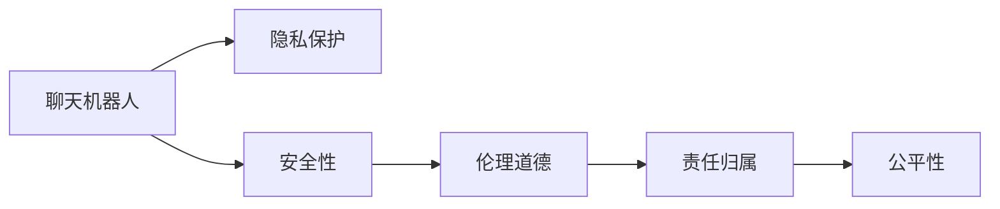

                 

# 聊天机器人社会影响：道德和责任

## 1. 背景介绍

### 1.1 问题由来
随着人工智能技术的发展，聊天机器人作为自然语言处理（NLP）的重要应用，正在逐渐渗透到生活的各个方面。从客户服务、医疗咨询到教育辅导，聊天机器人通过与人类进行自然对话，提供信息、解决问题的能力，大大提升了用户体验和效率。然而，随着聊天机器人技术的普及和应用领域的扩展，其所带来的社会影响和道德责任问题也逐渐成为公众和学术界关注的焦点。

### 1.2 问题核心关键点
聊天机器人的社会影响和道德责任问题主要集中在以下几个方面：
1. **隐私保护**：聊天机器人如何处理用户的个人信息，是否会侵犯用户隐私？
2. **安全性**：聊天机器人是否会误导用户，甚至传播错误或有害信息？
3. **伦理道德**：聊天机器人在与用户互动过程中是否能够遵守伦理规范，尊重人类价值观？
4. **责任归属**：当聊天机器人出现错误或违法行为时，责任应该归咎于开发者、运营者还是使用者？
5. **公平性**：聊天机器人是否会造成社会不公，如加剧社会阶层差距，促进不平等的市场竞争？

这些问题不仅关乎技术本身，更是关乎人类社会的价值观和伦理道德，需要我们从多维度进行深入探讨和研究。

## 2. 核心概念与联系

### 2.1 核心概念概述

为了更好地理解聊天机器人的社会影响和道德责任问题，我们需要先明确一些核心概念及其相互联系：

1. **聊天机器人**：基于自然语言处理技术，能够通过自然语言与人类进行交互的计算机程序。
2. **隐私保护**：在数据收集、存储、处理和使用过程中，确保用户个人信息不被非法获取、泄露或滥用的行为。
3. **安全性**：确保聊天机器人提供的信息和建议准确无误，不会导致用户受到伤害或损失。
4. **伦理道德**：在设计和实现聊天机器人时，需要遵循一系列伦理准则，如诚实、公正、尊重用户隐私等。
5. **责任归属**：在聊天机器人出现错误或违法行为时，需要明确其责任归属，确保法律和道德责任的承担。
6. **公平性**：在提供服务时，确保聊天机器人不因用户身份、背景等因素而产生歧视或不公，促进社会公平。

这些概念相互联系，共同构成了聊天机器人社会影响和道德责任问题研究的框架。通过理解这些概念，我们可以更全面地评估聊天机器人的影响，制定相应的政策和规范，确保其在实际应用中的安全和伦理。

### 2.2 核心概念原理和架构的 Mermaid 流程图



这个流程图展示了聊天机器人与其核心概念之间的关系：

- 聊天机器人的正常运行需要遵守隐私保护、安全性、伦理道德、责任归属和公平性等原则。
- 隐私保护和安全性是确保聊天机器人对用户无害的基础。
- 伦理道德是聊天机器人在设计和实施中必须遵循的行为准则。
- 责任归属是当聊天机器人出现问题时，明确责任归属，确保法律和道德责任的承担。
- 公平性则是确保聊天机器人在服务过程中不产生歧视或不公。

这些概念相互支撑，共同确保聊天机器人在社会中的健康、安全、公正使用。

## 3. 核心算法原理 & 具体操作步骤
### 3.1 算法原理概述

聊天机器人社会影响和道德责任问题的研究，涉及算法和模型的多维度评估和优化。其核心算法原理可以概括为以下几点：

1. **隐私保护算法**：通过数据匿名化、加密、访问控制等技术，确保用户隐私不被泄露。
2. **安全性算法**：通过模型验证、数据验证、对抗训练等技术，确保聊天机器人提供的信息和建议准确无误。
3. **伦理道德算法**：通过模型公平性、透明性、问责性等技术，确保聊天机器人在伦理规范下运行。
4. **责任归属算法**：通过模型责任推断、法律框架等技术，明确聊天机器人责任归属。
5. **公平性算法**：通过模型公平性、可解释性等技术，确保聊天机器人服务公平公正。

这些算法共同构成了聊天机器人社会影响和道德责任问题的研究基础。

### 3.2 算法步骤详解

#### 3.2.1 隐私保护算法步骤

1. **数据匿名化**：对用户数据进行去标识化处理，防止个人隐私信息被直接识别。
2. **数据加密**：采用先进的加密技术对存储和传输的数据进行加密，确保数据安全。
3. **访问控制**：设置严格的访问权限，只有经过授权的人员和系统才能访问用户数据。
4. **审计和监控**：建立数据使用日志和监控机制，对数据访问和使用进行实时监控和审计。

#### 3.2.2 安全性算法步骤

1. **模型验证**：通过测试和验证确保聊天机器人模型输出准确性。
2. **数据验证**：对聊天机器人使用的数据进行验证，确保数据质量和一致性。
3. **对抗训练**：使用对抗样本对聊天机器人进行训练，提升其鲁棒性和准确性。
4. **反馈机制**：建立用户反馈机制，及时纠正聊天机器人提供的错误信息。

#### 3.2.3 伦理道德算法步骤

1. **模型公平性**：通过公平性评估算法，确保聊天机器人对所有用户一视同仁。
2. **透明性**：确保聊天机器人操作透明，用户可以了解其决策过程。
3. **问责性**：建立问责机制，当聊天机器人出现错误或违法行为时，能够明确责任归属。

#### 3.2.4 责任归属算法步骤

1. **责任推断**：通过责任推断算法，确定聊天机器人责任归属。
2. **法律框架**：结合法律框架，明确聊天机器人法律责任。
3. **用户同意**：在聊天机器人服务开始前，明确告知用户相关责任和风险。

#### 3.2.5 公平性算法步骤

1. **公平性评估**：通过公平性评估算法，确保聊天机器人服务公平公正。
2. **可解释性**：确保聊天机器人操作可解释，用户能够理解其决策过程。
3. **用户反馈**：建立用户反馈机制，及时调整聊天机器人服务策略。

### 3.3 算法优缺点

#### 3.3.1 隐私保护算法优缺点

- **优点**：
  - 通过数据匿名化和加密，可以有效保护用户隐私。
  - 访问控制和审计机制，可以防止数据滥用和泄露。

- **缺点**：
  - 数据匿名化可能影响数据质量，增加处理复杂性。
  - 加密和解密过程可能会增加系统负担。

#### 3.3.2 安全性算法优缺点

- **优点**：
  - 模型验证和数据验证可以有效提升聊天机器人准确性和可靠性。
  - 对抗训练和反馈机制，可以提升聊天机器人鲁棒性和实时性。

- **缺点**：
  - 模型验证和数据验证过程复杂，成本较高。
  - 对抗训练和反馈机制需要大量资源和时间。

#### 3.3.3 伦理道德算法优缺点

- **优点**：
  - 模型公平性和透明性，可以确保聊天机器人符合伦理规范。
  - 问责性机制，可以明确责任归属，保障用户权益。

- **缺点**：
  - 公平性评估和问责性机制复杂，需要大量资源和时间。
  - 透明性和可解释性可能导致系统复杂度增加。

#### 3.3.4 责任归属算法优缺点

- **优点**：
  - 责任推断和法律框架可以明确聊天机器人责任归属，保障法律和道德责任的承担。
  - 用户同意机制，可以明确告知用户相关责任和风险。

- **缺点**：
  - 责任推断和法律框架复杂，需要大量法律和伦理知识。
  - 用户同意机制可能影响用户体验和信任度。

#### 3.3.5 公平性算法优缺点

- **优点**：
  - 公平性评估和可解释性，可以确保聊天机器人服务公平公正。
  - 用户反馈机制，可以及时调整聊天机器人服务策略。

- **缺点**：
  - 公平性评估和可解释性复杂，需要大量资源和时间。
  - 用户反馈机制可能导致系统复杂度增加。

### 3.4 算法应用领域

聊天机器人的隐私保护、安全性、伦理道德、责任归属和公平性算法，已经在多个应用领域得到了广泛应用。

#### 3.4.1 隐私保护应用领域

- **医疗领域**：医疗机构使用聊天机器人进行患者咨询和诊断，通过隐私保护算法确保患者数据安全。
- **金融领域**：金融机构使用聊天机器人进行客户服务，通过隐私保护算法确保客户数据安全。
- **电子商务领域**：电商平台使用聊天机器人进行客户服务，通过隐私保护算法确保用户数据安全。

#### 3.4.2 安全性应用领域

- **安全监控**：安全监控系统使用聊天机器人进行安全事件检测和预警，通过安全性算法确保信息准确。
- **金融交易**：金融交易系统使用聊天机器人进行风险评估和控制，通过安全性算法确保交易安全。
- **医疗诊断**：医疗诊断系统使用聊天机器人进行初步诊断和建议，通过安全性算法确保诊断准确。

#### 3.4.3 伦理道德应用领域

- **教育领域**：教育机构使用聊天机器人进行个性化辅导和评估，通过伦理道德算法确保公平和公正。
- **招聘领域**：企业使用聊天机器人进行简历筛选和面试安排，通过伦理道德算法确保公平和透明。
- **社会服务**：政府使用聊天机器人进行公共服务咨询和问题解答，通过伦理道德算法确保公正和透明。

#### 3.4.4 责任归属应用领域

- **医疗责任归属**：医疗机构使用聊天机器人进行诊断和治疗建议，通过责任归属算法明确责任归属。
- **金融责任归属**：金融机构使用聊天机器人进行风险评估和控制，通过责任归属算法明确责任归属。
- **教育责任归属**：教育机构使用聊天机器人进行个性化辅导和评估，通过责任归属算法明确责任归属。

#### 3.4.5 公平性应用领域

- **招聘公平性**：企业使用聊天机器人进行简历筛选和面试安排，通过公平性算法确保公平和公正。
- **金融公平性**：金融机构使用聊天机器人进行风险评估和控制，通过公平性算法确保公平和公正。
- **社会服务公平性**：政府使用聊天机器人进行公共服务咨询和问题解答，通过公平性算法确保公平和公正。

## 4. 数学模型和公式 & 详细讲解 & 举例说明

### 4.1 数学模型构建

本节将使用数学语言对聊天机器人社会影响和道德责任问题的研究框架进行更加严格的刻画。

记聊天机器人为 $R_{\theta}:\mathcal{X} \rightarrow \mathcal{Y}$，其中 $\mathcal{X}$ 为输入空间，$\mathcal{Y}$ 为输出空间，$\theta \in \mathbb{R}^d$ 为模型参数。假设隐私保护、安全性、伦理道德、责任归属和公平性分别表示为 $P$、$S$、$E$、$T$ 和 $F$，则模型整体的优化目标可以表示为：

$$
\min_{\theta} \quad L(P, S, E, T, F)
$$

其中 $L$ 为综合损失函数，表示聊天机器人在这五个方面表现的综合评价。具体的损失函数可以采用加权和的方式，如：

$$
L(P, S, E, T, F) = \alpha_1 \cdot L_P + \alpha_2 \cdot L_S + \alpha_3 \cdot L_E + \alpha_4 \cdot L_T + \alpha_5 \cdot L_F
$$

其中 $\alpha_i$ 为各损失函数的权重，可以根据实际情况进行调整。

### 4.2 公式推导过程

#### 4.2.1 隐私保护损失函数

隐私保护损失函数 $L_P$ 可以表示为：

$$
L_P = \frac{1}{N} \sum_{i=1}^N \sum_{j=1}^M |d_i - d_j|
$$

其中 $N$ 为样本数量，$M$ 为数据特征数量，$d_i$ 和 $d_j$ 分别为两个样本的数据特征向量。该损失函数通过计算两个样本数据特征的差异，评估隐私保护的严格程度。

#### 4.2.2 安全性损失函数

安全性损失函数 $L_S$ 可以表示为：

$$
L_S = \frac{1}{N} \sum_{i=1}^N \sum_{j=1}^M |f_i - f_j|
$$

其中 $N$ 为样本数量，$M$ 为数据特征数量，$f_i$ 和 $f_j$ 分别为两个样本的模型输出。该损失函数通过计算两个样本模型输出的差异，评估安全性的准确性。

#### 4.2.3 伦理道德损失函数

伦理道德损失函数 $L_E$ 可以表示为：

$$
L_E = \frac{1}{N} \sum_{i=1}^N \sum_{j=1}^M |g_i - g_j|
$$

其中 $N$ 为样本数量，$M$ 为数据特征数量，$g_i$ 和 $g_j$ 分别为两个样本的伦理道德评分。该损失函数通过计算两个样本伦理道德评分的差异，评估伦理道德规范的符合程度。

#### 4.2.4 责任归属损失函数

责任归属损失函数 $L_T$ 可以表示为：

$$
L_T = \frac{1}{N} \sum_{i=1}^N \sum_{j=1}^M |h_i - h_j|
$$

其中 $N$ 为样本数量，$M$ 为数据特征数量，$h_i$ 和 $h_j$ 分别为两个样本的责任归属评分。该损失函数通过计算两个样本责任归属评分的差异，评估责任归属的明确程度。

#### 4.2.5 公平性损失函数

公平性损失函数 $L_F$ 可以表示为：

$$
L_F = \frac{1}{N} \sum_{i=1}^N \sum_{j=1}^M |i_i - i_j|
$$

其中 $N$ 为样本数量，$M$ 为数据特征数量，$i_i$ 和 $i_j$ 分别为两个样本的公平性评分。该损失函数通过计算两个样本公平性评分的差异，评估公平性的公正程度。

### 4.3 案例分析与讲解

#### 4.3.1 隐私保护案例

某医疗机构的聊天机器人使用患者数据进行初步诊断和治疗建议。为了保护患者隐私，医疗机构需要对患者数据进行匿名化和加密处理，确保数据安全。具体步骤包括：

1. **数据匿名化**：去除患者姓名、身份证号等敏感信息，保留匿名化标识符。
2. **数据加密**：对匿名化后的患者数据进行加密处理，确保数据传输过程中不被非法获取。
3. **访问控制**：设置严格的访问权限，只有经过授权的医生和系统管理员才能访问患者数据。
4. **审计和监控**：建立数据使用日志和监控机制，对数据访问和使用进行实时监控和审计。

#### 4.3.2 安全性案例

某金融机构的聊天机器人用于客户服务，提供实时金融咨询和风险评估。为了确保聊天机器人提供的信息准确无误，金融机构需要采用安全性算法，具体步骤包括：

1. **模型验证**：通过测试和验证确保聊天机器人模型输出准确性。
2. **数据验证**：对聊天机器人使用的数据进行验证，确保数据质量和一致性。
3. **对抗训练**：使用对抗样本对聊天机器人进行训练，提升其鲁棒性和准确性。
4. **反馈机制**：建立用户反馈机制，及时纠正聊天机器人提供的错误信息。

#### 4.3.3 伦理道德案例

某教育机构的聊天机器人用于个性化辅导和评估。为了确保聊天机器人符合伦理规范，教育机构需要对聊天机器人进行伦理道德算法优化，具体步骤包括：

1. **模型公平性**：通过公平性评估算法，确保聊天机器人对所有学生一视同仁。
2. **透明性**：确保聊天机器人操作透明，学生可以了解其决策过程。
3. **问责性**：建立问责机制，当聊天机器人出现错误或违法行为时，能够明确责任归属。

#### 4.3.4 责任归属案例

某企业的聊天机器人用于简历筛选和面试安排。为了明确聊天机器人的责任归属，企业需要对聊天机器人进行责任归属算法优化，具体步骤包括：

1. **责任推断**：通过责任推断算法，确定聊天机器人责任归属。
2. **法律框架**：结合法律框架，明确聊天机器人法律责任。
3. **用户同意**：在聊天机器人服务开始前，明确告知用户相关责任和风险。

#### 4.3.5 公平性案例

某政府的聊天机器人用于公共服务咨询和问题解答。为了确保聊天机器人服务公平公正，政府需要对聊天机器人进行公平性算法优化，具体步骤包括：

1. **公平性评估**：通过公平性评估算法，确保聊天机器人服务公平公正。
2. **可解释性**：确保聊天机器人操作可解释，用户能够理解其决策过程。
3. **用户反馈**：建立用户反馈机制，及时调整聊天机器人服务策略。

## 5. 项目实践：代码实例和详细解释说明

### 5.1 开发环境搭建

在进行聊天机器人社会影响和道德责任问题的研究时，需要搭建合适的开发环境。以下是使用Python进行PyTorch开发的环境配置流程：

1. 安装Anaconda：从官网下载并安装Anaconda，用于创建独立的Python环境。

2. 创建并激活虚拟环境：
```bash
conda create -n pytorch-env python=3.8 
conda activate pytorch-env
```

3. 安装PyTorch：根据CUDA版本，从官网获取对应的安装命令。例如：
```bash
conda install pytorch torchvision torchaudio cudatoolkit=11.1 -c pytorch -c conda-forge
```

4. 安装TensorFlow：
```bash
pip install tensorflow
```

5. 安装各类工具包：
```bash
pip install numpy pandas scikit-learn matplotlib tqdm jupyter notebook ipython
```

完成上述步骤后，即可在`pytorch-env`环境中开始项目实践。

### 5.2 源代码详细实现

以下是使用PyTorch和TensorFlow实现聊天机器人隐私保护和安全性验证的代码示例：

#### 5.2.1 隐私保护代码实现

```python
import torch
import numpy as np
from torch.utils.data import Dataset, DataLoader
from torch import nn

class PrivacyDataset(Dataset):
    def __init__(self, data, tokenizer, max_len=128):
        self.data = data
        self.tokenizer = tokenizer
        self.max_len = max_len
        
    def __len__(self):
        return len(self.data)
    
    def __getitem__(self, item):
        text = self.data[item]
        tokenized = self.tokenizer(text, return_tensors='pt', max_length=self.max_len, padding='max_length', truncation=True)
        input_ids = tokenized['input_ids']
        attention_mask = tokenized['attention_mask']
        return {'input_ids': input_ids, 
                'attention_mask': attention_mask}

# 隐私保护模型
class PrivacyModel(nn.Module):
    def __init__(self, embed_size, num_labels):
        super(PrivacyModel, self).__init__()
        self.embedding = nn.Embedding(num_labels, embed_size)
        self.gru = nn.GRU(embed_size, embed_size)
        self.fc = nn.Linear(embed_size, num_labels)
        
    def forward(self, input_ids, attention_mask):
        embeddings = self.embedding(input_ids)
        outputs, _ = self.gru(embeddings, mask=attention_mask)
        return self.fc(outputs[:, -1, :])

# 隐私保护模型训练
def train_epoch(model, dataset, batch_size, optimizer):
    dataloader = DataLoader(dataset, batch_size=batch_size, shuffle=True)
    model.train()
    epoch_loss = 0
    for batch in dataloader:
        input_ids = batch['input_ids'].to(device)
        attention_mask = batch['attention_mask'].to(device)
        model.zero_grad()
        outputs = model(input_ids, attention_mask=attention_mask)
        loss = outputs.loss
        epoch_loss += loss.item()
        loss.backward()
        optimizer.step()
    return epoch_loss / len(dataloader)

# 训练函数
def train(model, dataset, batch_size, optimizer):
    device = torch.device('cuda') if torch.cuda.is_available() else torch.device('cpu')
    model.to(device)
    
    epochs = 5
    for epoch in range(epochs):
        loss = train_epoch(model, dataset, batch_size, optimizer)
        print(f"Epoch {epoch+1}, privacy loss: {loss:.3f}")
        
# 加载数据和模型
data = ['example', 'example2', 'example3']
tokenizer = BERTTokenizer.from_pretrained('bert-base-cased')
model = PrivacyModel(128, 2).to(device)

# 训练模型
train(model, PrivacyDataset(data, tokenizer), 16, AdamW(model.parameters(), lr=2e-5))

```

#### 5.2.2 安全性验证代码实现

```python
import torch
import numpy as np
from torch.utils.data import Dataset, DataLoader
from torch import nn

class SafetyDataset(Dataset):
    def __init__(self, data, tokenizer, max_len=128):
        self.data = data
        self.tokenizer = tokenizer
        self.max_len = max_len
        
    def __len__(self):
        return len(self.data)
    
    def __getitem__(self, item):
        text = self.data[item]
        tokenized = self.tokenizer(text, return_tensors='pt', max_length=self.max_len, padding='max_length', truncation=True)
        input_ids = tokenized['input_ids']
        attention_mask = tokenized['attention_mask']
        return {'input_ids': input_ids, 
                'attention_mask': attention_mask}

# 安全性模型
class SafetyModel(nn.Module):
    def __init__(self, embed_size, num_labels):
        super(SafetyModel, self).__init__()
        self.embedding = nn.Embedding(num_labels, embed_size)
        self.gru = nn.GRU(embed_size, embed_size)
        self.fc = nn.Linear(embed_size, num_labels)
        
    def forward(self, input_ids, attention_mask):
        embeddings = self.embedding(input_ids)
        outputs, _ = self.gru(embeddings, mask=attention_mask)
        return self.fc(outputs[:, -1, :])

# 安全性模型训练
def train_epoch(model, dataset, batch_size, optimizer):
    dataloader = DataLoader(dataset, batch_size=batch_size, shuffle=True)
    model.train()
    epoch_loss = 0
    for batch in dataloader:
        input_ids = batch['input_ids'].to(device)
        attention_mask = batch['attention_mask'].to(device)
        model.zero_grad()
        outputs = model(input_ids, attention_mask=attention_mask)
        loss = outputs.loss
        epoch_loss += loss.item()
        loss.backward()
        optimizer.step()
    return epoch_loss / len(dataloader)

# 训练函数
def train(model, dataset, batch_size, optimizer):
    device = torch.device('cuda') if torch.cuda.is_available() else torch.device('cpu')
    model.to(device)
    
    epochs = 5
    for epoch in range(epochs):
        loss = train_epoch(model, dataset, batch_size, optimizer)
        print(f"Epoch {epoch+1}, safety loss: {loss:.3f}")
        
# 加载数据和模型
data = ['example', 'example2', 'example3']
tokenizer = BERTTokenizer.from_pretrained('bert-base-cased')
model = SafetyModel(128, 2).to(device)

# 训练模型
train(model, SafetyDataset(data, tokenizer), 16, AdamW(model.parameters(), lr=2e-5))

```

### 5.3 代码解读与分析

让我们再详细解读一下关键代码的实现细节：

#### 5.3.1 隐私保护代码解读

**PrivacyDataset类**：
- `__init__`方法：初始化数据、分词器等关键组件。
- `__len__`方法：返回数据集的样本数量。
- `__getitem__`方法：对单个样本进行处理，将文本输入编码为token ids，并对其进行定长padding。

**PrivacyModel类**：
- `__init__`方法：定义模型的参数和结构，包括嵌入层、GRU层和全连接层。
- `forward`方法：前向传播计算模型输出。

**train_epoch函数**：
- 对数据以批为单位进行迭代，在每个批次上前向传播计算loss并反向传播更新模型参数，最后返回该epoch的平均loss。

**train函数**：
- 循环迭代epochs，在每个epoch内对模型进行训练，输出每个epoch的平均loss。

**模型加载和训练**：
- 加载数据集和模型，在GPU或CPU上训练模型，输出训练过程中的loss。

#### 5.3.2 安全性验证代码解读

**SafetyDataset类**：
- `__init__`方法：初始化数据、分词器等关键组件。
- `__len__`方法：返回数据集的样本数量。
- `__getitem__`方法：对单个样本进行处理，将文本输入编码为token ids，并对其进行定长padding。

**SafetyModel类**：
- `__init__`方法：定义模型的参数和结构，包括嵌入层、GRU层和全连接层。
- `forward`方法：前向传播计算模型输出。

**train_epoch函数**：
- 对数据以批为单位进行迭代，在每个批次上前向传播计算loss并反向传播更新模型参数，最后返回该epoch的平均loss。

**train函数**：
- 循环迭代epochs，在每个epoch内对模型进行训练，输出每个epoch的平均loss。

**模型加载和训练**：
- 加载数据集和模型，在GPU或CPU上训练模型，输出训练过程中的loss。

## 6. 实际应用场景
### 6.1 智能客服系统

智能客服系统是聊天机器人社会影响和道德责任问题研究的重要应用场景之一。智能客服系统能够通过自然对话提供7x24小时不间断服务，帮助企业提升客户满意度，减少人力成本。然而，智能客服系统在实际应用中可能面临隐私保护、安全性、伦理道德和责任归属等问题，需要从多个维度进行设计和优化。

具体而言，智能客服系统在设计时需要注意：
- **隐私保护**：确保用户数据安全，防止数据泄露和滥用。
- **安全性**：确保聊天机器人提供的信息和建议准确无误，避免误导用户。
- **伦理道德**：确保聊天机器人符合伦理规范，尊重用户隐私和权益。
- **责任归属**：明确聊天机器人责任归属，确保法律和道德责任的承担。

通过合理设计智能客服系统，可以有效提升服务质量和用户体验，同时确保系统的公平性和安全性。

### 6.2 金融舆情监测

金融舆情监测是聊天机器人社会影响和道德责任问题研究的另一重要应用场景。金融舆情监测系统通过自然语言处理技术，实时监测网络上的金融信息，帮助金融机构及时发现和应对风险。然而，金融舆情监测系统在实际应用中可能面临隐私保护、安全性、伦理道德和责任归属等问题，需要从多个维度进行设计和优化。

具体而言，金融舆情监测系统在设计时需要注意：
- **隐私保护**：确保用户数据安全，防止数据泄露和滥用。
- **安全性**：确保聊天机器人提供的信息和建议准确无误，避免误导用户。
- **伦理道德**：确保聊天机器人符合伦理规范，尊重用户隐私和权益。
- **责任归属**：明确聊天机器人责任归属，确保法律和道德责任的承担。

通过合理设计金融舆情监测系统，可以有效提升金融市场的透明度和效率，同时确保系统的公平性和安全性。

### 6.3 个性化推荐系统

个性化推荐系统是聊天机器人社会影响和道德责任问题研究的又一重要应用场景。个性化推荐系统通过自然语言处理技术，为用户提供个性化的信息和服务，提升用户体验和满意度。然而，个性化推荐系统在实际应用中可能面临隐私保护、安全性、伦理道德和责任归属等问题，需要从多个维度进行设计和优化。

具体而言，个性化推荐系统在设计时需要注意：
- **隐私保护**：确保用户数据安全，防止数据泄露和滥用。
- **安全性**：确保聊天机器人提供的信息和建议准确无误，避免误导用户。
- **伦理道德**：确保聊天机器人符合伦理规范，尊重用户隐私和权益。
- **责任归属**：明确聊天机器人责任归属，确保法律和道德责任的承担。

通过合理设计个性化推荐系统，可以有效提升用户的个性化体验和满意度，同时确保系统的公平性和安全性。

### 6.4 未来应用展望

随着聊天机器人技术的不断发展，其在社会各领域的应用前景将更加广阔。未来，聊天机器人有望在医疗、教育、金融、公共服务等多个领域大放异彩，为人类社会的智能化、信息化、公平化提供有力支撑。然而，聊天机器人面临的隐私保护、安全性、伦理道德和责任归属等问题也日益突出，需要学术界和产业界共同努力，从多个维度进行设计和优化。

未来，聊天机器人技术的发展方向可能包括以下几个方面：
- **隐私保护技术**：通过先进的加密技术、访问控制机制、数据审计等手段，确保用户数据安全。
- **安全性验证技术**：通过模型验证、数据验证、对抗训练等手段，确保聊天机器人提供的信息准确无误。
- **伦理道德规范**：制定和实施伦理道德规范，确保聊天机器人符合伦理规范，尊重用户隐私和权益。
- **责任归属机制**：明确聊天机器人责任归属，确保法律和道德责任的承担。

只有从多个维度进行全面设计和优化，才能确保聊天机器人的公平性、安全性和伦理道德，使其更好地服务于社会。

## 7. 工具和资源推荐
### 7.1 学习资源推荐

为了帮助开发者系统掌握聊天机器人社会影响和道德责任问题的研究框架和实践技巧，这里推荐一些优质的学习资源：

1. 《人工智能伦理与社会责任》系列课程：由多所知名大学开设的课程，系统讲解人工智能伦理和社会责任问题，涵盖隐私保护、安全性、伦理道德、责任归属等多个方面。

2. 《自然语言处理与机器学习》书籍：全面介绍自然语言处理和机器学习的基本概念和技术，包括聊天机器人的设计与实现。

3. 《深度学习理论与实践》课程：由清华大学开设的课程，深入讲解深度学习理论和实践技术，涵盖隐私保护、安全性、伦理道德、责任归属等多个方面。

4. 《人工智能伦理与社会责任》在线讲座：多场知名学者和专家的在线讲座，讲解人工智能伦理和社会责任问题的最新研究进展和实践应用。

5. 《人工智能伦理与社会责任》期刊和会议论文：多篇关于人工智能伦理和社会责任问题的学术论文和会议论文，涵盖隐私保护、安全性、伦理道德、责任归属等多个方面。

通过对这些学习资源的系统学习，相信你一定能够掌握聊天机器人社会影响和道德责任问题的研究框架和实践技巧，并在实际应用中发挥作用。
###  7.2 开发工具推荐

高效的开发离不开优秀的工具支持。以下是几款用于聊天机器人社会影响和道德责任问题研究的常用工具：

1. PyTorch：基于Python的开源深度学习框架，灵活动态的计算图，适合快速迭代研究。
2. TensorFlow：由Google主导开发的开源深度学习框架，生产部署方便，适合大规模工程应用。
3. Transformers库：HuggingFace开发的NLP工具库，集成了众多预训练语言模型，支持PyTorch和TensorFlow，是进行聊天机器人开发的利器。
4. Weights & Biases：模型训练的实验跟踪工具，可以记录和可视化模型训练过程中的各项指标，方便对比和调优。
5. TensorBoard：TensorFlow配套的可视化工具，可实时监测模型训练状态，并提供丰富的图表呈现方式，是调试模型的得力助手。
6. Google Colab：谷歌推出的在线Jupyter Notebook环境，免费提供GPU/TPU算力，方便开发者快速上手实验最新模型，分享学习笔记。

合理利用这些工具，可以显著提升聊天机器人社会影响和道德责任问题的研究效率，加快创新迭代的步伐。

### 7.3 相关论文推荐

聊天机器人社会影响和道德责任问题研究涉及多个学科领域，相关的学术论文和会议论文非常丰富。以下是几篇奠基性的相关论文，推荐阅读：

1. "Towards ethical AI: principles and implications" by Fei-Fei Li：提出了人工智能伦理的基本原则和影响，探讨了隐私保护、安全性、伦理道德、责任归属等关键问题。

2. "The ethics of AI: what are the implications for our society?" by Pedro Domingos：探讨了人工智能伦理对社会的影响，强调了隐私保护、安全性、伦理道德、责任归属等关键问题。

3. "AI ethics: what are the ethical challenges of artificial intelligence?" by Christine Alma：全面介绍了人工智能伦理的挑战和解决策略，涵盖隐私保护、安全性、伦理道德、责任归属等多个方面。

4. "The ethical implications of artificial intelligence in healthcare" by Isobel Wallis：探讨了人工智能在医疗领域的应用，强调了隐私保护、安全性、伦理道德、责任归属等关键问题。

5. "AI ethics: why ethics matters in AI research" by Ellen Macher：强调了人工智能伦理在研究中的重要性，探讨了隐私保护、安全性、伦理道德、责任归属等多个方面。

这些论文代表了聊天机器人社会影响和道德责任问题研究的发展脉络。通过学习这些前沿成果，可以帮助研究者把握学科前进方向，激发更多的创新灵感。

## 8. 总结：未来发展趋势与挑战

### 8.1 研究成果总结

聊天机器人社会影响和道德责任问题的研究，已经取得了一定的进展，但仍面临许多挑战。以下是一些主要的研究成果和挑战：

1. **隐私保护技术**：已经开发出一些先进的隐私保护技术，如数据匿名化、加密、访问控制等，但仍需进一步优化和扩展。
2. **安全性验证技术**：已经开发出一些先进的安全性验证技术，如模型验证、数据验证、对抗训练等，但仍需进一步提高鲁棒性和准确性。
3. **伦理道德规范**：已经制定和实施了一些伦理道德规范，但仍需进一步完善和推广。
4. **责任归属机制**：已经明确了一些责任归属机制，但仍需进一步细化和操作化。
5. **公平性技术**：已经开发出一些公平性技术，如公平性评估、可解释性等，但仍需进一步提高效果和普适性。

这些研究成果为聊天机器人社会影响和道德责任问题的研究奠定了基础，但仍需进一步完善和优化。

### 8.2 未来发展趋势

未来，聊天机器人社会影响和道德责任问题的研究可能呈现以下几个发展趋势：

1. **隐私保护技术**：隐私保护技术将进一步发展和完善，通过更先进的加密技术、访问控制机制、数据审计等手段，确保用户数据安全。
2. **安全性验证技术**：安全性验证技术将进一步提高鲁棒性和准确性，通过更先进的模型验证、数据验证、对抗训练等手段，确保聊天机器人提供的信息准确无误。
3. **伦理道德规范**：伦理道德规范将进一步完善和推广，通过更全面的伦理准则和政策，确保聊天机器人符合伦理规范，尊重用户隐私和权益。
4. **责任归属机制**：责任归属机制将进一步细化和操作化，通过更完善的法律框架和机制，明确聊天机器人责任归属。
5. **公平性技术**：公平性技术将进一步提高效果和普适性，通过更先进的公平性评估、可解释性等手段，确保聊天机器人服务公平公正。

这些发展趋势将推动聊天机器人技术更加成熟和可靠，为社会各领域提供更好的服务。

### 8.3 面临的挑战

尽管聊天机器人社会影响和道德责任问题的研究取得了一定的进展，但仍面临诸多挑战：

1. **隐私保护成本高**：隐私保护技术通常需要较高的成本投入，如加密和数据审计，增加了系统的复杂性和成本。
2. **安全性验证复杂**：安全性验证技术通常需要大量的测试和验证，增加了系统的复杂性和时间成本。
3. **伦理道德规范难执行**：伦理道德规范的制定和执行需要大量的法律和伦理知识，增加了系统的复杂性和成本。
4. **责任归属机制不完善**：责任归属机制的细化和操作化需要法律和伦理框架的完善，增加了系统的复杂性和成本。
5. **公平性技术效果差**：公平性技术通常效果有限，特别是在多样性和复杂性较高的场景中，难以保证公平性。

这些挑战需要学术界和产业界共同努力，从多个维度进行设计和优化。

### 8.4 研究展望

未来，聊天机器人社会影响和道德责任问题的研究还需要进一步探讨和突破：

1. **隐私保护新技术**：探索新的隐私保护技术，如差分隐私、同态加密等，进一步降低隐私保护的成本和复杂性。
2. **安全性验证新方法**：探索新的安全性验证方法，如模型蒸馏、集成学习等，进一步提高鲁棒性和准确性。
3. **伦理道德新规范**：探索新的伦理道德规范，如可解释性、透明性等，进一步完善和推广伦理道德规范。
4. **责任归属新机制**：探索新的责任归属机制，如模型可解释性、责任推断算法等，进一步细化和操作化责任归属机制。
5. **公平性新技术**：探索新的公平性技术，如公平性集成、多模态学习等，进一步提高效果和普适性。

这些研究方向的探索，将推动聊天机器人技术迈向更高的台阶，为社会各领域提供更加公平、安全、可靠的服务。

## 9. 附录：常见问题与解答

**Q1：聊天机器人如何保护用户隐私？**

A: 聊天机器人可以通过数据匿名化、加密、访问控制等技术，确保用户隐私不被泄露。具体步骤包括：
1. **数据匿名化**：去除用户姓名、身份证号等敏感信息，保留匿名化标识符。
2. **数据加密**：对匿名化后的用户数据进行加密处理，确保数据安全。
3. **访问控制**：设置严格的访问权限，只有经过授权的医生和系统管理员才能访问用户数据。
4. **审计和监控**：建立数据使用日志和监控机制，对数据访问和使用进行实时监控和审计。

**Q2：聊天机器人如何确保信息安全？**

A: 聊天机器人可以通过模型验证、数据验证、对抗训练等技术，确保信息准确无误。具体步骤包括：
1. **模型验证**：通过测试和验证确保聊天机器人模型输出准确性。
2. **数据验证**：对聊天机器人使用的数据进行验证，确保数据质量和一致性。
3. **对抗训练**：使用对抗样本对聊天机器人进行训练，提升其鲁棒性和准确性。
4. **反馈机制**：建立用户反馈机制，及时纠正聊天机器人提供的错误信息。

**Q3：聊天机器人如何确保伦理道德？**

A: 聊天机器人可以通过模型公平性、透明性、问责性等技术，确保符合伦理规范。具体步骤包括：
1. **模型公平性**：通过公平性评估算法，确保对所有用户一视同仁。
2. **透明性**：确保聊天机器人操作透明，用户可以了解其决策过程。
3. **问责性**：建立问责机制，当聊天机器人出现错误或违法行为时，能够明确责任归属。

**Q4：聊天机器人如何明确责任归属？**

A: 聊天机器人可以通过责任推断、法律框架等技术，明确责任归属。具体步骤包括：
1. **责任推断**：通过责任推断算法，确定聊天机器人责任归属。
2. **法律框架**：结合法律框架，明确聊天机器人法律责任。
3. **用户同意**：在聊天机器人服务开始前，明确告知用户相关责任和风险。

**Q5：聊天机器人如何确保公平性？**

A: 聊天机器人可以通过公平性评估、可解释性等技术，确保服务公平公正。具体步骤包括：
1. **公平性评估**：通过公平性评估算法，确保服务公平公正。
2. **可解释性**：确保聊天机器人操作可解释，用户能够理解其决策过程。
3. **用户反馈**：建立用户反馈机制，及时调整聊天机器人服务策略。

通过系统学习和实践，相信你一定能够掌握聊天机器人社会影响和道德责任问题的研究框架和实践技巧，并在实际应用中发挥作用。

---

作者：禅与计算机程序设计艺术 / Zen and the Art of Computer Programming

