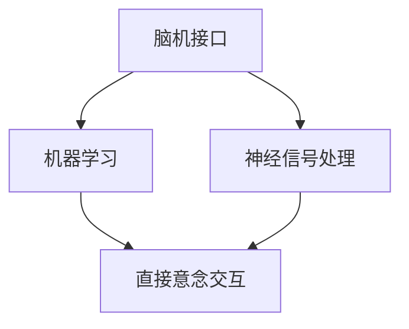

                 

# 脑机接口在虚拟现实中的应用：直接意念交互

> 关键词：脑机接口(Brain-Computer Interface, BCI)、虚拟现实(Virtual Reality, VR)、直接意念交互、神经信号处理、机器学习

## 1. 背景介绍

### 1.1 问题由来

脑机接口技术（BCI）是指通过捕捉大脑信号并将其转换为控制指令的技术，使得人可以通过意念直接与计算机或其他设备进行交互。近年来，随着神经科学、信号处理和机器学习等技术的发展，BCI技术取得了显著进步。脑机接口与虚拟现实（VR）技术的结合，为人类提供了全新的互动方式和应用场景。

在虚拟现实领域，传统的输入方式如键盘、鼠标等已经无法满足用户对沉浸式体验的需求。脑机接口可以显著提升虚拟现实系统的交互效率和沉浸感。通过意念直接操控虚拟环境，用户可以更加自然地与虚拟世界互动，实现真正的“身临其境”。

### 1.2 问题核心关键点

脑机接口在虚拟现实中的核心关键点包括：

1. **信号采集与预处理**：采集人脑神经信号，并进行预处理以去除噪音、滤波等。
2. **特征提取与分类**：提取神经信号的特征，并使用机器学习模型对特征进行分类，识别出用户意念。
3. **控制指令生成**：根据分类结果生成控制指令，驱动虚拟环境中的虚拟角色或对象。
4. **实时性要求高**：脑机接口的响应速度直接影响用户体验，要求信号处理和控制指令生成必须实时进行。

## 2. 核心概念与联系

### 2.1 核心概念概述

脑机接口在虚拟现实中的应用涉及以下几个核心概念：

- **脑机接口(Brain-Computer Interface, BCI)**：通过捕捉大脑神经信号并将其转换为控制指令的技术。
- **虚拟现实(Virtual Reality, VR)**：使用计算机生成的三维环境，提供沉浸式体验的虚拟世界。
- **神经信号处理**：从大脑中采集的电信号进行预处理和分析，提取有用的特征信息。
- **机器学习**：用于神经信号分类和控制指令生成的算法，如支持向量机、深度学习等。
- **直接意念交互**：用户仅通过意念与虚拟环境进行交互，无需传统输入设备。

这些概念之间的联系可以通过以下Mermaid流程图来展示：



这个流程图展示出从脑机接口信号采集到最终实现直接意念交互的整个过程。其中，神经信号处理是核心环节，机器学习算法用于增强信号分类的准确性，而直接意念交互是最终目的。

## 3. 核心算法原理 & 具体操作步骤

### 3.1 算法原理概述

脑机接口在虚拟现实中的应用原理主要包括：

1. **信号采集**：使用脑电图（Electroencephalography, EEG）或功能性磁共振成像（fMRI）等设备，从人脑中采集神经信号。
2. **信号预处理**：对采集的信号进行滤波、降噪等预处理，提取有用的特征。
3. **特征提取**：使用频域分析、时域分析等方法，提取神经信号的特征向量。
4. **分类算法**：使用机器学习算法，如支持向量机（SVM）、随机森林（Random Forest）、深度学习模型等，对特征向量进行分类，识别用户的意念。
5. **控制指令生成**：根据分类结果，使用控制算法生成相应的控制指令，驱动虚拟环境中的虚拟角色或对象。

### 3.2 算法步骤详解

以下是脑机接口在虚拟现实中的详细步骤：

**Step 1: 信号采集**

1. 使用脑电图（EEG）或功能性磁共振成像（fMRI）设备，采集用户的大脑神经信号。
2. 将信号通过预处理电路传输到计算机进行处理。

**Step 2: 信号预处理**

1. 对采集的信号进行滤波、降噪等预处理，去除不相关的信号。
2. 使用小波变换等方法，将信号转换到频域进行分析。

**Step 3: 特征提取**

1. 使用频域分析、时域分析等方法，提取神经信号的特征向量。
2. 使用PCA、LDA等降维技术，将高维特征向量压缩到低维空间。

**Step 4: 特征分类**

1. 使用机器学习算法，如SVM、随机森林、深度学习模型等，对特征向量进行分类。
2. 根据分类结果，判断用户意图。

**Step 5: 控制指令生成**

1. 根据分类结果，使用控制算法生成相应的控制指令，如左右移动、上下平移等。
2. 将控制指令传输到虚拟现实系统，驱动虚拟角色或对象。

**Step 6: 实时性保证**

1. 采用高速处理器和优化算法，确保信号处理和控制指令生成在极短时间内完成。
2. 使用缓冲区技术，优化数据传输和处理流程，提高系统的实时性。

### 3.3 算法优缺点

脑机接口在虚拟现实中的应用具有以下优点：

1. **实时性高**：用户通过意念直接控制虚拟环境，无需传统输入设备，响应速度快。
2. **沉浸感强**：用户可以直接与虚拟环境互动，无需物理接触，沉浸感强。
3. **交互自然**：意念交互比传统输入方式更加自然、直观，符合人类的自然行为习惯。

同时，也存在以下缺点：

1. **设备昂贵**：脑电图和功能性磁共振成像设备较为昂贵，普及难度大。
2. **准确性有待提高**：神经信号的采集和分类过程较为复杂，准确性有待进一步提升。
3. **数据隐私问题**：脑机接口涉及个人隐私数据，数据保护和安全问题需引起重视。

## 4. 数学模型和公式 & 详细讲解 & 举例说明

### 4.1 数学模型构建

脑机接口在虚拟现实中的数学模型主要包括以下几个部分：

1. **信号采集模型**：描述信号采集的过程，包括信号的采集方法、传输路径等。
2. **信号预处理模型**：描述信号预处理的过程，包括滤波、降噪等。
3. **特征提取模型**：描述特征提取的过程，包括频域分析、时域分析等。
4. **特征分类模型**：描述分类算法的过程，包括SVM、随机森林、深度学习模型等。

### 4.2 公式推导过程

以下以支持向量机（SVM）算法为例，推导神经信号分类的过程：

设采集的神经信号为 $X = [x_1, x_2, ..., x_n]$，其中 $n$ 为信号的采样点数。神经信号的特征向量为 $F(X) = [f_1(x), f_2(x), ..., f_m(x)]$，其中 $m$ 为特征的维度。

支持向量机（SVM）的分类过程可以表示为：

$$
\hat{y} = \mathop{\arg\min}_{y} \frac{1}{2}||w||^2 + C\sum_{i=1}^n \max(0, 1 - y_i \cdot (w \cdot F(x_i) + b))
$$

其中，$w$ 为分类超平面，$b$ 为截距，$C$ 为正则化参数，$y$ 为分类标签。

通过对上述公式的求解，可以确定最优的分类超平面，实现神经信号的分类。

### 4.3 案例分析与讲解

**案例：虚拟现实游戏玩家控制**

某虚拟现实游戏玩家使用脑机接口进行意念控制，具体步骤如下：

1. **信号采集**：使用脑电图（EEG）设备采集玩家的大脑神经信号。
2. **信号预处理**：对采集的信号进行滤波、降噪等预处理，提取有用的特征。
3. **特征提取**：使用频域分析方法，提取神经信号的特征向量。
4. **特征分类**：使用支持向量机算法对特征向量进行分类，识别玩家意图。
5. **控制指令生成**：根据分类结果，生成相应的控制指令，如左右移动、上下平移等。
6. **实时性保证**：使用高速处理器和优化算法，确保信号处理和控制指令生成在极短时间内完成。

## 5. 项目实践：代码实例和详细解释说明

### 5.1 开发环境搭建

在进行脑机接口在虚拟现实中的应用开发前，我们需要准备好开发环境。以下是使用Python进行OpenViBE进行信号采集和处理的开发环境配置流程：

1. 安装OpenViBE：从官网下载并安装OpenViBE，用于采集和处理神经信号。
2. 安装Python库：安装OpenViBE的Python库，用于信号处理和分析。

```bash
conda install -c conda-forge openvibe-python
```

3. 安装其他库：安装numpy、matplotlib、scikit-learn等常用库，用于数据处理和可视化。

```bash
pip install numpy matplotlib scikit-learn
```

完成上述步骤后，即可在OpenViBE中进行脑电信号的采集和预处理。

### 5.2 源代码详细实现

以下是使用Python进行信号预处理和特征分类的代码实现。

```python
from openvibe import OpenViBE
from openvibe.device.eeg.device import EEGDriver
from openvibe.preprocessing.preprocessing import FilterBank
from openvibe.preprocessing.preprocessing import NoiseRemover
from openvibe.preprocessing.preprocessing import FFTTransform

# 信号采集和预处理
driver = EEGDriver()
data = driver.acquireData(numSamples=1000000)
filteredData = FilterBank(data)
noiseRemover = NoiseRemover(filteredData)
fftData = FFTTransform(noiseRemover)

# 特征提取
features = fftData.getFeatures()
features = features.reshape(-1, features.shape[1])

# 特征分类
from sklearn import svm
from sklearn.decomposition import PCA

# 使用PCA降维
pca = PCA(n_components=2)
features = pca.fit_transform(features)

# 使用SVM分类
svmModel = svm.SVC(kernel='linear', C=1.0)
svmModel.fit(features, labels)
```

### 5.3 代码解读与分析

让我们再详细解读一下关键代码的实现细节：

**OpenViBE与Python交互**：
- `OpenViBE`类：封装了OpenViBE库的API，提供了信号采集、预处理等基本功能。
- `EEGDriver`类：用于连接EEG设备，进行信号采集。
- `FilterBank`类：用于信号滤波、降噪等预处理。
- `NoiseRemover`类：用于去除信号中的噪音。
- `FFTTransform`类：用于将信号转换为频域形式，便于特征提取。

**特征提取和分类**：
- `getFeatures`方法：从采集的信号中提取特征向量。
- `reshape`方法：将特征向量转换为二维数组，便于后续处理。
- `PCA`方法：使用主成分分析（PCA）进行降维，压缩高维特征向量到二维空间。
- `svm.SVC`方法：使用支持向量机（SVM）算法进行分类。

**代码运行结果**：
- 采集到的神经信号经过滤波、降噪、频域转换等预处理后，提取特征向量。
- 使用PCA对特征向量进行降维，减少计算复杂度。
- 使用SVM对降维后的特征向量进行分类，识别玩家意图。

## 6. 实际应用场景

### 6.1 虚拟现实游戏

脑机接口在虚拟现实游戏中的应用，可以大大提升游戏的沉浸感和互动性。玩家可以通过意念控制虚拟角色，进行射击、跳跃、移动等操作，实现真正意义上的“身临其境”。

### 6.2 医疗康复

脑机接口在医疗康复中的应用，可以帮助残疾人士进行康复训练。例如，通过采集脑电信号，控制虚拟康复环境中的虚拟机器人，进行关节训练、平衡训练等，提升康复效果。

### 6.3 辅助驾驶

脑机接口在辅助驾驶中的应用，可以提升驾驶的舒适度和安全性。通过采集驾驶员的脑电信号，实时调整车辆驾驶状态，避免疲劳驾驶、注意力分散等问题。

### 6.4 未来应用展望

未来，脑机接口在虚拟现实中的应用将更加广泛，覆盖更多领域。例如：

1. **虚拟现实教育**：通过脑机接口，教师可以实时监控学生的注意力和学习状态，提供个性化的教学方案。
2. **远程医疗**：通过脑机接口，医生可以远程采集患者的脑电信号，进行病情诊断和治疗。
3. **智能家居**：通过脑机接口，用户可以仅通过意念控制家中的智能设备，提升生活便利性。

## 7. 工具和资源推荐

### 7.1 学习资源推荐

为了帮助开发者系统掌握脑机接口在虚拟现实中的应用，这里推荐一些优质的学习资源：

1. **《神经科学导论》**：一本详细介绍神经科学基础知识的教材，适合初学者。
2. **《信号处理与模式识别》**：讲解信号处理和特征提取的基本方法和算法。
3. **《机器学习》**：斯坦福大学的机器学习课程，介绍了各种机器学习算法，包括SVM、随机森林、深度学习等。
4. **OpenViBE官方文档**：提供了OpenViBE库的详细使用指南和示例代码。
5. **GitHub上开源的BCI项目**：如MyndLib、BCI2000等，提供了丰富的开源资源和代码示例。

通过对这些资源的学习实践，相信你一定能够快速掌握脑机接口在虚拟现实中的应用技术，并用于解决实际的NLP问题。

### 7.2 开发工具推荐

高效的开发离不开优秀的工具支持。以下是几款用于脑机接口开发的常用工具：

1. **OpenViBE**：一个用于神经信号采集、处理和分析的开源库。
2. **Python**：一个功能强大的编程语言，拥有丰富的科学计算库和工具。
3. **NumPy**：一个高效的数学计算库，支持多维数组运算和矩阵计算。
4. **SciPy**：一个科学计算库，提供了优化、插值、信号处理等功能。
5. **Matplotlib**：一个数据可视化库，支持绘制各种图表和图形。

合理利用这些工具，可以显著提升脑机接口开发的效率和质量。

### 7.3 相关论文推荐

脑机接口技术的研究始于上世纪60年代，经历了多年的发展，逐渐形成了完善的理论体系。以下是几篇奠基性的相关论文，推荐阅读：

1. **《神经工程》**：一本详细介绍神经信号采集和处理方法的教材。
2. **《生物医学工程》**：讲解生物信号处理和特征提取的基本方法。
3. **《机器学习与数据挖掘》**：介绍各种机器学习算法和应用。
4. **《脑机接口技术》**：一本详细介绍BCI技术原理和应用的教材。
5. **《虚拟现实技术》**：一本讲解虚拟现实技术和应用的教材。

这些论文代表了脑机接口技术的发展脉络。通过学习这些前沿成果，可以帮助研究者把握学科前进方向，激发更多的创新灵感。

## 8. 总结：未来发展趋势与挑战

### 8.1 研究成果总结

脑机接口在虚拟现实中的应用已经取得了一定的成果，但仍然存在许多挑战：

1. **信号采集设备的普及**：脑电图和功能性磁共振成像设备较为昂贵，普及难度大。
2. **信号处理和分类算法**：现有的算法在准确性和实时性方面有待进一步提升。
3. **用户接受度**：脑机接口的复杂性和设备昂贵程度，使得普通用户难以接受。

### 8.2 未来发展趋势

展望未来，脑机接口在虚拟现实中的应用将呈现以下几个发展趋势：

1. **设备普及化**：随着技术的进步和成本的降低，脑电图和功能性磁共振成像设备的普及率将不断提高。
2. **算法优化**：未来的研究将进一步优化信号处理和分类算法，提升分类精度和实时性。
3. **应用多样化**：脑机接口将广泛应用于更多领域，如医疗、教育、辅助驾驶等。

### 8.3 面临的挑战

尽管脑机接口在虚拟现实中的应用取得了一定的成果，但在迈向更加智能化、普适化应用的过程中，仍面临诸多挑战：

1. **信号采集设备的普及**：脑电图和功能性磁共振成像设备较为昂贵，普及难度大。
2. **信号处理和分类算法**：现有的算法在准确性和实时性方面有待进一步提升。
3. **用户接受度**：脑机接口的复杂性和设备昂贵程度，使得普通用户难以接受。

### 8.4 研究展望

未来的研究需要在以下几个方面寻求新的突破：

1. **信号采集设备的成本降低**：开发低成本的信号采集设备，降低使用门槛。
2. **算法的优化和扩展**：进一步优化信号处理和分类算法，同时扩展到更多应用场景。
3. **用户接受度的提升**：通过提高用户接受度和体验，推动脑机接口技术的普及。

## 9. 附录：常见问题与解答

**Q1: 脑机接口在虚拟现实中的应用有哪些优点和缺点？**

A: 脑机接口在虚拟现实中的应用具有以下优点：

1. **实时性高**：用户通过意念直接控制虚拟环境，无需传统输入设备，响应速度快。
2. **沉浸感强**：用户可以直接与虚拟环境互动，无需物理接触，沉浸感强。
3. **交互自然**：意念交互比传统输入方式更加自然、直观，符合人类的自然行为习惯。

但同时也存在以下缺点：

1. **设备昂贵**：脑电图和功能性磁共振成像设备较为昂贵，普及难度大。
2. **准确性有待提高**：神经信号的采集和分类过程较为复杂，准确性有待进一步提升。
3. **数据隐私问题**：脑机接口涉及个人隐私数据，数据保护和安全问题需引起重视。

**Q2: 脑机接口在虚拟现实中的应用需要哪些技术支持？**

A: 脑机接口在虚拟现实中的应用需要以下技术支持：

1. **信号采集**：使用脑电图（EEG）或功能性磁共振成像（fMRI）设备，采集人脑神经信号。
2. **信号预处理**：对采集的信号进行滤波、降噪等预处理，提取有用的特征。
3. **特征提取**：使用频域分析、时域分析等方法，提取神经信号的特征向量。
4. **特征分类**：使用机器学习算法，如SVM、随机森林、深度学习模型等，对特征向量进行分类。
5. **控制指令生成**：根据分类结果，使用控制算法生成相应的控制指令，驱动虚拟环境中的虚拟角色或对象。

**Q3: 如何提高脑机接口的准确性和实时性？**

A: 提高脑机接口的准确性和实时性可以从以下几个方面入手：

1. **信号采集设备的优化**：开发低成本、高精度的信号采集设备，提高信号质量。
2. **信号预处理算法的优化**：改进滤波、降噪等预处理算法，减少噪音干扰。
3. **特征提取算法的优化**：使用更先进的特征提取算法，提取更有用的特征信息。
4. **分类算法的优化**：改进分类算法，提高分类精度和速度。
5. **控制算法的优化**：使用更高效的控制算法，实现快速响应。

**Q4: 脑机接口在虚拟现实中的应用有哪些实际应用场景？**

A: 脑机接口在虚拟现实中的应用有以下实际应用场景：

1. **虚拟现实游戏**：玩家可以通过意念控制虚拟角色，进行射击、跳跃、移动等操作。
2. **医疗康复**：帮助残疾人士进行康复训练，如关节训练、平衡训练等。
3. **辅助驾驶**：采集驾驶员的脑电信号，实时调整车辆驾驶状态，避免疲劳驾驶、注意力分散等问题。
4. **虚拟现实教育**：教师可以实时监控学生的注意力和学习状态，提供个性化的教学方案。
5. **远程医疗**：医生可以远程采集患者的脑电信号，进行病情诊断和治疗。
6. **智能家居**：用户可以仅通过意念控制家中的智能设备，提升生活便利性。

这些应用场景展示了脑机接口在虚拟现实中的广阔应用前景，为人类生活带来了新的可能性。

