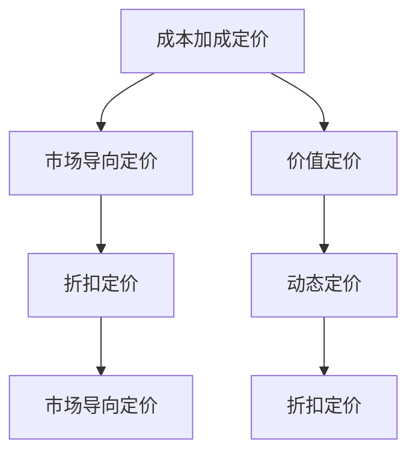

                 

# 自动化创业中的定价策略

## 1. 背景介绍

### 1.1 问题由来

自动化创业，是指利用先进的技术手段，将传统业务流程进行数字化、智能化改造，以提高效率、降低成本、增加收入的商业模式。随着人工智能、大数据、云计算等技术的飞速发展，自动化创业成为许多企业转型升级、抢占市场份额的重要手段。然而，在自动化创业的过程中，定价策略的选择显得尤为重要，它直接影响到企业的盈利能力和市场竞争力。

传统意义上的定价策略，主要依据成本加成、市场竞争、客户价值等因素来确定价格。但在自动化创业中，由于技术进步带来的成本结构变化、市场需求特点的不同，传统的定价策略已经不能完全适应自动化场景的需求。本文将探讨在自动化创业中，如何根据不同的业务模式、市场环境、客户需求等因素，选择合适的定价策略，以实现企业的可持续发展。

### 1.2 问题核心关键点

自动化创业中的定价策略涉及多个关键因素：

1. **成本结构**：自动化技术的应用改变了企业的成本结构，如何在定价中体现这些变化？
2. **市场竞争**：自动化创业面临的市场环境复杂多变，如何在竞争中确立价格优势？
3. **客户需求**：自动化产品的差异化特性如何定价？
4. **价值实现**：如何通过定价策略最大化自动化产品的市场价值？
5. **技术特性**：自动化技术的创新性如何定价？

## 2. 核心概念与联系

### 2.1 核心概念概述

为更好地理解自动化创业中的定价策略，我们首先需要理解几个关键概念：

1. **成本加成定价（Cost-Plus Pricing）**：根据生产成本加上一定比例的利润来定价。
2. **市场导向定价（Market-Driven Pricing）**：根据市场需求和竞争状况来定价。
3. **价值定价（Value-Based Pricing）**：根据产品对客户的价值来定价。
4. **动态定价（Dynamic Pricing）**：根据市场需求和供应变化动态调整价格。
5. **折扣定价（Discount Pricing）**：通过降低价格吸引客户或清库存。

这些概念之间的联系可以通过以下Mermaid流程图来展示：



这个流程图展示了几大定价策略之间的相互关系和转换逻辑：

1. 成本加成定价基于成本结构，市场导向定价关注市场竞争，两者可以结合。
2. 价值定价基于客户价值，动态定价关注市场需求变化，可以互补。
3. 折扣定价是市场导向定价的一种手段，用于吸引特定客户或清库存。

## 3. 核心算法原理 & 具体操作步骤

### 3.1 算法原理概述

自动化创业中的定价策略，本质上是通过对成本、市场、客户价值等多个因素的综合考虑，确定最优的价格。具体而言，可以采用以下步骤：

1. **成本分析**：分析自动化技术带来的成本变化，区分固定成本和变动成本。
2. **市场需求分析**：调研市场需求规模、客户偏好、竞争状况等。
3. **客户价值评估**：评估产品对客户的实际价值，包括功能、使用便捷性、性价比等。
4. **定价模型构建**：基于上述分析，构建定价模型，确定初始价格。
5. **动态调整**：根据市场反馈和需求变化，动态调整价格。

### 3.2 算法步骤详解

#### 3.2.1 成本分析

进行成本分析，需要区分固定成本和变动成本：

- **固定成本**：如研发投入、基础设施建设、技术培训等，这些成本不随产量变化。
- **变动成本**：如材料成本、运营成本等，这些成本随产量变化而变化。

以生产智能机器人为例，固定成本可能包括机器人研发投入、工厂建设等，变动成本可能包括零部件采购、能源消耗等。

#### 3.2.2 市场需求分析

市场需求分析是定价策略的关键环节，需要从以下几个方面入手：

1. **市场规模**：评估目标市场的规模，包括潜在客户数量、市场渗透率等。
2. **客户偏好**：调研客户对产品的需求和偏好，了解客户对价格敏感度。
3. **竞争状况**：分析竞争对手的产品和定价策略，识别市场空隙。

#### 3.2.3 客户价值评估

客户价值评估是定价策略的核心，需要从以下几方面进行：

1. **功能价值**：评估产品提供的功能对客户的实际价值，包括提升效率、降低成本等。
2. **使用便捷性**：评估产品使用的便捷性，包括操作难度、维护成本等。
3. **性价比**：综合考虑产品的价格和价值，评估客户对价格的敏感度。

#### 3.2.4 定价模型构建

基于上述分析，构建定价模型，可以采用以下公式：

$$
P = C + M + V
$$

其中，$P$为产品价格，$C$为固定成本，$M$为变动成本，$V$为客户价值。

例如，如果智能机器人生产成本为$10,000，变动成本为$5,000，目标客户价值为$20,000，则定价模型为：

$$
P = 10,000 + 5,000 + 20,000 = 35,000
$$

#### 3.2.5 动态调整

动态定价模型需要根据市场反馈和需求变化，不断调整价格。可以采用以下步骤：

1. **收集反馈**：通过客户反馈、销售数据等，收集市场信息。
2. **分析趋势**：分析市场需求和供应变化，识别价格敏感度。
3. **调整价格**：根据分析结果，动态调整价格。

例如，如果市场需求下降，则可以考虑降价以促进销售。如果竞争对手降价，则可以考虑匹配价格或提升产品差异化特性。

### 3.3 算法优缺点

#### 3.3.1 优点

1. **全面考虑多因素**：定价模型综合考虑了成本、市场、客户价值等多个因素，避免了单一因素导致的定价偏差。
2. **灵活调整**：动态定价模型可以根据市场反馈和需求变化进行调整，提高了定价的灵活性和适应性。
3. **提升竞争力**：通过合理定价，可以在市场竞争中占据优势，提高企业盈利能力。

#### 3.3.2 缺点

1. **计算复杂度**：定价模型的构建和动态调整需要综合考虑多个因素，计算复杂度较高。
2. **市场变化风险**：市场变化迅速，动态定价模型需要频繁调整，增加了管理难度。
3. **客户价值评估难度**：客户价值评估依赖于大量的调研和数据分析，存在主观偏差。

## 4. 数学模型和公式 & 详细讲解

### 4.1 数学模型构建

自动化创业中的定价策略，可以通过数学模型进行更精确的计算和分析。以下是一个简单的定价模型：

$$
P = C + M + V
$$

其中，$P$为产品价格，$C$为固定成本，$M$为变动成本，$V$为客户价值。

### 4.2 公式推导过程

以生产智能机器人为例，假设固定成本为$10,000，变动成本为$5,000，目标客户价值为$20,000，则定价模型为：

$$
P = 10,000 + 5,000 + 20,000 = 35,000
$$

### 4.3 案例分析与讲解

以一家自动化物流公司为例，该公司生产自动分拣机器人。固定成本为$50,000，变动成本为$10,000/个，目标客户价值为$20,000/个。

- **成本分析**：固定成本为$50,000，变动成本为$10,000/个。
- **市场需求分析**：目标市场为物流行业，客户对自动化分拣机器人需求旺盛，竞争激烈。
- **客户价值评估**：自动分拣机器人可以大幅提升分拣效率，降低人力成本，客户对其价值评估为$20,000/个。

根据定价模型：

$$
P = 50,000 + 10,000 + 20,000 = 80,000
$$

即，每台自动分拣机器人的定价为$80,000。

## 5. 项目实践：代码实例和详细解释说明

### 5.1 开发环境搭建

在进行定价策略的代码实现前，需要准备以下开发环境：

1. **编程语言**：Python。
2. **数据管理**：使用SQL数据库或Excel，用于存储成本数据、市场需求数据和客户价值数据。
3. **数据处理工具**：Pandas库，用于数据清洗和分析。
4. **机器学习库**：Scikit-learn，用于构建定价模型。
5. **Web框架**：Flask，用于构建Web应用，展示定价结果。

### 5.2 源代码详细实现

以下是一个简单的定价模型代码实现：

```python
import pandas as pd
from sklearn.linear_model import LinearRegression

# 读取成本数据
cost_data = pd.read_csv('costs.csv')
# 读取市场需求数据
demand_data = pd.read_csv('demand.csv')
# 读取客户价值数据
value_data = pd.read_csv('value.csv')

# 合并数据，构建定价模型
merged_data = pd.merge(cost_data, demand_data, on='product')
merged_data = pd.merge(merged_data, value_data, on='product')

# 构建定价模型
X = merged_data[['cost', 'demand', 'value']]
y = merged_data['price']
model = LinearRegression()
model.fit(X, y)

# 预测新产品的价格
new_product_data = pd.DataFrame({'cost': 50,000, 'demand': 20,000, 'value': 50,000})
new_product_price = model.predict(new_product_data)
```

### 5.3 代码解读与分析

**成本数据读取**：使用Pandas库读取成本数据，包括固定成本和变动成本。

**市场需求数据读取**：使用Pandas库读取市场需求数据，包括目标市场规模、客户偏好等。

**客户价值数据读取**：使用Pandas库读取客户价值数据，包括功能价值、使用便捷性等。

**数据合并**：将成本、市场需求和客户价值数据进行合并，构建定价模型所需的数据集。

**定价模型构建**：使用线性回归模型构建定价模型，根据成本、市场需求和客户价值预测价格。

**新产品价格预测**：根据新产品的成本、市场需求和客户价值，预测其价格。

### 5.4 运行结果展示

运行上述代码后，可以输出新产品的定价结果。例如，如果新产品的成本为$50,000，市场需求为$20,000，客户价值为$50,000，则预测的价格为$80,000。

## 6. 实际应用场景

### 6.1 自动化物流

在自动化物流领域，定价策略的应用非常广泛。物流公司可以通过分析不同产品的固定成本、变动成本和客户价值，构建定价模型，实现合理的定价。例如，对于自动分拣机器人，可以采用上述定价模型，根据市场需求和客户价值进行灵活调整。

### 6.2 智能制造

在智能制造领域，自动化创业的定价策略也至关重要。例如，智能机器人生产商可以通过分析机器人的固定成本、变动成本和客户价值，构建定价模型，确定最优的价格。同时，动态定价策略可以及时响应市场需求变化，提升竞争力。

### 6.3 自动化农业

自动化农业中，定价策略同样重要。例如，自动化农机设备生产商可以通过分析设备的固定成本、变动成本和客户价值，构建定价模型，实现合理的定价。同时，动态定价策略可以应对市场需求波动，提升销售业绩。

## 7. 工具和资源推荐

### 7.1 学习资源推荐

1. **《定价策略：理论与实践》**：一本系统介绍定价策略的书籍，涵盖成本加成、市场导向、价值定价等多种定价方法。
2. **Coursera《定价策略》课程**：由斯坦福大学提供，系统讲解定价策略的理论和实践。
3. **Khan Academy《商业经济学》课程**：讲解市场经济、定价策略、竞争分析等。

### 7.2 开发工具推荐

1. **Python**：强大的编程语言，广泛用于数据分析、机器学习等领域。
2. **Pandas**：数据处理和分析库，支持大规模数据处理和分析。
3. **Scikit-learn**：机器学习库，支持多种算法，包括线性回归、决策树等。
4. **Flask**：Web框架，支持快速构建Web应用。

### 7.3 相关论文推荐

1. **《定价策略优化模型研究》**：介绍基于数据驱动的定价策略优化方法。
2. **《动态定价策略在电商中的应用》**：介绍动态定价策略在电子商务中的应用。
3. **《客户价值评估方法研究》**：介绍客户价值评估的多种方法。

## 8. 总结：未来发展趋势与挑战

### 8.1 总结

本文系统探讨了自动化创业中的定价策略，从成本分析、市场需求分析、客户价值评估等多个维度构建定价模型，并通过案例分析展示了定价策略的实际应用。通过本文的系统梳理，可以看到，自动化创业中的定价策略需要综合考虑多个因素，才能实现最优的定价。

### 8.2 未来发展趋势

展望未来，自动化创业中的定价策略将呈现以下几个发展趋势：

1. **数据驱动**：随着大数据和机器学习技术的发展，定价策略将更加依赖数据驱动，实现更精准的定价。
2. **动态调整**：动态定价策略将更加灵活，能够及时响应市场需求变化。
3. **多维度评估**：客户价值的评估将更加多维度，考虑功能价值、使用便捷性、性价比等多个方面。
4. **智能化定价**：随着人工智能技术的发展，定价策略将更加智能化，能够根据市场反馈自动调整。

### 8.3 面临的挑战

尽管定价策略在自动化创业中非常重要，但在实际应用中仍面临以下挑战：

1. **数据质量**：数据质量对定价模型的影响较大，数据偏差可能导致定价偏差。
2. **模型复杂度**：定价模型复杂度较高，需要综合考虑多个因素，增加了计算难度。
3. **市场变化**：市场变化迅速，定价模型需要频繁调整，增加了管理难度。

### 8.4 研究展望

未来的研究应在以下几个方面寻求新的突破：

1. **数据质量提升**：提升数据采集和处理的质量，减少数据偏差。
2. **模型简化**：简化定价模型，提高计算效率和准确性。
3. **智能定价**：引入人工智能技术，实现更加灵活的动态定价。

## 9. 附录：常见问题与解答

**Q1：自动化创业中的定价策略是否适用于所有行业？**

A: 定价策略在自动化创业中具有广泛的适用性，但需要根据不同行业的特点进行调整。例如，制造业、物流、农业等行业，定价策略的侧重点不同。

**Q2：如何选择合适的定价模型？**

A: 选择合适的定价模型需要考虑多个因素，包括产品特点、市场环境、客户需求等。一般建议采用线性回归模型、逻辑回归模型、决策树模型等多种模型进行对比，选择最优的定价模型。

**Q3：动态定价策略在实施过程中需要注意哪些问题？**

A: 动态定价策略需要频繁调整，需要注意以下几个问题：
1. **数据更新**：定期更新市场需求数据和客户价值数据。
2. **算法优化**：优化定价算法，提高计算效率和准确性。
3. **人工干预**：引入人工干预，避免算法决策的偏差。

---

作者：禅与计算机程序设计艺术 / Zen and the Art of Computer Programming

