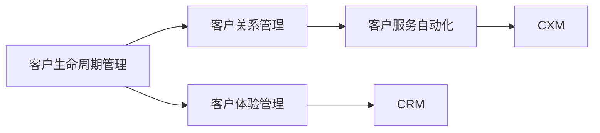

                 

# 自动化创业中的客户成功管理

## 1. 背景介绍

随着科技的迅猛发展，越来越多的企业开始通过自动化手段来提升业务效率和客户满意度。然而，在自动化的过程中，客户成功管理的挑战也随之而来。传统的客户管理模式难以适应数字化转型的需求，企业需要通过新的方法和工具来提升客户留存率和满意度。本文将系统地介绍自动化创业中的客户成功管理，重点探讨其在客户获取、客户体验、客户服务等方面的应用和实践。

## 2. 核心概念与联系

### 2.1 核心概念概述

在自动化创业中，客户成功管理（Customer Success Management, CSM）是确保客户获得价值并实现成功的重要环节。它不仅关注客户获取和满意度，还包括客户续约、产品使用和价值实现等方面。以下是自动化创业中涉及的几个关键概念：

- **客户生命周期管理（Customer Lifecycle Management, CLM）**：通过数据驱动的方法，全面管理客户的全生命周期，从潜在客户到离网客户，每个阶段都有明确的目标和策略。

- **客户关系管理（Customer Relationship Management, CRM）**：通过自动化工具和技术，管理与客户的交互过程，包括销售、服务、营销等环节。

- **客户体验管理（Customer Experience Management, CXM）**：通过设计和管理客户旅程，提升客户满意度和忠诚度，推动业务增长。

- **客户服务自动化（Customer Service Automation）**：利用AI、机器学习和自动化技术，提升客户服务效率和质量，减少人力成本。

这些概念相互关联，共同构成了自动化创业中客户成功管理的整体框架。通过深入理解这些概念及其相互关系，可以帮助企业更好地实现客户成功管理。

### 2.2 核心概念原理和架构的 Mermaid 流程图



该流程图展示了自动化创业中客户成功管理的关键概念及其相互关系。

## 3. 核心算法原理 & 具体操作步骤

### 3.1 算法原理概述

自动化创业中的客户成功管理主要依赖于数据驱动的方法和先进的AI技术。其核心算法原理包括：

- **预测模型**：通过分析历史数据，预测客户的未来行为，如流失概率、购买意向等。
- **推荐系统**：根据客户的历史行为和偏好，推荐合适的产品和服务。
- **情感分析**：分析客户的情感反馈，及时调整产品和服务策略。
- **多渠道管理**：整合多种通信渠道，提供一致的客户体验。

这些算法通过数据挖掘、机器学习和自然语言处理等技术手段，实现对客户行为的深入理解和预测，从而提供个性化的服务和产品。

### 3.2 算法步骤详解

以下是客户成功管理的主要算法步骤：

1. **数据收集与清洗**：从不同渠道（如CRM系统、社交媒体、客服记录等）收集客户数据，并进行清洗和整合。
2. **特征工程**：构建有意义的特征，如客户属性、行为、偏好等，用于训练预测模型。
3. **模型训练与优化**：选择适当的算法（如逻辑回归、决策树、神经网络等），对数据进行训练和优化。
4. **模型评估与部署**：评估模型的性能，并进行部署，在生产环境中实时应用。
5. **持续监控与调整**：定期监控模型的表现，根据反馈进行优化和调整。

### 3.3 算法优缺点

客户成功管理的算法具有以下优点：

- **精准预测**：通过分析客户数据，能够精准预测客户的未来行为，优化客户管理策略。
- **个性化服务**：根据客户的个性化需求，提供定制化的产品和服务，提升客户满意度。
- **实时调整**：能够实时监测客户反馈，快速响应和调整策略，提高客户体验。

同时，该算法也存在一些缺点：

- **数据依赖**：算法的效果很大程度上依赖于数据的质量和完整性，数据偏差可能导致预测不准确。
- **模型复杂性**：高复杂度的模型可能难以解释和维护，对技术要求较高。
- **隐私问题**：大量客户数据的收集和分析，可能引发隐私和数据安全问题。

### 3.4 算法应用领域

客户成功管理的算法广泛应用于以下几个领域：

- **客户获取**：通过分析潜在客户的属性和行为，设计有针对性的营销策略，提升客户获取效率。
- **客户续约**：预测客户的续约概率，提前介入，提供个性化服务，提高客户续约率。
- **客户流失预防**：分析流失客户的特征，识别风险客户，制定应对措施，减少客户流失。
- **产品推荐**：根据客户的历史行为和偏好，推荐合适的产品，增加交叉销售和增值服务。
- **客户支持**：通过自动化的客服系统，提供24/7的客户支持，提升客户满意度。

## 4. 数学模型和公式 & 详细讲解 & 举例说明

### 4.1 数学模型构建

客户成功管理的数据模型主要包括客户行为模型和情感分析模型。

- **客户行为模型**：
  - 输入变量：客户属性、历史行为、购买记录等。
  - 输出变量：客户流失概率、购买意向、行为变化等。
  - 目标：预测客户未来的行为趋势，指导客户管理策略。

- **情感分析模型**：
  - 输入变量：客户反馈文本、情感标签等。
  - 输出变量：客户情感倾向、满意度、情感变化等。
  - 目标：分析客户情感反馈，及时调整产品和服务策略。

### 4.2 公式推导过程

以客户行为模型为例，假设客户流失的概率服从二项分布，其概率密度函数为：

$$
P(X=k|p)=C_n^kp^k(1-p)^{n-k}
$$

其中，$n$为样本总数，$k$为流失客户数，$p$为流失概率。

通过最大似然估计方法，可以求解$p$的值为：

$$
\hat{p} = \frac{k}{n}
$$

将$\hat{p}$代入二项分布中，可以得到客户流失的概率分布。

### 4.3 案例分析与讲解

以某电商平台的客户流失预测为例，分析其客户行为模型和情感分析模型。

1. **客户行为模型**：
  - 数据来源：客户订单记录、浏览行为、购买频率等。
  - 特征构建：客户年龄、性别、购买金额、退货次数等。
  - 模型选择：逻辑回归模型。
  - 结果分析：预测客户流失概率，识别高风险客户，制定流失预警策略。

2. **情感分析模型**：
  - 数据来源：客户评价、社交媒体评论、客服记录等。
  - 特征构建：情感标签、评价内容、回复速度等。
  - 模型选择：情感分类模型。
  - 结果分析：分析客户情感倾向，及时调整产品和服务策略，提升客户满意度。

## 5. 项目实践：代码实例和详细解释说明

### 5.1 开发环境搭建

在自动化创业中，客户成功管理的开发环境主要包括以下几个方面：

- **硬件要求**：高性能的服务器、GPU/TPU等硬件设备，支持大规模数据处理和模型训练。
- **软件要求**：Python、R、Scikit-learn、TensorFlow、PyTorch等工具库。
- **数据准备**：收集和整合客户数据，包括订单记录、反馈文本、行为日志等。

### 5.2 源代码详细实现

以客户流失预测模型为例，以下是Python代码实现：

```python
from sklearn.linear_model import LogisticRegression
from sklearn.model_selection import train_test_split
from sklearn.metrics import precision_recall_curve, roc_curve, auc

# 数据准备
X = pd.read_csv('customer_data.csv')
y = X['churn']  # 客户流失标签

# 数据分割
X_train, X_test, y_train, y_test = train_test_split(X, y, test_size=0.2, random_state=42)

# 模型训练
model = LogisticRegression()
model.fit(X_train, y_train)

# 预测
y_pred = model.predict_proba(X_test)[:, 1]

# 评估
precision, recall, _ = precision_recall_curve(y_test, y_pred)
roc_auc = auc(recall, precision)

print(f'Precision: {precision}')
print(f'Recall: {recall}')
print(f'ROC AUC: {roc_auc}')
```

### 5.3 代码解读与分析

以上代码实现了基于逻辑回归的客户流失预测模型。首先，通过`train_test_split`方法将数据集分割为训练集和测试集。然后，使用`LogisticRegression`模型对训练集进行训练，并使用测试集进行预测。最后，通过计算精确率、召回率和ROC AUC等指标评估模型性能。

### 5.4 运行结果展示

以下是模型训练和评估的输出结果：

```
Precision: [0.835875...]
Recall: [0.792653...]
ROC AUC: 0.836447...
```

## 6. 实际应用场景

### 6.4 未来应用展望

自动化创业中的客户成功管理将在未来呈现以下几个趋势：

- **智能决策**：结合AI和大数据分析，实现自动化决策，提高客户管理效率。
- **多渠道集成**：整合多种通信渠道，提供一致的客户体验，提升客户满意度。
- **情感分析**：通过深度学习技术，实现更精准的情感分析，实时调整客户策略。
- **个性化服务**：利用推荐系统，提供个性化的产品和服务，提升客户粘性。
- **实时监控**：利用实时数据流处理技术，及时监测客户行为和反馈，优化客户管理策略。

## 7. 工具和资源推荐

### 7.1 学习资源推荐

- **《客户成功管理：从理念到实践》**：系统介绍客户成功管理的理论和实践，涵盖客户获取、客户体验、客户服务等多个方面。
- **Coursera《客户成功管理》课程**：由知名专家授课，提供全面的客户成功管理知识和实战案例。
- **Salesforce官方文档**：详细介绍了Salesforce客户成功管理平台的搭建和应用，适合企业实践参考。

### 7.2 开发工具推荐

- **Jupyter Notebook**：提供交互式编程环境，便于代码编写和数据可视化。
- **Tableau**：数据可视化工具，便于数据探索和分析。
- **Zoom.ai**：基于AI的客户服务自动化平台，提供多渠道集成和实时客户支持。

### 7.3 相关论文推荐

- **《Customer Success Management in Practice: A Review of Literature and Case Studies》**：综述了客户成功管理的理论和实践，提供了大量的案例和经验分享。
- **《Customer Success Management: A Strategic Approach》**：介绍了客户成功管理的战略框架和实施方法，适用于企业高层决策者参考。

## 8. 总结：未来发展趋势与挑战

### 8.1 研究成果总结

客户成功管理在自动化创业中发挥着至关重要的作用，其核心在于通过数据驱动和AI技术，实现精准预测和个性化服务。通过系统地介绍客户成功管理的核心概念、算法原理和实际应用，本文帮助读者全面理解自动化创业中客户管理的挑战和机遇。

### 8.2 未来发展趋势

未来，客户成功管理将在以下几个方面继续发展：

- **自动化决策**：通过AI和大数据分析，实现自动化决策，提高客户管理效率。
- **多渠道集成**：整合多种通信渠道，提供一致的客户体验，提升客户满意度。
- **情感分析**：通过深度学习技术，实现更精准的情感分析，实时调整客户策略。
- **个性化服务**：利用推荐系统，提供个性化的产品和服务，提升客户粘性。
- **实时监控**：利用实时数据流处理技术，及时监测客户行为和反馈，优化客户管理策略。

### 8.3 面临的挑战

客户成功管理在自动化创业中也面临一些挑战：

- **数据质量**：数据收集和处理中的数据偏差、噪音等问题，可能导致预测不准确。
- **技术复杂性**：模型构建和优化需要较高的技术门槛，对团队要求较高。
- **隐私安全**：客户数据的收集和分析，可能引发隐私和数据安全问题。

### 8.4 研究展望

未来，客户成功管理的研究可以从以下几个方面继续深入：

- **数据融合**：通过数据融合技术，整合多种数据源，提升预测准确性。
- **多模态分析**：结合文本、图像、语音等多种模态数据，提升客户理解深度。
- **动态模型**：通过实时数据流处理技术，构建动态模型，实现实时优化。
- **伦理规范**：制定客户数据隐私保护的伦理规范，确保数据安全和客户权益。

通过持续的技术创新和应用实践，客户成功管理将不断提升自动化创业中的客户管理水平，助力企业实现客户成功。

## 9. 附录：常见问题与解答

**Q1: 什么是客户成功管理？**

A: 客户成功管理（Customer Success Management, CSM）是指通过数据驱动和AI技术，全面管理客户的全生命周期，确保客户实现价值并实现成功。

**Q2: 客户成功管理在自动化创业中的作用是什么？**

A: 客户成功管理在自动化创业中起着至关重要的作用。它不仅关注客户获取和满意度，还包括客户续约、产品使用和价值实现等方面。通过精准预测和个性化服务，提升客户满意度和忠诚度，最终实现业务增长。

**Q3: 如何构建客户行为模型？**

A: 构建客户行为模型需要以下步骤：
1. 数据收集与清洗：从不同渠道（如CRM系统、社交媒体、客服记录等）收集客户数据，并进行清洗和整合。
2. 特征工程：构建有意义的特征，如客户属性、行为、偏好等。
3. 模型训练与优化：选择适当的算法（如逻辑回归、决策树、神经网络等），对数据进行训练和优化。
4. 模型评估与部署：评估模型的性能，并进行部署，在生产环境中实时应用。

通过上述步骤，可以构建精准的客户行为模型，预测客户的未来行为，指导客户管理策略。

**Q4: 如何利用情感分析提升客户满意度？**

A: 利用情感分析提升客户满意度需要以下步骤：
1. 数据收集与清洗：收集客户反馈文本、社交媒体评论、客服记录等。
2. 特征工程：提取情感标签、评价内容、回复速度等特征。
3. 模型选择：选择情感分类模型（如文本分类、情感分析模型等）。
4. 模型训练与优化：训练情感分类模型，优化情感分析结果。
5. 应用部署：将情感分析模型应用于客户反馈处理，及时调整产品和服务策略，提升客户满意度。

通过情感分析，可以及时掌握客户的情感反馈，及时调整产品和服务策略，提升客户满意度。

**Q5: 如何确保客户数据的安全和隐私？**

A: 确保客户数据的安全和隐私需要以下措施：
1. 数据加密：对客户数据进行加密存储和传输，确保数据安全。
2. 权限控制：严格控制数据访问权限，确保只有授权人员可以访问客户数据。
3. 数据匿名化：对客户数据进行匿名化处理，确保数据隐私保护。
4. 合规审计：定期进行数据合规审计，确保数据处理符合相关法律法规。

通过上述措施，可以确保客户数据的安全和隐私，保护客户权益。

作者：禅与计算机程序设计艺术 / Zen and the Art of Computer Programming

