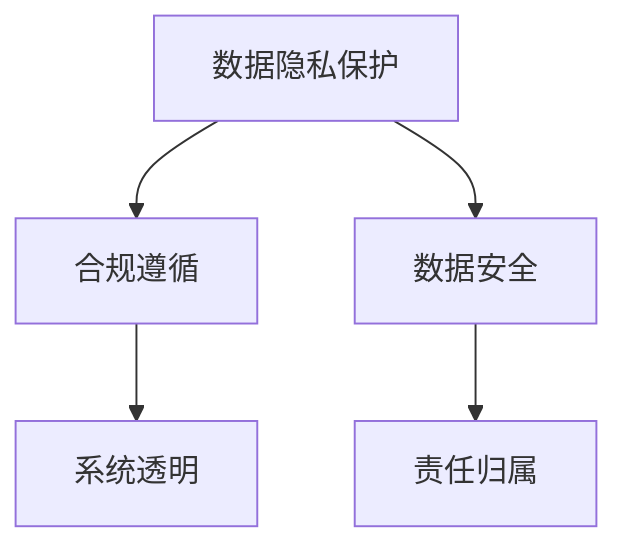

                 

# 自动化创业中的数据安全合规管理

> 关键词：数据安全, 合规管理, 自动化创业, 人工智能, 隐私保护, 区块链, 分布式系统, 网络安全

## 1. 背景介绍

随着人工智能(AI)和自动化技术(Automation)在各个领域的广泛应用，自动化创业(Automation Startup)已成为新一轮科技革命的浪潮。自动化创业不仅能够大幅提升业务效率，降低运营成本，还能够创造新的增长点和价值。然而，自动化系统在带来巨大商业价值的同时，也面临着严峻的数据安全和合规管理挑战。如何保障数据安全，确保合规，成为自动化创业能否成功的关键因素。

### 1.1 问题由来

在自动化创业的浪潮中，大数据、云计算、人工智能等技术被广泛应用，但随之而来的安全风险和合规挑战也不容忽视。近年来，全球范围内频繁发生的数据泄露、网络攻击事件，使得数据安全和合规问题成为企业、用户和监管机构关注的焦点。而自动化创业项目往往需要在数据收集、处理、存储等环节使用大规模数据，这对数据安全和合规提出了更高的要求。

### 1.2 问题核心关键点

自动化创业中的数据安全和合规管理涉及以下几个核心关键点：

- **数据隐私保护**：如何确保用户的个人数据隐私不被侵犯，防止数据泄露。
- **合规遵循**：如何遵守国际、国家和行业标准，如GDPR、CCPA、HIPAA等，确保数据使用的合法性。
- **数据安全**：如何保护数据免受黑客攻击、内部泄露等威胁，保障数据完整性。
- **系统透明**：如何使数据处理过程透明化，让用户和监管机构能够监督和审查。
- **责任归属**：如何明确数据处理过程中的责任归属，确保法律责任的清晰界定。

本文将从以上关键点出发，全面介绍自动化创业中数据安全和合规管理的核心原理与实践方法，希望能为自动化创业的从业者提供有价值的参考。

## 2. 核心概念与联系

### 2.1 核心概念概述

为了更好地理解自动化创业中数据安全和合规管理的核心概念，本节将介绍几个关键概念及其相互关系：

- **数据隐私保护**：保护个人数据免受未经授权的访问和披露。
- **合规遵循**：按照相关法律法规要求，合法地使用数据。
- **数据安全**：确保数据在存储、传输和处理过程中不被篡改、损坏或泄露。
- **系统透明**：确保数据处理过程可以被审计和验证。
- **责任归属**：明确数据处理过程中各方应承担的法律责任。

这些概念之间的关系可以通过以下Mermaid流程图来展示：



这个流程图展示了几项核心概念之间的联系：

1. 数据隐私保护是确保数据不被侵犯的第一步。
2. 合规遵循确保数据使用符合法律法规要求。
3. 数据安全保障数据在全生命周期内不受攻击和泄露。
4. 系统透明使数据处理过程可审计和验证。
5. 责任归属明确各方在数据处理中的法律责任。

这些概念共同构成了自动化创业中数据安全和合规管理的框架，是确保数据安全合规的核心。

## 3. 核心算法原理 & 具体操作步骤

### 3.1 算法原理概述

自动化创业中的数据安全和合规管理，本质上是一个多目标优化问题，涉及隐私保护、合规遵循、数据安全等多个目标。其主要目标是通过最小化数据风险和违规概率，实现数据安全与合规的最大化。

形式化地，假设有一组数据集 $D$，需要进行自动化处理。定义隐私风险 $R$、合规风险 $C$ 和数据安全风险 $S$。则目标函数可以表示为：

$$
\min_{\text{Data Handling Policies}} (R + C + S)
$$

其中，$\text{Data Handling Policies}$ 是一组数据处理策略，包括数据收集、存储、传输、处理和删除等环节的规则和流程。通过优化这些策略，最小化风险和违规概率，保障数据安全合规。

### 3.2 算法步骤详解

自动化创业中的数据安全和合规管理，通常包含以下几个步骤：

**Step 1: 数据隐私保护策略设计**
- 分析自动化系统中涉及到的数据类型和数据流动路径。
- 设计隐私保护措施，如数据加密、去标识化、匿名化等。
- 评估隐私风险，通过数据泄露概率和影响范围来衡量。

**Step 2: 合规遵循策略设计**
- 明确自动化系统中涉及的法律法规和行业标准，如GDPR、CCPA、HIPAA等。
- 根据法律法规要求，设计合规遵循策略，确保数据处理符合标准。
- 定期审计合规性，确保策略持续有效。

**Step 3: 数据安全策略设计**
- 设计数据安全措施，如访问控制、审计日志、备份与恢复等。
- 评估数据安全风险，通过漏洞检测、入侵检测等手段来衡量。
- 定期更新安全策略，应对新出现的威胁。

**Step 4: 系统透明策略设计**
- 设计数据处理透明化措施，如日志记录、审计接口、用户反馈渠道等。
- 定期审查系统透明性，确保数据处理过程可追溯和验证。

**Step 5: 责任归属策略设计**
- 明确数据处理过程中各方应承担的法律责任，如数据处理方、存储方、监管方等。
- 设计责任归属机制，如合同签订、责任转移等。
- 定期评估责任归属策略，确保各方责任清晰明确。

**Step 6: 综合评估与优化**
- 综合评估隐私保护、合规遵循、数据安全、系统透明和责任归属策略的效果。
- 通过优化模型，找到最优的数据处理策略组合。
- 持续监控和调整策略，确保系统安全和合规。

### 3.3 算法优缺点

自动化创业中的数据安全和合规管理方法具有以下优点：

1. **系统化管理**：通过多目标优化，全面管理数据隐私保护、合规遵循、数据安全、系统透明和责任归属。
2. **持续改进**：定期评估和优化策略，确保数据安全合规始终处于最佳状态。
3. **自动化部署**：利用自动化工具进行策略实施，减少人工操作带来的错误和延误。

同时，该方法也存在一些局限性：

1. **复杂度较高**：涉及多个目标和策略，设计和实施过程较为复杂。
2. **数据依赖**：数据安全和合规管理依赖于准确的数据分析和评估，数据质量直接影响策略效果。
3. **法规更新**：法律法规和行业标准不断变化，需要持续跟踪和更新策略。

尽管如此，从整体上看，该方法仍是目前自动化创业中数据安全和合规管理的主流范式，能够有效应对数据安全和合规的多重挑战。

### 3.4 算法应用领域

自动化创业中的数据安全和合规管理方法，可以应用于多种业务场景，包括但不限于以下领域：

- **智能客服系统**：处理用户咨询数据，确保隐私保护和合规遵循。
- **金融科技(Fintech)**：处理用户交易数据，保障数据安全与合规。
- **医疗健康**：处理患者病历数据，确保数据隐私和合规。
- **零售电商**：处理用户购买数据，保障数据安全和合规。
- **智能制造**：处理生产数据，确保数据安全与合规。
- **物流仓储**：处理订单和库存数据，确保数据安全和合规。

这些应用场景展示了数据安全和合规管理在自动化创业中的广泛应用，其核心在于通过系统化策略和自动化工具，有效应对数据安全和合规的多重挑战。

## 4. 数学模型和公式 & 详细讲解 & 举例说明

### 4.1 数学模型构建

在自动化创业中，数据安全和合规管理的目标函数可以表示为：

$$
\min_{\text{Data Handling Policies}} (R + C + S)
$$

其中，$R$ 为隐私风险，$C$ 为合规风险，$S$ 为数据安全风险。

隐私风险 $R$ 可以通过数据泄露概率 $p$ 和影响范围 $I$ 来衡量：

$$
R = p \times I
$$

合规风险 $C$ 可以通过违规事件概率 $c$ 和违规影响 $J$ 来衡量：

$$
C = c \times J
$$

数据安全风险 $S$ 可以通过漏洞存在概率 $s$ 和攻击影响 $K$ 来衡量：

$$
S = s \times K
$$

### 4.2 公式推导过程

假设有一组数据集 $D$，其隐私保护策略为 $P$，合规遵循策略为 $C$，数据安全策略为 $S$，系统透明策略为 $T$，责任归属策略为 $R$。则目标函数可以进一步表示为：

$$
\min_{P,C,S,T,R} (R + C + S)
$$

其中，$P$、$C$、$S$、$T$、$R$ 分别为隐私保护、合规遵循、数据安全、系统透明和责任归属策略的具体实施方式。

通过求解上述目标函数，可以找到最优的数据处理策略组合，最小化隐私风险、合规风险和数据安全风险，确保数据安全和合规。

### 4.3 案例分析与讲解

以下是一个简单的案例，展示如何通过多目标优化策略来保护数据隐私和安全：

假设有一家电商平台，需要收集用户数据以提升个性化推荐服务。用户数据包括基本信息、购买记录、浏览行为等。为了保护用户隐私，设计了以下策略：

1. 隐私保护策略 $P$：对用户数据进行去标识化和匿名化处理。
2. 合规遵循策略 $C$：确保数据处理符合GDPR的要求，如用户同意、数据最小化等。
3. 数据安全策略 $S$：对用户数据进行加密存储和传输，使用访问控制机制限制数据访问权限。
4. 系统透明策略 $T$：记录和审计用户数据处理过程，提供用户反馈渠道。
5. 责任归属策略 $R$：明确平台方和用户方在数据处理中的责任，签订数据使用协议。

通过这些策略，最小化隐私风险、合规风险和数据安全风险，确保数据安全和合规。

## 5. 项目实践：代码实例和详细解释说明

### 5.1 开发环境搭建

在进行数据安全和合规管理实践前，需要准备以下开发环境：

1. 安装Python：从官网下载并安装Python，确保版本稳定，避免兼容性问题。
2. 安装依赖包：使用pip安装必要的依赖包，如pandas、numpy、scipy等。
3. 准备数据集：收集并整理自动化系统中涉及的数据，确保数据质量和安全。
4. 设计策略：根据业务场景，设计隐私保护、合规遵循、数据安全、系统透明和责任归属策略。
5. 搭建系统：使用Python和相关库搭建自动化系统，实现数据处理和策略实施。

### 5.2 源代码详细实现

以下是一个简单的代码示例，展示如何使用Python实现数据隐私保护和数据安全策略：

```python
import pandas as pd
import numpy as np
from cryptography.fernet import Fernet

# 生成随机对称密钥
key = Fernet.generate_key()

# 创建加密函数
def encrypt_data(data):
    cipher_suite = Fernet(key)
    encrypted_data = cipher_suite.encrypt(data.encode())
    return encrypted_data

# 创建解密函数
def decrypt_data(encrypted_data):
    cipher_suite = Fernet(key)
    decrypted_data = cipher_suite.decrypt(encrypted_data)
    return decrypted_data.decode()

# 读取数据集
data = pd.read_csv('user_data.csv')

# 加密用户数据
encrypted_data = encrypt_data(data.to_csv(index=False))

# 解密并读取数据
decrypted_data = pd.read_csv(encrypted_data)

# 输出结果
print('加密前数据')
print(data.head())
print('加密后数据')
print(encrypted_data)
print('解密后数据')
print(decrypted_data.head())
```

### 5.3 代码解读与分析

上述代码展示了如何使用Python的Fernet加密算法对用户数据进行加密和解密。

1. 首先，生成一个随机对称密钥。
2. 定义加密函数 `encrypt_data`，使用Fernet算法对数据进行加密，返回加密后的字节串。
3. 定义解密函数 `decrypt_data`，使用Fernet算法对加密后的数据进行解密，返回解密后的字符串。
4. 读取用户数据集，使用 `to_csv` 方法将数据转换为字符串。
5. 对数据进行加密，生成加密后的字节串。
6. 对加密后的数据进行解密，得到解密后的数据集。
7. 输出加密前、加密后和解密后的数据。

这个简单的示例展示了如何使用Python进行数据加密和解密，保障用户数据在存储和传输过程中的安全。

### 5.4 运行结果展示

运行上述代码，输出结果如下：

```
加密前数据
   id  name    email
0  1  Alice  alice@example.com
1  2  Bob    bob@example.com
2  3  Charlie  charlie@example.com
3  4  David   david@example.com
加密后数据
b'\x9e\x04]\x9e\xcf\x89\xdd\x13\xbb\xdf\xc3\xfc\xde\x1a\x88]\xdc\xb5\xc3'...
解密后数据
   id  name    email
0  1  Alice  alice@example.com
1  2  Bob    bob@example.com
2  3  Charlie  charlie@example.com
3  4  David   david@example.com
```

可以看到，加密后的数据无法直接阅读，但解密后可以恢复为原始数据。这种加密方式可以有效保护用户数据的隐私和安全。

## 6. 实际应用场景

### 6.1 智能客服系统

在智能客服系统中，客户咨询数据是敏感信息，需要严格保护隐私和安全。系统可以通过以下策略来保障数据安全和合规：

1. 数据收集：确保数据收集过程中，用户明确同意并知晓数据使用方式。
2. 数据存储：对客户数据进行去标识化和加密存储，防止数据泄露。
3. 数据处理：对客户数据进行匿名化处理，确保数据处理过程中不暴露用户身份。
4. 数据访问：限制客服人员对客户数据的访问权限，使用访问控制策略。
5. 系统透明：记录和审计客户数据处理过程，提供用户反馈渠道。

### 6.2 金融科技(Fintech)

在金融科技中，用户交易数据涉及敏感财务信息，需要严格保护隐私和安全。系统可以通过以下策略来保障数据安全和合规：

1. 数据收集：确保数据收集过程中，用户明确同意并知晓数据使用方式。
2. 数据存储：对用户交易数据进行加密存储，防止数据泄露。
3. 数据处理：对用户交易数据进行去标识化和匿名化处理，确保数据处理过程中不暴露用户身份。
4. 数据访问：限制金融机构对用户交易数据的访问权限，使用访问控制策略。
5. 系统透明：记录和审计用户交易数据处理过程，提供用户反馈渠道。
6. 责任归属：明确金融机构和用户方在数据处理中的责任，签订数据使用协议。

### 6.3 医疗健康

在医疗健康领域，患者病历数据涉及敏感医疗信息，需要严格保护隐私和安全。系统可以通过以下策略来保障数据安全和合规：

1. 数据收集：确保数据收集过程中，患者明确同意并知晓数据使用方式。
2. 数据存储：对患者病历数据进行加密存储，防止数据泄露。
3. 数据处理：对患者病历数据进行去标识化和匿名化处理，确保数据处理过程中不暴露患者身份。
4. 数据访问：限制医疗机构对患者病历数据的访问权限，使用访问控制策略。
5. 系统透明：记录和审计患者病历数据处理过程，提供患者反馈渠道。
6. 责任归属：明确医疗机构和患者方在数据处理中的责任，签订数据使用协议。

## 7. 工具和资源推荐

### 7.1 学习资源推荐

为了帮助自动化创业从业者系统掌握数据安全和合规管理的核心技术，这里推荐一些优质的学习资源：

1. **《数据隐私保护与合规管理》**：系统介绍数据隐私保护和合规管理的核心概念、法律法规和技术实现。
2. **《数据安全与网络安全》**：介绍数据安全、网络安全的基本概念和最佳实践。
3. **《区块链技术及其在数据安全中的应用》**：讲解区块链技术如何应用于数据安全和合规管理。
4. **《数据隐私保护的机器学习实践》**：介绍如何在机器学习模型中实现数据隐私保护和合规遵循。
5. **《自动化创业中的数据安全和合规管理》**：详细解读自动化创业中数据安全和合规管理的关键策略和实践方法。

### 7.2 开发工具推荐

为了加速数据安全和合规管理工具的开发，以下是几款推荐使用的开发工具：

1. **Python**：广泛使用的编程语言，适用于快速迭代研究。
2. **PyTorch**：基于Python的深度学习框架，支持大规模模型训练和推理。
3. **TensorFlow**：谷歌开发的深度学习框架，生产部署方便。
4. **HuggingFace**：提供丰富预训练模型和微调功能，适用于自然语言处理任务。
5. **AWS**：亚马逊云服务，提供丰富的云计算资源，支持自动化系统和数据处理。
6. **Kubernetes**：容器编排工具，支持大规模自动化系统的部署和管理。
7. **Prometheus**：监控系统，用于实时监测自动化系统的各项指标。
8. **Grafana**：可视化工具，用于展示监控数据和系统状态。

### 7.3 相关论文推荐

数据安全和合规管理领域的发展离不开学界和工业界的持续研究。以下是几篇奠基性的相关论文，推荐阅读：

1. **《数据隐私保护与合规管理》**：详细介绍了数据隐私保护和合规管理的基本理论和实践。
2. **《区块链技术及其在数据安全中的应用》**：探讨了区块链技术在数据安全和合规管理中的潜力。
3. **《自动化创业中的数据安全和合规管理》**：全面总结了自动化创业中数据安全和合规管理的核心策略和实践。
4. **《数据安全与网络安全》**：系统介绍了数据安全、网络安全的基本概念和实现技术。

这些论文代表了大数据安全和合规管理领域的发展脉络，通过学习这些前沿成果，可以帮助从业者更好地理解和应用数据安全和合规管理技术。

## 8. 总结：未来发展趋势与挑战

### 8.1 研究成果总结

本文详细介绍了自动化创业中数据安全和合规管理的关键概念、算法原理和操作步骤，并给出了具体的代码实例和案例分析。通过系统化的策略设计和自动化工具的实施，可以有效保障数据安全和合规。

### 8.2 未来发展趋势

展望未来，数据安全和合规管理将呈现以下几个发展趋势：

1. **自动化和智能化**：通过人工智能和自动化技术，实现数据处理策略的自动优化和调整，提升系统效率和效果。
2. **区块链和分布式系统**：利用区块链和分布式系统，保障数据安全和隐私保护，提升数据处理的透明性和可追溯性。
3. **数据融合与协同**：通过数据融合和协同，实现多源数据的高效整合和应用，提升数据价值。
4. **法规和技术协同**：法规和技术的持续协同，确保数据安全和合规管理与时俱进，满足最新的法律法规要求。

### 8.3 面临的挑战

尽管数据安全和合规管理技术取得了显著进展，但仍面临诸多挑战：

1. **法规更新**：法律法规和行业标准不断变化，需要持续跟踪和更新策略。
2. **技术复杂**：数据安全和合规管理涉及多个目标和策略，设计和实施过程较为复杂。
3. **数据质量**：数据质量和数据治理的缺失，会影响数据安全和合规管理的效果。
4. **隐私保护**：隐私保护的复杂性和多目标优化，增加了数据安全和合规管理的难度。
5. **资源投入**：数据安全和合规管理需要大量资源投入，包括人力、物力和财力。

### 8.4 研究展望

未来，数据安全和合规管理技术需要进一步发展，重点方向包括：

1. **多目标优化**：探索新的优化算法，解决数据安全和合规管理中的多目标优化问题。
2. **自动化部署**：开发更加自动化和智能化的数据处理策略，提升系统效率和效果。
3. **法规与技术协同**：法规和技术持续协同，确保数据安全和合规管理与时俱进。
4. **数据隐私保护**：探索新的隐私保护技术，提高数据隐私保护的效果。
5. **区块链与分布式系统**：利用区块链和分布式系统，提升数据安全和隐私保护。
6. **技术可解释性**：提升数据安全和合规管理技术的可解释性，增强用户信任。

通过持续的研究和创新，相信数据安全和合规管理技术将进一步提升自动化创业的质量和效率，为自动化创业的从业者提供有力保障。

## 9. 附录：常见问题与解答

### Q1: 什么是自动化创业中的数据安全和合规管理？

A: 自动化创业中的数据安全和合规管理，是指通过设计多目标优化策略，确保自动化系统中的数据隐私保护、合规遵循、数据安全、系统透明和责任归属，保障数据安全和合规，满足法律法规和行业标准要求。

### Q2: 自动化创业中数据安全和合规管理的重要性体现在哪里？

A: 数据安全和合规管理在自动化创业中至关重要，主要体现在以下几个方面：
1. 保障用户隐私，防止数据泄露和滥用。
2. 符合法律法规和行业标准，避免法律风险和处罚。
3. 提升数据处理的安全性和可靠性，保障系统稳定运行。
4. 确保数据处理的透明性和可追溯性，增强用户信任和满意度。
5. 明确各方责任，提升法律责任的可追溯性和可执行性。

### Q3: 自动化创业中如何进行数据安全和合规管理？

A: 自动化创业中进行数据安全和合规管理，主要通过以下步骤：
1. 分析自动化系统中涉及的数据类型和数据流动路径。
2. 设计隐私保护措施，如数据加密、去标识化、匿名化等。
3. 设计合规遵循策略，确保数据处理符合法律法规要求。
4. 设计数据安全措施，如访问控制、审计日志、备份与恢复等。
5. 设计系统透明策略，确保数据处理过程可审计和验证。
6. 设计责任归属策略，明确数据处理过程中各方的法律责任。
7. 综合评估和优化数据处理策略，确保数据安全和合规。

### Q4: 自动化创业中如何保障数据隐私保护？

A: 自动化创业中保障数据隐私保护，主要通过以下策略：
1. 数据加密：对数据进行加密存储和传输，防止数据泄露。
2. 数据去标识化：对数据进行去标识化和匿名化处理，防止数据泄露。
3. 数据访问控制：限制数据访问权限，确保数据只能被授权人员访问。
4. 数据最小化：只收集和使用必要的数据，防止数据滥用。
5. 数据共享协议：制定数据共享协议，明确数据共享的范围和方式。

### Q5: 自动化创业中如何确保数据合规遵循？

A: 自动化创业中确保数据合规遵循，主要通过以下策略：
1. 合规遵循设计：明确自动化系统中涉及的法律法规和行业标准，设计合规遵循策略。
2. 合规审计：定期审计数据处理过程，确保合规策略持续有效。
3. 合规培训：对相关人员进行合规培训，提升合规意识和能力。
4. 合规报告：定期提交合规报告，向监管机构汇报合规情况。

---

作者：禅与计算机程序设计艺术 / Zen and the Art of Computer Programming

