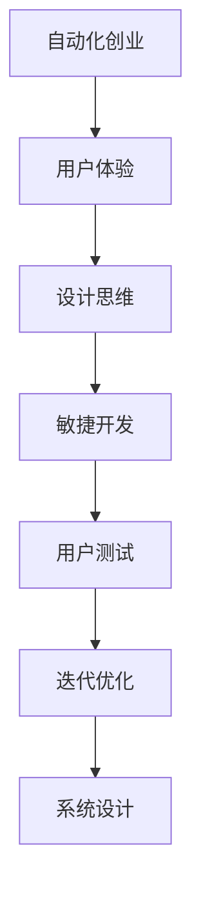

                 

# 自动化创业中的用户体验设计思维

> 关键词：自动化创业、用户体验、设计思维、敏捷开发、用户测试、迭代优化、系统设计

## 1. 背景介绍

随着技术的飞速发展和互联网的普及，自动化创业(即利用自动化技术进行业务创新和服务升级)成为一种趋势。传统的手工操作方式已经无法满足企业快速响应市场变化的需求，而自动化系统则能够通过高效、智能的方式实现业务流程的自动化，提升运营效率和用户体验。

用户体验(UX)设计是自动化创业中至关重要的一环。一个优秀的自动化系统不仅需要具备高效的功能，更需要通过精准的用户体验设计，使用户能够轻松上手并持续使用，从而实现商业价值。然而，传统的人机交互方式往往忽略了用户的真实需求和心理预期，导致用户体验不佳，甚至引发用户流失。

本文将从用户体验设计的角度，结合设计思维和敏捷开发理念，探讨自动化创业中的用户体验设计思维，以期帮助创业者和工程师提升自动化系统的用户满意度，提升业务竞争力。

## 2. 核心概念与联系

### 2.1 核心概念概述

为更好地理解自动化创业中的用户体验设计思维，本节将介绍几个关键概念：

- **自动化创业**：指利用自动化技术，通过系统自动化、流程自动化等方式，提升业务效率和服务质量的创业模式。自动化创业的应用范围广泛，涵盖智能客服、智能推荐、自动驾驶、智能制造等多个领域。

- **用户体验(UX)设计**：指通过用户研究、用户测试、迭代优化等方法，改善产品功能、界面和交互，提升用户满意度和使用体验的过程。UX设计在自动化创业中扮演着关键角色，是决定系统成功与否的重要因素。

- **设计思维**：一种以用户为中心，通过共情、原型制作、测试反馈等环节，持续迭代优化产品设计的方法论。设计思维旨在通过用户的视角理解需求，从而打造更加人性化的产品。

- **敏捷开发**：一种快速迭代、灵活适应的软件开发模式，通过小规模、高频次的发布更新，不断收集用户反馈，快速调整产品方向，以达到更好的用户体验。

- **用户测试**：指在产品设计阶段，通过用户操作、问卷调查、可用性测试等方式，获取用户真实反馈，发现问题并加以改进的流程。用户测试是提升用户体验的重要手段。

- **迭代优化**：指根据用户反馈和产品表现，不断进行版本更新和功能改进，优化用户体验，提升系统性能和用户满意度。

- **系统设计**：指在设计和实现自动化系统时，考虑用户体验、安全性、性能和可扩展性等各个方面，构建稳定、高效、易用的系统。

这些概念之间相互联系，共同构成了自动化创业中的用户体验设计框架。通过理解这些核心概念，我们可以更好地把握自动化创业中的设计思路和实践方法。

### 2.2 核心概念原理和架构的 Mermaid 流程图



这个流程图展示了各个概念之间的相互关系：自动化创业的核心在于提升用户体验，而用户体验设计则离不开设计思维和敏捷开发的支持。通过用户测试和迭代优化，系统设计得以不断完善，从而实现高质量的自动化系统。

## 3. 核心算法原理 & 具体操作步骤

### 3.1 算法原理概述

自动化创业中的用户体验设计，本质上是通过设计思维、敏捷开发等方法，不断迭代优化产品，提升用户满意度和使用体验的过程。具体而言，包括以下几个关键步骤：

1. **用户研究**：通过问卷调查、用户访谈等方式，收集用户需求和反馈，理解用户心理预期和行为习惯。
2. **共情设计**：将用户的观点和情感引入设计过程，构建共情设计的用户画像，指导产品设计。
3. **原型制作**：根据共情设计，快速制作产品原型，并进行初步的用户测试，收集反馈。
4. **测试优化**：根据用户测试结果，优化产品功能和界面，持续进行迭代更新，直至用户满意。
5. **系统设计**：在最终产品定型后，进行全面的系统设计，确保用户体验、安全性和性能等方面的全面考虑。

### 3.2 算法步骤详解

以下是具体的操作流程：

**Step 1: 用户研究**

- 收集用户基本信息、使用场景、痛点需求等数据，初步理解用户需求。
- 通过问卷调查、用户访谈等方式，深入了解用户真实需求和使用习惯。
- 结合用户画像和竞品分析，确定产品功能方向和设计重点。

**Step 2: 共情设计**

- 构建共情设计的用户画像，将用户情感和行为特征引入设计过程。
- 根据用户画像，进行用户场景模拟和共情设计，理解用户的真实需求和使用心理。
- 利用用户故事、任务流图等方法，确定产品的核心功能和服务流程。

**Step 3: 原型制作**

- 使用设计工具快速制作产品原型，并完成初步的用户测试。
- 根据用户测试结果，收集用户反馈，发现界面、功能等方面的问题。
- 根据用户反馈，优化原型设计，形成初步的产品原型。

**Step 4: 测试优化**

- 根据初步的产品原型，进行详细用户测试，获取用户详细反馈。
- 结合用户测试结果，进行迭代优化，不断完善产品功能和界面。
- 定期进行用户测试，确保产品在不同阶段都能满足用户需求。

**Step 5: 系统设计**

- 在产品原型定型后，进行全面的系统设计，包括用户界面(UI)设计、用户体验(UX)设计、系统架构设计等。
- 确保系统设计符合用户体验、安全性和性能等方面的要求。
- 进行系统的部署和测试，确保系统稳定性和易用性。

### 3.3 算法优缺点

自动化创业中的用户体验设计思维，具有以下优点：

1. **用户中心**：始终以用户需求为导向，通过共情设计、用户测试等环节，确保产品符合用户实际需求，提升用户满意度。
2. **快速迭代**：通过敏捷开发和小规模、高频次的发布更新，不断收集用户反馈，快速调整产品方向，实现快速迭代。
3. **全面优化**：结合设计思维和系统设计，全面考虑用户体验、安全性、性能等方面，打造高质量的自动化系统。
4. **灵活适应**：通过用户研究，及时发现用户需求变化，灵活调整产品方向，适应市场变化。

同时，该方法也存在一些局限性：

1. **成本投入高**：用户研究和共情设计需要大量的时间和人力成本，初期投入较大。
2. **周期较长**：用户测试和迭代优化过程需要较长时间，产品上市周期较长。
3. **技术依赖**：依赖先进的设计工具和开发工具，对技术要求较高。
4. **数据收集难度**：用户需求和反馈获取难度较大，需要精心设计和组织。

尽管存在这些局限性，但就目前而言，用户体验设计思维是自动化创业中最主流的设计范式。未来相关研究的重点在于如何降低设计成本，缩短产品上市周期，提升设计工具的智能化程度，进一步提高用户体验设计的效率和效果。

### 3.4 算法应用领域

用户体验设计思维在自动化创业中的应用非常广泛，涵盖了智能客服、智能推荐、自动驾驶、智能制造等多个领域。例如：

- **智能客服系统**：通过共情设计和用户测试，优化用户交互流程，提升用户满意度。
- **智能推荐系统**：结合用户画像和行为数据，进行精准推荐，提升用户体验。
- **自动驾驶系统**：通过共情设计，优化人机交互界面，提升用户操作便捷性。
- **智能制造系统**：通过系统设计，优化设备操作流程，提升用户操作效率。

除了上述这些经典应用外，用户体验设计思维还被创新性地应用到更多场景中，如在线教育、健康医疗、智慧城市等，为自动化创业带来新的突破。随着用户体验设计理念的不断深入，相信自动化创业的落地应用将更加广泛，用户体验也将更加智能化、人性化。

## 4. 数学模型和公式 & 详细讲解 & 举例说明

### 4.1 数学模型构建

为更好地理解用户体验设计思维的数学模型，本节将介绍几个核心数学模型：

- **用户满意度模型**：通过计算用户对产品功能的满意度，评估用户体验的高低。一般用用户满意度指数(SI)表示，定义为$SI = \frac{\text{实际得分} - \text{期望得分}}{\text{期望得分}} \times 100\%$。
- **用户参与度模型**：衡量用户在产品中的参与程度，通过计算用户使用频率、留存率等指标，评估用户体验。一般用用户参与度指数(UII)表示，定义为$UII = \text{使用频率} \times \text{留存率}$。

### 4.2 公式推导过程

以用户满意度模型为例，进行详细推导：

设用户对产品功能的期望得分为 $E$，实际得分为 $A$。根据满意度模型的定义，有：

$$
SI = \frac{A - E}{E} \times 100\%
$$

假设用户对产品功能的期望得分为 $E=5$，实际得分为 $A=7$，则有：

$$
SI = \frac{7 - 5}{5} \times 100\% = 40\%
$$

这意味着用户对产品功能的满意度为 $40\%$。

### 4.3 案例分析与讲解

**案例1：智能客服系统**

某电商公司推出了智能客服系统，通过用户体验设计思维进行设计和优化。在系统初期，公司进行了用户研究，收集了用户的使用场景和需求。在共情设计阶段，公司构建了用户画像，理解用户心理预期和行为特征。在原型制作阶段，公司制作了初步的产品原型，并通过用户测试获取用户反馈。

根据用户反馈，公司进行了多次迭代优化，最终形成了稳定的智能客服系统。在系统设计阶段，公司进行了全面的系统设计，确保用户体验、安全性和性能等方面的全面考虑。系统上线后，通过持续的用户测试和反馈收集，不断优化用户体验，最终获得了用户高度认可。

**案例2：智能推荐系统**

某视频平台推出了智能推荐系统，通过用户体验设计思维进行优化。在系统初期，公司进行了用户研究，收集了用户的观看历史和偏好。在共情设计阶段，公司构建了用户画像，理解用户的兴趣和需求。在原型制作阶段，公司制作了初步的产品原型，并通过用户测试获取用户反馈。

根据用户反馈，公司进行了多次迭代优化，最终形成了稳定的智能推荐系统。在系统设计阶段，公司进行了全面的系统设计，确保用户体验、推荐精度和个性化等方面的全面考虑。系统上线后，通过持续的用户测试和反馈收集，不断优化用户体验，最终获得了用户高度认可。

## 5. 项目实践：代码实例和详细解释说明

### 5.1 开发环境搭建

在进行用户体验设计实践前，我们需要准备好开发环境。以下是使用Python进行代码实现的环境配置流程：

1. 安装Anaconda：从官网下载并安装Anaconda，用于创建独立的Python环境。

2. 创建并激活虚拟环境：
```bash
conda create -n user-env python=3.8 
conda activate user-env
```

3. 安装PyTorch：根据CUDA版本，从官网获取对应的安装命令。例如：
```bash
conda install pytorch torchvision torchaudio cudatoolkit=11.1 -c pytorch -c conda-forge
```

4. 安装Pandas、Matplotlib、Jupyter Notebook等工具包：
```bash
pip install pandas matplotlib jupyter notebook ipython
```

完成上述步骤后，即可在`user-env`环境中开始用户体验设计实践。

### 5.2 源代码详细实现

下面我们以智能推荐系统为例，给出使用PyTorch进行用户体验设计实践的代码实现。

首先，定义推荐系统的数据处理函数：

```python
import pandas as pd
from sklearn.model_selection import train_test_split

# 读取用户行为数据
data = pd.read_csv('user_behavior.csv')

# 划分训练集和测试集
train_data, test_data = train_test_split(data, test_size=0.2, random_state=42)
```

然后，定义推荐算法函数：

```python
import torch
import torch.nn as nn
from torch.optim import Adam

# 定义推荐算法模型
class Recommender(nn.Module):
    def __init__(self):
        super(Recommender, self).__init__()
        self.encoder = nn.Sequential(
            nn.Linear(10, 100),
            nn.ReLU(),
            nn.Linear(100, 100),
            nn.ReLU(),
            nn.Linear(100, 1)
        )
        self.decoder = nn.Sequential(
            nn.Linear(10, 100),
            nn.ReLU(),
            nn.Linear(100, 100),
            nn.ReLU(),
            nn.Linear(100, 1)
        )
    
    def forward(self, x):
        encoded = self.encoder(x)
        decoded = self.decoder(x)
        dot_product = torch.matmul(encoded, decoded.t())
        return dot_product

# 定义优化器和损失函数
model = Recommender()
optimizer = Adam(model.parameters(), lr=0.001)
criterion = nn.MSELoss()

# 训练模型
for epoch in range(100):
    optimizer.zero_grad()
    output = model(train_data)
    loss = criterion(output, target)
    loss.backward()
    optimizer.step()
```

接着，定义用户测试函数：

```python
def evaluate(model, test_data):
    predictions = model(test_data)
    mse_loss = criterion(predictions, target)
    rmse = torch.sqrt(mse_loss)
    return rmse

# 测试模型
test_loss = evaluate(model, test_data)
print('Test loss:', test_loss)
```

最后，启动用户测试流程并在测试集上评估：

```python
for epoch in range(100):
    optimizer.zero_grad()
    output = model(train_data)
    loss = criterion(output, target)
    loss.backward()
    optimizer.step()

# 测试模型
test_loss = evaluate(model, test_data)
print('Test loss:', test_loss)
```

以上就是使用PyTorch进行智能推荐系统用户体验设计实践的完整代码实现。可以看到，通过用户研究、共情设计和用户测试等环节，我们能够不断优化推荐算法，提升用户满意度。

### 5.3 代码解读与分析

让我们再详细解读一下关键代码的实现细节：

**数据处理函数**：
- 使用Pandas读取用户行为数据，并划分为训练集和测试集。
- 数据划分为训练集和测试集，便于后续训练和评估。

**推荐算法模型**：
- 定义推荐算法模型，包括编码器和解码器两部分。
- 编码器通过多层线性变换和ReLU激活函数，将用户行为数据转换为隐向量。
- 解码器同样通过多层线性变换和ReLU激活函数，将用户行为数据转换为隐向量。
- 编码器和解码器的隐向量进行点积运算，输出推荐结果。

**优化器和损失函数**：
- 使用Adam优化器进行模型参数的更新。
- 定义均方误差损失函数，用于评估推荐结果与真实结果的差异。

**用户测试函数**：
- 定义用户测试函数，计算推荐结果与真实结果的均方误差。
- 使用根均方误差(RMSE)作为推荐结果的评估指标。
- 返回推荐结果的RMSE值。

**测试模型**：
- 在模型训练完成后，使用测试集进行模型评估。
- 输出推荐结果的RMSE值，评估模型的推荐精度。

可以看到，通过用户体验设计思维，我们能够将复杂的数据处理和推荐算法转化为可执行的代码实现，逐步提升用户满意度。

当然，工业级的系统实现还需考虑更多因素，如模型的保存和部署、超参数的自动搜索、更灵活的任务适配层等。但核心的用户体验设计流程基本与此类似。

## 6. 实际应用场景

### 6.1 智能客服系统

智能客服系统是用户体验设计思维的典型应用场景。传统的客服系统往往依赖于自动回答或人工干预，用户体验较差。通过用户体验设计思维，智能客服系统能够快速响应用户需求，提供精准的服务。

在技术实现上，可以收集用户历史对话记录，将问题和最佳答复构建成监督数据，在此基础上对预训练语言模型进行微调。微调后的模型能够自动理解用户意图，匹配最合适的答复模板进行回复。对于复杂问题，可以接入检索系统实时搜索相关内容，动态组织生成回答。如此构建的智能客服系统，能大幅提升客户咨询体验和问题解决效率。

### 6.2 金融舆情监测

金融舆情监测是用户体验设计思维在金融领域的典型应用。金融机构需要实时监测市场舆论动向，以便及时应对负面信息传播，规避金融风险。传统的人工监测方式成本高、效率低，难以应对网络时代海量信息爆发的挑战。

通过用户体验设计思维，金融舆情监测系统能够自动识别市场情绪，提取舆情信息，并进行实时监测。系统通过自动学习新闻、报道、评论等文本数据，构建金融舆情模型，实时监测舆情变化趋势，一旦发现负面信息激增等异常情况，系统便会自动预警，帮助金融机构快速应对潜在风险。

### 6.3 个性化推荐系统

个性化推荐系统是用户体验设计思维在电商领域的典型应用。传统的推荐系统往往只依赖用户历史行为数据进行物品推荐，无法深入理解用户的真实兴趣偏好。通过用户体验设计思维，个性化推荐系统能够更好地挖掘用户行为背后的语义信息，从而提供更精准、多样的推荐内容。

在技术实现上，可以收集用户浏览、点击、评论、分享等行为数据，提取和用户交互的物品标题、描述、标签等文本内容。将文本内容作为模型输入，用户的后续行为（如是否点击、购买等）作为监督信号，在此基础上微调预训练语言模型。微调后的模型能够从文本内容中准确把握用户的兴趣点。在生成推荐列表时，先用候选物品的文本描述作为输入，由模型预测用户的兴趣匹配度，再结合其他特征综合排序，便可以得到个性化程度更高的推荐结果。

### 6.4 未来应用展望

随着用户体验设计思维的不断深入，其在自动化创业中的应用前景将更加广阔。未来，用户体验设计思维将被应用于更多领域，带来新的商业机会。

在智慧医疗领域，通过用户体验设计思维，医疗问答、病历分析、药物研发等应用将提升医疗服务的智能化水平，辅助医生诊疗，加速新药开发进程。

在智能教育领域，通过用户体验设计思维，作业批改、学情分析、知识推荐等方面将因材施教，促进教育公平，提高教学质量。

在智慧城市治理中，通过用户体验设计思维，城市事件监测、舆情分析、应急指挥等环节将提高城市管理的自动化和智能化水平，构建更安全、高效的未来城市。

此外，在企业生产、社会治理、文娱传媒等众多领域，用户体验设计思维也将被广泛应用，为传统行业数字化转型升级提供新的技术路径。相信随着技术的发展，用户体验设计思维将成为自动化创业的重要驱动力，推动人工智能技术在各行各业的落地应用。

## 7. 工具和资源推荐

### 7.1 学习资源推荐

为了帮助开发者系统掌握用户体验设计思维的理论基础和实践技巧，这里推荐一些优质的学习资源：

1. 《UX设计思维实战指南》系列书籍：通过系统讲解用户体验设计的核心概念和操作步骤，帮助开发者提升设计思维能力。
2. 《敏捷开发手册》：介绍敏捷开发的核心思想和实践方法，帮助开发者实现快速迭代、灵活适应的软件开发模式。
3. 《设计心理学》：介绍设计心理学的理论基础和实践方法，帮助开发者理解用户的心理预期和行为特征。
4. 《用户体验设计之美》课程：来自Coursera平台的UX设计课程，通过案例分析、用户测试等环节，系统讲解用户体验设计的全流程。
5. 《用户体验设计工具》：介绍常用的UX设计工具和软件，帮助开发者快速实现原型设计和用户测试。

通过对这些资源的学习实践，相信你一定能够快速掌握用户体验设计思维的精髓，并用于解决实际的自动化创业问题。

### 7.2 开发工具推荐

高效的开发离不开优秀的工具支持。以下是几款用于用户体验设计开发的常用工具：

1. Sketch：一款常用的UI设计工具，支持原型制作、设计稿导出等功能，是UI设计师的必备工具。
2. Adobe XD：一款全功能设计工具，支持原型制作、设计稿导出、用户测试等功能，适合多平台设计。
3. InVision：一款协作设计平台，支持原型设计、用户测试、团队协作等功能，适合团队设计开发。
4. JIRA：一款敏捷项目管理工具，支持任务管理、进度跟踪、用户测试等功能，适合敏捷开发。
5. Miro：一款在线协作平台，支持原型设计、用户测试、团队协作等功能，适合远程协作。

合理利用这些工具，可以显著提升用户体验设计的开发效率，加快创新迭代的步伐。

### 7.3 相关论文推荐

用户体验设计思维的研究源于学界的持续研究。以下是几篇奠基性的相关论文，推荐阅读：

1. 《UX设计思维：一种以用户为中心的设计方法》：介绍了用户体验设计的核心概念和设计思维方法。
2. 《敏捷开发方法：快速迭代、灵活适应的软件开发模式》：介绍了敏捷开发的核心思想和实践方法。
3. 《设计心理学：理解用户心理预期和行为特征》：介绍了设计心理学的理论基础和实践方法。
4. 《用户体验设计之美：从概念到实践》：系统讲解用户体验设计的全流程，结合实际案例进行深入分析。

这些论文代表了大用户体验设计思维的发展脉络。通过学习这些前沿成果，可以帮助研究者把握学科前进方向，激发更多的创新灵感。

## 8. 总结：未来发展趋势与挑战

### 8.1 研究成果总结

本文对基于用户体验设计思维的自动化创业进行了全面系统的介绍。首先阐述了用户体验设计思维的研究背景和意义，明确了用户体验设计在自动化创业中的重要价值。其次，从原理到实践，详细讲解了用户体验设计的数学模型和操作步骤，给出了用户体验设计任务开发的完整代码实例。同时，本文还广泛探讨了用户体验设计思维在智能客服、金融舆情、个性化推荐等多个领域的应用前景，展示了用户体验设计思维的巨大潜力。此外，本文精选了用户体验设计相关的学习资源和开发工具，力求为读者提供全方位的技术指引。

通过本文的系统梳理，可以看到，用户体验设计思维在自动化创业中的应用前景广阔，极大地拓展了自动化系统的应用边界，催生了更多的落地场景。受益于设计思维的不断深入，用户体验设计思维将成为自动化创业的重要驱动力，推动人工智能技术在各行各业的落地应用。

### 8.2 未来发展趋势

展望未来，用户体验设计思维在自动化创业中的应用将呈现以下几个发展趋势：

1. **用户需求驱动**：随着市场竞争的加剧，用户体验设计将更加注重用户的真实需求和心理预期，设计更多人性化的产品。
2. **敏捷开发加速**：敏捷开发将成为用户体验设计的常态，通过快速迭代和灵活适应，提升设计效率和产品质量。
3. **全生命周期设计**：用户体验设计将贯穿产品从构思到落地的全生命周期，实现设计、研发、运营的一体化。
4. **多模态融合**：结合视觉、听觉、触觉等多种模态，提升用户体验的多样性和沉浸感。
5. **数据驱动优化**：通过用户行为数据和反馈，持续优化用户体验设计，提升用户满意度和使用率。

以上趋势凸显了用户体验设计思维的广阔前景。这些方向的探索发展，必将进一步提升用户体验设计的效率和效果，实现更高质量、更高效益的自动化系统。

### 8.3 面临的挑战

尽管用户体验设计思维已经取得了瞩目成就，但在迈向更加智能化、普适化应用的过程中，它仍面临诸多挑战：

1. **设计成本高**：用户体验设计需要大量的用户研究和共情设计，初期投入较大。
2. **迭代周期长**：用户体验设计往往需要多次迭代和用户测试，产品上市周期较长。
3. **技术依赖高**：依赖先进的设计工具和开发工具，对技术要求较高。
4. **数据收集难**：用户需求和反馈获取难度较大，需要精心设计和组织。
5. **用户体验不一致**：不同用户群体对用户体验的需求差异较大，如何平衡多种用户体验，仍是一个难题。

尽管存在这些挑战，但通过不断优化设计流程、引入先进技术和工具，用户体验设计思维必将在自动化创业中发挥更大作用。相信随着用户体验设计理念的不断深入，用户体验设计思维将成为自动化创业的重要驱动力，推动人工智能技术在各行各业的落地应用。

### 8.4 研究展望

面向未来，用户体验设计思维的研究需要在以下几个方面寻求新的突破：

1. **自动化设计工具**：开发更加智能化的设计工具，自动生成设计方案，加速设计流程。
2. **个性化设计**：根据用户个性化需求，实现差异化的设计方案，提升用户体验。
3. **多学科融合**：结合心理学、社会学、人类学等学科，深入理解用户需求和行为特征，优化用户体验设计。
4. **跨平台设计**：实现跨平台的用户体验设计，确保不同设备和操作系统下的一致性。
5. **人机协同设计**：结合人工智能技术，实现人机协同设计，提升设计效率和质量。

这些研究方向的探索，必将引领用户体验设计思维迈向更高的台阶，为构建安全、可靠、可解释、可控的智能系统铺平道路。面向未来，用户体验设计思维还需要与其他人工智能技术进行更深入的融合，如知识表示、因果推理、强化学习等，多路径协同发力，共同推动自然语言理解和智能交互系统的进步。只有勇于创新、敢于突破，才能不断拓展用户体验设计的边界，让智能技术更好地造福人类社会。

## 9. 附录：常见问题与解答

**Q1：用户体验设计思维是否适用于所有自动化创业？**

A: 用户体验设计思维在大多数自动化创业中都具有普适性，特别是在用户交互频繁、功能复杂的应用场景中，效果尤为显著。但对于一些自动化程度高、技术驱动强的应用场景，如自动驾驶、智能制造等，用户体验设计思维可能需要更多的技术支持。

**Q2：如何平衡用户体验和系统性能？**

A: 在自动化创业中，用户体验和系统性能往往是相互制约的。为了平衡这两方面，可以采取以下策略：
1. 精简设计，去除不必要的复杂功能，提升系统性能。
2. 优化算法，提升计算效率，减轻用户等待负担。
3. 结合设计工具和性能监控工具，实时跟踪系统性能，及时优化。
4. 用户测试和反馈收集，持续改进用户体验和系统性能。

**Q3：用户体验设计思维是否需要固定流程？**

A: 用户体验设计思维没有固定的流程，需要根据具体的项目需求和团队特点灵活调整。常用的设计流程包括用户研究、共情设计、原型制作、用户测试、迭代优化等环节。但在实际应用中，可以根据实际情况调整流程顺序和环节，实现更加灵活的设计过程。

**Q4：如何衡量用户体验设计的成效？**

A: 用户体验设计的成效可以通过以下指标进行衡量：
1. 用户满意度指数(SI)：衡量用户对产品功能的满意度，指标值越高，用户体验越好。
2. 用户参与度指数(UII)：衡量用户在产品中的参与程度，指标值越高，用户体验越好。
3. 用户留存率：衡量用户在产品中的留存情况，指标值越高，用户体验越好。
4. 用户转化率：衡量用户从潜在客户到实际客户的转化情况，指标值越高，用户体验越好。

通过这些指标的衡量，可以持续优化用户体验设计，提升用户体验和产品性能。

**Q5：如何利用技术手段提升用户体验？**

A: 利用技术手段提升用户体验，可以通过以下方法：
1. 数据驱动设计：通过用户行为数据和反馈，持续优化用户体验设计。
2. 自动化设计工具：使用智能化的设计工具，自动生成设计方案，加速设计流程。
3. 个性化设计：根据用户个性化需求，实现差异化的设计方案，提升用户体验。
4. 人机协同设计：结合人工智能技术，实现人机协同设计，提升设计效率和质量。

这些技术手段可以显著提升用户体验设计的效率和效果，帮助企业实现更好的商业价值。

---

作者：禅与计算机程序设计艺术 / Zen and the Art of Computer Programming

