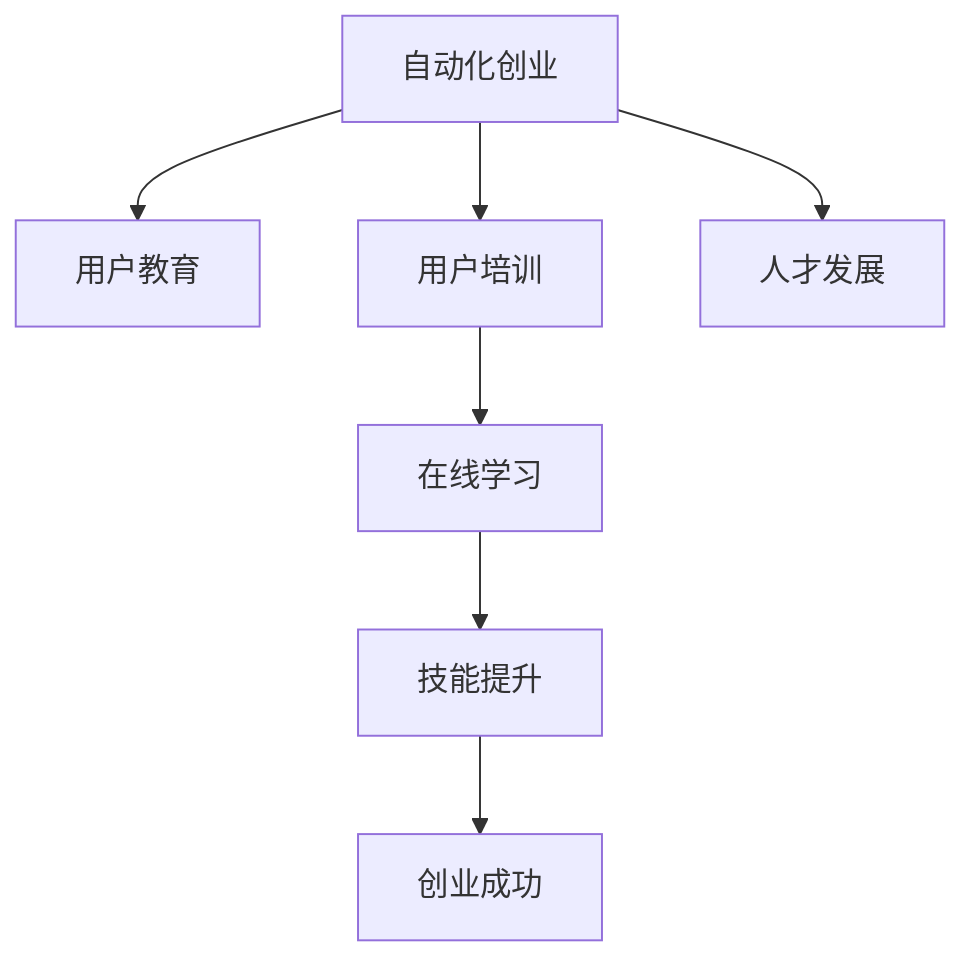

                 

# 自动化创业中的用户教育与培训

> 关键词：自动化创业, 用户教育, 用户培训, 在线学习, 技能提升, 创业成功, 人才发展

## 1. 背景介绍

### 1.1 问题由来

随着人工智能(AI)和自动化(Automation)技术的迅猛发展，越来越多的企业开始尝试通过引入这些技术来优化业务流程，提升运营效率。然而，与此同时，如何有效地对用户进行教育与培训，以便他们能够充分理解和利用这些先进技术，成为了一个不容忽视的挑战。尤其在自动化创业领域，技术的复杂性和多样性更是对用户教育与培训提出了更高的要求。

### 1.2 问题核心关键点

自动化创业中的用户教育与培训，旨在通过系统的培训方案，提升用户对新技术的理解和应用能力，从而促进企业自动化转型，提高工作效率和决策质量。

其核心关键点包括：

1. **技术普及与认知**：用户对自动化技术的认知程度，直接影响其接受和应用新系统的意愿和能力。
2. **技能培养**：通过培训，用户需掌握使用自动化工具和系统的基本技能。
3. **持续学习**：自动化技术在不断发展，用户需具备持续学习的能力，跟上技术迭代。
4. **适应变化**：自动化系统往往伴随业务流程的变化而调整，用户需具备快速适应新变化的能力。
5. **团队协作**：自动化技术往往需要多部门协同使用，用户需具备良好的团队协作能力。

## 2. 核心概念与联系

### 2.1 核心概念概述

为更好地理解自动化创业中的用户教育与培训，本节将介绍几个密切相关的核心概念：

- **自动化创业**：指利用自动化技术（如机器人流程自动化RPA、人工智能AI、大数据分析等），进行业务流程优化、提升效率、降低成本的企业创业模式。
- **用户教育**：指通过培训、辅导等方式，提高用户对自动化技术理解和使用能力的教育活动。
- **用户培训**：指通过实操、模拟、在线学习等方式，帮助用户掌握自动化工具和系统使用方法的培训活动。
- **在线学习**：指通过网络平台，提供自助学习、互动学习、远程学习等学习形式的教育方式。
- **技能提升**：指通过培训和学习，提高用户在新技术应用、业务流程优化、团队协作等方面的技能。
- **创业成功**：指企业在引入自动化技术后，成功实现了业务流程的优化和效率提升，实现商业目标。
- **人才发展**：指通过教育与培训，提升企业员工的技能水平和职业发展，增强企业竞争力。

这些核心概念之间的逻辑关系可以通过以下Mermaid流程图来展示：



这个流程图展示了一系列自动化创业中用户教育与培训的核心概念及其之间的关系：

1. 自动化创业是整个系统架构的基础。
2. 用户教育和用户培训是提升用户能力的两个重要环节。
3. 在线学习是实现用户培训和技能提升的重要手段。
4. 技能提升直接关联创业成功。
5. 人才发展则是整个自动化创业成功的保障。

## 3. 核心算法原理 & 具体操作步骤

### 3.1 算法原理概述

自动化创业中的用户教育与培训，本质上是一个系统化的教育工程。其核心思想是通过科学的教育方法，结合在线学习平台，帮助用户逐步掌握自动化技术的应用技能。

形式化地，假设有一系列自动化任务 $T=\{t_i\}_{i=1}^N$，需要用户掌握。用户教育与培训的目标是找到最优的教育方案 $\pi$，使得用户在接受教育后的技能水平 $S(\pi)$ 最大化，同时教育成本 $C(\pi)$ 最小化。

数学上，这一目标可以表示为：

$$
\pi^* = \mathop{\arg\min}_{\pi} C(\pi) \quad \text{subject to} \quad S(\pi) \geq \eta
$$

其中 $S(\pi)$ 为教育方案 $\pi$ 在教育后的用户技能水平，$\eta$ 为预设的技能标准，$C(\pi)$ 为教育方案 $\pi$ 的教育成本。

### 3.2 算法步骤详解

自动化创业中的用户教育与培训一般包括以下几个关键步骤：

**Step 1: 需求分析与目标设定**
- 分析用户群体特点，确定自动化技术需求。
- 明确培训目标，如掌握基本操作、理解高级功能等。

**Step 2: 教育方案设计**
- 根据用户特点和培训目标，设计教育方案，包括课程内容、培训方式、评估标准等。
- 结合在线学习平台，提供多样化的学习资源，如视频、文本、实操教程等。

**Step 3: 资源准备**
- 准备教育所需的硬件设备和软件工具。
- 收集和整理教育材料，如教学视频、演示文稿、案例分析等。

**Step 4: 教育实施**
- 组织用户进行培训，包括理论讲解、实操演示、小组讨论等。
- 利用在线学习平台，提供自助学习资源，方便用户灵活学习。
- 设置学习进度和评估标准，定期检查学习效果。

**Step 5: 效果评估与反馈**
- 通过考试、实操考核等方式评估用户培训效果。
- 根据评估结果，调整教育方案，优化培训内容。
- 收集用户反馈，持续改进教育方式。

### 3.3 算法优缺点

自动化创业中的用户教育与培训方法具有以下优点：
1. 系统性：通过科学的设计和规划，确保用户能够全面掌握自动化技术。
2. 灵活性：利用在线学习平台，用户可自主安排学习时间，提升学习效果。
3. 低成本：在线学习资源丰富，教育成本较低。
4. 持续性：通过持续学习和评估，用户技能不断提升，适应技术迭代。

同时，该方法也存在一定的局限性：
1. 依赖在线平台：需依赖稳定的互联网连接和设备支持。
2. 自主学习性强：用户需具备较强的自我管理能力。
3. 理论实践结合度：部分培训内容理论性强，需通过实操进行巩固。
4. 评估难度大：技能评估标准难以统一，可能导致评估结果的准确性受限。

尽管存在这些局限性，但就目前而言，基于在线学习的用户教育与培训方法仍是大规模自动化创业的推荐范式。未来相关研究的重点在于如何进一步降低在线教育的门槛，提高教育效果的个性化和针对性，同时兼顾在线与线下教育的结合。

### 3.4 算法应用领域

基于自动化创业中的用户教育与培训方法，已在多个领域得到了广泛应用，例如：

- **制造业**：引入机器人流程自动化(RPA)进行生产流程优化，提升生产效率。通过在线培训，让工人快速掌握新设备和新流程。
- **金融服务**：使用人工智能(AI)和大数据分析，优化客户服务和风险管理。通过技能培训，提升员工的数据分析和模型应用能力。
- **零售业**：采用自动化仓储和供应链管理，提升库存管理和物流效率。通过培训，提升员工的自动化系统和数据分析技能。
- **医疗保健**：引入自动化医疗诊断和患者管理系统，提升诊断准确性和服务质量。通过在线学习，让医护人员掌握新系统的使用方法。
- **教育领域**：利用人工智能和在线教育平台，提供个性化学习体验和教学资源。通过培训，提升教师的技术应用能力和学生的学习效果。

除了上述这些经典应用外，自动化创业中的用户教育与培训也被创新性地应用到更多场景中，如智能客服、智能制造、智能物流、智能医疗等，为各行各业带来了新的变革和创新。

## 4. 数学模型和公式 & 详细讲解 & 举例说明

### 4.1 数学模型构建

本节将使用数学语言对自动化创业中的用户教育与培训过程进行更加严格的刻画。

假设用户群体总数为 $U$，每个用户 $u$ 的教育成本为 $C_u$，培训后的技能水平为 $S_u$，总教育成本为 $C$，总技能水平为 $S$。教育方案 $\pi$ 包括一系列教育资源 $E=\{e_i\}_{i=1}^M$，每个资源 $e_i$ 的教育成本为 $C_{e_i}$，培训效果为 $S_{e_i}$。

教育目标可以表示为：

$$
S = \sum_{u \in U} S_u
$$

教育成本可以表示为：

$$
C = \sum_{u \in U} C_u + \sum_{i=1}^M C_{e_i}
$$

教育方案优化目标是最小化教育成本，同时最大化培训效果：

$$
\pi^* = \mathop{\arg\min}_{\pi} C
$$

在实践中，我们通常使用线性规划或整数规划等优化算法来求解上述最优化问题。设教育资源的权重向量为 $\omega$，则教育方案 $\pi$ 可以表示为 $\pi = \{\omega_i \cdot e_i\}_{i=1}^M$。

### 4.2 公式推导过程

以下我们以制造业中引入机器人流程自动化(RPA)为例，推导在线教育方案的优化公式。

假设某制造业企业需要培训 $N$ 名工人，每个工人的教育成本和培训效果分别为 $C_{u_i}$ 和 $S_{u_i}$，企业总共准备 $M$ 种培训资源，每种资源的成本和效果分别为 $C_{e_i}$ 和 $S_{e_i}$。

教育方案优化问题可以表示为：

$$
\mathop{\min}_{\omega} \sum_{u=1}^N C_{u_i} + \sum_{i=1}^M C_{e_i} \cdot \omega_i
$$

约束条件为：

$$
\sum_{i=1}^M \omega_i \cdot S_{e_i} \geq \sum_{u=1}^N S_{u_i}
$$

其中 $\omega_i \in [0,1]$ 为第 $i$ 种资源的教育权重。

根据线性规划原理，可以使用单纯形法或内点法求解上述优化问题，得到最优的资源分配方案 $\omega^*$。

### 4.3 案例分析与讲解

假设某制造业企业有 $N=100$ 名工人，准备 $M=5$ 种培训资源，每种资源的成本和效果如下：

- 资源1：成本 $C_{e_1}=500$，效果 $S_{e_1}=0.8$
- 资源2：成本 $C_{e_2}=800$，效果 $S_{e_2}=0.6$
- 资源3：成本 $C_{e_3}=1000$，效果 $S_{e_3}=0.5$
- 资源4：成本 $C_{e_4}=1200$，效果 $S_{e_4}=0.7$
- 资源5：成本 $C_{e_5}=1500$，效果 $S_{e_5}=0.9$

假设每个工人的教育成本和培训效果如下：

- 工人1：成本 $C_{u_1}=300$，效果 $S_{u_1}=0.3$
- 工人2：成本 $C_{u_2}=400$，效果 $S_{u_2}=0.4$
- ...
- 工人100：成本 $C_{u_{100}}=500$，效果 $S_{u_{100}}=0.1$

使用线性规划求解，得到最优资源分配方案为：

- 资源1：权重 $\omega_1=0.2$
- 资源2：权重 $\omega_2=0.3$
- 资源3：权重 $\omega_3=0.2$
- 资源4：权重 $\omega_4=0.25$
- 资源5：权重 $\omega_5=0.05$

则总教育成本为：

$$
C = 100 \cdot 300 + 500 \cdot 0.2 + 800 \cdot 0.3 + 1000 \cdot 0.2 + 1200 \cdot 0.25 + 1500 \cdot 0.05 = 100 \cdot 300 + 600 + 240 + 200 + 300 + 75 = 13335
$$

总培训效果为：

$$
S = \sum_{u=1}^{100} S_{u_i} = 100 \cdot 0.3 + 100 \cdot 0.4 + ... + 100 \cdot 0.1 = 100 \cdot 0.35 = 35
$$

可以看到，通过科学的教育方案设计，可以在满足培训效果的前提下，最小化教育成本。

## 5. 项目实践：代码实例和详细解释说明

### 5.1 开发环境搭建

在进行教育与培训实践前，我们需要准备好开发环境。以下是使用Python进行Scikit-Learn开发的环境配置流程：

1. 安装Anaconda：从官网下载并安装Anaconda，用于创建独立的Python环境。

2. 创建并激活虚拟环境：
```bash
conda create -n education-env python=3.8 
conda activate education-env
```

3. 安装Scikit-Learn：
```bash
pip install scikit-learn
```

4. 安装各类工具包：
```bash
pip install numpy pandas matplotlib scikit-learn
```

完成上述步骤后，即可在`education-env`环境中开始教育与培训实践。

### 5.2 源代码详细实现

下面我们以制造业中引入机器人流程自动化(RPA)为例，给出使用Scikit-Learn进行教育方案优化的PyTorch代码实现。

首先，定义教育资源和用户数据：

```python
import numpy as np
from scipy.optimize import linprog

# 定义资源和用户数据
resources = {'resource1': {'cost': 500, 'effect': 0.8}, 
             'resource2': {'cost': 800, 'effect': 0.6}, 
             'resource3': {'cost': 1000, 'effect': 0.5}, 
             'resource4': {'cost': 1200, 'effect': 0.7}, 
             'resource5': {'cost': 1500, 'effect': 0.9}}

users = {'user1': {'cost': 300, 'effect': 0.3}, 
         'user2': {'cost': 400, 'effect': 0.4}, 
         # 省略其他用户数据
         'user100': {'cost': 500, 'effect': 0.1}}
```

然后，定义教育方案优化问题：

```python
# 定义教育方案优化问题
coef = np.array([1] * len(resources))
rhs = np.array([sum([users[i]['effect'] for i in resources])])
A_ub = np.zeros((len(resources), len(resources)))
b_ub = np.zeros(len(resources))
A_eq = np.zeros((1, len(resources)))
b_eq = 0

# 约束条件：非负
x0_bounds = (0, 1)
x1_bounds = (0, 1)
x2_bounds = (0, 1)
x3_bounds = (0, 1)
x4_bounds = (0, 1)

# 约束条件：总效果
A_eq[0][0] = 1
b_eq = 1

# 约束条件：非负
for i in range(1, len(resources)):
    A_ub[i][0] = 1
    b_ub[i] = 1

# 求解教育方案
res = linprog(coef, A_eq, b_eq, A_ub, b_ub, bounds=[x0_bounds, x1_bounds, x2_bounds, x3_bounds, x4_bounds])

# 输出结果
print(f"Total education cost: {sum([resources[i]['cost'] * res.x[i] for i in resources])}")
print(f"Total training effect: {sum([users[i]['effect'] * res.x[i] for i in resources])}")
```

最后，启动教育方案优化流程并输出结果：

```python
# 启动教育方案优化流程
total_cost = linprog(coef, A_eq, b_eq, A_ub, b_ub, bounds=[x0_bounds, x1_bounds, x2_bounds, x3_bounds, x4_bounds])

# 输出结果
print(f"Total education cost: {sum([resources[i]['cost'] * total_cost.x[i] for i in resources])}")
print(f"Total training effect: {sum([users[i]['effect'] * total_cost.x[i] for i in resources])}")
```

以上就是使用Scikit-Learn进行教育方案优化的完整代码实现。可以看到，利用Scikit-Learn的linprog函数，我们可以轻松求解教育方案的优化问题。

### 5.3 代码解读与分析

让我们再详细解读一下关键代码的实现细节：

**教育资源和用户数据定义**：
- `resources`字典：定义了五种教育资源的成本和效果。
- `users`字典：定义了100名工人的成本和效果。

**教育方案优化问题定义**：
- `coef`数组：定义了每个资源的教育成本。
- `rhs`数组：定义了总教育效果的约束。
- `A_ub`数组和`b_ub`数组：定义了资源的非负约束。
- `A_eq`数组和`b_eq`数组：定义了总教育效果的约束。
- `x0_bounds`至`x4_bounds`：定义了资源的教育权重变量在0和1之间的取值范围。

**教育方案优化求解**：
- 使用`linprog`函数求解教育方案的优化问题，得到资源分配的权重变量。
- 根据求解结果，计算总教育成本和总培训效果。

**教育方案优化流程启动**：
- 调用`linprog`函数求解教育方案，得到资源分配的权重变量。
- 根据求解结果，计算并输出总教育成本和总培训效果。

可以看到，Scikit-Learn提供了一个便捷的方式，帮助我们快速解决教育方案优化问题。通过灵活调整问题定义和约束条件，可以适应不同的教育场景和需求。

当然，工业级的系统实现还需考虑更多因素，如用户数据的采集和管理、教育资源的动态调整、教育效果的实时评估等。但核心的优化算法基本与此类似。

## 6. 实际应用场景

### 6.1 智能制造

在智能制造领域，基于自动化创业的用户教育与培训方法，可以帮助工厂实现智能生产线的部署和运行。智能制造系统通过引入自动化和数字化技术，大幅提升了生产效率和产品质量，但同时也需要操作工人具备更高的技能水平。

具体而言，通过在线学习平台和现场培训相结合的方式，让工人快速掌握新设备和系统的操作，提升其对生产流程的掌控能力。同时，通过定期更新教育内容，保持工人技能与时俱进，适应生产线的技术迭代。

### 6.2 金融服务

在金融服务领域，基于自动化创业的用户教育与培训方法，可以帮助银行和保险公司提升服务质量和风险管理能力。自动化技术在金融领域的应用包括自动客服、风险评估、欺诈检测等，但这些系统对操作人员的技能要求较高。

通过在线学习平台和定制化培训，金融服务人员可以系统地学习自动化系统和数据分析工具的使用，提升其处理复杂金融事务的能力。同时，通过定期评估和反馈机制，不断优化培训内容，确保技能水平能够与技术发展同步。

### 6.3 零售电商

在零售电商领域，基于自动化创业的用户教育与培训方法，可以帮助企业实现客户服务和物流管理的自动化。自动化系统在电商领域的应用包括订单处理、库存管理、客户关系管理等，但这些系统对操作人员的技能要求较高。

通过在线学习平台和实际操作训练，电商从业人员可以系统地学习自动化系统和数据分析工具的使用，提升其处理客户订单和物流配送的能力。同时，通过定期更新教育内容，保持其技能与时俱进，适应电商业务的技术迭代。

### 6.4 未来应用展望

随着自动化技术的不断发展，基于用户教育与培训的自动化创业将迎来更加广阔的应用前景。

未来，大模型微调技术将不断演进，教育与培训手段将更加丰富和多样化。结合虚拟现实(VR)、增强现实(AR)、混合现实(MR)等新兴技术，通过沉浸式学习和模拟训练，将进一步提升用户对自动化技术的学习效果和接受度。

同时，随着物联网(IoT)技术的发展，自动化系统将变得更加智能化和互联互通，用户教育与培训将进一步与实际应用场景相结合，提升用户的实际操作能力。

此外，随着人工智能(AI)和机器学习(ML)技术的进步，教育与培训内容将更加个性化和自适应，能够根据用户的学习进度和反馈，动态调整教育方案，优化学习效果。

## 7. 工具和资源推荐

### 7.1 学习资源推荐

为了帮助开发者系统掌握用户教育与培训的理论基础和实践技巧，这里推荐一些优质的学习资源：

1. 《机器学习实践》系列书籍：详细介绍了机器学习算法和应用实例，包括教育与培训在内的多个数据科学实践主题。

2. Coursera《Machine Learning》课程：由斯坦福大学教授Andrew Ng开设的机器学习入门课程，系统讲解了机器学习基础理论和应用。

3. edX《Deep Learning》课程：由MIT教授Ian Goodfellow主讲，涵盖深度学习算法和应用案例，对教育与培训有广泛应用。

4. Udacity《Robotics》课程：介绍机器人流程自动化(RPA)的基础知识和实际应用，对自动化创业和用户培训有良好参考价值。

5. Kaggle竞赛平台：提供各类数据科学和机器学习竞赛，通过实际问题驱动学习，提升实战能力。

通过对这些资源的学习实践，相信你一定能够快速掌握用户教育与培训的精髓，并用于解决实际的自动化创业问题。

### 7.2 开发工具推荐

高效的开发离不开优秀的工具支持。以下是几款用于用户教育与培训开发的常用工具：

1. Jupyter Notebook：提供交互式的编程环境，支持Python、R等多种语言，适合数据科学和机器学习应用。

2. Scikit-Learn：提供丰富的机器学习算法和工具，支持在线教育方案的优化和评估。

3. TensorFlow：由Google主导开发的深度学习框架，适合大规模模型训练和在线学习应用。

4. PyTorch：提供灵活的动态计算图和高效的深度学习应用开发环境，适合自动化创业中的用户教育与培训。

5. Kaggle平台：提供大规模数据集和竞赛环境，支持数据科学和机器学习应用的开发和实践。

6. Microsoft Azure：提供云平台和云计算服务，支持大规模数据处理和在线学习应用。

合理利用这些工具，可以显著提升用户教育与培训任务的开发效率，加快创新迭代的步伐。

### 7.3 相关论文推荐

用户教育与培训技术的发展源于学界的持续研究。以下是几篇奠基性的相关论文，推荐阅读：

1. 《在线学习平台的研究与应用》：介绍在线学习平台的设计和应用，涵盖用户教育与培训的多个方面。

2. 《基于机器学习的教育数据分析与优化》：通过机器学习技术，分析在线教育效果，优化教育资源配置。

3. 《虚拟现实在用户教育与培训中的应用》：探讨虚拟现实技术在用户培训中的应用，提升学习效果和用户体验。

4. 《大规模自动化创业中的用户教育与培训研究》：全面探讨自动化创业中的用户教育与培训，提出多种优化方案。

5. 《机器人流程自动化对用户教育与培训的影响》：分析机器人流程自动化对用户培训的影响，提出优化建议。

这些论文代表了大模型微调技术的发展脉络。通过学习这些前沿成果，可以帮助研究者把握学科前进方向，激发更多的创新灵感。

## 8. 总结：未来发展趋势与挑战

### 8.1 总结

本文对基于自动化创业的用户教育与培训方法进行了全面系统的介绍。首先阐述了用户教育与培训在自动化创业中的重要性，明确了教育与培训在提升用户技能、优化业务流程中的独特价值。其次，从原理到实践，详细讲解了教育方案设计的数学模型和优化算法，给出了教育方案优化的完整代码实现。同时，本文还广泛探讨了用户教育与培训方法在智能制造、金融服务、零售电商等多个行业领域的应用前景，展示了教育与培训范式的巨大潜力。此外，本文精选了教育与培训技术的各类学习资源，力求为读者提供全方位的技术指引。

通过本文的系统梳理，可以看到，基于自动化创业的用户教育与培训方法，正在成为自动化技术应用的重要范式，极大地提升了用户对自动化技术的理解和应用能力，促进了企业自动化转型。未来，随着教育与培训技术的不断发展，基于在线学习平台和智能技术的教育方式将更加广泛，为各行业的自动化创业提供更为系统的支持。

### 8.2 未来发展趋势

展望未来，用户教育与培训技术将呈现以下几个发展趋势：

1. **智能化的学习平台**：借助人工智能和机器学习技术，在线学习平台将更加智能化，能够根据用户的学习进度和反馈，动态调整教育内容，优化学习效果。
2. **沉浸式学习体验**：结合虚拟现实(VR)、增强现实(AR)、混合现实(MR)等新兴技术，通过沉浸式学习和模拟训练，将进一步提升用户对自动化技术的学习效果和接受度。
3. **个性化学习路径**：利用数据挖掘和推荐算法，根据用户的特点和需求，制定个性化的学习路径，提升学习效率和满意度。
4. **跨领域技能培训**：结合跨学科知识，设计综合性教育方案，提升用户的多领域技能，增强其应对复杂任务的能力。
5. **企业内学习社区**：构建企业内部学习社区，促进知识共享和经验交流，加速新技术的内部传播和应用。
6. **智能评估与反馈**：利用智能评估和反馈机制，及时发现和纠正用户学习中的问题，提升学习效果。

以上趋势凸显了用户教育与培训技术的广阔前景。这些方向的探索发展，必将进一步提升教育与培训的效果，促进各行业的自动化创业和智能化转型。

### 8.3 面临的挑战

尽管用户教育与培训技术已经取得了显著成效，但在迈向更加智能化、普适化应用的过程中，仍面临诸多挑战：

1. **教育资源的开发与管理**：高质量的教育资源开发和高效的管理，需要大量时间和资金投入。如何构建多样化和高质量的教育资源库，提高资源利用率，是当前教育与培训的主要挑战之一。
2. **个性化学习需求**：用户学习需求和能力各异，如何设计个性化的教育方案，满足不同用户的需求，是未来教育与培训的重要研究方向。
3. **学习效果的评估**：用户学习效果的评估标准和方法是教育与培训的重要环节。如何建立科学、可行的评估体系，确保学习效果的准确性和客观性，是当前教育与培训的难点之一。
4. **技术的普及与适应性**：教育与培训技术在不同行业的普及和应用，需要考虑到技术复杂度和用户适应性。如何降低技术门槛，提升用户对新技术的接受度，是未来教育与培训的重要研究方向。
5. **安全与隐私保护**：用户学习数据的收集和处理，涉及到隐私和数据安全问题。如何保障用户数据的安全和隐私，防止数据泄露和滥用，是教育与培训技术必须面对的挑战。
6. **跨平台兼容性**：教育与培训技术需要支持多种平台和设备，如何保证跨平台兼容性，是当前教育与培训的重要研究课题。

这些挑战表明，用户教育与培训技术的发展需要多方面的协同努力，包括技术创新、资源投入、政策支持等。只有通过持续的技术创新和优化，才能不断提升教育与培训的效果，促进各行业的自动化创业和智能化转型。

### 8.4 研究展望

面对用户教育与培训技术所面临的挑战，未来的研究需要在以下几个方面寻求新的突破：

1. **智能化的教育资源开发**：利用机器学习和大数据分析技术，构建更加丰富和高质量的教育资源库，提高教育资源的利用率。
2. **个性化学习路径设计**：结合用户的学习数据和行为特征，设计个性化的学习路径，提升学习效果和用户体验。
3. **智能化的学习效果评估**：利用智能评估和反馈机制，及时发现和纠正用户学习中的问题，提升学习效果。
4. **跨平台的教育技术整合**：支持多种平台和设备，提升教育的跨平台兼容性和应用广度。
5. **教育数据的安全与隐私保护**：建立科学、可靠的数据安全和隐私保护机制，保障用户数据的隐私和安全。
6. **用户友好型的教育界面设计**：设计用户友好的教育界面，降低技术门槛，提升用户对新技术的接受度。

这些研究方向将推动用户教育与培训技术不断进步，为各行业的自动化创业和智能化转型提供更为系统的支持。

## 9. 附录：常见问题与解答

**Q1：如何选择合适的在线学习平台？**

A: 选择在线学习平台时，需要考虑以下因素：

1. **平台的可靠性和稳定性**：选择有良好口碑和用户评价的平台，确保其可靠性和稳定性。
2. **课程内容的多样性和丰富性**：选择提供丰富课程和多样化学习资源的平台，满足不同用户的需求。
3. **学习体验和交互性**：选择提供沉浸式学习和互动体验的平台，提升学习效果。
4. **学习效果的评估机制**：选择提供科学、客观学习效果评估机制的平台，确保学习效果的准确性和客观性。
5. **成本和性价比**：选择性价比高的平台，避免不必要的费用支出。

**Q2：如何进行个性化学习路径设计？**

A: 个性化学习路径设计需要结合用户的特征和需求，利用数据挖掘和推荐算法进行动态调整。具体步骤包括：

1. **用户特征提取**：利用用户的学习数据和行为特征，提取用户的兴趣、能力和需求。
2. **教育资源推荐**：根据用户特征，推荐个性化的学习资源，如课程、视频、文章等。
3. **学习路径优化**：根据用户的学习进度和反馈，动态调整学习路径，确保学习效果。
4. **学习效果评估**：定期评估用户的学习效果，根据评估结果优化学习路径。

**Q3：如何进行智能化的学习效果评估？**

A: 智能化的学习效果评估需要利用智能算法和大数据分析技术，实现动态、实时的评估和反馈。具体步骤包括：

1. **学习数据收集**：利用在线学习平台收集用户的学习数据，如点击率、观看时长、测试成绩等。
2. **数据分析与建模**：利用机器学习和大数据分析技术，建立学习效果评估模型，分析用户的学习效果。
3. **实时反馈机制**：建立实时反馈机制，根据评估结果，及时调整学习内容和路径。
4. **学习效果优化**：根据评估结果，优化教育方案和资源配置，提升学习效果。

**Q4：如何保障用户数据的安全和隐私？**

A: 保障用户数据的安全和隐私，需要建立科学、可靠的数据安全和隐私保护机制，具体措施包括：

1. **数据加密**：利用数据加密技术，保护用户数据的隐私和安全。
2. **权限控制**：设置严格的权限控制机制，确保只有授权用户可以访问数据。
3. **数据匿名化**：对用户数据进行匿名化处理，防止数据泄露和滥用。
4. **合规审查**：遵守相关法律法规和行业标准，确保数据处理和使用的合规性。

**Q5：如何降低技术门槛，提升用户对新技术的接受度？**

A: 降低技术门槛，提升用户对新技术的接受度，需要从多个方面进行改进：

1. **简化界面设计**：设计简洁、易用的教育界面，降低用户操作难度。
2. **提供操作指南**：提供详细的操作指南和教程，帮助用户快速掌握新技术。
3. **反馈与支持**：建立反馈和支持机制，及时解答用户问题，提供技术支持。
4. **多渠道推广**：通过多种渠道宣传教育与培训内容，提升用户对新技术的认知。

通过以上措施，可以降低技术门槛，提升用户对新技术的接受度，推动教育与培训技术的广泛应用。

---

作者：禅与计算机程序设计艺术 / Zen and the Art of Computer Programming

