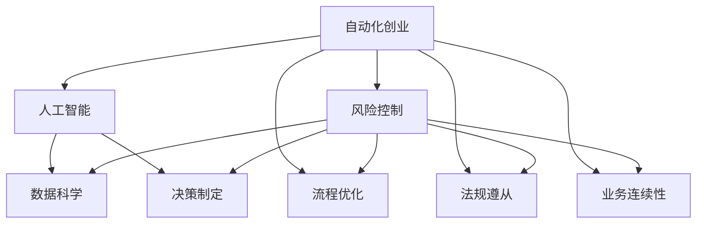

                 

# 自动化创业中的风险控制

> 关键词：
  自动化创业、风险控制、人工智能、机器学习、数据科学、决策制定、流程优化、风险管理、技术选型、资源配置、业务连续性

## 1. 背景介绍

### 1.1 问题由来
随着人工智能(AI)和自动化(Automation)技术的迅猛发展，越来越多的企业和创业者选择利用AI和自动化技术，在减少人力成本的同时，提高业务效率和竞争力。然而，自动化创业并非无风险的，如果没有充分的风险控制策略，不仅无法实现商业价值，还可能面临诸多风险，导致项目失败。因此，如何构建有效的风险控制体系，成为自动化创业成功的关键。

### 1.2 问题核心关键点
自动化创业中的风险控制，涉及技术、业务、管理、法律等多方面的考量，核心关键点包括：

- 数据质量与可用性：高质量的数据是AI和自动化应用的基础，数据的可用性和完整性直接影响系统的性能。
- 技术选型与集成：选择适合业务需求的AI和自动化技术，并进行有效的技术集成，是系统成功实施的第一步。
- 资源配置与成本控制：合理配置系统资源，控制成本，避免资源浪费，是自动化创业中的关键问题。
- 业务连续性与容错性：自动化系统必须具备高度的业务连续性和容错能力，以保证业务稳定运行。
- 法规遵从与数据隐私：遵守相关法律法规，保护数据隐私，是自动化创业中不可或缺的合规性要求。

### 1.3 问题研究意义
构建有效的自动化创业风险控制体系，对于降低创业风险，保障项目成功具有重要意义：

1. 减少不确定性：通过全面的风险评估和管理，能够提前识别和应对潜在风险，减少项目失败的可能性。
2. 提升系统稳定性：确保系统的技术选型、资源配置、业务连续性等关键环节稳定运行，避免因技术或管理问题导致系统崩溃。
3. 增强合规性：遵守法规，保护数据隐私，增强企业信誉，降低法律风险。
4. 优化资源利用：通过合理的成本控制和资源配置，提升投资回报率，提高项目的经济效益。
5. 促进持续改进：基于数据分析和业务反馈，持续优化系统性能，实现长期的商业价值。

## 2. 核心概念与联系

### 2.1 核心概念概述

为更好地理解自动化创业中的风险控制，本节将介绍几个密切相关的核心概念：

- 自动化创业(Automatic Entrepreneurship)：利用AI和自动化技术，通过自动化流程优化，提高业务效率和决策质量，降低人力成本的创业模式。
- 风险控制(Risk Management)：通过识别、评估和控制风险，保障项目顺利实施，降低商业风险的管理策略。
- 人工智能(Artificial Intelligence)：通过机器学习、深度学习等技术，实现数据驱动的智能决策和自动化流程。
- 数据科学(Data Science)：以数据为核心，通过统计、分析和建模技术，提取有价值的信息，支持决策制定。
- 决策制定(Decision Making)：通过系统化的分析方法，制定最优决策，优化资源配置和业务流程。
- 流程优化(Process Optimization)：利用自动化技术，优化业务流程，提高效率和效果。
- 法规遵从(Regulatory Compliance)：遵守相关法律法规，保护数据隐私和用户权益。
- 业务连续性(Business Continuity)：确保业务在各种情况下都能连续稳定运行，避免因技术或管理问题导致业务中断。

这些核心概念之间的逻辑关系可以通过以下Mermaid流程图来展示：



这个流程图展示了一些核心概念及其之间的关系：

1. 自动化创业通过人工智能、数据科学等技术支持，提升决策制定和流程优化能力。
2. 风险控制贯穿于自动化创业的全过程，通过评估和管理风险，保障项目顺利实施。
3. 法规遵从和业务连续性是风险控制的重要组成部分，确保项目合规性和系统稳定性。
4. 数据科学为决策制定提供支撑，人工智能和流程优化则进一步提升决策的智能化和自动化水平。

这些概念共同构成了自动化创业的风险控制框架，使得创业者能够系统地识别、评估和管理项目中的各种风险，保障项目成功。

## 3. 核心算法原理 & 具体操作步骤
### 3.1 算法原理概述

自动化创业中的风险控制，主要通过系统化的数据处理、模型训练、策略制定和流程优化，实现对潜在风险的识别、评估和控制。核心算法原理包括以下几个方面：

- 数据预处理：通过数据清洗、特征工程等方法，提升数据质量，为模型训练和决策制定提供可靠的基础。
- 模型训练与评估：利用机器学习算法，训练预测模型，评估模型性能，确保模型能够准确预测和识别风险。
- 风险识别与分析：通过多维度数据关联分析和模型预测，识别潜在风险点，分析风险发生的可能性和影响。
- 风险控制策略：基于风险分析结果，制定风险控制策略，包括预防、减轻和转移等多种措施。
- 流程优化与改进：通过持续优化业务流程，提高自动化系统的稳定性和效果，降低风险。

### 3.2 算法步骤详解

自动化创业中的风险控制，可以按照以下步骤进行：

**Step 1: 数据收集与预处理**

- 收集相关业务数据，包括但不限于交易记录、客户反馈、市场数据、系统日志等。
- 对数据进行清洗、去重、格式化等预处理操作，提升数据质量。
- 应用特征工程技术，提取有意义的特征，为模型训练提供数据支持。

**Step 2: 模型训练与评估**

- 选择适合的机器学习算法，如回归分析、分类、聚类等，训练风险预测模型。
- 使用交叉验证等技术，评估模型性能，确保模型的泛化能力。
- 应用超参数调优技术，优化模型参数，提升预测准确度。

**Step 3: 风险识别与分析**

- 利用训练好的模型，对收集到的数据进行预测，识别潜在的风险点。
- 应用关联分析、异常检测等技术，深入分析风险点的特征和分布。
- 结合业务经验，综合评估风险点和影响，制定风险等级。

**Step 4: 风险控制策略制定**

- 根据风险等级和类型，制定相应的风险控制策略，如预防、减轻和转移。
- 针对不同风险点，设计具体的控制措施，如增加数据校验、加强异常监控、引入保险等。
- 实施风险控制策略，并通过反馈机制，持续优化和改进。

**Step 5: 流程优化与改进**

- 利用自动化技术，持续优化业务流程，提升系统稳定性和效率。
- 定期评估自动化系统的效果，识别和改进流程中的薄弱环节。
- 应用持续改进技术，如精益管理、DevOps等，实现流程的持续优化。

### 3.3 算法优缺点

自动化创业中的风险控制，具有以下优点：

1. 系统化管理：通过系统化的数据处理、模型训练和策略制定，全面管理风险，降低不确定性。
2. 实时监控：利用自动化技术，实时监控系统运行状态，及时发现和应对风险。
3. 高效响应：通过自动化的流程优化，快速响应业务需求，提高效率。
4. 数据驱动：基于数据和模型驱动的决策制定，增强决策的科学性和准确性。

同时，该方法也存在一些局限性：

1. 数据质量依赖：模型的准确性高度依赖于数据的质量和完整性，数据预处理和特征工程要求高。
2. 模型复杂性：高复杂度的模型训练和评估，需要较强的技术储备和计算资源。
3. 策略执行难度：风险控制策略的实施需要跨部门协作，执行难度较大。
4. 法规遵从复杂：法规环境和业务需求的多变性，增加了合规管理的复杂性。

尽管存在这些局限性，但就目前而言，基于数据驱动和自动化技术的风险控制方法仍是大规模自动化创业项目的主流范式。未来相关研究的重点在于如何进一步提升数据质量、优化模型性能、简化策略执行流程、加强法规遵从等，以提高自动化创业项目的成功率。

### 3.4 算法应用领域

自动化创业中的风险控制，在多个领域得到了广泛应用，例如：

- 金融科技(Fintech)：利用AI和自动化技术，优化金融业务流程，降低风险。
- 零售电商(E-commerce)：通过智能推荐和库存管理，提升客户体验，降低运营成本。
- 制造业(Manufacturing)：通过自动化生产流程和质量控制，提高生产效率和产品品质。
- 物流仓储(Logistics)：利用机器人技术和自动化调度算法，优化物流流程，降低配送成本。
- 医疗健康(Healthcare)：通过智能诊断和自动化流程，提升医疗服务质量和效率。

除了上述这些经典应用领域，自动化创业的风险控制方法，还被创新性地应用到更多场景中，如智能客服、智能制造、智能交通等，为各行各业带来了新的变革。随着AI和自动化技术的不断演进，相信自动化创业中的风险控制方法将继续拓展，推动各行各业数字化转型升级。

## 4. 数学模型和公式 & 详细讲解 & 举例说明

### 4.1 数学模型构建

本节将使用数学语言对自动化创业中的风险控制过程进行更加严格的刻画。

记自动化创业项目为 $P$，其中涉及的数据集为 $D=\{(x_i,y_i)\}_{i=1}^N$，其中 $x_i$ 为输入数据，$y_i$ 为标签（风险等级）。

定义风险预测模型为 $M_{\theta}$，其中 $\theta$ 为模型参数。假设风险预测模型为线性回归模型，则经验风险函数为：

$$
\mathcal{L}(\theta) = \frac{1}{N}\sum_{i=1}^N (y_i - M_{\theta}(x_i))^2
$$

模型的预测结果为 $M_{\theta}(x)$，模型的训练目标是最小化经验风险函数。

### 4.2 公式推导过程

以下我们以金融风险预测为例，推导线性回归模型的风险预测公式及其梯度计算。

假设金融业务数据为 $(x_i,y_i)$，其中 $x_i=(x_{i1},x_{i2},...,x_{in})$ 为输入特征向量，$y_i$ 为风险等级。则线性回归模型的预测结果为：

$$
M_{\theta}(x) = \theta_0 + \sum_{j=1}^{n}\theta_jx_{ij}
$$

其中 $\theta_0$ 为截距，$\theta_j$ 为第 $j$ 个特征的系数。

模型的经验风险函数为：

$$
\mathcal{L}(\theta) = \frac{1}{N}\sum_{i=1}^N (y_i - (\theta_0 + \sum_{j=1}^{n}\theta_jx_{ij}))^2
$$

根据链式法则，损失函数对参数 $\theta_j$ 的梯度为：

$$
\frac{\partial \mathcal{L}(\theta)}{\partial \theta_j} = \frac{2}{N}\sum_{i=1}^N (y_i - (\theta_0 + \sum_{j=1}^{n}\theta_jx_{ij}))x_{ij}
$$

在得到损失函数的梯度后，即可带入参数更新公式，完成模型的迭代优化。重复上述过程直至收敛，最终得到适应特定业务的风险预测模型。

### 4.3 案例分析与讲解

假设某金融科技公司，利用自动化技术优化贷款审批流程，通过分析用户的历史信用记录、收入水平、就业情况等数据，预测其信用风险。

**案例背景：**

- 数据集：公司历史贷款记录，包含用户基本信息和贷款审批结果。
- 模型选择：线性回归模型。
- 训练数据：随机抽取公司前一年的贷款记录作为训练集。
- 验证数据：选取近一年的贷款记录作为验证集。
- 测试数据：使用验证集模型，对新用户进行风险预测。

**案例流程：**

1. **数据收集与预处理**：收集用户基本信息和历史贷款记录，并进行数据清洗、去重、格式化等预处理操作。应用特征工程技术，提取有意义的特征，如用户收入、就业年限等。

2. **模型训练与评估**：选择线性回归模型，使用随机梯度下降法进行训练。应用交叉验证技术，评估模型性能。调整模型参数，提升预测准确度。

3. **风险识别与分析**：利用训练好的模型，对新用户的贷款申请进行预测，识别潜在的高风险用户。应用关联分析技术，深入分析高风险用户的特征。

4. **风险控制策略制定**：根据风险等级，制定相应的风险控制策略，如提高审批门槛、增加数据校验等。

5. **流程优化与改进**：利用自动化技术，优化贷款审批流程，提升系统稳定性和效率。定期评估自动化系统的效果，识别和改进流程中的薄弱环节。

最终，通过持续优化和改进，金融科技公司成功降低了贷款违约率，提高了贷款审批的效率和质量。

## 5. 项目实践：代码实例和详细解释说明
### 5.1 开发环境搭建

在进行风险控制项目开发前，我们需要准备好开发环境。以下是使用Python进行PyTorch开发的环境配置流程：

1. 安装Anaconda：从官网下载并安装Anaconda，用于创建独立的Python环境。

2. 创建并激活虚拟环境：
```bash
conda create -n pytorch-env python=3.8 
conda activate pytorch-env
```

3. 安装PyTorch：根据CUDA版本，从官网获取对应的安装命令。例如：
```bash
conda install pytorch torchvision torchaudio cudatoolkit=11.1 -c pytorch -c conda-forge
```

4. 安装Pandas、NumPy、Matplotlib等库：
```bash
pip install pandas numpy matplotlib scikit-learn tqdm jupyter notebook ipython
```

5. 安装TensorFlow：
```bash
pip install tensorflow
```

完成上述步骤后，即可在`pytorch-env`环境中开始风险控制项目开发。

### 5.2 源代码详细实现

下面我以金融风险预测为例，给出使用TensorFlow进行风险控制模型的PyTorch代码实现。

首先，定义数据处理函数：

```python
import pandas as pd
from sklearn.model_selection import train_test_split
from sklearn.preprocessing import StandardScaler

def load_data(file_path):
    data = pd.read_csv(file_path)
    features = data.drop(['label'], axis=1)
    labels = data['label']
    features, labels = train_test_split(features, labels, test_size=0.2, random_state=42)
    scaler = StandardScaler()
    features = scaler.fit_transform(features)
    return features, labels
```

然后，定义模型和优化器：

```python
from tensorflow.keras.models import Sequential
from tensorflow.keras.layers import Dense

model = Sequential()
model.add(Dense(32, input_dim=10, activation='relu'))
model.add(Dense(16, activation='relu'))
model.add(Dense(1, activation='sigmoid'))
model.compile(loss='binary_crossentropy', optimizer='adam', metrics=['accuracy'])

optimizer = optimizer()
```

接着，定义训练和评估函数：

```python
from tensorflow.keras.utils import to_categorical

def train_model(model, features, labels, epochs):
    model.fit(features, labels, batch_size=32, epochs=epochs, validation_split=0.2)

def evaluate_model(model, features, labels):
    loss, accuracy = model.evaluate(features, labels)
    print('Loss:', loss)
    print('Accuracy:', accuracy)
```

最后，启动训练流程并在测试集上评估：

```python
epochs = 100

features, labels = load_data('data.csv')
train_features, test_features, train_labels, test_labels = train_test_split(features, labels, test_size=0.2, random_state=42)

train_model(model, train_features, train_labels, epochs)
evaluate_model(model, test_features, test_labels)
```

以上就是使用TensorFlow对金融风险预测模型进行风险控制训练的完整代码实现。可以看到，TensorFlow的强大封装使得模型训练和评估的代码实现变得简洁高效。

### 5.3 代码解读与分析

让我们再详细解读一下关键代码的实现细节：

**load_data函数**：
- 加载数据集，使用Pandas读取CSV文件。
- 对数据进行分割，保留训练集和测试集。
- 对特征进行标准化处理，确保特征在同一尺度下。

**train_model函数**：
- 定义模型结构，使用TensorFlow的Sequential模型，添加多个全连接层。
- 编译模型，设置损失函数、优化器和评估指标。
- 使用训练集对模型进行迭代训练，验证集评估模型性能。

**evaluate_model函数**：
- 在测试集上评估模型性能，输出损失和准确率。

**训练流程**：
- 定义总的训练轮数。
- 加载数据集，分割训练集和测试集。
- 在训练集上训练模型，输出验证集上的评估结果。
- 在测试集上评估模型性能，给出最终测试结果。

可以看到，TensorFlow配合Pandas、NumPy等库，使得风险控制模型的开发过程变得简单易懂。开发者可以将更多精力放在数据处理、模型改进等高层逻辑上，而不必过多关注底层的实现细节。

当然，工业级的系统实现还需考虑更多因素，如模型的保存和部署、超参数的自动搜索、更灵活的数据预处理等。但核心的风险控制范式基本与此类似。

## 6. 实际应用场景
### 6.1 智能制造

在智能制造领域，基于自动化创业的风险控制技术，可以实现生产流程的智能化管理。传统制造企业往往面临设备维护困难、生产效率低下的问题。通过智能监测和风险预测，可以有效提升生产效率和设备利用率。

具体而言，可以收集生产设备的运行数据，如温度、压力、振动等，并利用机器学习算法，建立设备故障预测模型。在发现设备异常时，及时发出预警，减少停机时间和维修成本。同时，应用自动化技术，优化生产流程，减少人工干预，提升生产效率。

### 6.2 智能客服

在智能客服领域，基于自动化创业的风险控制技术，可以实现智能客服系统的稳定运行。传统客服系统往往无法满足高峰期的需求，响应速度慢，客户体验差。通过智能监测和风险控制，可以显著提升客服系统的稳定性。

具体而言，可以收集历史客服数据，建立客户满意度预测模型。在客服系统负荷高时，及时调整资源配置，避免系统崩溃。同时，应用自动化技术，优化客服流程，减少人工干预，提升客服效率和质量。

### 6.3 智慧物流

在智慧物流领域，基于自动化创业的风险控制技术，可以实现物流配送的智能化管理。传统物流企业往往面临配送成本高、运输效率低的问题。通过智能监测和风险预测，可以有效提升配送效率和准确性。

具体而言，可以收集物流配送数据，如货物重量、运送时间、配送路线等，并利用机器学习算法，建立配送风险预测模型。在发现异常情况时，及时调整配送策略，减少配送成本和风险。同时，应用自动化技术，优化物流流程，提升配送效率和质量。

### 6.4 未来应用展望

随着自动化创业中的风险控制技术不断演进，其在更多领域的应用前景广阔。

在智慧医疗领域，基于风险控制技术，可以实现病患风险预测、疾病诊断等应用，提升医疗服务的智能化水平。

在智能教育领域，基于风险控制技术，可以实现学习行为预测、学习效果评估等应用，提升教学质量和学习效率。

在智慧城市治理中，基于风险控制技术，可以实现城市事件监测、公共安全预警等应用，提高城市管理的自动化和智能化水平。

此外，在企业生产、社会治理、文娱传媒等众多领域，基于自动化创业的风险控制技术也将不断涌现，为各行各业带来新的变革。相信随着技术的日益成熟，风险控制方法将成为自动化创业项目的重要保障，推动人工智能技术在各行各业的规模化落地。

## 7. 工具和资源推荐
### 7.1 学习资源推荐

为了帮助开发者系统掌握自动化创业中的风险控制理论基础和实践技巧，这里推荐一些优质的学习资源：

1. 《机器学习实战》系列书籍：由权威作者撰写，深入浅出地介绍了机器学习算法及其应用，是入门机器学习的绝佳选择。

2. CS229《机器学习》课程：斯坦福大学开设的经典课程，系统讲解机器学习的基本概念和算法。

3. Coursera《深度学习》课程：由深度学习领域的权威教授讲授，涵盖深度学习的基本概念、算法和应用。

4. Kaggle竞赛平台：数据驱动的机器学习竞赛平台，提供丰富的数据集和实战项目，可以锻炼数据处理和模型训练能力。

5. GitHub代码库：GitHub上众多开源项目和代码库，提供了丰富的机器学习算法和实战案例，供开发者学习和参考。

通过对这些资源的学习实践，相信你一定能够快速掌握自动化创业中的风险控制精髓，并用于解决实际的自动化创业问题。

### 7.2 开发工具推荐

高效的开发离不开优秀的工具支持。以下是几款用于自动化创业风险控制开发的常用工具：

1. Jupyter Notebook：开源的交互式笔记本，支持Python代码的实时执行和调试，适合数据处理和模型训练。

2. TensorFlow：由Google主导的开源深度学习框架，生产部署方便，适合大规模工程应用。

3. PyTorch：基于Python的开源深度学习框架，灵活动态的计算图，适合快速迭代研究。

4. Pandas：基于NumPy的Python数据分析库，提供了丰富的数据处理和分析工具，方便数据预处理和特征工程。

5. Scikit-learn：Python机器学习库，提供了多种经典的机器学习算法，方便模型训练和评估。

6. Weights & Biases：模型训练的实验跟踪工具，可以记录和可视化模型训练过程中的各项指标，方便对比和调优。

7. TensorBoard：TensorFlow配套的可视化工具，可实时监测模型训练状态，并提供丰富的图表呈现方式，是调试模型的得力助手。

合理利用这些工具，可以显著提升自动化创业风险控制任务的开发效率，加快创新迭代的步伐。

### 7.3 相关论文推荐

自动化创业中的风险控制技术，得益于学界的持续研究。以下是几篇奠基性的相关论文，推荐阅读：

1. LSTM for Time Series Prediction：提出长短期记忆网络（LSTM）用于时间序列预测，展示了深度学习在金融风险预测中的应用。

2. Predicting Customer Churn with Machine Learning：提出使用机器学习模型预测客户流失，展示了客户行为预测在智能客服中的应用。

3. Anomaly Detection in Manufacturing Systems Using AI：提出利用AI技术检测制造系统异常，展示了自动化创业在智能制造中的应用。

4. Deep Learning in Logistics：提出利用深度学习优化物流配送，展示了自动化创业在智慧物流中的应用。

5. AI in Healthcare：提出利用AI技术提升医疗服务，展示了自动化创业在智慧医疗中的应用。

这些论文代表了大规模自动化创业中的风险控制技术的发展脉络。通过学习这些前沿成果，可以帮助研究者把握学科前进方向，激发更多的创新灵感。

## 8. 总结：未来发展趋势与挑战

### 8.1 总结

本文对自动化创业中的风险控制方法进行了全面系统的介绍。首先阐述了自动化创业和风险控制的核心概念和关键点，明确了风险控制在自动化创业中的重要性。其次，从原理到实践，详细讲解了风险控制的关键步骤和方法，给出了实际应用案例。同时，本文还广泛探讨了风险控制在多个行业领域的应用前景，展示了自动化创业技术的广阔前景。此外，本文精选了风险控制技术的学习资源、开发工具和相关论文，力求为读者提供全方位的技术指引。

通过本文的系统梳理，可以看到，自动化创业中的风险控制技术正在成为自动化创业项目的重要保障，极大地降低了创业风险，保障了项目顺利实施。未来，随着自动化技术的不断演进，风险控制方法也将持续创新和优化，为更多行业带来新的变革。

### 8.2 未来发展趋势

展望未来，自动化创业中的风险控制技术将呈现以下几个发展趋势：

1. 数据质量提升：通过数据清洗、特征工程等技术，进一步提升数据质量，增强模型的准确性。
2. 模型复杂度降低：引入更高效的模型结构和优化算法，降低模型复杂度，提高模型效率。
3. 技术集成优化：结合多种技术，如深度学习、强化学习等，提升系统整体性能。
4. 业务流程优化：通过自动化技术，持续优化业务流程，提升系统稳定性和效率。
5. 法规遵从加强：增强合规性管理，确保系统符合法律法规和行业标准。
6. 安全防护增强：通过访问控制、数据加密等技术，保障系统安全性和数据隐私。

以上趋势凸显了自动化创业风险控制技术的广阔前景。这些方向的探索发展，必将进一步提升自动化创业项目的成功率，推动更多行业实现数字化转型升级。

### 8.3 面临的挑战

尽管自动化创业中的风险控制技术已经取得了瞩目成就，但在迈向更加智能化、普适化应用的过程中，它仍面临诸多挑战：

1. 数据质量瓶颈：高质量数据获取难度大，数据清洗和特征工程要求高，数据质量直接影响模型性能。
2. 模型复杂性高：高复杂度的模型训练和优化，需要较强的技术储备和计算资源。
3. 业务流程复杂：自动化系统的业务流程复杂，涉及跨部门协作，实施难度大。
4. 法规遵从复杂：法规环境和业务需求的多变性，增加了合规管理的复杂性。
5. 技术集成难度：不同技术之间的集成难度大，需要综合考虑各种因素，保证系统整体性能。

尽管存在这些挑战，但就目前而言，基于数据驱动和自动化技术的风险控制方法仍是大规模自动化创业项目的主流范式。未来相关研究的重点在于如何进一步提升数据质量、优化模型性能、简化技术集成、加强法规遵从等，以提高自动化创业项目的成功率。

### 8.4 研究展望

面向未来，自动化创业中的风险控制技术需要在以下几个方面寻求新的突破：

1. 数据增强技术：探索数据增强方法，提升数据质量和多样性，增强模型的泛化能力。
2. 模型优化算法：开发更高效的模型优化算法，降低模型复杂度，提高模型效率。
3. 技术融合创新：结合多种技术，如深度学习、强化学习等，提升系统整体性能。
4. 法规合规体系：构建自动化系统的法规遵从体系，增强合规性管理，确保系统符合法律法规和行业标准。
5. 安全防护技术：引入访问控制、数据加密等技术，保障系统安全性和数据隐私。
6. 持续改进机制：建立自动化系统的持续改进机制，实现系统性能的持续优化。

这些研究方向的探索，必将引领自动化创业中的风险控制技术迈向更高的台阶，为构建安全、可靠、可解释、可控的自动化系统铺平道路。面向未来，风险控制技术还需要与其他人工智能技术进行更深入的融合，如知识表示、因果推理、强化学习等，多路径协同发力，共同推动自动化创业项目的成功。只有勇于创新、敢于突破，才能不断拓展风险控制技术的边界，让自动化创业技术更好地造福人类社会。

## 9. 附录：常见问题与解答

**Q1：自动化创业中的风险控制主要考虑哪些风险？**

A: 自动化创业中的风险控制，主要考虑以下几种风险：

1. 数据质量风险：数据缺失、数据噪声、数据偏见等可能导致模型性能下降。
2. 模型性能风险：模型过度拟合、欠拟合、泛化能力不足等问题可能导致模型预测不准确。
3. 技术选型风险：技术选型不当可能导致系统不稳定、效率低下。
4. 成本控制风险：资源配置不当可能导致成本过高、资源浪费。
5. 业务连续性风险：系统故障、网络中断等问题可能导致业务中断。
6. 法规遵从风险：违规操作可能导致法律风险、数据隐私问题。

通过全面识别和管理这些风险，可以显著降低自动化创业项目的失败概率，提高项目的成功率。

**Q2：如何评估自动化创业项目中的风险控制效果？**

A: 自动化创业项目中的风险控制效果评估，主要通过以下几个方面进行：

1. 数据质量评估：通过数据清洗、特征工程等技术，评估数据集的质量和可用性。
2. 模型性能评估：使用交叉验证、AUC、F1-score等指标，评估模型的预测准确度和泛化能力。
3. 业务连续性评估：通过系统监控和备份机制，评估系统的稳定性和连续性。
4. 法规遵从评估：通过合规性审计和技术评估，确保系统符合法律法规和行业标准。
5. 成本效益评估：通过成本控制和收益分析，评估系统的经济效益。

通过系统化的评估方法，可以全面衡量风险控制的效果，发现潜在问题和改进方向，提升系统的整体性能。

**Q3：自动化创业项目中如何实施风险控制策略？**

A: 自动化创业项目中的风险控制策略实施，主要通过以下几个步骤进行：

1. 风险识别与分析：通过数据分析和模型预测，识别潜在风险点，分析风险发生的可能性和影响。
2. 风险控制策略制定：根据风险等级和类型，制定相应的风险控制策略，如预防、减轻和转移。
3. 风险控制措施实施：基于风险控制策略，实施相应的控制措施，如增加数据校验、加强异常监控、引入保险等。
4. 风险控制效果评估：通过数据监控和业务反馈，评估风险控制措施的效果，持续优化和改进。

通过系统化的风险控制策略实施，可以有效降低自动化创业项目的风险，保障项目顺利实施。

**Q4：自动化创业项目中如何应对突发事件？**

A: 自动化创业项目中，应对突发事件主要通过以下几个方面进行：

1. 应急预案制定：制定应急预案，明确突发事件的处理流程和责任。
2. 系统备份与恢复：建立系统备份机制，保证数据和系统在突发事件后能够快速恢复。
3. 实时监控与报警：建立实时监控系统，及时发现和处理突发事件，避免事件扩大。
4. 应急演练与培训：定期进行应急演练和培训，提高团队应对突发事件的能力。

通过全面应对突发事件，可以有效保障自动化创业项目的稳定性，确保系统在各种情况下都能正常运行。

**Q5：自动化创业项目中如何持续优化风险控制策略？**

A: 自动化创业项目中，持续优化风险控制策略主要通过以下几个方面进行：

1. 数据持续收集与更新：持续收集和更新数据，保证数据集的时效性和多样性。
2. 模型持续训练与优化：持续训练和优化模型，提升模型的准确度和泛化能力。
3. 业务持续改进：持续改进业务流程，提升系统的稳定性和效率。
4. 技术持续创新：持续引入新技术，如深度学习、强化学习等，提升系统性能。
5. 法规持续更新：持续关注法规变化，确保系统符合最新的法律法规和行业标准。

通过持续优化风险控制策略，可以保持自动化创业项目的竞争力，提升系统的整体性能和稳定性。

---

作者：禅与计算机程序设计艺术 / Zen and the Art of Computer Programming

