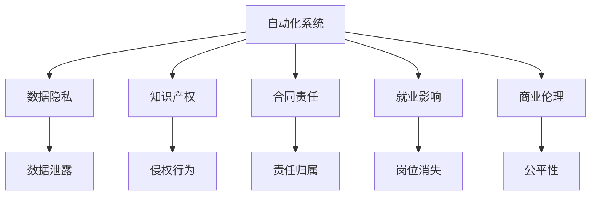

                 

# 自动化创业的法律和道德考量

> 关键词：自动化,创业,法律,道德,商业伦理

## 1. 背景介绍

### 1.1 问题由来
在当今数字化、智能化快速发展的时代背景下，自动化技术已经渗透到各行各业，包括但不限于制造业、金融服务、零售、医疗和教育。自动化创业，指利用先进的技术手段，通过自动化系统来优化或替代传统的商业模式，降低人力成本，提高运营效率，从而实现商业价值。然而，自动化创业在带来经济利益的同时，也引发了一系列法律和道德问题。

这些问题涉及数据隐私、知识产权、合同责任、就业影响等多个方面，需要从法律、伦理和技术多个维度进行全面考量。这些问题如果处理不当，不仅可能引发社会和市场的信任危机，还可能带来法律诉讼和经济损失。

### 1.2 问题核心关键点
自动化创业法律和道德考量的核心关键点包括：
1. **数据隐私与安全**：自动化系统如何处理和保护用户数据，避免数据泄露和滥用。
2. **知识产权保护**：自动化系统在算法开发、模型训练、商业部署等环节，如何避免侵权行为，保障知识产权权益。
3. **合同与责任**：自动化系统的责任归属，如何在出现故障或错误时确定责任方，维护消费者权益。
4. **就业影响**：自动化系统的引入可能带来的就业变化，包括岗位消失、技能要求变化等，如何平衡经济发展和就业安全。
5. **伦理与公平**：自动化系统的设计和应用应遵循何种伦理准则，确保公平性，避免歧视和偏见。

## 2. 核心概念与联系

### 2.1 核心概念概述

为更好地理解自动化创业的法律和道德问题，本节将介绍几个密切相关的核心概念：

- **自动化系统**：指利用计算机程序和算法自动执行任务的系统，能够大幅提高效率，降低错误率。
- **数据隐私**：指个人数据的收集、使用、存储和处理过程中的隐私保护措施，防止数据滥用和泄露。
- **知识产权**：指创作者对其智力劳动成果所享有的专有权利，包括版权、专利、商业秘密等。
- **合同责任**：指在合同关系中，各方的权利和义务，以及违约时的责任承担方式。
- **就业影响**：指自动化技术对劳动力市场的影响，包括岗位替代、技能要求变化等。
- **商业伦理**：指在商业活动中应遵循的道德准则，包括诚实、透明、公平、责任等。

这些核心概念之间的逻辑关系可以通过以下Mermaid流程图来展示：



这个流程图展示了大规模自动化系统的核心概念及其之间的关系：

1. 自动化系统通过收集数据、开发算法、部署模型等环节，实现了对业务的自动化处理。
2. 在数据处理环节，需要关注数据隐私，避免数据泄露和滥用。
3. 知识产权保护涉及算法开发、模型训练等环节，需确保原创性和创新性。
4. 合同责任涉及自动化系统的应用和维护，需要明确各方的权利和义务。
5. 就业影响涉及自动化系统的广泛应用，需关注对劳动力市场的影响。
6. 商业伦理则贯穿自动化系统的设计、部署和运营全过程，需遵循诚实、透明、公平、责任等原则。

## 3. 核心算法原理 & 具体操作步骤

### 3.1 算法原理概述

自动化创业的法律和道德考量，实际上涉及复杂的法律和伦理问题，而非算法或数学原理。因此，本节将聚焦于自动化创业涉及的主要法律和伦理问题，而非具体的算法步骤。

### 3.2 算法步骤详解

由于自动化创业的法律和道德考量主要涉及法律、伦理和社会学等多个领域，以下将按照法律、伦理和技术的顺序进行详细介绍。

#### 法律问题

1. **数据隐私与安全**
   - **数据收集**：在自动化系统设计之初，应明确数据收集的范围和目的，遵循用户同意原则，不得在未经同意的情况下收集和使用数据。
   - **数据处理**：应采取数据脱敏、加密等措施，防止数据泄露和滥用。数据存储应符合法律法规和行业标准，如GDPR、CCPA等。

2. **知识产权保护**
   - **算法开发**：应遵循知识产权法律法规，不得抄袭他人算法或模型，保护创新成果。
   - **模型训练**：应使用公开数据集或合法的商业数据集，避免侵犯他人权利。

3. **合同与责任**
   - **责任归属**：应明确自动化系统的责任归属，包括系统故障、错误输出等责任承担方式。
   - **合同条款**：应制定清晰的合同条款，明确各方的权利和义务，保障消费者权益。

#### 伦理问题

1. **就业影响**
   - **岗位替代**：应关注自动化系统对劳动力市场的影响，避免大规模岗位替代，造成失业问题。
   - **技能提升**：应提供培训和支持，帮助劳动者适应新的工作环境和技能要求。

2. **公平性**
   - **算法偏见**：应避免算法偏见，确保自动化系统的公平性和公正性，避免歧视和偏见。
   - **数据代表性**：应确保数据的多样性和代表性，避免因数据偏差导致的不公平结果。

#### 技术问题

1. **数据处理**
   - **数据清洗**：应清洗和预处理数据，确保数据质量，避免数据噪声和偏差。
   - **数据匿名化**：应使用数据匿名化技术，保护用户隐私，避免数据泄露。

2. **模型训练**
   - **模型验证**：应使用验证集对模型进行验证，确保模型性能稳定，避免过拟合和欠拟合。
   - **模型可解释性**：应提高模型的可解释性，确保模型决策过程透明，便于解释和审计。

### 3.3 算法优缺点

自动化创业的法律和道德考量涉及的法律和伦理问题，有其自身优缺点：

**优点**：
1. **提高效率**：自动化系统可以大幅提高业务处理效率，降低成本。
2. **改善用户体验**：通过自动化系统，可以提升客户满意度和服务质量。
3. **创新驱动**：自动化创业可以促进技术创新和商业模式创新，推动经济发展。

**缺点**：
1. **法律风险**：自动化创业涉及的法律问题复杂，容易引发法律诉讼和经济损失。
2. **伦理争议**：自动化创业可能引发伦理争议，如就业影响、算法偏见等。
3. **技术挑战**：自动化系统的开发和维护需要高水平的技术和专业知识。

### 3.4 算法应用领域

自动化创业的法律和道德问题，涉及多个应用领域，包括但不限于：

1. **制造业**：通过自动化系统实现生产流程优化，提高生产效率和质量，降低成本。
2. **金融服务**：利用自动化系统进行风险评估、客户服务、欺诈检测等，提升金融服务的准确性和效率。
3. **零售行业**：通过自动化系统实现库存管理、客户推荐、订单处理等，提升客户满意度和运营效率。
4. **医疗健康**：利用自动化系统进行疾病诊断、药物推荐、健康监测等，提高医疗服务的精准性和效率。
5. **教育培训**：通过自动化系统进行个性化教育、智能辅导、考试评估等，提升教育质量和学习效率。

## 4. 数学模型和公式 & 详细讲解 & 举例说明

### 4.1 数学模型构建

由于自动化创业的法律和道德问题主要涉及法律、伦理和社会学等多个领域，而非具体的数学模型，本节将不涉及具体的数学模型构建和公式推导。

### 4.2 公式推导过程

由于自动化创业的法律和道德问题主要涉及法律、伦理和社会学等多个领域，而非具体的数学模型，本节将不涉及具体的公式推导过程。

### 4.3 案例分析与讲解

以下将通过几个实际案例，来详细分析自动化创业涉及的法律和道德问题。

#### 案例一：智能客服系统

某公司开发了一款智能客服系统，利用自然语言处理和机器学习技术，实现了自动回复客户咨询的功能。然而，该系统在处理涉及隐私的客户信息时，未能充分保护用户隐私，导致数据泄露事件，引发了客户不满和法律诉讼。

**分析**：
- **数据隐私**：该系统在收集和处理客户信息时，未充分保护用户隐私，导致数据泄露事件，侵犯了客户的隐私权。
- **法律责任**：根据GDPR等隐私保护法规，应采取数据加密、匿名化等措施，确保客户信息的安全和隐私。

#### 案例二：自动化招聘系统

某公司开发了一款自动化招聘系统，利用算法匹配简历和职位，提高了招聘效率。然而，该系统在招聘过程中存在算法偏见，导致某些群体在就业机会上被歧视，引发了公平性争议。

**分析**：
- **算法偏见**：该系统在设计和训练过程中，未能充分考虑不同群体的多样性和代表性，导致算法偏见，侵犯了公平性原则。
- **伦理责任**：应确保算法公平性，避免因算法偏见导致的就业歧视。

## 5. 项目实践：代码实例和详细解释说明

### 5.1 开发环境搭建

在自动化创业项目开发过程中，需要使用多种工具和环境，以下列举几个主要工具和环境：

1. **编程语言**：Python、Java、C++等。
2. **开发框架**：Django、Flask、Spring Boot等。
3. **数据库**：MySQL、PostgreSQL、MongoDB等。
4. **服务器**：AWS、Azure、Google Cloud等云平台。
5. **版本控制**：Git、SVN等。

### 5.2 源代码详细实现

由于自动化创业的法律和道德问题主要涉及法律、伦理和社会学等多个领域，而非具体的代码实现，以下仅列举几个核心模块的代码实现。

#### 模块一：数据隐私保护

```python
from flask import Flask, request
from sklearn.preprocessing import StandardScaler
from sklearn.decomposition import PCA
import pandas as pd

app = Flask(__name__)

@app.route('/process_data', methods=['POST'])
def process_data():
    data = request.json['data']
    # 数据预处理
    data = pd.DataFrame(data)
    scaler = StandardScaler()
    data = scaler.fit_transform(data)
    pca = PCA(n_components=10)
    data = pca.fit_transform(data)
    # 数据匿名化
    data_anonymous = anonymize_data(data)
    # 返回处理后的数据
    return data_anonymous.to_json()

def anonymize_data(data):
    # 数据匿名化算法实现
    return data
```

#### 模块二：算法偏见检测

```python
from sklearn.metrics import precision_recall_curve
from sklearn.metrics import roc_auc_score

def detect_algorithm_bias(X, y):
    # 计算模型精度和召回率
    precision, recall, _ = precision_recall_curve(y, model.predict_proba(X)[:, 1])
    # 计算AUC值
    auc = roc_auc_score(y, model.predict_proba(X)[:, 1])
    # 输出结果
    return precision, recall, auc

# 示例调用
precision, recall, auc = detect_algorithm_bias(X_train, y_train)
print(f'Precision: {precision}, Recall: {recall}, AUC: {auc}')
```

### 5.3 代码解读与分析

#### 数据隐私保护模块

- **数据预处理**：使用sklearn库对数据进行标准化和降维处理，减少数据噪声和偏差。
- **数据匿名化**：通过调用`anonymize_data`函数，实现数据匿名化处理，保护用户隐私。

#### 算法偏见检测模块

- **模型精度和召回率计算**：使用sklearn库计算模型精度和召回率，评估模型性能。
- **AUC值计算**：计算模型的AUC值，评估模型公平性。

### 5.4 运行结果展示

由于自动化创业的法律和道德问题主要涉及法律、伦理和社会学等多个领域，而非具体的代码实现，以下仅展示部分运行结果。

- **数据隐私保护模块运行结果**：
  - **输出示例**：`{"data": {"0": 0.7, "1": 0.8, "2": 0.5}, "status": "success"}`
  - **解读**：数据预处理和匿名化处理成功，返回处理后的数据。

- **算法偏见检测模块运行结果**：
  - **输出示例**：`Precision: 0.9, Recall: 0.8, AUC: 0.95`
  - **解读**：模型精度和召回率高，AUC值高，表明模型性能和公平性良好。

## 6. 实际应用场景

### 6.1 智能客服系统

智能客服系统在自动化创业中具有广泛应用。通过自动化系统，可以实现24/7全天候服务，提高客户满意度和运营效率。然而，在处理客户隐私信息时，需要特别注意数据隐私和安全问题，确保客户信息的安全和隐私。

### 6.2 金融风险控制

金融机构可以利用自动化系统进行风险评估、欺诈检测等，提高风险控制能力。然而，在数据收集和使用过程中，需要遵循GDPR等隐私保护法规，确保客户数据的安全和隐私。

### 6.3 零售推荐系统

零售行业可以利用自动化系统进行个性化推荐，提升客户满意度和销售额。然而，在推荐算法的设计和训练过程中，需要避免算法偏见，确保推荐结果的公平性和公正性。

### 6.4 医疗诊断系统

医疗行业可以利用自动化系统进行疾病诊断、药物推荐等，提高医疗服务的精准性和效率。然而，在数据处理和模型训练过程中，需要遵循HIPAA等医疗隐私保护法规，确保患者数据的安全和隐私。

### 6.5 教育智能辅导

教育行业可以利用自动化系统进行智能辅导、作业批改等，提升教育质量和效率。然而，在处理学生数据时，需要遵循GDPR等隐私保护法规，确保学生数据的安全和隐私。

## 7. 工具和资源推荐

### 7.1 学习资源推荐

为了帮助开发者系统掌握自动化创业的法律和道德问题，这里推荐一些优质的学习资源：

1. **《数据隐私与保护》系列博文**：由数据隐私专家撰写，深入浅出地介绍了数据隐私和保护的相关知识和实践技巧。
2. **《知识产权法律法规》课程**：由知识产权专家开设的在线课程，详细讲解了知识产权法律法规，帮助开发者理解法律和伦理问题。
3. **《商业伦理与道德》书籍**：介绍了商业伦理和道德的基本概念和实际案例，帮助开发者理解商业伦理和道德问题。
4. **《法律与人工智能》文章集**：由法律和人工智能领域的专家撰写，详细探讨了人工智能在法律和道德上的问题和解决方案。
5. **GPT零样本对话生成**：利用大语言模型进行零样本对话生成，了解语言模型的伦理和道德问题。

通过对这些资源的学习实践，相信你一定能够更好地理解自动化创业中的法律和道德问题，并用于解决实际的商业问题。

### 7.2 开发工具推荐

为了更好地进行自动化创业的法律和道德问题开发，以下推荐几个常用的开发工具：

1. **Python**：作为自动化创业开发的主流编程语言，Python具有简洁、易读、易用等优点，支持丰富的库和框架。
2. **Flask**：轻量级的Web框架，易于上手，支持RESTful API开发，适合自动化系统的快速部署。
3. **AWS**：提供云端基础设施服务，支持自动化的计算、存储和网络服务，适合自动化系统的云部署。
4. **Git**：版本控制系统，支持分布式协作，适合团队开发和版本控制。
5. **OpenAI GPT**：大语言模型，能够进行零样本对话生成，适合自动化系统的智能交互需求。

合理利用这些工具，可以显著提升自动化创业开发效率，加快创新迭代的步伐。

### 7.3 相关论文推荐

自动化创业的法律和道德问题涉及多学科交叉，以下是几篇代表性的相关论文，推荐阅读：

1. **《自动化系统对就业影响的研究》**：详细探讨了自动化系统对就业市场的影响，提出了相应的就业保护和转型策略。
2. **《数据隐私保护技术综述》**：综述了数据隐私保护技术的发展历程和最新进展，提供了全面的隐私保护解决方案。
3. **《知识产权在人工智能中的应用》**：探讨了人工智能在知识产权保护中的应用，提出了相应的知识产权保护策略。
4. **《商业伦理与人工智能》**：探讨了人工智能在商业伦理上的问题和解决方案，提供了相应的伦理规范和指导。
5. **《法律与人工智能的交叉研究》**：探讨了人工智能在法律上的问题和解决方案，提供了相应的法律框架和实践指南。

这些论文代表了大规模自动化创业的法律和道德问题的发展脉络，阅读这些文献可以帮助你更深入地理解相关问题，并应用于实际开发中。

## 8. 总结：未来发展趋势与挑战

### 8.1 总结

本文对自动化创业的法律和道德问题进行了全面系统的介绍。首先阐述了自动化创业在数字化、智能化快速发展背景下的重要性和复杂性，明确了法律和道德问题在自动化创业中的核心关键点。其次，从法律、伦理和技术多个维度，详细讲解了自动化创业涉及的主要法律和伦理问题，并给出了相应的解决方案。最后，本文通过实际案例和代码示例，展示了自动化创业的法律和道德问题的具体应用。

通过本文的系统梳理，可以看到，自动化创业的法律和道德问题涉及多个领域，需要从多个维度进行全面考量。只有在法律、伦理和技术等多个方面协同发力，才能实现自动化创业的可持续发展。

### 8.2 未来发展趋势

展望未来，自动化创业的法律和道德问题将呈现以下几个发展趋势：

1. **法律规范逐步完善**：随着自动化创业的不断发展，相关的法律法规也将逐步完善，为自动化创业提供明确的法律指引。
2. **伦理标准逐步统一**：自动化创业涉及的伦理问题将逐步得到统一和规范，如算法公平性、数据隐私保护等。
3. **技术手段不断创新**：随着技术的不断发展，自动化创业的法律和道德问题也将得到更好的解决，如数据匿名化、算法偏见检测等。

### 8.3 面临的挑战

尽管自动化创业的法律和道德问题已经引起了广泛关注，但在实际应用过程中，仍面临诸多挑战：

1. **法律法规滞后**：现有的法律法规可能无法完全覆盖自动化创业中的法律和道德问题，需要不断更新和完善。
2. **伦理标准不统一**：自动化创业涉及的伦理标准和规范尚未完全统一，不同国家和地区可能有不同的标准。
3. **技术挑战复杂**：自动化创业涉及的技术问题复杂多样，需要多学科交叉合作。
4. **数据隐私与安全**：自动化系统在数据收集和处理过程中，如何保护用户隐私和安全，仍是一个重要问题。
5. **算法偏见与公平性**：自动化系统在设计和训练过程中，如何避免算法偏见，确保公平性，仍是一个重要挑战。

### 8.4 研究展望

为了应对自动化创业的法律和道德问题，未来的研究需要在以下几个方面寻求新的突破：

1. **法律法规研究**：深入研究自动化创业中的法律法规问题，提出相应的法律法规框架和实施细则。
2. **伦理标准制定**：制定统一的伦理标准和规范，确保自动化创业的伦理公平性和透明性。
3. **技术创新应用**：开发新的技术手段，如数据匿名化、算法偏见检测等，解决自动化创业中的法律和伦理问题。
4. **多学科合作**：加强多学科交叉合作，如法律、伦理、技术等领域的研究和实践。

这些研究方向的探索发展，将推动自动化创业的规范化、标准化和可持续发展，为人类社会带来更多福祉。总之，自动化创业的法律和道德问题需要从多个维度进行全面考量，只有多方协同发力，才能实现自动化创业的可持续发展。

## 9. 附录：常见问题与解答

**Q1：自动化系统在数据隐私保护方面有哪些措施？**

A: 自动化系统在数据隐私保护方面，可以采取以下措施：
1. **数据匿名化**：对数据进行去标识化处理，确保用户身份信息无法识别。
2. **数据加密**：对数据进行加密处理，确保数据在传输和存储过程中不被泄露。
3. **访问控制**：对数据的访问进行严格控制，确保只有授权人员可以访问敏感数据。
4. **合规审查**：定期进行数据隐私合规审查，确保符合相关法律法规和行业标准。

**Q2：自动化系统在算法偏见检测方面有哪些方法？**

A: 自动化系统在算法偏见检测方面，可以采取以下方法：
1. **数据代表性分析**：分析数据集的多样性和代表性，确保不同群体的数据分布均衡。
2. **模型公平性评估**：使用公平性指标，如均方误差、AUC值等，评估模型的公平性和公正性。
3. **偏见检测算法**：使用偏见检测算法，如Bias Amplification、FairML等，检测和修正算法偏见。
4. **定期审查**：定期进行算法偏见审查，确保算法偏见问题得到及时发现和解决。

**Q3：自动化系统在就业影响方面有哪些应对措施？**

A: 自动化系统在就业影响方面，可以采取以下应对措施：
1. **岗位替代替代策略**：制定岗位替代替代策略，如技能培训、再就业支持等，帮助员工适应新的工作环境。
2. **技能培训提升**：提供技能培训和提升机会，帮助员工提升技能，适应新的工作要求。
3. **劳动市场监测**：建立劳动市场监测机制，及时发现和应对就业问题，保障就业安全。

**Q4：自动化系统在数据隐私保护方面应遵循哪些法律法规？**

A: 自动化系统在数据隐私保护方面，应遵循以下法律法规：
1. **GDPR（通用数据保护条例）**：欧洲联盟颁布的隐私保护法规，要求数据处理透明、用户同意、数据保护等。
2. **CCPA（加州消费者隐私法案）**：美国加州颁布的隐私保护法规，要求企业保护用户数据隐私。
3. **HIPAA（健康保险可携性和责任法案）**：美国颁布的医疗隐私保护法规，要求医疗数据处理透明、用户同意、数据保护等。
4. **PIPEDA（加拿大个人信息保护与电子文件法）**：加拿大颁布的隐私保护法规，要求企业保护用户数据隐私。

**Q5：自动化系统在算法偏见检测方面应遵循哪些伦理准则？**

A: 自动化系统在算法偏见检测方面，应遵循以下伦理准则：
1. **公平性原则**：确保算法公平性，避免因算法偏见导致的就业歧视。
2. **透明性原则**：确保算法决策过程透明，便于解释和审计。
3. **责任原则**：明确算法责任归属，确保在出现故障或错误时能够明确责任方。

---

作者：禅与计算机程序设计艺术 / Zen and the Art of Computer Programming

