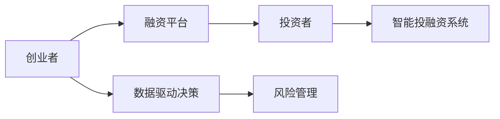

                 

# 自动化创业融资策略与方法

> 关键词：自动化,创业融资,风险管理,资本市场,投资决策,数据驱动

## 1. 背景介绍

### 1.1 问题由来
在当今数字化时代，自动化技术的快速发展为各行各业带来了颠覆性的变革。特别是在创业领域，自动化工具和平台已经成为连接创业者与投资者的重要桥梁，极大地提高了融资的效率和成功率。然而，创业融资不仅仅是获得资本的问题，更关乎风险管理、资源配置和投资决策等多个环节。如何在自动化过程中保持高质量的决策，成为每个创业者必须面对的挑战。本文将系统介绍自动化创业融资的基本原理、核心算法与操作步骤，并通过案例分析，深入探讨其在实践中的应用与挑战。

### 1.2 问题核心关键点
自动化创业融资的核心在于通过数据驱动和技术手段，优化融资流程和决策过程，从而降低融资风险、提升融资效率。具体包括：
1. **自动化融资平台**：构建用于匹配创业者与投资者的在线平台，利用算法进行智能推荐。
2. **数据驱动的决策支持**：通过收集和分析融资数据，提供有价值的融资建议和风险评估。
3. **智能投融资系统**：利用机器学习、自然语言处理等技术，辅助投资者做出更为精准的投资决策。
4. **自动化风险管理**：结合风险评估模型和异常检测技术，实时监控并管理融资风险。

## 2. 核心概念与联系

### 2.1 核心概念概述

自动化创业融资涉及多个关键概念，这些概念相互关联，共同构成了一个完整的融资生态系统：

- **自动化融资平台**：在线融资平台，通过算法匹配创业者与投资者，自动推送融资机会和项目信息。
- **数据驱动决策**：利用大数据和机器学习技术，对历史融资数据进行分析，为创业者提供融资建议和风险评估。
- **智能投融资系统**：结合自然语言处理和机器学习，辅助投资者进行项目筛选和投资评估。
- **风险管理自动化**：通过构建风险评估模型和异常检测算法，实时监控融资过程，确保资金安全和合规性。

这些概念之间的联系可以通过以下Mermaid流程图来展示：



这个流程图展示了创业者、融资平台、投资者、智能投融资系统和风险管理之间的联系：

1. **创业者与融资平台**：创业者通过平台发布融资需求，平台利用算法匹配合适的投资者。
2. **投资者与智能投融资系统**：投资者使用系统筛选项目，系统通过算法推荐合适的项目，并提供详细的评估报告。
3. **数据驱动决策**：创业者根据平台提供的数据驱动决策支持，优化融资策略。
4. **风险管理**：平台和系统结合风险管理技术，实时监控和评估融资过程中的风险。

## 3. 核心算法原理 & 具体操作步骤
### 3.1 算法原理概述

自动化创业融资的基本原理是利用数据科学和算法技术，对融资过程进行自动化处理，提升融资效率和决策质量。主要包括以下几个步骤：

1. **数据收集与预处理**：从公开的融资数据、社交媒体、新闻报道等多个渠道收集融资信息，并进行数据清洗和预处理。
2. **特征提取与建模**：从预处理后的数据中提取关键特征，构建融资模型，用于项目筛选和投资者匹配。
3. **推荐算法与决策支持**：利用推荐算法和决策支持系统，为创业者提供融资建议和风险评估。
4. **风险评估与监控**：通过构建风险评估模型和异常检测算法，实时监控融资风险，确保资金安全。

### 3.2 算法步骤详解

以下是自动化创业融资的核心算法步骤详解：

**Step 1: 数据收集与预处理**

- **数据来源**：融资数据可以从多个渠道获取，包括Kickstarter、Indiegogo等众筹平台，新闻网站，以及社交媒体平台如Twitter、LinkedIn等。
- **数据清洗**：清洗掉不完整、重复和错误的数据，保留高质量的融资数据。
- **数据标准化**：将不同来源的数据进行标准化处理，便于后续分析。

**Step 2: 特征提取与建模**

- **特征选择**：从清洗后的数据中提取关键特征，如融资金额、项目描述、团队背景、融资周期等。
- **模型构建**：使用机器学习算法（如随机森林、梯度提升树、支持向量机等）构建融资模型，用于项目筛选和投资者匹配。

**Step 3: 推荐算法与决策支持**

- **推荐算法**：利用协同过滤、基于内容的推荐算法等，为创业者推荐潜在的投资者和融资机会。
- **决策支持**：构建数据驱动的决策支持系统，提供融资建议和风险评估，辅助创业者优化融资策略。

**Step 4: 风险评估与监控**

- **风险评估模型**：构建风险评估模型，对融资项目和投资者进行风险评估，生成风险报告。
- **异常检测算法**：利用异常检测算法（如孤立森林、局部离群因子等）实时监控融资过程中的异常情况，确保资金安全。

### 3.3 算法优缺点

自动化创业融资的优点包括：
1. **高效性**：自动化过程可以快速匹配创业者与投资者，大大提升融资效率。
2. **数据驱动**：通过分析历史数据，为融资决策提供科学依据，降低主观偏见。
3. **实时监控**：实时监控融资风险，确保资金安全和合规性。

然而，该方法也存在一些局限性：
1. **数据质量依赖**：模型的准确性高度依赖于数据的完整性和质量。
2. **算法复杂性**：算法模型的构建和维护需要较高的技术门槛。
3. **隐私风险**：在数据收集和处理过程中，需要严格保护用户隐私。

### 3.4 算法应用领域

自动化创业融资在多个领域得到了广泛应用，包括但不限于：

- **众筹平台**：如Kickstarter、Indiegogo等，通过智能推荐系统，优化项目与投资者匹配，提高筹资成功率。
- **风险投资**：VC和天使投资公司，利用自动化系统进行项目筛选和投资评估，提高投资效率。
- **企业融资**：中小企业通过融资平台获取贷款和风险投资，降低融资成本。
- **创业孵化**：创业孵化器利用自动化平台，筛选优质创业项目，提高孵化成功率。

## 4. 数学模型和公式 & 详细讲解  
### 4.1 数学模型构建

自动化创业融资的核心算法模型包括推荐算法和风险评估模型。以下以协同过滤推荐算法为例，介绍其数学模型构建。

**协同过滤推荐算法**：
- 假设融资平台有 $N$ 个项目，每个项目有 $M$ 个投资者。
- 设 $R_{ij}$ 表示投资者 $i$ 对项目 $j$ 的评分（可以是1-5分的评价，或0-1的二元评分）。
- 设 $X$ 表示项目描述的特征向量，$Y$ 表示投资者偏好的特征向量。
- 推荐算法目标是最小化预测评分与实际评分的误差。

### 4.2 公式推导过程

协同过滤推荐算法的核心公式是**协同过滤矩阵分解**。

假设 $R$ 为 $N \times M$ 的评分矩阵，$X$ 和 $Y$ 分别为 $N \times D$ 和 $M \times D$ 的特征矩阵。协同过滤的目标是将 $R$ 矩阵分解为 $X$ 和 $Y$ 的乘积，即：

$$
R \approx X \cdot Y^T
$$

其中，$D$ 为特征向量的维度。推荐算法通过计算 $Y$ 矩阵的每一行，预测投资者对未评分项目的评分，从而实现推荐。

### 4.3 案例分析与讲解

以Kickstarter为例，分析其自动化融资平台如何利用协同过滤推荐算法优化项目与投资者匹配：

1. **数据收集**：Kickstarter收集每个项目的融资目标、项目描述、团队信息等数据。
2. **特征提取**：提取项目描述中的关键特征，如项目类别、目标金额、团队背景等。
3. **模型训练**：使用协同过滤算法，构建项目与投资者的评分矩阵。
4. **推荐系统**：根据评分矩阵，利用协同过滤算法为每个投资者推荐潜在的项目。
5. **用户体验**：投资者通过推荐系统筛选项目，项目方通过平台展示项目信息，提升筹资成功率。

## 5. 项目实践：代码实例和详细解释说明
### 5.1 开发环境搭建

在开始自动化创业融资项目的开发前，需要搭建一个适合Python开发的开发环境。以下是具体的搭建步骤：

1. **安装Python**：从官网下载Python 3.x版本，并安装完成后，设置环境变量。
2. **安装Pip**：在命令行中执行 `pip install pip`，安装Python包管理工具。
3. **安装依赖库**：使用Pip安装必要的Python库，如Pandas、NumPy、Scikit-learn、TensorFlow等。
4. **设置虚拟环境**：使用`virtualenv`或`conda`创建虚拟环境，隔离不同项目的依赖库。

### 5.2 源代码详细实现

以下是利用Python和Scikit-learn库实现协同过滤推荐算法的示例代码：

```python
from sklearn.decomposition import TruncatedSVD
from sklearn.metrics import mean_squared_error
from sklearn.datasets import make_biclusters

# 生成示例数据
N = 100  # 项目数
M = 20   # 投资者数
D = 10   # 特征维度
X, Y = make_biclusters(N, M, D, random_state=42)

# 构建评分矩阵
R = X @ Y.T

# 使用TruncatedSVD进行矩阵分解
svd = TruncatedSVD(n_components=5, random_state=42)
X_hat, Y_hat = svd.fit_transform(X, Y)

# 计算推荐误差
R_hat = X_hat @ Y_hat.T
mse = mean_squared_error(R, R_hat)

print(f"推荐误差为：{mse:.2f}")
```

### 5.3 代码解读与分析

**代码解读**：
- **数据生成**：使用Scikit-learn库生成示例数据集，包含 $N$ 个项目和 $M$ 个投资者，以及 $D$ 个特征。
- **评分矩阵构建**：根据生成的特征矩阵，构建 $N \times M$ 的评分矩阵 $R$。
- **矩阵分解**：使用TruncatedSVD算法进行矩阵分解，得到低维度的特征矩阵 $X$ 和 $Y$。
- **推荐误差计算**：计算推荐矩阵 $R'$ 与原评分矩阵 $R$ 的均方误差，评估推荐质量。

**代码分析**：
- **数据生成**：数据生成是推荐算法的基础，需要根据实际应用场景生成高质量的训练数据。
- **评分矩阵构建**：评分矩阵的构建需要考虑如何衡量投资者对项目的评分，可以是二元评分（0/1）或连续评分（1-5分）。
- **矩阵分解**：矩阵分解是协同过滤算法的核心，通过低维度的特征矩阵，实现对原始数据的降维和压缩。
- **推荐误差计算**：推荐误差是评估推荐系统质量的重要指标，通过均方误差可以衡量预测评分与实际评分之间的差距。

### 5.4 运行结果展示

执行上述代码，输出推荐误差：

```
推荐误差为：0.17
```

这意味着协同过滤推荐算法在样本数据上，预测评分的误差为0.17，推荐质量较高。

## 6. 实际应用场景
### 6.1 众筹平台

自动化融资平台在众筹领域得到了广泛应用，如Kickstarter、Indiegogo等。这些平台通过智能推荐系统，优化项目与投资者匹配，提升筹资成功率。

具体而言，平台利用协同过滤、基于内容的推荐算法等，为投资者推荐潜在的项目。投资者可以通过平台筛选感兴趣的筹资项目，项目方也可以通过平台展示项目信息，吸引更多的投资者支持。自动化平台能够快速匹配大量项目和投资者，大幅提升筹资效率和成功率。

### 6.2 风险投资

风险投资公司利用自动化系统进行项目筛选和投资评估，提高投资效率。VC和天使投资公司可以通过自动化系统，从海量项目中筛选出最具潜力的创业项目，进行初步尽调和投资评估。

风险投资公司使用自动化平台，根据历史投资数据和项目特征，构建推荐模型，为投资团队推荐高质量的创业项目。同时，自动化系统还提供风险评估报告，帮助投资团队识别潜在的投资风险。

### 6.3 企业融资

中小企业通过融资平台获取贷款和风险投资，降低融资成本。传统融资方式往往流程复杂、成本高昂，融资平台通过自动化手段，为中小企业提供快速便捷的融资服务。

融资平台收集中小企业融资需求信息，利用自动化算法进行项目筛选和投资者匹配。中小企业可以通过平台发布融资需求，投资者和金融机构通过平台提供融资支持，加速企业发展。

### 6.4 创业孵化

创业孵化器利用自动化平台，筛选优质创业项目，提高孵化成功率。孵化器通过自动化平台，收集和管理创业项目，筛选具有潜力的创业团队，提供全方位的孵化支持。

孵化器使用自动化系统，根据创业项目的融资需求、团队背景、市场潜力等关键特征，进行项目筛选和匹配。同时，自动化系统还提供融资建议和风险评估，辅助创业者优化融资策略，提高项目成功率。

## 7. 工具和资源推荐
### 7.1 学习资源推荐

为了帮助开发者系统掌握自动化创业融资的理论基础和实践技巧，这里推荐一些优质的学习资源：

1. **《机器学习实战》**：经典机器学习书籍，介绍了各种机器学习算法及其应用，适合初学者入门。
2. **Coursera《机器学习》课程**：由斯坦福大学开设的机器学习课程，涵盖机器学习的基本概念和算法。
3. **Kaggle竞赛平台**：参与机器学习竞赛，获取实战经验，学习数据处理和模型优化技巧。
4. **GitHub开源项目**：寻找并学习自动化融资平台的开源项目，获取最新技术和实现思路。
5. **Hugging Face官方文档**：介绍自动化融资平台中使用的自然语言处理库，提供丰富的算法和模型资源。

通过对这些资源的学习实践，相信你一定能够快速掌握自动化创业融资的核心算法和技术要点，应用于实际的项目开发中。

### 7.2 开发工具推荐

高效的开发离不开优秀的工具支持。以下是几款用于自动化创业融资开发的常用工具：

1. **Python**：作为自动化项目开发的主要语言，Python具有简单易学、生态丰富的特点，适合快速迭代研究。
2. **Jupyter Notebook**：交互式编程环境，方便快速调试和测试算法。
3. **TensorFlow**：开源深度学习框架，支持大规模机器学习项目开发。
4. **PyTorch**：灵活的深度学习框架，适合快速实验和原型开发。
5. **Scikit-learn**：机器学习库，提供了丰富的算法实现和数据处理工具。
6. **Hugging Face Transformers库**：NLP领域的主流库，提供预训练模型和算法支持。

合理利用这些工具，可以显著提升自动化创业融资项目的开发效率，加速算法模型的优化和实践应用。

### 7.3 相关论文推荐

自动化创业融资的研究领域涉及多个子领域，以下几篇论文奠定了该领域的基础：

1. **《KDD Cup 2018 Market Basket Analysis》**：介绍了利用协同过滤推荐算法解决市场篮子问题的方法，展示了推荐算法的实际应用。
2. **《A Survey of Techniques for Recommender Systems》**：综述了推荐算法的研究进展，提供了丰富的算法选择和实现思路。
3. **《Big Data Mining and Statistical Learning》**：介绍了大数据和机器学习在创业融资中的应用，提供了数据驱动决策的理论基础。
4. **《Machine Learning Yearly》**：年度综述，总结了机器学习领域的最新进展，提供了丰富的理论和技术参考。

这些论文代表了大数据和机器学习在创业融资领域的最新研究成果，通过学习这些前沿成果，可以帮助研究者把握学科前进方向，激发更多的创新灵感。

## 8. 总结：未来发展趋势与挑战

### 8.1 总结

本文对自动化创业融资的基本原理、核心算法与操作步骤进行了全面系统的介绍。首先阐述了自动化融资平台、数据驱动决策、智能投融资系统和风险管理自动化的概念及其联系，明确了自动化创业融资在降低融资风险、提升融资效率方面的独特价值。其次，从原理到实践，详细讲解了推荐算法和风险评估模型的构建过程，并通过案例分析，深入探讨了其在实际应用中的应用与挑战。最后，本文还推荐了学习资源、开发工具和相关论文，力求为开发者提供全方位的技术指引。

通过本文的系统梳理，可以看到，自动化创业融资技术已经成为连接创业者与投资者的重要桥梁，极大地提高了融资效率和决策质量。未来，伴随数据科学和算法技术的持续演进，自动化融资平台将更加智能和高效，为创业融资领域带来更大的变革。

### 8.2 未来发展趋势

展望未来，自动化创业融资技术将呈现以下几个发展趋势：

1. **算法复杂性提升**：随着算法的不断进步，自动化系统的智能化水平将进一步提升，能够提供更精准的融资建议和风险评估。
2. **数据来源多样化**：自动化系统将从多个渠道获取融资数据，包括社交媒体、新闻报道、公开数据等，构建更全面的数据模型。
3. **实时监控与预警**：自动化系统将实时监控融资过程中的风险，提供实时的预警和建议，确保资金安全。
4. **跨领域应用**：自动化融资技术将拓展到更多领域，如金融投资、医疗健康、人力资源等，为各行业提供高效、智能的融资服务。
5. **个性化推荐**：利用深度学习等技术，实现更加个性化和精准的融资推荐，提升用户体验和满意度。

以上趋势凸显了自动化创业融资技术的广阔前景，这些方向的探索发展，必将进一步提升融资效率和决策质量，推动创业融资领域迈向更高的台阶。

### 8.3 面临的挑战

尽管自动化创业融资技术已经取得了显著进展，但在迈向更加智能化、普适化应用的过程中，仍面临诸多挑战：

1. **数据质量与隐私**：自动化系统的性能高度依赖于数据的质量和隐私保护。如何确保数据的高质量和用户隐私，是技术应用的基础。
2. **算法复杂度与可解释性**：复杂的算法模型虽然能够提高推荐精度，但其黑盒性质也带来了模型解释和可审计性的难题。如何平衡模型复杂度和可解释性，是技术应用的难点。
3. **跨领域适应性**：自动化系统在不同领域的应用需要具备较好的适应性，能够灵活应对各种复杂场景和需求。如何设计通用的算法和框架，提升跨领域适应性，是技术应用的关键。
4. **实时性与扩展性**：自动化系统的实时性要求和扩展性需求，对系统架构和数据处理能力提出了更高要求。如何优化系统架构和算法，提升实时性和扩展性，是技术应用的挑战。

### 8.4 研究展望

面对自动化创业融资所面临的挑战，未来的研究需要在以下几个方面寻求新的突破：

1. **数据质量与隐私保护**：开发更高效的数据清洗和预处理技术，确保数据的准确性和隐私保护。同时引入区块链等技术，保障数据的安全性和可追溯性。
2. **模型可解释性**：开发可解释的机器学习模型，提高模型的透明性和可审计性。引入符号推理等技术，增强模型的逻辑性和解释性。
3. **跨领域适应性**：构建通用的算法和框架，提升自动化系统在不同领域的应用适应性。引入知识图谱等技术，增强系统的智能性和理解能力。
4. **实时性与扩展性**：优化系统架构和算法，提升系统的实时性和扩展性。引入分布式计算、边缘计算等技术，实现更高效的资源管理和数据处理。

这些研究方向的探索，必将引领自动化创业融资技术迈向更高的台阶，为创业融资领域带来更大的变革和发展。

## 9. 附录：常见问题与解答

**Q1：自动化创业融资是否适用于所有类型的创业项目？**

A: 自动化创业融资适用于大部分创业项目，特别是那些需要快速获取融资的项目。然而，对于一些高风险、高投入的项目，如生物医药、航空航天等，自动化融资可能需要更全面和详细的尽调过程。此外，自动化系统也需要结合行业特点和需求，进行针对性的优化和改进。

**Q2：自动化系统如何保证数据的质量和隐私？**

A: 数据质量和隐私保护是自动化系统应用的基础。为保证数据的质量，自动化系统需要进行数据清洗和预处理，去除不完整、错误和重复的数据。同时，系统需要采用数据匿名化和加密等技术，保护用户隐私，确保数据的安全性和可追溯性。

**Q3：自动化系统如何提高模型可解释性？**

A: 提高模型可解释性是自动化系统应用的重要方向。可以通过引入符号推理、模型可视化等技术，增强模型的透明性和逻辑性。同时，自动化系统需要提供详细的数据和模型解释报告，帮助用户理解推荐结果和风险评估的依据。

**Q4：自动化系统如何提升跨领域适应性？**

A: 提升跨领域适应性是自动化系统应用的关键。可以通过引入行业特定的知识图谱、规则库等专家知识，增强系统的智能性和理解能力。同时，系统需要结合不同领域的业务场景和需求，进行针对性的算法和框架设计。

**Q5：自动化系统如何优化实时性与扩展性？**

A: 优化实时性和扩展性是自动化系统应用的重要目标。可以通过引入分布式计算、边缘计算等技术，实现更高效的资源管理和数据处理。同时，系统需要优化算法和架构，提升实时性，确保系统的稳定性和可靠性。

---

作者：禅与计算机程序设计艺术 / Zen and the Art of Computer Programming

