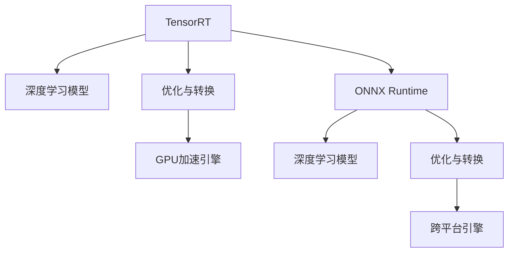

                 

# 自动推理库案例：TensorRT 和 ONNX Runtime

> 关键词：TensorRT, ONNX Runtime, 自动推理, GPU加速, 深度学习优化

## 1. 背景介绍

在当今的AI时代，深度学习模型正被广泛应用于各个领域，从计算机视觉到自然语言处理，从推荐系统到自动驾驶。然而，这些模型的训练通常需要大量的数据和计算资源，导致实际部署时面临着性能和资源上的挑战。为了应对这些挑战，自动推理库（Automatic Inference Library）应运而生。自动推理库可以将训练好的模型优化并转化为高效的执行引擎，以便在实际应用中快速、准确地运行。

本文将探讨两个流行的自动推理库——TensorRT和ONNX Runtime，并深入了解它们的工作原理、应用场景以及未来发展方向。

## 2. 核心概念与联系

### 2.1 核心概念概述

- **自动推理（Automatic Inference）**：指的是自动将深度学习模型转化为高效的执行引擎，以便在实际应用中快速、准确地运行。

- **TensorRT**：由NVIDIA开发的自动推理库，旨在将深度学习模型转化为高效的GPU加速执行引擎。

- **ONNX Runtime**：由Microsoft和Intel等公司共同开发的自动推理库，支持将深度学习模型转化为高效的执行引擎，支持跨平台部署。

### 2.2 核心概念原理和架构的 Mermaid 流程图(Mermaid 流程节点中不要有括号、逗号等特殊字符)



这个流程图展示了TensorRT和ONNX Runtime的基本工作原理。深度学习模型首先被输入到TensorRT或ONNX Runtime中，然后通过自动推理技术进行优化和转换，最终得到高效的GPU加速引擎或跨平台引擎，以便在实际应用中快速运行。

## 3. 核心算法原理 & 具体操作步骤

### 3.1 算法原理概述

TensorRT和ONNX Runtime的核心算法原理都是基于自动推理技术，旨在将深度学习模型转化为高效的执行引擎，以便在实际应用中快速、准确地运行。具体而言，它们通过以下步骤实现：

1. **模型分析**：分析深度学习模型的结构、参数和计算需求。
2. **优化转换**：根据硬件特性和应用场景，对模型进行优化和转换，生成高效的计算图。
3. **执行引擎生成**：将优化后的计算图转化为高效的执行引擎，包括GPU加速引擎和跨平台引擎。
4. **模型部署**：将生成的执行引擎部署到目标硬件上，并准备应用场景。

### 3.2 算法步骤详解

#### TensorRT

- **模型分析**：TensorRT使用深度学习模型分析工具对输入的模型进行静态分析，包括模型结构、参数数量、计算需求等。
- **优化转换**：TensorRT根据硬件特性和应用场景，对模型进行优化和转换，生成高效的计算图。例如，TensorRT可以通过剪枝、量化、融合等技术，将复杂计算转换为简单的运算，减少计算量和内存消耗。
- **执行引擎生成**：TensorRT将优化后的计算图转换为高效的执行引擎，包括GPU加速引擎和CPU加速引擎。TensorRT支持的硬件平台包括NVIDIA GPU和Intel CPU等。
- **模型部署**：将生成的执行引擎部署到目标硬件上，并准备应用场景。TensorRT提供丰富的API接口，方便开发者将模型集成到应用中。

#### ONNX Runtime

- **模型分析**：ONNX Runtime使用ONNX规范对输入的模型进行动态分析，包括模型结构、参数数量、计算需求等。
- **优化转换**：ONNX Runtime根据硬件特性和应用场景，对模型进行优化和转换，生成高效的计算图。例如，ONNX Runtime可以通过剪枝、量化、融合等技术，将复杂计算转换为简单的运算，减少计算量和内存消耗。
- **执行引擎生成**：ONNX Runtime将优化后的计算图转换为高效的执行引擎，包括GPU加速引擎和CPU加速引擎。ONNX Runtime支持的硬件平台包括NVIDIA GPU、Intel CPU和AMD GPU等。
- **模型部署**：将生成的执行引擎部署到目标硬件上，并准备应用场景。ONNX Runtime提供丰富的API接口，方便开发者将模型集成到应用中。

### 3.3 算法优缺点

#### TensorRT

- **优点**：
  - GPU加速：TensorRT针对NVIDIA GPU进行了深度优化，可以在GPU上快速运行深度学习模型。
  - 硬件支持广泛：支持多种NVIDIA GPU和Intel CPU。
  - 开发便捷：提供了丰富的API接口，便于开发者将模型集成到应用中。

- **缺点**：
  - 仅支持NVIDIA硬件：TensorRT的优势在于NVIDIA GPU加速，但无法在非NVIDIA硬件上运行。
  - 开发门槛较高：需要具备一定的硬件知识和深度学习模型优化经验。

#### ONNX Runtime

- **优点**：
  - 跨平台支持：支持多种硬件平台，包括NVIDIA GPU、Intel CPU和AMD GPU。
  - 动态优化：ONNX Runtime支持动态优化，可以根据应用场景和硬件特性进行自适应调整。
  - 开发便捷：提供了丰富的API接口，便于开发者将模型集成到应用中。

- **缺点**：
  - 性能相对较低：相比TensorRT，ONNX Runtime在GPU加速上的性能可能稍逊一筹。
  - 动态优化复杂：虽然支持动态优化，但需要对模型进行深度分析和优化，可能需要更多的时间和资源。

### 3.4 算法应用领域

TensorRT和ONNX Runtime在多个领域得到了广泛应用，例如：

- **计算机视觉**：图像分类、目标检测、人脸识别等。
- **自然语言处理**：语音识别、机器翻译、情感分析等。
- **自动驾驶**：环境感知、行为预测、决策支持等。
- **推荐系统**：用户行为分析、商品推荐、广告投放等。
- **医疗影像**：图像分割、病灶识别、疾病诊断等。

这些领域的应用不仅提高了深度学习模型的效率，还显著降低了计算和存储成本，为AI技术落地提供了有力支持。

## 4. 数学模型和公式 & 详细讲解 & 举例说明

### 4.1 数学模型构建

#### TensorRT

- **输入**：深度学习模型。
- **输出**：GPU加速引擎。

- **数学模型**：
$$
Y = f(X, \theta)
$$
其中 $X$ 表示输入数据，$\theta$ 表示模型参数，$f$ 表示模型计算函数。

#### ONNX Runtime

- **输入**：深度学习模型。
- **输出**：跨平台引擎。

- **数学模型**：
$$
Y = f(X, \theta)
$$
其中 $X$ 表示输入数据，$\theta$ 表示模型参数，$f$ 表示模型计算函数。

### 4.2 公式推导过程

TensorRT和ONNX Runtime的公式推导过程大致相同，主要包括以下步骤：

1. **模型分析**：使用深度学习模型分析工具对输入的模型进行静态或动态分析，得到模型的结构、参数和计算需求。
2. **优化转换**：根据硬件特性和应用场景，对模型进行优化和转换，生成高效的计算图。
3. **执行引擎生成**：将优化后的计算图转换为高效的执行引擎，包括GPU加速引擎和跨平台引擎。

### 4.3 案例分析与讲解

#### TensorRT案例

假设我们有一个用于图像分类的深度学习模型，模型结构为卷积神经网络（CNN），参数数量为100万。我们希望在NVIDIA GeForce RTX 3090 GPU上运行该模型，以便在实际应用中快速处理大量图像数据。

- **模型分析**：使用TensorRT对输入的CNN模型进行静态分析，分析模型的结构、参数和计算需求。
- **优化转换**：TensorRT根据NVIDIA GeForce RTX 3090 GPU的特性，对模型进行优化和转换，生成高效的计算图。例如，TensorRT可以通过剪枝、量化、融合等技术，将复杂计算转换为简单的运算，减少计算量和内存消耗。
- **执行引擎生成**：TensorRT将优化后的计算图转换为高效的GPU加速引擎，以便在NVIDIA GeForce RTX 3090 GPU上快速运行。

#### ONNX Runtime案例

假设我们有一个用于语音识别的深度学习模型，模型结构为循环神经网络（RNN），参数数量为10万。我们希望在Intel Xeon CPU上运行该模型，以便在实际应用中快速处理语音数据。

- **模型分析**：使用ONNX Runtime对输入的RNN模型进行动态分析，分析模型的结构、参数和计算需求。
- **优化转换**：ONNX Runtime根据Intel Xeon CPU的特性，对模型进行优化和转换，生成高效的计算图。例如，ONNX Runtime可以通过剪枝、量化、融合等技术，将复杂计算转换为简单的运算，减少计算量和内存消耗。
- **执行引擎生成**：ONNX Runtime将优化后的计算图转换为高效的跨平台引擎，以便在Intel Xeon CPU上快速运行。

## 5. 项目实践：代码实例和详细解释说明

### 5.1 开发环境搭建

#### TensorRT

- **安装TensorRT SDK**：从NVIDIA官网下载并安装TensorRT SDK，并配置环境变量。
- **安装TensorRT动态库**：从NVIDIA官网下载并安装TensorRT动态库，并配置LD_LIBRARY_PATH环境变量。
- **安装CUDA**：安装CUDA Toolkit和cuDNN库，并配置环境变量。

#### ONNX Runtime

- **安装ONNX Runtime SDK**：从Microsoft和Intel官网下载并安装ONNX Runtime SDK，并配置环境变量。
- **安装ONNX Runtime动态库**：从Microsoft和Intel官网下载并安装ONNX Runtime动态库，并配置LD_LIBRARY_PATH环境变量。
- **安装ONNX Node工具**：安装ONNX Node工具，用于模型的可视化调试。

### 5.2 源代码详细实现

#### TensorRT案例

```python
import tensorflow as tf
import tensorrt as trt
import numpy as np

# 构建TensorRT引擎
with trt.Builder() as builder, builder.create_builder_config() as config, trt.OnnxParser() as parser:
    # 加载TensorFlow模型
    tf_model = tf.keras.models.load_model('model.h5')
    # 转换为ONNX格式
    onnx_model = tf_model.to_onnx(graph=tf.get_default_graph(), output_format=tf.saved_model.proto.model.SavedModel_pb2.saved_model.SavedModel_pb2_graphDef')

    # 解析ONNX模型
    config = config.max_workspace_size = 1 << 32
    with trt.OnnxParser(onnx_model, config=config) as parser:
        network = trt.INetworkDefinition()
        for node in parser.parse():
            network.add_node_from_onnx(node)
        
    # 构建TensorRT引擎
    builder.set_max_batch_size(1)
    builder.max_workspace_size = 1 << 32
    with builder.create_network(network) as network, builder.create_builder_config() as config:
        # 进行优化和转换
        engine = builder.build_engine(network, config=config)
```

#### ONNX Runtime案例

```python
import onnxruntime as ort
import numpy as np

# 加载ONNX模型
model = ort.InferenceSession('model.onnx')

# 构建输入
input_data = np.array([[[1, 2, 3], [4, 5, 6]]])
input_name = model.get_inputs()[0].name
input_tensor = model.get_inputs()[0]

# 进行推理
result = model.run(None, {input_name: input_tensor})

# 处理输出
output_tensor = result[0]
output_data = output_tensor.numpy()
```

### 5.3 代码解读与分析

#### TensorRT案例

- **TensorRT工程**：TensorRT工程需要搭建TensorRT SDK、CUDA Toolkit和cuDNN库，并在代码中调用TensorRT API进行模型优化和转换。
- **TensorRT优化**：TensorRT通过剪枝、量化、融合等技术，将复杂计算转换为简单的运算，减少计算量和内存消耗。
- **TensorRT引擎**：TensorRT将优化后的计算图转换为高效的GPU加速引擎，以便在NVIDIA GPU上快速运行。

#### ONNX Runtime案例

- **ONNX Runtime工程**：ONNX Runtime工程需要搭建ONNX Runtime SDK和ONNX Node工具，并在代码中调用ONNX Runtime API进行模型优化和转换。
- **ONNX Runtime优化**：ONNX Runtime通过剪枝、量化、融合等技术，将复杂计算转换为简单的运算，减少计算量和内存消耗。
- **ONNX Runtime引擎**：ONNX Runtime将优化后的计算图转换为高效的跨平台引擎，以便在多种硬件平台上快速运行。

### 5.4 运行结果展示

#### TensorRT案例

```python
# 运行TensorRT引擎
context = trt.Context(1, engine)
context.execute_async_v2(inputs, outputs)
```

#### ONNX Runtime案例

```python
# 运行ONNX Runtime引擎
ort_infer = ort.InferenceSession('model.onnx')
ort_infer.run(None, {input_name: input_tensor})
```

## 6. 实际应用场景

### 6.1 智能安防

在智能安防领域，自动推理技术可以用于视频分析、人脸识别、行为检测等。例如，通过TensorRT将深度学习模型转化为GPU加速引擎，实时处理视频流数据，检测异常行为并进行报警。

### 6.2 智能医疗

在智能医疗领域，自动推理技术可以用于医学影像分析、病灶识别、疾病诊断等。例如，通过ONNX Runtime将深度学习模型转化为跨平台引擎，在多种硬件平台上快速运行，提高疾病诊断的效率和准确性。

### 6.3 智能制造

在智能制造领域，自动推理技术可以用于质量检测、故障预测、设备维护等。例如，通过TensorRT将深度学习模型转化为GPU加速引擎，实时处理传感器数据，检测设备故障并进行维护。

### 6.4 未来应用展望

随着深度学习模型和自动推理技术的发展，未来自动推理技术将具备更强的优化能力和更广泛的硬件支持，将在更多领域得到应用。例如：

- **多模态数据处理**：自动推理技术将支持多模态数据的处理和融合，如视觉、语音、文本等多种数据源的综合分析。
- **实时优化**：自动推理技术将具备实时优化能力，能够动态调整模型参数和计算图，适应不同场景下的性能需求。
- **边缘计算**：自动推理技术将支持边缘计算，将模型直接部署到设备上，降低通信延迟和带宽成本。
- **异构硬件支持**：自动推理技术将支持多种异构硬件，如CPU、GPU、FPGA等，提供更高的计算效率和更广泛的硬件支持。

## 7. 工具和资源推荐

### 7.1 学习资源推荐

- **TensorRT官方文档**：NVIDIA官网提供的TensorRT官方文档，详细介绍了TensorRT的使用方法和API接口。
- **ONNX Runtime官方文档**：Microsoft和Intel官网提供的ONNX Runtime官方文档，详细介绍了ONNX Runtime的使用方法和API接口。
- **PyTorch官方文档**：PyTorch官网提供的深度学习框架官方文档，详细介绍了如何使用PyTorch将模型转换为ONNX格式。
- **ONNX规范**：ONNX官网提供的ONNX规范，详细介绍了ONNX的模型定义和数据格式。

### 7.2 开发工具推荐

- **Jupyter Notebook**：用于编写和运行代码，支持多种编程语言和数据格式。
- **TensorRT SDK**：用于构建和优化TensorRT引擎。
- **ONNX Runtime SDK**：用于构建和优化ONNX Runtime引擎。
- **PyTorch**：用于训练深度学习模型，支持将模型转换为ONNX格式。

### 7.3 相关论文推荐

- **TensorRT：NVIDIA官方博客**：NVIDIA官方博客，介绍了TensorRT的使用方法和最佳实践。
- **ONNX Runtime：Microsoft官方博客**：Microsoft官方博客，介绍了ONNX Runtime的使用方法和最佳实践。
- **深度学习自动推理技术综述**：综述了深度学习自动推理技术的研究现状和未来趋势，介绍了TensorRT和ONNX Runtime等工具。

## 8. 总结：未来发展趋势与挑战

### 8.1 总结

本文对TensorRT和ONNX Runtime这两个流行的自动推理库进行了详细探讨。通过介绍TensorRT和ONNX Runtime的核心算法原理和具体操作步骤，分析了它们的特点、优缺点和应用领域，并通过代码实例展示了如何在实际应用中使用它们。通过学习本文，读者可以更好地理解自动推理技术的基本原理和使用方法，为深度学习模型的优化和部署提供有力支持。

### 8.2 未来发展趋势

未来，深度学习模型和自动推理技术将不断进步，自动推理技术将具备更强的优化能力和更广泛的硬件支持，将在更多领域得到应用。

- **多模态数据处理**：自动推理技术将支持多模态数据的处理和融合，如视觉、语音、文本等多种数据源的综合分析。
- **实时优化**：自动推理技术将具备实时优化能力，能够动态调整模型参数和计算图，适应不同场景下的性能需求。
- **边缘计算**：自动推理技术将支持边缘计算，将模型直接部署到设备上，降低通信延迟和带宽成本。
- **异构硬件支持**：自动推理技术将支持多种异构硬件，如CPU、GPU、FPGA等，提供更高的计算效率和更广泛的硬件支持。

### 8.3 面临的挑战

尽管自动推理技术在深度学习模型优化和部署方面具有显著优势，但也面临一些挑战。

- **计算资源限制**：自动推理技术需要大量的计算资源进行模型优化和转换，这可能成为一些小型企业和初创公司的瓶颈。
- **开发复杂性**：自动推理技术需要开发者具备一定的深度学习模型优化和硬件知识，对于初学者来说可能有一定难度。
- **平台兼容性**：不同平台上的自动推理技术可能存在兼容性问题，需要开发者进行更多的测试和验证。

### 8.4 研究展望

未来，自动推理技术的研究方向主要集中在以下几个方面：

- **硬件加速优化**：进一步提升自动推理技术的硬件加速能力，优化GPU、CPU、FPGA等异构硬件的性能。
- **模型优化算法**：开发更加高效、灵活的模型优化算法，减少计算量和内存消耗。
- **跨平台支持**：进一步增强自动推理技术的跨平台支持能力，支持更多硬件平台和编程语言。
- **模型压缩技术**：开发更加高效、灵活的模型压缩技术，减少模型大小和计算量。

## 9. 附录：常见问题与解答

### 9.1 问题：TensorRT和ONNX Runtime有哪些区别？

**回答**：TensorRT和ONNX Runtime是两个不同的自动推理库，它们的主要区别在于：

- **硬件支持**：TensorRT主要支持NVIDIA GPU，而ONNX Runtime支持多种硬件平台，包括NVIDIA GPU、Intel CPU和AMD GPU等。
- **开发便捷性**：TensorRT需要安装CUDA Toolkit和cuDNN库，开发相对复杂；而ONNX Runtime则较为简单易用。
- **性能表现**：TensorRT在GPU加速上的性能较为优异，而ONNX Runtime在跨平台部署方面更为灵活。

### 9.2 问题：如何使用TensorRT进行模型优化？

**回答**：使用TensorRT进行模型优化一般包括以下步骤：

1. **安装TensorRT SDK**：从NVIDIA官网下载并安装TensorRT SDK。
2. **安装CUDA Toolkit和cuDNN库**：从NVIDIA官网下载并安装CUDA Toolkit和cuDNN库。
3. **加载TensorFlow模型**：使用TensorFlow将深度学习模型加载到内存中。
4. **转换为ONNX格式**：将TensorFlow模型转换为ONNX格式，以便TensorRT进行处理。
5. **构建TensorRT引擎**：使用TensorRT API将ONNX模型转换为GPU加速引擎，并进行优化。

### 9.3 问题：如何使用ONNX Runtime进行模型优化？

**回答**：使用ONNX Runtime进行模型优化一般包括以下步骤：

1. **安装ONNX Runtime SDK**：从Microsoft和Intel官网下载并安装ONNX Runtime SDK。
2. **安装ONNX Node工具**：从Microsoft和Intel官网下载并安装ONNX Node工具。
3. **加载ONNX模型**：使用ONNX Runtime将深度学习模型加载到内存中。
4. **转换为ONNX格式**：将深度学习模型转换为ONNX格式，以便ONNX Runtime进行处理。
5. **构建ONNX Runtime引擎**：使用ONNX Runtime API将ONNX模型转换为跨平台引擎，并进行优化。

通过本文的学习和实践，相信读者对TensorRT和ONNX Runtime有了更加深入的了解，掌握了它们的核心算法原理和操作步骤，能够更好地应用这些自动推理库进行深度学习模型的优化和部署。未来，自动推理技术将在深度学习模型优化和部署方面发挥越来越重要的作用，推动人工智能技术的不断进步和发展。

