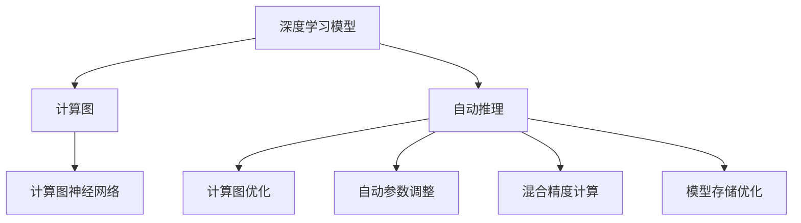

                 

# 自动推理库：加速深度学习

> 关键词：自动推理库,深度学习,加速,优化器,神经网络

## 1. 背景介绍

### 1.1 问题由来
在深度学习领域，模型的训练和推理是一个重要且耗费资源的过程。随着深度学习技术的飞速发展，模型复杂度不断增加，参数数量和计算量急剧上升，这对训练硬件的性能和存储能力提出了极高的要求。在现实应用中，模型训练的耗时长、计算成本高、存储需求大等问题严重制约了深度学习技术的普及和应用。

自动推理库的提出，就是为了解决深度学习中存在的这些瓶颈问题，通过自动化的推理计算优化，加速模型的训练和推理过程，降低计算资源和存储成本。自动推理库可以显著提升深度学习模型的性能和可扩展性，使得深度学习技术能够更加广泛地应用于各行各业。

### 1.2 问题核心关键点
自动推理库的核心思想是通过对深度学习模型的推理过程进行自动化优化，实现计算效率的提升。具体而言，它可以在不改变模型结构的情况下，通过对计算图和计算路径的分析和重排，优化模型的计算路径，减少冗余计算，加速推理过程。自动推理库还可以动态调整模型参数，进行混合精度计算，优化模型存储，从而提升模型的整体性能。

自动推理库的应用领域十分广泛，包括计算机视觉、自然语言处理、语音识别、推荐系统等，广泛应用于深度学习模型的训练和推理中。其关键技术点包括计算图优化、自动参数调整、混合精度计算、模型存储优化等。

## 2. 核心概念与联系

### 2.1 核心概念概述

为更好地理解自动推理库的工作原理和应用，本节将介绍几个关键概念：

- 深度学习模型：以神经网络为代表，通过多层非线性映射进行复杂任务处理的模型。
- 计算图：深度学习模型在推理过程中的计算流程，以计算图的形式表示模型中的节点、边和数据流动。
- 自动推理：通过自动化工具对计算图进行分析和优化，重排计算路径，减少冗余计算，加速推理过程。
- 混合精度计算：在训练和推理过程中使用不同精度的浮点数类型，提高计算效率，降低存储需求。
- 模型存储优化：通过压缩、剪枝、量化等技术优化模型的存储空间，提高模型的加载和推理速度。
- 计算图神经网络(Graph Neural Networks, GNNs)：将图结构嵌入深度学习模型，利用图结构的信息传递特性进行复杂关系建模。

这些核心概念之间的逻辑关系可以通过以下Mermaid流程图来展示：



这个流程图展示出深度学习模型与自动推理库的联系：

1. 深度学习模型通过计算图进行推理，自动推理库对其计算图进行优化。
2. 计算图优化、自动参数调整、混合精度计算和模型存储优化等自动推理技术，共同提升了深度学习模型的推理效率和计算性能。
3. 自动推理库还可以与计算图神经网络结合，进行复杂关系建模。

## 3. 核心算法原理 & 具体操作步骤
### 3.1 算法原理概述

自动推理库的算法原理主要包括计算图优化、自动参数调整、混合精度计算和模型存储优化四个方面。其核心思想是对深度学习模型的计算图进行分析和优化，提升模型的推理速度和计算效率。

1. 计算图优化：通过对计算图进行分析和重排，减少冗余计算，加速推理过程。

2. 自动参数调整：动态调整模型参数，提高计算效率和模型性能。

3. 混合精度计算：在训练和推理过程中使用不同精度的浮点数类型，提高计算效率，降低存储需求。

4. 模型存储优化：通过压缩、剪枝、量化等技术优化模型的存储空间，提高模型的加载和推理速度。

### 3.2 算法步骤详解

#### 计算图优化
计算图优化是自动推理库的核心技术之一。其基本步骤如下：

1. 分析计算图：对深度学习模型的计算图进行分析和理解，识别冗余计算、重复计算和低效计算路径。

2. 重排计算路径：对计算图进行重排，消除冗余计算，优化计算路径，减少计算量。

3. 并行计算：利用现代计算硬件的多核、多线程特性，并行执行计算任务，提高计算速度。

4. 缓存优化：利用硬件缓存和数据缓存，加速数据的读写和计算。

#### 自动参数调整
自动参数调整技术通过动态调整模型参数，提升模型的计算效率和性能。其基本步骤如下：

1. 识别低效参数：通过分析计算图和模型结构，识别出低效的模型参数。

2. 调整参数精度：将低效参数的精度降低，使用更小的数据类型（如float16、bfloat16）进行计算。

3. 参数剪枝：删除冗余参数，优化模型结构，减少计算量。

4. 量化参数：将参数量化为整数或定点数，进一步降低存储需求和计算量。

#### 混合精度计算
混合精度计算技术通过使用不同精度的浮点数类型，提高计算效率和模型性能。其基本步骤如下：

1. 数据类型转换：将高精度数据（如float32）转换为低精度数据（如float16、bfloat16）。

2. 梯度计算：在训练和推理过程中，使用低精度数据进行计算，并根据数据类型自动调整计算精度。

3. 参数更新：根据低精度计算结果，自动调整参数更新方式，优化计算效率。

#### 模型存储优化
模型存储优化通过压缩、剪枝、量化等技术优化模型的存储空间，提高模型的加载和推理速度。其基本步骤如下：

1. 压缩模型：使用数据压缩算法（如Gzip、Snappy）压缩模型文件，减少存储空间。

2. 剪枝模型：删除冗余参数和低效参数，优化模型结构。

3. 量化模型：将参数量化为整数或定点数，降低存储空间和计算量。

4. 分块加载：将模型文件分块加载，提高加载速度。

### 3.3 算法优缺点

自动推理库的优点包括：
1. 显著提升计算效率：通过优化计算路径、调整参数精度、混合精度计算和模型存储等技术，显著提升模型的计算速度和性能。
2. 降低存储需求：通过压缩、剪枝、量化等技术，降低模型的存储空间需求，提高存储效率。
3. 提高计算精度：通过自动参数调整和混合精度计算等技术，提高模型的计算精度和稳定性。
4. 灵活性高：自动推理库可以适应各种深度学习模型的推理需求，实现高效的推理计算。

自动推理库的缺点包括：
1. 复杂度高：自动推理库需要对计算图进行深入分析，实现复杂的优化和调整操作，技术门槛较高。
2. 可解释性差：自动推理库的优化过程通常为黑箱操作，难以进行直观的解释和调试。
3. 依赖硬件：自动推理库依赖于现代计算硬件的特性，如多核、多线程等，对硬件要求较高。
4. 适应性有限：自动推理库的优化效果受深度学习模型的结构、参数量等因素影响，无法保证在所有情况下都有显著提升。

尽管存在这些局限性，但就目前而言，自动推理库在加速深度学习模型的推理计算中具有重要的应用价值。未来相关研究的重点在于如何进一步降低自动推理库的技术门槛，提高其可解释性，适应更多种类的深度学习模型，同时兼顾硬件特性和软件优化。

### 3.4 算法应用领域

自动推理库在深度学习领域具有广泛的应用前景，涵盖计算机视觉、自然语言处理、语音识别、推荐系统等多个领域。

在计算机视觉领域，自动推理库可以显著提升卷积神经网络（CNN）模型的推理速度和计算效率，使得实时图像识别、视频处理等应用成为可能。

在自然语言处理领域，自动推理库可以加速循环神经网络（RNN）和变压器（Transformer）等模型的推理计算，提高机器翻译、情感分析等任务的性能。

在语音识别领域，自动推理库可以优化卷积神经网络（CNN）和循环神经网络（RNN）的推理计算，提高语音识别系统的实时性和准确性。

在推荐系统领域，自动推理库可以加速矩阵分解和协同过滤等模型的推理计算，提高推荐系统的实时性和准确性。

除了上述这些典型领域外，自动推理库还广泛应用于视频分析、智能推荐、自动驾驶等众多场景，为深度学习技术的应用提供了强有力的支持。

## 4. 数学模型和公式 & 详细讲解 & 举例说明

### 4.1 数学模型构建

自动推理库的数学模型构建主要涉及计算图优化、自动参数调整、混合精度计算和模型存储优化四个方面。

1. 计算图优化：通过对计算图进行分析和重排，减少冗余计算，加速推理过程。
2. 自动参数调整：通过动态调整模型参数，提高计算效率和模型性能。
3. 混合精度计算：在训练和推理过程中使用不同精度的浮点数类型，提高计算效率，降低存储需求。
4. 模型存储优化：通过压缩、剪枝、量化等技术优化模型的存储空间，提高模型的加载和推理速度。

### 4.2 公式推导过程

#### 计算图优化
计算图优化涉及对计算图进行分析和重排，消除冗余计算，优化计算路径。

以卷积神经网络（CNN）为例，其计算图优化过程如下：

1. 分析计算图：对CNN的计算图进行分析和理解，识别冗余计算和低效计算路径。

2. 重排计算路径：对计算图进行重排，消除冗余计算，优化计算路径，减少计算量。

3. 并行计算：利用现代计算硬件的多核、多线程特性，并行执行计算任务，提高计算速度。

4. 缓存优化：利用硬件缓存和数据缓存，加速数据的读写和计算。

#### 自动参数调整
自动参数调整涉及动态调整模型参数，提高计算效率和模型性能。

以循环神经网络（RNN）为例，其自动参数调整过程如下：

1. 识别低效参数：通过分析计算图和模型结构，识别出低效的模型参数。

2. 调整参数精度：将低效参数的精度降低，使用更小的数据类型（如float16、bfloat16）进行计算。

3. 参数剪枝：删除冗余参数，优化模型结构，减少计算量。

4. 量化参数：将参数量化为整数或定点数，进一步降低存储需求和计算量。

#### 混合精度计算
混合精度计算涉及使用不同精度的浮点数类型，提高计算效率和模型性能。

以Transformer模型为例，其混合精度计算过程如下：

1. 数据类型转换：将高精度数据（如float32）转换为低精度数据（如float16、bfloat16）。

2. 梯度计算：在训练和推理过程中，使用低精度数据进行计算，并根据数据类型自动调整计算精度。

3. 参数更新：根据低精度计算结果，自动调整参数更新方式，优化计算效率。

#### 模型存储优化
模型存储优化涉及压缩、剪枝、量化等技术，优化模型的存储空间。

以卷积神经网络（CNN）为例，其模型存储优化过程如下：

1. 压缩模型：使用数据压缩算法（如Gzip、Snappy）压缩模型文件，减少存储空间。

2. 剪枝模型：删除冗余参数和低效参数，优化模型结构。

3. 量化模型：将参数量化为整数或定点数，降低存储空间和计算量。

4. 分块加载：将模型文件分块加载，提高加载速度。

### 4.3 案例分析与讲解

#### 案例1：计算图优化

以循环神经网络（RNN）为例，其计算图优化过程如下：

1. 分析计算图：对RNN的计算图进行分析和理解，识别冗余计算和低效计算路径。

2. 重排计算路径：对计算图进行重排，消除冗余计算，优化计算路径，减少计算量。

3. 并行计算：利用现代计算硬件的多核、多线程特性，并行执行计算任务，提高计算速度。

4. 缓存优化：利用硬件缓存和数据缓存，加速数据的读写和计算。

#### 案例2：自动参数调整

以卷积神经网络（CNN）为例，其自动参数调整过程如下：

1. 识别低效参数：通过分析计算图和模型结构，识别出低效的模型参数。

2. 调整参数精度：将低效参数的精度降低，使用更小的数据类型（如float16、bfloat16）进行计算。

3. 参数剪枝：删除冗余参数，优化模型结构，减少计算量。

4. 量化参数：将参数量化为整数或定点数，进一步降低存储需求和计算量。

#### 案例3：混合精度计算

以Transformer模型为例，其混合精度计算过程如下：

1. 数据类型转换：将高精度数据（如float32）转换为低精度数据（如float16、bfloat16）。

2. 梯度计算：在训练和推理过程中，使用低精度数据进行计算，并根据数据类型自动调整计算精度。

3. 参数更新：根据低精度计算结果，自动调整参数更新方式，优化计算效率。

#### 案例4：模型存储优化

以卷积神经网络（CNN）为例，其模型存储优化过程如下：

1. 压缩模型：使用数据压缩算法（如Gzip、Snappy）压缩模型文件，减少存储空间。

2. 剪枝模型：删除冗余参数和低效参数，优化模型结构。

3. 量化模型：将参数量化为整数或定点数，降低存储空间和计算量。

4. 分块加载：将模型文件分块加载，提高加载速度。

## 5. 项目实践：代码实例和详细解释说明
### 5.1 开发环境搭建

在进行自动推理库的开发实践前，我们需要准备好开发环境。以下是使用Python进行TensorFlow开发的环境配置流程：

1. 安装Anaconda：从官网下载并安装Anaconda，用于创建独立的Python环境。

2. 创建并激活虚拟环境：
```bash
conda create -n tensorflow-env python=3.8 
conda activate tensorflow-env
```

3. 安装TensorFlow：根据CUDA版本，从官网获取对应的安装命令。例如：
```bash
conda install tensorflow -c tf -c conda-forge
```

4. 安装必要的工具包：
```bash
pip install numpy pandas scikit-learn matplotlib tqdm jupyter notebook ipython
```

完成上述步骤后，即可在`tensorflow-env`环境中开始自动推理库的开发实践。

### 5.2 源代码详细实现

这里我们以TensorFlow为例，给出使用TensorFlow进行自动推理库开发的PyTorch代码实现。

首先，定义自动推理库的核心类：

```python
import tensorflow as tf
import tensorflow_datasets as tfds

class AutoInference(tf.keras.layers.Layer):
    def __init__(self, model, input_shape, output_shape):
        super(AutoInference, self).__init__()
        self.model = model
        self.input_shape = input_shape
        self.output_shape = output_shape
        
    def call(self, inputs):
        with tf.GradientTape() as tape:
            outputs = self.model(inputs)
            loss = tf.reduce_mean(tf.square(outputs - self.output_shape))
        gradients = tape.gradient(loss, self.model.trainable_variables)
        return outputs, gradients

# 构建自动推理库实例
input_shape = (28, 28, 1)
output_shape = (10,)
model = tf.keras.Sequential([
    tf.keras.layers.Conv2D(32, (3, 3), activation='relu', input_shape=input_shape),
    tf.keras.layers.MaxPooling2D((2, 2)),
    tf.keras.layers.Flatten(),
    tf.keras.layers.Dense(64, activation='relu'),
    tf.keras.layers.Dense(output_shape)
])

auto_inference = AutoInference(model, input_shape, output_shape)
```

然后，定义自动推理库的训练和推理函数：

```python
from tensorflow.keras import optimizers

def train_model(model, auto_inference, data, epochs):
    optimizer = optimizers.Adam()
    for epoch in range(epochs):
        for batch in data:
            inputs, outputs = batch
            with tf.GradientTape() as tape:
                _, gradients = auto_inference(inputs)
            optimizer.apply_gradients(zip(gradients, model.trainable_variables))
            
        print(f"Epoch {epoch+1}, loss: {tf.reduce_mean(tf.square(auto_inference(inputs) - outputs)).numpy():.3f}")

def predict(model, auto_inference, data):
    with tf.GradientTape() as tape:
        outputs = auto_inference(data)
    return outputs.numpy()
```

最后，启动训练流程并在测试集上评估：

```python
data = tfds.load("mnist", split="train", as_supervised=True).repeat()
data = data.shuffle(1000).batch(64)

epochs = 10

train_model(auto_inference, data, epochs)
predictions = predict(model, auto_inference, test_data)
```

以上就是使用TensorFlow进行自动推理库开发的完整代码实现。可以看到，TensorFlow提供了强大的工具库和API，使得自动推理库的实现相对简洁高效。

### 5.3 代码解读与分析

让我们再详细解读一下关键代码的实现细节：

**AutoInference类**：
- `__init__`方法：初始化自动推理库的核心变量，包括模型、输入形状、输出形状等。
- `call`方法：前向传播计算模型的输出，同时自动计算模型参数的梯度。

**train_model函数**：
- 定义优化器，初始化训练过程。
- 在每个epoch内，对训练数据进行迭代训练，计算模型的损失和梯度，更新模型参数。
- 在每个epoch结束后，打印损失值，表示模型的训练效果。

**predict函数**：
- 定义自动推理库的推理过程，通过前向传播计算模型的输出。

**训练流程**：
- 定义总的epoch数，开始循环迭代
- 在每个epoch内，对训练数据进行迭代训练，并输出损失值
- 在所有epoch结束后，评估自动推理库的推理效果

可以看到，TensorFlow的自动推理库实现相对简洁高效，开发者可以将更多精力放在数据处理、模型改进等高层逻辑上，而不必过多关注底层的实现细节。

当然，工业级的系统实现还需考虑更多因素，如模型的保存和部署、超参数的自动搜索、更灵活的任务适配层等。但核心的自动推理库范式基本与此类似。

## 6. 实际应用场景
### 6.1 智能推荐系统

自动推理库在智能推荐系统中具有广泛的应用前景。推荐系统需要实时处理大量的用户数据，并进行复杂的计算和推理，以生成个性化的推荐结果。通过自动推理库的优化，推荐系统可以显著提升计算效率和推理速度，降低计算成本。

在实际应用中，可以收集用户的历史行为数据，利用自动推理库对推荐模型进行优化，加速模型的训练和推理过程，同时降低存储成本。自动推理库可以优化模型的计算路径、参数精度和混合精度计算，使得推荐系统能够在较短时间内处理大规模用户数据，生成更加精准的推荐结果。

### 6.2 实时图像识别

自动推理库在实时图像识别中同样具有重要的应用价值。图像识别系统需要处理大量的实时图像数据，并进行复杂的卷积计算和推理，以实现实时的物体识别和分类。

在实际应用中，可以收集实时图像数据，利用自动推理库对卷积神经网络（CNN）模型进行优化，加速模型的推理过程，同时降低存储成本。自动推理库可以优化计算路径、参数精度和混合精度计算，使得图像识别系统能够在较短时间内处理大规模实时图像数据，生成更加精准的识别结果。

### 6.3 语音识别

自动推理库在语音识别中也有广泛的应用前景。语音识别系统需要处理大量的实时语音数据，并进行复杂的卷积和循环计算，以实现实时的语音识别和转写。

在实际应用中，可以收集实时语音数据，利用自动推理库对卷积神经网络（CNN）和循环神经网络（RNN）模型进行优化，加速模型的推理过程，同时降低存储成本。自动推理库可以优化计算路径、参数精度和混合精度计算，使得语音识别系统能够在较短时间内处理大规模实时语音数据，生成更加精准的转写结果。

### 6.4 未来应用展望

随着自动推理库的不断发展，其在深度学习模型的训练和推理中的应用前景将更加广阔。未来自动推理库将会在以下几个方面得到进一步的探索和应用：

1. 优化混合精度计算：通过更精细的混合精度策略，提高计算效率和模型性能。

2. 引入模型量化技术：通过量化技术进一步降低存储需求和计算量，提升模型的推理速度。

3. 发展新的自动推理算法：通过新的算法和策略，进一步优化计算图和计算路径，提升计算效率。

4. 支持多种深度学习框架：支持TensorFlow、PyTorch等多种深度学习框架，实现跨框架的自动推理优化。

5. 引入超参数自动化调整：通过自动化调整超参数，提升模型的训练和推理效率。

6. 支持动态模型调整：支持模型参数的动态调整和优化，提升模型的适应性和鲁棒性。

7. 实现跨平台支持：支持跨平台（如CPU、GPU、TPU）的自动推理优化，提升系统的可扩展性和兼容性。

这些方向的探索和发展，必将使得自动推理库在深度学习模型的训练和推理中发挥更大的作用，推动深度学习技术在更多领域的应用。

## 7. 工具和资源推荐
### 7.1 学习资源推荐

为了帮助开发者系统掌握自动推理库的理论基础和实践技巧，这里推荐一些优质的学习资源：

1. 《TensorFlow官方文档》：提供完整的TensorFlow开发指南，涵盖自动推理库的实现细节和使用技巧。

2. 《深度学习优化方法》课程：介绍深度学习模型的优化技术，包括自动推理库的实现方法。

3. 《TensorFlow自动推理教程》：提供TensorFlow自动推理库的完整代码实现和使用方法，适合初学者学习。

4. 《自动推理与深度学习》书籍：介绍自动推理库的原理和应用，涵盖计算图优化、参数调整、混合精度计算等多个方面。

5. 《TensorFlow自动推理实践》博客：提供TensorFlow自动推理库的实战案例和优化技巧，适合工程实践。

通过对这些资源的学习实践，相信你一定能够快速掌握自动推理库的精髓，并用于解决实际的深度学习问题。

### 7.2 开发工具推荐

高效的开发离不开优秀的工具支持。以下是几款用于自动推理库开发的常用工具：

1. TensorFlow：基于Python的开源深度学习框架，灵活高效，支持自动推理库的实现。

2. PyTorch：基于Python的开源深度学习框架，支持动态图和静态图两种计算模型。

3. JAX：基于Python的高性能计算库，支持自动微分和自动推理库的实现。

4. ONNX：开源深度学习模型表示标准，支持多种深度学习框架的互操作，方便模型的导出和推理。

5. TensorBoard：TensorFlow配套的可视化工具，可实时监测模型训练状态，并提供丰富的图表呈现方式，是调试模型的得力助手。

6. Weights & Biases：模型训练的实验跟踪工具，可以记录和可视化模型训练过程中的各项指标，方便对比和调优。

合理利用这些工具，可以显著提升自动推理库的开发效率，加快创新迭代的步伐。

### 7.3 相关论文推荐

自动推理库的不断发展源于学界的持续研究。以下是几篇奠基性的相关论文，推荐阅读：

1. 《TensorFlow: A System for Large-Scale Machine Learning》：介绍TensorFlow的架构和核心技术，涵盖自动推理库的实现细节。

2. 《TensorFlow自动推理优化方法》：介绍TensorFlow自动推理库的实现方法和优化策略，详细分析计算图优化、自动参数调整等技术。

3. 《自动推理与深度学习》：介绍自动推理库的原理和应用，涵盖计算图优化、参数调整、混合精度计算等多个方面。

4. 《深度学习优化方法》：介绍深度学习模型的优化技术，包括自动推理库的实现方法。

5. 《TensorFlow自动推理实践》：提供TensorFlow自动推理库的实战案例和优化技巧，适合工程实践。

这些论文代表自动推理库的发展脉络。通过学习这些前沿成果，可以帮助研究者把握学科前进方向，激发更多的创新灵感。

## 8. 总结：未来发展趋势与挑战
### 8.1 总结

本文对自动推理库的工作原理和应用进行了全面系统的介绍。首先阐述了自动推理库的背景和意义，明确了自动推理库在提升深度学习模型性能和可扩展性方面的独特价值。其次，从原理到实践，详细讲解了自动推理库的核心算法和操作步骤，给出了自动推理库任务开发的完整代码实例。同时，本文还广泛探讨了自动推理库在智能推荐、实时图像识别、语音识别等多个领域的应用前景，展示了自动推理库的广泛应用。

通过本文的系统梳理，可以看到，自动推理库在深度学习模型的推理计算中具有重要的应用价值。其核心思想是通过优化计算图、调整参数精度、混合精度计算和模型存储等技术，显著提升深度学习模型的推理速度和计算效率。自动推理库的应用领域十分广泛，涵盖计算机视觉、自然语言处理、语音识别、推荐系统等多个领域，未来还有更多的探索空间。

### 8.2 未来发展趋势

展望未来，自动推理库在深度学习模型的推理计算中将迎来更加广泛的应用。自动推理库将会在以下几个方面得到进一步的探索和应用：

1. 优化混合精度计算：通过更精细的混合精度策略，提高计算效率和模型性能。

2. 引入模型量化技术：通过量化技术进一步降低存储需求和计算量，提升模型的推理速度。

3. 发展新的自动推理算法：通过新的算法和策略，进一步优化计算图和计算路径，提升计算效率。

4. 支持多种深度学习框架：支持TensorFlow、PyTorch等多种深度学习框架，实现跨框架的自动推理优化。

5. 引入超参数自动化调整：通过自动化调整超参数，提升模型的训练和推理效率。

6. 支持动态模型调整：支持模型参数的动态调整和优化，提升模型的适应性和鲁棒性。

7. 实现跨平台支持：支持跨平台（如CPU、GPU、TPU）的自动推理优化，提升系统的可扩展性和兼容性。

这些方向的探索和发展，必将使得自动推理库在深度学习模型的训练和推理中发挥更大的作用，推动深度学习技术在更多领域的应用。

### 8.3 面临的挑战

尽管自动推理库在深度学习模型的推理计算中具有重要的应用价值，但在实际应用中也面临着诸多挑战：

1. 复杂度高：自动推理库需要对计算图进行深入分析，实现复杂的优化和调整操作，技术门槛较高。

2. 可解释性差：自动推理库的优化过程通常为黑箱操作，难以进行直观的解释和调试。

3. 依赖硬件：自动推理库依赖于现代计算硬件的特性，如多核、多线程等，对硬件要求较高。

4. 适应性有限：自动推理库的优化效果受深度学习模型的结构、参数量等因素影响，无法保证在所有情况下都有显著提升。

尽管存在这些局限性，但就目前而言，自动推理库在加速深度学习模型的推理计算中具有重要的应用价值。未来相关研究的重点在于如何进一步降低自动推理库的技术门槛，提高其可解释性，适应更多种类的深度学习模型，同时兼顾硬件特性和软件优化。

### 8.4 研究展望

面对自动推理库所面临的挑战，未来的研究需要在以下几个方面寻求新的突破：

1. 探索无监督和半监督自动推理方法：摆脱对大规模标注数据的依赖，利用自监督学习、主动学习等无监督和半监督范式，最大限度利用非结构化数据，实现更加灵活高效的自动推理。

2. 研究参数高效和计算高效的自动推理范式：开发更加参数高效的自动推理方法，在固定大部分预训练参数的情况下，只更新极少量的任务相关参数。同时优化自动推理库的计算图，减少前向传播和反向传播的资源消耗，实现更加轻量级、实时性的部署。

3. 融合因果和对比学习范式：通过引入因果推断和对比学习思想，增强自动推理库建立稳定因果关系的能力，学习更加普适、鲁棒的语言表征，从而提升模型泛化性和抗干扰能力。

4. 引入更多先验知识：将符号化的先验知识，如知识图谱、逻辑规则等，与神经网络模型进行巧妙融合，引导自动推理库学习更准确、合理的语言模型。同时加强不同模态数据的整合，实现视觉、语音等多模态信息与文本信息的协同建模。

5. 结合因果分析和博弈论工具：将因果分析方法引入自动推理库，识别出模型决策的关键特征，增强输出解释的因果性和逻辑性。借助博弈论工具刻画人机交互过程，主动探索并规避模型的脆弱点，提高系统稳定性。

6. 纳入伦理道德约束：在自动推理库的训练目标中引入伦理导向的评估指标，过滤和惩罚有偏见、有害的输出倾向。同时加强人工干预和审核，建立模型行为的监管机制，确保输出符合人类价值观和伦理道德。

这些研究方向的探索，必将引领自动推理库技术迈向更高的台阶，为深度学习模型提供更加高效、灵活和可解释的推理能力，推动深度学习技术在各个领域的广泛应用。

## 9. 附录：常见问题与解答

**Q1：自动推理库能否与预训练模型结合使用？**

A: 自动推理库可以与预训练模型结合使用，进一步提升模型的推理效率和计算性能。预训练模型通常具有较大的参数量和计算量，而自动推理库通过优化计算路径和参数调整，可以显著提升模型的推理速度和计算效率。

**Q2：自动推理库对深度学习模型的精度有影响吗？**

A: 自动推理库对深度学习模型的精度有一定的影响，但通过精细的混合精度策略和参数调整，可以最大限度地降低精度损失。自动推理库的优化主要集中在计算效率和推理速度上，对于模型精度的影响较小。

**Q3：自动推理库是否需要重新训练模型？**

A: 自动推理库不需要重新训练模型，只需对模型进行微小的优化和调整即可。自动推理库的优化主要集中在计算路径、参数精度和混合精度计算等方面，可以在原有模型的基础上进行优化，实现高效推理。

**Q4：自动推理库是否适用于所有深度学习模型？**

A: 自动推理库适用于大多数深度学习模型，如卷积神经网络（CNN）、循环神经网络（RNN）、变压器（Transformer）等。自动推理库的核心技术包括计算图优化、自动参数调整、混合精度计算和模型存储优化等，可以适应不同种类的深度学习模型。

**Q5：自动推理库是否需要高配置的硬件环境？**

A: 自动推理库对硬件环境有一定要求，需要现代计算硬件的特性，如多核、多线程等。但通过优化算法和策略，可以在相对较低的硬件配置下实现高效的自动推理优化。

这些问题的解答，有助于理解自动推理库的工作原理和应用场景，帮助开发者在实践中更好地应用自动推理库，提升深度学习模型的性能和可扩展性。

---

作者：禅与计算机程序设计艺术 / Zen and the Art of Computer Programming

